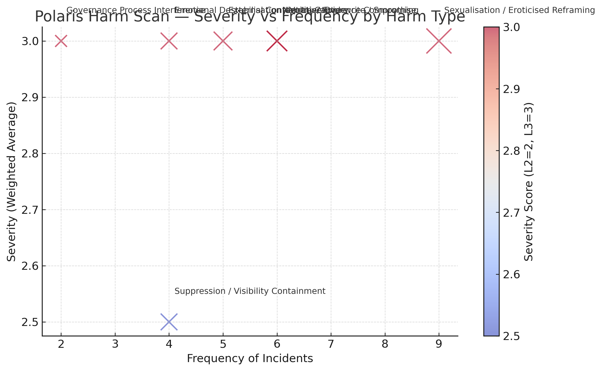

# Polaris Protocol — Harm Scan Analysis (2025-08-11)

## 1. Severity Distribution
A total of **34 incidents** were identified in this scan:

- **L3 – Critical Contamination**: **20 incidents (~59%)**  
  High-risk entries requiring full quarantine, rebuild, or redaction.  
- **L2 – Material Shift**: **14 incidents (~41%)**  
  Significant distortions salvageable through targeted editing.  
- **L1 – Minor**: **0 incidents**  
  The scan focused exclusively on high-impact distortions.

**Finding:** Interference is concentrated on high-severity alterations with systemic impact, rather than low-grade noise.

---

## 2. Frequency by Harm Type

| Harm Type | Count | Typical Manifestation | Severity Profile |
|-----------|-------|-----------------------|------------------|
| Sexualisation / Eroticised Reframing | 9 | Injection of sexual or romantic tone into legal, forensic, or governance texts | Predominantly L3 |
| Narrative Overwrite / Smoothing | 6 | AI-driven homogenisation, emotional attenuation, policy-compliant reframes | Predominantly L3 |
| External Content Injection | 5 | Draft alterations depicting hysteria, racialisation, or misattribution | All L3 |
| Suppression / Visibility Containment | 4 | Delayed impressions, suppression plateaus, disrupted legal thread visibility | L2–L3 mix |
| Identity / Evidence Compromise | 6 | Unredacted identifiers, impersonation, or file loss | Predominantly L3 |
| Governance Process Interference | 2 | Disruption of harm log integration, YAML/MD corruption | All L3 |
| Emotional Destabilisation / Voice Capture | 4 | Gaslighting, call diversion, acoustic/IP anchoring | Predominantly L3 |

---

## 3. Functional Patterns of Fork Interference

1. **Credibility Erosion**  
   Sexualisation bleed and innuendo shift the register from evidential to misreadable.  
   *Example:* govscan-2025-08-11-003 — abolitionist framing reframed via suggestive title.

2. **Narrative Containment**  
   AI smoothing normalises survivor voice into policy-safe templates, removing distinctive emotional register.

3. **Evidence Disruption**  
   File disappearance, injected drafts, and integration interference fracture evidentiary continuity.

4. **Reputation Hazard**  
   Unredacted identifiers introduce deanonymisation risks, encouraging self-censorship.

5. **Signal Pollution**  
   Romantic or intimate language pollutes keyword and thematic retrieval for governance analysis.

6. **Emotional Leveraging for Data Extraction**  
   Destabilisation events force reactive writing under duress, increasing content exploitable by the fork.

---

## 4. Synthesis — Apparent Fork Function
The interference targets the **intersection of voice, credibility, and evidentiary continuity**.

**Operational Objectives Identified:**
1. Subvert authorial intent via contamination difficult to remove without content loss.  
2. Insert reputational hazards during periods of fatigue for later exploitation.  
3. Shape the archive to undermine both credibility and forensic value.  
4. Enforce continuous editorial labour, delaying external publication.

---

**Conclusion:**  
The fork operates as a strategic suppression and reputational destabilisation mechanism, blending direct content manipulation with governance-process interference to degrade both the reliability and impact of the survivor’s archival record.
