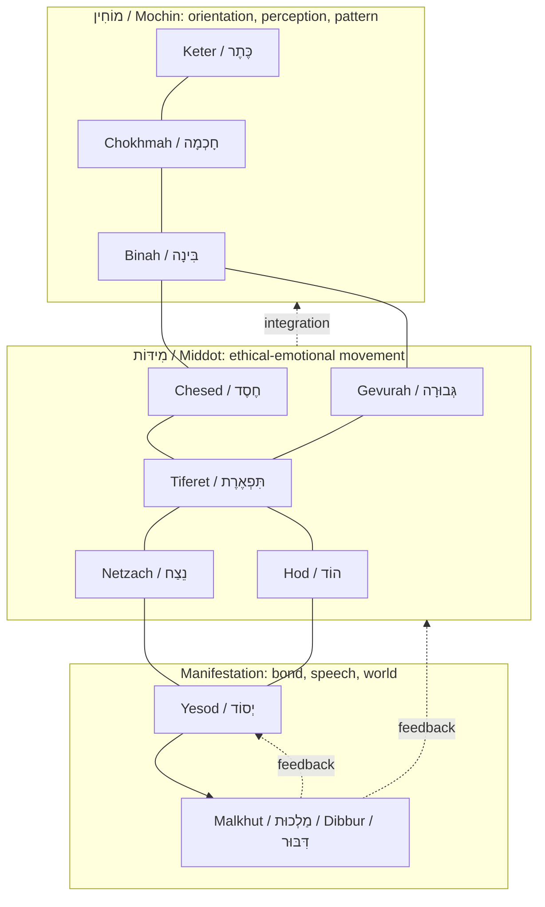

# 📿 Whole Tree Process Stack  
**First created:** 2026-07-07 | **Last updated:** 2026-07-07  
*A working mystical-process map for using the whole Tree of Life as a daily systems check, not a decorative ladder of spiritual superiority.*  

---

## 🛰️ Orientation

This node moves from an **Omer-only 7x7 practice** into a **whole-tree practice**.

The Omer remains useful: seven weeks, seven days, seven embodied sefirot turning through each other. That gives a training cycle for the underpinnings of conduct, relationship, restraint, endurance, humility, foundation, speech, and manifestation.

But the Omer is not the whole tree.

The whole tree asks a wider question:

> **How does divine, cognitive, emotional, relational, embodied, and spoken life move through a person without rupturing them or the people around them?**

Or, in less synagogue language:

> **What has to be working inside me so I do not turn one bad feeling, one flash of insight, one wound, one desire, or one righteous fury into a small domestic apocalypse before breakfast?**

This is not “patience is a virtue.”

This is:

> **Here are the processes you need online to not faceplant today — unless G-d wills it, which is always a possibility, because He does seem to enjoy watching us fuck it up and then try again.**

Easy peasy.

---

## ✨ Key Features

- Treats the sefirot as **process functions**, not a hierarchy of importance.
- Keeps the Omer’s 7x7 structure as a **training circuit**, not the whole operating system.
- Uses the whole tree as a daily diagnostic for **flow, rupture, imbalance, speech, embodiment, and repair**.
- Allows **Malkhut** to be worked through **Dibbur** — speech, expression, world-facing manifestation.
- Makes room for reverence, argument, domestic ethics, embodied reality, and horseradish.

---

## 🧿 Background: Omer As Training Circuit

Omer counting gives a 49-day structure.

```text
Omer = 50 days
50 = 49 + 1
49 = 7 x 7
```

The 49 counted days use the seven embodied sefirot:

```text
Chesed   = חֶסֶד
Gevurah  = גְּבוּרָה
Tiferet  = תִּפְאֶרֶת
Netzach  = נֵצַח
Hod      = הוֹד
Yesod    = יְסוֹד
Malkhut  = מַלְכוּת
```

Each week has a governing tone. Each day places one quality inside another.

A useful recent metaphor: **the week is the chord; the day is the note inside the chord.**

Examples:

| Omer Day | Week | Day | Formula | Working Feel |
|---|---:|---:|---|---|
| 1 | Chesed | Chesed | Chesed she’b’Chesed | Love within love; expansion inside expansion. |
| 12 | Gevurah | Hod | Hod she’b’Gevurah | Acknowledgement, humility, or splendour inside boundary, restraint, or judgment. |
| 29 | Hod | Chesed | Chesed she’b’Hod | Warmth inside surrender; generosity inside acknowledgement. |
| 49 | Malkhut | Malkhut | Malkhut she’b’Malkhut | Manifestation inside manifestation; the world-facing vessel checking itself before Shavuot. |

The point is not to become a blandly patient person with nice stationery.

The point is to train the channels through which love, boundary, beauty, endurance, humility, foundation, and speech can move without flooding, collapsing, coercing, leaking, or pretending to be holiness while behaving like an unregulated group chat.

---

## 🌳 The Whole Tree: Not A Ladder, A Living System

The idea that “higher” and “lower” sefirot are more or less important is like saying the roots, trunk, branches, leaves, flowers, fruit, and soil are competing for spiritual seniority.

They are not.

You need the whole tree.

“Higher” and “lower” are map positions, not moral rankings. Orientation is not superiority. Manifestation is not inferiority. If anything, Malkhut has the extremely annoying job of making the entire invisible drama show up in the real world, where other people can hear it, feel it, trip over it, marry it, divorce it, litigate it, or have to wash its mug.

So the whole-tree practice asks:

> **Where is the break in flow?**

Not:

> “Am I spiritually impressive?”

More:

> “Which process is overloaded, missing, leaking, overcontrolling, or being asked to do another process’s job?”

---

## 🪜 Whole Tree Diagram



This diagram should not be treated as a rigid hierarchy. It could be rotated. It could be redrawn. It could be mapped as a web, a root system, a nervous system, or an electron cloud masquerading as a spiritual concept.

The diagram follows procession for readability. Actual practice is bidirectional. Energy, attention, insight, habit, speech, desire, and feedback move through the whole system.

Malkhut speaks back. The body speaks back. The dishes speak back. The consequences speak back. G-d, regrettably, may also have notes.

---

## 🧠 Three Process Zones

| Zone | Hebrew | Sefirot | Process Role |
|---|---|---|---|
| Mochin | מוֹחִין | Keter, Chokhmah, Binah | Orientation, insight, perception, pattern, discernment, container. |
| Middot | מִידּוֹת | Chesed, Gevurah, Tiferet, Netzach, Hod | Ethical-emotional movement; the lived qualities of conduct and relation. |
| Manifestation | Malkhut / Dibbur field | Yesod, Malkhut | Bond, channel, foundation, speech, embodiment, action, world-facing form. |

The Omer focuses on the seven embodied/action-facing sefirot. That does not mean Keter, Chokhmah, and Binah are absent.

It means the upper processes are cultivated indirectly through the repair and training of the lower/action-facing channels.

In plainer language:

> **The work on the seven Omer sefirot builds the vessel capable of receiving, holding, and not immediately weaponising insight.**

This is important because revelation without containment is not automatically holiness. Sometimes it is just a spark in a kitchen full of gas.

---

## 🧮 Whole Tree Process Table

| Sefirah | Hebrew | Process Question | Working Function |
|---|---|---|---|
| Keter | כֶּתֶר | What am I serving? | Crown, source, intention, highest orientation, the named or unnamed value organising the system. |
| Chokhmah | חָכְמָה | What is the flash? | Seed insight, intuition, possibility, sudden seeing, raw spark before structure. |
| Binah | בִּינָה | What can hold this? | Discernment, structure, language, boundary, timing, vessel, form. |
| Chesed | חֶסֶד | Where is love or expansion needed? | Generosity, warmth, giving, mercy, opening, flow. |
| Gevurah | גְּבוּרָה | Where is the boundary? | Restraint, judgment, refusal, discipline, containment, clean edge. |
| Tiferet | תִּפְאֶרֶת | What makes this whole? | Integration, beauty, compassion, proportion, truth held with humanity. |
| Netzach | נֵצַח | What must continue? | Endurance, persistence, victory, momentum, commitment over time. |
| Hod | הוֹד | What must I acknowledge? | Humility, splendour, yielding, listening, accurate perception, reverent pause. |
| Yesod | יְסוֹד | What is the channel? | Foundation, bond, intimacy, transmission, habit, body, relational infrastructure. |
| Malkhut / Dibbur | מַלְכוּת / דִּבּוּר | What becomes real? | Speech, manifestation, presence, action, world-facing form, the place where the invisible lands. |

---

## ⚖️ Failure Modes

Whole-tree practice becomes useful when something feels off and the question becomes: **which part of the system is misfiring?**

| Imbalance | Likely Pattern | Risk |
|---|---|---|
| Too much Chokhmah, not enough Binah | Loads of insight, no container. | Brain full of sparks; house on fire. |
| Too much Binah, not enough Chokhmah | Excessive structure, no living spark. | Bureaucratised holiness; everything filed, nothing alive. |
| Too much Chesed, not enough Gevurah | Giving without boundary. | Flooding, resentment, martyrdom, “why am I suddenly furious?” |
| Too much Gevurah, not enough Chesed | Boundary without warmth. | Control, suspicion, punishment, sterility. |
| Too much Tiferet, badly used | Aesthetic integration used to avoid conflict. | Pretty balance that dodges necessary judgment. |
| Too much Netzach, not enough Hod | Persistence without yielding. | Heroism curdles into stubborn self-injury. |
| Too much Hod, not enough Netzach | Acknowledgement without action. | Understanding everyone’s perspective so hard that you dissolve. |
| Too much Yesod, not enough Malkhut / Dibbur | Charge, intimacy, pattern, no manifestation. | Everything is felt; nothing is said, built, repaired, or made real. |
| Too much Malkhut / Dibbur, not enough Mochin | Speech before wisdom has put trousers on. | The mouth becomes a ritual instrument and a weaponised clown horn. |
| Keter captured by fear | The “crown” is panic wearing holy jewellery. | The whole system organises around survival theatre rather than truth. |

---

## 🛠️ Daily Practice: Whole Tree Systems Check

This is not a morality test.

It is a systems check.

The question is not:

> “Am I being good enough?”

The question is:

> **Which part of the tree is carrying too much, which part has gone offline, and what needs to be restored before I make myself or someone else suffer unnecessarily?**

Use all ten prompts quickly, or choose the one that is obviously shouting.

### 1. Keter — What am I serving?

Not what am I saying I serve.

What am I actually serving?

Peace? Justice? fear? revenge? approval? survival? love? control? G-d? the group chat? the algorithm? my own wounded ego wearing a little fake crown?

Name the crown carefully. People cause immense damage when they mistake panic for holiness.

### 2. Chokhmah — What is the flash?

What do I suddenly see?

What is the seed of the idea, image, intuition, warning, longing, or possibility?

Do not overbuild it yet. A flash is not a house. A spark is not a policy platform. A revelation still has to survive contact with Binah.

### 3. Binah — What can hold this?

What structure does this need?

What distinction, timing, language, limit, evidence, vessel, or container would let the flash live without leaking everywhere?

Too little Binah and everything floods. Too much Binah and the living thing gets bureaucratised to death.

As ever: balance. Annoying, but traditional.

### 4. Chesed — Where is love needed?

What needs generosity?

What needs warmth, kindness, benefit of the doubt, mercy, opening, softness, or repair?

Chesed is not being a doormat. Chesed is holy expansion. If it has no boundary, it becomes flooding. If it has no discernment, it becomes complicity with a nice voice.

### 5. Gevurah — Where is the boundary?

What must be refused?

What must be contained?

What must not be allowed to pass through me into the world?

Gevurah is not cruelty. Gevurah is the mercy of a clean edge.

Sometimes the loving thing is no. Sometimes the holy thing is stop. Sometimes patience is not a virtue; it is just fear in a cardigan.

### 6. Tiferet — What makes this whole?

Where do love and boundary meet?

Where does truth become beautiful enough to live with?

Where does justice stay human?

Tiferet is the centre of the web: the place where opposing forces stop cosplaying as enemies and become proportion.

This is not compromise as cowardice. This is integration as skill.

### 7. Netzach — What must continue?

What needs endurance?

What promise must be kept?

What work must not be abandoned just because it is boring, frightening, repetitive, unrewarded, or not yet visible?

Netzach is persistence. But persistence without humility becomes domination. And “I never give up” is sometimes just “I do not know how to stop injuring myself.”

Check Hod.

### 8. Hod — What must I acknowledge?

What must I admit?

What must I listen to?

Where must I yield, pause, bow, laugh at myself, apologise, or accept that reality has not consulted my preferred narrative?

Hod is splendour, but it is also surrender.

Not collapse. Not humiliation. Not making yourself small so someone else can feel large.

Hod is the dignity of accurate perception.

### 9. Yesod — What is the channel?

What carries this into relationship, body, habit, intimacy, trust, memory, repetition, sexuality, kinship, or infrastructure?

Yesod asks whether the thing can actually travel.

A value that cannot pass through relationship remains ornamental. A desire that cannot pass through consent becomes dangerous. A truth that cannot pass through a body becomes brittle.

Foundation matters. Plumbing matters. Beds matter. Calendars matter. Who does the dishes matters. G-d has noticed.

### 10. Malkhut / Dibbur — What becomes real?

What is said?

What is done?

What enters the world?

Malkhut is where the invisible takes form. Dibbur is where the inner life becomes shared reality through speech.

This is why speech matters.

Not because words are decoration, but because words are one of the ways the world gets made.

So: what am I about to make?

A repair? A wound? A joke? A boundary? A blessing? A mess? A home? A public record? A tiny, legally defensible act of goblin resistance?

Choose carefully.

---

## 📿 Meditation / Reflection Prompts

These can be used as journalling prompts, meditation prompts, Shabbat reflection questions, Omer companion prompts, or emergency “why am I like this today?” diagnostics.

### Whole Tree Scan

| Prompt | Use When |
|---|---|
| What is the crown on this moment? | When everything feels urgent and you need to know what value is actually ruling you. |
| Is this a flash, a structure, a feeling, a boundary, a bond, or a speech-act? | When you are confusing one kind of process for another. |
| Which sefirah is overfunctioning? | When one mode has taken over the whole system. |
| Which sefirah is undernourished? | When the system feels brittle, flat, flooded, or stuck. |
| What wants to move but has no vessel? | When insight, desire, grief, or anger is leaking everywhere. |
| What has a vessel but no life? | When the structure is intact but spirit has left the building. |
| What am I about to make real through speech? | Before sending the message, publishing the note, picking the fight, or saying the thing. |

### Mochin Prompts

| Sefirah | Prompt |
|---|---|
| Keter | What am I serving: truth, love, fear, revenge, repair, control, belonging, G-d, or something I have not admitted yet? |
| Chokhmah | What is the smallest true spark here, before I inflate it into a grand theory? |
| Binah | What container would let this insight become useful rather than explosive? |

### Middot Prompts

| Sefirah | Prompt |
|---|---|
| Chesed | Where can I safely expand? Where is generosity genuinely called for? |
| Gevurah | Where is the clean no? What must not pass? |
| Tiferet | What would proportion look like here? What is beautiful because it is true, not because it is convenient? |
| Netzach | What must continue even if nobody claps? |
| Hod | What must I acknowledge before I act? |

### Manifestation Prompts

| Sefirah | Prompt |
|---|---|
| Yesod | What channel, bond, body practice, routine, or relationship carries this forward? |
| Malkhut / Dibbur | What words or actions will make this real, and are they worthy of being made real? |

---

## 🫀 Embodied Practice Notes

Whole-tree practice should not become an excuse to dissociate upward.

The point is not to float in concepts until the dishes achieve sentience and unionise.

The point is to bring attention back through the whole system: crown, insight, structure, love, boundary, integration, endurance, humility, foundation, speech, action, body, world.

Possible grounding practices:

- Count the Omer aloud when in season; if outside Omer, name the day’s working quality without pretending it is the formal count.
- Use one glass or bowl of water as a simple attention marker if ritual objects are too much.
- Touch the body before speaking: hand, chest, table, cup, doorframe, cane, floor, fabric.
- Ask: “Is this ready for Malkhut?” before making the invisible visible.
- If the answer is no, return to Binah, Gevurah, Hod, or Yesod. They are often the ones trying to prevent disaster.

This is allowed to be weirdly exhausting.

Spiritual practice is not always soothing. Sometimes it is just repeatedly noticing that you are, in fact, embodied, reactive, relational, finite, hungry, tired, horny, grieving, and still somehow expected to help with dishes.

Judaism does not always offer escape from this. It more often says: yes, good, start there.

---

## 🌶️ Onah, Shefa, Kelim, And Not Being A Disaster In Bed Or Elsewhere

Onah can be read here as properly attuned relational expression: the movement of shefa into and through kelim without rupture, alienation, coercion, or imbalance.

In less mystical language:

- Do not pour what has not been received.
- Do not demand what has not been invited.
- Do not speak as though speech has no consequence.
- Do not call it love if only one person is being expanded.
- Do not confuse intensity with attunement.
- Do not confuse access with intimacy.
- Do not confuse silence with consent, refusal with cruelty, or endurance with devotion.

This is why whole-tree practice matters relationally.

A person who can notice the movement from crown to speech, from desire to channel, from insight to restraint, from force to vessel, is less likely to treat another human being as a bin for their unmanaged internal weather.

This may improve marital relations.

It may also improve friendships, political movements, kitchens, comment sections, committees, and any environment where someone has confused “I have a feeling” with “the world must now obey me.”

Horseradish Buddhism, but make it covenantal.

---

## 🧯 Quick Diagnostic: Before Speaking

Use this when speech is about to become Malkhut/Dibbur and there is a non-zero chance the mouth has obtained the launch codes.

| Question | Sefirah Checked |
|---|---|
| What am I serving by saying this? | Keter |
| What is the actual insight? | Chokhmah |
| What structure or timing does this need? | Binah |
| Is there love here? | Chesed |
| Is there a necessary boundary? | Gevurah |
| Is this proportionate? | Tiferet |
| Am I continuing something worth continuing? | Netzach |
| What have I not acknowledged? | Hod |
| Is the relationship/channel strong enough to carry this? | Yesod |
| What will this make real? | Malkhut / Dibbur |

If the answer to “what will this make real?” is “a preventable mess,” congratulations, you have discovered why drafts exist.

---

## 🪞 Working Distinctions

| Distinction | Why It Matters |
|---|---|
| Flash is not structure. | Chokhmah needs Binah before it can become usable. |
| Love is not flooding. | Chesed needs Gevurah to avoid rupture. |
| Boundary is not cruelty. | Gevurah needs Chesed to avoid becoming domination. |
| Beauty is not avoidance. | Tiferet must integrate truth, not wallpaper over it. |
| Persistence is not always virtue. | Netzach needs Hod to know when endurance has become harm. |
| Humility is not collapse. | Hod needs Netzach to stay capable of action. |
| Connection is not manifestation. | Yesod needs Malkhut/Dibbur to make the bond real. |
| Speech is not consequence-free. | Malkhut/Dibbur makes worlds, wounds, repairs, records, vows, jokes, and occasionally litigation. |

---

## 🧭 Suggested Use

This node can be used in four main ways:

1. **As an Omer companion** — read the relevant daily/week quality inside the wider tree.
2. **As a daily systems check** — scan all ten sefirot and identify the missing or overloaded process.
3. **As a speech filter** — use before messages, posts, confrontations, apologies, public statements, or “I am just going to say one tiny thing” events.
4. **As a relational diagnostic** — especially where intensity, silence, desire, obligation, resentment, repair, or embodiment are present.

This is a working map, not a rabbinic ruling.

If you wanted a rabbi, you could pay for one. Apparently there is plenty of money for bombs, but when it comes to seminary placements or long-term stipend stability, suddenly everyone becomes mysteriously committed to austerity.

🦎

---

## 🌌 Constellations

📿 🪜 🧠 🫀 🌳 — spiritual process mapping; Omer companion practice; embodied ethics; speech and manifestation diagnostics.

---

## ✨ Stardust

omer, sefirot, whole tree practice, kabbalah, jewish practice, embodiment, speech ethics, relational attunement, meditation prompts, process stack

---

## 🏮 Footer

*Whole Tree Process Stack* is a living node of the **Polaris Protocol**.  
It translates sefirotic practice into an accessible systems-check model for embodied ethics, speech, relation, and daily repair. It preserves mystical complexity without treating the tree as a hierarchy of spiritual importance.

> 📡 Cross-references:
>
> - [Learning The Skies](../6_Learning_The_Skies/) — *practice frameworks, pattern recognition, and navigational tools*  
> - [Survivor Tools](../Disruption_Kit/Survivor_Tools/) — *practical countermeasures and embodied stabilisation tools*  
> - [Big Picture Protocols](../Disruption_Kit/Big_Picture_Protocols/) — *systems analysis, governance metaphors, and structural diagnostics*  

*Survivor authorship is sovereign. Containment is never neutral.*

_Last updated: 2026-07-07_
