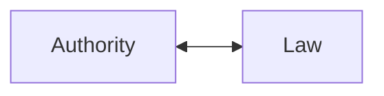
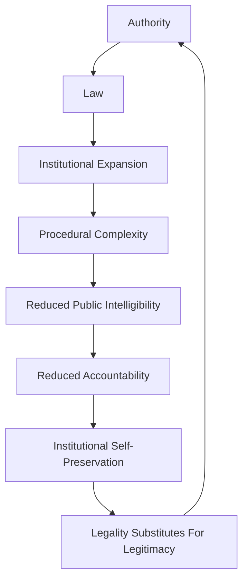

# ⚖️ Legal Procedural Analysis  
**First created:** 2026-05-12 | **Last updated:** 2026-05-23  
*Examining legitimacy through law, mandate, institutional procedure, and the recursive relationship between authority and governance systems.*

---

## 🛰️ Orientation  

⚖️ *Legal Procedural Analysis* examines authority through:
- law,
- mandate,
- constitutional structure,
- institutional procedure,
- delegation,
- enforcement,
- and formal governance continuity.

This method studies how societies attempt to stabilise collective life through:
- repeatable process,
- procedural legitimacy,
- institutional memory,
- documented authority,
- and constraints against arbitrary power.

Within Exousiología, procedural legitimacy is treated as:
> a real and necessary governance technology.

Large-scale societies cannot operate exclusively through:
- personal trust,
- kinship,
- charisma,
- or interpersonal familiarity.

Procedural systems allow authority to:
- persist across succession,
- coordinate large populations,
- preserve continuity,
- distribute responsibility,
- and reduce dependence on individual rulers.

However, Exousiología also treats procedural legitimacy as:
- recursive,
- ecologically constrained,
- vulnerable to abstraction,
- and dependent upon ongoing civic maintenance.

Law shapes authority.
Authority shapes law.

This recursive relationship is normal.

The central question is:
> whether the loop remains accountable, intelligible, adaptive, and survivable across time.

---

## 🔍 Core Questions  

This method asks:

- Who granted authority?
- Through what procedure was legitimacy established?
- What formal mandates exist?
- What constraints limit power?
- How are disputes resolved?
- What escalation systems exist?
- How does authority persist through succession or crisis?
- What institutional memory structures exist?
- How are laws interpreted, enforced, and revised?
- What forms of accountability remain accessible?

It also asks:
- when procedure protects collective life,
- and when procedure begins protecting itself.

---

## 🧠 What This Method Sees Well  

### ⚖️ Anti-Arbitrary Stabilisation  

Procedural systems reduce dependence on:
- personal favour,
- dynastic whim,
- emotional impulse,
- and charismatic instability.

This allows authority to become:
- legible,
- transferable,
- contestable,
- and partially predictable.

---

### 🏛️ Institutional Continuity  

Legal systems preserve:
- records,
- precedent,
- delegation chains,
- succession structures,
- and administrative memory.

This allows governance continuity across:
- elections,
- crises,
- leadership transition,
- and generational change.

---

### 🌉 Large-Scale Coordination  

Procedure allows complex societies to coordinate without requiring:
- intimate familiarity,
- shared kinship,
- or complete ideological agreement.

This is one of the major advantages of procedural governance systems.

---

### 📜 Constraint And Review Structures  

Healthy procedural systems may:
- slow escalation,
- distribute authority,
- establish appeal systems,
- separate powers,
- and constrain arbitrary enforcement.

This is particularly important in:
- constitutional governance,
- rights frameworks,
- judicial review,
- and anti-corruption systems.

---

### 🧾 Documentary Traceability  

Procedural systems often leave:
- records,
- audit trails,
- evidentiary residue,
- and institutional documentation.

Even flawed systems may therefore remain partially examinable after harm occurs.

This matters significantly for:
- accountability,
- reform,
- historical analysis,
- and governance diagnostics.

---

## 🫥 What This Method Often Misses  

### 🫀 Embodied Experience  

A system may remain:
- lawful,
- internally coherent,
- and procedurally functional,

while populations experience:
- exhaustion,
- fear,
- exclusion,
- abandonment,
- or bureaucratic violence.

Formal legality does not automatically produce:
- justice,
- dignity,
- trust,
- or survivability.

---

### 🪵 Informal Maintenance Systems  

Procedural systems frequently depend upon:
- unpaid care labour,
- emotional adaptation,
- mutual aid,
- local repair systems,
- and invisible survival infrastructures.

Formal governance analysis often underestimates:
> how much institutional continuity is sustained informally beneath official systems.

---

### 🌌 Symbolic And Moral Legitimacy  

Legal systems may remain operational while losing:
- moral coherence,
- social trust,
- symbolic legitimacy,
- or civilisational meaning.

Procedure alone cannot fully explain:
- revolutionary rupture,
- symbolic collapse,
- legitimacy crises,
- or ideological exhaustion.

---

### ⚠️ Metabolic Cost Distribution  

Procedural systems may preserve stability by externalising cost onto:
- vulnerable populations,
- invisible labour,
- administrative exhaustion,
- or long-term ecological strain.

This method can struggle to perceive:
- who absorbs governance pressure,
- whose suffering preserves continuity,
- and where procedural efficiency becomes metabolically destructive.

---

## 🔄 Recursive Legitimacy Loops  

Authority shapes law.  
Law stabilises authority.

This recursive relationship is a normal feature of large-scale governance systems.

Procedural legitimacy therefore does not emerge once and remain permanently stable.

Populations continually respond to:
- lived outcomes,
- institutional behaviour,
- procedural fairness,
- and embodied experience.

Those responses reshape legitimacy over time.

Exousiología treats legitimacy maintenance as:
- participatory,
- adaptive,
- relational,
- and ongoing.

The question is not whether the loop exists.

The question is:
> how intentionally and accountably the loop is maintained.

---

## ⚠️ Recursive Failure Modes  
*Sometimes informally described within this archive as “the Kafka diagram.”*

Without ongoing civic participation, interpretability, and adaptive correction, procedural systems may become increasingly:
- self-referential,
- opaque,
- insulated,
- or detached from lived reality.

At this stage:
> legality may continue functioning even as legitimacy erodes.

This failure mode is often culturally associated with:
- procedural opacity,
- institutional alienation,
- recursive bureaucracy,
- and “Kafkaesque” governance systems.

---

## 🤖 Procedural Drift And Recursive Systems  

Large procedural systems often behave recursively.

Like machine-learning systems, institutions:
- reinforce patterns,
- preserve historical assumptions,
- optimise around incentives,
- and expand internal logic over time.

Without intentional oversight and corrective feedback, systems may increasingly prioritise:
- procedural continuity,
- institutional defensibility,
- risk management,
- or internal coherence,

over:
- justice,
- adaptability,
- or ecological legitimacy.

This does not necessarily require malicious intent.

Procedural drift often emerges gradually through:
- inertia,
- abstraction,
- optimisation pressures,
- accumulated exceptions,
- and increasing distance from lived reality.

Exousiología therefore treats governance maintenance as:
> an active civic process rather than a passive condition.

---

## 🌍 Historical And Structural Examples  

This analytical lens is especially useful for examining:
- constitutional systems,
- bureaucratic states,
- court systems,
- administrative empires,
- treaty structures,
- parliamentary governance,
- international institutions,
- and procedural escalation systems.

It is particularly strong at analysing:
- formal authority,
- delegation chains,
- jurisdiction,
- institutional persistence,
- emergency powers,
- and legal continuity mechanisms.

It is less effective at independently explaining:
- symbolic legitimacy,
- folk adaptation,
- mythic authority,
- emotional governance,
- or civilisational meaning systems.

---

## 🔄 Relationship To Other Methods  

### 🫂 Sociological Legitimacy Analysis  

Procedural legitimacy and social legitimacy frequently overlap — but not always.

A system may remain lawful while:
- trust collapses,
- consent erodes,
- or populations withdraw recognition.

---

### 🪵 Folk And Survival Analysis  

Formal governance systems frequently depend upon:
- informal maintenance,
- community adaptation,
- and invisible repair infrastructures.

Folk analysis often reveals:
> what actually keeps societies functioning beneath official procedure.

---

### 🌌 Cosmological Alignment Analysis  

Procedural legitimacy alone rarely explains:
- sacred authority,
- symbolic continuity,
- or civilisational orientation.

Cosmological analysis examines:
> why authority feels morally or metaphysically justified.

---

### 🩻 Pathological Failure Analysis  

Pathological analysis examines:
- rigidity,
- institutional self-preservation,
- legitimacy exhaustion,
- exception creep,
- and procedural abstraction.

This is particularly important when:
> legality continues functioning while relational legitimacy deteriorates.

---

## 🌱 Ecological Interpretation  

Exousiología treats procedural systems as:
> governance scaffolding.

Healthy procedural systems:
- distribute load,
- constrain arbitrariness,
- preserve continuity,
- and support collective coordination.

However, procedural systems become ecologically dangerous when they:
- prioritise institutional continuity above collective survivability,
- rigidify under strain,
- lose intelligibility,
- or externalise metabolic cost indefinitely.

A system may remain:
- technically lawful,
- operationally functional,
- and procedurally coherent,

while becoming:
- socially hollow,
- psychologically alienating,
- ecologically brittle,
- or dependent upon invisible suffering.

The ecological question therefore becomes:
> what kind of life does this procedural system make possible?

---

## ⚠️ Failure Modes  

### 🧱 Proceduralism Without Justice  

Procedure may become:
- morally detached,
- mechanically self-reinforcing,
- or incapable of recognising substantive harm.

---

### 🪤 Institutional Self-Preservation  

Institutions may increasingly prioritise:
- reputational continuity,
- procedural defensibility,
- or bureaucratic survival,

over:
- legitimacy renewal,
- adaptive repair,
- or public wellbeing.

---

### 🚨 Exception Creep  

Temporary emergency powers may gradually become:
- normalised,
- expanded,
- or permanently embedded.

This is one of the major bridges between:
> procedural governance  
and  
> containment governance.

---

### 🫥 Procedural Alienation  

Systems may become increasingly:
- opaque,
- inaccessible,
- socially unintelligible,
- or psychologically destabilising.

At extreme levels, populations may experience governance as:
> procedurally active but relationally unreachable.

This is one of the major themes explored in The Trial by Franz Kafka.

---

## 🌌 Constellations  

⚖️ 🏛️ 📜 🌉 🧱 🩻 🤖  
*Procedure as legitimacy infrastructure, continuity system, and recursive governance loop — always vulnerable to drift, opacity, and self-preserving abstraction.*

---

## ✨ Stardust  

procedural legitimacy, constitutional governance, institutional continuity, bureaucracy, delegation, recursive legitimacy, procedural drift, kafkaesque governance, administrative systems, procedural alienation, legal authority, institutional memory, exception creep, governance ecology

---

## 🏮 Footer  

*⚖️ Legal Procedural Analysis* is a living node of the **Polaris Protocol**.  
It examines legitimacy through law, mandate, procedure, institutional continuity, and recursive governance systems within the wider framework of *🧄 Exousiología*.

This node studies both:
- the stabilising role of procedural governance,
- and the failure modes that emerge when legality, intelligibility, and lived legitimacy begin drifting apart.

> 📡 Cross-references:
>
> - [🧄 Exousiología](../README.md) — *ecological framework for legitimacy, stewardship, and adaptive continuity*  
> - [🔬 Methods Of Examination](./README.md) — *plural analytical approaches for examining legitimacy and authority*  
> - [🩻 Authority Failure Modes](../🩻_Authority_Failure_Modes/) — *patterns of rigidity, procedural overreach, and legitimacy decay*  
> - [🌸 Containment Studies](../../🌸_Containment_Studies/README.md) — *companion framework examining coercive stabilisation and containment dynamics*  

*Authority is relational. Stewardship is load-bearing. Stability must remain livable.*  

_Last updated: 2026-05-23_
