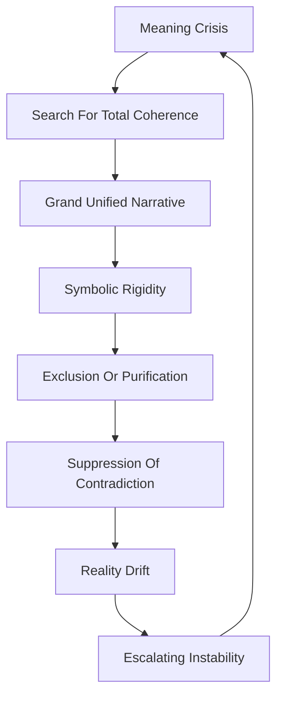

# 🌌 Cosmological Alignment Analysis  
**First created:** 2026-05-12 | **Last updated:** 2026-05-23  
*Examining legitimacy through myth, symbolic order, cosmology, existential orientation, and the human search for coherent meaning.*

---

## 🛰️ Orientation  

🌌 *Cosmological Alignment Analysis* examines authority through:
- myth,
- symbolic order,
- sacred legitimacy,
- existential orientation,
- metaphysical coherence,
- destiny narratives,
- ritual continuity,
- and civilisational meaning systems.

Where:
- ⚖️ *Legal Procedural Analysis* asks:
  > “is authority lawful?”
- 🫂 *Sociological Legitimacy Analysis* asks:
  > “is authority socially recognised?”

🌌 *Cosmological Alignment Analysis* asks:
> “does authority appear aligned with a deeper structure of reality itself?”

This includes:
- divine mandate,
- sacred kingship,
- cosmological hierarchy,
- historical inevitability,
- national destiny,
- revolutionary teleology,
- technocratic futurism,
- civilisational mythology,
- and symbolic narratives explaining:
  - why order exists,
  - what history means,
  - what future is legitimate,
  - and what kinds of authority feel existentially coherent.

Within Exousiología, humans are not treated as purely procedural or economic beings.

Humans repeatedly construct:
- symbolic universes,
- moral cosmologies,
- mythic frameworks,
- and meaning systems

to reduce uncertainty,
orient behaviour,
and stabilise collective life.

Authority therefore often becomes legitimate not merely because:
- it is lawful,
or
- socially trusted,

but because it appears:
- sacred,
- natural,
- historically destined,
- cosmically aligned,
- or morally inevitable.

---

## 🔍 Core Questions  

This method asks:

- What cosmology legitimises authority?
- What symbolic order structures collective life?
- What myths explain governance?
- What narratives define moral legitimacy?
- How is history interpreted?
- What futures are considered permissible or inevitable?
- What rituals stabilise authority?
- What forms of transcendence organise society?
- How do populations orient themselves existentially?
- What happens when meaning systems collapse?

It also asks:
- how humans transform uncertainty into symbolic order,
- and how authority becomes embedded within existential meaning structures.

---

## 🧠 What This Method Sees Well  

### 🌌 Symbolic Coherence  

Cosmological systems provide:
- existential orientation,
- moral structure,
- narrative continuity,
- and symbolic coherence.

They help societies answer:

why are we here?
what kind of order is natural?
what makes authority legitimate?
what future should exist?
what sacrifices are acceptable?

This method is especially strong at examining:
- civilisational narratives,
- sacred legitimacy,
- mythic continuity,
- and symbolic governance systems.

---

### 🔥 Ritual And Meaning  

Authority is often stabilised through:
- ritual,
- ceremony,
- symbolic repetition,
- sacred timing,
- and collective meaning production.

This includes:
- coronations,
- national ceremonies,
- funerary rituals,
- revolutionary symbolism,
- constitutional mythology,
- sacred calendars,
- and collective memorial systems.

Ritual often functions as:
> governance emotionally embedded into symbolic time.

---

### 🏛️ Civilisational Identity  

Societies frequently organise themselves through:
- founding myths,
- collective memory,
- historical destiny narratives,
- and symbolic continuity systems.

This method is highly useful for examining:
- nationalism,
- empire,
- revolutionary ideology,
- civilisational identity,
- and cultural continuity frameworks.

---

### 🌠 Meaning Under Uncertainty  

Humans repeatedly construct cosmological systems to:
- reduce uncertainty,
- stabilise interpretation,
- orient behaviour,
- and make suffering psychologically survivable.

This includes:
- mythology,
- astrology,
- humour systems,
- alchemy,
- sacred cosmology,
- historical teleology,
- and modern progress narratives.

Cosmological systems often function simultaneously as:
- meaning systems,
- identity systems,
- temporal systems,
- governance systems,
- and uncertainty-management systems.

---

### 🧬 Deep Cognitive Patterning  

Humans are highly adaptive pattern-detecting organisms.

Evolution strongly rewarded:
- rapid inference,
- agency detection,
- narrative construction,
- symbolic memory,
- and behavioural prediction.

As a result, humans repeatedly generate:
- cosmologies,
- archetypes,
- elemental systems,
- destiny narratives,
- and symbolic classification frameworks.

This is not merely irrationality.

Many cosmological systems emerge from:
> adaptive cognitive strategies for surviving uncertainty, complexity, mortality, and coordination pressure.

---

### 🎨 Productive Weirdness And Innovation  

Many of the same cognitive tendencies that produce:
- mythology,
- symbolic overconnection,
- cosmology,
- and grand meaning systems

also contribute to:
- creativity,
- innovation,
- artistic experimentation,
- conceptual synthesis,
- and scientific breakthroughs.

Highly associative cognition can produce:
- reality drift,
- paranoia,
- or symbolic rigidity,

but it can also produce:
- novel theories,
- artistic movements,
- paradigm shifts,
- symbolic innovation,
- and entirely new conceptual architectures.

Societies therefore often occupy an ambivalent relationship with:
- mystics,
- artists,
- theorists,
- inventors,
- and “mad geniuses.”

Civilisation frequently depends upon people capable of:
- seeing unusual connections,
- tolerating ambiguity,
- constructing new symbolic systems,
- and imagining realities that do not yet exist.

Healthy systems therefore require:
- symbolic experimentation,
- interpretive flexibility,
- and imaginative play,

while still maintaining:
- grounding,
- adaptive correction,
- and reality contact.

---

## 🫥 What This Method Often Misses  

### ⚖️ Procedural Constraints  

Cosmological legitimacy alone does not guarantee:
- accountability,
- legal protection,
- institutional constraint,
- or adaptive governance structure.

Sacred legitimacy may coexist with:
- arbitrary authority,
- authoritarianism,
- exclusion,
- or violent hierarchy.

---

### 🧱 Material Conditions  

Symbolic meaning alone cannot sustain:
- housing,
- infrastructure,
- healthcare,
- food systems,
- labour stability,
- or ecological survivability.

Cosmological systems may therefore:
- symbolically stabilise societies,
while materially masking:
- extraction,
- scarcity,
- or unequal burden distribution.

---

### 🫂 Relational Trust  

A system may remain:
- symbolically powerful,
- mythically coherent,
- and civilisationally resonant,

while populations increasingly experience:
- distrust,
- alienation,
- humiliation,
- or participatory exclusion.

Meaning systems alone do not guarantee:
- relational legitimacy.

---

### 🪤 Self-Sealing Symbolic Systems  

Cosmological systems may become:
- deterministic,
- totalising,
- exclusionary,
- or resistant to corrective feedback.

At extreme levels:
> symbolic coherence may begin overriding adaptive reality contact.

This is one of the major bridges between:
- cosmological legitimacy,
and
- authoritarian rigidity.

---

## 🌠 Cosmology As Governance  

Human societies rarely govern through:
- procedure alone,
or
- material allocation alone.

Humans also govern through:
- meaning,
- symbolism,
- myth,
- ritual,
- and existential orientation.

Cosmological systems often embed authority within:
- divine order,
- natural order,
- historical destiny,
- moral inevitability,
- sacred time,
- or metaphysical hierarchy.

This produces legitimacy at a deeper level than:
- legal compliance,
or
- institutional trust alone.

Authority becomes:
- existentially situated,
- symbolically anchored,
- and morally narrativised.

---

## 🔄 Cosmological Legitimacy Loops  

Cosmological legitimacy therefore becomes recursive.

Meaning systems reinforce authority.  
Authority reinforces meaning systems.

The central question becomes:
> whether symbolic order remains adaptive, pluralistic, and reality-responsive.

---

## 🪐 Astrology, Symbolic Systems, And Human Orientation  

Astrological systems historically functioned not merely as:
- entertainment,
- or personality categorisation,

but as:
- governance timing systems,
- symbolic ordering systems,
- identity frameworks,
- uncertainty-management systems,
- agricultural calendars,
- and cosmological legitimacy structures.

Multiple astrological traditions emerged across civilisations, including:
- Hellenistic systems,
- Vedic astrology,
- Chinese zodiac systems,
- and numerous hybrid cosmological traditions.

This demonstrates a recurring human tendency to:
> map meaning, identity, and governance onto cosmic structure.

Similarly, systems such as:
- humour theory,
- alchemy,
- elemental classifications,
- sacred geometry,
- and symbolic medicine

often linked together:

cosmos
↔ body
↔ personality
↔ morality
↔ governance
↔ health
↔ social order

These systems frequently functioned as:
- integrated symbolic operating systems for reality.

Exousiología therefore treats cosmological systems not merely as:
> irrational historical curiosities,

but as:
> recurring human attempts to construct coherent frameworks linking meaning, identity, uncertainty, governance, and collective order.

---

## 🤖 Secular Cosmologies  

Modern societies frequently retain cosmological structures even when formally secular.

This may include:
- technological destiny narratives,
- market inevitability,
- optimisation mythology,
- revolutionary teleology,
- progress ideology,
- civilisational exceptionalism,
- or historical inevitability frameworks.

These systems often function psychologically and socially similarly to older cosmologies by providing:
- orientation,
- meaning,
- prediction,
- moral structure,
- and existential coherence.

Humans repeatedly seek:

the hidden pattern
the underlying law
the unified explanation
the grand system
the theory of everything

This reflects a recurring cognitive tendency toward:
- coherence seeking,
- pattern integration,
- and uncertainty reduction.

---

## 🧠 Cognitive Foundations  

Many cosmological tendencies emerge from:
- adaptive pattern recognition,
- agency detection,
- symbolic abstraction,
- narrative cognition,
- and uncertainty management.

From an evolutionary perspective, humans often benefited from:
- over-detecting patterns,
- constructing explanatory narratives,
- and organising uncertainty symbolically.

false positive
→ embarrassment

false negative
→ leopard

Evolution therefore tends to favour:
- survivable cognition,
rather than
- perfect philosophical accuracy.

This helps explain why:
- mythology,
- ritual,
- cosmology,
- symbolic classification,
- and meaning systems

recur consistently across cultures and historical periods.

---

## 🌐 Symbolic Environments And Cognitive Drift  

Modern information systems increasingly expose humans to:
- recursive symbolic reinforcement,
- accelerated associative patterning,
- hyperscaled visibility systems,
- and algorithmically amplified meaning environments.

Different platforms cultivate different forms of cognition.

Some strongly incentivise:
- symbolic association,
- emotional pattern linking,
- archetypal interpretation,
- recursive meaning construction,
- and mythic coherence seeking.

Others incentivise:
- procedural reasoning,
- slower verification,
- evidentiary pacing,
- and linear interpretation.

These environments shape:
- interpretive habits,
- emotional orientation,
- symbolic perception,
- and reality-processing styles over time.

Highly associative symbolic environments may increase:
- creativity,
- conceptual synthesis,
- artistic experimentation,
- and imaginative cognition,

but may also increase tendencies toward:
- magical thinking,
- conspiratorial interpretation,
- symbolic overconnection,
- and reality drift.

Meanwhile highly procedural environments may preserve:
- grounding,
- institutional continuity,
- and evidentiary discipline,

while also risking:
- emotional sterility,
- symbolic exhaustion,
- and innovation suppression.

The Information Age therefore creates a new governance challenge:
> intentionally cultivating grounded symbolic cognition within hyperscaled meaning environments.

Humans evolved for:
- tribal-scale symbolic ecosystems,

not:
- planetary-scale recursive information saturation.

Grounding can therefore no longer be assumed to emerge automatically from:
- locality,
- stable institutions,
- embodied continuity,
- or shared ritual systems.

Increasingly, groundedness must be:
- consciously cultivated,
- socially maintained,
- and structurally supported.

---

## ⚠️ Cosmological Failure Modes  

Cosmological systems become dangerous when they:
- resist adaptive correction,
- monopolise legitimacy,
- eliminate pluralism,
- suppress ambiguity,
- or frame dissent as existential threat.

At extreme levels:
- myth becomes dogma,
- symbolism becomes coercive,
- and existential orientation becomes authoritarian.

However, humans arguably exist somewhere along this spectrum continuously.

Symbolic cognition,
pattern seeking,
myth-making,
and coherence construction
are not anomalies within human psychology.

They are recurring features of:
- cognition,
- identity formation,
- social coordination,
- and uncertainty management.

The central issue is therefore not:
> whether cosmological cognition exists,

but:
- how rigid it becomes,
- how adaptive it remains,
- and whether symbolic coherence preserves meaningful reality contact.

---

## 🌍 Historical And Structural Examples  

This analytical lens is especially useful for examining:
- divine kingship,
- imperial cosmology,
- revolutionary ideology,
- nationalism,
- sacred governance,
- civilisational mythology,
- technocratic futurism,
- and existential legitimacy systems.

It is particularly strong at analysing:
- symbolic continuity,
- ritual authority,
- moral universes,
- mythic identity,
- and legitimacy through meaning.

It is less effective at independently analysing:
- procedural accountability,
- administrative coordination,
- material distribution,
- or invisible survival infrastructures.

---

## 🔄 Relationship To Other Methods  

### ⚖️ Legal Procedural Analysis  

A system may appear:
- sacred,
- destined,
- or cosmically justified,

while lacking:
- procedural accountability,
- institutional constraints,
- or adaptive governance structures.

---

### 🫂 Sociological Legitimacy Analysis  

Cosmological legitimacy may remain symbolically powerful even while:
- trust erodes,
- participation declines,
- or populations experience emotional alienation.

---

### 🪵 Folk And Survival Analysis  

Folk systems often preserve:
- local cosmologies,
- ritual continuity,
- symbolic adaptation,
- and embedded meaning systems beneath official authority structures.

---

### 🩻 Pathological Failure Analysis  

Pathological analysis examines:
- symbolic rigidity,
- apocalyptic thinking,
- sacred violence,
- destiny absolutism,
- and totalising meaning systems.

This becomes especially important when:
> symbolic coherence begins overriding adaptive reality contact.

---

## 🌱 Ecological Interpretation  

Exousiología treats cosmological systems as:
> meaning ecologies.

Healthy cosmological systems may:
- orient collective life,
- stabilise existential uncertainty,
- preserve symbolic continuity,
- and provide shared moral language.

However, cosmological systems become ecologically dangerous when they:
- monopolise legitimacy,
- eliminate ambiguity,
- suppress pluralism,
- or justify domination through inevitability narratives.

A healthy symbolic ecology therefore requires:
- interpretive flexibility,
- humility,
- adaptive revision,
- symbolic plurality,
- tolerance for uncertainty,
- and consciously maintained grounding structures.

Humans consistently seek:
- coherence,
- orientation,
- and meaningful order.

The ecological question is therefore not:
> whether cosmology exists,

but:
> what kinds of cosmological systems remain adaptive, pluralistic, grounded, and survivable across time.

---

## 🌌 Constellations  

🌌 🔥 🪐 🧬 🎨 🤖 📜 🐍  
*Authority as symbolic order, existential orientation, ritual continuity, and cosmological meaning — always vulnerable to rigidity, recursive unreality, and totalising coherence.*

---

## ✨ Stardust  

cosmological legitimacy, symbolic order, sacred authority, astrology, mythology, existential orientation, ritual governance, civilisational identity, symbolic coherence, destiny narratives, uncertainty management, secular cosmology, meaning systems, symbolic ecology, recursive cognition, groundedness, associative cognition, hyperscaled symbolism

---

## 🏮 Footer  

*🌌 Cosmological Alignment Analysis* is a living node of the **Polaris Protocol**.  
It examines legitimacy through myth, symbolism, ritual, existential orientation, sacred order, and cosmological meaning systems within the wider framework of *🧄 Exousiología*.

This node studies both:
- how symbolic systems stabilise collective life through meaning and orientation,
- and how cosmological legitimacy can rigidify into exclusionary, deterministic, or recursively ungrounded governance structures.

> 📡 Cross-references:
>
> - [🧄 Exousiología](../README.md) — *ecological framework for legitimacy, stewardship, and adaptive continuity*  
> - [🔬 Methods Of Examination](./README.md) — *plural analytical approaches for examining legitimacy and authority*  
> - [🫂 Sociological Legitimacy Analysis](./🫂_sociological_legitimacy_analysis.md) — *trust, recognition, participation, and symbolic legitimacy*  
> - [🌸 Containment Studies](../../🌸_Containment_Studies/README.md) — *companion framework examining containment, coercive stabilisation, and symbolic hardening under stress*  

*Authority is relational. Stewardship is load-bearing. Stability must remain livable.*  

_Last updated: 2026-05-23_
