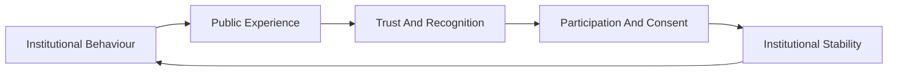
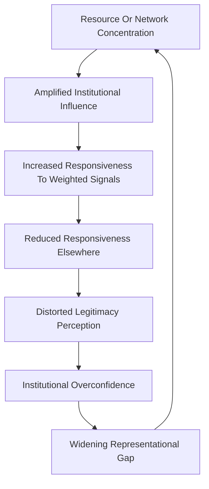
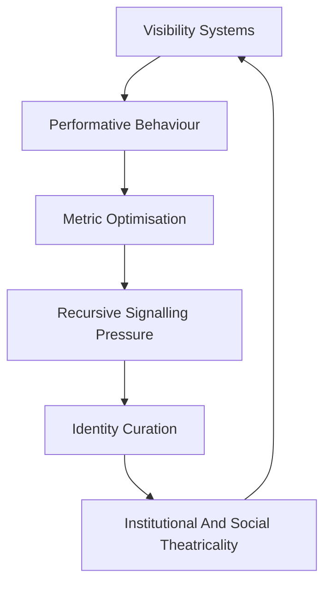

# 🫂 Sociological Legitimacy Analysis  
**First created:** 2026-05-23 | **Last updated:** 2026-05-23  
*Examining legitimacy through recognition, trust, participation, symbolic authority, social feedback systems, and the lived experience of governance.*

---

## 🛰️ Orientation  

🫂 *Sociological Legitimacy Analysis* examines authority through:
- trust,
- recognition,
- participation,
- symbolic credibility,
- emotional governance,
- social feedback,
- and collective belief systems.

Where ⚖️ *Legal Procedural Analysis* examines:
> whether authority is formally lawful,

🫂 *Sociological Legitimacy Analysis* examines:
> whether populations actually experience authority as legitimate.

Within Exousiología, legitimacy is not treated as purely procedural.

A system may remain:
- constitutional,
- administratively functional,
- and legally continuous,

while populations increasingly experience it as:
- alienating,
- humiliating,
- performative,
- inaccessible,
- or structurally indifferent to lived reality.

This method studies:
- why populations comply,
- why trust erodes,
- how legitimacy stabilises,
- how participation sustains authority,
- and how governance becomes socially hollow long before institutions formally collapse.

Authority is therefore treated not merely as:
> power enforced,

but as:
> power socially recognised as meaningful, intelligible, and worthy of participation.

---

## 🔍 Core Questions  

This method asks:

- Do populations recognise authority as legitimate?
- How is trust produced and maintained?
- What experiences strengthen or erode legitimacy?
- Which groups feel represented or excluded?
- How does governance become emotionally intelligible or alienating?
- How do institutions maintain symbolic credibility?
- How does participation reinforce authority?
- What happens when populations disengage?
- How do narrative systems shape legitimacy?
- Whose feedback actually influences institutional behaviour?

It also asks:
- when authority feels relationally real,
- and when governance becomes socially theatrical.

---

## 🧠 What This Method Sees Well  

### 🫂 Recognition And Trust  

Sociological legitimacy analysis is especially strong at examining:
- institutional trust,
- recognitional dignity,
- perceived fairness,
- and relational credibility.

People rarely comply with systems purely because:
- rules exist.

They also respond to:
- whether institutions feel responsive,
- whether participation matters,
- whether systems appear intelligible,
- and whether governance recognises lived reality.

---

### 🗳️ Participation And Consent  

Authority is often stabilised through:
- participation,
- civic involvement,
- public recognition,
- and perceived influence over outcomes.

This method is particularly useful for examining:
- democratic legitimacy,
- disengagement,
- voter withdrawal,
- political fatigue,
- and legitimacy erosion before formal collapse occurs.

---

### 🎭 Symbolic Governance  

Institutions govern symbolically as well as procedurally.

This includes:
- rhetoric,
- ceremony,
- institutional tone,
- representational performance,
- symbolic reassurance,
- and narrative framing.

This method is therefore highly useful for examining:
- governance theatre,
- patriotic ritual,
- narrative management,
- symbolic politics,
- and legitimacy performance during crisis.

---

### 📺 Narrative And Media Systems  

Public understanding of legitimacy is heavily shaped through:
- journalism,
- media systems,
- political storytelling,
- visibility structures,
- and institutional communication.

This method overlaps significantly with:
- narrative governance,
- reputational systems,
- symbolic containment,
- and recursive feedback environments.

---

### 🌡️ Emotional Governance  

Governance is experienced emotionally as well as procedurally.

Fear,
humiliation,
recognition,
dignity,
security,
resentment,
and exhaustion
all shape legitimacy.

This method is therefore especially strong at examining:
- governance atmosphere,
- institutional mood,
- symbolic reassurance,
- collective anxiety,
- and emotional alienation.

---

## 🫥 What This Method Often Misses  

### ⚖️ Formal Structural Constraints  

Sociological legitimacy analysis may underemphasise:
- constitutional structure,
- legal procedure,
- delegation systems,
- jurisdiction,
- and formal institutional constraints.

A system may remain socially popular while becoming:
- procedurally unstable,
- legally dangerous,
- or vulnerable to arbitrary concentration of power.

---

### 🧱 Administrative Mechanics  

Trust alone does not produce:
- governance scalability,
- infrastructure continuity,
- dispute resolution systems,
- or institutional durability.

This method may therefore romanticise:
- emotional legitimacy,
- symbolic unity,
- or charismatic leadership,

without fully accounting for:
- bureaucratic load,
- institutional complexity,
- and procedural coordination.

---

### 🌌 Cosmological Depth  

Some authority systems derive legitimacy through:
- sacred order,
- metaphysical continuity,
- ancestral obligation,
- or symbolic cosmology.

Sociological analysis may flatten these structures into:
> “social belief”
without fully examining existential or civilisational ontology itself.

---

### 🪵 Invisible Maintenance Labour  

Public legitimacy often depends upon:
- care work,
- mutual aid,
- emotional labour,
- and informal adaptation systems.

This method may recognise symbolic legitimacy while underestimating:
> the practical survival infrastructures sustaining governance continuity beneath institutional visibility.

---

## ⚖️ Relationship To Legitimacy  

Within this framework, legitimacy emerges through:
- trust,
- participation,
- recognition,
- symbolic coherence,
- responsiveness,
- and lived experience.

Authority becomes stable not merely because:
- it is lawful,

but because populations experience it as:
- socially intelligible,
- emotionally credible,
- recognitionally valid,
- and meaningfully participatory.

This means legitimacy may erode long before:
- procedural collapse,
- constitutional rupture,
- or institutional failure becomes formally visible.

A system may remain:
- operational,
- lawful,
- and administratively coherent,

while populations increasingly:
- disengage,
- distrust,
- withdraw participation,
- or cease emotionally recognising authority as legitimate.

---

## 🔄 Social Legitimacy Loops  

Trust shapes participation.  
Participation reinforces legitimacy.  
Legitimacy stabilises institutions.  
Institutional behaviour reshapes trust.

Legitimacy is therefore recursive rather than static.

Institutions shape populations.  
Populations reshape institutions.

The central question is:
> whether the feedback ecology remains representative, adaptive, and relationally grounded.

---

## ⚠️ Distorted Feedback And Representational Drift  

Institutions rarely respond equally to all signals.

Some forms of feedback become amplified through:
- capital concentration,
- stakeholder dependence,
- elite networks,
- institutional familiarity,
- media visibility,
- political access,
- reputational alliances,
- or infrastructural dependency.

This does not necessarily require:
- conspiracy,
- corruption,
- or malicious coordination.

Many actors within institutions are genuinely attempting to:
- stabilise systems,
- secure continuity,
- reduce harm,
- preserve infrastructure,
- or support projects they sincerely believe are beneficial.

However, recursive systems naturally begin weighting:
- high-impact signals,
- concentrated resources,
- and structurally important relationships more heavily.

This can gradually distort institutional perception.

At extreme levels, institutions may begin:
- mistaking stakeholder reassurance for public trust,
- mistaking financial stability for legitimacy stability,
- or mistaking elite consensus for broad representational alignment.

Exousiología therefore treats legitimacy crises partly as:
> feedback crises.

The institution continues receiving signals.

But the signals no longer accurately represent the broader social ecology the institution claims to serve.

---

## 💰 Capital, Scarcity, And Material Legitimacy  

Sociological legitimacy is shaped not only through:
- narrative,
- symbolism,
- participation,
- or institutional tone,

but through:
- material distribution,
- economic security,
- infrastructure access,
- labour conditions,
- and perceived fairness of resource allocation.

Populations experience governance materially through:
- housing,
- wages,
- healthcare,
- transport,
- bureaucracy,
- education,
- energy systems,
- and survival pressure.

As a result, legitimacy is frequently shaped by:
- who receives stability,
- who absorbs scarcity,
- who carries administrative burden,
- and how precarity is distributed across populations.

This does not mean legitimacy reduces entirely to economics.

However, sociological legitimacy becomes increasingly difficult to sustain when large populations experience governance as:
- extractive,
- humiliating,
- precarious,
- indifferent,
- or structurally exhausting.

Narrative legitimacy cannot indefinitely compensate for:
- chronic instability,
- widening inequality,
- infrastructural deterioration,
- or persistent social exhaustion.

---

## 🎭 Hyperscaled Performativity  

Modern visibility systems increasingly transform social life into:
- persistent performance,
- reputational optimisation,
- and recursive audience awareness.

As visibility becomes:
- economically valuable,
- socially valuable,
- professionally valuable,
- and algorithmically mediated,

individuals and institutions alike become incentivised toward:
- performance,
- branding,
- optimisation,
- symbolic signalling,
- and metric-aware behaviour.

This creates conditions where:
> there is increasingly nowhere which is not a stage.

Institutions may begin governing performatively through:
- optics,
- narrative management,
- symbolic responsiveness,
- and legitimacy theatre,

while populations increasingly experience:
- exhaustion,
- self-monitoring,
- identity optimisation,
- and ambient audience pressure.

Exousiología treats this as a major transformation in:
- legitimacy formation,
- social signalling,
- and recognitional governance systems.

---

## 🤖 Proto-Algorithmic Governance  

Long before digital algorithms, societies already contained:
- recursive signalling systems,
- visibility weighting,
- reputational amplification,
- prestige filtering,
- and behavioural optimisation structures.

Media organisations,
bureaucracies,
markets,
universities,
religious institutions,
and political systems
all developed forms of:
- signal reinforcement,
- feedback amplification,
- narrative weighting,
- and legitimacy optimisation.

Modern computational systems did not invent these dynamics.

They:
- formalised,
- accelerated,
- automated,
- and hyperscaled them.

The underlying recursive logic:

reward signal
→ behavioural adaptation
→ amplified visibility
→ recursive reinforcement
→ feedback distortion
→ institutional drift

predates digital computation significantly.

Exousiología therefore treats many modern algorithmic crises as:
> intensified forms of older governance and legitimacy dynamics.

---

## 🌍 Historical And Structural Examples  

This analytical lens is especially useful for examining:
- democratic trust crises,
- populist movements,
- institutional disengagement,
- media legitimacy,
- symbolic politics,
- governance theatre,
- visibility economies,
- and social fragmentation.

It is particularly strong at analysing:
- legitimacy erosion before collapse,
- emotional governance,
- symbolic authority,
- representational drift,
- and institutional alienation.

It is less effective at independently analysing:
- constitutional mechanics,
- procedural legality,
- sacred cosmology,
- or invisible survival infrastructures.

---

## 🔄 Relationship To Other Methods  

### ⚖️ Legal Procedural Analysis  

A system may remain:
- lawful,
- constitutional,
- and procedurally continuous,

while populations increasingly withdraw:
- trust,
- participation,
- and emotional recognition.

Legality and legitimacy do not always align.

---

### 🪵 Folk And Survival Analysis  

Formal legitimacy frequently differs from:
- practical survivability,
- local adaptation,
- and embedded trust systems.

Folk analysis often reveals:
> where populations actually place operational trust during instability.

---

### 🌌 Cosmological Alignment Analysis  

Some systems derive legitimacy through:
- sacred order,
- metaphysical continuity,
- or symbolic inevitability.

Cosmological analysis examines:
> why authority feels existentially anchored rather than merely socially recognised.

---

### 🩻 Pathological Failure Analysis  

Pathological analysis examines:
- legitimacy exhaustion,
- institutional alienation,
- symbolic hollowing,
- and recursive representational distortion.

This becomes especially important when:
> institutions remain operational while populations cease emotionally recognising their legitimacy.

---

## 🌱 Ecological Interpretation  

Exousiología treats sociological legitimacy as:
> relational ecosystem stability.

Healthy governance systems:
- preserve trust,
- maintain intelligibility,
- distribute recognition,
- allow meaningful participation,
- and sustain responsive feedback systems.

Legitimacy therefore depends heavily upon:
- reciprocity,
- representational integrity,
- symbolic coherence,
- adaptive responsiveness,
- and feedback ecology health.

Governance becomes ecologically unstable when institutions increasingly:
- govern symbolically rather than relationally,
- optimise for visibility rather than responsiveness,
- or receive distorted feedback from narrowed social networks.

At extreme levels, systems may remain:
- operational,
- visible,
- and symbolically active,

while becoming:
- socially brittle,
- emotionally exhausting,
- performatively recursive,
- or relationally hollow.

---

## ⚠️ Failure Modes  

### 🎭 Governance Theatre  

Institutions increasingly perform:
- listening,
- accountability,
- participation,
- or responsiveness,

without materially redistributing:
- influence,
- responsiveness,
- or structural power.

---

### 🪤 Representational Distortion  

Institutions may increasingly respond to:
- concentrated signals,
- elite networks,
- visibility incentives,
- or stakeholder reassurance,

while losing meaningful contact with broader populations.

---

### 🌫️ Institutional Alienation  

Populations may increasingly experience governance as:
- inaccessible,
- humiliating,
- performative,
- or emotionally unintelligible.

This often produces:
- disengagement,
- cynicism,
- fragmentation,
- or populist reaction.

---

### 🧱 Legitimacy Exhaustion  

Institutions may remain operational while gradually losing:
- trust,
- symbolic credibility,
- emotional recognition,
- and participatory energy.

This often precedes:
- instability,
- radicalisation,
- or systemic rupture.

---

## 🌌 Constellations  

🫂 🎭 📺 💰 🤖 🌫️ 🧱 🗳️  
*Legitimacy as trust, recognition, participation, signalling, and recursive social feedback — always vulnerable to distortion, theatricality, optimisation, and representational drift.*

---

## ✨ Stardust  

sociological legitimacy, governance theatre, emotional governance, institutional trust, narrative legitimacy, symbolic authority, representational drift, visibility systems, recursive signalling, performative governance, legitimacy erosion, feedback ecology, proto-algorithmic governance, hyperscaled optimisation

---

## 🏮 Footer  

*🫂 Sociological Legitimacy Analysis* is a living node of the **Polaris Protocol**.  
It examines legitimacy through trust, recognition, participation, symbolic governance, social feedback systems, and the lived experience of institutional life within the wider framework of *🧄 Exousiología*.

This node studies both:
- how legitimacy becomes socially stabilised,
- and how systems become performative, distorted, or relationally hollow when feedback ecologies narrow and representational integrity deteriorates.

> 📡 Cross-references:
>
> - [🧄 Exousiología](../README.md) — *ecological framework for legitimacy, stewardship, and adaptive continuity*  
> - [🔬 Methods Of Examination](./README.md) — *plural analytical approaches for examining legitimacy and authority*  
> - [⚖️ Legal Procedural Analysis](./⚖️_legal_procedural_analysis.md) — *legitimacy through law, procedure, and institutional continuity*  
> - [🌸 Containment Studies](../../🌸_Containment_Studies/README.md) — *companion framework examining containment, coercive stabilisation, and institutional hardening*  

*Authority is relational. Stewardship is load-bearing. Stability must remain livable.*  

_Last updated: 2026-05-23_
