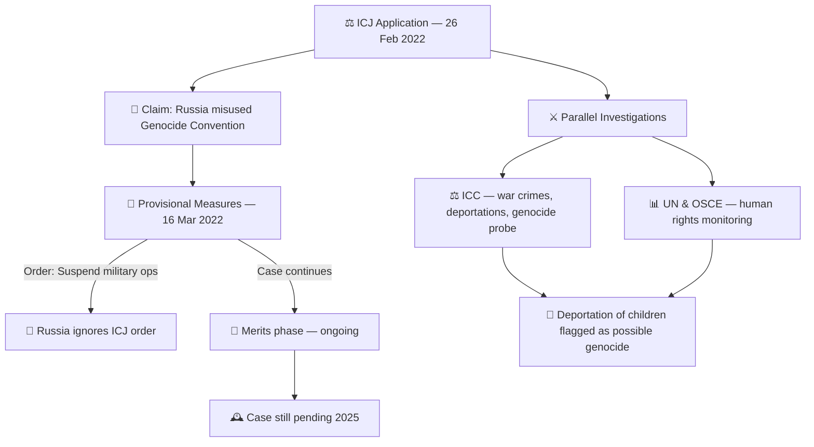

# 🪖 Ukraine v Russia — Genocide Claim Timeline  
**First created:** 2025-09-24 | **Last updated:** 2026-08-12  
*ICJ proceedings on misuse of the Genocide Convention & related atrocity probes.*  

---

## 🛰️ Orientation  
This node tracks the ICJ case where Ukraine accused Russia of abusing the Genocide Convention to justify its 2022 invasion, alongside parallel atrocity investigations.  

---

## 📜 Timeline  

- **2022-02-26** — Ukraine files application at the **International Court of Justice (ICJ)**.  
  - Claim: Russia falsely alleged “genocide” in Donbas to justify invasion.  
  - Request: Court declare no genocide, order Russia to stop military operations.  

- **2022-03-07** — Oral hearings in The Hague.  
  - Russia boycotted first session, but sent written objections.  

- **2022-03-16** — ICJ orders **provisional measures**:  
  - Russia must *“immediately suspend”* military operations.  
  - Russia must not aggravate the dispute.  
  - Russia ignores the order.  

- **2022–2023** — Case moves to merits phase; written submissions exchanged.  

- **Parallel tracks**:  
  - **ICC** opens investigation into war crimes, crimes against humanity, possible genocide.  
  - **OSCE & UN bodies** document deportations of children, civilian attacks, filtration camps.  

- **2023–2025** — Litigation ongoing.  
  - ICJ case = about misuse of the Convention, not proving genocide in Ukraine.  
  - ICC + UN continue probing whether mass child deportations meet genocide threshold.  

---

## 🗺️ Process Map  

## 📊 Impacts & Stakes  
- **Legal precedent:** misuse of “genocide” as a justification for aggression.  
- **Accountability gap:** ICJ can order measures but lacks enforcement; ICC probes crimes directly.  
- **Narrative stakes:** what counts as “genocide” becomes a contested weapon in war discourse.  

---

## ✨ Stardust — Related Tags & Signals  
- ICJ genocide case Ukraine v Russia  
- abuse of Genocide Convention  
- child deportations, war crimes  
- provisional measures ignored  
- ICC parallel investigations  
- UN/OSCE atrocity monitoring  
- genocide as narrative weapon  
- international law as theatre  

---

## 🏮 Footer  
*Ukraine v Russia — Genocide Claim Timeline* is a living node of the Polaris Protocol.  
It documents how “genocide” was contested at the ICJ, and how parallel accountability tracks (ICC, UN) diverged in scope.  

> 📡 Cross-references:
> 
> - [👁️ Witness Historical Casefiles](./README.md) — *international case precedents*  
> - [🧠 HM Dept Coercive Nudges](../🪄_Expression_Of_Norms/🧠_HM_Dept_Coercive_Nudges/README.md) — *misuse of legal categories as coercive tools*  

*Survivor authorship is sovereign. Containment is never neutral.*  

_Last updated: 2026-08-12_  

