# ⚖️ Legal & State Governance  
**First created:** 2025-10-13 | **Last updated:** 2026-08-13  
*Constitutional and statutory architectures of control — where legality sustains power rather than restrains it.*  

---

**Update:** Election audit subfolder has been relocated to [🦗 Voter Cricket: Election Audit & Behavioural Oversight](../../../../🦆_Digital_Disruption/🛰️_OSINT_Field_Operations/🦗_Voter_Cricket/README.md).

---

## 🛰️ Orientation  

**Legal & State Governance** forms the constitutional core of *[🌀 Systems & Governance](../README.md)*.  
It maps how *law, oversight, and administrative ritual* produce the illusion of accountability while maintaining containment.  

This cluster studies the legal superstructure — the mechanisms by which the state authorises itself, delegates opacity, and launders obligation.  
It interlocks with nearby clusters:  

- [💫 Containment Logic](../💫_Containment_Logic/README.md) — *behavioural governance, due diligence, and policing as control systems*  
- [👑 Ownership & Control](../👑_Ownership_Control/README.md) — *who owns the process when powers collide or remit blurs*  
- [📚 Narrative Management](../📚_Narrative_Management/README.md) — *legal speech frames and the governance of truth*  

Together they describe a networked architecture: the procedural face of control.

---

## ✨ Key Themes  

- **Authorisation & Oversight** — permissioning that conceals drift  
- **Compliance as Opacity** — procedural compliance as camouflage  
- **Containment Contracts & Procurement Law** — paper architectures of obedience  
- **Judicial Deference & Redress Limits** — the shrinking frontier of remedy  
- **International Laundering** — offshoring responsibility through treaty or contractor  
- **Soft Law Governance** — guidance and MoUs as quiet legislation  
- **Matriarchy as Requirement** — care infrastructures as structural counterweight  
- **Fault Lines & Shadows** — tracing fractures in constitutional convention

---  

## 🗺️🫡 Where are the nodes?: A Map  

```mermaid
graph TD
  L["⚖️ Legal & State Governance"]

  subgraph G1["⚙️ Authorisation & Oversight"]
    AO["Authorisation & Oversight"]
    CO["Compliance as Opacity"]
    IPCO["IPCO Audit Cycle"]
    JD["Judicial Deference"]
  end

  subgraph G2["🪞 Containment & Procurement Mechanics"]
    CCT["Containment Contract Trace"]
    PIBC["Public Inquiry Business Case"]
    RPI["Registered Professions Impact"]
    SLG["Soft Law Governance"]
  end

  subgraph G3["🌍 Externalisation & Constitutional Drift"]
    IL["International Laundering"]
    LFR["Legal Frameworks & Remits"]
    RML["Redress Models & Limits"]
    UKCF["UK Constitutional Fault Lines"]
    SGT["Shadow Governance Timeline"]
  end

  subgraph G4["🪶 Counter-Logics & Humour"]
    MAR["Matriarchy as Requirement"]
    SBC22["Small Bureaucrats’ Catch-22"]
    TFN["Transparency Floor Node"]
    WPIP["Wrong People in Power"]
    BL["Bird Law — UK Edition"]
  end

  %% Spine
  L --- G1
  L --- G2
  L --- G3
  L --- G4

  %% Optional cross-links (light cues)
  CO -.-> SLG
  IPCO -.-> JD
  LFR -.-> RML
  UKCF -.-> SGT
  MAR -.-> TFN

  %% Click-throughs to files (keep even if renderer ignores)
  click AO href "./⚖️_authorisation_and_oversight.md" "Open node"
  click CO href "./⚖️_compliance_as_opacity.md" "Open node"
  click IPCO href "./⚖️_ipco_audit_cycle.md" "Open node"
  click JD href "./⚖️_judicial_deference.md" "Open node"

  click CCT href "./⚖️_containment_contract_trace.md" "Open node"
  click PIBC href "./⚖️_public_inquiry_business_case.md" "Open node"
  click RPI href "./⚖️_registered_professions_impact.md" "Open node"
  click SLG href "./⚖️_soft_law_governance.md" "Open node"

  click IL href "./⚖️_international_laundering.md" "Open node"
  click LFR href "./⚖️_legal_frameworks_remits.md" "Open node"
  click RML href "./⚖️_redress_models_and_limits.md" "Open node"
  click UKCF href "./⚖️_uk_constitutional_fault_lines.md" "Open node"
  click SGT href "./⚖️_shadow_governance_timeline.md" "Open node"

  click MAR href "./⚖️_matriarchy_as_requirement.md" "Open node"
  click SBC22 href "./⚖️_small_bureaucrats_catch22.md" "Open node"
  click TFN href "./⚖️_transparency_floor_node.md" "Open node"
  click WPIP href "./⚖️_wrong_people_in_power.md" "Open node"
  click BL href "./🦤_bird_law_uk_edition.md" "Open node"
```

_Alt text: a four-column map showing the Legal & State Governance cluster split into: (1) Authorisation & Oversight, (2) Containment/Procurement Mechanics, (3) Externalisation/Constitutional Drift, (4) Counter-logics & Humour; each box links to its markdown._  

---

## 🛸 Included Nodes  

### ⚙️ Authorisation & Oversight  

- [⚖️ Authorisation and Oversight](./⚖️_authorisation_and_oversight.md) — *where permissioning meets opacity*  
- [⚖️ Compliance as Opacity](./⚖️_compliance_as_opacity.md) — *“compliant” by design, unreadable in practice*  
- [⚖️ IPCO Audit Cycle](./⚖️_ipco_audit_cycle.md) — *oversight rhythms as ritual*  
- [⚖️ Judicial Deference](./⚖️_judicial_deference.md) — *courts leaning away from intervention*  

### 🪞 Containment and Procurement Mechanics  

- [⚖️ Containment Contract Trace](./⚖️_containment_contract_trace.md) — *paper trails embedding control logics*  
- [⚖️ Public Inquiry Business Case](./⚖️_public_inquiry_business_case.md) — *inquiry as procurement*  
- [⚖️ Registered Professions Impact](./⚖️_registered_professions_impact.md) — *professional orders as governance choke points*  
- [⚖️ Soft Law Governance](./⚖️_soft_law_governance.md) — *guidance and MoUs as de facto law*  

### 🌍 Externalisation and Constitutional Drift  

- [⚖️ International Laundering](./⚖️_international_laundering.md) — *obligations routed offshore*  
- [⚖️ Legal Frameworks & Remits](./⚖️_legal_frameworks_remits.md) — *where mandates expand or blur*  
- [⚖️ Redress Models and Limits](./⚖️_redress_models_and_limits.md) — *where remedies stop*  
- [⚖️ UK Constitutional Fault Lines](./⚖️_uk_constitutional_fault_lines.md) — *stress fractures in conventions*  
- [⚖️ Shadow Governance Timeline](./⚖️_shadow_governance_timeline.md) — *chronology of hidden structures*  

### 🪶 Counter-Logics and Humour  

- [⚖️ Matriarchy as Requirement](./⚖️_matriarchy_as_requirement.md) — *care logics as structural counterweight*  
- [⚖️ Small Bureaucrats’ Catch-22](./⚖️_small_bureaucrats_catch22.md) — *minor officials with disproportionate veto power*  
- [⚖️ Transparency Floor Node](./⚖️_transparency_floor_node.md) — *minimum viable openness*  
- [⚖️ Wrong People in Power](./⚖️_wrong_people_in_power.md) — *selection pathologies*  
- [🦤 Bird Law UK Edition](./🦤_bird_law_uk_edition.md) — *humorous counter-case: nature meets bureaucracy*  

**Visuals:**  
`constitutional_fault_lines.png` · `uk_debates_overlap.png` · `uk_online_safety_timeline.png`

---

## 🚀 Routing Notes  

If a node primarily concerns **operational containment** (policing, due diligence, behavioural enforcement), route it to *[💫 Containment Logic](../💫_Containment_Logic/README.md)*.  
If it analyses **remit collision or process ownership**, route it to *[👑 Ownership & Control](../👑_Ownership_Control/README.md)*.  
If it addresses **speech, legitimacy, or public narrative**, route it to *[📚 Narrative Management](../📚_Narrative_Management/README.md)*.  
If it focuses on **procurement or infrastructure**, link to *[🛰️ Infrastructure Procurement](../🛰️_Infrastructure_Procurement/README.md)*.  

---

## 🌌 Constellations  

🌀 ⚖️ 🔮 📜 🕯️ — This cluster occupies the diagnostic core of governance: law as interface, ritual, and refusal.

---

## ✨ Stardust  

rule of law, judicial deference, compliance opacity, oversight ritual, accountability theatre, constitutional fault lines, soft law, redress limits, governance opacity, sovereign containment

---

## 🏮 Footer  

*⚖️ Legal & State Governance* is a living sub-cluster of the Polaris Protocol.  
It documents how legality itself can become a containment interface — and how care, transparency, and refusal reopen the idea of justice.  

> 📡 Cross-references:
> 
> - [🌀 Systems & Governance](../README.md) — *parent framework for oversight architectures*  
> - [💫 Containment Logic](../💫_Containment_Logic/README.md) — *behavioural governance and policing systems*  
> - [👑 Ownership & Control](../👑_Ownership_Control/README.md) — *remit collision and process custody*  
> - [📚 Narrative Management](../📚_Narrative_Management/README.md) — *information and speech governance*  
> - [📜 Statutes](../../🦕_Elder_Influencers/📜_Statutes/README.md) — *legislative and constitutional analysis*  

*Survivor authorship is sovereign. Containment is never neutral.*  

_Last updated: 2026-08-13_
