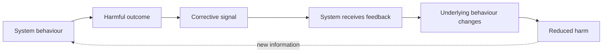
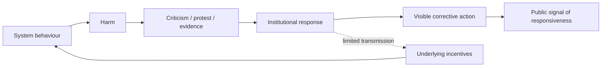
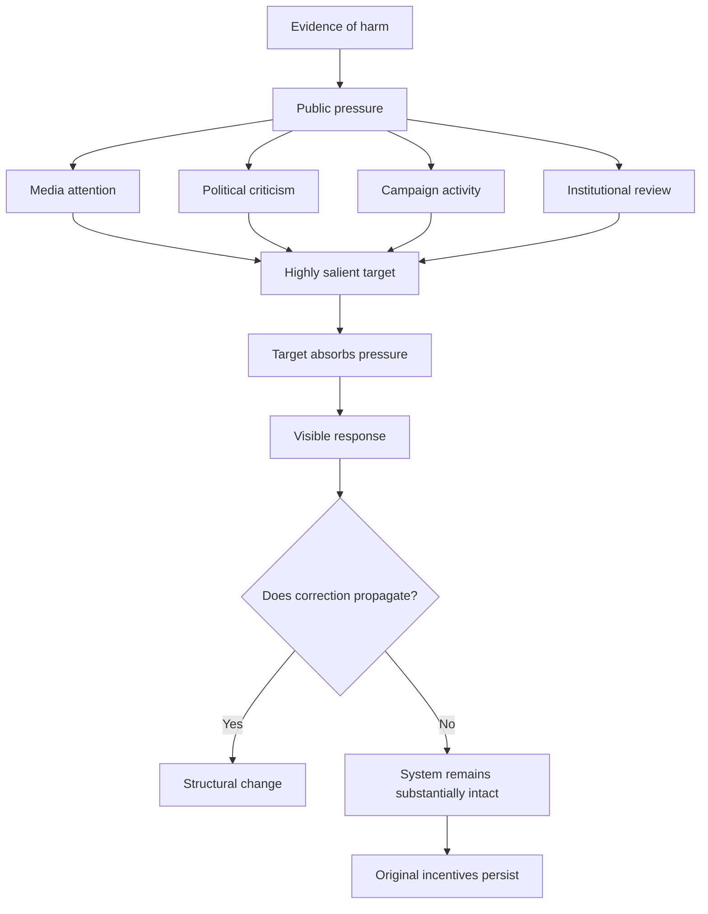
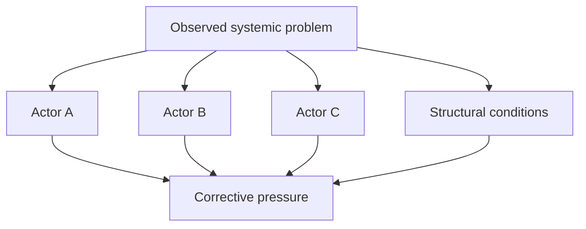
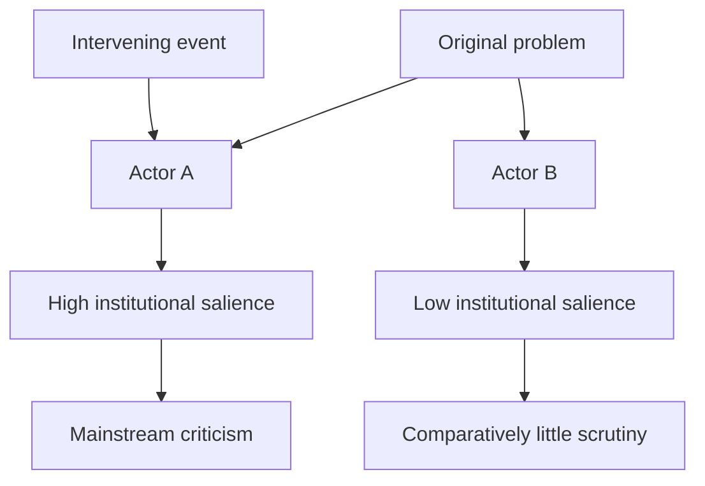
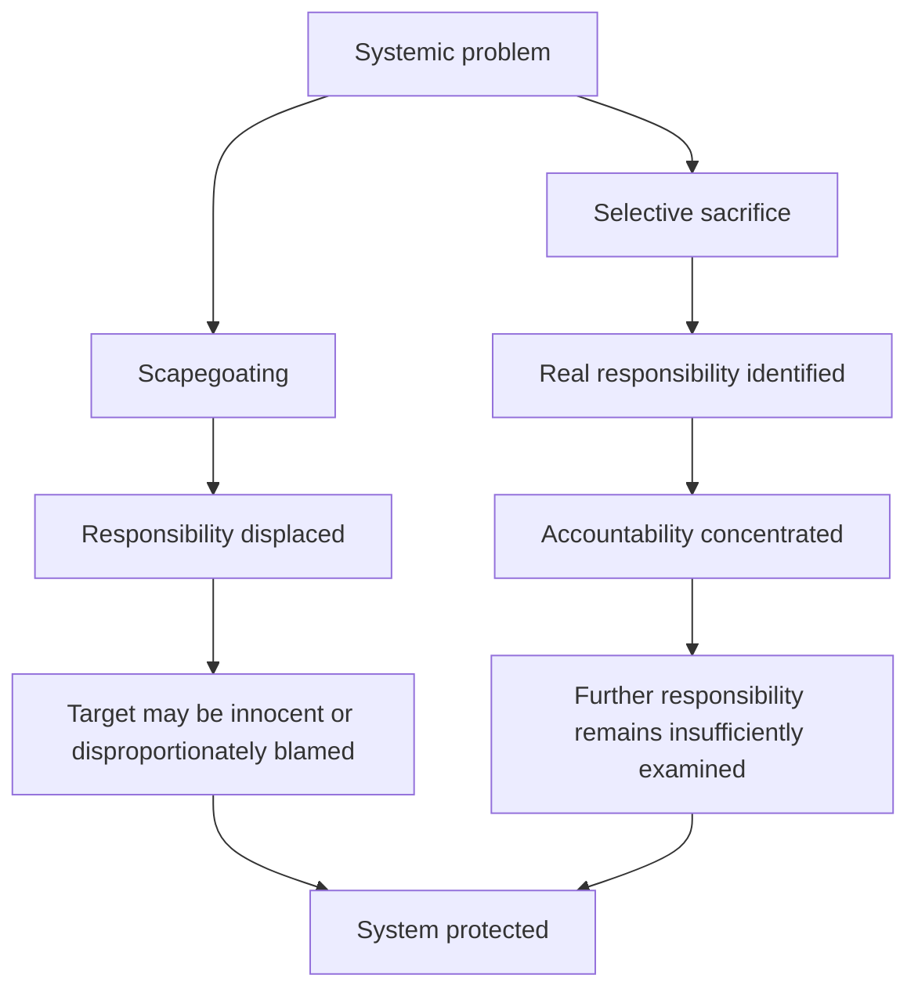
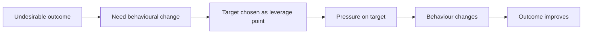
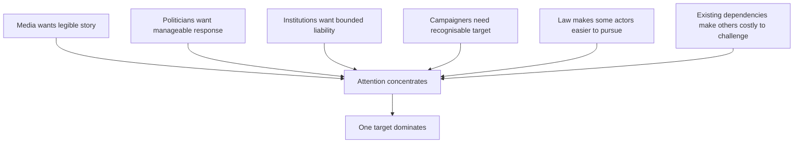
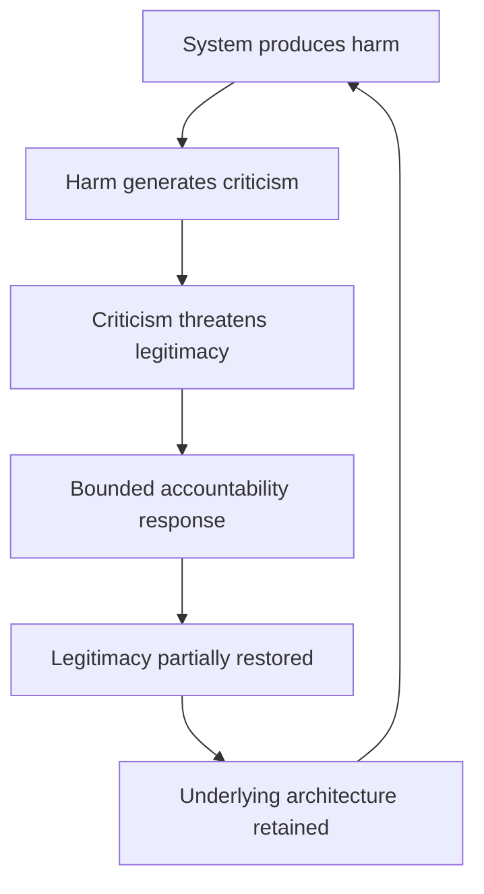
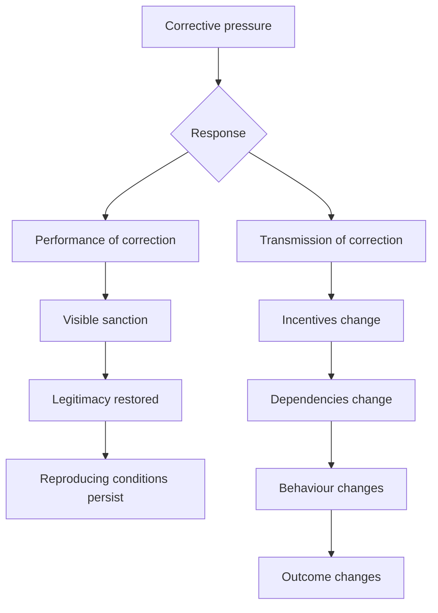

# 🌀 Absorption and Selective Sacrifice

**First created:** 2026-08-23 | **Last updated:** 2026-08-23
*How systems can receive corrective pressure, visibly respond to it, and nevertheless prevent the correction from reaching the structures reproducing the original problem.*

---

## 🛰️ Orientation

Systems do not have to ignore criticism in order to resist change.

Sometimes the more durable response is to **receive the signal, process it, produce a visible response, and prevent the correction from propagating any further than necessary**.

This matters because the resulting system can look responsive.

Someone is criticised.
Something is investigated.
A company loses a contract.
An official resigns.
A policy is amended.
A regulator intervenes.

The feedback loop appears to be functioning.

But the relevant question is not simply whether the system responded.

It is:

> **Did the response alter the conditions reproducing the original harm?**

If not, accountability may have functioned partly as **absorption**.

At its most developed, this can produce **selective sacrifice**: one sufficiently implicated component becomes expendable, allowing the wider system to demonstrate responsiveness while substantially preserving its underlying relationships, incentives, dependencies or distributions of power.

The sacrifice may be completely deserved.

That is precisely why it can work.

---

## 🌀 Receiving Feedback Is Not the Same as Correcting

In a simple corrective system, evidence of a harmful outcome should feed back into the processes producing it.



Political and institutional systems are considerably messier.

A corrective signal may enter the system without reaching the mechanism responsible for producing the outcome.



The presence of **E** is therefore not evidence that **G** changed.

That distinction is easy to lose.

---

## 📡 Signal, Transmission and Absorption

A useful distinction can be made between three stages.

### Signal

Information that something is wrong enters the environment.

This might take the form of:

* investigative reporting;
* litigation;
* protest;
* boycott;
* regulatory findings;
* whistleblowing;
* electoral pressure;
* market pressure;
* professional criticism;
* internal governance concerns.

### Transmission

The signal reaches actors capable of altering the processes responsible for the problem.

### Correction

Those processes actually change sufficiently to affect the outcome.

A system can therefore possess extremely high **signal visibility** while maintaining extremely low **corrective transmission**.

Indeed, highly visible responses can sometimes assist this process by creating the impression that transmission has already occurred.

---

## 🧽 Criticism Absorption

**Criticism absorption** describes the capacity of a system or component to receive substantial corrective pressure without transmitting proportionate change into the structures around it.



An **absorptive target** is particularly capable of performing this function.

It may be:

* highly recognisable;
* already controversial;
* narratively simple;
* institutionally separable;
* sufficiently large to withstand reputational damage;
* sufficiently expendable that losing it does not threaten the wider architecture.

This makes it extremely convenient as the place where diffuse criticism becomes concentrated.

---

## 🎯 Selective Salience

Before selective sacrifice can occur, there is often **selective salience**.

Imagine an original problem implicating several actors:



An intervening event can change the information environment.

A legal ruling, investigation, disclosure, political intervention or media event may make one component considerably easier to discuss than the others.



Nothing about this pattern alone establishes deliberate protection of B.

It does, however, create an analytical question:

> **Why did the accountability environment diverge?**

---

## ⚖️ Selective Legitimation

Salience and legitimacy are not identical.

A subject can be widely known while remaining institutionally difficult to criticise.

After an intervening event, criticism that previously carried professional, political or reputational risk may become acceptable.

This produces **selective legitimation**:

> criticism of one component enters the range of institutionally permissible positions while comparable criticism of adjacent components does not.

The change may be entirely justified by new evidence.

But once again, the relevant systems question is what happens next.

Does the new permission to criticise A expand scrutiny?

Or does A become the boundary at which scrutiny stops?

---

## 🧿 From Salience to Sacrifice

The possible progression is:


These stages should not be assumed merely because one follows another chronologically.

They are diagnostic categories.

But where the full sequence occurs, accountability can perform a paradoxical function:

> **the punishment of one component helps establish the legitimacy of the system containing it.**

The system can point to the sacrifice as evidence that its accountability mechanisms work.

---

## 🩸 The Sacrifice Can Be Guilty

Selective sacrifice should not be confused with scapegoating.

A scapegoat may be blamed for something it did not do, or assigned responsibility grossly disproportionate to its role.

A selectively sacrificed actor may be **completely culpable**.

The problem is not:

> *Why was A criticised?*

It is:

> **Why did accountability stop at A?**

This is an important distinction because genuine wrongdoing makes an actor particularly effective as a sacrificial target.

There is no need to manufacture the case.

The wrongdoing can be exposed accurately, condemned appropriately and sanctioned legitimately.

The systems failure occurs if the resulting accountability is then allowed to stand in for examination of the processes, actors and incentives that enabled the same outcome.

---

## 🪞 Scapegoating Versus Selective Sacrifice



Both mechanisms can protect systems.

They do so differently.

**Scapegoating distorts responsibility.**

**Selective sacrifice can accurately identify responsibility while artificially limiting its scope.**

The latter can therefore be considerably harder to recognise.

---

## 🧮 The Accountability Set

Another way of describing the problem is through an **accountability set**.

At the beginning of an event, the plausible accountability set might be:

```text
{ A, B, C, institutional process, incentive structure }
```

After public and institutional processing, it may become:

```text
{ A }
```

The analytical task is to explain the contraction.

Sometimes there will be an excellent reason.

Sometimes evidence exonerates B and C.

Sometimes jurisdiction only permits action against A.

Sometimes responsibility genuinely was concentrated in A.

But sometimes the contraction reflects:

* institutional convenience;
* legal tractability;
* media legibility;
* political acceptability;
* commercial dependency;
* reputational management;
* existing distributions of power;
* the availability of an actor capable of taking the hit.

The contraction itself is therefore worth documenting.

---

## 🪫 Means–Ends Inversion

Absorption becomes particularly effective when the target of an intervention gradually replaces the purpose of the intervention.

Initially:



But the process can invert:


The means has become the end.

This is especially likely where the target is:

* memorable;
* morally legible;
* personally identifiable;
* commercially famous;
* visually dramatic;
* already culturally associated with wrongdoing.

Success becomes easier to narrate.

Whether the system changed becomes harder to measure.

---

## 🕸️ No Conspiracy Required

Absorption and selective sacrifice do not require a committee deciding:

> *Let us sacrifice A so nobody notices B.*

Complex systems can generate the same outcome through distributed incentives.



Every participant may have a locally intelligible reason for what they are doing.

The aggregate result can nevertheless be:

**concentrated accountability and distributed protection.**

This is why systems analysis cannot stop at establishing individual intention.

Emergent outcomes matter.

---

## 🧬 Why Systems Do This

Deep correction is expensive.

It can require:

* admitting previous decisions were wrong;
* redistributing resources;
* abandoning sunk costs;
* changing procurement;
* exposing additional liability;
* altering professional incentives;
* challenging powerful constituencies;
* surrendering institutional prestige;
* accepting uncertainty during transition.

Selective correction is cheaper.

The system gets to demonstrate movement without necessarily undertaking reconstruction.

This does not make every limited intervention cynical.

Incremental change can be real change.

The distinction is whether the intervention becomes **a step through the problem** or **the point at which the problem is declared solved**.

---

## ♻️ The Self-Preserving Feedback Loop

There is therefore a pathological feedback architecture in which criticism itself becomes useful to system preservation.



The extraordinary feature of this loop is that **accountability is present**.

It simply does not reach far enough.

The system has not eliminated feedback.

It has learned to metabolise it.

---

## 🔬 Diagnostic Questions

When a conspicuous accountability event occurs, useful questions include:

* What was the original harm being addressed?
* What actors and structures were initially implicated?
* What was the original accountability set?
* Which component became most publicly salient?
* What changed its salience?
* Which forms of criticism became newly legitimate?
* Which adjacent criticisms did not?
* Was the sanctioned actor genuinely responsible?
* What responsibility remained elsewhere?
* Did sanctioning the actor change underlying incentives?
* Did dependencies, contracts, ownership or governance structures change?
* Could substantially the same outcome be reproduced through another actor?
* Has removing the target become synonymous with solving the problem?
* Who benefits from defining the accountability boundary here?
* Is this an intermediate correction or the termination of scrutiny?

The final question is the simplest:

> **Could the system reproduce substantially the same harm tomorrow using different people or organisations?**

If the answer is yes, the correction probably has not reached the deepest relevant layer.

---

## 🧭 Correction Versus Performance of Correction

The distinction can be compressed:



The two branches are not mutually exclusive.

A highly visible sanction can accompany profound structural reform.

The warning is simply that **visibility is not a proxy for depth**.

---

## 🌊 What To Follow

The object of analysis should therefore remain the **flow**, not merely the actor.

Follow:

**the money.
the contract.
the incentive.
the dependency.
the information.
the authority.
the replacement.
the outcome.**

If A disappears and all eight routes simply reconnect through B, very little has been corrected.

---

## 🧠 The Larger Information-Ecology Problem

Within an embodied information ecology, this matters because people encounter systems through salient events.

A resignation feels like accountability.

A cancelled contract feels like change.

A prosecution feels like correction.

A corporate scandal feels like exposure.

Those perceptions are not irrational. They are responses to genuine events.

But a system can contain many genuine events without changing its governing dynamics.

The informational environment therefore affects not only **what people know**, but **where they believe causality and responsibility terminate**.

Selective sacrifice is powerful partly because it gives an information ecology a satisfying ending.

There was a problem.

There was a villain.

There was a consequence.

The story is complete.

Systems, unfortunately, do not have to obey narrative structure.

---

## 🌀 A Different Definition of Success

Corrective interventions should ultimately be evaluated against the outcome that generated them.

Not:

> **Did somebody pay?**

But:

> **Did something change?**

Not:

> **Was criticism heard?**

But:

> **Where did it travel?**

Not:

> **Was an actor removed?**

But:

> **Can the system still reproduce the same result?**

This makes accountability harder to narrate.

It also makes it considerably harder to fake.

---

## 🌌 Constellations

🌀 🧿 ♻️ 🪫 🕸️ — feedback architecture; criticism absorption; selective accountability; systemic preservation; information ecology.

## ✨ Stardust

systems theory, feedback, negative feedback, criticism absorption, selective salience, selective legitimation, asymmetric accountability, selective sacrifice, systemic preservation, means ends inversion

---

## 🏮 Footer

*🌀 Absorption and Selective Sacrifice* is a living node of the **Polaris Protocol**.
It develops a systems framework for distinguishing visible responsiveness from corrective transmission, with particular attention to the ways accountability can become concentrated in individual actors while the structures capable of reproducing the original harm remain intact.

> 📡 Cross-references:
>
> * [🪿 Embodied Information Ecology](./) — *the wider ecology in which signals, interpretation, salience and institutional responses interact*
> * [🎯 What Was BDS Supposed To Do?](../../../🌓_3_In_The_Moment/📲_Press_Matters/🇵🇸_Palestine_Factchecking/🌍_Global_Powers/🎯_what_was_bds_supposed_to_do.md) — *case analysis of intended feedback, behavioural leverage and subsequent narrative transformation*
> * [💸 Making Harm Too Expensive To Continue](../../../🌕_5_Long_Strategies/💸_Business_Is_Tooling/💸_making_harm_too_expensive_to_continue.md) — *designing economic systems in which harmful conduct generates meaningful corrective costs*

*Survivor authorship is sovereign. Containment is never neutral.*

*Last updated: 2026-08-23*
