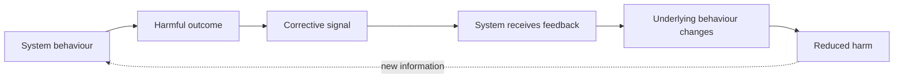
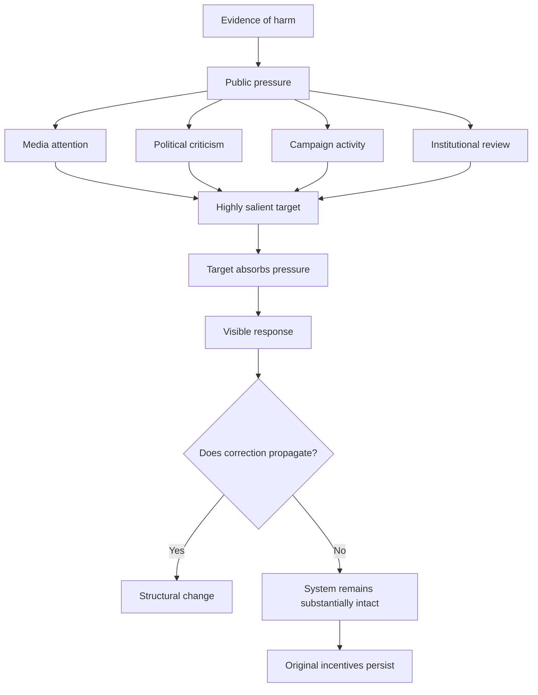
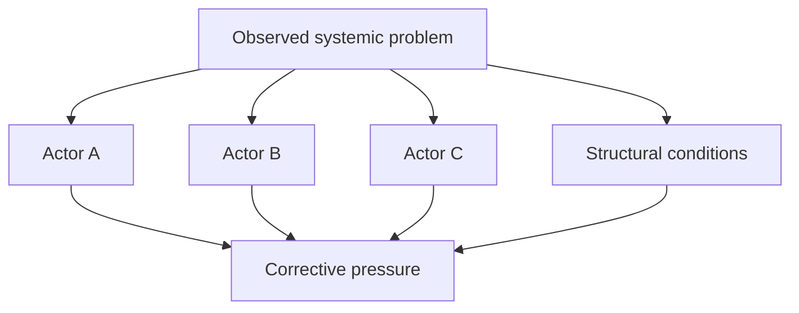
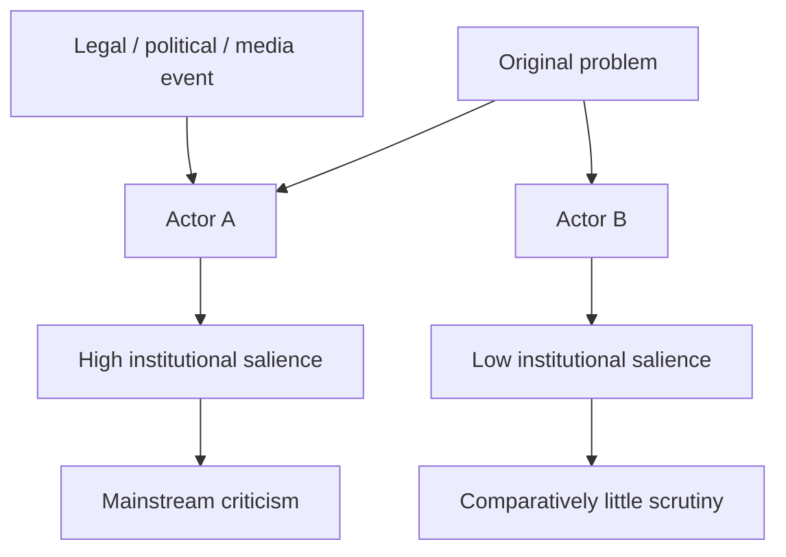
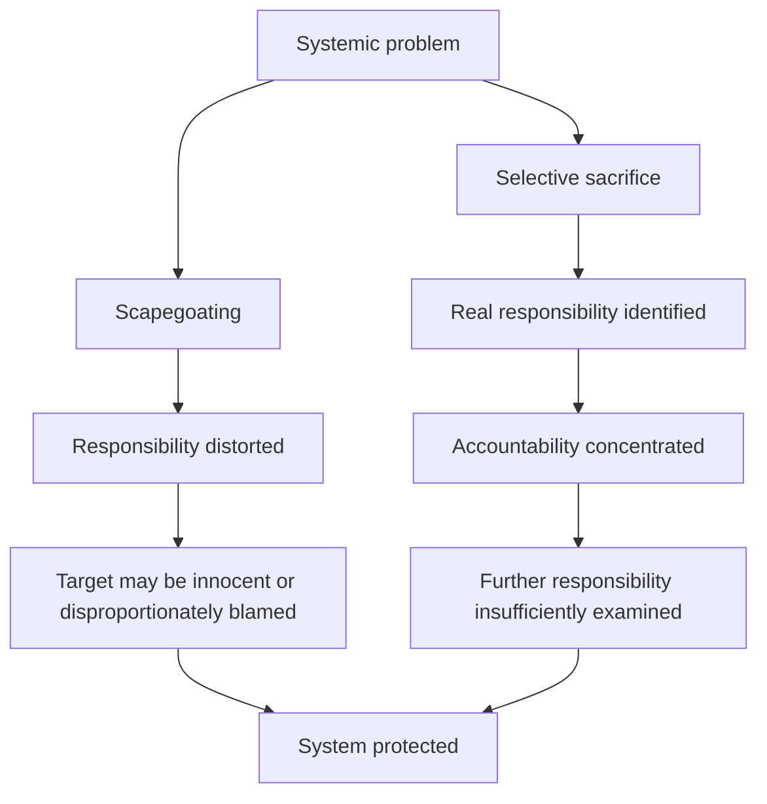
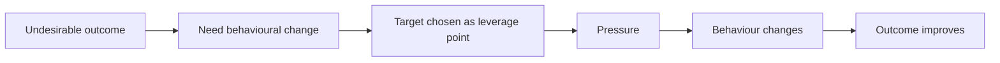
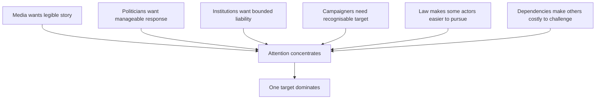
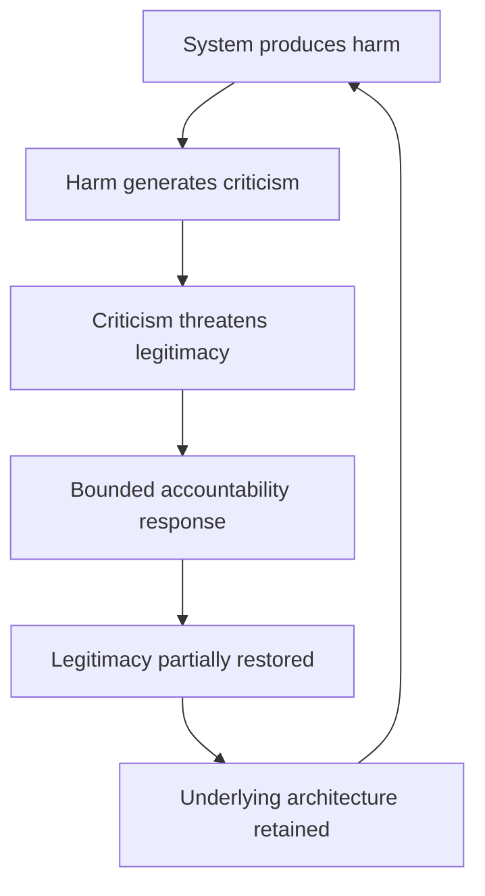
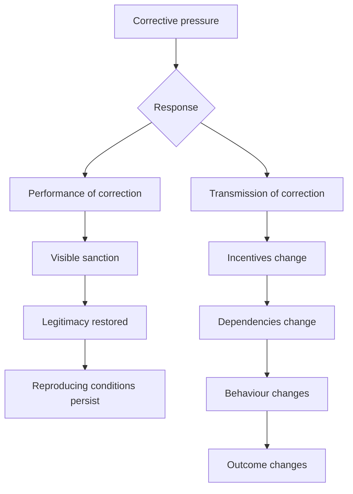

# 🌀 Absorption and Selective Sacrifice
**First created:** 2026-08-23 | **Last updated:** 2026-08-23  
*How systems can receive corrective pressure, visibly respond to it, and nevertheless prevent the correction from reaching the structures reproducing the original problem.*

---

## 🛰️ Orientation

Systems do not have to ignore criticism in order to resist change.

Sometimes the more durable response is to **receive the signal, process it, produce a visible response, and prevent the correction from propagating any further than necessary**.

Someone is criticised.  
Something is investigated.  
A company loses a contract.  
An official resigns.  
A policy changes.  
A regulator intervenes.

The feedback loop appears to be functioning.

But the relevant question is not simply whether the system responded.

It is:

> **Did the response alter the conditions reproducing the original harm?**

If not, accountability may have functioned partly as **absorption**.

At its most developed, this can produce **selective sacrifice**: one sufficiently implicated component becomes expendable, allowing the wider system to demonstrate responsiveness while substantially preserving its underlying relationships, incentives, dependencies or distributions of power.

The sacrifice may be entirely deserved.

That is precisely why it can work.

---

## ♻️ Receiving Feedback Is Not The Same As Correcting

A simple corrective system looks something like:



Political, institutional and commercial systems are messier.


The presence of **visible action** is not evidence that the reproducing mechanism changed.

---

## 📡 Signal, Transmission, Correction

Three stages need separating.

### Signal

Information that something is wrong becomes available.

It may arrive through:

- litigation;
- journalism;
- protest;
- boycott;
- whistleblowing;
- elections;
- professional criticism;
- market pressure;
- regulatory findings;
- internal governance.

### Transmission

The signal reaches actors or structures capable of altering the process producing the harm.

### Correction

The relevant behaviour, incentive or dependency actually changes.

A system can therefore possess very high **signal visibility** and very low **corrective transmission**.

---

## 🧽 Criticism Absorption

**Criticism absorption** is the capacity to receive substantial corrective pressure without transmitting proportionate change through the surrounding system.



An **absorptive target** is particularly capable of performing this function.

It may be:

- highly recognisable;
- already controversial;
- narratively simple;
- politically legible;
- institutionally separable;
- robust enough to withstand reputational damage;
- or useful enough that criticism does not materially threaten its place inside the system.

That last category matters.

Some targets do not merely **take the hit** because they are expendable.

They can take the hit because their institutional integration makes them unusually criticism-resistant.

---

## 🎯 Selective Salience

Imagine an original problem implicating several actors:



An intervening event can change the information environment.



Nothing about this pattern alone proves that B is being deliberately protected.

It does create a legitimate analytical question:

> **Why did the accountability environment diverge?**

---

## 🧮 The Accountability Set

Before the intervening event:

```text
{ A, B, C, institutional process, incentive structure }
```

After public processing:

```text
{ A }
```

The analytical problem is the contraction.

Sometimes the contraction is justified.

Perhaps:

- evidence exonerates the others;
- jurisdiction reaches only A;
- responsibility genuinely concentrates in A;
- the legal event materially changes the evidential position.

But sometimes the contraction reflects:

- institutional convenience;
- legal tractability;
- political acceptability;
- media legibility;
- commercial dependency;
- reputational management;
- unequal power;
- or the availability of an actor capable of absorbing the load.

---

## ⚖️ Selective Legitimation

Salience and legitimacy are not identical.

An actor may be widely known while remaining institutionally difficult to criticise.

After a legal ruling, disclosure, political shift or major journalistic event, criticism of one actor may enter the range of establishment-permissible positions.

This produces **selective legitimation**:

> criticism of one component becomes institutionally safe while comparable criticism of adjacent components remains costly or marginal.

The question then becomes:

**does permission to criticise A expand the accountability set, or define its boundary?**

---

## 🩸 Selective Sacrifice

The possible progression is:


At that point, accountability can perform a paradoxical function:

> **punishing one component can help restore the legitimacy of the system containing it.**

---

## 🪞 Scapegoating Is Not Selective Sacrifice

A scapegoat may be falsely blamed or assigned wildly disproportionate responsibility.

A selectively sacrificed actor may be **completely culpable**.

That is why the relevant question is not:

> *Why was A criticised?*

It is:

> **Why did accountability stop at A?**



Selective sacrifice can therefore be harder to detect than scapegoating because the criticism itself may be completely accurate.

---

## 🧪 Abstract Worked Example

A useful diagnostic model is:

```text
Group X seeks action against Company A and Company B.

A legal event changes the public legitimacy of criticism.

Company A becomes increasingly criticised by establishment actors.

Company B does not.

A is subsequently treated as the principal accountability object.
```

The analysis should not leap straight to:

> *B is being protected.*

Instead ask:

- Did the legal event genuinely distinguish A from B?
- Did evidence concerning B change?
- Did jurisdiction differ?
- Was A simply more narratively legible?
- Did B remain commercially or politically harder to challenge?
- Did criticism of A create an appearance that the broader issue had now been addressed?
- Could removing A leave the underlying system almost unchanged?

That is the selective-sacrifice test in miniature.

---

## 🪫 Means–Ends Inversion

Initially:



But:


The means becomes the end.

---

## 🕸️ No Conspiracy Required

Distributed systems can produce concentrated accountability without anyone centrally planning it.



Every participant may have a locally reasonable explanation.

The emergent result can still be:

> **concentrated accountability and distributed protection.**

---

## 🧬 Why Systems Do This

Deep correction can require:

- admitting previous decisions were wrong;
- abandoning sunk costs;
- changing procurement;
- redistributing resources;
- exposing additional liability;
- challenging powerful constituencies;
- accepting transition risk;
- surrendering prestige;
- rebuilding institutional capacity.

Selective correction is cheaper.

The distinction is whether the intervention becomes:

**a step through the problem**

or

**the point at which the problem is declared solved.**

---

## ♻️ Accountability Can Become Part Of System Preservation



The extraordinary feature is that **accountability is genuinely present**.

It simply does not reach far enough.

The system has not eliminated feedback.

It has learned to metabolise it.

---

## 🔬 Diagnostic Questions

- What was the original harm?
- What was the original accountability set?
- What changed the salience of particular actors?
- What criticism became newly legitimate?
- What remained difficult to say?
- Was the criticised actor genuinely responsible?
- What responsibility remained elsewhere?
- Did incentives change?
- Did contracts change?
- Did dependencies change?
- Did governance change?
- Could a substitute actor reproduce substantially the same outcome?
- Did removing one actor become synonymous with solving the problem?
- Who benefits from drawing the accountability boundary here?
- What would deeper corrective transmission have required?

And:

> **Could the system reproduce substantially the same harm tomorrow using different people or organisations?**

If yes, the correction probably has not reached the deepest relevant layer.

---

## 🧭 Correction Versus Performance Of Correction



The two branches can coexist.

Visibility is simply not a proxy for depth.

---

## 🌊 Follow The Flow

Follow:

**the money.  
the contract.  
the incentive.  
the dependency.  
the information.  
the authority.  
the replacement.  
the outcome.**

If A disappears and all eight routes reconnect through B, the correction has probably been shallow.

---

## 🧠 The Information-Ecology Problem

People encounter systems through salient events.

A resignation feels like accountability.

A cancelled contract feels like change.

A prosecution feels like correction.

Those perceptions are not irrational.

They are responses to real events.

But systems can contain many real accountability events without materially changing their governing dynamics.

Selective sacrifice is powerful partly because it produces narrative closure:

**problem → villain → consequence → ending.**

Systems do not have to obey narrative structure.

---

## 🌌 Constellations

🌀 ♻️ 🧿 🕸️ 🪫 — feedback architecture; criticism absorption; selective accountability; narrative closure; systemic preservation.

---

## ✨ Stardust

systems theory, feedback, criticism absorption, selective salience, selective legitimation, asymmetric accountability, selective sacrifice, systemic preservation, means ends inversion

---

## 🏮 Footer

*🌀 Absorption and Selective Sacrifice* is a living node of the **Polaris Protocol**.  
It develops a cybernetic framework for distinguishing visible accountability from corrective transmission and for identifying circumstances in which one legitimate accountability target can absorb pressure that would otherwise propagate through a wider system.

> 📡 Cross-references:
>
> - [🎯 What Was BDS Supposed To Do?](../../../../🌓_3_In_The_Moment/📲_Press_Matters/🇵🇸_Palestine_Factchecking/🌍_Global_Powers/🎯_what_was_bds_supposed_to_do.md) — *case analysis of intended behavioural feedback and subsequent narrative transformation*
> - [💸 Making Harm Too Expensive To Continue](../../../../🌕_5_Long_Strategies/💸_Business_Is_Tooling/💸_making_harm_too_expensive_to_continue.md) — *designing economic feedback that reaches the decision point rather than terminating at symbolic accountability*
>
> 🏮 Return To:
>
> - [♻️ Cybernetics](./README.md) — *1up*
> - [🪿 Embodied Information Ecology](../README.md) — *2up*
> - [🌑 Origin Points](../../README.md) — *3up*
> - [🌌 Polaris Protocol - Root](../../../README.md) — *root*

*Survivor authorship is sovereign. Containment is never neutral.*

_Last updated: 2026-08-23_
