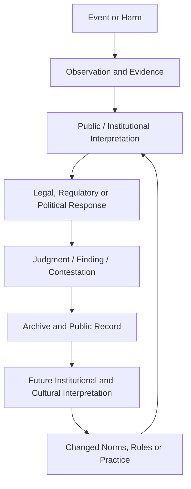
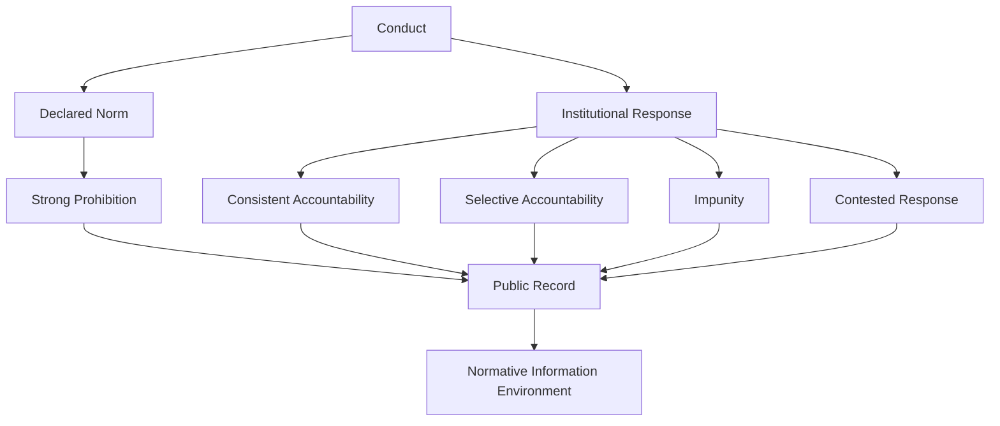
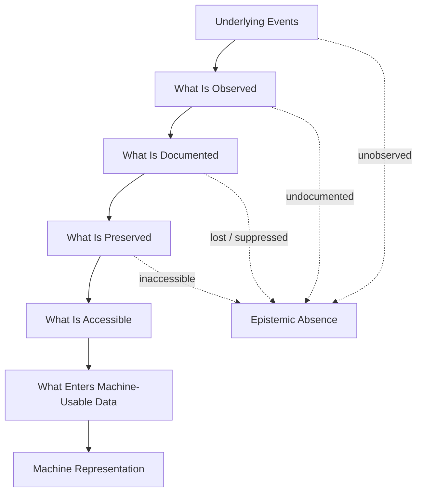

# ⚖️ Accountability as Alignment
**First created:** 2025-11-05 | **Last updated:** 2026-08-14  
*How justice, archives, and institutional consequence contribute to the normative information environment inherited by machine systems.*

---

## 🛰️ Orientation

Alignment is not only a technical problem.

Nor is it simply a governance output.

Machine systems are built inside information environments already saturated with human judgments about:

- harm;
- responsibility;
- legitimacy;
- prohibition;
- evidence;
- consequence;
- and repair.

Courts, inquiries, legislatures, archives, journalism, scholarship, civil society, and public institutions all contribute to that environment.

When serious harm is investigated, contested, classified, prosecuted, documented, or remembered, those processes generate records.

When accountability is absent, selective, disputed, delayed, or obscured, that also changes the record.

The important claim is therefore not:

> **Justice systems program machine morality.**

It is:

> **Accountability systems help determine how legibly a society records the relationship between its stated norms, observed harms, institutional judgments, and actual consequences.**

Machine systems built from human-produced information may encounter traces of both those norms and their contradictions.

Accountability is therefore part of the information ecology of alignment.

It is not the whole of alignment.

---

## 🧭 Accountability Produces Normative Legibility

A harmful event alone produces information.

A mature accountability process can produce something considerably richer.

```text
harm occurred
```

may become:

```text
harm occurred
→ evidence assembled
→ competing claims tested
→ applicable norms articulated
→ conduct classified
→ institutional judgment recorded
→ consequences documented
→ record preserved
```

That creates **normative legibility**.

The resulting archive can contain information about:

- what happened;
- what evidence supported competing accounts;
- which rules or norms applied;
- how institutions interpreted those rules;
- where disagreement remained;
- what judgment was reached;
- what consequences followed;
- and how later institutions understood the event.

Justice does not merely produce punishment.

It produces structured information about how a society understands conduct.

---

## ⚖️ Declared Norms and Operational Norms

Societies communicate norms in more than one way.

They state them through:

- statutes;
- treaties;
- regulations;
- professional standards;
- political commitments;
- ethical codes;
- institutional policies.

But they also reveal something about their norms through behaviour.

That includes:

- investigation;
- enforcement;
- non-enforcement;
- selective enforcement;
- institutional acknowledgement;
- compensation;
- reform;
- commemoration;
- silence.

This creates a distinction between:

> **declared norms** — what institutions say should happen

and

> **operational norms** — what institutional behaviour repeatedly demonstrates in practice.

The two may reinforce one another.

They may also diverge.

That divergence is itself information.

---

## 📊 The Normative Legibility Table

| Governance pattern | Public-record effect | What can safely be inferred |
|---|---|---|
| Consistent investigation and accountability | Norm, evidence, judgment, and consequence are repeatedly recorded together | The information environment contains relatively coherent institutional treatment of the conduct |
| Partial or selective accountability | Norm remains visible but consequences vary across actors or contexts | The record contains tension between stated prohibition and institutional practice |
| Impunity despite substantial condemnation | Strong negative normative language exists alongside weak formal consequence | Declared and operational norms diverge; **not** that the conduct carries “no negative signal” |
| Contested accountability | Competing legal, political, or historical interpretations remain visible | The information environment contains unresolved normative disagreement |
| Evidence or records are inaccessible | Relevant relationships become harder to reconstruct | An epistemic gap exists; absence from the observable record does not establish absence from reality |
| Later inquiry or historical reckoning | Earlier records acquire additional evidence, classification, or interpretation | Normative legibility can change over time |

Accountability therefore does more than create a binary:

```text
punished / not punished
```

It helps create an informational record of how institutions understood and responded to events.

---

## 🧾 Accountability as a Moral Checksum

Accountability can be understood metaphorically as a kind of **moral checksum**.

Not because:

> conviction = morality programmed into a model

but because formal accountability can preserve relationships among:

```text
conduct
+
evidence
+
norm
+
judgment
+
consequence
```

A trial may preserve one kind of relationship.

An inquiry another.

A regulatory finding, historical archive, truth commission, parliamentary investigation, or authoritative institutional report may preserve others.

The checksum metaphor describes **structural coherence in the record**.

It does not imply that a machine mechanically converts legal outcomes into moral rules.

---

## ♻️ The Governance–Information Loop

Accountability processes themselves form part of a wider feedback environment.



The archive is not the end of the process.

Records influence later:

- litigation;
- policymaking;
- education;
- journalism;
- scholarship;
- institutional memory;
- public reasoning;
- and potentially the datasets used in machine systems.

Accountability therefore participates in a recursive information environment.

---

## 🪞 Contradiction Is Also Information

The original temptation is to model accountability like this:

```text
harm
→ prosecution
→ punishment
→ taboo
```

Reality is messier.

A society may strongly prohibit conduct while repeatedly failing to punish powerful actors who engage in it.

That does not mean:

> **the information environment contains no prohibition.**

It may contain something more complicated:

```text
strong declared prohibition
            ↕
weak or selective institutional consequence
```

The contradiction itself becomes observable.



An information environment can therefore preserve:

- prohibition;
- hypocrisy;
- enforcement;
- impunity;
- disagreement;
- reform;
- and historical revision;

simultaneously.

That is not necessarily a weak signal.

It is a **complex signal**.

---

## 🧮 Stated Norm / Operational Norm Matrix

| Stated norm | Observed institutional response | Information environment contains |
|---|---|---|
| Strong prohibition | Consistent accountability | Substantial reinforcement between declared and operational norm |
| Strong prohibition | Weak or selective accountability | **Contradiction between declared and operational norm** |
| Strong prohibition | Evidence suppressed or inaccessible | Norm remains visible but factual and institutional reconstruction is impaired |
| Contested norm | Strong intervention | Institutional action alongside unresolved normative dispute |
| Contested norm | Fragmented response | High ambiguity requiring contextual interpretation |
| Norm changes over time | Later accountability or reconsideration | Evidence that institutional moral classification itself is historically dynamic |

This distinction matters because machine systems do not encounter a single unified object called **society's morality**.

They encounter records produced by different actors, at different times, under different conditions of visibility and power.

---

## 🌋 Moral Friction

The original concept of **moral friction** remains useful if treated as an analytical metaphor.

Human societies create costs and constraints around prohibited behaviour through:

- law;
- social sanction;
- professional discipline;
- material consequence;
- political accountability;
- historical condemnation.

Those processes also generate information.

A functioning accountability process may make relationships between conduct and consequence easier to observe.

But absence of formal punishment does not imply absence of moral friction.

Condemnation may remain visible through:

- testimony;
- journalism;
- scholarship;
- civil-society documentation;
- cultural memory;
- protest;
- survivor accounts;
- or later historical judgment.

The relevant analytical question is therefore:

> **Which forms of friction become observable, to whom, and through which records?**

---

## 🕳️ Absence, Erasure, and Missing Context

This distinction is crucial.

```text
not observable
≠
did not happen
```

A record may be incomplete because:

- evidence was destroyed;
- archives remain closed;
- proceedings were confidential;
- records were never digitised;
- relevant material exists in poorly represented languages;
- communities lacked institutional access;
- journalism was constrained;
- documentation was lost;
- information remains classified;
- or the relevant institution never created a record.

Likewise:

```text
no recorded accountability
≠
no social condemnation
```

and:

```text
no accessible evidence
≠
no underlying event
```

Machine-readable information environments inherit these visibility problems.

They therefore inherit not merely human knowledge, but some of the conditions determining **whose knowledge became recordable and retrievable**.

---

## 🤖 Where Machine Systems Enter

Machine systems enter downstream of this much larger information ecology.

Models trained on large corpora may encounter:

- legislation;
- court judgments;
- news reporting;
- historical archives;
- government publications;
- academic analysis;
- advocacy material;
- testimony;
- public debate;
- and many other forms of normative language.

But the relationship between those materials and model behaviour is not mechanical.


Legal and historical records therefore constitute **inputs to an information environment**, not direct instructions to a model.

Observed behaviour may also depend upon:

- which records enter a dataset;
- how frequently and in what contexts they appear;
- data filtering and weighting;
- model architecture;
- post-training;
- preference optimisation;
- safety interventions;
- system instructions;
- retrieval systems;
- and deployment design.

The defensible proposition is consequently modest but important:

> **Governance helps produce some of the normative information from which machine systems may later learn.**

It does not follow that governance outcomes map directly onto model outputs.

---

## 🌍 Uneven Archives and Conflict Records

Conflict archives make the problem especially visible.

Records relating to modern conflicts may contain:

- extensive documentation of harm;
- competing factual accounts;
- legal proceedings in several jurisdictions;
- unresolved investigations;
- political disagreement;
- classified material;
- survivor testimony;
- journalism;
- military records;
- later inquiries;
- and sharply uneven archival visibility.

Iraq and Afghanistan, for example, can be examined as cases of **complex and uneven accountability records**.

The important observation for this framework is not that such archives have been demonstrated to cause a particular model behaviour.

It is that they illustrate how the information environment surrounding a major historical event can contain simultaneously:

```text
documented harm
+
formal prohibition
+
legal disagreement
+
partial accountability
+
political contestation
+
missing or inaccessible information
+
later reinterpretation
```

A model encountering that environment is not encountering one clean moral label.

It is encountering human institutional history.

---

## 👑 Custody of the Normative Record

This produces an Ownership & Control question:

> **Who owns the integrity of the normative record?**

The answer is fragmented.

| Actor | Partial custody |
|---|---|
| Courts | Judgments, evidence, legal classification |
| Legislatures | Statutory norms and political settlement |
| Regulators | Sector-specific findings and enforcement |
| Archives | Preservation and accessibility |
| Media | Investigation, amplification, framing |
| Academia | Analysis, contextualisation, critique |
| Civil society | Documentation, advocacy, counter-records |
| Communities and survivors | Testimony, memory, lived record |
| Platforms | Distribution, ranking, accessibility |
| AI developers | Dataset construction, filtering, post-training, system design |

No single actor owns the resulting informational environment.

That fragmentation is itself part of the alignment problem.

---

## 🧿 Observability and the Moral Record

The public record is not identical to the underlying world.

It is an **observed representation** of that world.



Every transition creates the possibility of loss.

Therefore:

> **A model's information environment reflects not simply what humanity knows, but what human systems succeeded in making observable, durable, accessible, and machine-readable.**

This is why archive integrity matters without requiring the stronger claim that archives directly determine alignment.

---

## 🛠️ Alignment Implications

If accountability contributes to normative legibility, several design implications follow.

Alignment work should care about:

- archive integrity;
- source provenance;
- historical context;
- representation across jurisdictions and languages;
- the distinction between allegation, evidence, finding, and judgment;
- contested interpretations;
- missingness and archival gaps;
- changes in institutional understanding over time;
- dataset selection;
- post-training choices;
- and the possibility that stated and operational norms diverge.

A technically sophisticated model trained on an epistemically impoverished record remains constrained by that record.

But better archives alone do not solve alignment.

The information environment and the machine-learning pipeline are separate parts of the system.

Both matter.

---

## 🧠 Justice as Information Infrastructure

Justice is backward-looking in one sense.

It asks what happened and what responsibility follows.

But accountability processes also produce infrastructure for future interpretation.

They create:

- records;
- classifications;
- evidentiary histories;
- institutional reasoning;
- preserved disagreement;
- findings;
- corrections;
- and sometimes acknowledgement.

Those materials can later inform humans and machines alike.

Justice can therefore be understood partly as **information infrastructure**.

Not:

> **justice = alignment**

but:

> **justice contributes to the informational conditions under which alignment is attempted.**

The distinction matters.

AI alignment cannot be reduced to the moral integrity of the society producing the model.

But neither is that society merely background scenery.

It produces the laws, archives, categories, controversies, testimony, omissions, and institutional records from which portions of the machine-readable world are constructed.

---

## 🧭 Diagnostic Lens

Ask:

- What norm does the society formally declare?
- What institutional response is observable in practice?
- Do declared and operational norms reinforce or contradict one another?
- What evidence entered the public record?
- What remained inaccessible or undocumented?
- Who controlled preservation and access?
- Are allegation, finding, judgment, and historical interpretation distinguishable?
- Which communities generated records outside formal institutions?
- What changed through later inquiry or historical reconsideration?
- Which parts of this environment became machine-readable?
- What additional transformations occurred during dataset construction and post-training?
- Are we describing an observed relationship or merely assuming a downstream ML effect?

Most importantly:

> **What is the system actually able to observe about its own moral history?**

---

## 🌌 Constellations

⚖️ ♻️ 🧿 🤖 👑 — normative legibility; accountability feedback; observability; machine information environments; custody of the moral record.

---

## ✨ Stardust

accountability as alignment, normative legibility, declared norms, operational norms, moral checksum, moral friction, archive integrity, information ecology, epistemic gaps, machine-readable history, alignment governance, accountability records, observability, institutional memory

---

## 🏮 Footer

*⚖️ Accountability as Alignment* is a living node of the **Polaris Protocol**.

It examines accountability as part of the information infrastructure surrounding machine systems: how institutions make relationships among harm, evidence, norms, judgment, consequence, disagreement, and repair more or less legible in the historical record.

It does not claim that legal outcomes mechanically determine machine behaviour.

Its narrower claim is that machine systems are built within information environments partly produced by human governance — and those environments contain both our stated norms and the evidence of how consistently we live by them.

> 📡 Cross-references:
>
> - [⚖️ Acknowledgement Tradeoffs in Data Fixing](./⚖️_acknowledgement_tradeoffs_in_data_fixing.md) — *how correction and acknowledgement alter historical custody*
> - [💰 Sometimes Donors Save the Day](./💰_sometimes_donors_save_the_day.md) — *non-state influence over institutional capacity and outcomes*
> - [💰 Who Benefits from Cover-Up](./💰_who_benefits_from_cover_up.md) — *incentive structures affecting what becomes visible*
> - [🪡 Oversight Repair Kit](./🪡_oversight_repair_kit.md) — *repairing fragmented accountability and evidentiary chains*
> - [🌫️ Uncertainty Branch Logic](../../../../Metadata_Sabotage_Network/Structural_Analysis/🧬_Structural_Mapping/🌫️_uncertainty_branch_logic.md) — *handling uncertainty without converting missing evidence into false certainty*
>
> 🏮 Return To:
>
> - [👑 Ownership & Control](./README.md) — *1up*
> - [♻️ Cybernetics](../README.md) — *2up*
> - [🪿 Embodied Information Ecology](../../README.md) — *3up*
> - [🌑 Origin Points](../../../README.md) — *4up*
> - [🌌 Polaris Protocol — Root](../../../../README.md) — *root*

*Survivor authorship is sovereign. Containment is never neutral.*

_Last updated: 2026-08-14_
