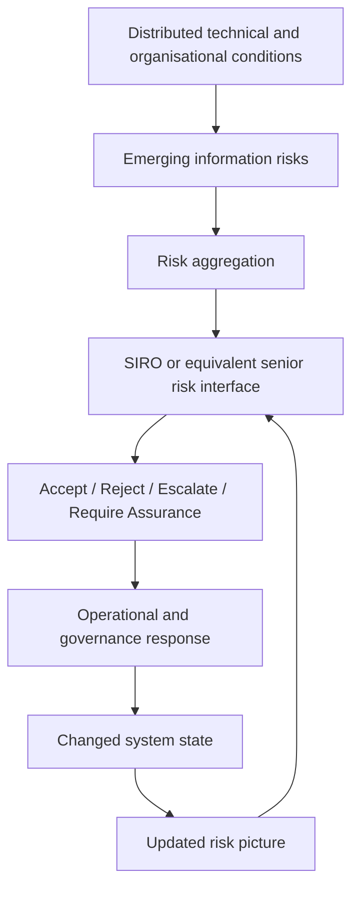
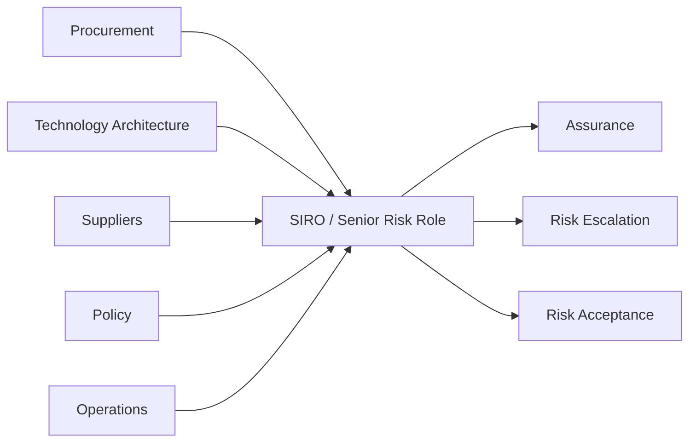
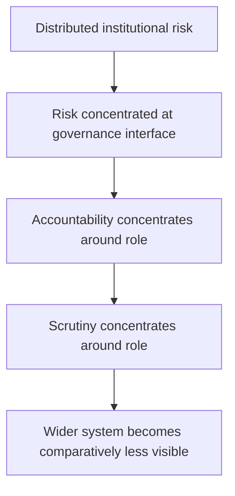
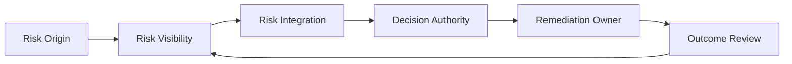

# ⚖️ Shielded Roles and Information Risk Governance
**First created:** 2025-11-12 | **Last updated:** 2026-08-14  
*How senior information-risk roles mirror the systems they govern by concentrating risks, powers, dependencies, and protections that remain distributed elsewhere.*

---

## 🛰️ Orientation

Senior information-risk roles sit at an unusual governance junction.

Within UK public-sector governance, the senior person accountable for information-security risk may be called the **Senior Information Risk Owner (SIRO)**, although terminology, remit, and institutional design vary.

The role is useful not simply because it carries responsibility.

It is useful because it acts as a **mirror of the wider system**.

Information risk may be generated across:

- legacy systems;
- procurement decisions;
- contractor ecosystems;
- data dependencies;
- operational practices;
- policy conflicts;
- institutional history;
- and multiple areas of organisational authority.

Yet those distributed conditions eventually have to become visible somewhere.

A SIRO or equivalent senior risk role can become the point where that distributed complexity is:

- aggregated;
- translated into governance language;
- accepted or rejected;
- escalated;
- documented;
- and pushed back into the organisation as a decision.

The role therefore tells us something about the system around it.

> **What the system concentrates into the role can reveal what the wider architecture has left distributed.**

---

## 🪞 The Mirror Principle

Senior information-risk roles can mirror the architecture they govern.

The relationship is not simply:

```text
responsibility
vs
authority
```

It is broader.

```text
distributed technical risk
        ↕
concentrated risk ownership

distributed operational authority
        ↕
concentrated accountability

opaque underlying system
        ↕
legible responsible role

long institutional history
        ↕
current identifiable custodian

many contributing actors
        ↕
one integration interface
```

The role does not contain the whole system.

It reflects its shape.

A highly empowered SIRO may indicate that the organisation has deliberately concentrated substantial authority at the point where risk becomes integrated.

A constrained SIRO may reveal that responsibility has been concentrated without equivalent remedial power.

Both are analytically interesting.

The question is not whether the role is powerful or powerless.

It is:

> **What has been concentrated here, and what remains distributed elsewhere?**

---

## 👑 Risk Aggregation vs Risk Creation

A central governance error is treating the role that makes risk visible as though it must also be the source of the risk.

Information risk may arise from:

- long-tail architectural decisions;
- cross-silo data dependencies;
- inherited infrastructure;
- supplier or contractor design choices;
- procurement structures;
- operational compromises;
- and policy-level ambiguity.

The senior risk owner may subsequently be required to understand, integrate, escalate, accept, or assure those risks.

That creates a critical distinction:

```text
visibility of risk
≠
creation of risk

ownership of risk governance
≠
sole authorship of underlying conditions
```

The role often receives the system in aggregate.

It does not necessarily create what it receives.

---

## ♻️ The Integration Interface

The SIRO or equivalent role can be understood as an **integration interface**.

Distributed conditions converge.

A governance decision is produced.

That decision then travels back into the system.



This is why the role belongs comfortably within a cybernetic analysis.

The role participates in a feedback process:

```text
risk becomes visible
→ risk is interpreted
→ governance responds
→ the system changes
→ risk is observed again
```

The effectiveness of that loop depends upon what information reaches the role, what authority it can exercise, and whether the resulting intervention actually changes the underlying system.

---

## 🧱 Power Is Directional

A role can possess significant authority without possessing universal control.

This matters.

A SIRO may be powerful **downward through a governance chain** while remaining dependent **sideways or upstream** upon actors controlling different parts of the system.

For example, a senior risk role may be able to:

- require assurance;
- escalate risk;
- challenge acceptance decisions;
- require further governance;
- influence whether certain activities continue.

Yet remediation may still depend upon:

- budget holders;
- procurement teams;
- technology leadership;
- contractors;
- policy owners;
- operational managers;
- or executive decisions elsewhere.

This creates a directional power relationship.



The role may therefore be simultaneously:

- highly authoritative in one direction;
- highly dependent in another.

That is not contradiction.

It is architecture.

---

## 🧠 The Custodial Mirror

The structure becomes particularly revealing when comparing what the role owns with what the wider system owns.

```text
SIRO may own
-----------------------------
risk visibility
risk integration
escalation
risk acceptance
assurance expectations

wider system may own
-----------------------------
budget
architecture
procurement
contracts
implementation
staffing
policy
legacy conditions
```

Where these categories align well, the role can function as an effective control point.

Where they diverge sharply, the role becomes a **custodial bottleneck**.

The bottleneck is not necessarily evidence that the SIRO lacks status.

It may arise precisely because a highly senior role has been asked to integrate risks produced by a system whose actual levers remain distributed.

---

## 🧿 Shielding as a Mirror of Exposure

Senior information-risk roles are not inherently anonymous, and disclosure arrangements vary.

Where a role is shielded from public identification or detailed scrutiny, the important question is not simply:

> **Why is this person hidden?**

A better question is:

> **What kind of institutional exposure has been concentrated at this interface?**

A role responsible for receiving, documenting, escalating, and integrating difficult information may itself require protection from:

- disproportionate personal targeting;
- security risks;
- politicised blame;
- operational pressure;
- or inappropriate external interference.

Shielding can therefore be a legitimate condition for candid risk governance.

But the mirror has a failure mode.



The person who exists to make the system's risk more legible can accidentally become the point through which the system itself becomes less legible.

That is the governance problem.

---

## 🤫 Shielding vs Buffering

A shielded role can therefore function in two very different ways.

### 1️⃣ Protective Transparency Node

- The individual is protected where necessary.
- The mandate is visible.
- Relevant processes remain auditable.
- Escalation pathways are legible.
- Risk decisions can be reconstructed.
- Responsibility can travel beyond the role.

### 2️⃣ Containment Buffer

- The individual or office becomes the primary visible custody point.
- The surrounding process remains opaque.
- Wider ownership is difficult to trace.
- Escalation disappears into institutional structure.
- Responsibility appears to terminate at the interface.

The difference is not whether shielding exists.

The difference is whether shielding protects **the person** or obscures **the process**.

---

## 🔄 The Feedback Failure Modes

Because the role sits within a feedback loop, several failure modes become visible.

### Incomplete Input

Relevant risk never reaches the integration point.

```text
risk exists
→ not reported
→ not integrated
→ no governance response
```

### Weak Translation

Risk reaches the role but is poorly characterised.

```text
risk observed
→ wrong classification
→ wrong intervention
→ risk persists
```

### Authority Mismatch

Risk is understood but the required lever sits elsewhere.

```text
risk understood
→ remediation identified
→ authority distributed elsewhere
→ delayed or partial response
```

### Broken Return Signal

An intervention occurs but nobody reliably checks whether it worked.

```text
risk
→ intervention
→ assumed resolution
→ no meaningful re-observation
```

The role is therefore not merely an accountability position.

It can be a point from which the health of the wider control loop becomes visible.

---

## 🔄 Continuity and Long-Tail Exposure

Information risk often outlives individual office-holders.

- Architectural flaws can persist across personnel changes.
- Contractor ecosystems can survive multiple governance cycles.
- Risk decisions can have consequences long after they were made.
- Institutional memory can fragment when responsibilities move between people or teams.

This creates another mirror relationship:

```text
persistent system
        ↕
temporary custodian

long-tail risk
        ↕
time-bounded human tenure
```

The important issue is therefore **continuity of custody**.

A resilient system should be able to reconstruct:

- what risk was identified;
- when it became visible;
- who held custody at the time;
- what decision was made;
- what authority supported that decision;
- what mitigation was required;
- who inherited unresolved risk;
- and what happened afterwards.

Without that continuity, each new custodian receives a partial reflection of a much older system.

---

## 🛠️ What a Healthy Model Requires

A structurally sound model does not require every power to sit with one person.

It requires the relationships between powers to remain legible.

Useful conditions may include:

- published role mandates with defined authority boundaries;
- documented risk-acceptance and escalation processes;
- auditable assurance and decision records;
- clear distinction between risk aggregation and remediation;
- institutional memory that survives personnel changes;
- visible relationships between senior risk owners, Information Asset Owners, security functions, procurement, data governance, suppliers, and operational leadership;
- independent or higher-level oversight capable of following custody beyond the integration interface.

The exact model will vary between organisations.

The design objective is not absolute concentration.

It is **traceable distribution**.



A healthy system should make each handoff visible.

---

## ⚖️ Ownership & Control Implication

Senior information-risk roles are useful because they expose a general governance principle:

> **Integration points mirror distributed systems.**

The role concentrates what the wider architecture cannot leave entirely dispersed:

- visibility;
- interpretation;
- responsibility;
- decision;
- escalation;
- and institutional memory.

But what remains outside the role matters just as much:

- technical control;
- money;
- procurement;
- contracts;
- implementation;
- policy;
- historic causation.

The SIRO therefore should not be analysed simply as:

> powerful  
> or  
> powerless.

The better diagnostic is:

> **What does this role reveal about how the surrounding system distributes power, risk, responsibility, and protection?**

The role is the mirror.

The architecture is the object.

---

## 🧭 Diagnostic Questions

- What has the system concentrated into this role?
- What remains distributed elsewhere?
- Which risks must the role see?
- Which decisions can it make directly?
- Which interventions depend upon other actors?
- In what directions is the role powerful?
- In what directions is it dependent?
- Does shielding protect the person while preserving process visibility?
- Can responsibility travel beyond the integration interface?
- Does the feedback loop include meaningful outcome review?
- Can risk custody be reconstructed across personnel changes?
- What does the structure of the role reveal about the structure surrounding it?

Do not infer either power or powerlessness from the title alone.

Map the mirror.

---

## 🌌 Constellations

⚖️ 👑 ♻️ 🧿 🪞 — information-risk governance; integration interfaces; directional power; custodial mirrors; feedback architecture.

---

## ✨ Stardust

information risk governance, senior information risk owner, siro, integration interface, risk aggregation, custodial mirror, directional power, shielding, feedback loops, institutional continuity

---

## 🏮 Footer

*⚖️ Shielded Roles and Information Risk Governance* is a living node of the **Polaris Protocol**.

It uses senior information-risk roles, including SIRO arrangements, as a diagnostic mirror for the wider systems they govern. The node examines how distributed risk becomes concentrated into visible governance interfaces, how authority moves in different directions, and how protections attached to a role can reveal the institutional exposure concentrated there.

The analytical object is not the office-holder alone.

It is the architecture reflected through the role.

> 📡 Cross-references:
>
> - [✈️ Worker Positioning & Safety Culture](./✈️_worker_positioning_and_safety_culture.md) — *how responsibility, exposure, and practical authority are distributed around workers*
> - [🛡️ Constructed Immunity](./🛡️_constructed_immunity.md) — *operational insulation produced through fragmented structures*
> - [🤫 Collective Risk Silence Loop](./🤫_collective_risk_silence_loop.md) — *shared exposure and feedback conditions affecting escalation*
>
> 🏮 Return To:
>
> - [👑 Ownership & Control](./README.md) — *1up*
> - [♻️ Cybernetics](../README.md) — *2up*
> - [🪿 Embodied Information Ecology](../../README.md) — *3up*
> - [🌑 Origin Points](../../../README.md) — *4up*
> - [🌌 Polaris Protocol — Root](../../../../README.md) — *root*

*Survivor authorship is sovereign. Containment is never neutral.*

_Last updated: 2026-08-14_
