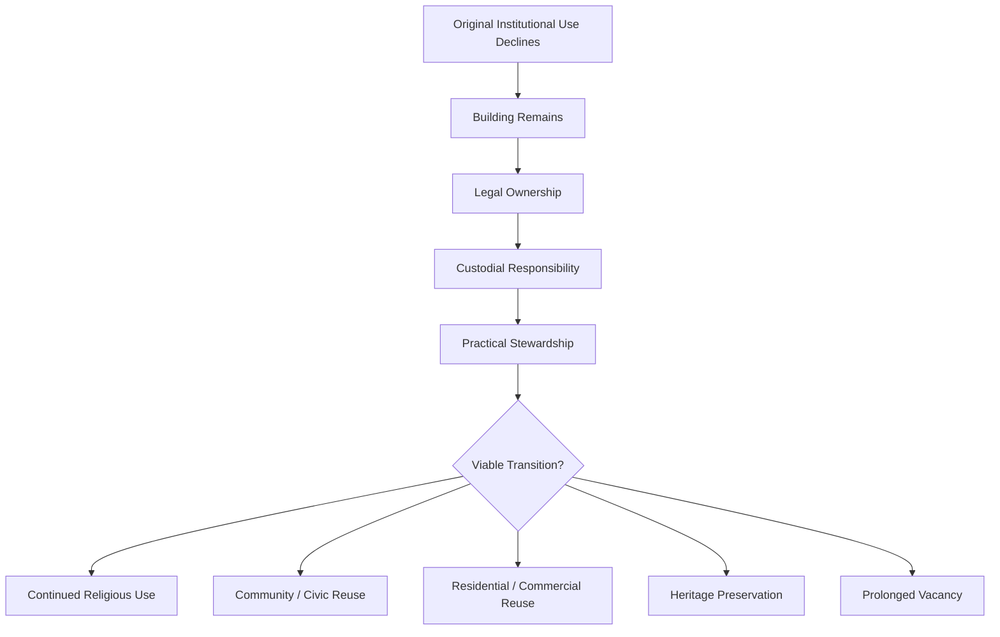
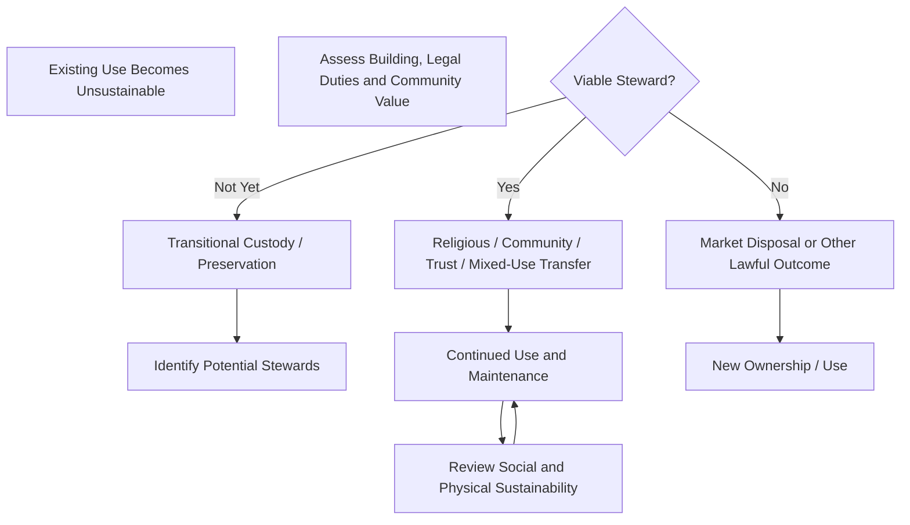

# ⛪️ Faith Land Trusts as Counter-Radicalisation Infrastructure
**First created:** 2025-10-08 | **Last updated:** 2026-08-14  
*When institutional use ends, who carries the building — and what story does continued stewardship tell?*

---

## 🛰️ Orientation

A church ceasing to function as a church does not make the building disappear.

Someone still has to:

- own it;
- maintain it;
- insure it;
- repair it;
- decide what it becomes;
- and carry the costs of keeping it standing.

That makes redundant and underused places of worship an unusually clear case study in **ownership, custody, and stewardship**.

Public discussion can frame religious reuse — including the conversion of former Christian buildings for use by other faith communities — primarily as symbolic loss.

But this framing can obscure a more basic governance question:

> **Has a functioning steward taken responsibility for an asset that its previous community or institution can no longer sustain?**

A building remaining in active religious, civic, cultural, residential, or community use may represent transformation rather than abandonment.

The question for this node is therefore not:

> “Who symbolically possesses this building?”

It is:

> **“When one form of institutional use ends, how successfully can custody pass to somebody capable of sustaining the asset and its social function?”**

This node examines faith buildings as a case study in **custodial transition, civic resilience, and the information carried by the built environment**.

---

## 👑 Ownership, Custody & Stewardship

These are not the same thing.

| Function | Core question |
|---|---|
| **Ownership** | Who legally holds the asset or relevant interest? |
| **Custody** | Who currently carries responsibility for its condition, liabilities, and decisions? |
| **Stewardship** | Who actively sustains its continuing use and social value? |
| **Control** | Who can decide what happens to it next? |

Several actors may occupy these positions simultaneously.

A denomination may retain important legal powers.

Trustees may carry statutory and fiduciary duties.

A local authority may exercise planning and heritage functions.

A community organisation may provide practical stewardship.

A purchaser or tenant may control future use within the applicable legal framework.

So:

```text
ownership
≠
custody
≠
stewardship
≠
complete control
```

The important question is how these relationships are transferred when the original use becomes unsustainable.

---

## ⛪️ Closure Is Not Necessarily Abandonment

Different denominations and faith organisations have different property structures.

Church of England parish churches have a particularly structured closure and reuse process.

Where a Church of England building is no longer needed for regular public worship, the diocese and Church Commissioners normally seek a suitable new use. Possible outcomes include:

- alternative use;
- preservation;
- or, in some circumstances, demolition.

Most closed Church of England churches are found another suitable use.

Those uses can include:

- worship by another Christian body;
- community or cultural use;
- residential use;
- arts;
- offices;
- heritage preservation.

Other denominations and faith organisations operate under different legal and governance arrangements.

The important structural point is:

> **cessation of one institutional use does not itself determine the building's future social function.**

Closure begins a custody problem.

It does not settle it.

---

## 🪞 The Building as a Custodial Mirror

A redundant faith building can reveal the condition of the institutions around it.



The physical building makes otherwise abstract governance visible.

Someone must eventually answer:

> **Who is prepared to carry this thing?**

That means successful reuse is not merely a property transaction.

It is evidence that custody has found somewhere to go.

---

## 🧱 Disposal as Governance, Not Betrayal

Charity trustees do not operate under a universal rule requiring them simply to obtain the highest imaginable sale price.

They must act in the charity's best interests and comply with the legal requirements applying to disposal of charity land.

Depending upon the land and transaction, this can include:

- confirming power to dispose;
- obtaining appropriate professional advice;
- considering the proposed terms;
- complying with special requirements for designated land;
- obtaining Charity Commission authority where required;
- and being satisfied that the terms are the best that can reasonably be obtained where the statutory regime requires it.

The legal structure therefore matters.

So does the distinction between:

> **best interests**

and:

> **highest price at all costs.**

In some circumstances the law permits arrangements other than straightforward full-market disposal.

The governance problem is consequently not:

> “Why did the trustees sell the church?”

It is:

> **“What viable stewardship options were legally, financially, and practically available when the existing arrangement stopped working?”**

---

## 🕌 Continued Worship Is Continued Stewardship

This is where the symbolic politics become particularly revealing.

A former Christian place of worship may sometimes pass into another form of religious use.

The precise possibilities depend upon:

- denomination;
- title;
- covenants;
- heritage protections;
- ecclesiastical rules;
- planning;
- and the terms of disposal.

So no universal rule should be inferred.

But analytically, where lawful transfer to another religious community does occur, the building has not simply been **lost**.

A new community may be assuming:

- repair;
- maintenance;
- heating;
- insurance;
- governance;
- fundraising;
- regular occupation;
- and responsibility for the building's future.

The architecture may remain.

Religious practice remains.

Community assembly remains.

The steward changes.

```text
old congregation can no longer sustain building
                ↓
new congregation assumes custody
                ↓
building remains occupied and maintained
```

A narrative of:

> **“They took our church.”**

may therefore describe the same physical event as:

> **“Another community took responsibility for a building that required a viable new custodian.”**

Those narratives are politically very different.

The underlying building is the same.

---

## 🧨 Grievance Without Stewardship

Symbolic ownership is cheap.

Stewardship is expensive.

Public grievance around religious and heritage buildings may emphasise:

- cultural loss;
- demographic change;
- institutional decline;
- national identity.

But maintaining the asset requires rather less glamorous things:

- roof repairs;
- insurance;
- heating;
- fundraising;
- safeguarding;
- governance;
- planning applications;
- accessibility;
- volunteer coordination;
- professional surveys;
- long-term maintenance.

This creates a useful diagnostic distinction:

| Symbolic possession | Practical stewardship |
|---|---|
| “This belongs to us.” | “We will maintain it.” |
| Identity claim | Custodial obligation |
| Low entry cost | Continuing material cost |
| Can exist at distance | Requires persistent involvement |
| May oppose change | Must manage change |

A group can feel intense symbolic ownership of an asset while assuming none of its custodial burden.

That asymmetry can become politically exploitable.

---

## 🐝 Vacancy as an Information Environment

A building communicates.

An empty church can become observable evidence used in narratives about:

- decline;
- abandonment;
- demographic change;
- institutional failure;
- economic deterioration;
- or cultural displacement.

That does not mean vacancy itself causes radicalisation.

Nor does reuse automatically prevent it.

The narrower proposition is:

> **The physical condition and use of civic assets contribute to the local information environment from which narratives of decline, competence, belonging, and abandonment are constructed.**

A decaying building can be photographed.

Shared.

Captioned.

Reinterpreted.

Turned into evidence for a much larger political story.


The building is therefore simultaneously:

- material infrastructure;
- social infrastructure;
- and information.

---

## 🪞 The Mosque Conversion Paradox

This produces a particularly useful contradiction.

Suppose somebody claims to care deeply about:

- preserving religious buildings;
- maintaining places of worship;
- keeping neighbourhood institutions alive;
- preventing architectural decay.

Then another religious community takes responsibility for a redundant building and continues using it for worship.

Materially, several of those stated goals may have been achieved.

Yet the same transition may still be narrated as evidence of cultural defeat.

That suggests the grievance may not primarily concern:

> preservation of religious infrastructure.

It may concern:

> **which population is permitted to provide the stewardship.**

This distinction matters.

A stewardship analysis asks:

- Is the building occupied?
- Is it maintained?
- Is somebody carrying its liabilities?
- Does it retain social use?
- Is the transition lawful and sustainable?

An exclusionary identity analysis asks:

- **Who is using it?**

Those are not the same policy question.

---

## 🌳 Civic Reclamation

Religious reuse is only one possible custodial transition.

Other models can include:

- community organisations;
- local trusts;
- heritage trusts;
- mixed-use schemes;
- housing;
- cultural facilities;
- community businesses;
- social infrastructure.

Historic England identifies multiple ownership and management models for widening the use of places of worship, including partnerships, trusts, community organisations, and separate management structures.

The Church of England likewise encourages wider community use of buildings and provides routes for trusts, friends groups, partnerships, and complementary uses.

So the policy landscape is not empty.

The harder problem is often:

> **Can a viable steward assemble the governance, money, expertise, and legal foothold required quickly enough to take custody?**

---

## 🏡 Community Purchase Mechanisms

In England, the **Asset of Community Value** framework can give eligible community groups time to organise when a listed asset is proposed for relevant disposal.

Under the longstanding Community Right to Bid model, this has generally meant:

- nomination and listing of qualifying assets;
- notification when a relevant disposal is proposed;
- an initial moratorium;
- and, where an eligible community group wishes to bid, a longer period in which it can organise finance and prepare an offer.

Historically, this has **not** guaranteed:

- purchase;
- a below-market price;
- a right of first refusal;
- or an obligation upon the owner to sell to the community.

The framework is changing.

The **English Devolution and Community Empowerment Act 2026** strengthens the model toward a Community Right to Buy, including a longer period for community purchasers and a first opportunity to buy listed assets under the new regime.

The precise operation of these reforms depends upon commencement and implementing arrangements.

The broader lesson is straightforward:

> **Time is infrastructure.**

A community cannot become a custodian if the governance system gives it no realistic opportunity to organise.

---

## 🌱 Faith Land Trusts as a Design Proposal

This node uses **Faith Land Trust** as a design concept rather than the name of a single established UK legal form.

The idea is to create or adapt structures capable of holding redundant or vulnerable faith assets for durable community benefit.

Possible functions could include:

- temporary custody while future use is assembled;
- long-term community ownership;
- partnership with active faith communities;
- preservation of heritage value;
- affordable civic or social use;
- housing or mixed-use development where appropriate;
- protection against unnecessary vacancy.

The model need not preserve the original religious use indefinitely.

Its purpose is to prevent a false binary:

```text
original institution keeps building forever
                OR
unstructured disposal
```

There can be intermediate custodians.

---

## 🔄 Custodial Transition

A healthier system treats closure as a transition problem.



The important feature is not that every building must remain communally owned.

It is that stewardship options are considered deliberately rather than treated as conceptually invisible.

---

## 🧠 Counter-Radicalisation or Civic Resilience?

The phrase **counter-radicalisation infrastructure** should be used carefully.

There is no basis for assuming:

```text
church vacancy
=
radicalisation
```

or:

```text
community reuse
=
radicalisation prevented
```

The more defensible mechanism concerns **civic resilience**.

Active stewardship may contribute to conditions such as:

- visible collective efficacy;
- cross-community contact;
- continued local services;
- reduced physical dereliction;
- opportunities for participation;
- evidence that institutional decline can be answered through adaptation.

Those conditions may make some grievance narratives less straightforward.

Whether they measurably affect radicalisation risk requires empirical evidence.

So the title is best understood as a **design hypothesis**:

> **Could stewardship of symbolically important civic assets form one small component of a wider resilience strategy against grievance-based mobilisation?**

That is a researchable question.

Not a predetermined answer.

---

## 👑 Ownership & Control Implication

Faith buildings expose a broader governance principle:

> **An asset can remain legally owned while becoming socially uncustodied.**

Conversely:

> **A change of owner can preserve practical stewardship.**

That distinction matters far beyond churches.

When institutional use declines, governance needs to ask:

- what should remain;
- what can change;
- who can carry the asset;
- who controls transition;
- and whether potential stewards have a realistic route into custody.

The important outcome is not necessarily preservation of the original owner.

It is preservation of **viable stewardship where stewardship remains socially valuable**.

---

## 🧭 Diagnostic Questions

- Who legally owns the asset?
- Who carries its current liabilities?
- Who actually maintains it?
- Who controls the decision about future use?
- What restrictions apply to transfer or reuse?
- Is another religious community a viable steward?
- Is a civic or community organisation a viable steward?
- Does the legal framework give potential custodians enough time to organise?
- Is public objection about preservation of the asset — or the identity of its prospective steward?
- What does vacancy communicate in the local information environment?
- What would successful reuse communicate instead?
- Are claims about radicalisation supported by evidence, or are we identifying a resilience hypothesis?

Most importantly:

> **If the current custodian cannot carry the asset, who realistically can?**

---

## 🌌 Constellations

⛪️ 👑 🕌 🌳 🪞 — faith infrastructure; custodial transition; religious reuse; civic stewardship; symbolic ownership.

---

## ✨ Stardust

faith land trust, custodial transition, religious reuse, church closure, mosque conversion, symbolic ownership, practical stewardship, assets of community value, community right to buy, civic resilience, grievance narratives, adaptive reuse, community ownership, faith infrastructure, built environment as information

---

## 🏮 Footer

*⛪️ Faith Land Trusts as Counter-Radicalisation Infrastructure* is a living node of the **Polaris Protocol**.

It examines redundant and underused faith buildings as sites where legal ownership, practical custody, symbolic possession, and community stewardship can diverge.

The node treats counter-radicalisation as a design hypothesis rather than an established causal effect. Its narrower claim is that visible stewardship, vacancy, reuse, and decay all contribute to the information environment through which communities interpret institutional change.

> 📡 Cross-references:
>
> - [🏛️ R.A.A.C. — Ruins and Architectural Committee](./🏛️_raac_ruins_squad.md) — *custody, decay, and public infrastructure*
> - [🕳️ The Pothole Problem](./🕳️_the_pothole_problem.md) — *visible maintenance as a signal of institutional capacity*
> - [🌳 The Lads Are Not Pro Countryside](./🌳_the_lads_are_not_pro_countryside.md) — *symbolic ownership versus material stewardship*
>
> 🏮 Return To:
>
> - [👑 Ownership & Control](./README.md) — *1up*
> - [♻️ Cybernetics](../README.md) — *2up*
> - [🪿 Embodied Information Ecology](../../README.md) — *3up*
> - [🌑 Origin Points](../../../README.md) — *4up*
> - [🌌 Polaris Protocol — Root](../../../../README.md) — *root*

*Survivor authorship is sovereign. Containment is never neutral.*

_Last updated: 2026-08-14_
