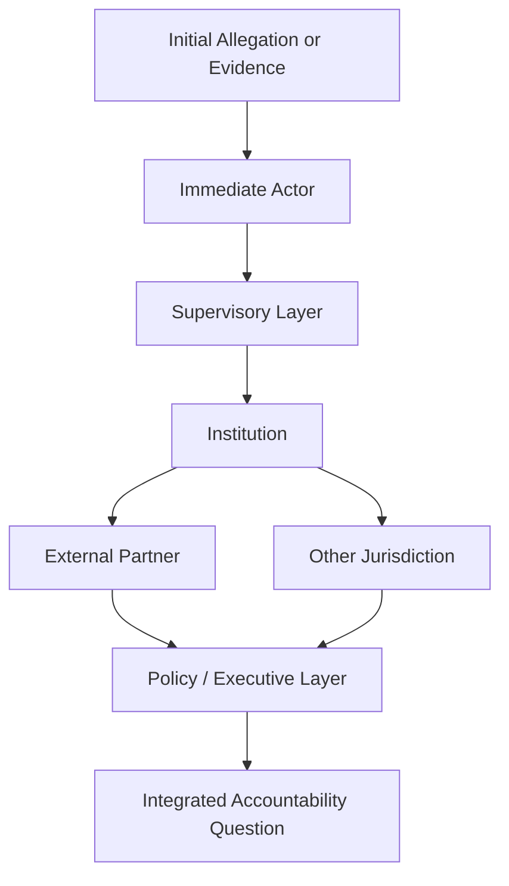
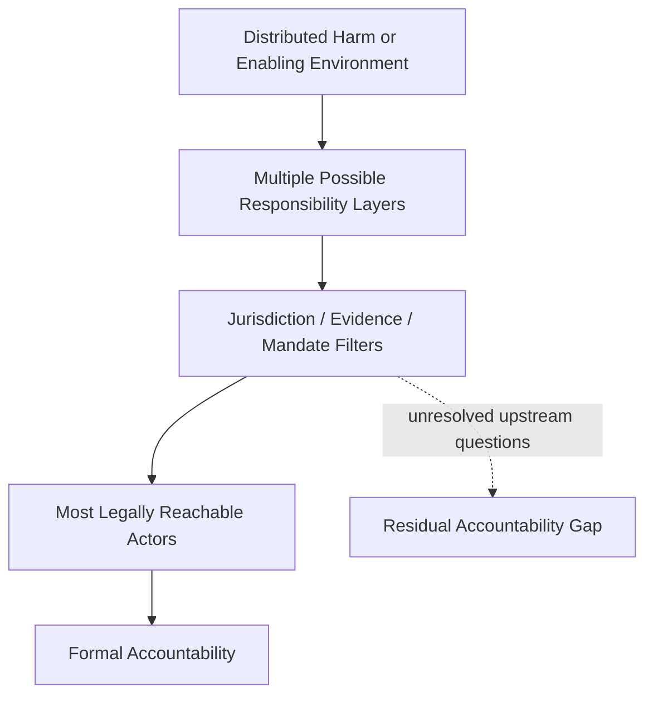
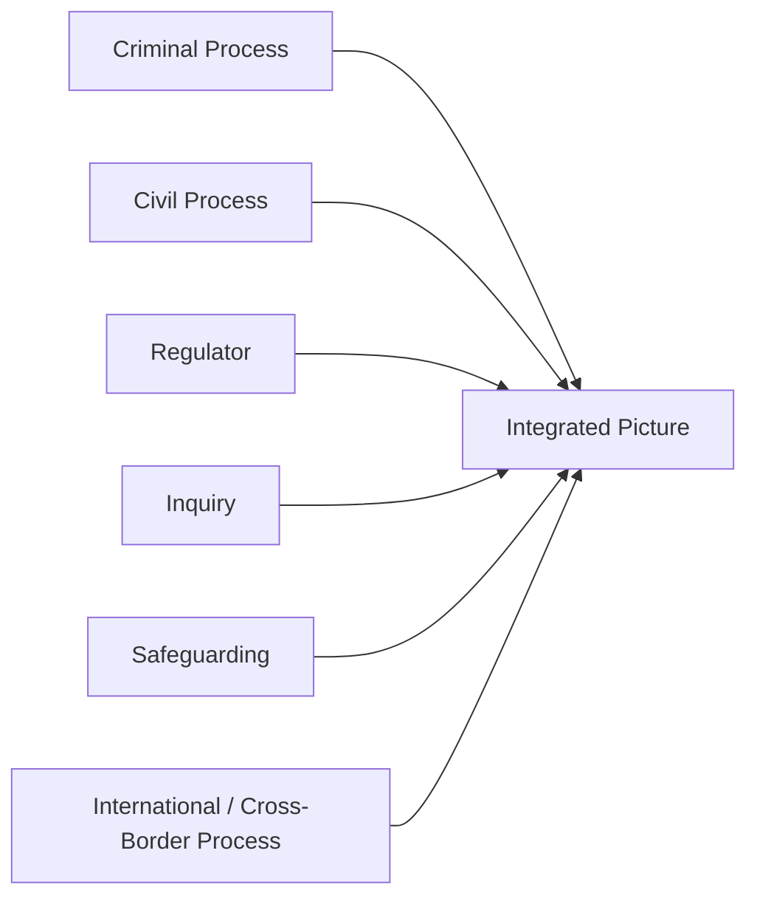
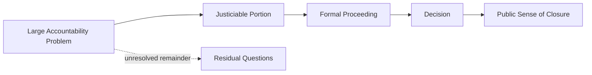
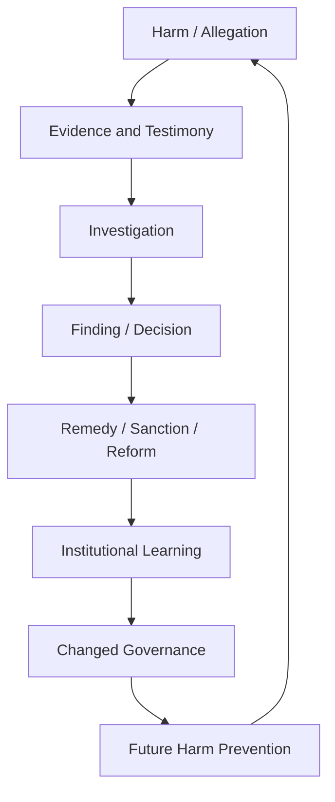

# ✈️ Genocides and Paedophiles
**First created:** 2025-12-20 | **Last updated:** 2026-08-14  
*What very different high-harm cases can reveal about accountability architecture when exposure spreads upward and outward.*

---

## 🛰️ Orientation

This node compares two radically different categories of harm:

- genocide and other atrocity crimes;
- child sexual abuse and exploitation.

It does **not** compare:

- the nature of the harms;
- their scale;
- their legal elements;
- their victims;
- their perpetrators;
- or their moral meaning.

The comparison is strictly architectural.

Both kinds of case can, in some circumstances, force institutions to answer a similar governance question:

> **What happens to accountability when investigation begins to implicate more actors, more institutions, more jurisdictions, or more consequential relationships?**

That makes them useful — cautiously — for examining:

- fragmented responsibility;
- escalation limits;
- evidential integration;
- conflicts of interest;
- institutional dependency;
- reputational exposure;
- jurisdictional boundaries;
- and the point at which local case-processing becomes inadequate to the structure of the problem.

The comparison therefore begins with a rule:

```text
shared governance mechanism
≠
equivalent harm
```

---

## ⚠️ Why This Comparison Needs Discipline

A structural analogy can illuminate one mechanism while obscuring everything else.

So this node does **not** infer that because two domains share:

- delay;
- fragmented jurisdiction;
- credibility disputes;
- institutional embarrassment;
- or incomplete accountability;

they share a single cause.

Nor does it assume that difficult accountability outcomes establish:

- conspiracy;
- deliberate concealment;
- political protection;
- institutional complicity;
- or coordinated containment.

The task is narrower:

> **Identify what becomes harder as accountability has to travel through increasingly powerful, distributed, or institutionally entangled systems.**

---

## 📈 The Exposure Gradient

The source node described an **exposure threshold**.

A gradient is more useful.

Institutional difficulty does not necessarily switch suddenly from ordinary accountability to containment.

It may increase as several conditions accumulate.

| Increasing condition | Governance difficulty that may increase |
|---|---|
| More implicated individuals | Evidential and investigative complexity |
| More implicated organisations | Coordination burden |
| Greater seniority | Independence and conflict-of-interest concerns |
| Multiple jurisdictions | Fragmented legal authority |
| Classified or sensitive information | Restricted evidential visibility |
| Institutional dependency | Higher cost of rapid intervention |
| Cross-border relationships | Diplomatic and procedural complexity |
| Long time periods | Evidence loss and institutional-memory problems |
| Large victim populations | Remedial scale and case-management burden |
| Major reputational exposure | Stronger defensive incentives |

None of these proves improper conduct.

They describe conditions under which accountability becomes structurally harder.

---

## ♻️ From Local Case to System Problem

A relatively bounded case may follow something like:

```text
allegation
→ investigation
→ evidential assessment
→ decision
→ accountability / closure
```

But wider exposure can create branching.



At that point the original case may no longer be the whole analytical object.

The question becomes:

> **Can the accountability system integrate the expanding chain without losing ownership between jurisdictions, remits, or institutions?**

---

## 👑 Proximity and Upstream Responsibility

Accountability systems often see proximate conduct most clearly.

That is not inherently defective.

Proximate actors may be:

- identifiable;
- physically present;
- directly connected to evidence;
- within jurisdiction;
- and subject to familiar legal processes.

Upstream relationships can be harder to assess.

These may involve:

- supervision;
- funding;
- policy;
- enablement;
- procurement;
- institutional knowledge;
- command;
- facilitation;
- concealment;
- or failure to act.

Each category has different legal and evidential requirements.

So:

```text
upstream connection
≠
legal responsibility

institutional knowledge
≠
complicity

failure to prevent
≠
participation
```

But difficulty establishing responsibility upstream does not make the question analytically irrelevant.

It makes attribution more demanding.

---

## ⚖️ Downward Concentration of Accountability

A recurring structural possibility is that accountability becomes concentrated at the level most readily reachable by existing mechanisms.



This does **not** mean the system deliberately sacrifices lower-level actors.

It means formal processes can be much better equipped to deal with:

- bounded defendants;
- defined acts;
- available evidence;
- and jurisdictionally reachable conduct

than with distributed institutional systems.

The resulting asymmetry is worth mapping.

---

## 🧱 Integration Is the Hard Part

High-exposure cases can cross:

- criminal law;
- civil liability;
- safeguarding;
- professional regulation;
- public inquiries;
- administrative review;
- international law;
- parliamentary oversight;
- disciplinary systems;
- and political accountability.

Each body may correctly perform its own task.

And still nobody may integrate the whole chain.



The governance question is:

> **Does an integration mechanism actually exist?**

If not, local correctness can coexist with systemic incompleteness.

---

## 🤫 Stability Language Is Not Self-Proving

Institutions sometimes invoke concerns such as:

- continuity;
- operational integrity;
- national security;
- confidentiality;
- fairness to ongoing proceedings;
- diplomatic sensitivity;
- social stability;
- safeguarding;
- prejudice to related investigations.

These concerns can be legitimate.

They can also constrain disclosure, sequencing, or intervention.

So the relevant distinction is:

```text
stability consideration
≠
improper containment
```

But repeated reliance on stability arguments can still be examined.

Ask:

- What concrete risk is being managed?
- Who assessed it?
- Is the restriction proportionate?
- Is it temporary?
- Is there independent review?
- Does accountability resume once the constraint passes?
- Or does the temporary brake become a permanent ceiling?

That turns suspicion into governance testing.

---

## 🧿 Testimony and Evidential Friction

Survivor and witness testimony can encounter substantial procedural demands in both atrocity and sexual-abuse contexts.

Those demands may include:

- corroboration questions;
- credibility assessment;
- trauma-sensitive interviewing challenges;
- delay;
- disclosure rules;
- jurisdictional limitations;
- competing evidential accounts.

These processes are not automatically hostile to survivors.

Evidential safeguards protect fairness.

But they can also produce significant burden.

The governance issue is therefore not:

> **Why isn't testimony simply accepted?**

It is:

> **Can the system test testimony fairly without destroying the information source it depends upon?**

---

## 🫀 The Human Cost of the Evidence System

Where testimony is required repeatedly across:

- police;
- courts;
- inquiries;
- regulators;
- lawyers;
- safeguarding bodies;
- journalists;
- or international mechanisms;

the system may create its own attrition.

```text
witness has information
→ repeated disclosure demands
→ time / trauma / procedural burden
→ reduced capacity to continue
→ less information available
```

That creates a cybernetic problem.

A system can degrade the sensor from which it requires evidence.

The appropriate response is not lower evidential standards.

It is better information architecture:

- interoperable records where lawful;
- trauma-aware procedures;
- reduced unnecessary repetition;
- clear custody of testimony;
- and predictable escalation.

---

## 🧠 Power Changes the Accountability Environment

Institutional power matters because it can alter practical conditions around an investigation.

Higher-power subjects may have greater access to:

- lawyers;
- institutional support;
- specialist advice;
- information;
- public relations;
- procedural knowledge;
- influential networks.

That does not mean they are immune.

But equality before law does not imply equality of surrounding resources.

The relevant question is:

> **Does the accountability system retain equivalent investigative independence and practical capacity as the institutional importance of the subject increases?**

---

## 📊 The Power–Escalation Matrix

| As exposure rises, ask | Healthy architecture | Possible warning sign |
|---|---|---|
| Can allegations still be reported? | Accessible routes remain open | Reporting becomes increasingly difficult |
| Can evidence still be obtained? | Investigators retain lawful access | Critical evidence becomes structurally inaccessible |
| Can independent review occur? | Conflicts are managed externally | Oversight remains dependent on implicated structures |
| Can temporary restrictions be imposed? | Proportionate authority exists | Intervention becomes practically impossible |
| Can responsibility travel upward? | Escalation remains available | Inquiry repeatedly terminates at lower levels |
| Can multiple jurisdictions coordinate? | Handoffs are defined | Each body owns only a fragment |
| Can complainants remain engaged? | Burden is managed | Process itself creates attrition |
| Can conclusions be publicly understood? | Reasons are legible | Secrecy or fragmentation makes outcomes uninterpretable |

The matrix identifies questions.

It does not predetermine answers.

---

## 🪞 The Exception Gradient

Democratic legal systems formally reject the proposition that powerful actors are above the law.

Operationally, however, accountability may become more difficult as power and complexity increase.

This node calls the measurable divergence an **exception gradient**.

```text
formal rule:
same law

possible operational reality:
different practical difficulty
```

The existence of greater difficulty does not itself establish unlawful favouritism.

But if investigative capacity, independence, or escalation systematically deteriorate as status rises, the pattern deserves explanation.

---

## 🔄 Partial Accountability

Partial accountability is not necessarily fake accountability.

A prosecution, inquiry, regulatory finding, or compensation scheme may achieve something important even if it does not resolve the whole system.

The danger lies in confusing:

```text
something was addressed
```

with:

```text
everything relevant was resolved
```

A useful accountability architecture should distinguish:

- completed questions;
- unresolved questions;
- questions outside jurisdiction;
- questions lacking evidence;
- questions referred elsewhere;
- and questions requiring future review.

Closure should be specific.

Not atmospheric.

---

## 🧾 Terminal Accountability

This connects directly to **The Architecture of Complicity**.

A system can produce what Polaris calls **terminal accountability**:

> accountability reaches a legally reachable actor or proceeding and is socially interpreted as the endpoint, despite unresolved questions elsewhere in the structure.

That does not mean the proceeding was illegitimate.

The issue is whether its boundaries remain visible.



Good governance keeps **F** visible.

---

## 🧩 Why Compare These Domains at All?

The comparison becomes useful only at the level of architecture.

Both atrocity-accountability systems and child-sexual-abuse accountability systems can involve:

- traumatic testimony;
- institutional power;
- historical evidence;
- multiple bodies;
- contested knowledge;
- serious reputational stakes;
- long time horizons;
- and demands for accountability that may travel beyond the immediate perpetrator.

Those similarities allow a comparative question:

> **Which governance mechanisms remain reliable when responsibility becomes difficult to integrate?**

The answer in one domain may reveal weaknesses relevant to another.

Not because the harms are the same.

Because institutions often reuse:

- evidence systems;
- escalation structures;
- oversight models;
- jurisdictional boundaries;
- and methods of managing organisational exposure.

---

## 🚫 What This Node Does Not Permit

This framework should not be used to infer:

```text
delay
=
cover-up
```

or:

```text
institutional embarrassment
=
complicity
```

or:

```text
senior actor implicated
=
systemic protection
```

or:

```text
partial accountability
=
deliberate containment
```

or:

```text
similar governance pattern
=
equivalent crime
```

Each stronger proposition needs additional evidence.

---

## ♻️ The Accountability Feedback Loop

A healthy accountability system learns.



A weak system may process cases without changing the conditions that produced them.

That is the deeper comparative question:

> **Does accountability merely terminate cases, or does it update the architecture?**

---

## 👑 Ownership & Control Implication

High-exposure harms expose the difference between:

- owning a case;
- owning an investigation;
- owning a particular legal question;
- owning institutional reform;
- and owning the whole accountability chain.

Those are different forms of custody.

A system may have excellent owners for the first four and still lack the fifth.

The result can be:

```text
many accountable processes
+
no integrated accountability architecture
```

That is not automatically corruption.

It is a design vulnerability.

---

## 🧭 Diagnostic Questions

- How many institutions are implicated or required to act?
- How many jurisdictions are involved?
- Which questions belong to which body?
- Who owns integration between them?
- Does investigative independence change as subject seniority rises?
- Is evidence becoming less accessible as exposure increases?
- Are stability restrictions proportionate, reviewable, and temporary?
- Are witnesses required to repeatedly regenerate the same evidence?
- Are legal and administrative boundaries visible to the public?
- Does responsibility continue moving upward where evidence supports it?
- Is partial accountability being mistaken for complete resolution?
- Are unresolved questions explicitly preserved?
- Does the system learn from the case?
- Are we observing accountability difficulty, or do we actually possess evidence of intentional obstruction?

And most importantly:

> **As exposure expands, does the accountability architecture remain capable of integrating what it learns?**

---

## 🌌 Constellations

✈️ ⚖️ 👑 ♻️ 🧿 — exposure gradients; accountability architecture; evidential integration; escalation capacity; institutional learning.

---

## ✨ Stardust

high-exposure harms, accountability architecture, exposure gradient, exception gradient, terminal accountability, evidential integration, testimony custody, escalation capacity, jurisdictional fragmentation, institutional exposure, partial accountability, survivor testimony, system learning, distributed responsibility

---

## 🏮 Footer

*✈️ Genocides and Paedophiles* is a living node of the **Polaris Protocol**.

Its deliberately difficult comparison is limited to governance architecture. It does not equate genocide, atrocity crimes, child sexual abuse, their victims, their perpetrators, or their legal and moral character.

The node asks what happens to accountability systems when exposure expands across powerful actors, institutions, jurisdictions, and evidential boundaries — and whether escalation, integration, independence, and institutional learning remain functional as the problem becomes harder to contain within a single proceeding.

> 📡 Cross-references:
>
> - [⚖️ The Architecture of Complicity](./⚖️_architecture_of_complicity.md) — *how distributed enablement can exceed the reach of individual proceedings*
> - [✈️ Who Wants These Creeps in Charge?](./✈️_who_wants_these_creeps_in_charge.md) — *how dependency and replacement cost can introduce accountability friction*
> - [✈️ Worker Positioning & Safety Culture](./✈️_worker_positioning_and_safety_culture.md) — *how information can exist without effective escalation authority*
> - [🌒 The No-Win Box](./🌒_the_no_win_box.md)
> - [🌅 Rise of Institutional Integrity](./🌅_rise_of_institutional_integrity.md)
> - [🍉 British Democracy Needs You](./🍉_british_democracy_needs_you.md)
> - [🐼 The Metropolitan Rabble](./🐼_the_metropolitan_rabble.md)
>
> 🏮 Return To:
>
> - [👑 Ownership & Control](./README.md) — *1up*
> - [♻️ Cybernetics](../README.md) — *2up*
> - [🪿 Embodied Information Ecology](../../README.md) — *3up*
> - [🌑 Origin Points](../../../README.md) — *4up*
> - [🌌 Polaris Protocol — Root](../../../../README.md) — *root*

*Survivor authorship is sovereign. Containment is never neutral.*

_Last updated: 2026-08-14_
