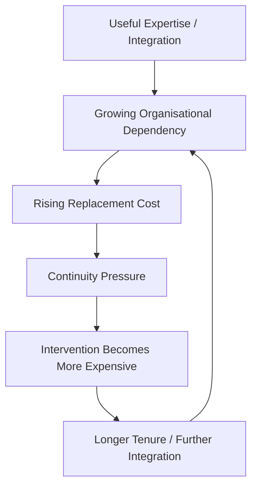
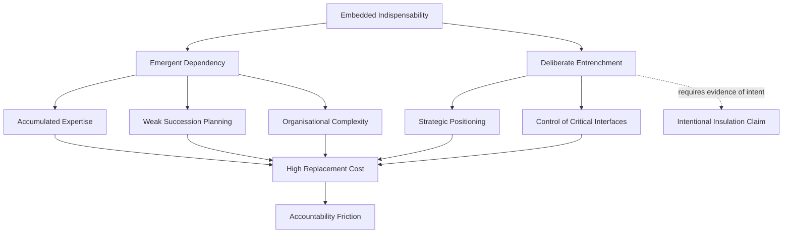
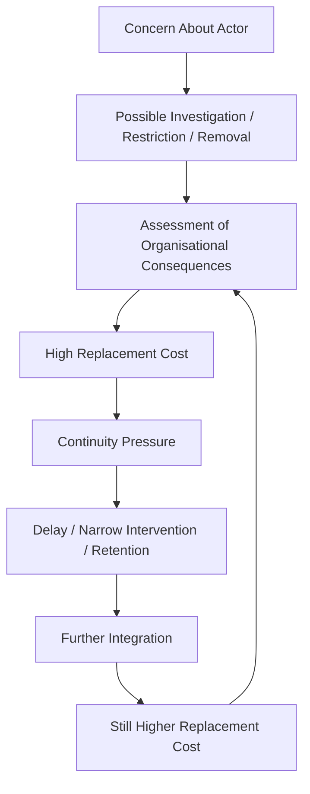
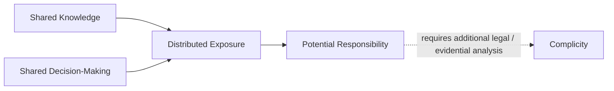
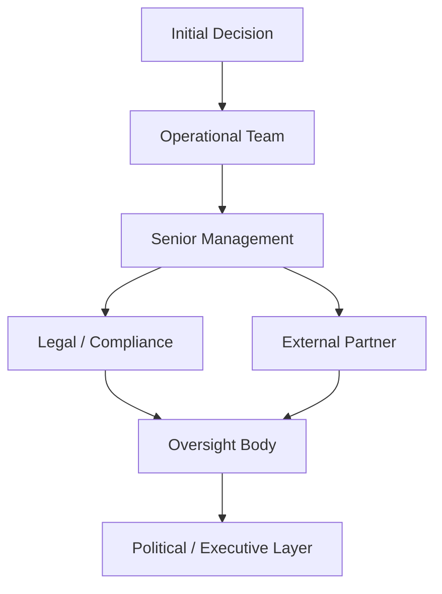
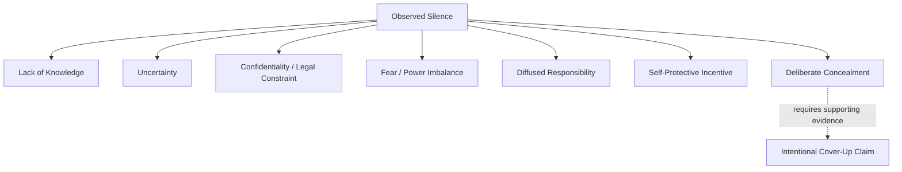
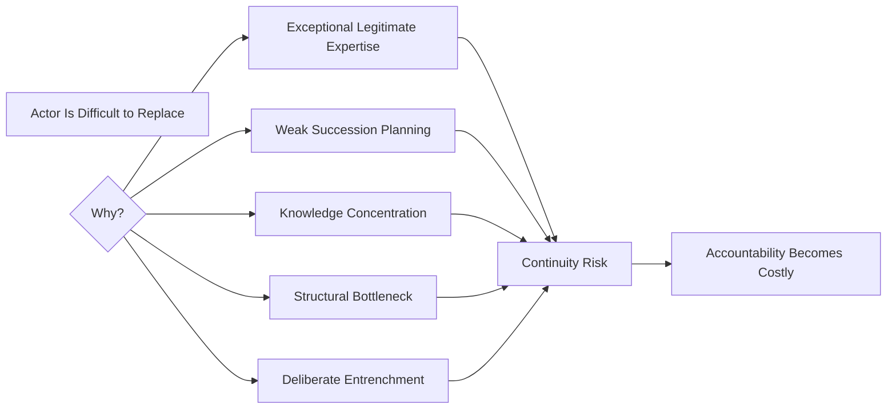
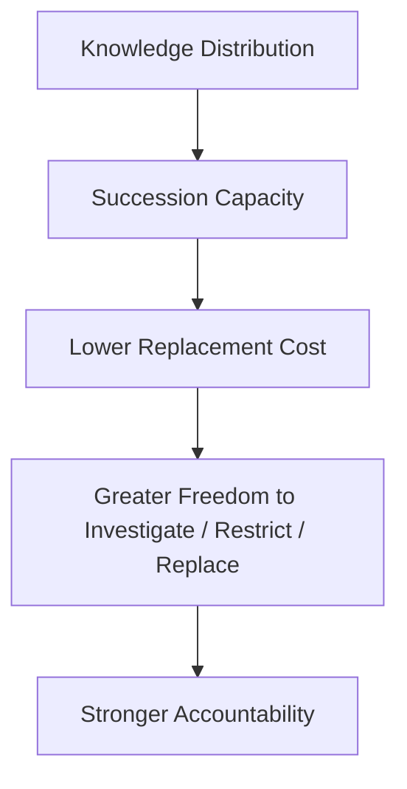
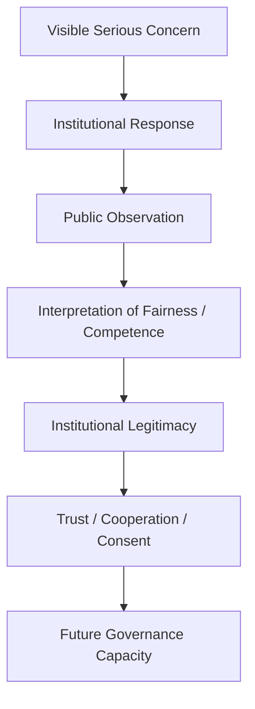

# ✈️ Who Wants These Creeps in Charge?
**First created:** 2025-12-20 | **Last updated:** 2026-08-14  
*Embedded indispensability, dependency accumulation, and the point where continuity begins to compete with accountability.*

---

## 🛰️ Orientation

“Why are these people still in charge?”

It sounds like a character judgment.

Sometimes it is.

But as a governance question, it points toward something more useful:

> **What makes removing, replacing, constraining, or investigating a powerful actor become institutionally expensive?**

People associated with serious governance failures may remain in influential positions for many reasons.

Those reasons can include:

- unresolved or contested allegations;
- legitimate procedural protections;
- specialist expertise;
- accumulated institutional knowledge;
- political support;
- fragmented authority;
- weak succession planning;
- operational dependency;
- contractual arrangements;
- or the practical cost of replacing somebody embedded across multiple systems.

None of those conditions independently establishes wrongdoing.

Nor does continued tenure establish institutional protection.

But they can produce a structural condition worth examining:

> **The more organisational functions depend upon a particular actor, the greater the potential cost of intervention against that actor.**

This node calls that condition **embedded indispensability**.

The analytical question is not whether somebody is literally indispensable.

It is:

> **How did the system become dependent upon them, what does that dependency protect, and could the institution continue functioning if accountability required their removal?**

---

## 👑 Embedded Indispensability

Indispensability is rarely a binary condition.

It accumulates.

A person may become increasingly important because they:

- hold specialist knowledge;
- coordinate several teams;
- maintain important external relationships;
- understand legacy systems;
- control critical information flows;
- lead politically important programmes;
- translate between otherwise disconnected institutions;
- or repeatedly become the person who knows how to make difficult things work.

Each function may be perfectly legitimate.

Together, however, they can create dependency.



The loop can become self-reinforcing.

The longer an actor remains because replacement is difficult, the more knowledge and relationships may accumulate around them.

Their continued presence then becomes further evidence that replacing them would be difficult.

---

## 🧠 Embedded Does Not Mean Deliberately Entrenched

This distinction is essential.

An actor can become difficult to replace without deliberately making themselves difficult to replace.



The first branch can arise through ordinary organisational development.

The second involves intentional behaviour and therefore requires evidence capable of supporting an inference about intent.

These should not be collapsed.

The observable condition may simply be:

> **This institution has become unusually dependent upon this person.**

That alone is enough to create a governance problem.

---

## 🧱 Replacement Cost

Removal has costs.

Depending upon the role, these might include:

| Dependency | Possible replacement cost |
|---|---|
| Specialist expertise | Loss of technical knowledge |
| Institutional memory | Difficulty reconstructing historical decisions |
| External relationships | Disruption to partnerships or negotiations |
| Cross-silo coordination | Fragmentation between teams |
| Programme leadership | Delay to important work |
| Information brokerage | Loss of an established integration point |
| Political authority | Difficulty maintaining coalition or stakeholder support |
| Legacy knowledge | Increased operational uncertainty |

Some of these costs may be substantial and entirely real.

That means continuity concerns cannot simply be dismissed as excuses.

But their existence raises a second question:

> **Why was so much continuity allowed to depend upon one actor?**

The governance failure may predate whatever later controversy makes replacement necessary.

---

## 🔄 The Accountability Friction Loop

Once replacement costs become sufficiently high, they can alter institutional decision-making.



Again, this does not establish corrupt intent.

Decision-makers may genuinely believe that abrupt intervention would:

- damage operations;
- lose critical expertise;
- destabilise a programme;
- harm innocent third parties;
- or create unacceptable transition risk.

But once continuity cost starts materially affecting accountability options, the dependency itself becomes a governance concern.

---

## ⚖️ Accountability Is Not Only Removal

It is important not to create a false binary:

```text
retain completely
        OR
remove immediately
```

Accountability can involve many interventions, depending upon the circumstances and applicable legal framework:

- investigation;
- independent oversight;
- temporary restriction of responsibilities;
- recusal;
- redistribution of decision authority;
- additional supervision;
- suspension where appropriate;
- succession planning;
- disclosure;
- audit;
- disciplinary processes;
- eventual removal.

The relevant question is:

> **Can the institution investigate and constrain the actor without becoming incapable of performing its own functions?**

If not, accountability architecture may already be too dependent on the person it is supposed to govern.

---

## 🕸️ Exposure Is Not Complicity

The original node described **complicity distribution**.

That can happen.

But the safer analytical starting point is **exposure distribution**.

As decisions spread across an organisation, more people may become:

- informed;
- consulted;
- responsible for particular decisions;
- signatories;
- participants in meetings;
- recipients of briefings;
- or holders of partial knowledge.

That creates shared exposure.

It does not automatically create shared complicity.



The distinctions matter:

```text
knowledge
≠
agreement

participation
≠
culpability

exposure
≠
responsibility

responsibility
≠
complicity
```

Each transition requires evidence and context.

---

## 🧿 The Exposure Network

Even where complicity cannot be inferred, distributed exposure can change institutional incentives.

Consider a decision that gradually expands across organisations.



Different actors may know different things.

Some may support the decision.

Some may challenge it.

Some may merely inherit its consequences.

Some may have no realistic authority to change it.

The network therefore cannot be treated as a single moral actor.

But as exposure spreads, later intervention may acquire wider consequences:

- previous decisions may need review;
- institutional assurances may be questioned;
- other actors' conduct may become relevant;
- external relationships may be affected;
- governance failures may prove broader than initially understood.

That can increase the institutional cost of correction without requiring a coordinated cover-up.

---

## 🤫 Silence Has Multiple Mechanisms

Silence is especially easy to overinterpret.

An actor may remain silent because of:

- lack of knowledge;
- uncertainty;
- confidentiality;
- legal restrictions;
- fear of retaliation;
- loyalty;
- reputational concern;
- belief that another body owns the issue;
- procedural advice;
- perceived lack of authority;
- personal exposure;
- or deliberate concealment.

These mechanisms are not equivalent.



Therefore:

> **Silence is an observation. Motive is an inference.**

Governance analysis should preserve the distance between them.

---

## 👑 Custodial Capture

The term **custodial capture** remains useful, but it needs a precise meaning.

It does not mean:

> everybody has become complicit.

It describes a structural condition in which the mechanisms intended to govern an actor become increasingly constrained by dependence upon the actor or the system surrounding them.

Possible indicators include:

- unusually high replacement costs;
- concentrated institutional knowledge;
- weak succession capacity;
- fragmented oversight;
- repeated deferral of intervention on continuity grounds;
- critical processes routed through the actor being scrutinised;
- inability to investigate without relying heavily upon the subject's own systems or knowledge.

```text
governance mechanism
        ↓
depends upon
        ↓
actor or structure being governed
        ↓
independent correction becomes harder
```

That is the inversion.

The custodian has become dependent upon the object of custody.

---

## 🪞 The Indispensability Paradox

The claim:

> **“We cannot remove them because the system depends on them.”**

can be true.

But if it is true, it reveals another problem.



So the appropriate response is not necessarily:

> **Remove them immediately regardless of consequence.**

Nor is it:

> **Therefore they must remain.**

It is:

> **Reduce the dependency so that ordinary accountability becomes possible again.**

---

## 🛠️ Succession Planning Is an Accountability Control

Succession planning is normally discussed as:

- workforce planning;
- resilience;
- business continuity;
- leadership development.

It is also an accountability mechanism.

A system with:

- distributed knowledge;
- documented decisions;
- trained deputies;
- transferable relationships;
- redundant technical expertise;
- clear delegation;
- recoverable institutional memory;

can intervene against an individual actor at lower systemic cost.



This produces a useful governance principle:

> **An institution that can survive the departure of powerful people is easier to govern than one that cannot.**

---

## 🧱 Single Points of Human Failure

Engineering disciplines routinely worry about single points of failure.

Governance should too.

A human single point of failure can exist where one actor disproportionately controls:

- institutional memory;
- external access;
- operational approval;
- technical understanding;
- political relationships;
- information integration;
- or decision continuity.

That creates two risks simultaneously.

### Continuity Risk

If the person leaves, the system struggles.

### Accountability Risk

Because the system struggles if the person leaves, intervention against them becomes harder.

These are the same dependency viewed from opposite directions.

---

## ⚖️ Due Process Is Not Insulation

There is another distinction worth preserving.

Powerful actors, like anyone else, may be entitled to:

- fair process;
- evidential standards;
- contractual protections;
- employment rights;
- procedural safeguards;
- protection against defamatory or unsupported allegations.

Those protections should not be mistaken automatically for institutional capture.

The diagnostic question is whether ordinary protections are operating normally or whether **structural dependency has altered the institution's practical capacity to investigate and respond**.

```text
procedural protection
≠
immunity

continuity planning
≠
cover-up

retention
≠
exoneration

allegation
≠
finding
```

Precision protects both accountability and fairness.

---

## 🧭 Survivor and Complainant Treatment as a Governance Signal

The original node correctly identifies treatment of people reporting harm as potentially informative.

But again, it is a signal rather than proof of motive.

Relevant observations may include:

- excessive delay;
- unclear ownership;
- repeated referral;
- narrow remit boundaries;
- loss of evidence;
- inconsistent communication;
- inaccessible escalation;
- disproportionate procedural burden.

These conditions can indicate:

- inadequate capacity;
- fragmented governance;
- poor process design;
- conflicts of interest;
- defensive institutional behaviour;
- or other failures requiring investigation.

They do not independently establish intentional containment.

The useful question is:

> **Does the reporting pathway remain capable of transmitting information upward when the subject of concern becomes more institutionally important?**

---

## 📈 The Power–Escalation Test

This gives us a testable governance proposition.

Imagine concerns involving actors at progressively greater levels of institutional power.

```text
junior actor
    ↓
manager
    ↓
senior executive
    ↓
institutional leadership
    ↓
cross-institution network
```

At each level ask:

| Question | What it tests |
|---|---|
| Can concerns still be reported? | Access |
| Can evidence still be gathered? | Investigative capacity |
| Can an independent actor review it? | Independence |
| Can meaningful restrictions be imposed? | Authority |
| Can responsibility move further upward? | Escalation |
| Can the institution continue functioning afterward? | Resilience |

If those capabilities systematically weaken as institutional importance rises, there may be an **accountability gradient** worth investigating.

That is more precise than assuming an immunity network exists.

---

## ♻️ Legitimacy as Feedback

Public frustration matters because legitimacy is itself part of the governance feedback system.



The public does not need access to every confidential fact to notice persistent structural patterns.

But public perception can also be wrong.

So legitimacy cannot be preserved simply by satisfying public demand for punishment.

The stronger objective is:

> **make the accountability architecture sufficiently credible that outcomes remain intelligible even when the result is retention, exoneration, limited action, or delayed action.**

Procedural legibility matters.

---

## 😬 So, Who *Does* Want These Creeps in Charge?

Sometimes the answer may genuinely be:

> nobody particularly does.

A system can retain an unpopular or controversial actor because:

- replacing them is difficult;
- nobody owns succession;
- authority is fragmented;
- relevant proceedings are incomplete;
- alternative candidates are weak;
- institutional knowledge is concentrated;
- the perceived transition cost is high.

That possibility is analytically important.

The persistence of an actor does not necessarily demonstrate enthusiastic institutional support.

Sometimes it demonstrates **institutional inability to imagine itself without them**.

And that may be the more serious governance diagnosis.

---

## 🛠️ Structural Countermeasures

Reducing embedded indispensability can involve:

- succession planning for critical roles;
- documentation of key decisions and dependencies;
- distributed institutional memory;
- deputy and shadow-role capacity;
- rotation where appropriate;
- independent escalation pathways;
- separation of investigation from operational dependency;
- auditable cross-silo decision chains;
- conflict-of-interest controls;
- contingency planning for sudden removal;
- regular mapping of human single points of failure.

For especially sensitive roles, institutions can ask in advance:

> **If this person became unavailable tomorrow, could we still investigate their work, understand their decisions, maintain operations, and replace their functions?**

If the answer is no, the institution has identified a resilience problem before any allegation arises.

---

## 👑 Ownership & Control Implication

Embedded indispensability exposes a general ownership problem:

> **Control can accumulate around people faster than institutions accumulate the capacity to govern their departure.**

The resulting dependency can make:

- investigation harder;
- restriction more disruptive;
- replacement slower;
- accountability more expensive.

None of this establishes wrongdoing.

But it changes the environment in which wrongdoing, failure, or serious controversy must later be addressed.

The goal is therefore not to make every individual disposable.

Expertise, trust, experience, and relationships matter.

The goal is to prevent **institutional continuity from becoming conditional upon permanent reliance on particular people**.

Because once that happens:

```text
continuity
begins competing with
accountability
```

---

## 🧭 Diagnostic Questions

- What functions depend unusually heavily upon this actor?
- How did that dependency arise?
- Is it emergent or is there evidence of deliberate entrenchment?
- What knowledge would disappear if they left?
- Can somebody else exercise their critical functions?
- Are important relationships institutionally owned or personally owned?
- Does investigation depend upon information controlled by the subject?
- Are continuity concerns affecting accountability decisions?
- Can restrictions be imposed without organisational collapse?
- Is shared exposure being mistaken for complicity?
- Is silence being interpreted more strongly than the evidence allows?
- Are procedural protections functioning as safeguards or becoming practical insulation?
- Does escalation remain effective as institutional power increases?
- Has succession planning reduced the cost of intervention?

And finally:

> **Would removal truly destabilise the system — or reveal a dependency the system should never have been permitted to accumulate?**

---

## 🌌 Constellations

✈️ 👑 ♻️ 🕸️ ⚖️ — embedded indispensability; dependency accumulation; accountability friction; distributed exposure; institutional resilience.

---

## ✨ Stardust

embedded indispensability, replacement cost, accountability friction, dependency accumulation, custodial capture, exposure distribution, complicity threshold, succession planning, human single point of failure, institutional resilience, continuity pressure, escalation gradient, governance dependency, legitimacy feedback

---

## 🏮 Footer

*✈️ Who Wants These Creeps in Charge?* is a living node of the **Polaris Protocol**.

The title preserves the blunt public question that often appears when controversial or seriously exposed actors remain institutionally powerful. The analysis does not presume that such actors are culpable, deliberately entrenched, or knowingly protected.

Instead, the node examines how expertise, institutional memory, cross-system integration, weak succession planning, and accumulated dependency can make intervention increasingly costly — and how that cost can begin to compete with accountability.

Its governing principle is simple:

> **No actor should become so operationally indispensable that ordinary accountability becomes systemically unaffordable.**

> 📡 Cross-references:
>
> - [✈️ Worker Positioning & Safety Culture](./✈️_worker_positioning_and_safety_culture.md) — *how risk knowledge and intervention authority can occupy different positions*
> - [✈️ Genocides and Paedophiles](./✈️_genocides_and_paedophiles.md) — *how accountability architecture behaves under high institutional exposure*
> - [🌒 The No-Win Box](./🌒_the_no_win_box.md)
> - [🌅 Rise of Institutional Integrity](./🌅_rise_of_institutional_integrity.md)
> - [🍉 British Democracy Needs You](./🍉_british_democracy_needs_you.md)
> - [🐼 The Metropolitan Rabble](./🐼_the_metropolitan_rabble.md)
>
> 🏮 Return To:
>
> - [👑 Ownership & Control](./README.md) — *1up*
> - [♻️ Cybernetics](../README.md) — *2up*
> - [🪿 Embodied Information Ecology](../../README.md) — *3up*
> - [🌑 Origin Points](../../../README.md) — *4up*
> - [🌌 Polaris Protocol — Root](../../../../README.md) — *root*

*Survivor authorship is sovereign. Containment is never neutral.*

_Last updated: 2026-08-14_
