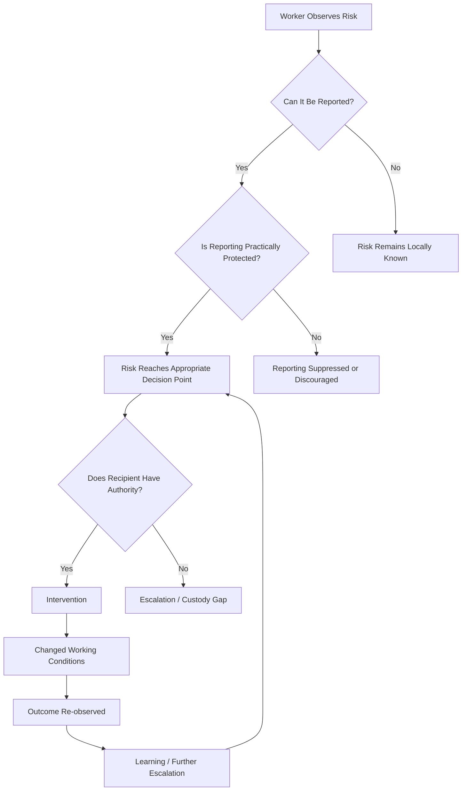
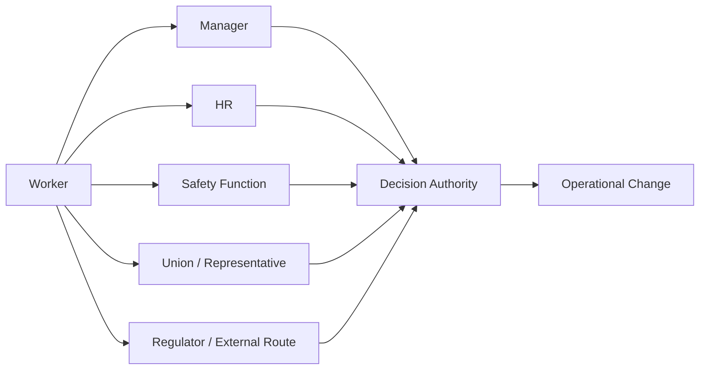
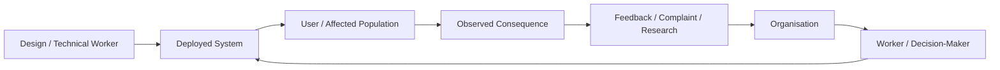
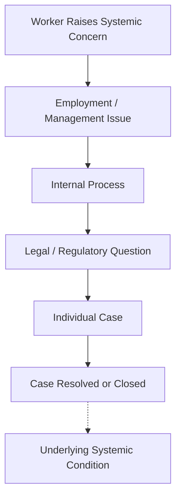

# ✈️ Worker Positioning & Safety Culture
**First created:** 2025-12-12 | **Last updated:** 2026-08-14  
*Why proximity to risk is not the same thing as authority over risk.*

---

## 🛰️ Orientation

Workers often occupy the point in a system where failure becomes visible first.

They may:

- encounter unsafe conditions;
- observe near-misses;
- notice anomalous behaviour;
- see workarounds becoming routine;
- experience conflicting instructions;
- recognise downstream harm before senior decision-makers do.

That gives workers **epistemic proximity** to risk.

It does not necessarily give them **authority over risk**.

A worker may know that something is wrong while lacking the power to:

- halt activity;
- change a design;
- alter a deadline;
- require investigation;
- compel disclosure;
- or protect themselves from the consequences of escalation.

This node therefore treats safety culture as an **ownership and control problem**.

> **Who can see the risk, who can report it, who can act on it, and who carries the consequences when those positions do not align?**

---

## 👁️ Proximity Is Not Control

Safety systems frequently distribute observation and authority differently.

```text
worker sees hazard
        ≠
worker controls hazard

worker reports hazard
        ≠
organisation acts on hazard

organisation records hazard
        ≠
hazard is resolved
```

This distinction matters because organisations can appear information-rich while remaining intervention-poor.

A reporting system may collect excellent information.

A regulator may receive notifications.

Managers may discuss the issue.

Workers may repeatedly escalate it.

None of those facts alone establishes that somebody possesses both the authority and incentive required to change the underlying condition.

The first diagnostic question is therefore not:

> **Was the risk known?**

It is:

> **What could the person who knew actually cause the system to do?**

---

## ♻️ The Worker-Safety Control Loop

A functioning safety system requires more than a reporting channel.

It requires a complete control loop.



Every transition can fail.

That means an organisation can have:

- observability without reporting;
- reporting without protection;
- protection without authority;
- authority without intervention;
- intervention without verification.

A mature safety culture closes the loop.

---

## 🏗️ What Safety-Critical Systems Try to Build

Safety-critical sectors provide useful examples because some organisations within aviation, nuclear operations, healthcare, transport, engineering, and other high-hazard environments have developed formal mechanisms intended to improve the movement of safety information.

The precise arrangements vary substantially by sector, occupation, organisation, and jurisdiction.

Relevant mechanisms can include:

| Mechanism | Governance function |
|---|---|
| Protected or confidential reporting | Makes disclosure less dependent on immediate management relationships |
| Incident and near-miss reporting | Converts weak signals into organisational telemetry |
| Stop-work or intervention authority | Moves some control toward people closest to a hazard |
| Independent investigation | Separates learning from the immediate operational hierarchy |
| Safety representatives | Creates recognised worker participation in safety governance |
| Professional duties | Gives some workers obligations extending beyond managerial instruction |
| Regulatory reporting | Moves information outside the employing organisation |
| Collective representation | Can alter the power relationship surrounding escalation |

The important lesson is not:

> **“Aviation has solved safety.”**

Nor:

> **“Nuclear workers can always stop the line.”**

It is:

> **Safety improves when systems deliberately connect observation, reporting, protection, authority, intervention, and learning.**

---

## 👑 Who Owns Worker Protection?

Worker protection is rarely owned by one institution.

In the UK, different parts of the problem may involve:

- employers;
- line management;
- health and safety structures;
- trade unions and worker representatives;
- the Health and Safety Executive or other relevant regulators;
- employment law;
- whistleblowing protections;
- professional regulators;
- employment tribunals;
- ACAS;
- sector-specific bodies.

This is not necessarily a defect.

Complex systems often require distributed governance.

But distributed governance creates a second problem:

> **Who owns the handoff?**

A worker may have several theoretically relevant routes while still finding that no single actor owns the entire journey from:

```text
observed concern
→ protected escalation
→ authoritative intervention
→ remediation
→ verification
```

The risk is therefore not simply **fragmentation**.

It is **unintegrated fragmentation**.

---

## 🧱 The Escalation Gap

A useful distinction is between a **reporting route** and an **effective escalation route**.

A reporting route answers:

> Where can I send this information?

An escalation route answers:

> Who can make something happen because I sent it?

Those are different.



The existence of many arrows leaving the worker does not guarantee that any of them reaches effective control.

This is the **escalation gap**.

---

## 🪞 Worker Positioning

Workers can occupy very different positions relative to risk.

| Worker position | Risk visibility | Intervention authority | Structural condition |
|---|---:|---:|---|
| Close to hazard, strong authority | High | High | Potentially effective local control |
| Close to hazard, weak authority | High | Low | **Exposure without control** |
| Distant from hazard, strong authority | Low | High | **Control without direct observability** |
| Distant from hazard, weak authority | Low | Low | Peripheral actor |

The dangerous organisational configuration is obvious:

```text
people who know
cannot act

+

people who can act
cannot see
```

Safety governance must bridge that distance.

---

## 🧠 Tech and Distributed Harm

Technology complicates this further.

Some harms associated with digital systems can be:

- geographically distributed;
- probabilistic;
- delayed;
- difficult to attribute;
- experienced by people outside the organisation;
- mediated through customers or platforms;
- visible only after aggregation.

A worker may therefore recognise a plausible risk without possessing the evidence normally associated with an immediate physical hazard.

For example:

```text
machine catches fire
```

produces a very different safety signal from:

```text
system may systematically disadvantage a population
across millions of interactions
```

The second can require:

- aggregation;
- modelling;
- interdisciplinary interpretation;
- user evidence;
- longitudinal observation;
- and governance judgment.

This makes worker positioning particularly important.

The person closest to the design decision may still be far from the people experiencing its consequences.

---

## 🧿 Observation Distance

Technology can create two simultaneous distances:

```text
designer
    ↓
system
    ↓
deployment
    ↓
user
    ↓
social consequence
```

and:

```text
affected person
    ↓
complaint / signal
    ↓
platform
    ↓
organisation
    ↓
technical team
```

Information must travel in both directions.



If either return path breaks, people designing the system can become informationally insulated from its effects.

---

## 🔁 Moral Distress and Governance Leakage

Workers may experience serious distress when they believe their work is contributing to harm while lacking an effective route to change the situation.

Care is needed with terminology here.

**Moral injury**, **moral distress**, burnout, occupational stress, and related concepts are not interchangeable, and their application varies across professional and research contexts.

The governance question does not require diagnosing workers.

It asks whether the system repeatedly places people in a position where they experience:

```text
perceived responsibility
+
risk awareness
-
effective authority
```

Possible organisational consequences can include:

- disengagement;
- reluctance to raise concerns;
- staff turnover;
- loss of expertise;
- deteriorating trust;
- weakened institutional memory.

Worker wellbeing can therefore become one source of information about governance conditions.

It should not be treated as proof of a particular underlying cause.

---

## ⚖️ The “Someone Else's Problem” Failure Mode

Distributed protection can fail through repeated handoff.

For example:



Every actor may perform its own function correctly.

Yet the structural condition can remain.

This is important because:

> **A system can fail through successful local processing.**

HR may correctly process an employment complaint.

A tribunal may correctly decide the legal dispute before it.

A regulator may correctly remain within its statutory remit.

A professional body may correctly examine only matters within its jurisdiction.

And still:

> **the cross-system safety question may remain unowned.**

That is a custody problem produced by interfaces rather than necessarily by misconduct.

---

## 🧩 Fragmentation vs Integration

Distributed governance is not inherently weak.

The important distinction is:

| Fragmented governance | Integrated distributed governance |
|---|---|
| Multiple bodies | Multiple bodies |
| Separate remits | Separate remits |
| Weak handoffs | Defined handoffs |
| Repeated referrals | Traceable escalation |
| Local case closure | Systemic learning |
| Nobody sees the whole pathway | Integration points reconstruct the pathway |
| Responsibility disappears between boundaries | Responsibility survives boundary crossing |

The design goal is therefore not:

> **one giant worker-safety authority controls everything.**

It is:

> **no important safety signal should become ownerless merely because it crosses institutional boundaries.**

---

## 🛡️ Protection Is Part of the Sensor

A reporting system cannot be analysed separately from the worker's position inside it.

If reporting produces unacceptable personal risk, the organisation has degraded its own sensing capacity.

```text
fear of retaliation
→ reduced reporting
→ reduced observability
→ weaker intervention
→ greater hidden risk
```

This means worker protection is not merely a welfare provision.

Within a safety system, it can also be an **information-quality control**.

A system that frightens its sensors cannot reliably observe itself.

---

## 👥 Collective Representation as Counterweight

Collective worker organisation can alter the power relationship surrounding safety escalation.

Depending upon context, unions or other representative structures may provide:

- collective voice;
- representation during disputes;
- institutional memory;
- specialist expertise;
- negotiated safety structures;
- protection against isolation of individual reporters.

This does not mean unions automatically produce good safety outcomes.

Nor does declining union density explain every weakness in modern worker protection.

The narrower structural point is:

> **Individual workers and employing institutions possess very different bargaining power. Collective representation can change that relationship.**

Where collective counterweights are weak, other forms of independent escalation and protection may become more important.

---

## 🛠️ Designing Stronger Custody

A strong worker-safety architecture may combine:

- accessible internal reporting;
- protection against retaliation;
- independent routes where internal reporting is inappropriate;
- clear intervention authority;
- traceable handoffs between responsible bodies;
- worker participation in risk governance;
- collective representation;
- sector-appropriate regulatory oversight;
- feedback to reporters where possible;
- aggregation of recurring concerns;
- review of whether interventions actually worked.

For emerging high-impact technologies, additional questions may include:

- Who can halt deployment?
- What evidence threshold triggers review?
- How are diffuse harms aggregated?
- Can affected external populations generate usable safety signals?
- Who owns risks that cross product, legal, ethical, and employment boundaries?

The objective is not to make safety somebody's **only** concern.

It is to make sure safety has enough **authority, protection, and continuity** to survive conflict with competing objectives.

---

## 👑 Ownership & Control Implication

Worker positioning reveals a general governance problem:

> **Risk knowledge and risk-control authority frequently occupy different parts of a system.**

That separation can be useful.

Independent decision-makers should not always be identical to frontline observers.

But the relationship must remain functional.

A healthy architecture allows:

```text
observation
→ protected transmission
→ integration
→ authority
→ intervention
→ re-observation
```

A weak architecture breaks one or more of those links.

The central ownership question is therefore not simply:

> **Who owns worker safety?**

It is:

> **Who owns each transition required to turn worker knowledge into system correction?**

---

## 🧭 Diagnostic Questions

- Who is closest to the risk?
- Who can observe its earliest signals?
- Can they report without unreasonable personal exposure?
- Where does that information go?
- Does the recipient possess relevant authority?
- If not, who owns escalation?
- Can activity be paused where circumstances justify it?
- Who verifies whether intervention worked?
- Are repeated concerns aggregated into systemic information?
- Can responsibility survive movement between organisational and regulatory boundaries?
- Are workers close to harm but structurally distant from control?
- Are decision-makers powerful but informationally distant from consequences?

Most importantly:

> **Can the people who see the system failing cause the system to learn?**

---

## 🌌 Constellations

✈️ 👑 ♻️ 🧿 ⚖️ — worker positioning; safety feedback; escalation authority; observability; distributed custody.

---

## ✨ Stardust

worker positioning, safety culture, escalation gap, worker protection, risk observability, stop-work authority, protected reporting, distributed governance, moral distress, worker voice, collective representation, safety telemetry, institutional handoffs, custody gap, technology labour governance

---

## 🏮 Footer

*✈️ Worker Positioning & Safety Culture* is a living node of the **Polaris Protocol**.

It examines the relationship between worker proximity to risk and institutional authority over risk. The node treats reporting, protection, escalation, intervention, and feedback as components of a safety-control loop rather than assuming that the existence of any one mechanism establishes a healthy safety culture.

Its central concern is not whether workers care enough.

It is whether the system can convert what workers know into corrective action.

> 📡 Cross-references:
>
> - [⚖️ Shielded Roles and Information Risk Governance](./⚖️_shielded_roles_and_information_risk_governance.md) — *how concentrated accountability interfaces with distributed authority*
> - [⚖️ Acknowledgement Tradeoffs in Data Fixing](./⚖️_acknowledgement_tradeoffs_in_data_fixing.md) — *how correction can become separated from acknowledgement and structural learning*
>
> 🏮 Return To:
>
> - [👑 Ownership & Control](./README.md) — *1up*
> - [♻️ Cybernetics](../README.md) — *2up*
> - [🪿 Embodied Information Ecology](../../README.md) — *3up*
> - [🌑 Origin Points](../../../README.md) — *4up*
> - [🌌 Polaris Protocol — Root](../../../../README.md) — *root*

*Survivor authorship is sovereign. Containment is never neutral.*

_Last updated: 2026-08-14_
