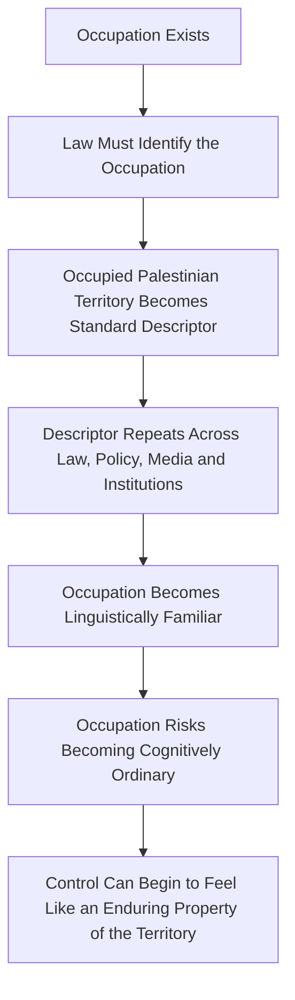
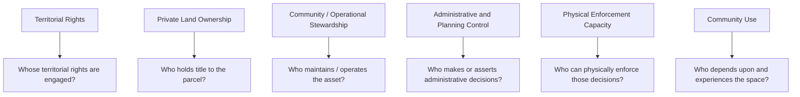
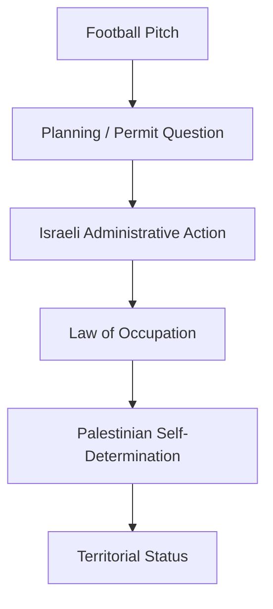
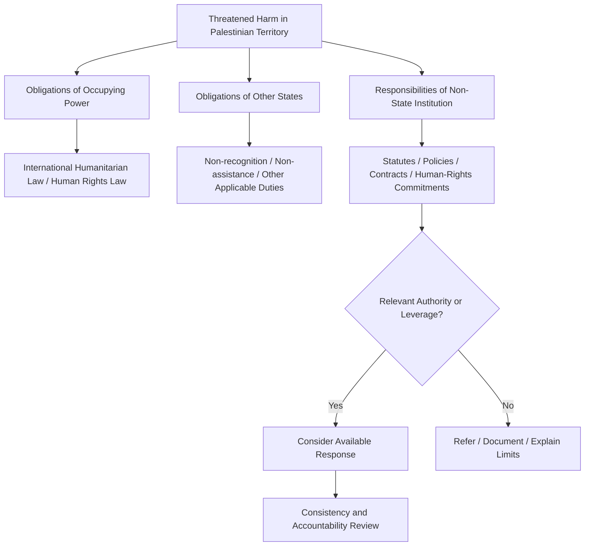
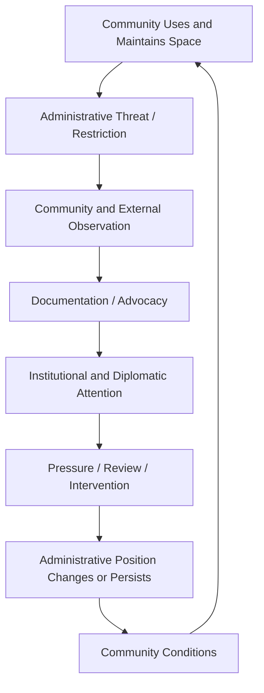

# 🇵🇸 Aida Is Palestinian Sovereign Territory
**First created:** 2025-11-17 | **Last updated:** 2026-08-14  
*Occupation describes a condition imposed upon territory. It does not become the territory's identity.*

---

## 🛰️ Orientation

Aida Camp sits beside Bethlehem in the occupied West Bank.

Its football pitch is a small piece of physical infrastructure.

It is also an unusually clear case study in:

- occupation;
- territorial control;
- private land ownership;
- administrative power;
- community use;
- institutional leverage;
- and the difference between **having power over a place** and **having sovereignty over it**.

This node deliberately uses the title:

> **Aida Is Palestinian Sovereign Territory**

rather than allowing *occupied* to become the defining description of Palestinian land.

That is a normative choice.

It does **not** deny the legal fact of Israeli occupation.

Nor does the title itself purport to resolve every question concerning Palestinian statehood, borders, private title, administrative competence, or the distribution of sovereign powers.

The narrower legal propositions used in this node are more precise:

- Aida lies in the West Bank, within the Occupied Palestinian Territory.
- The Palestinian people possess the right to self-determination.
- The territorial integrity of the Occupied Palestinian Territory must be respected.
- Occupation involves effective control exercised in foreign territory.
- Occupation does not transfer sovereign title to the occupying power.
- Israel is not entitled to sovereignty over, or to exercise sovereign powers in, any part of the Occupied Palestinian Territory **on account of its occupation**.
- The International Court of Justice concluded in 2024 that Israel's continued presence in the Occupied Palestinian Territory is unlawful.

The title therefore refuses a conceptual collapse:

```text
effective control
≠
sovereignty

occupation
≠
territorial identity
```

---

## 🗺️ Occupation Is a Condition, Not a Title

International humanitarian law gives an occupying power particular powers and duties because it exercises effective control over territory it does not acquire sovereign title to through occupation.

That distinction is foundational.

```text
occupation
≠
annexation

occupation
≠
sovereignty

administrative authority
≠
sovereign title

ability to issue an order
≠
ownership of the territory
```

The International Court of Justice stated in its 2024 advisory opinion that occupation is premised on being temporary and cannot transfer title of sovereignty to the occupying power.

The passage of time does not change that rule.

Nor does prolonged control itself enlarge the occupying power's limited authority into sovereignty.

The Court further concluded that Israel is not entitled to sovereignty over, or to exercise sovereign powers in, any part of the Occupied Palestinian Territory on account of its occupation.

That means the capacity to:

- control movement;
- administer planning systems;
- issue orders;
- enforce restrictions;
- maintain military control;
- or exercise other forms of effective authority

does not answer the sovereignty question.

Power is observable.

Title is juridical.

They must not be collapsed.

---

## 🧠 When a Legal Descriptor Becomes a Cognitive Default

**Occupied Palestinian Territory** is an important legal term of art.

This node uses it where the legal status of occupation is analytically relevant.

But accurate terminology can produce a secondary information problem when a condition becomes the most routinely repeated name for the place experiencing it.

*Occupied* describes what has happened to Palestinian territory.

It is not an inherent characteristic of Palestinian territory.

There is a subtle difference between:

```text
Palestinian territory that is occupied
```

and the repeatedly encountered proper-name-like construction:

```text
the Occupied Palestinian Territory
```

The second is legally useful.

Its constant repetition can nevertheless make occupation cognitively ordinary: a stable characteristic attached to the territory rather than a condition imposed upon it.



This creates a genuine naming problem.

There are risks in both directions.

```text
never identify the occupation
→
risk obscuring occupation

always define the territory primarily through occupation
→
risk naturalising occupation
```

There is no need to solve that tension by choosing one vocabulary exclusively.

Polaris therefore uses both registers deliberately:

- **Occupied Palestinian Territory (OPT)** where occupation is legally or analytically relevant;
- **Palestinian territory**, **Palestinian land**, the **West Bank**, or the specific place name where restating occupation adds nothing necessary to the analysis.

The governing principle is:

> **Occupation should remain visible without becoming naturalised.**

---

## 🪞 Why the Title Refuses the Occupation Frame

The title is therefore doing something deliberate.

It does not say:

> occupation does not exist.

It says:

> **occupation does not get to become the identity of the territory it acts upon.**

There is a difference between describing the machinery currently acting upon a place and allowing that machinery to define the place.

```text
Aida is occupied
```

describes a condition.

```text
occupation makes Aida Israeli
```

would make a claim about title that does not follow from that condition.

And:

```text
Aida is permanently intelligible only as "occupied"
```

risks allowing an imposed condition to become the cognitive frame through which the place itself is understood.

The title operates as a semantic counterweight.

The body retains the legal terminology.

The title refuses to let that terminology swallow the underlying territorial subject.

---

## 🇵🇸 Self-Determination and Territorial Integrity

The International Court of Justice has reaffirmed the Palestinian people's right to self-determination.

In 2024, the Court described the entirety of the Palestinian territory occupied by Israel in 1967 as the territorial unit in relation to which the Palestinian people should be able to exercise that right, and whose integrity must be respected.

The Court further identified the right to an independent and sovereign State over the entirety of the Occupied Palestinian Territory as part of the Palestinian people's exercise of self-determination.

Self-determination includes the ability of a people to determine its political status and pursue its economic, social and cultural development.

That gives the Aida case a larger significance.

A football pitch does not determine territorial sovereignty.

But decisions about:

- land;
- planning;
- movement;
- community infrastructure;
- development;
- and the physical conditions in which civilian life can occur

form part of the material environment through which self-determination can either be exercised or obstructed.

---

## 🧩 The Ownership Stack

Aida's football pitch is useful precisely because several different kinds of ownership and control overlap.

They should not be treated as interchangeable.



These questions can produce different answers.

That is not contradictory.

It is what layered governance looks like.

---

## ⛪️ Private Ownership Is Not Territorial Sovereignty

The land associated with the football pitch has been reported as belonging to the Armenian Church and made available for community sporting use.

That introduces another important distinction:

```text
private ownership of land
≠
territorial sovereignty
```

Private property rights concern a particular asset.

Territorial sovereignty concerns authority associated with territory as territory.

Similarly:

```text
community use
≠
private ownership

private ownership
≠
administrative control

administrative control
≠
territorial sovereignty
```

The Aida case therefore cannot be understood through the single question:

> **Who owns it?**

The better question is:

> **Which kind of ownership or control are we talking about?**

---

## ⚽ The Pitch as Community Infrastructure

Aida's football pitch is not simply an abstract parcel in a territorial dispute.

It is used.

Current humanitarian reporting describes it as a significant community and recreational space serving Palestine refugee children, including girls, in an environment where safe open space is severely constrained.

Its governance significance therefore comes partly from its function.

The pitch supports:

- play;
- organised sport;
- social contact;
- physical activity;
- community gathering;
- and access to open space.

The appropriate legal description should remain careful.

The pitch is a **civilian and community facility**.

Its social importance can be established without inventing a special category of international humanitarian law for football pitches.

---

## 🧱 The Demolition Dispute

The football pitch has been subject to Israeli demolition and use restrictions associated with the planning and permit regime applied in the West Bank.

The immediate dispute can therefore appear administrative:

> **Can this structure lawfully remain here under the planning regime being applied to it?**

But that administrative question exists inside a larger legal structure.



A planning decision does not cease to be an administrative decision merely because occupation exists.

But neither can the territorial status of the land be inferred from the existence of an administrative planning system.

This is precisely why:

> **administration is not sovereignty.**

---

## 🧿 Control Can Produce the Appearance of Title

Long-term control creates an information problem.

People repeatedly observe:

- checkpoints;
- permits;
- orders;
- enforcement;
- maps;
- administrative classifications;
- military authority;
- planning decisions.

Over time, the actor exercising those powers can begin to appear to an outside observer as the natural sovereign.


International law expressly resists that inference.

Duration does not transform occupation into sovereign title.

Administrative density does not transform effective control into sovereign title.

The repeated visibility of power does not make the underlying legal distinction disappear.

This is another reason vocabulary matters.

---

## 🌍 Third States: Actual International-Law Obligations

Third-state obligations need to be stated precisely.

Following its findings concerning Israel's unlawful continued presence in the Occupied Palestinian Territory, the International Court of Justice concluded that States are under obligations including:

- not recognising as legal the situation arising from that unlawful presence;
- not rendering aid or assistance in maintaining that situation;
- distinguishing in their dealings with Israel between the territory of Israel and the Palestinian territory occupied since 1967;
- and cooperating, consistently with the UN Charter and international law, toward ending impediments resulting from the unlawful presence to Palestinian self-determination.

States parties to the Fourth Geneva Convention also have relevant obligations concerning respect for the Convention.

These propositions concern **States**.

They should not be automatically converted into identical legal duties for every:

- sporting body;
- university;
- charity;
- company;
- professional association;
- or civil-society organisation.

Different actors occupy different legal and governance positions.

---

## 🏟️ Institutional Responsibility Is Not State Responsibility

Non-state institutions may nevertheless possess:

- contractual authority;
- regulatory powers;
- membership rules;
- funding relationships;
- procurement leverage;
- human-rights policies;
- safeguarding commitments;
- ethical standards;
- reputational influence;
- or practical access to decision-makers.

Their responsibilities therefore need to be assessed through the frameworks actually governing them.



This prevents a common analytical jump:

```text
institution knows
therefore
institution has a legal duty to stop it
```

That does not automatically follow.

---

## 📣 Notice Still Matters

Removing an automatic legal-duty claim does **not** make notification irrelevant.

Notice changes the information environment.

Once an institution receives credible information, questions can arise about:

- what it knew;
- when it knew it;
- whether the matter fell within its remit;
- what authority it possessed;
- whether its own policies were engaged;
- whether it referred the issue appropriately;
- whether it acted consistently with comparable cases;
- and whether its stated commitments matched its response.

So:

```text
notice
≠
automatic legal liability
```

but:

```text
notice
→
knowledge becomes easier to establish
→
later governance decisions become easier to examine
```

That remains significant.

---

## 🧭 From Knowledge to Responsibility

A better accountability sequence is:


Responsibility depends upon what happens at each transition.

This is more useful than treating silence as self-proving complicity.

---

## 🔎 Institutional Silence Is Evidence of Silence

Silence should not be made to prove more than it proves.

```text
no public response
≠
no internal action

no public response
≠
agreement

no public response
≠
legal complicity
```

But persistent non-response can still be examined.

Relevant questions include:

- Was notice received?
- Was it assessed?
- Who owned the decision?
- Was a referral made?
- Was the matter considered outside remit?
- Was there relevant leverage?
- Was comparable conduct treated differently elsewhere?

That turns accusation into audit.

---

## ♻️ The Aida Feedback Loop

The case can be modelled as an ownership-and-control loop.



The significance is not that every outside institution controls the outcome.

It is that control and leverage are distributed.

Different actors may possess different kinds of influence over different transitions.

The governance question becomes:

> **Who can alter which arrow?**

---

## 👑 Ownership & Control Implication

Aida exposes why **ownership** is an inadequate single-variable description of political space.

At least six questions coexist:

| Question | Governance layer |
|---|---|
| Who owns the parcel? | Property |
| Who maintains the pitch? | Stewardship |
| Who uses it? | Community |
| Who asserts planning authority? | Administration |
| Who can enforce an order? | Effective control |
| Whose territorial rights are engaged? | Sovereignty / self-determination |

Collapsing those layers produces bad analysis.

The actor with the strongest immediate coercive capacity does not thereby become sovereign.

The private owner does not become the territorial sovereign.

The community using an asset does not necessarily hold its legal title.

And administrative machinery does not erase the underlying territorial question.

---

## 🧠 The Cybernetic Point

Occupation is not experienced only through spectacular uses of force.

It can also operate through systems governing:

- permission;
- access;
- construction;
- movement;
- infrastructure;
- records;
- boundaries;
- and everyday administrative possibility.

Those systems generate feedback.

```text
administrative decision
→
material condition
→
lived experience
→
documentation
→
political / legal response
→
pressure on administrative system
```

Language participates in that feedback environment too.

Repeated classifications influence how systems, institutions and people conceptualise the objects being classified.

That means even a legally accurate descriptor deserves examination when its repeated use risks transforming:

```text
a condition imposed upon a place
```

into:

```text
the ordinary identity of the place
```

Aida's football pitch is useful precisely because it is small.

It shows how enormous questions of:

- sovereignty;
- self-determination;
- occupation;
- property;
- childhood;
- planning;
- language;
- and institutional responsibility

can become embodied in an ordinary physical place.

---

## 🧭 Diagnostic Questions

When analysing a comparable case, ask:

- Where is the asset located?
- What is the territory's legal status?
- What condition is being described, and what is being treated as identity?
- Who holds private title to the land?
- Who operates or maintains the asset?
- Who uses and depends upon it?
- Who asserts administrative authority?
- On what legal basis is that authority exercised?
- Who possesses physical enforcement capacity?
- Is administrative control being mistaken for sovereignty?
- Is prolonged control becoming cognitively naturalised through repeated administrative language?
- Which obligations belong to the occupying power?
- Which obligations belong to third States?
- Which responsibilities arise from a non-state institution's own rules or commitments?
- What did an institution know?
- What authority or leverage did it actually possess?
- Was its response recorded and reviewable?

Most importantly:

> **Which kind of ownership or control are we actually talking about — and has the language used to describe control begun to make that control look natural?**

---

## 🌌 Constellations

🇵🇸 👑 🗺️ ⚽ 🧿 ♻️ — Palestinian self-determination; occupation; layered ownership; community infrastructure; administrative control; semantic normalisation.

---

## ✨ Stardust

Aida Camp, Palestinian sovereignty, Palestinian self-determination, Occupied Palestinian Territory, occupation and sovereignty, semantic normalisation, occupation language, football infrastructure, civilian community space, administrative control, private land ownership, third-state obligations, institutional leverage, non-recognition, non-assistance, territorial integrity, governance under occupation

---

## 🏮 Footer

*🇵🇸 Aida Is Palestinian Sovereign Territory* is a living node of the **Polaris Protocol**.

Its title deliberately refuses to allow occupation to become synonymous with either sovereign title or territorial identity.

The node distinguishes between territorial rights, private ownership, community stewardship, administrative authority, effective control, and the Palestinian people's right to self-determination.

It also treats naming as part of the information environment: **Occupied Palestinian Territory** remains an important legal term of art, while repeated use of occupation as the territory's defining descriptor can risk making an imposed condition appear ordinary or permanent.

The node therefore does not infer sovereignty from control, complicity from silence, or identical legal obligations for States and non-state institutions.

Its governing principles are:

> **Occupation should remain visible without becoming naturalised.**
>
> **Control should remain observable without being mistaken for title.**

> 📡 Cross-references:
>
> - [🌍 Cross-Border Bias Propagation in Surveillance Models](./🌍_cross_border_bias_propagation_in_surveillance_models.md) — *how classifications and authority travel between systems*
> - [🌍 Israel–Five Eyes Structural Interdependency](../💫_Containment_Logic/🌍_israel_five_eyes_structural_interdependency.md)
> - [🌍 Apartheid Algorithm Dependency Theory](../../🦕_Elder_Influencers/🕸️_World_Webs/🌍_apartheid_algorithm_dependency_theory.md)
> - [🧬 Metadata-Driven Racism](../../../../Metadata_Sabotage_Network/Governance_And_Containment/🈺_Governance_And_Prevent/🧬_metadata_driven_racism.md)
>
> 🏮 Return To:
>
> - [👑 Ownership & Control](./README.md) — *1up*
> - [♻️ Cybernetics](../README.md) — *2up*
> - [🪿 Embodied Information Ecology](../../README.md) — *3up*
> - [🌑 Origin Points](../../../README.md) — *4up*
> - [🌌 Polaris Protocol — Root](../../../../README.md) — *root*

*Survivor authorship is sovereign. Containment is never neutral.*

_Last updated: 2026-08-14_
