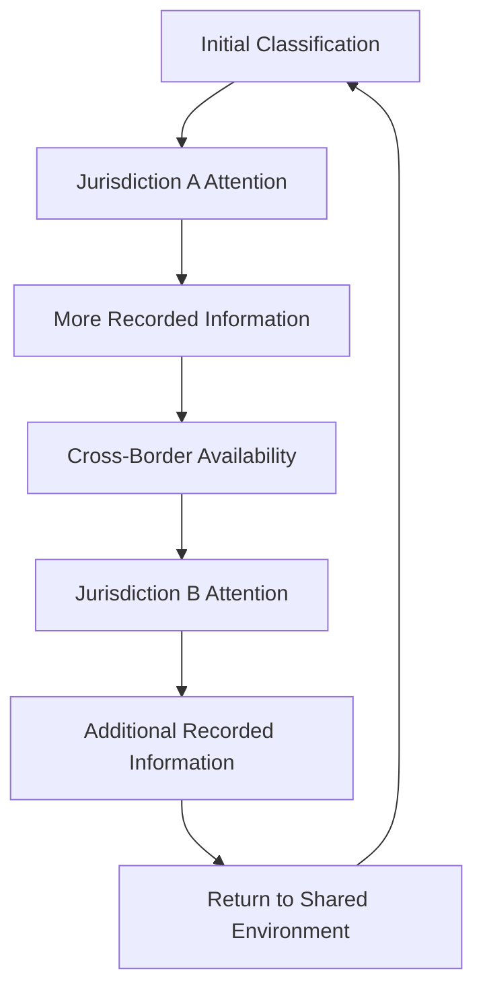
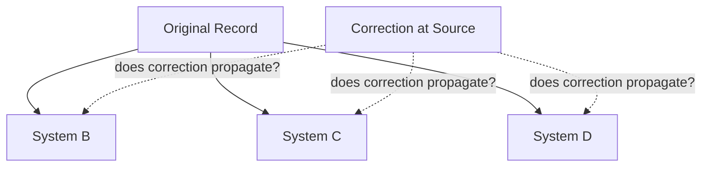
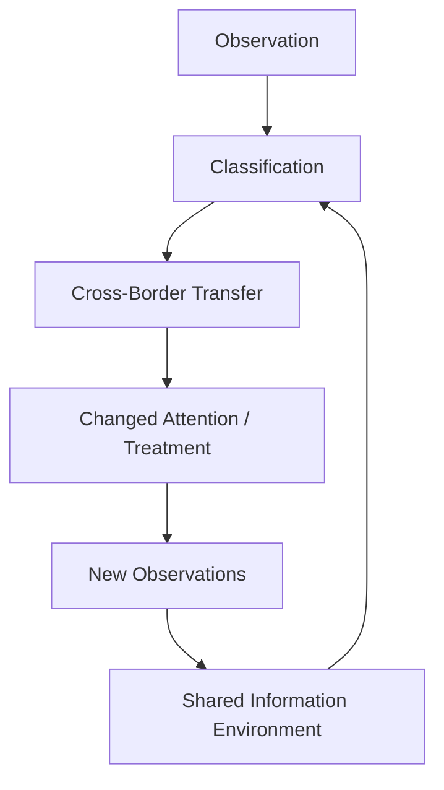

# 🌍 Cross-Border Bias Propagation in Surveillance Models
**First created:** 2025-11-18 | **Last updated:** 2026-08-14  
*How data, models, schemas, vendors and classification practices can move between jurisdictions — and how apparently independent systems can inherit the same errors.*

---

## 🛰️ Orientation

Surveillance and risk-classification systems do not necessarily stop at national borders.

States, companies, researchers and international partnerships may exchange or reuse:

- data;
- analytical models;
- software;
- metadata schemas;
- research;
- risk indicators;
- technical standards;
- and classification practices.

This creates an important governance possibility:

> **Bias does not necessarily remain local. It can travel through the infrastructure connecting systems.**

But similarity between two systems is not evidence, by itself, that information or models have moved between them.

Several different mechanisms can produce similar outcomes.

The purpose of this node is therefore not to infer hidden coordination from cross-border similarity.

It is to ask a narrower question:

> **What, if anything, crossed the border — and who owns the consequences when it did?**

---

## 🌐 Cross-Border Propagation Is Not One Thing

The phrase **cross-border bias propagation** can conceal several distinct mechanisms.

```text
                    CROSS-BORDER PROPAGATION
                             │
       ┌──────────┬──────────┼──────────┬──────────┐
       ↓          ↓          ↓          ↓          ↓
      DATA       MODEL     SCHEMA     VENDOR     CONCEPT
       │          │          │          │          │
   records /   rules /    category    common     doctrine /
   signals     weights     design     supplier    research
```

These mechanisms can overlap.

They should not be treated as interchangeable.

A shared vendor does not prove shared data.

Shared terminology does not prove a shared model.

Similar outputs do not prove either.

---

## 🧩 1. Data Propagation

The most direct mechanism is information transfer.


Depending upon the system and applicable legal framework, cross-border information exchange may occur through:

- formal agreements;
- law-enforcement cooperation;
- intelligence relationships;
- border or immigration systems;
- shared databases;
- vendor infrastructure;
- research arrangements;
- or other authorised information-sharing mechanisms.

Where the underlying information contains:

- error;
- outdated context;
- disputed classification;
- incomplete identity resolution;
- or biased interpretation,

those defects may travel with the record.

But:

```text
information-sharing capability
≠
evidence that a particular record was shared
```

That distinction should remain explicit.

---

## 🧠 2. Model Propagation

The data itself does not need to travel for analytical logic to travel.

A model or decision system developed in one environment may be:

- licensed;
- exported;
- adapted;
- retrained;
- integrated;
- or reproduced elsewhere.

```text
training environment A
        ↓
analytical model
        ↓
deployment environment B
```

The receiving organisation may therefore inherit assumptions originating in another:

- population;
- legal environment;
- political context;
- language environment;
- threat model;
- or institutional culture.

This creates a familiar machine-learning problem:

> **A model can travel more easily than the context that made its original correlations meaningful.**

---

## 🧬 3. Schema Propagation

Sometimes neither the original data nor the original model needs to move.

The **categories** can move.

Examples might include classifications concerning:

- risk;
- extremism;
- instability;
- association;
- vulnerability;
- behavioural concern;
- identity;
- affiliation;
- or threat.

Once a category becomes embedded upstream in:

- procurement specifications;
- database architecture;
- interoperability standards;
- reporting templates;
- policy frameworks;
- or vendor products,

later institutions may inherit the category without independently reconstructing the assumptions underneath it.

```text
CONCEPT
   ↓
SCHEMA
   ↓
DATABASE FIELD
   ↓
WORKFLOW
   ↓
DECISION
```

This is one route through which bias can persist through **technical and administrative inertia rather than deliberate discriminatory intent**.

---

## 🏢 4. Vendor-Mediated Propagation

Large technology vendors can operate across:

- policing;
- intelligence;
- border management;
- defence;
- fraud;
- safeguarding;
- financial crime;
- and other risk environments.

A vendor appearing in several jurisdictions creates a possible transmission route for:

- software architecture;
- analytical techniques;
- interfaces;
- ontology design;
- implementation practice;
- and institutional assumptions.

But the evidential firewall matters:

```text
same vendor
≠
same product

same product
≠
same configuration

same configuration
≠
same dataset

same dataset architecture
≠
shared records
```

Vendor overlap is therefore a **mapping clue**, not proof of information exchange.

---

## 📚 5. Research and Concept Propagation

Ideas travel even where operational systems remain separate.

Common intellectual inputs can include:

- behavioural science;
- criminology;
- counter-extremism research;
- security studies;
- affective computing;
- OSINT methodologies;
- risk modelling;
- academic research;
- consultancy frameworks;
- and professional standards.

This can produce conceptual convergence.

```text
research / doctrine
      ↙       ↓       ↘
system A   system B   system C
```

If the originating assumptions are poor, several systems can reproduce similar weaknesses **without sharing operational data at all**.

This is important because:

> **institutional convergence is not necessarily evidence of institutional coordination.**

Sometimes everybody simply read the same paper.

---

## 🧳 6. Diaspora and Cross-Jurisdictional Populations

Cross-border populations create a particularly important analytical problem.

The same individual, organisation, movement or community may become visible to institutions in several jurisdictions.

But similar classification across those systems can arise through very different mechanisms.

### A. Independent observation

```text
              PERSON
              /    \
             ↓      ↓
        System A   System B
             ↓      ↓
          label X  label X
```

Both systems independently reach similar conclusions.

---

### B. Record transfer

```text
PERSON
  ↓
System A
  ↓
record / classification
  ↓
System B
```

Information generated in one jurisdiction becomes available in another.

---

### C. Classification inheritance

```text
System A
   ↓
classification X
   ↓
System B receives X
   ↓
X influences subsequent assessment
```

The second system performs additional analysis, but the first classification forms part of its input.

---

### D. Common-schema convergence

```text
       shared analytical framework
              /          \
             ↓            ↓
        System A       System B
             ↓            ↓
             X            X
```

The systems share assumptions rather than records.

---

### E. Common-vendor convergence

```text
              Vendor
             /      \
            ↓        ↓
       Deployment A Deployment B
```

Similar architecture may generate similar behaviours even where datasets remain separate.

---

## 🧿 Same Experience, Different Governance Problem

From the perspective of the person being classified, these mechanisms can look remarkably similar.

```text
System A says X
System B says X
System C says X
```

But the appropriate remedy depends upon the mechanism.

| Failure location | Primary governance question |
|---|---|
| Source record | Is the underlying information accurate? |
| Data transfer | Was the information lawfully and appropriately shared? |
| Identity resolution | Has information been attached to the correct person or entity? |
| Model | Is the analytical method valid in this deployment context? |
| Schema | Are the categories themselves well designed? |
| Vendor | Who controls configuration, validation and correction? |
| Policy | Is the classification required or encouraged by institutional rules? |
| Research | Is an unsupported assumption being repeatedly imported? |
| Independent convergence | Are multiple systems simply reaching the same conclusion independently? |

This is why identifying the propagation mechanism matters.

Otherwise an attempted correction may target the wrong layer.

---

## 🔄 7. Feedback Between Systems

Cross-border exchange becomes particularly important when information can make a round trip.

Consider:


If System B's later observations are influenced by information originating in System A, and those observations subsequently return to A, the system may create a reinforcing loop.

This does not require:

- conspiracy;
- central coordination;
- identical software;
- or malicious intent.

It requires only sufficient information dependency.

---

## 🪞 8. Pseudo-Corroboration

This produces one of the most important failure modes in the node.

Imagine:

```text
System A produces X
        ↓
System B receives X
        ↓
X influences System B's observation
        ↓
System B produces X'
        ↓
System A receives X'
```

The resulting record can appear to show:

```text
SOURCE A → X
SOURCE B → X'

therefore:

two sources support the conclusion
```

But the sources may not be independent.

The apparent corroboration may partly represent the original assumption completing a circuit.

```text
ONE SIGNAL
    ↓
PROPAGATION
    ↓
TRANSFORMATION
    ↓
RETURN
    ↓
APPARENT SECOND SIGNAL
```

This can be described as **pseudo-corroboration**.

It does not mean the eventual conclusion is necessarily false.

It means the apparent number of independent evidential sources may be overstated.

> **Before treating cross-system agreement as corroboration, establish whether the systems are informationally independent.**

---

## 🦠 9. Bias Can Become Self-Reinforcing

Suppose an initial classification affects subsequent observation.

```text
classification
      ↓
increased attention
      ↓
more observations
      ↓
larger record
      ↓
higher apparent salience
      ↓
continued classification
```

Now add multiple jurisdictions:



The system can gradually lose visibility of the distinction between:

> **the original reason for suspicion**

and:

> **information generated because suspicion already existed.**

That is a classic feedback problem.

---

## 📈 10. Agreement Is Not Independence

Cross-system agreement can increase confidence legitimately.

If several genuinely independent systems observe the same phenomenon:

```text
A → X
B → X
C → X
```

agreement may constitute meaningful corroboration.

But:

```text
A → X
↓
B → X
↓
C → X
```

is structurally different.

So confidence should depend not only upon:

```text
HOW MANY SOURCES AGREE?
```

but also:

```text
HOW INDEPENDENT ARE THOSE SOURCES?
```

This principle applies far beyond surveillance.

It matters in:

- intelligence;
- policing;
- safeguarding;
- fraud detection;
- sanctions;
- financial risk;
- healthcare;
- academic citation;
- journalism;
- automated moderation;
- and machine-learning evaluation.

A network can contain many records without containing many independent observations.

---

## 📊 11. What Cross-Border Propagation Might Look Like

The following patterns may justify further investigation:

- highly similar classifications appearing across jurisdictions;
- unusual terminology appearing in otherwise separate systems;
- repeated edge-case failures;
- identical or unusually similar metadata fields;
- common vendors;
- common research foundations;
- shared technical standards;
- documented information-sharing arrangements;
- classifications appearing in one jurisdiction shortly after being generated in another.

But none is individually dispositive.

```text
similar output
≠
shared model

shared terminology
≠
shared data

same vendor
≠
same deployment

technical interoperability
≠
record transfer

information-sharing agreement
≠
evidence of a particular transfer

capability
≠
use

use
≠
causation
```

The correct response to similarity is therefore:

> **investigate the dependency structure.**

Not:

> **assume the dependency structure.**

---

## 🧪 12. The Causal Ladder

Claims about cross-border propagation should move through explicit evidential stages.

```text
MECHANISM EXISTS
        ↓
SYSTEM HAS CAPABILITY
        ↓
RELEVANT CONNECTION EXISTS
        ↓
TRANSFER / REUSE OCCURRED
        ↓
TRANSFER REACHED THIS PROCESS
        ↓
TRANSFER INFLUENCED OUTPUT
        ↓
OBSERVED OUTCOME
```

Evidence at one stage does not automatically establish the next.

For example:

```text
two states exchange information
≠
this information was exchanged

vendor supplies both systems
≠
the systems share a model

same classification appears twice
≠
one caused the other
```

This is not pedantry.

It is what makes cross-border systems analysis usable.

---

## 📉 13. Structural Failure Modes

### A. Calibration Drift

A system may be calibrated for one environment and later deployed elsewhere.

Differences in:

- population;
- law;
- language;
- prevalence;
- institutional practice;
- or threat environment

can alter performance.

---

### B. Context Mismatch

Behaviour meaningful in one social or political environment may have different meaning elsewhere.

Models can flatten:

- language;
- cultural practice;
- political context;
- religious practice;
- humour;
- protest traditions;
- identity;
- and local institutional history.

---

### C. Schema Overreach

Broad classifications can erase important distinctions.

A category sufficiently vague to function across many systems may become less meaningful in each individual one.

Interoperability can therefore create pressure toward **lowest-common-denominator classification**.

---

### D. Identity Resolution Error

Cross-border systems must determine whether records refer to:

- the same person;
- different people with similar identifiers;
- related organisations;
- aliases;
- transliterations;
- family members;
- or entirely unrelated entities.

An identity-resolution error can therefore propagate separately from the substantive classification itself.

---

### E. Provenance Loss

As information moves:

```text
observation
→ report
→ database
→ export
→ derived classification
→ downstream database
```

its provenance may become harder for later users to reconstruct.

A downstream user may see:

> **risk indicator**

without easily seeing:

> who generated it, from what evidence, under which definition, when, and with what confidence.

---

### F. Correction Failure

A particularly serious ownership problem occurs when:

```text
bad information propagates widely
```

but:

```text
correction remains local
```

For example:



This creates an important asymmetry:

> **Does the correction have the same mobility as the allegation?**

If not, erroneous information can remain operational long after its source has changed.

---

## 👑 14. Ownership and Accountability

Cross-border systems distribute responsibility.

Potential custodians include:

| Actor | Possible responsibility |
|---|---|
| Source institution | Accuracy and provenance of originating information |
| Receiving institution | Appropriate interpretation and use |
| Vendor | System design, documentation and correction architecture |
| Procuring body | Requirements, validation and oversight |
| Research community | Evidential quality of imported concepts |
| Standards body | Interoperability architecture |
| State | Legal authority and governance |
| International partnership | Rules governing shared systems or information |
| Oversight body | Audit, remedy and accountability |

The difficult case occurs when everybody can accurately say:

> **we only control our component.**

Because:

```text
local ownership
+
local ownership
+
local ownership

does not necessarily produce

ownership of the whole feedback loop
```

That is the custodial gap.

---

## 🛠️ 15. Correction Must Be Able to Travel

A mature cross-border information architecture needs more than mechanisms for sharing.

It needs mechanisms for:

- correction;
- qualification;
- provenance;
- dispute;
- deletion where required;
- confidence updating;
- temporal expiry;
- and downstream notification.

Otherwise the architecture has a directional bias:

```text
ALLEGATION
██████████████████████████████▶

CORRECTION
████▶
```

That is not merely a fairness problem.

It is a data-integrity problem.

If participating systems cannot reliably learn that an upstream record has changed, they are operating on stale state.

---

## 🧭 16. Interoperability Requires Error Governance

Interoperability is often treated as an engineering success condition.

Systems can communicate.

Excellent.

But successful communication also increases the potential propagation radius of defective information.

```text
low interoperability
→ errors may remain siloed

high interoperability
→ useful information travels efficiently
→ errors may also travel efficiently
```

Therefore:

> **The better systems become at sharing information, the better they must become at sharing corrections, uncertainty and provenance.**

Interoperability without error governance increases systemic coupling.

---

## ♻️ 17. The Cybernetic Problem

The central issue is not simply that biased systems exist.

It is that connected systems can alter one another's future inputs.



Once that happens, the analytical object is no longer simply:

```text
MODEL A
```

or:

```text
DATABASE B
```

It becomes:

```text
THE FEEDBACK RELATIONSHIP
BETWEEN CONNECTED SYSTEMS
```

Bias can therefore function not merely as a local defect but as a **distributed dependency**.

---

## 🧠 18. What This Node Does Not Establish

This node does **not** establish that:

- surveillance systems in different states necessarily share data;
- similar classifications prove coordination;
- common vendors operate identical models;
- diaspora communities are uniformly monitored;
- interoperability implies access to every connected dataset;
- states adopt foreign classifications uncritically;
- every repeated classification represents feedback;
- apparent corroboration is necessarily pseudo-corroboration;
- bias propagation is intentional;
- or a single controller coordinates the systems described.

It establishes a set of **possible propagation mechanisms and governance tests**.

Empirical claims require evidence at the relevant stage of the causal chain.

The rule remains:

```text
A can affect B
≠
A affected B here
```

---

## 🔎 19. Evidence Expansion

A later evidence pass could add bounded case studies demonstrating different propagation mechanisms.

The useful case-study categories would be:

1. **documented cross-border data transfer;**
2. **documented model or software reuse;**
3. **common vendor architecture;**
4. **shared classification standards;**
5. **documented correction failures;**
6. **documented feedback or circular reporting;**
7. **independent convergence demonstrating why similarity alone is insufficient.**

Until those cases are sourced, observed similarity should remain a **diagnostic trigger**, not evidence of propagation.

---

## 🧭 Diagnostic Questions

When similar classifications appear across systems, ask:

- What exactly is similar?
- Did data travel?
- Did a model travel?
- Did a schema travel?
- Did a vendor travel?
- Did a concept or research framework travel?
- Is there documented interoperability?
- Is there documented information sharing?
- Is there evidence that the relevant record was actually transferred?
- Are the systems informationally independent?
- Could one classification have influenced another?
- Could subsequent observations have returned upstream?
- Is apparent corroboration actually circular?
- Can the provenance of the classification be reconstructed?
- Can the original observation still be distinguished from derived analysis?
- Can erroneous identity resolution propagate?
- Who can correct the source record?
- Who can correct downstream copies?
- Does a correction propagate automatically?
- Does uncertainty travel with the information?
- Does expiry travel with it?
- Who owns the behaviour of the system when no participant owns more than one component?

Most importantly:

> **Before treating cross-system agreement as corroboration, are we sure we are looking at independent observations rather than one signal travelling around a network?**

---

## 🌌 Constellations

🌍 👑 🧬 ⚖️ 🕸️ ♻️ — cross-border systems; distributed custody; interoperability; provenance; bias propagation; feedback; pseudo-corroboration.

---

## ✨ Stardust

cross-border bias, surveillance systems, data propagation, model propagation, metadata schemas, schema lock-in, vendor ecosystems, model transfer, diaspora classification, calibration drift, pseudo-corroboration, circular reporting, information independence, provenance loss, correction propagation, interoperability, identity resolution, transnational systems mapping, distributed accountability, custodial gaps, feedback loops

---

## 🏮 Footer

*🌍 Cross-Border Bias Propagation in Surveillance Models* is a living node of the **Polaris Protocol**.

It maps how errors and assumptions can propagate through connected institutional systems while preserving the distinction between **possible mechanism and demonstrated transfer**.

Its central concern is not that similar systems must secretly share a controller.

It is that modern information systems can become dependent upon common:

- records;
- models;
- schemas;
- vendors;
- research;
- standards;
- and prior classifications.

Those dependencies matter because apparently separate observations may cease to be genuinely independent once information has circulated between systems.

The node therefore treats **provenance, correction propagation and informational independence** as essential components of cross-border information governance.

Its governing principles are:

> **Similarity is a reason to investigate dependency, not proof of dependency.**
>
> **Before treating agreement as corroboration, establish whether the sources are informationally independent.**
>
> **A correction should be capable of travelling at least as effectively as the error it corrects.**
>
> **Interoperability without error governance increases systemic coupling.**

> 📡 Cross-references:
>
> - [🇵🇸 Aida Is Palestinian Sovereign Territory](./🇵🇸_aida_is_palestinian_sovereign_territory.md) — *distinguishing control, authority and territorial status*
> - [🌍 Israel–Five Eyes Structural Interdependency](../💫_Containment_Logic/🌍_israel_five_eyes_structural_interdependency.md)
> - [🌍 Apartheid Algorithm Dependency Theory](../../🦕_Elder_Influencers/🕸️_World_Webs/🌍_apartheid_algorithm_dependency_theory.md)
> - [🧬 Metadata-Driven Racism](../../../../Metadata_Sabotage_Network/Governance_And_Containment/🈺_Governance_And_Prevent/🧬_metadata_driven_racism.md)
>
> 🏮 Return To:
>
> - [👑 Ownership & Control](./README.md) — *1up*
> - [♻️ Cybernetics](../README.md) — *2up*
> - [🪿 Embodied Information Ecology](../../README.md) — *3up*
> - [🌑 Origin Points](../../../README.md) — *4up*
> - [🌌 Polaris Protocol — Root](../../../../README.md) — *root*

*Survivor authorship is sovereign. Containment is never neutral.*

_Last updated: 2026-08-14_
