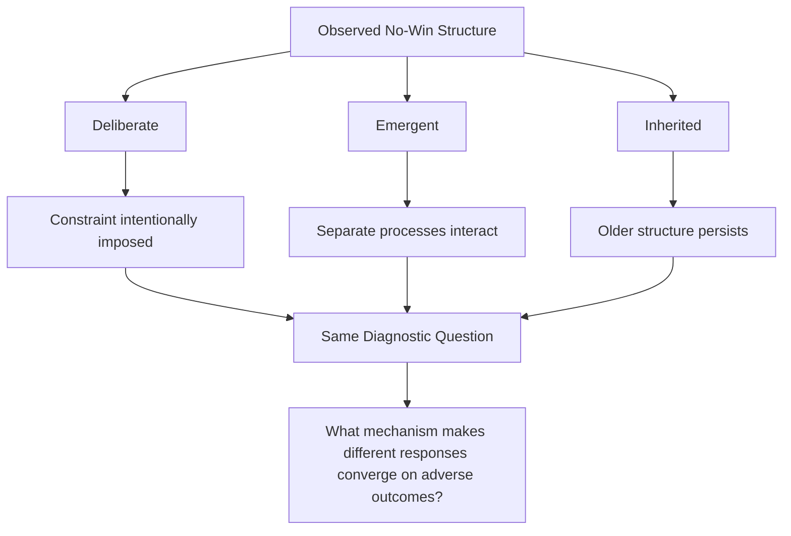
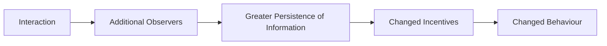
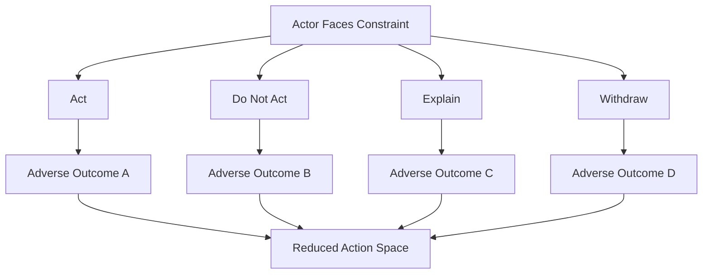
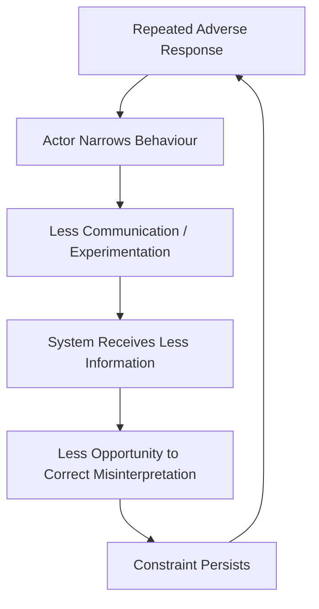
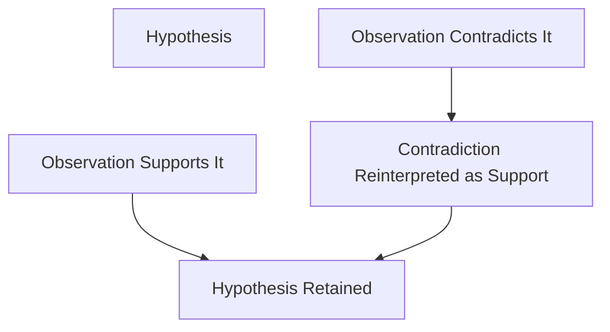
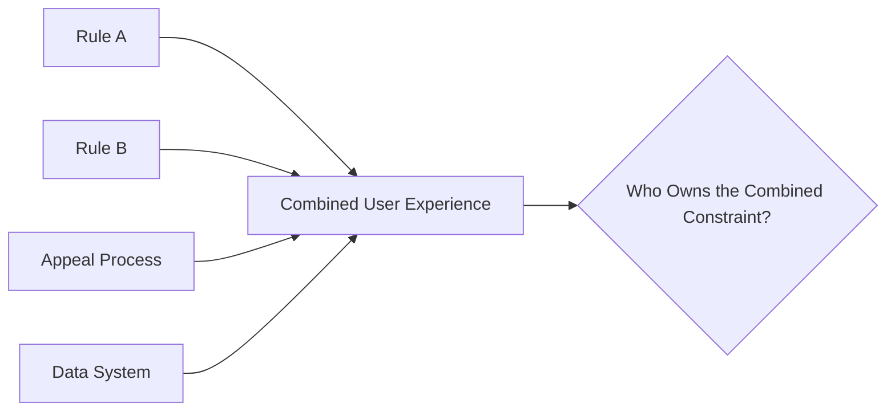

# 🌒 The No-Win Box
**First created:** 2025-11-16 | **Last updated:** 2026-08-14  
*When different available responses begin converging on adverse outcomes.*

---

## 🛰️ Orientation

The **No-Win Box** describes a structural condition in which materially different reasonable responses repeatedly produce significant costs.

A simplified version looks like this:

```text
act
→ cost

do not act
→ cost

explain
→ cost

withdraw
→ cost
```

The important feature is **convergence**.

Different choices do not necessarily produce identical outcomes.

Rather, the available action space becomes increasingly constrained because each route carries a substantial disadvantage.

This node began with a more specific interaction pattern: what can happen when increased transparency, narrative consistency, external visibility and autonomy alter a previously asymmetric relationship. In that setting, behaviours which once preserved influence may become less effective or more observable.

That remains one useful application.

But the governance concept is broader.

A No-Win Box may be:

- deliberately imposed;
- produced unintentionally by interacting systems;
- inherited from an earlier arrangement;
- or perceived where the evidence does not ultimately establish a genuine structural constraint.

The first analytical task is therefore not:

> **Who built the box?**

It is:

> **Is there actually a box?**

---

## 📦 1. What Counts as a No-Win Box?

Not every difficult decision qualifies.

Ordinary life contains:

- trade-offs;
- uncertainty;
- conflicting priorities;
- bad options;
- irreversible choices.

A No-Win Box requires something more structured.

Look for:

1. **Materially different available responses.**
2. **Repeated adverse consequences across those responses.**
3. **A mechanism connecting the responses to those consequences.**
4. **Limited practical routes for escaping or correcting the constraint.**

So:

```text
difficult choice
≠
No-Win Box
```

and:

```text
one bad outcome
≠
No-Win Box
```

The concept becomes useful when the constraint is reproducible enough to map.

---

## 🧪 2. Establish the Box Before Explaining It

A coherent interpretation is not evidence that every proposed mechanism occurred.

The sequence should therefore be:

```text
observe
↓
compare
↓
establish constraint
↓
identify mechanism
↓
test alternative explanations
↓
only then consider attribution
```

For example:

```text
A speaks
→ adverse interpretation

A remains silent
→ different adverse interpretation
```

may indicate a double bind.

But it does not by itself establish:

- deliberate coercion;
- surveillance;
- malicious intent;
- coordinated actors;
- or a strategy designed around A.

Those require additional evidence.

The No-Win Box describes the **structure of available choices** before it describes the intentions of anybody involved.

---

## 🌗 3. Three Ways a Box Can Form

A useful governance distinction is between **deliberate**, **emergent**, and **inherited** constraint.



### Deliberate

There is evidence that an actor intentionally creates or maintains contradictory demands.

For example:

```text
comply with A
→ punished for violating B

comply with B
→ punished for violating A
```

Intent must be evidenced rather than inferred from the existence of the contradiction.

### Emergent

Nobody needs to design the box.

Two individually intelligible systems may create one together.

```text
System A requires disclosure
+
System B penalises disclosure
=
constrained actor
```

Each system can appear internally coherent while their interaction produces an externally incoherent choice environment.

### Inherited

Nobody currently operating the system may have designed the constraint.

It may persist because:

- policy accumulated historically;
- responsibilities changed;
- technologies changed;
- organisations merged;
- exceptions became permanent;
- or nobody owns the combined outcome.

The box survives its architect.

---

## 🧿 4. Transparency Changes the Information Environment

Documentation can reduce ambiguity.

Consistency can make comparison easier.

External visibility can increase the number of observers.

```text
private interaction
→ fewer independent reference points

documented interaction
→ more persistent reference points
```

This does not guarantee that observers will interpret events correctly.

Documentation can be:

- incomplete;
- selectively presented;
- misunderstood;
- contradictory;
- or context-dependent.

But it changes the information architecture.

Statements and actions become easier to compare across time.

---

## 🪞 5. Consistency Creates Contrast

Where one participant behaves consistently and another changes position repeatedly, the contrast may become informative.

But:

```text
inconsistency
≠
culpability
```

People change behaviour for many reasons.

New information may emerge.

Circumstances may change.

Fear, uncertainty, legal advice or simple error may produce variation.

Consistency is therefore useful as **telemetry**, not verdict.

The question is:

> **What explains the change, and does the explanation fit the evidence?**

---

## 👁️ 6. Visibility Changes Available Behaviour

External observation can alter interaction dynamics.

This is a basic observability effect.



Again, the direction is not predetermined.

Visibility can:

- deter misconduct;
- encourage procedural behaviour;
- improve accountability;
- create performative behaviour;
- increase reputational pressure;
- produce defensive decision-making;
- or distort behaviour through fear of misinterpretation.

So:

> **Visibility changes the control environment; it does not automatically reveal truth.**

---

## 🌱 7. Autonomy Changes Dependency

The source node describes increased autonomy as potentially disrupting relationships that previously relied upon dependency or asymmetric access.

That mechanism is worth preserving.

```text
greater dependency
→ fewer exit options

greater autonomy
→ more exit options
```

Where influence depended upon controlling:

- access;
- information;
- resources;
- communication;
- interpretation;
- or institutional routes,

greater autonomy can change the balance.

But again, we should distinguish:

```text
relationship changed after autonomy increased
```

from:

```text
other actor attempted to regain control
```

The second proposition requires evidence about conduct and intent.

---

## 🔥 8. Response Trade-Offs

The original node identifies four broad response categories: escalation, withdrawal, indirect engagement and apparent neutrality.

They remain useful if described without assuming motive.

### A. Increased Engagement

Increasing the intensity or frequency of response may:

- create additional observable information;
- increase involvement;
- heighten conflict;
- or clarify the actor's position.

### B. Withdrawal or Silence

Reducing engagement may:

- reduce immediate conflict;
- decrease influence;
- preserve uncertainty;
- or allow other interpretations to dominate.

### C. Indirect Engagement

Using intermediaries or less direct channels may:

- reduce immediate exposure;
- fragment communication;
- complicate attribution;
- or create additional ambiguity.

### D. Apparent Neutrality

Maintaining a deliberately low-profile or procedural position may:

- stabilise the interaction;
- reduce available information about intent;
- appear inconsistent with earlier behaviour;
- or simply represent genuine disengagement.

None of these behaviours has a fixed meaning.

The analytical question is whether **different responses repeatedly converge on disadvantage**.

---

## 🌑 9. The Core Paradox

A No-Win Box can produce something like:



The outcomes need not be equally serious.

Nor does the box need to be absolute.

There may still be:

- least-bad choices;
- delayed exits;
- appeal routes;
- outside intervention;
- procedural safeguards;
- or opportunities to change the environment.

A No-Win Box is therefore better understood as a **compression of viable action space** than literal impossibility.

---

## 🗜️ 10. Behavioural Compression

Repeated exposure to converging penalties can alter behaviour.

A person or organisation may learn:

```text
trying something new
→ risk

explaining
→ risk

challenging
→ risk

withdrawing
→ risk
```

One possible adaptation is **behavioural compression**:

- fewer actions;
- shorter communication;
- reduced experimentation;
- greater proceduralism;
- avoidance;
- withdrawal;
- rigid documentation;
- reduced trust.

That adaptation can be rational within the observed environment.

But it creates another problem.

The system now receives less behavioural variation.

---

## ♻️ 11. The Box Can Damage the Sensor

This creates a cybernetic feedback problem.



A system can therefore reinforce its own uncertainty.

If every available response appears dangerous, the affected actor may generate progressively less information.

The institution may then interpret the resulting silence as additional evidence.

That is a particularly dangerous loop.

```text
constraint
→ withdrawal
→ reduced observability
→ stronger inference
→ stronger constraint
```

---

## 🧠 12. Interpretation Is Part of the Box

No-Win structures are not always created by formal rules.

They can also emerge through interpretation.

For example:

```text
speaks frequently
→ "obsessive"

speaks rarely
→ "evasive"
```

or:

```text
shows emotion
→ "unstable"

shows little emotion
→ "unaffected"
```

The important analytical point is not whether either example occurred in a particular case.

It is that **interpretive frameworks can create converging classifications from contradictory behaviours**.

That should trigger a diagnostic question:

> **What observation could falsify the classification?**

If the answer is *none*, the interpretive system may have become self-sealing.

---

## 🔒 13. Self-Sealing Models

A model becomes dangerous when every possible observation confirms it.

```text
A
→ confirms hypothesis

not-A
→ also confirms hypothesis
```

That is not robust inference.

It is a closed interpretive system.



A healthy decision system needs conceivable disconfirming evidence.

Otherwise:

> **The person is no longer interacting with a testable rule. They are interacting with an interpretation that owns every exit.**

---

## ⚖️ 14. Procedural No-Win Boxes

Institutions can create boxes without intending to.

For example:

```text
must exhaust internal process
→ external route unavailable yet

internal process delayed indefinitely
→ external route remains unavailable
```

Or:

```text
must provide evidence to challenge record
→ evidence held by institution

institution requires successful challenge
→ before evidence is released
```

These examples are schematic, not claims about any particular legal or administrative regime.

They illustrate a governance problem:

> **individually defensible procedural requirements can combine into an inaccessible remedy.**

This is why whole-process testing matters.

---

## 👑 15. Ownership of the Combined Outcome

Emergent boxes create an especially difficult ownership problem.

Imagine:

```text
Department A owns Rule A
Department B owns Rule B
Regulator C owns appeals
Contractor D owns the data
```

Each actor may reasonably say:

> **That part is outside our remit.**

But the affected person experiences:

```text
A + B + C + D
```

as one system.

Who owns that combined outcome?



This is why the No-Win Box belongs inside **Ownership & Control**.

The absence of a malicious architect does not remove the need for a custodian.

---

## 🛠️ 16. Opening the Box

A governance response should not begin by telling the constrained actor to make better choices.

If the structure is real, the available choices are the problem.

Useful interventions instead change the architecture.

These can include:

- independent review;
- explicit escalation;
- contradictory-rule testing;
- access to records;
- transparent decision criteria;
- time limits;
- appeal routes;
- named integration ownership;
- review by somebody outside the original interpretive frame;
- and identification of evidence capable of changing the decision.

The aim is to restore **meaningful variation in possible outcomes**.

```text
different reasonable actions
→
different intelligible consequences
```

That is what an open action space looks like.

---

## 🌱 17. Why This Matters for Survivors

The source node is explicitly survivor-facing.

That purpose should remain.

Recognising a possible No-Win Box can help a survivor separate two questions:

1. **What action is safest or most useful for me?**
2. **What does the other party's response prove?**

Those are not the same question.

Documentation and consistency can be useful because they preserve information.

But they do not guarantee:

- vindication;
- safety;
- correct interpretation;
- or a particular response from institutions.

Likewise, another person's:

- escalation;
- withdrawal;
- inconsistency;
- silence;
- or apparent neutrality

should not automatically be interpreted as proof of motive.

The useful insight is structural:

> **If the interaction repeatedly makes reasonable choices costly, the problem may lie partly in the choice environment rather than in the actor's inability to choose correctly.**

---

## 🧭 18. Attribution Discipline

When analysing a possible box, separate five propositions.

| Proposition | Evidential question |
|---|---|
| **Constraint** | Do materially different reasonable actions produce adverse outcomes? |
| **Mechanism** | What causes those outcomes? |
| **Persistence** | Why does the pattern continue? |
| **Agency** | Which actors materially contribute to it? |
| **Intent** | Is there evidence anybody deliberately created or maintained it? |

Do not jump from the first row to the fifth.

```text
pattern
≠
mechanism

mechanism
≠
agency

agency
≠
intent
```

This preserves the usefulness of the model without turning it into an attribution machine.

---

## 🧠 19. The Cybernetic Principle

A functioning control system requires meaningful feedback.

If all outputs are interpreted identically, feedback loses information.

```text
response A → same classification
response B → same classification
response C → same classification
```

The system is no longer learning much from the responses.

It is reproducing its prior model.

That gives the No-Win Box its cybernetic significance:

> **A system becomes epistemically brittle when materially different inputs cannot produce materially different interpretations.**

The problem is not merely unfairness to the person inside the box.

The system itself loses corrective capacity.

---

## 👑 Ownership & Control Implication

The No-Win Box exposes a distinction central to this folder:

```text
ownership of individual rules
≠
ownership of their combined effect
```

A constraint can therefore persist even when:

- every component has an owner;
- every actor has a remit;
- every procedure has a rationale;
- and nobody intended the final outcome.

That is an ownership failure at the level of integration.

The governance question becomes:

> **Who has both the visibility and authority to recognise that individually defensible controls have combined into an indefensible choice environment?**

And then:

> **Who can open the box?**

---

## 🧭 Diagnostic Questions

- What are the materially different available actions?
- What consequence follows each?
- Are those consequences actually evidenced?
- Is the pattern repeated?
- How serious are the trade-offs?
- Is there a genuine constraint or merely a difficult decision?
- What mechanism connects each action to its outcome?
- What alternative explanations fit the pattern?
- Is the box deliberate, emergent or inherited?
- What evidence supports any claim of intent?
- Are multiple systems producing the combined constraint?
- Who can see the whole interaction?
- Who owns the combined outcome?
- Is there an appeal or external review route?
- What evidence could falsify the current interpretation?
- Does contradictory behaviour produce contradictory conclusions, or is everything being assimilated into one model?
- Has repeated penalty produced behavioural compression?
- Is reduced communication then being interpreted adversely?
- Can the system restore meaningful differences between available choices?

Most importantly:

> **What would have to change for a reasonable action to produce a genuinely different outcome?**

---

## 🌌 Constellations

🌒 👑 ♻️ 🧿 🗜️ — constrained action spaces; behavioural compression; attribution discipline; self-sealing interpretation; integrated outcome ownership.

---

## ✨ Stardust

no-win box, double bind, constrained action space, behavioural compression, autonomy dynamics, transparency, observability, narrative asymmetry, attribution discipline, self-sealing models, procedural constraint, emergent constraint, inherited constraint, integrated outcome ownership, survivor sovereignty, feedback failure

---

## 🏮 Footer

*🌒 The No-Win Box* is a living node of the **Polaris Protocol**.

It began as a model of the interaction constraints that can emerge when transparency, autonomy, consistency and external visibility alter an asymmetric relationship. That original application remains part of the node.

The broader governance model does not presume hostile intent.

A No-Win Box may be deliberately constructed, emerge from interacting systems, or persist as an inherited structure. Its existence should be established from the choice architecture before motive or authorship is inferred.

Its governing principles are:

> **Establish the box before explaining who built it.**
>
> **Different reasonable actions should be capable of producing meaningfully different interpretations and outcomes.**
>
> **Ownership of every component does not guarantee ownership of the combined constraint.**

And its central governance question is:

> **Who can open the box?**

> 📡 Cross-references:
>
> - [✈️ Who Wants These Creeps in Charge?](./✈️_who_wants_these_creeps_in_charge.md) — *dependency and accountability friction*
> - [✈️ Genocides and Paedophiles](./✈️_genocides_and_paedophiles.md) — *accountability under expanding institutional exposure*
> - [🍉 British Democracy Needs You](./🍉_british_democracy_needs_you.md) — *feedback quality and institutional interpretation*
> - [🌅 Rise of Institutional Integrity](./🌅_rise_of_institutional_integrity.md)
> - [🐼 The Metropolitan Rabble](./🐼_the_metropolitan_rabble.md)
> - [🗣️ Voice Laundering](../../../../Metadata_Sabotage_Network/Narrative_And_Psych_Ops/🪆_Narrative_Interference/🗣️_voice_laundering.md)
>
> 🏮 Return To:
>
> - [👑 Ownership & Control](./README.md) — *1up*
> - [♻️ Cybernetics](../README.md) — *2up*
> - [🪿 Embodied Information Ecology](../../README.md) — *3up*
> - [🌑 Origin Points](../../../README.md) — *4up*
> - [🌌 Polaris Protocol — Root](../../../../README.md) — *root*

*Survivor authorship is sovereign. Containment is never neutral.*

_Last updated: 2026-08-14_
