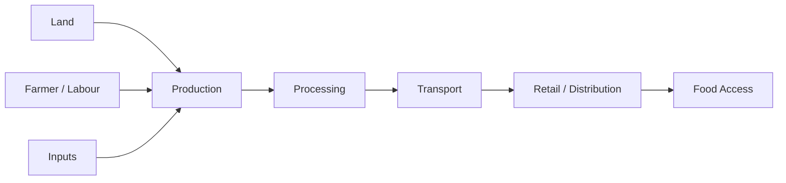
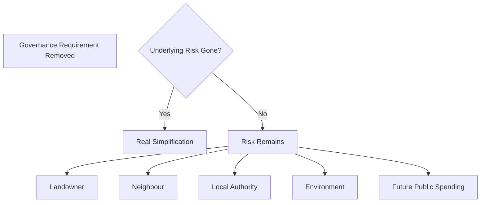
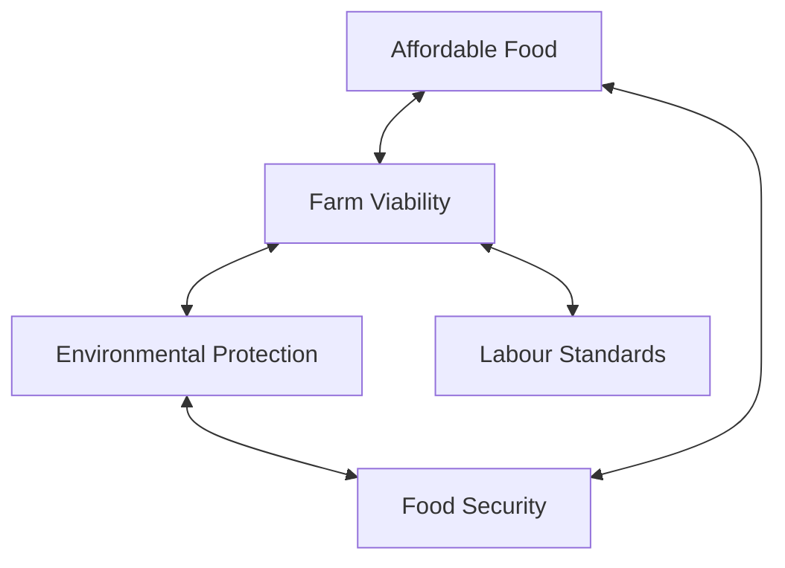
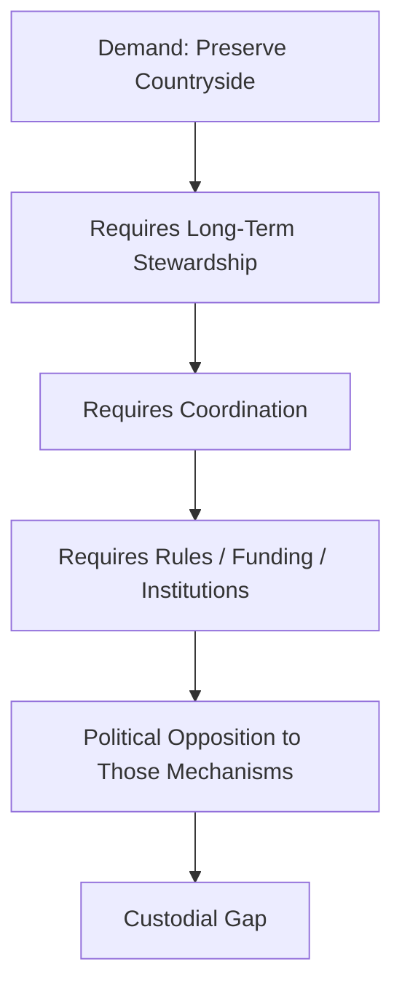
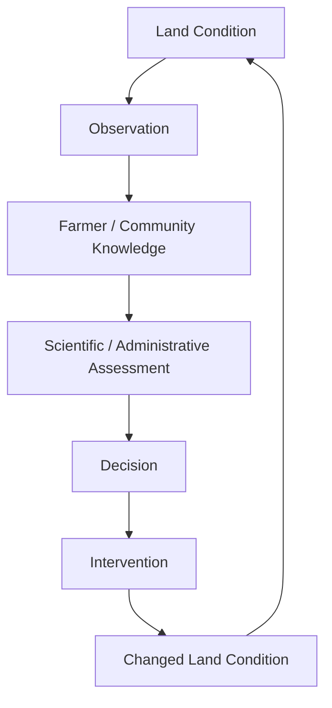

# 🌳 The Lads Are Not Pro-Countryside
**First created:** 2025-10-08 | **Last updated:** 2026-08-14  
*Loving the picture is not the same thing as maintaining the landscape.*

---

## 🛰️ Orientation

“The countryside” is often invoked as though it were a naturally self-maintaining object.

It is not.

Rural landscapes are living systems shaped by overlapping forms of:

- agriculture;
- land ownership;
- tenancy;
- water management;
- forestry;
- conservation;
- planning;
- infrastructure;
- public access;
- food production;
- housing;
- labour;
- subsidy;
- and environmental regulation.

They require custody.

This matters because some political rhetoric presents itself as strongly **pro-countryside** while simultaneously opposing parts of the governance architecture through which countryside is actually maintained.

That does not mean every criticism of:

- planning;
- environmental regulation;
- agricultural subsidy;
- conservation policy;
- access rules;
- or rural bureaucracy

is anti-countryside.

Some regulation is badly designed.

Some administrative requirements impose disproportionate burdens.

Some rural communities have good reason to distrust decisions made far away by people with limited understanding of local conditions.

The useful distinction is therefore not:

```text
regulation
=
good

deregulation
=
bad
```

It is:

> **Which forms of governance allow land, food, communities and ecosystems to remain viable over time?**

---

## 🖼️ 1. The Countryside as Image

Political rhetoric can turn countryside into a visual object.

The image contains:

- hedgerows;
- stone walls;
- village pubs;
- church towers;
- tractors;
- grazing animals;
- footpaths;
- woodland;
- fields.

What disappears from the picture is the work.

```text
countryside as image
≠
countryside as operating system
```

The landscape exists because somebody:

- repairs the wall;
- cuts the hedge;
- clears the ditch;
- manages the soil;
- maintains the path;
- monitors livestock;
- treats disease;
- manages water;
- repairs infrastructure;
- negotiates access;
- and pays for all of it.

The countryside is not scenery with farmers sprinkled on top.

It is an inhabited production and ecological system.

---

## 👑 2. Custodianship Is More Than Ownership

Ownership answers one question:

> **Who holds title?**

Custodianship asks several more.

- Who maintains the land?
- Who absorbs long-term costs?
- Who monitors deterioration?
- Who protects productive capacity?
- Who manages competing uses?
- Who preserves ecological function?
- Who maintains public infrastructure?
- Who carries knowledge between generations?

These functions may be distributed across:

- landowners;
- tenant farmers;
- farm workers;
- local authorities;
- drainage bodies;
- utilities;
- conservation organisations;
- government agencies;
- contractors;
- residents;
- and community groups.

So:

```text
land ownership
≠
land stewardship
```

And:

```text
political identification with countryside
≠
custodial responsibility for countryside
```

---

## 🌾 3. Food Production Is Infrastructure

Agricultural land is not merely aesthetic space.

It participates in food systems.

That means decisions concerning:

- soil;
- water;
- transport;
- labour;
- veterinary capacity;
- storage;
- energy;
- imports;
- exports;
- processing;
- and farm viability

can have effects well beyond the individual field.



A resilient countryside therefore cannot be governed solely as:

- property;
- scenery;
- investment;
- heritage;
- or leisure space.

It is also productive infrastructure.

---

## 🧱 4. Regulation Has a Job

Rural regulation can become:

- cumbersome;
- duplicated;
- expensive;
- poorly communicated;
- badly sequenced;
- or insensitive to local conditions.

Those are legitimate governance problems.

But the existence of bad regulation does not establish that the underlying function is unnecessary.

Regulation may be attempting to manage:

- water pollution;
- soil degradation;
- animal disease;
- pesticide use;
- building safety;
- land conversion;
- habitat destruction;
- public access;
- flood risk;
- waste;
- food safety;
- or conflicts between neighbouring land uses.

The useful test is therefore:

```text
What function is this rule trying to perform?
        ↓
Is that function necessary?
        ↓
Does this rule perform it effectively?
        ↓
Can the burden be reduced without losing the function?
```

That is different from treating regulation itself as the enemy.

---

## 🔧 5. Deregulation Can Move the Work Rather Than Remove It

Removing a rule does not necessarily remove the underlying problem.

Sometimes it merely changes who must absorb it.



This is a recurring systems problem.

```text
removing the administrative cost
≠
removing the physical cost
```

If a ditch is not maintained, the water still goes somewhere.

If soil degrades, the loss still occurs.

If veterinary surveillance disappears, disease does not become less biological.

If planning coordination disappears, incompatible uses do not become compatible.

The cost may simply leave the spreadsheet before reappearing somewhere else.

---

## 🐄 6. Farmers Are Not Landscape Props

Political narratives sometimes invoke “farmers” as a single symbolic constituency.

Actual agriculture is much less tidy.

Farmers differ by:

- region;
- land tenure;
- farm size;
- sector;
- income;
- debt;
- ownership structure;
- supply-chain position;
- labour model;
- environmental conditions;
- and succession prospects.

A tenant livestock farmer, a large arable landowner and a diversified estate may have profoundly different interests.

So this node should resist:

```text
farmers think X
```

unless evidence actually supports it.

The governance question is instead:

> **Which rural actors bear which costs, possess which powers, and receive which benefits?**

---

## 💷 7. Cheap Food Has a Custody Problem

Food policy creates another uncomfortable triangle.

The public may reasonably want:

- affordable food;
- high animal-welfare standards;
- environmental protection;
- secure domestic production;
- decent agricultural wages;
- resilient farms.

Those objectives can conflict.



Pretending there is no trade-off does not remove it.

Somebody eventually pays through:

- retail prices;
- taxation;
- lower producer margins;
- lower wages;
- environmental degradation;
- import dependence;
- or future remediation.

Good governance makes the trade-off visible.

---

## 🏡 8. Rural Communities Need More Than Preservation

A countryside preserved only as scenery can become difficult to inhabit.

Rural communities also require:

- housing;
- transport;
- schools;
- healthcare;
- broadband;
- employment;
- energy;
- shops;
- social infrastructure.

That creates genuine planning tensions.

```text
preserve everything
→
community can become economically brittle

develop everything
→
landscape and ecological function can be lost
```

The problem is therefore not solved by choosing **development** or **preservation** as universal principles.

It requires stewardship capable of negotiating both.

---

## 🌳 9. Trees Are Infrastructure Too

Woodland can provide:

- habitat;
- carbon storage;
- shade;
- timber;
- recreation;
- water management;
- soil stabilisation;
- landscape continuity.

But woodland also requires management.

Different sites require different approaches.

So:

```text
more trees
≠
automatically better land governance
```

and:

```text
tree removal
≠
automatically ecological destruction
```

The relevant questions concern:

- species;
- location;
- age;
- purpose;
- ecological context;
- replacement;
- disease;
- land use;
- and long-term management.

Again, custodianship beats symbolism.

---

## 🚜 10. The Anti-Governance Countryside Paradox

A particular political contradiction appears when rhetoric simultaneously demands:

> protect the countryside

while rejecting many of the mechanisms required to coordinate its protection.

The contradiction is not universal.

Nor should it be attributed indiscriminately to every conservative, populist, libertarian or rural political movement.

It should be tested claim by claim.

But where it occurs, the structure looks like this:



This is the node's central provocation.

> **You cannot sustainably defend the countryside while treating every mechanism of collective custody as illegitimate.**

---

## 🧿 11. Aesthetic Attachment Is Not Systems Knowledge

People can sincerely love countryside while misunderstanding how it functions.

That is not unusual.

Complex systems frequently look simpler from outside than they are.

A field may conceal:

- drainage;
- subsidy;
- tenancy;
- soil management;
- water regulation;
- labour;
- machinery finance;
- insurance;
- disease control;
- planning;
- ecological obligations.

The visible landscape is the system's interface.

The machinery is underneath.

```text
what the countryside looks like
≠
what keeps the countryside working
```

This is why rural governance benefits from people with:

- local knowledge;
- agricultural knowledge;
- ecological knowledge;
- engineering knowledge;
- administrative knowledge;
- and lived experience.

No single one is sufficient.

---

## ♻️ 12. The Countryside as a Control System

A functioning rural system contains feedback.



Problems emerge when:

- observations cannot travel;
- local knowledge is ignored;
- scientific knowledge is inaccessible;
- rules cannot adapt;
- incentives reward short-term extraction;
- funding does not reach required interventions;
- or nobody owns the handoff between knowledge and action.

The countryside therefore belongs naturally inside cybernetics.

It is an embodied feedback environment.

---

## 👑 13. Ownership Without Stewardship

Ownership can produce authority without guaranteeing good custody.

A landowner may possess substantial rights over an asset while:

- costs fall elsewhere;
- environmental effects cross boundaries;
- infrastructure serves multiple users;
- or decisions affect future generations.

Conversely, people without legal title may perform substantial custodial labour.

```text
title
≠
total control

control
≠
total consequence

consequence
≠
formal ownership
```

That is why rural governance requires mechanisms capable of coordinating interests across property boundaries.

Water does not respect title plans.

Wildlife does not read the Land Registry.

Disease does not stop at the farm gate.

---

## 🪞 14. The Countryside Test

Political claims to be “pro-countryside” can therefore be tested rather than accepted or rejected as identity statements.

Ask:

| Claim | Custodial test |
|---|---|
| Protect farming | Can farms remain economically and operationally viable? |
| Protect landscape | Who maintains it, and who pays? |
| Cut regulation | Which function disappears, and where does the risk move? |
| Protect villages | Can people afford to live and work there? |
| Protect food security | Does productive capacity survive? |
| Protect nature | Are ecological systems actually improving? |
| Support landowners | What happens to tenants, workers and neighbouring communities? |
| Defend rural freedom | Who absorbs cross-boundary harms? |

This converts symbolism into governance.

---

## 🌾 15. The Lads

So who are **the lads**?

Not every rural conservative.

Not every farmer.

Not every person who dislikes environmental regulation.

Not every voter angry about planning.

Not a single coherent political faction.

The term is deliberately satirical.

It refers to a recurring political posture:

> **intense symbolic attachment to countryside combined with hostility toward the mundane systems required to maintain it.**

The lads love:

- the hedge;

but perhaps not:

- the hedge-management plan.

They love:

- the village;

but perhaps not:

- the affordable housing decision.

They love:

- British farming;

but perhaps not:

- the veterinary surveillance system.

They love:

- the river;

but perhaps not:

- the regulatory machinery dealing with what gets discharged into it.

This is not hypocrisy by definition.

Sometimes the underlying governance mechanism really is defective.

The question is whether the proposed alternative still performs the necessary custodial function.

---

## 🧠 16. The Cybernetic Principle

The countryside is a useful antidote to an excessively abstract idea of governance.

Feedback here becomes physical.

Bad information becomes:

- polluted water;
- degraded soil;
- empty farms;
- flooded roads;
- lost habitat;
- food shortages;
- abandoned buildings.

Good stewardship also becomes physical.

It appears as:

- maintained hedges;
- productive soil;
- functioning drainage;
- viable farms;
- healthy ecosystems;
- inhabited villages;
- resilient food networks.

The cybernetic principle is therefore simple:

> **You do not preserve a system by preserving its appearance.**

You preserve it by maintaining the feedback, labour, resources and institutions that allow it to remain alive.

---

## 🧭 Diagnostic Questions

- What countryside function are we trying to preserve?
- Who currently performs that function?
- Who pays for it?
- Who benefits?
- Who bears external costs?
- Is a regulation unnecessary, or merely inconvenient?
- If a rule disappears, does the underlying risk disappear too?
- Where does the cost move?
- Are local knowledge and technical expertise both reaching decisions?
- Does the system reward long-term stewardship?
- Can rural communities remain inhabited rather than merely picturesque?
- Are food-production and ecological objectives being considered together?
- Who owns cross-boundary problems such as water, disease or habitat?
- Is political rhetoric describing an operating rural system or an aesthetic image of one?
- Does the proposed alternative actually maintain the function being criticised?

Most importantly:

> **Who is prepared to do the boring work required to keep the beautiful thing beautiful?**

---

## 🌌 Constellations

🌳 👑 🌾 ♻️ 🧿 — rural stewardship; land ownership; food infrastructure; ecological feedback; custodial governance.

---

## ✨ Stardust

countryside governance, rural stewardship, land ownership, custodianship, agricultural infrastructure, food security, planning, environmental regulation, rural communities, deregulation, externalised cost, farm viability, systems thinking, ecological feedback, land management, rural resilience, aesthetic politics

---

## 🏮 Footer

*🌳 The Lads Are Not Pro-Countryside* is a living node of the **Polaris Protocol**.

Its title is satirical, not a claim that any single political constituency holds a uniform view of rural governance.

The node distinguishes attachment to countryside as symbol from custody of countryside as a living agricultural, ecological and social system. It does not assume that existing regulation is good merely because it exists, nor that opposition to regulation is inherently anti-rural.

Instead it asks whether proposed governance arrangements preserve the functions required for countryside to remain productive, inhabited, ecologically viable and resilient.

Its governing distinction is:

> **Loving the picture is not the same thing as maintaining the landscape.**

And its governing question is:

> **Who is prepared to do the boring work required to keep the beautiful thing beautiful?**

> 📡 Cross-references:
>
> - [🏛️ R.A.A.C. — Ruins and Architectural Committee](./🏛️_raac_ruins_squad.md) — *maintenance custody and physical systems*
> - [⛪️ Faith Land Trusts as Counter-Radicalisation Infrastructure](./⛪️_faith_land_trusts_as_counter-radicalisation_infrastructure.md) — *custodianship and community-scale ownership*
> - [🕳️ The Pothole Problem](./🕳️_the_pothole_problem.md) — *maintenance as governance telemetry*
>
> 🏮 Return To:
>
> - [👑 Ownership & Control](./README.md) — *1up*
> - [♻️ Cybernetics](../README.md) — *2up*
> - [🪿 Embodied Information Ecology](../../README.md) — *3up*
> - [🌑 Origin Points](../../../README.md) — *4up*
> - [🌌 Polaris Protocol — Root](../../../../README.md) — *root*

*Survivor authorship is sovereign. Containment is never neutral.*

_Last updated: 2026-08-14_
