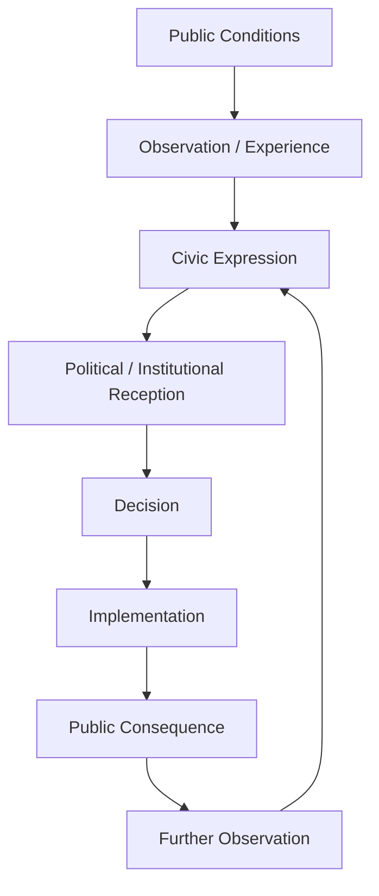
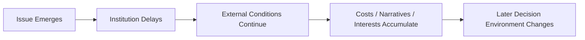
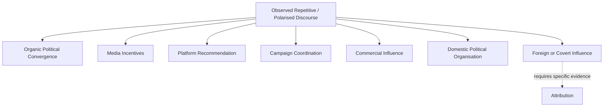
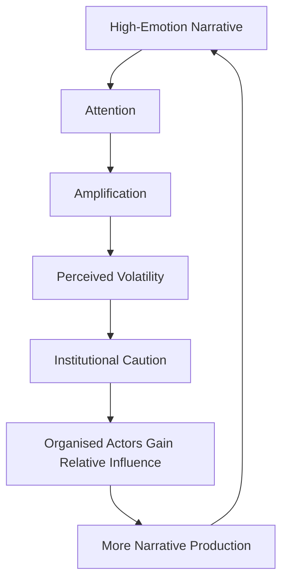
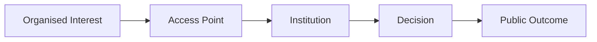
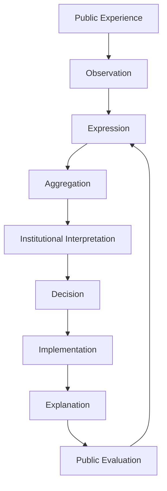
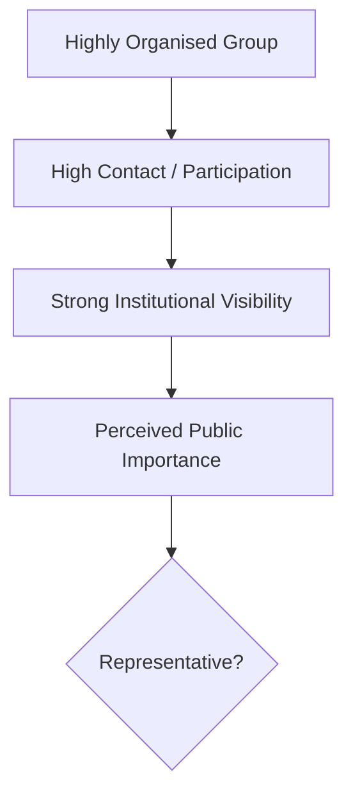

# 🍉 British Democracy Needs You
**First created:** 2025-12-23 | **Last updated:** 2026-08-14  
*Democracy is not self-driving. If we do not maintain its feedback loops, organised pressure will fill the space.*

---

## 🛰️ Orientation

Democracy does not fail only through coups.

It can also weaken through quieter processes:

- public withdrawal;
- institutional hesitation;
- weak scrutiny;
- fragmented responsibility;
- declining participation;
- concentrated influence;
- and repeated failure to convert public knowledge into accountable action.

When problems involving:

- water;
- land;
- data;
- broadcasting;
- migration;
- welfare;
- planning;
- protest;
- infrastructure;
- or civil liberties

come to feel like **someone else's job**, the decision-making space does not remain empty.

Other actors may be better organised.

They may include:

- lobbyists;
- campaign groups;
- wealthy interests;
- political parties;
- media organisations;
- organised online communities;
- external funders;
- industry bodies;
- civil-society organisations;
- and state or non-state influence operations where evidence establishes them.

The problem is not that organised political influence exists.

Democracy requires organised political influence.

The problem arises when participation and scrutiny become so uneven that only some actors remain capable of persistently shaping the system.

The governing proposition is therefore:

> **Democracy requires distributed custodianship strong enough to prevent public authority from becoming responsive only to the actors with the greatest persistence, money, access, or organisational capacity.**

---

## 👑 1. Democracy Is a Custodial System

Voting matters.

But democracy cannot be reduced to voting.

A democratic system also depends upon:

- public scrutiny;
- institutional accountability;
- civic participation;
- journalism;
- organised interests;
- representative bodies;
- consultation;
- legal challenge;
- peaceful protest;
- local government;
- professional expertise;
- and ordinary citizens continuing to pay attention.

These functions form part of a wider control system.



Democracy becomes brittle when one or more of those transitions stops working.

---

## 🧿 2. The Hesitation Problem

Public institutions frequently operate under competing pressures.

They may need to consider:

- law;
- evidence;
- public opinion;
- political direction;
- operational capacity;
- equality duties;
- financial constraints;
- reputational risk;
- security;
- competing rights;
- and uncertainty.

So hesitation is not automatically failure.

Sometimes hesitation is prudence.

Sometimes delay is required for:

- consultation;
- investigation;
- legal advice;
- evidence gathering;
- or procedural fairness.

The governance question is therefore not:

> **Why did the institution hesitate?**

It is:

> **What information was missing, what risk was being managed, and did the delay remain proportionate to that reason?**

---

## ⏳ 3. Hesitation Can Still Change the System

Even legitimate delay has effects.

```text
decision delayed
≠
system remains unchanged
```

While an institution waits:

- a narrative may consolidate;
- a market may move;
- a planning decision may become harder to reverse;
- affected people may bear continued harm;
- political coalitions may reorganise;
- evidence may disappear;
- public confidence may decline.

This means delay is itself part of the feedback environment.



So:

> **Hesitation is not necessarily wrongful, but it is never consequence-free.**

---

## 🧠 4. Manufactured Division Needs Evidence

Public discourse can display patterns such as:

- repetitive talking points;
- coordinated posting;
- highly standardised language;
- rapid amplification;
- low-information hostility;
- emotionally charged repetition;
- cross-platform synchronisation;
- or apparent issue migration.

Those patterns can arise from several mechanisms.



The correct analytical rule is:

> **Observed coordination effects do not establish the identity, motive, or even existence of a single coordinating actor.**

So this node should avoid turning:

```text
discourse looks coordinated
```

into:

```text
division was deliberately manufactured
```

without supporting evidence.

---

## 🕸️ 5. Narrative Capture Without Conspiracy

A public-information environment can become distorted without anybody controlling the whole thing.

Consider:

```text
high-emotion content
→ greater attention
→ greater amplification
→ institutional perception of volatility
→ greater caution
→ more space for organised actors
```



No central planner is required.

The feedback loop can produce **narrative capture as an emergent condition**.

Intentional manipulation can exist inside that environment.

It should be demonstrated separately.

---

## 🧱 6. Public Withdrawal Creates Relative Power

A democracy does not need every citizen to participate constantly.

But participation is relational.

If one part of the public withdraws while another remains highly organised, relative influence changes.

```text
less participation by A
+
same participation by B
=
greater relative influence for B
```

That can happen through:

- consultation responses;
- lobbying;
- campaign donations;
- local meetings;
- professional networks;
- trade associations;
- media access;
- legal intervention;
- organised activism;
- or sustained correspondence.

This is not inherently illegitimate.

Organised groups are part of democratic life.

The issue is whether the system remains sufficiently plural that one form of organised capacity cannot quietly substitute for broad democratic consent.

---

## 🌊 7. Influence Flows Toward Available Interfaces

“Influence fills a vacuum” is useful metaphorically, but the mechanism needs precision.

Influence does not literally flow into empty democratic space.

It travels through interfaces.

These can include:

- ministers;
- MPs;
- civil servants;
- consultations;
- regulators;
- procurement;
- party structures;
- media;
- think tanks;
- professional associations;
- courts;
- local government;
- public campaigns.



The relevant governance question is:

> **Who has reliable access to which interfaces?**

---

## 💷 8. Money Is One Form of Organisational Capacity

Financial resources matter.

They can support:

- research;
- legal advice;
- lobbying;
- campaigning;
- communications;
- staff;
- advertising;
- events;
- policy development;
- sustained institutional access.

But money is not the only source of political power.

Other forms include:

- membership;
- expertise;
- legitimacy;
- voter concentration;
- media reach;
- professional authority;
- institutional relationships;
- mobilisation capacity;
- public sympathy.

So:

```text
influence
≠
money alone
```

and:

```text
external funding
≠
illegitimate influence by definition
```

The relevant questions concern:

- transparency;
- provenance;
- scale;
- disclosure;
- conflicts of interest;
- and whether decision-makers remain independently accountable.

---

## 🌍 9. External Influence Is Not One Thing

“External influence” can refer to very different activities.

| Activity | Governance character |
|---|---|
| Foreign government diplomacy | Normal interstate activity |
| International civil-society advocacy | Normal democratic participation |
| Overseas political donations where lawful | Regulated political influence |
| Corporate lobbying by multinational firms | Commercial influence |
| Foreign media activity | Information influence |
| Covert state-directed manipulation | Security concern |
| Undisclosed or unlawful funding | Compliance / enforcement concern |

These should not be collapsed.

A democracy that treats **all foreign connection as suspect** can become as distorted as one that treats covert interference as irrelevant.

The principle is:

> **Classify the mechanism before judging the influence.**

---

## 📡 10. Synthetic Controversy and Real Controversy

Some controversy is artificial.

Some is amplified.

Some is strategically generated.

Some is completely organic.

Some begins organically and is later exploited.

That means institutions should not use online intensity as a simple proxy for public opinion.

```text
volume
≠
representativeness

repetition
≠
independent agreement

virality
≠
democratic mandate
```

Better democratic sensing may require combining:

- polling;
- consultation;
- representative institutions;
- constituency evidence;
- expert input;
- civic organisations;
- longitudinal data;
- and direct engagement.

The answer to distorted signals is not to ignore public discourse.

It is to improve the sensor array.

---

## 🧿 11. Democracy Has an Observability Problem

Public institutions cannot respond well to a population they cannot accurately observe.

But every democratic sensor has limitations.

| Sensor | Useful for | Limitation |
|---|---|---|
| Elections | Formal mandate | Infrequent; bundles many issues |
| Polling | Population attitudes | Sampling and question effects |
| Consultations | Detailed participation | Self-selection |
| Social media | Rapid discourse signals | Highly non-representative |
| Constituency correspondence | Intensity and local concern | Organised campaigns can dominate |
| Journalism | Investigation and agenda-setting | Editorial and commercial selection |
| Protest | Intensity and mobilisation | Does not measure whole-population support |
| Civil society | Expertise and affected-community insight | Organisational representation varies |

No single stream is **the public**.

A healthy system triangulates.

---

## ♻️ 12. The Democratic Feedback Loop

Democracy is strongest when public experience can change governance and governance can demonstrate what changed.



Failure can occur at every point.

For example:

- people cannot express;
- expression is not representative;
- aggregation privileges organised actors;
- institutions misread the signal;
- decisions are opaque;
- implementation diverges from policy;
- explanation is absent;
- feedback never returns.

Democratic health therefore depends upon the **quality of the loop**, not simply the existence of elections.

---

## 🗳️ 13. Participation Is Maintenance

Citizens do not need to become full-time political operatives.

But democracy requires some continuing maintenance.

That can include:

- voting;
- reading beyond headlines;
- contacting representatives;
- responding to consultations;
- joining local organisations;
- supporting journalism;
- attending meetings;
- joining unions or professional bodies;
- participating in lawful protest;
- serving as councillors, governors or trustees;
- correcting false information carefully;
- helping institutions understand local conditions.

This work is often mundane.

That is why it matters.

```text
democratic resilience
=
many ordinary acts
performed repeatedly
```

---

## 🧭 14. Correcting Misinformation Without Feeding It

Not every false claim deserves amplification.

A useful response asks:

- How widely has the claim travelled?
- Is correction likely to help?
- Can the correction reach the affected audience?
- Is repeating the false claim itself harmful?
- Is the source acting in good faith?
- Is the issue factual disagreement or value disagreement?

Sometimes the best intervention is public correction.

Sometimes it is:

- reporting;
- quiet clarification;
- pre-bunking;
- better source material;
- or refusing to reward provocation with attention.

Information hygiene is part of democratic custody.

---

## 🏛️ 15. Institutions Need Cover — But Not Evasion

Institutions sometimes need procedural protection from immediate political pressure.

That can allow:

- evidence gathering;
- independent judgment;
- lawful decision-making;
- protection of minority rights;
- long-term policy;
- professional standards.

So “respond immediately to whatever citizens demand” is not democracy.

It can become majoritarian pressure.

But insulation must remain accountable.

```text
independence
≠
unaccountability
```

and:

```text
deliberation
≠
permanent hesitation
```

The design challenge is to create institutions strong enough to resist noise while remaining permeable to legitimate democratic feedback.

---

## 👑 16. Custodianship Does Not Mean Ownership of the State

Democratic custodianship is not:

> **the country belongs to whichever faction cares most intensely.**

It means citizens share responsibility for maintaining institutions they do not individually control.

That requires accepting:

- pluralism;
- opposition;
- losing votes;
- legal constraints;
- minority rights;
- procedural limits;
- evidence that contradicts us;
- institutions that sometimes say no.

A democratic steward protects the system even when the system does not produce their preferred outcome.

That is the harder form of ownership.

---

## 🪞 17. The Organised Minority Problem

An organised minority can legitimately influence democratic politics.

Often that is how neglected issues become visible.

The problem arises when institutions cannot distinguish:

```text
highly organised
```

from:

```text
broadly representative
```



The answer is not to disregard organised minorities.

It is to improve contextualisation.

---

## 🧠 18. The Cybernetic Principle

Democracy is an information-processing system.

Citizens generate signals.

Institutions classify them.

Representatives aggregate them.

Media amplify some and ignore others.

Interest groups organise them.

Law constrains possible responses.

Government acts.

People experience the results.

Then the loop begins again.

The crucial cybernetic problem is therefore:

> **Does the system accurately distinguish signal, noise, amplification, representation, and organised pressure?**

If it cannot, then even formally democratic institutions may steer using poor telemetry.

---

## 🍉 19. British Democracy Needs You

The title is intentionally unfashionable.

It does not mean:

> trust every institution.

It means:

> **institutions cannot remain democratic if citizens abandon the work of observing, challenging, correcting and maintaining them.**

British democracy does not need saviours.

It needs:

- stewards;
- critics;
- witnesses;
- organisers;
- voters;
- journalists;
- councillors;
- regulators;
- civil servants;
- campaigners;
- lawyers;
- trade unionists;
- researchers;
- neighbours;
- and people willing to keep turning up.

Not all agreeing.

Not all respectable.

Not all quiet.

But still inside the democratic loop.

---

## 🛠️ 20. Democratic Resilience Measures

A healthier democratic information system may include:

- transparent lobbying and funding rules;
- resilient local journalism;
- strong independent regulators;
- representative consultation methods;
- accessible parliamentary and local-government information;
- robust conflict-of-interest rules;
- protections for lawful protest and civic participation;
- scrutiny of covert or unlawful influence;
- clear distinctions between foreign connection and foreign interference;
- institutional capacity to distinguish online intensity from population-wide opinion;
- reasoned explanations for major decisions;
- visible correction when institutions get things wrong.

The objective is not to eliminate influence.

That would eliminate politics.

It is to keep influence **legible, plural and accountable**.

---

## 👑 Ownership & Control Implication

British democracy exposes the same ownership problem found elsewhere in this folder:

```text
formal authority
≠
exclusive influence

public ownership
≠
constant participation

institutional independence
≠
freedom from accountability
```

No citizen individually owns the state.

But a democratic system cannot remain healthy if practically everyone behaves as though nobody owns its maintenance.

The relevant ownership question is therefore:

> **Who is still participating strongly enough to shape what the system hears?**

---

## 🧭 Diagnostic Questions

- Which democratic signal is being observed?
- How representative is it?
- Is volume being mistaken for consensus?
- Is repetition being mistaken for independent corroboration?
- Is coordination demonstrated or merely inferred?
- What alternative explanations fit the observed discourse?
- Who has access to the relevant institutional interface?
- Which interests possess persistent organisational capacity?
- Are funding and lobbying relationships transparent?
- Are external connections being distinguished from covert interference?
- Is institutional delay justified by a specific governance need?
- Who bears the cost while institutions wait?
- Can citizens understand why a decision was made?
- Can institutions change course when new evidence appears?
- Are organised minorities heard without being mistaken for the entire public?
- Are institutions independent enough to resist pressure but accountable enough to receive feedback?

Most importantly:

> **Can the democratic system still tell the difference between what is loud, what is organised, and what is actually representative?**

---

## 🌌 Constellations

🍉 👑 ♻️ 🧿 🏛️ — democratic custodianship; public feedback; influence architecture; observability; institutional legitimacy.

---

## ✨ Stardust

British democracy, democratic custodianship, civic participation, institutional hesitation, narrative capture, manufactured division, coordinated influence, lobbying, external influence, democratic observability, synthetic controversy, civic resilience, organised minorities, democratic feedback, information environment, public legitimacy

---

## 🏮 Footer

*🍉 British Democracy Needs You* is a living node of the **Polaris Protocol**.

It treats democracy as a distributed information and accountability system rather than a periodic act of voting.

The node does not assume that polarised or repetitive discourse proves deliberate manipulation, that external influence is inherently illegitimate, or that institutional hesitation necessarily reflects bad faith.

Instead, it asks whether citizens and institutions can distinguish representative democratic signal from amplification, organised pressure and noise — and whether public authority remains sufficiently observable, permeable and accountable to learn from what it hears.

Its governing principles are:

> **Democracy is not self-driving.**
>
> **Influence should be legible, plural and accountable.**
>
> **Citizenship is partly the maintenance work required to keep the feedback loop alive.**

> 📡 Cross-references:
>
> - [✈️ Who Wants These Creeps in Charge?](./✈️_who_wants_these_creeps_in_charge.md) — *institutional dependency and accountability friction*
> - [✈️ Genocides and Paedophiles](./✈️_genocides_and_paedophiles.md) — *accountability architecture under increasing exposure*
> - [🌒 The No-Win Box](./🌒_the_no_win_box.md) — *interaction constraints under increasing observability*
> - [🌅 Rise of Institutional Integrity](./🌅_rise_of_institutional_integrity.md)
> - [🐼 The Metropolitan Rabble](./🐼_the_metropolitan_rabble.md)
> - [🇬🇧 Flags, False Catharsis, and the Thing We Refused to Say](../📚_Narrative_Management/🇬🇧_flags_and_false_catharsis.md)
> - [🧰 Toolset: How to Beat Sock-Puppet Swarms Without Feeding Them](../../../Survivor_Tools/🧰_tools_against_sock_puppets.md)
>
> 🏮 Return To:
>
> - [👑 Ownership & Control](./README.md) — *1up*
> - [♻️ Cybernetics](../README.md) — *2up*
> - [🪿 Embodied Information Ecology](../../README.md) — *3up*
> - [🌑 Origin Points](../../../README.md) — *4up*
> - [🌌 Polaris Protocol — Root](../../../../README.md) — *root*

*Survivor authorship is sovereign. Containment is never neutral.*

_Last updated: 2026-08-14_
