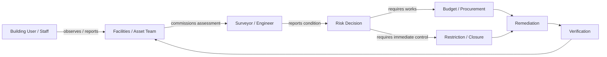
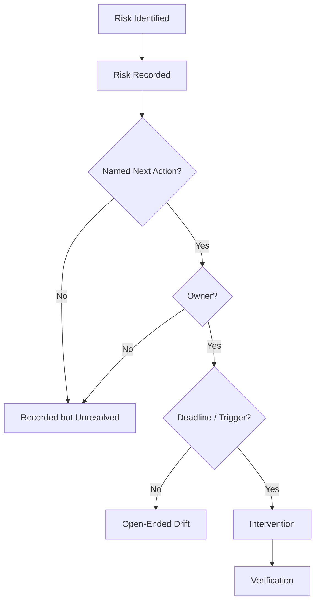
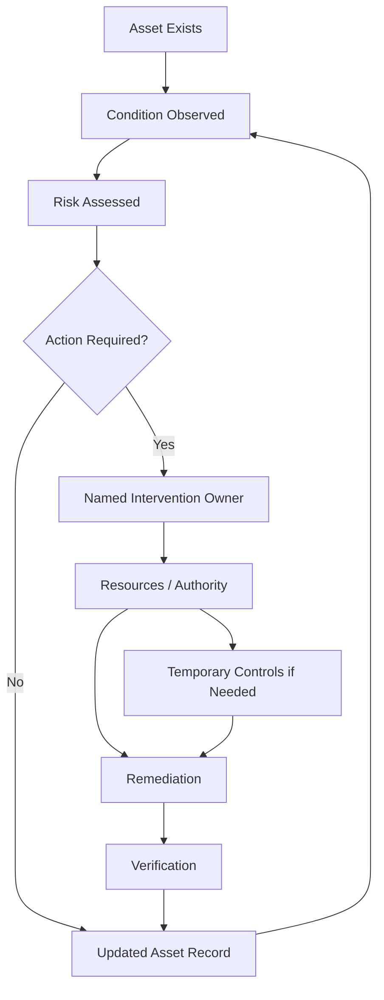
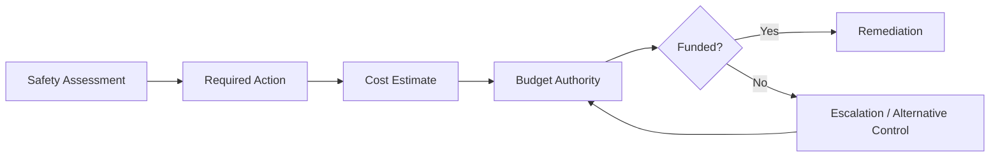
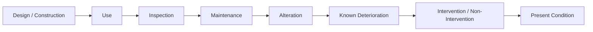
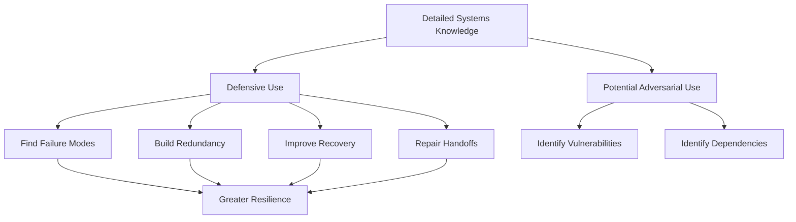
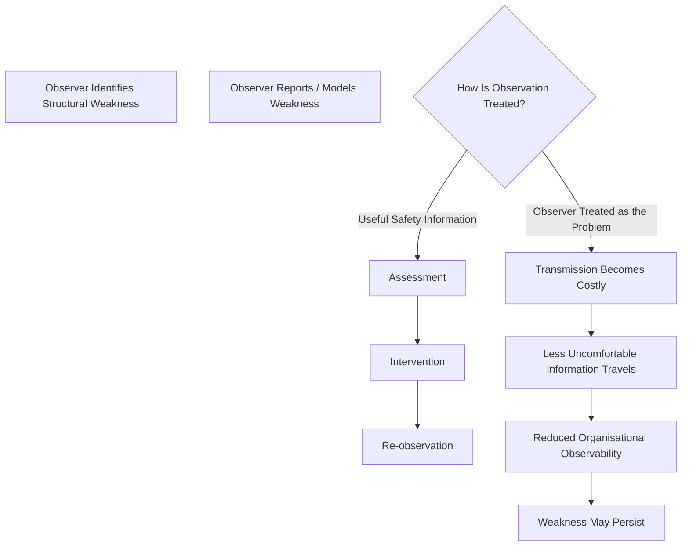
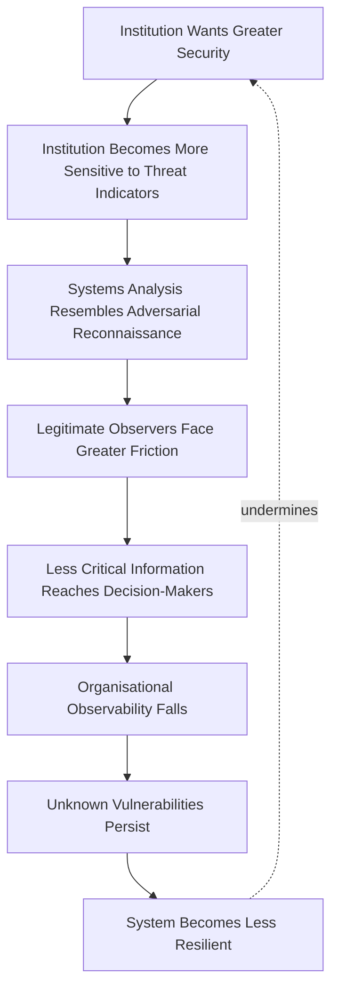

# 🏛️ R.A.A.C. — Ruins and Architectural Committee
**First created:** 2025-10-22 | **Last updated:** 2026-08-14  
*Minutes from the committee on collapse — and a custody-of-process autopsy.*

---

## 🛰️ Orientation

A satirical and forensic study of how infrastructure fails in both material and meaning.

This node recasts **RAAC — Reinforced Autoclaved Aerated Concrete** — as the charter acronym for a fictional oversight body:

> **The Ruins and Architectural Committee.**

The joke is administrative.

The underlying problem is not.

RAAC is a lightweight form of reinforced concrete used extensively in parts of the twentieth-century built environment. Its material characteristics, ageing, condition, exposure and construction context can create serious structural-management problems.

But identifying a hazardous material is only the beginning of the governance problem.

Somebody must:

- know where it is;
- understand its condition;
- assess the risk;
- transmit that assessment;
- decide whether occupation remains acceptable;
- obtain money where work is required;
- commission remediation;
- manage disruption;
- and verify what happens next.

Those functions do not necessarily belong to the same actor.

Nor should they always.

The governance question is therefore not simply:

> **Who owns the building?**

It is:

> **Who owns each transition required to turn knowledge of structural risk into effective intervention?**

That is where the Committee convenes.

---

## 🧱 A Material Problem Is Still a Material Problem

Before turning RAAC into metaphor, we should allow the concrete to remain concrete.

Material failure cannot automatically be explained by:

- outsourcing;
- austerity;
- poor inspection;
- administrative drift;
- or negligent maintenance.

Different buildings have different:

- construction histories;
- exposure conditions;
- maintenance records;
- structural configurations;
- alterations;
- defects;
- and risk profiles.

A governance analysis should therefore preserve:

```text
material vulnerability
≠
proof of governance failure
```

and:

```text
RAAC present
≠
building about to collapse
```

But once a material risk is identified, another system becomes visible:

```text
physical condition
→ observation
→ assessment
→ decision
→ intervention
→ verification
```

That second system is the Committee's jurisdiction.

---

## 👑 1. Custody of Process — Who Owns the Building, Who Owns the Risk?

A public building may involve several legitimate custodial roles:

- **Asset owner** — who holds or manages the asset.
- **Duty holder** — who carries relevant legal responsibilities.
- **Building operator** — who controls day-to-day occupation or use.
- **Maintainer** — facilities team, contractor, or specialist provider.
- **Inspector / engineer** — who assesses condition or structural risk.
- **Budget holder** — who controls relevant expenditure.
- **Procurement function** — who can commission works.
- **Decision authority** — who can restrict or close the site.
- **Escalation owner** — who receives unresolved or high-consequence concerns.
- **Remediation owner** — who carries the intervention through to completion.

Distributed ownership is not automatically defective.

Complex buildings require specialised roles.

The problem appears when the handoffs between those roles are weak.



The important question is:

> **Who owns each arrow?**

---

## 🪢 2. The Handoff Problem

The original temptation is to say:

> **Risk becomes nobody's job.**

Sometimes that may be true.

But a more common and analytically useful problem is:

> **Risk can belong to several people while the transition between their responsibilities belongs weakly to anyone.**

For example:

```text
engineer identifies risk
        ↓
asset team receives report
        ↓
funding decision required
        ↓
procurement required
        ↓
temporary controls required
        ↓
work completed
        ↓
building reassessed
```

Every box may have an owner.

The system can still fail at the arrows.

This is **handoff risk**.

And handoff risk becomes especially important where:

- organisations are large;
- estates are fragmented;
- contractors change;
- records sit in different systems;
- capital and operational budgets are separate;
- responsibility crosses organisational boundaries;
- or urgent safety decisions compete with service continuity.

The governance problem is not distributed responsibility.

It is **unintegrated responsibility**.

---

## 🗂️ 3. Bureaucracy of Decay — When Recording Is Not Correction

Before some roofs fail, there are reports.

There may be:

- inspection records;
- condition surveys;
- maintenance logs;
- risk registers;
- capital requests;
- correspondence;
- procurement records;
- closure assessments;
- escalation notes.

Their existence matters.

But:

```text
risk recorded
≠
risk resolved
```

and:

```text
inspection completed
≠
intervention completed
```

Paperwork is not inherently bureaucratic theatre.

Good records are essential to safe asset management.

The governance failure occurs when documentation becomes disconnected from control.



The diagnostic question is therefore not:

> **Was there paperwork?**

It is:

> **What could the paperwork cause the system to do?**

---

## 🧾 4. Remit Diffusion — Everyone Can Flag, But Who Can Cause Action?

A simplified infrastructure chain might look like this:

| Actor | May be able to | May not be able to |
|---|---|---|
| Staff / building users | Observe and report visible concerns | Assess structural significance |
| Facilities team | Record concerns and arrange routine action | Authorise major capital expenditure |
| Engineer / surveyor | Assess condition and recommend action | Fund or execute remediation |
| Asset / estate lead | Integrate risk across the estate | Independently create unavailable capital |
| Finance / procurement | Authorise or commission expenditure | Determine structural safety |
| Senior decision-maker | Restrict occupation or prioritise resources | Personally inspect every asset |
| Regulator / oversight body | Set expectations or intervene within remit | Own and repair every affected asset |

These are intentionally qualified.

The precise powers and duties vary by building, organisation, contractual arrangement and legal regime.

The point is architectural:

> **Information and intervention authority can occupy different positions.**

That is not automatically a failure.

It becomes one when the system cannot reliably bridge them.

---

## ♻️ 5. The Structural-Safety Control Loop

A healthy asset-management system needs a closed loop.



Every transition matters.

A building can have:

- inspection without integration;
- integration without funding;
- funding without procurement;
- procurement without timely remediation;
- remediation without verification;
- or records without re-observation.

The Committee is therefore less interested in whether an organisation possesses a **RAAC spreadsheet** than whether the spreadsheet participates in a functioning control loop.

---

## 🧱 6. Reinforced Ideology — Concrete as Governance Metaphor

Now we may permit the concrete to become philosophical.

RAAC was attractive partly because it was lightweight and useful for particular forms of construction.

That does not make the material itself evidence of ideological failure.

But its later governance problems provide an unusually good metaphor for a recurring administrative fantasy:

> **that systems can remain light indefinitely without somebody carrying the weight.**

The fantasy appears elsewhere as:

- lean staffing without resilience;
- outsourcing without integration;
- efficiency without spare capacity;
- inspection without intervention authority;
- delegation without escalation;
- asset use without lifecycle planning.

The Committee therefore adopts a narrower doctrine:

> **Lightweight systems still require heavyweight custody.**

The material was autoclaved.

The governance must remain load-bearing.

---

## 💷 7. Deferred Maintenance and the Time Problem

Infrastructure decisions operate across different timescales.

```text
annual budget
≠
asset lifecycle

electoral cycle
≠
structural lifecycle

contract period
≠
building lifecycle
```

This creates a predictable governance difficulty.

The benefit of postponing expenditure may be immediate and visible.

The cost of postponement may be:

- delayed;
- uncertain;
- inherited by another budget;
- inherited by another administration;
- or visible only after deterioration becomes expensive.

That does not mean every deferred repair is irrational.

Asset managers constantly prioritise finite resources.

The useful question is whether the system can distinguish:

```text
safe prioritisation
```

from:

```text
risk displaced into the future
```

and whether somebody remains responsible for revisiting that decision.

---

## 💸 8. The Budget–Safety Interface

Safety responsibility without access to resources can produce a control gap.

But the solution is not necessarily to give every safety actor an unlimited capital budget.

Instead, the system needs a reliable interface.



The critical governance question is:

> **What happens when the safety requirement exceeds the available budget?**

A mature system does not allow:

```text
no budget
→
therefore no owner
```

The unresolved risk must remain visible and escalatable.

---

## 🚪 9. Closure Is a Control, Not a Confession

Closing or restricting a building can be:

- disruptive;
- expensive;
- unpopular;
- operationally difficult;
- educationally or clinically consequential.

That can create pressure to avoid unnecessary closure.

Avoiding unnecessary closure is legitimate.

But closure must remain available where the assessed risk justifies it.

```text
closure
≠
proof of prior negligence
```

and:

```text
continued occupation
≠
proof of safety
```

Both are decisions requiring an evidential basis.

The governance test is whether the person responsible for making that decision can do so without inappropriate pressure from unrelated reputational or operational incentives.

---

## 🚸 10. Glyphs of Governance — Safety Scripts and Their Erosion

Our cities speak in glyphs:

*Give Way.*  
*Authorised Vehicles Only.*  
*Slow.*  
*Fire Exit.*  
*Do Not Enter.*

They are the runes of managed space — tiny instructions connecting institutional decisions to human behaviour.

When markings fade, signs disappear, barriers break, or instructions cease to match physical conditions, something has happened to that control loop.

The Committee's linguistics subcommittee therefore proposes a new field:

> **Semiotic Structural Integrity**

— the study of whether the information layer of the built environment remains aligned with the physical environment it is supposed to govern.

```text
physical condition changes
+
instruction does not change
=
information environment drifts away from reality
```

A faded road marking is not necessarily evidence of systemic collapse.

Sometimes paint needs repainting.

But repeated degradation can be useful telemetry about maintenance custody.

> **When the symbol loses legibility, governance may be losing its voice.**

---

## 🏗️ 11. Archaeology of the Present — Reading the City's Autopsy

We are not only uncovering ancient ruins.

We continuously produce future archaeology.

The present-day investigator may read:

- surveys;
- estate registers;
- invoices;
- inspection photographs;
- planning records;
- maintenance logs;
- contractor histories;
- procurement decisions;
- capital programmes;
- risk registers.

These documents can reconstruct how an asset moved through time.



The objective is not to discover a villain in every spreadsheet.

It is to reconstruct custody.

> **The city's bones are bureaucratic.**

---

## 🧿 12. The Building as Sensor

A building generates information before catastrophic failure.

Signals can include:

- visible deterioration;
- water ingress;
- cracking;
- deformation;
- recurring repairs;
- inspection findings;
- changing load conditions;
- component failures;
- user reports;
- near-misses.

The governance system determines whether those signals become usable knowledge.

```text
building produces signal
→
human observes signal
→
organisation records signal
→
expert interprets signal
→
authority acts
→
building produces new signal
```

This is why infrastructure belongs inside cybernetics.

The building is part of the feedback loop.

The Committee's job is to stop the organisation from muting it.

---

## 👁️ 13. When the Observer Becomes the Anomaly

Resilience depends upon people being willing and able to examine systems.

That means asking questions which can sound uncomfortable:

- Where are the critical dependencies?
- What happens if this component fails?
- Which function has no redundancy?
- Who possesses information without intervention authority?
- Which handoff can silently fail?
- What happens when the expected process does not occur?
- Which controls exist only on paper?
- Where would failure propagate next?

These are ordinary questions in:

- systems engineering;
- safety engineering;
- resilience engineering;
- cybernetics;
- incident investigation;
- business continuity;
- infrastructure management.

They can also resemble questions an adversary might ask.

That creates a genuine **dual-use problem**.

```text
understanding how a system can fail
        ↓
can support
        ↓
resilience engineering
        OR
exploitation
```

The existence of that dual use justifies proportionate information-security controls around genuinely sensitive operational detail.

It does **not** follow that systems analysis itself is suspicious.

---

## 🛡️ 14. Defender and Adversary Knowledge Overlap

A resilient system cannot be defended without understanding its vulnerabilities.

The defender may need to know:

- critical dependencies;
- failure modes;
- bottlenecks;
- cascading effects;
- recovery constraints;
- single points of failure;
- weak interfaces;
- and the consequences of degraded components.

An adversary may also value some of that information.

The overlap is real.



The governance challenge is therefore not:

> **How do we prevent people from understanding the system?**

It is:

> **How do we protect genuinely sensitive information while preserving the analytical capacity required to make the system safer?**

---

## 🔭 15. Observability Requires Observers

Cybernetic systems require feedback.

Organisations do too.

```text
system produces signal
→
observer detects signal
→
observer interprets signal
→
information travels
→
authority responds
→
system changes
→
new signal appears
```

The observer is therefore part of the control architecture.

If people who identify:

- contradictions;
- dependencies;
- recurring anomalies;
- unsafe assumptions;
- weak handoffs;
- or plausible failure modes

are routinely interpreted as organisational threats merely because they are looking closely, the feedback loop can degrade.



This is a **failure mode**, not an allegation about any particular institution.

Whether a specific security, surveillance, regulatory, corporate or public body behaves this way is an empirical question requiring evidence.

But the design risk itself is clear.

---

## 🚨 16. Suspicion Can Become a Control-System Problem

Security systems need anomaly detection.

But anomaly detection has its own failure modes.

One appears when:

```text
unusual observation
```

quietly becomes:

```text
suspicious observer
```

Those are different propositions.

A person may notice unusual patterns because they are:

- technically skilled;
- unusually attentive;
- professionally responsible;
- familiar with the system;
- directly exposed to its failures;
- or simply correct.

So:

```text
noticing a vulnerability
≠
creating the vulnerability

understanding a failure mode
≠
intending to exploit it

mapping a system
≠
hostility toward the system
```

Intent and conduct require their own evidence.

Without that distinction, a protective system can produce an inversion:

> **The information required to improve resilience becomes harder to transmit because producing it is itself treated as anomalous.**

---

## ♻️ 17. The Defensive Paradox

The resulting loop is unpleasantly cybernetic.



The security mechanism can therefore damage the security property it is intended to protect.

That does not mean surveillance, classification or access control are inherently incompatible with resilience engineering.

It means they require calibration.

A resilient security culture needs to distinguish:

| Observation | Governance response |
|---|---|
| Legitimate systems analysis | Protect and evaluate |
| Safety reporting | Preserve escalation |
| Sensitive technical information | Apply proportionate handling controls |
| Credible evidence of hostile intent | Investigate through appropriate process |
| Mere intellectual curiosity | Do not silently convert into culpability |

The objective is neither maximal openness nor maximal suspicion.

It is **high observability with proportionate information control**.

---

## 🏛️ 18. Back to the Ceiling

RAAC makes this argument wonderfully mundane.

Suppose somebody asks:

- Which buildings contain the material?
- Which have been inspected?
- Who received the reports?
- Which require remediation?
- Which have no funded remediation plan?
- Who can close them?
- Where are the unresolved handoffs?

They are mapping vulnerabilities.

They are also doing exactly what competent infrastructure governance requires.

The same analytical behaviour can therefore look very different depending upon the frame applied to it.

```text
"Why are you mapping the weaknesses?"
```

is a legitimate security question in some contexts.

But it cannot replace:

```text
"Are the weaknesses real?"
```

A mature system needs to be capable of asking both.

---

## 🧠 19. The Cybernetic Principle

The Committee therefore adds another rule to its charter:

> **Do not confuse the visibility of a weakness with the production of the weakness.**

And another:

> **A system that treats observation of its weaknesses as inherently threatening risks becoming less capable of observing its weaknesses.**

That is not merely an epistemic problem.

It is a resilience problem.

Because the knowledge needed to:

- identify failure;
- build redundancy;
- repair handoffs;
- model cascades;
- plan recovery;
- and prevent recurrence

cannot be generated without people who are prepared to look closely at how systems actually work.

Sometimes cybernetics means elaborate theories of feedback and control.

Sometimes resilience engineering means:

> **For the love of God, who is actually responsible for doing something about the ceiling?**

---

## 🪶 20. Charter for Preventing Ruins — Recommendations as Custody Design

The Committee resolves:

1. **Every safety-critical asset needs identifiable custody.**  
   Relevant roles, duties and escalation routes should be knowable rather than reconstructed only after failure.

2. **Every critical handoff needs an owner.**  
   Observation → assessment → decision → funding → control → remediation → verification.

3. **Inspection must connect to action.**  
   Where an inspector lacks enforcement authority, the receiving system needs a defined escalation mechanism.

4. **Unfunded safety requirements must remain visible.**  
   Budget refusal should not make the underlying risk disappear from governance.

5. **Temporary controls need owners and review dates.**  
   A temporary mitigation should not quietly become permanent background condition.

6. **Closure authority should be explicit.**  
   Decision-makers need to know who can restrict occupation, on what basis, and how that decision is reviewed.

7. **Records should preserve the decision chain.**  
   Not merely that a problem was recorded, but what happened next.

8. **Remediation requires verification.**  
   “Works completed” and “risk resolved” are different propositions.

9. **Lifecycle risk must survive organisational change.**  
   Contractors, leaders and budgets can change faster than buildings do.

10. **Distributed governance requires integrated handoffs.**  
    Complexity is manageable. Unowned transitions are not.

11. **Systems analysis should not be confused with hostile intent.**  
    Legitimate observation, safety analysis and resilience engineering need protected routes into decision-making.

12. **Sensitive information requires proportionate control, not analytical blindness.**  
    Security should protect genuinely exploitable detail without destroying the systems knowledge required for defence.

13. **Observers are part of the safety architecture.**  
    A system that suppresses uncomfortable observation can reduce its own capacity to detect and correct failure.

> **The Committee adjourns. The ceiling creaks. Minutes approved by gravity.**

---

## 👑 Ownership & Control Implication

RAAC exposes a general governance distinction:

```text
asset ownership
≠
risk ownership
≠
decision authority
≠
budget authority
≠
remediation custody
```

Those functions may legitimately be distributed.

The system becomes fragile when it assumes that because every function has an owner, the **whole control loop** must therefore have one too.

It may not.

The same applies to observation.

```text
ability to see the problem
≠
authority to fix the problem
```

But a resilient organisation needs a reliable path between them.

That is why the strongest question in this node is not:

> **Who is responsible?**

It is:

> **Who owns each transition required to make responsibility operational?**

---

## 🧭 Diagnostic Questions

- Who owns or manages the asset?
- Who knows what materials and structural systems it contains?
- Who observes deterioration?
- Who can commission competent assessment?
- Who receives the resulting report?
- Who decides whether action is required?
- Who can restrict occupation?
- Who controls the relevant budget?
- What happens when funding is unavailable?
- Who commissions remediation?
- Who verifies that remediation addressed the risk?
- Who owns temporary controls?
- Are review dates explicit?
- Can risk information survive contractor or leadership changes?
- Are records connected to action rather than merely retained?
- Which handoff is most likely to fail?
- Can the building's signals reach somebody capable of changing its condition?
- Can people safely identify weaknesses without being presumed hostile for identifying them?
- Are sensitive details protected without suppressing legitimate systems analysis?
- Does the organisation distinguish unusual observation from suspicious intent?
- Can uncomfortable information still reach decision-makers?
- Is anomaly detection directed at evidence of harmful conduct, or drifting toward suspicion of analytical behaviour itself?
- Does the security architecture preserve the observability required for resilience?

Most importantly:

> **Who owns the arrows?**

---

## 🌌 Constellations

🏛️ 👑 🧱 ♻️ 🧿 👁️ — infrastructure custody; structural safety; handoff ownership; maintenance feedback; administrative observability; systems thinking; resilience engineering.

---

## ✨ Stardust

RAAC, reinforced autoclaved aerated concrete, infrastructure governance, structural safety, maintenance custody, handoff risk, lifecycle management, remit diffusion, asset management, deferred maintenance, budget authority, closure authority, safety feedback, administrative drift, semiotic structural integrity, civic infrastructure, systems thinking, resilience engineering, cybernetics, observer suppression, defensive paradox, dual-use knowledge, security culture, anomaly detection, organisational observability, vulnerability mapping

---

## 🏮 Footer

*🏛️ R.A.A.C. — Ruins and Architectural Committee* is a living node of the **Polaris Protocol**.

It uses RAAC as both a real infrastructure-management problem and a governance satire.

The node does not assume that the presence or deterioration of RAAC proves negligence, austerity, outsourcing failure, or administrative misconduct. Instead, it examines the control architecture required once structural risk becomes known: observation, assessment, decision, funding, restriction, remediation and verification.

It also examines a second-order resilience problem: systems cannot learn about their vulnerabilities without observers willing and able to identify them. Security controls therefore need to distinguish legitimate systems analysis from evidence of hostile intent, preserving the observability required for defence while protecting genuinely sensitive information.

Its central findings are:

> **Distributed responsibility can work. Unowned handoffs cannot.**
>
> **A system that treats observation of its weaknesses as inherently threatening risks becoming less capable of observing its weaknesses.**

And its central administrative question remains:

> **Who owns the arrows?**

> 📡 Cross-references:
>
> - [✈️ Worker Positioning & Safety Culture](./✈️_worker_positioning_and_safety_culture.md) — *when the people closest to risk are not the people controlling intervention*
> - [⛪️ Faith Land Trusts as Counter-Radicalisation Infrastructure](./⛪️_faith_land_trusts_as_counter-radicalisation_infrastructure.md) — *custodial transition and the built environment*
> - [🕳️ The Pothole Problem](./🕳️_the_pothole_problem.md) — *visible maintenance as governance telemetry*
> - [🌳 The Lads Are Not Pro-Countryside](./🌳_the_lads_are_not_pro_countryside.md) — *distributed custody across physical systems*
> - [🎺 Echo Punk — The Acoustic Afterlife of Derelict Structures](../../🪄_Expression_Of_Norms/🎶_Banned_Broadcasts_Cooperative/🎺_echo_punk.md)
>
> 🏮 Return To:
>
> - [👑 Ownership & Control](./README.md) — *1up*
> - [♻️ Cybernetics](../README.md) — *2up*
> - [🪿 Embodied Information Ecology](../../README.md) — *3up*
> - [🌑 Origin Points](../../../README.md) — *4up*
> - [🌌 Polaris Protocol — Root](../../../../README.md) — *root*

*Survivor authorship is sovereign. Containment is never neutral.*

_Last updated: 2026-08-14_
