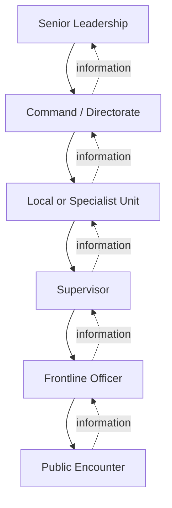
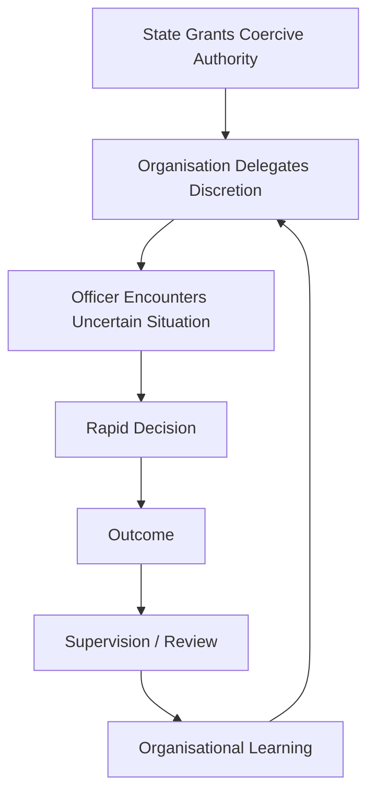
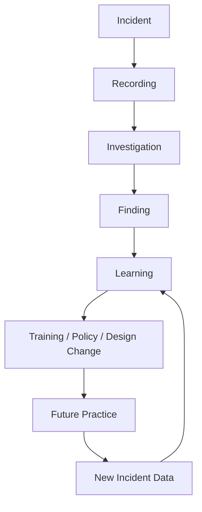
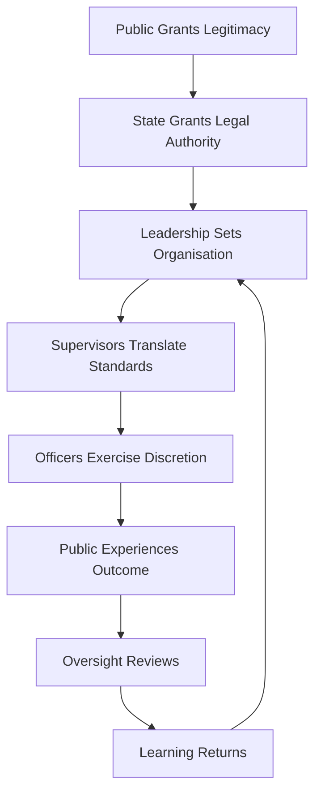
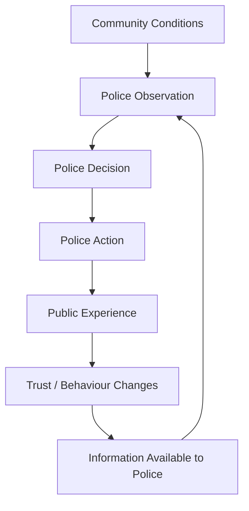

# 🐼 The Metropolitan Rabble
**First created:** 2025-12-22 | **Last updated:** 2026-08-16  
*Authority is not the same thing as coherence — and policing becomes dangerous when coercive power outruns organisational learning.*

---

> "They reckon you've got concussion...
>
> I couldn't give a tart's furry cup if half your brains are falling out.
>
> Don't **ever** waltz into my kingdom acting king of the jungle."
>
> "Who the hell are you?"
>
> "Gene Hunt. Your DCI. And it's 1973. Almost dinner time. I'm 'aving 'oops."
>
> *— Life on Mars*

---

## 🛰️ Orientation

Public debate about the **Metropolitan Police Service** often reaches quickly for a single explanation:

**corruption.**

Sometimes corruption is exactly the relevant category.

Policing has documented histories of:

- individual corruption;
- discriminatory practice;
- misconduct;
- failures of supervision;
- institutional defensiveness;
- unlawful behaviour;
- and serious failures of accountability.

Those are not merely rhetorical categories. HMICFRS has documented failures in vetting, misconduct handling, misogyny, supervision and organisational learning across policing, including specific inspection work on the Metropolitan Police. The Met is therefore being used here as a documented case study, not as a synonym for every police force.[^1]

But **corruption cannot safely become a catch-all explanation for every institutional failure**.

The original proposition of this node is worth retaining:

> some apparently coordinated institutional behaviour may be better explained by fragmentation, uneven discipline, occupational culture, status incentives, weak information flow, and authority distributed differently from knowledge.

The Met is a particularly visible case study because of its:

- scale;
- political proximity;
- specialist functions;
- media visibility;
- organisational complexity;
- and extensive history of public scrutiny.

But the underlying problem is not uniquely Metropolitan.

Different versions appear across policing systems internationally.

The wider question is:

> **How do organisations control large numbers of people who themselves possess substantial discretionary and coercive power?**

---

## 🧿 1. Corruption, Misconduct and Indiscipline Are Different Problems

The original node drew a useful distinction between corruption and indiscipline.

It needs slightly more precision.

**Corruption** may involve:

- abuse of entrusted power;
- improper benefit;
- compromised decision-making;
- concealment;
- inappropriate relationships;
- or deliberate misuse of office.

**Misconduct** is broader.

**Organisational indiscipline** is broader again.

It can produce:

- inconsistency;
- poor supervision;
- conflicting practice;
- self-sabotaging behaviour;
- reputational damage;
- uneven enforcement;
- and actions which do not obviously advance any coherent institutional strategy.

So:

```text
bad police outcome
≠
proof of corruption

institutional inconsistency
≠
proof of conspiracy

absence of conspiracy
≠
absence of serious failure
```

That last distinction matters.

An organisation does not need to be secretly coordinated to produce systematic harm.

---

## 🧱 2. Fragmentation Can Be an Operating Condition

Large police organisations do not behave as single organisms.

They contain:

- commands;
- boroughs or local areas;
- specialist units;
- ranks;
- professions;
- informal networks;
- occupational subcultures;
- training histories;
- different operational demands;
- and different supervisory environments.

The original node described this as something resembling loosely federated cultures rather than a perfectly coherent machine.

That is plausible as an organisational model.

But it should be tested rather than assumed.



Formal command travels downward.

Knowledge of what actually happened must travel back upward.

Those two flows are not equally reliable.

---

## 🔄 3. Control and Information Travel Differently

This is the cybernetic centre of the node.

A frontline officer may possess:

- immediate situational knowledge;
- substantial discretion;
- coercive powers;
- and very limited authority over organisational policy.

Senior leadership may possess:

- organisational authority;
- budgetary power;
- policy influence;
- disciplinary responsibility;
- strategic visibility;
- and almost no direct observation of most police encounters.

So:

```text
FRONTLINE

high immediate information
high situational discretion
low institutional control

            ↕

LEADERSHIP

low immediate information
lower situational visibility
high institutional control
```

That creates a difficult control problem.

The people who know most about an encounter may control least about the system.

The people who control most about the system may know least about an encounter.

Good policing therefore depends upon the quality of the interfaces between them.

The diagram is an **analytical model**, not a claim that every command chain or encounter follows the same route. It can be tested against inspection findings, complaint and misconduct records, incident reviews, training changes and evidence about whether lessons reach later practice.

---

## 🧠 4. Status Games Where Governance Should Be

The original node proposes that where formal discipline is weak, informal status signals can become unusually important.

Possible signals include:

- toughness;
- confidence;
- occupational credibility;
- decisiveness;
- loyalty;
- experience;
- willingness to confront risk;
- ability to command a scene.

Those qualities are not inherently bad.

Police officers sometimes need:

- courage;
- rapid decisions;
- physical intervention;
- command presence;
- and willingness to enter dangerous environments.

The problem begins when:

```text
decisiveness
becomes
never reconsidering

command presence
becomes
dominance

occupational solidarity
becomes
inability to challenge colleagues

confidence
becomes
resistance to correction
```

A safety culture needs to distinguish the useful trait from its pathological overextension.

---

## 🎭 5. The Gene Hunt Problem

British culture has spent decades constructing police archetypes.

The brilliant detective.

The old-school copper.

The maverick.

The bent copper.

The governor.

The by-the-book bureaucrat.

The officer who breaks procedure because **he knows how the streets work**.

Gene Hunt is funny partly because the archetype is grotesquely concentrated.

But the joke depends upon cultural familiarity.

We recognise the proposition:

```text
competence
=
certainty
+
dominance
+
rule-breaking
+
occupational instinct
```

Modern policing cannot safely use that as a governance model.

Experience matters.

Tacit knowledge matters.

Professional instinct matters.

But:

> **an institution cannot learn if changing your mind is coded as weakness.**

The cultural reference therefore matters because policing is governed not only by formal policy but by ideas about **what a proper police officer looks like**.

The 2024 Code of Ethics provides a useful institutional counter-model: courage is paired with accountability; respect with listening; and public service with trust and confidence. It explicitly treats reflection and professional improvement as part of ethical policing.[^2]

---

## 🪞 6. Police Mythology Is Part of the Control Environment

Police dramas do not determine police behaviour.

Nor should fictional characters be treated as sociological evidence.

But culture supplies archetypes through which institutions and publics understand authority.

Those archetypes can influence expectations about:

- toughness;
- masculinity;
- loyalty;
- hierarchy;
- discretion;
- rule-breaking;
- bureaucracy;
- public order;
- and legitimate violence.

The interesting question is not:

> **Did television cause police culture?**

Obviously not.

It is:

> **Which behaviours does a culture recognise immediately as “proper policing,” and which behaviours look anomalous even when they may represent better professional practice?**

For example:

```text
escalation
may look decisive

de-escalation
may look passive

certainty
may look competent

uncertainty
may look weak
```

Safety engineering may require exactly the opposite interpretation in a particular encounter.

---

## 🐼 7. Why the Met Is Useful — and Why the Pattern Is Bigger Than the Met

The Metropolitan Police is useful as a case study.

It is not the definition of the problem.

Policing systems internationally must solve variations of the same basic architecture:



The institutional problem appears when the final arrow fails.

If learning does not return to practice, incidents remain individual episodes rather than organisational information.

Different jurisdictions will have:

- different laws;
- different command structures;
- different accountability systems;
- different firearms models;
- different training;
- different histories;
- different relationships with communities.

So cross-national comparison needs care.

But the control problem travels.

---

## 🏛️ 8. Forty-Three Forces — and the Capacity to Speak Together

England and Wales currently retain a territorially distributed policing structure.

That can encourage:

- local responsiveness;
- experimentation;
- adaptation;
- and different organisational cultures.

It can also produce:

- duplication;
- inconsistent standards;
- fragmented technology;
- uneven capability;
- and difficult ownership of cross-force problems.

The Government's January 2026 policing white paper explicitly identifies the existing 43-force structure as fragmented and proposes fewer forces alongside a new **National Police Service**, intended to provide national strategic leadership and stronger standards while retaining locally responsive policing.[^3]

That is a live governance experiment.

```text
LOCAL RESPONSIVENESS
        ↕
FORCE AUTONOMY
        ↕
NATIONAL CONSISTENCY
        ↕
CENTRAL COORDINATION
        ↕
DEMOCRATIC ACCOUNTABILITY
```

No position on that axis is automatically safe.

Centralisation can improve:

- interoperability;
- common standards;
- learning;
- procurement;
- specialist capability;
- and ownership of national problems.

It can also increase:

- command distance;
- monoculture risk;
- consequences of central error;
- propagation of defective standards;
- and concentration of institutional power.

Fragmentation produces the inverse mixture.

The design problem is therefore not simply:

> centralise or decentralise?

It is:

> **Which functions need common ownership, and which require local adaptation?**

---

## 📣 9. Collective Voice Is Structurally Possible

August 2026 supplied a useful counter-example to the idea that police leadership is simply too fragmented to act collectively.

All **43 chief constables in England and Wales** joined a public intervention concerning proposed early-release arrangements, including the possible effect upon the men convicted of the manslaughter of PC Andrew Harper.[^4]

Whatever one's view of that intervention, its structural significance is straightforward:

```text
43 separate territorial forces
        ↓
can nevertheless produce
        ↓
collective senior-policing voice
```

This does **not** establish that chief constables should collectively intervene on every major policing controversy.

Nor does collective silence on another issue establish conspiracy, indifference or agreement.

But demonstrated coordination capacity changes the diagnostic question.

Instead of:

> **Why can't policing speak collectively?**

we can ask:

> **Which problems become legible to senior policing as requiring collective institutional voice?**

That is a much more useful ownership question.

---

## 👑 10. Institutional Identity Can Be More Unified Than Institutional Control

This produces a peculiar characteristic of policing.

Operationally:

```text
"policing"
=
many forces
+
many units
+
many officers
+
many decisions
```

Symbolically:

```text
"the police"
=
one recognisable institution
```

That creates an asymmetry.

When something goes wrong, responsibility may need to be disaggregated:

- which officer?
- which supervisor?
- which force?
- which policy?
- which command?
- which information?
- which legal power?

But institutional identity can remain highly collective.

That is not necessarily evasive.

It reflects a real organisational structure.

But it can make accountability cognitively difficult for the public.

> **Policing can appear highly decentralised when responsibility is being located and highly unified when institutional identity is being defended.**

The analytical task is to determine whether that difference follows legitimately from organisational structure or is being used to obscure ownership.

---

## ⚖️ 11. Operational Independence Complicates Ownership

Democratic policing needs some insulation from direct political command.

Governments should not ordinarily be able to tell police:

> arrest this opponent.

But democratic government also cannot simply say:

> policing has nothing to do with us.

Policing therefore sits inside a deliberately awkward structure.

```text
political control
        X
operational independence

democratic accountability
        ↕
professional discretion
```

Too much political control risks politicised enforcement.

Too little effective accountability risks coercive authority becoming institutionally insulated.

The tension cannot be eliminated.

It has to be governed.

This is also a legal-governance design, not simply a convention. The **Policing Protocol Order 2023** safeguards chief constables' operational independence while preserving accountability through police and crime commissioners and the Home Secretary's national responsibilities.[^5]

---

## 🚨 12. Enforcement Without Situational Intelligence

The original node described a recurring failure mode as:

> **authority exercised without situational intelligence.**

Keep that.

It is one of the strongest lines in the node.

A rule can be legally available and still be:

- operationally unwise;
- unnecessarily escalatory;
- poorly timed;
- badly communicated;
- disproportionate to the actual problem;
- or damaging to longer-term legitimacy.

Conversely, restraint is not always the safer option.

Police sometimes encounter situations where failure to intervene creates immediate danger.

The relevant skill is judgment.

```text
legal power
+
situational intelligence
+
proportionality
+
communication
+
review
=
better control
```

Remove the middle terms and authority becomes brittle.

---

## 🧩 13. Protest Is a Stress Test

Protest policing makes these problems unusually visible.

Police may simultaneously need to protect:

- lawful protest;
- public safety;
- access;
- property;
- counter-protesters;
- transport;
- emergency routes;
- officers;
- and people who want nothing to do with the protest.

These interests can conflict.

A badly functioning command system can generate:

- contradictory instructions;
- unpredictable thresholds;
- uneven enforcement;
- poor explanation;
- avoidable escalation;
- and public uncertainty about what rules actually apply.

The original node says fragmented policing can produce optics that **“inflame rather than contain.”**

I would soften only the causal certainty.

Poorly calibrated policing **can contribute to escalation**.

It does not follow that police action manufactured every escalation that follows.

---

## ❤️‍🩹 14. The Unfinished Ledger

There is a harder part of this conversation which this node should acknowledge without pretending to resolve.

Police officers operate in environments containing genuine physical danger.

Members of the public also encounter state powers capable of producing profound and sometimes irreversible consequences.

A serious safety architecture has to hold both propositions simultaneously.

Official statistics in England and Wales use the category:

> **deaths during or following police contact**

That terminology matters.

The category covers very different circumstances and does **not**, by itself, establish that police action caused a death or that misconduct occurred.

The latest published IOPC statistics, covering **2025/26**, recorded:

- 15 road-traffic fatalities;
- 4 fatal police shootings;
- 27 deaths in or following police custody;
- 67 apparent suicides following police custody;
- and 63 other deaths following police contact that were independently investigated.[^6]

Those categories cannot responsibly be collapsed into a single causal claim.

Nor should their heterogeneity become a reason not to examine them.

They raise different questions concerning:

- restraint;
- custody;
- emergency response;
- pursuit;
- firearms;
- welfare encounters;
- medical risk;
- mental-health response;
- supervision;
- independent investigation;
- coronial processes;
- organisational learning;
- officer safety;
- and public safety.

Those questions need a dedicated node.

At minimum:

> 📡 **Future node: Deaths During or Following Police Contact — Learning, Accountability & Safer Encounters**

Its objective should not be to decide which population deserves safety.

It should ask:

```text
What happened?
      ↓
What increased risk?
      ↓
What reduced risk?
      ↓
What information was available?
      ↓
Who possessed intervention authority?
      ↓
What was learned?
      ↓
Did learning alter practice?
      ↓
Did the same failure recur?
```

The governing principle should be:

> **Reduce the probability that any human being entering a police interaction leaves it dead, seriously injured, traumatised, wrongly criminalised, or unnecessarily endangered — including the officers themselves.**

Accountability and officer safety are not opposites.

Both belong inside safety engineering.

---

## 🕵️ 15. The Other Unfinished Ledger: Undercover Policing

Historic undercover policing raises another set of unresolved accountability questions.

The **Undercover Policing Inquiry** was established in 2015 under the Inquiries Act 2005 to examine undercover policing in England and Wales since 1968.

As of **16 August 2026**, the Home Office is consulting on the future structure, scope and format of the Inquiry.

The consultation was originally due to close on 20 August, but the official page was updated on 29 July. It now closes at **11:59pm on 20 September 2026**.[^7]

The Government says ministers are concerned about:

- the Inquiry's length;
- its cost;
- and delays in delivering outcomes.

The consultation does **not** reopen evidence and does not cover Tranches 1–3 concerning the Special Demonstration Squad from 1968–2007, which are expected to have concluded upon Sir John Mitting's retirement.

Instead, it asks how the Inquiry's remaining objectives should be achieved.

That distinction matters.

It would therefore be too strong to write:

```text
government has ended the Spycops Inquiry
```

But equally incomplete to write:

```text
nothing significant is changing
```

The future architecture of the remaining inquiry is actively under reconsideration.

The people and issues involved include:

- women deceived into relationships with undercover officers;
- people and organisations reported upon;
- families whose deceased children's identities were used;
- family justice campaigns;
- undercover officers and their families;
- police forces;
- and wider questions of authorisation, supervision and institutional learning.

Those issues are too substantial to become a subsection of a node called **The Metropolitan Rabble**.

They require their own evidential treatment.

The relevance here is narrower:

> **policing institutions must remain capable of learning from practices whose consequences may only become fully visible years later.**

---

## 🔄 16. Accountability Is a Feedback Function

Accountability is sometimes treated as punishment applied after failure.

That is incomplete.

In a functioning system:



If the chain stops at:

```text
investigation
→ report
→ archive
```

then accountability has generated information without completing the feedback loop.

The safety question is:

> **What changed because the system learned this?**

---

## 🛡️ 17. Officer Safety Belongs Inside the Same Loop

Policing reform fails if it treats officers as infinitely resilient components.

Police work can involve:

- violence;
- traumatic scenes;
- uncertainty;
- shift work;
- confrontation;
- public hostility;
- organisational pressure;
- moral injury;
- and repeated exposure to distress.

A system asking people to exercise coercive judgment under pressure has an obligation to maintain the people doing it.

That includes:

- training;
- supervision;
- staffing;
- equipment;
- psychological support;
- rest;
- competent leadership;
- learning cultures;
- and permission to ask for help.

This is not separate from public protection.

```text
better-supported officers
+
better supervision
+
better information
+
better escalation routes
=
lower-risk policing environment
```

That proposition should itself remain open to empirical testing.

But treating workforce condition as irrelevant to operational safety would be poor systems engineering.

---

## 🎯 18. Indiscipline Is Not the Only Hypothesis

The original node strongly favoured indiscipline over corruption as the dominant explanatory model.

For governance purposes, I would make that a hypothesis rather than a verdict.

Observed institutional failure may reflect combinations of:

- misconduct;
- corruption;
- inadequate resources;
- bad policy;
- weak supervision;
- fragmented ownership;
- poor training;
- incompatible incentives;
- information failure;
- occupational culture;
- lawful but defective rules;
- political constraints;
- or ordinary human error.

So the correct question becomes:

> **Which explanation best fits this failure, and what evidence would distinguish it from the alternatives?**

That protects the useful insight without making **rabble** into another totalising explanation.

---

> "But we've got even bigger fish to fry in this hornet's nest.
>
> We only have one stab at it otherwise it'll be like rats leaving a sinking ship."
>
> "Metaphors... all over the shop..."
>
> "I know. Clever, innit?"
>
> *— Ashes to Ashes*

---

## 🐝 19. The Metaphors Are All Over the Shop

Quite.

Policing is simultaneously described as:

- a force;
- a service;
- a family;
- a profession;
- a thin blue line;
- an emergency service;
- an institution;
- a body of constables;
- an arm of the state.

Each metaphor implies a different governance model.

```text
FORCE
→ command

SERVICE
→ public responsiveness

PROFESSION
→ standards

FAMILY
→ solidarity

INSTITUTION
→ continuity

CONSTABLE
→ individual office and discretion

STATE POWER
→ democratic accountability
```

The trouble begins when an organisation switches metaphors without noticing.

For example:

```text
professional autonomy
when discretion is defended

command hierarchy
when obedience is required

individual responsibility
when misconduct occurs

institutional solidarity
when criticism arrives
```

Sometimes those distinctions are legally and organisationally justified.

Sometimes they conceal an ownership gap.

The job is to tell the difference.

---

## 👑 20. Ownership & Control

The policing problem can therefore be drawn as:



Every arrow is an ownership boundary.

The key questions are not simply:

> Who gave the order?

or:

> Which officer did it?

They include:

- Who designed the rule?
- Who supervised its use?
- Who had the relevant information?
- Who could intervene?
- Who reviewed the outcome?
- Who integrated learning across incidents?
- Who could change practice?
- Who owns a problem spanning several forces?
- Who owns a failure produced by national standards?
- Who owns a local deviation from those standards?

If everyone owns only their component:

```text
nobody may own
the behaviour of the whole system
```

---

## ♻️ 21. The Cybernetic Principle

Policing is an unusually demanding control system because its outputs affect the environment it is trying to observe.

Police action can change:

- public behaviour;
- trust;
- willingness to report;
- protest dynamics;
- witness cooperation;
- community intelligence;
- officer behaviour;
- perceived legitimacy.

So:



The police are not outside the environment measuring it.

They are inside the loop.

That means legitimacy is not merely reputational.

It affects sensor quality.

If communities stop:

- reporting;
- cooperating;
- providing intelligence;
- approaching officers;
- believing explanations;

the institution becomes less able to perceive the environment it is supposed to govern.

> **Legitimacy is therefore partly an information asset.**

This is an analytical compression of an established empirical relationship, not a free-standing factual finding. Home Office and College of Policing material links procedural justice and perceived legitimacy with trust, cooperation, reporting and willingness to provide information.[^8]

---

## 🧭 Diagnostic Questions

- Is this failure individual, supervisory, organisational, national, or some combination?
- What evidence distinguishes corruption from misconduct, indiscipline, error or bad design?
- Where did relevant information originate?
- How far did it travel?
- Who had authority to intervene?
- Did frontline discretion exceed supervisory visibility?
- Did senior control exceed situational knowledge?
- Are informal status incentives competing with formal professional standards?
- What behaviour is culturally rewarded?
- Can officers safely challenge colleagues and supervisors?
- Can supervisors acknowledge uncertainty?
- Does learning from serious incidents alter practice?
- Are local forces learning from one another?
- Which functions genuinely require national consistency?
- Which require local adaptation?
- What new systemic risks would centralisation create?
- When can senior policing coordinate collectively?
- Which issues become legible as requiring collective voice?
- Are responsibility and institutional identity being aggregated consistently?
- Are deaths during or following police contact being classified carefully enough to support learning rather than rhetoric?
- Are officer safety and public safety being treated as parts of the same system?
- Can historic accountability processes produce operational learning before institutional memory disappears?
- Does the accountability loop terminate at investigation, or return to practice?

Most importantly:

> **Who owns the gap between what happened on the ground and what the institution believes happened?**

---

## 📚 Sources

### Sources Cited Directly in This Node

- [HMICFRS — An inspection of vetting, misconduct, and misogyny in the police service](https://hmicfrs.justiceinspectorates.gov.uk/publication-html/an-inspection-of-vetting-misconduct-and-misogyny-in-the-police-service/)

- [HMICFRS — A report into the effectiveness of integrity arrangements in the Metropolitan Police Service](https://hmicfrs.justiceinspectorates.gov.uk/publication-html/metropolitan-police-integrity-report-july-2026/)

- [College of Policing — Code of Ethics](https://www.college.police.uk/ethics/code-of-ethics)

- [College of Policing — Ethical policing principles](https://www.college.police.uk/ethics/code-of-ethics/principles)

- [Home Office — From local to national: a new model for policing](https://www.gov.uk/government/publications/from-local-to-national-a-new-model-for-policing/from-local-to-national-a-new-model-for-policing-accessible)

- [The Times — Police chiefs warn Andy Burnham over early release scheme](https://www.thetimes.com/uk/politics/article/andy-burnham-early-release-keep-pc-harper-killers-jail-8px3fp6w0)

- [UK legislation — The Policing Protocol Order 2023](https://www.legislation.gov.uk/uksi/2023/649/made)

- [HMICFRS — Greater clarity on the definition of operational independence needed to maintain police impartiality](https://hmicfrs.justiceinspectorates.gov.uk/news/news-feed/greater-clarity-on-definition-of-operational-independence-needed-to-maintain-police-impartiality/)

- [IOPC — Deaths during or following police contact 2025/26: overall findings](https://www.policeconduct.gov.uk/our-work/research-and-statistics/deaths-during-or-following-police-contact-2025-2026/overall-findings)

- [Home Office — Future of the Undercover Policing Inquiry](https://www.gov.uk/government/consultations/future-of-the-undercover-policing-inquiry)

- [Home Office — Consultation on the future of the Undercover Policing Inquiry](https://www.gov.uk/government/consultations/future-of-the-undercover-policing-inquiry/consultation-on-the-future-of-the-undercover-policing-inquiry)

- [Home Office — Public perceptions of policing: a review of research and literature](https://www.gov.uk/government/publications/public-perceptions-of-policing-a-review-of-research-and-literature/public-perceptions-of-policing-a-review-of-research-and-literature)

- [College of Policing — Procedural justice in stop and search](https://www.college.police.uk/article/procedural-justice-stop-search)

- [Home Office — Definition of policing by consent](https://www.gov.uk/government/publications/policing-by-consent/definition-of-policing-by-consent)

### Citation Notes

<details>
<summary>Sources for policing structure and reform</summary>

- [Home Office — White paper sets out reforms to policing](https://www.gov.uk/government/news/white-paper-sets-out-reforms-to-policing)

- [Home Office — From local to national: a new model for policing](https://www.gov.uk/government/publications/from-local-to-national-a-new-model-for-policing/from-local-to-national-a-new-model-for-policing-accessible)

- [Home Office — Independent review of police force structures: terms of reference](https://www.gov.uk/government/publications/independent-review-of-police-force-structures-terms-of-reference/independent-review-of-police-force-structures-terms-of-reference)

- [Home Office — Commissioner’s response to the Independent Review of Police Force Structures call for evidence](https://www.gov.uk/government/publications/commissioners-response-to-call-for-evidence-on-police-reform/commissioners-response-to-the-independent-review-of-police-force-structures-call-for-evidence-accessible)

- [Local Government Association — Policing White Paper: implications for local government and local policing](https://www.local.gov.uk/parliament/briefings-and-responses/policing-white-paper-implications-local-government-local)

- [Wiltshire Police and Crime Commissioner — Police reform](https://www.wiltshire-pcc.gov.uk/get-involved/police-reform/)

- [Wiltshire Police and Crime Commissioner — Share your views on police reform](https://www.wiltshire-pcc.gov.uk/get-involved/police-reform/share-your-views-on-police-reform/)

- [Kent Police and Crime Commissioner — Residents invited to comment on proposed police-force mergers and technology](https://www.kent-pcc.gov.uk/news-menu/press-releases/2026/kent-residents-invited-to-share-their-views-on-proposed-police-force-mergers-and-technology/)

- [Home Office — PoliceAI to speed up investigations and fight crime](https://www.gov.uk/government/news/policeai-to-speed-up-investigations-and-fight-crime)

- [Home Office — Policing Productivity Review](https://www.gov.uk/government/publications/policing-productivity-review/policing-productivity-review-accessible)
</details>

<details>
<summary>Sources for police governance and operational independence</summary>

- [UK legislation — The Policing Protocol Order 2023](https://www.legislation.gov.uk/uksi/2023/649/made)

- [UK legislation — The Policing Protocol Order 2023: chief-constable responsibilities](https://www.legislation.gov.uk/uksi/2023/649/schedule/paragraph/23/data.xht?view=snippet&wrap=true)

- [Home Office — Government response: changes to the Policing Protocol](https://www.gov.uk/government/consultations/changes-to-the-policing-protocol/outcome/government-response-changes-to-the-policing-protocol-accessible)

- [HMICFRS — Greater clarity on operational independence needed to maintain police impartiality](https://hmicfrs.justiceinspectorates.gov.uk/news/news-feed/greater-clarity-on-definition-of-operational-independence-needed-to-maintain-police-impartiality/)

- [Home Office — Evidence to the Senior Salaries Review Body 2026–27: chief police officers](https://www.gov.uk/government/publications/evidence-to-the-ssrb-2026-to-2027-chief-police-officers/home-office-evidence-to-the-senior-salaries-review-body-2026-to-2027-chief-police-officers-accessible)

- [HMICFRS — State of Policing: annual assessment 2024–25](https://hmicfrs.justiceinspectorates.gov.uk/publication-html/state-of-policing-the-annual-assessment-of-policing-in-england-and-wales-2024-25/)
</details>

<details>
<summary>Sources for Metropolitan Police, culture, integrity and learning</summary>

- [HMICFRS — A report into the effectiveness of integrity arrangements in the Metropolitan Police Service](https://hmicfrs.justiceinspectorates.gov.uk/publication-html/metropolitan-police-integrity-report-july-2026/)

- [HMICFRS — An inspection of vetting, misconduct and misogyny in the police service](https://hmicfrs.justiceinspectorates.gov.uk/publication-html/an-inspection-of-vetting-misconduct-and-misogyny-in-the-police-service/)

- [HMICFRS — Metropolitan Police response to lessons from the Stephen Port murders](https://hmicfrs.justiceinspectorates.gov.uk/publication-html/inspection-of-the-metropolitan-police-services-response-to-lessons-from-the-stephen-port-murders/)

- [HMICFRS — Metropolitan Police handling of the sexual and criminal exploitation of children](https://hmicfrs.justiceinspectorates.gov.uk/publication-html/metropolitan-police-service-handling-of-sexual-and-criminal-exploitation-of-children/)

- [HMICFRS — Metropolitan PEEL Assessment 2021/22](https://hmicfrs.justiceinspectorates.gov.uk/peel-reports/metropolitan-2021-22/)

- [HMICFRS — Criminal Justice Alliance stop-and-search super-complaint](https://hmicfrs.justiceinspectorates.gov.uk/publication-html/report-on-the-criminal-justice-alliances-stop-and-search-super-complaint/)

- [HMICFRS — Tees Valley Inclusion Project super-complaint](https://hmicfrs.justiceinspectorates.gov.uk/publication-html/tees-valley-inclusion-project-super-complaint/)
</details>

<details>
<summary>Sources for policing ethics, discretion and professional culture</summary>

- [College of Policing — Code of Ethics](https://www.college.police.uk/ethics/code-of-ethics)

- [College of Policing — Ethical policing principles](https://www.college.police.uk/ethics/code-of-ethics/principles)

- [College of Policing — Code of Ethics launched](https://www.college.police.uk/article/code-of-ethics)

- [College of Policing — Guidance for ethical and professional behaviour in policing](https://www.college.police.uk/ethics/code-of-ethics/guidance)

- [College of Policing — Code of Practice for Ethical Policing](https://www.college.police.uk/ethics/code-of-practice)

- [College of Policing — Code of Ethics: rapid evidence assessment](https://assets.college.police.uk/s3fs-public/2024-01/Code-of-Ethics-rapid-evidence-assessment.pdf?v=1706085464)

- [College of Policing — National policing culture and inclusion strategy 2025–2030](https://www.college.police.uk/support-forces/diversity-and-inclusion/culture-and-inclusion-strategy)

- [College of Policing — Competency and values framework](https://www.college.police.uk/career-learning/competency-and-values-framework)

- [College of Policing — Professional values](https://www.college.police.uk/career-learning/competency-and-values-framework/values)
</details>

<details>
<summary>Sources for policing legitimacy, consent and cooperation</summary>

- [Home Office — Definition of policing by consent](https://www.gov.uk/government/publications/policing-by-consent/definition-of-policing-by-consent)

- [Home Office — Public perceptions of policing: a review of research and literature](https://www.gov.uk/government/publications/public-perceptions-of-policing-a-review-of-research-and-literature/public-perceptions-of-policing-a-review-of-research-and-literature)

- [College of Policing — Procedural justice in stop and search](https://www.college.police.uk/article/procedural-justice-stop-search)

- [College of Policing — Stop and search](https://www.college.police.uk/app/stop-and-search/stop-and-search)

- [College of Policing — Neighbourhood policing guidelines: supporting material for senior leaders](https://assets.college.police.uk/s3fs-public/2020-11/NPG_supporting_material_senior_leaders.pdf)

- [Greater London Authority — Policing with Consent](https://www.london.gov.uk/node/59395)
</details>

<details>
<summary>Sources for deaths during or following police contact</summary>

- [IOPC — Annual deaths during or following police contact statistics](https://www.policeconduct.gov.uk/our-work/research-and-statistics/annual-deaths-statistics)

- [IOPC — Deaths during or following police contact 2025/26: overall findings](https://www.policeconduct.gov.uk/our-work/research-and-statistics/deaths-during-or-following-police-contact-2025-2026/overall-findings)

- [IOPC — Latest statistics on deaths during or following police contact in England and Wales](https://www.policeconduct.gov.uk/news/iopc-publishes-latest-statistics-deaths-during-or-following-police-contact-england-and-wales)

- [IOPC — Deaths during or following police contact 2025/26: background note](https://www.policeconduct.gov.uk/our-work/research-and-statistics/deaths-during-or-following-police-contact-2025-2026/background-note)

- [IOPC — Annual deaths during or following police contact report 2024/25](https://www.policeconduct.gov.uk/publications/annual-deaths-during-or-following-police-contact-report-202425)
</details>

<details>
<summary>Sources for undercover policing</summary>

- [Home Office — Future of the Undercover Policing Inquiry](https://www.gov.uk/government/consultations/future-of-the-undercover-policing-inquiry)

- [Home Office — Consultation on the future of the Undercover Policing Inquiry](https://www.gov.uk/government/consultations/future-of-the-undercover-policing-inquiry/consultation-on-the-future-of-the-undercover-policing-inquiry)

- [Home Office — Undercover Policing Inquiry consultation privacy notice](https://www.gov.uk/government/consultations/future-of-the-undercover-policing-inquiry/undercover-policing-inquiry-consultation-privacy-notice)

- [Home Office — Undercover Policing Inquiry consultation support services](https://www.gov.uk/government/consultations/future-of-the-undercover-policing-inquiry/support-services)
</details>

<details>
<summary>Sources for collective police intervention</summary>

- [The Times — Police chiefs warn Andy Burnham over early-release scheme](https://www.thetimes.com/uk/politics/article/andy-burnham-early-release-keep-pc-harper-killers-jail-8px3fp6w0)

</details>

---

## 🌌 Constellations

🐼 👑 ♻️ 🧿 ❤️‍🩹 — policing culture; distributed discretion; command architecture; institutional learning; safer encounters.

---

## ✨ Stardust

metropolitan police, policing culture, police governance, organisational indiscipline, corruption distinction, distributed discretion, command distance, police accountability, policing by consent, officer safety, public safety, deaths following police contact, undercover policing inquiry, institutional learning, national policing, local policing, police legitimacy, organisational feedback, coercive authority, situational intelligence

---

## 🏮 Footer

*🐼 The Metropolitan Rabble* is a living node of the **Polaris Protocol**.

Its title preserves the original satirical challenge to the image of policing as a perfectly coherent command machine.

The Metropolitan Police remains the principal case study, but the node's analytical scope is wider. Police organisations internationally face versions of the same control problem: coercive authority must be exercised through humans possessing substantial situational discretion, while institutional responsibility, information and control are distributed across multiple organisational layers.

The node does not presume that institutional failure is best explained by corruption, indiscipline, conspiracy, occupational culture, political influence or any other single mechanism.

Those are competing and sometimes overlapping hypotheses.

Its governing principles are:

> **Authority is not the same thing as coherence.**
>
> **Accountability is a feedback function, not merely a punishment function.**
>
> **Officer safety and public safety belong inside the same risk system.**
>
> **Legitimacy is partly an information asset.**

And its central ownership question is:

> **Who owns the gap between what happened on the ground and what the institution believes happened?**

> 📡 Cross-references:
>
> - [🎭 Procedure Without Legitimacy](../../🦕_Elder_Influencers/🍿_Historical_Democratic_Actions/🌳_Freedom_Farming_Food/🎭_procedure_without_legitimacy.md)
> - [🧨 Where Revolutions Actually Come From](../../🦕_Elder_Influencers/🍿_Historical_Democratic_Actions/🌳_Freedom_Farming_Food/🧨_where_revolutions_actually_come_from.md)
> - [🚜 Tools Are Not Costumes](../../🦕_Elder_Influencers/🍿_Historical_Democratic_Actions/🌳_Freedom_Farming_Food/🚜_tools_are_not_costumes.md)
> - [🕊️ Just Boxes](../../🦕_Elder_Influencers/🕊️_Just_Boxes/README.md)
> - [☘️ The Good Friday Agreement and Palestine Action Prisoners](../../🐍_Ouroborotic_Violence/🗝️_Politics_Memory_Work/☘️_the_good_friday_agreement_and_palestine_action_prisoners.md)
> - [🎭 The Whiteness Baseline Problem](../../../../Metadata_Sabotage_Network/Governance_And_Containment/🈺_Governance_And_Prevent/🎭_the_whiteness_baseline_problem.md)
> - [🎖️ Training the Old Guard as Force Protection](../../../../Metadata_Sabotage_Network/Governance_And_Containment/🈸_Dispatch_And_Training/🎖️_training_the_old_guard_as_force_protection.md)
> - [🦴 Tolerance Thresholds as Load Management](../../../../Metadata_Sabotage_Network/Governance_And_Containment/🉑_System_Thresholds/🦴_tolerance_thresholds_as_load_management.md)
>
> 📡 Future node:
>
> - ❤️‍🩹 **Deaths During or Following Police Contact — Learning, Accountability & Safer Encounters**
>
> And if you would like to take the piss in return:
>
> - [🗑️ Orthopaedic Anarchism (Why Millennials Can’t Throw Bins)](../../🫀_Our_Hearts_Our_Minds/🐝_Body_Politic/🗑️_orthopaedic_anarchism_why_millennials_cant_throw_bins.md)
>
> 🏮 Return To:
>
> - [👑 Ownership & Control](./README.md) — *1up*
> - [♻️ Cybernetics](../README.md) — *2up*
> - [🪿 Embodied Information Ecology](../../README.md) — *3up*
> - [🌑 Origin Points](../../../README.md) — *4up*
> - [🌌 Polaris Protocol — Root](../../../../README.md) — *root*

*Survivor authorship is sovereign. Containment is never neutral.*

_Last updated: 2026-08-16_
