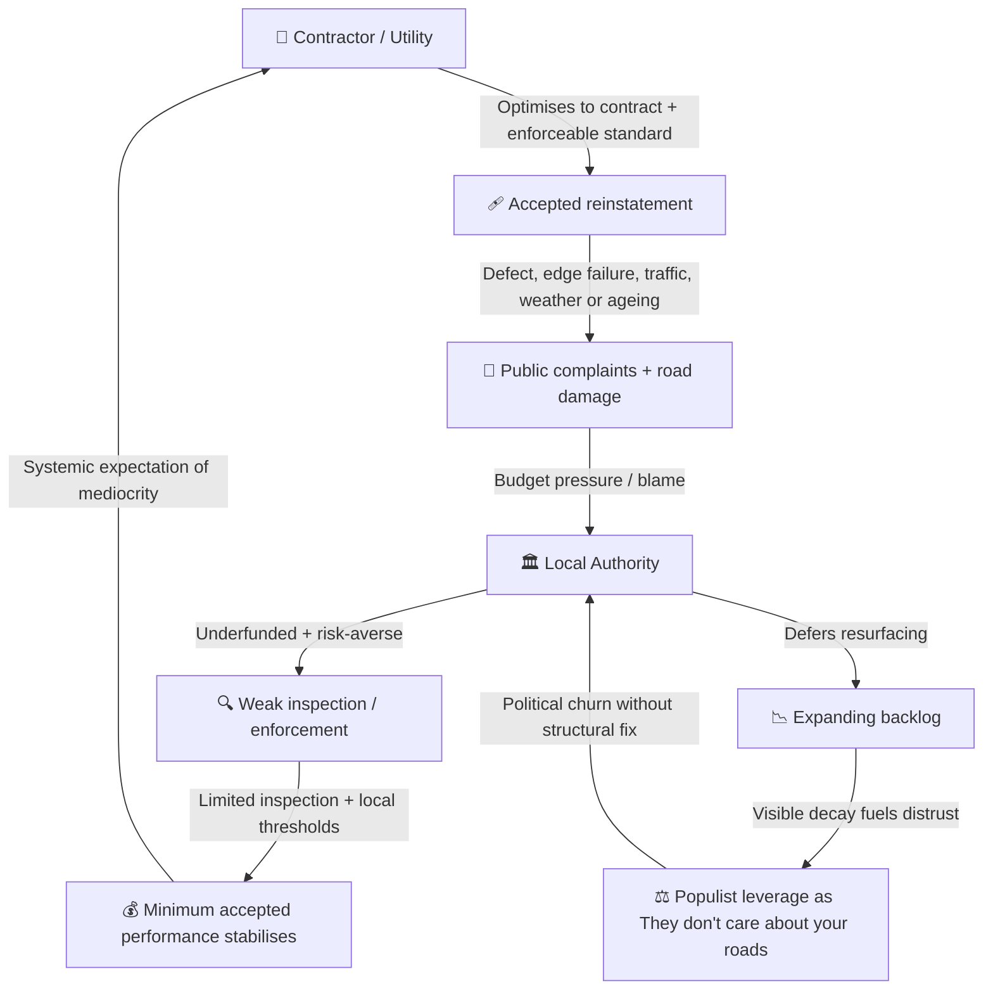
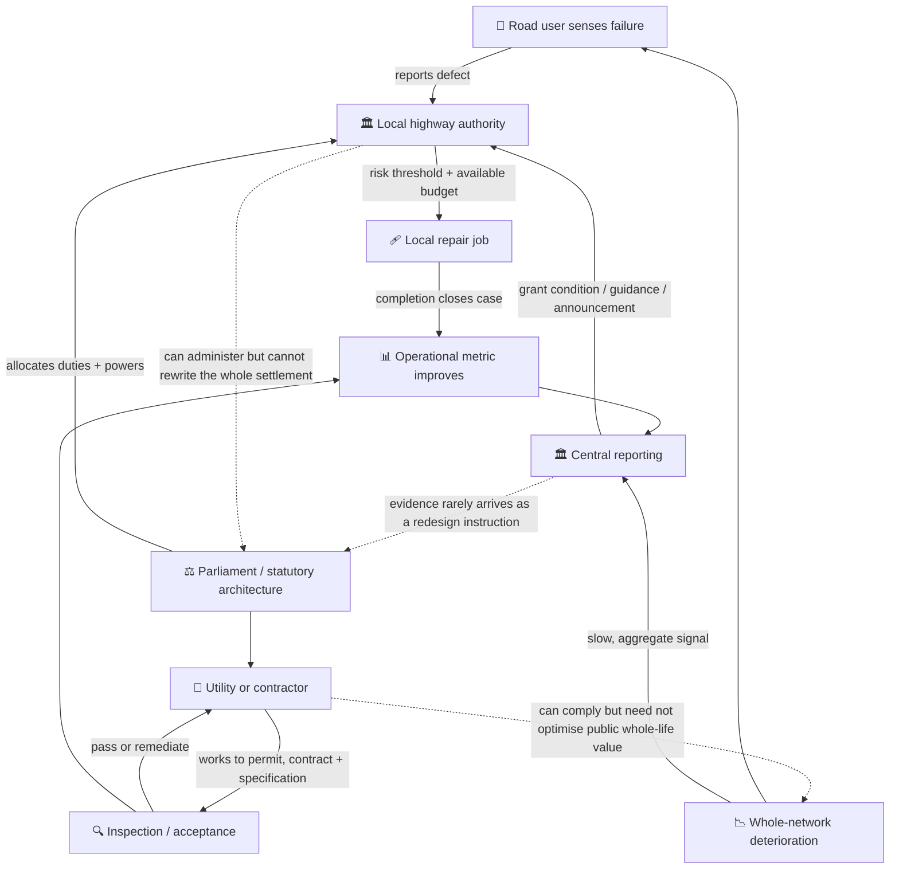

# 🕳️ The Pothole Problem  
**First created:** 2025-10-09 | **Last updated:** 2026-08-16  
*When six-hundred-year-old law meets twenty-first-century asphalt.*  

---

## 🛰️ Orientation  
The pothole is Britain’s most visible governance glitch.  
Every crater in the road exposes a deeper crater in public administration:  
a statute book that predates the Church of England, procurement logic from the turnpike age, and an enforcement regime optimised for mediocrity.  

This node maps how ancient legal sediment, weak regulatory muscle, and modern populism fuse into a perfect loop of visible neglect.

**Scope note:** the current legal and administrative analysis is principally about local roads and street works in **England**. Scotland, Wales, Northern Ireland, strategic roads, and private or unadopted roads have different institutional arrangements.

---

## 🌳 Key Features  
- Traces highway maintenance law from Tudor parish duty to post-Thatcher austerity.  
- Diagnoses the *weak-enforcement equilibrium* governing utilities and contractors.  
- Shows how neglect converts into populist political capital.

---

## ⚖️ Historical Statute Timeline — From Parish Labour to Populist Asphalt  

| Era | Key Statutes / Shifts | Structural Logic | Residue in 2025 |
|------|-----------------------|------------------|-----------------|
| **Medieval roots (pre-1500s)** | *Statute of Winchester (1285)* required routes between market towns to be cleared of obstructive growth. | Passage, order, and local obligation were entangled. | Historical ancestry, not the source of the modern maintenance test. |
| **Tudor parochial era (1555–1562)** | *Highways Act 1555* imposed parish labour and surveyor duties; later legislation adjusted the scheme. | Maintenance as a local communal burden. | An ancestor of territorial responsibility, although the modern authority is statutory and very different. |
| **Restoration (1662)** | *Highways Act 1662* tightens parish duties. | Early inspection culture. | Bureaucratic ancestry of highway surveys. |
| **Turnpike era (1700s–1830s)** | Numerous local turnpike Acts enabled toll-funded trusts; the *Highways Act 1835* then consolidated parish highway administration outside those trusts. | Mixed local, statutory, and toll-funded responsibility. | A recurring British preference for layered custodians rather than one road sovereign. |
| **Victorian consolidation (1835–1888)** | *General Highways Act 1835*; *Highways Act 1862*; *Local Gov Act 1888* → county councils take main roads. | Professionalisation + scale. | Core local-road bureaucracy still dates here. |
| **Motor age (1920–1936)** | *Roads Act 1920* → Road Fund; *Trunk Roads Act 1936* → central control. | Central/local split hardens. | Basis of National Highways vs Council divide. |
| **Post-war consolidation (1959–1980)** | *Highways Acts 1959 → 1980* consolidate a century of law. | Modern veneer on ancient frame. | **Highways Act 1980** still in force. |
| **Present (1980–2026)** | *New Roads and Street Works Act 1991*; *Traffic Management Act 2004*; statutory reinstatement specifications, permit schemes, performance-based inspections, and Street Manager. | Multiple duties and controls distributed across highway authorities, undertakers, contractors, and central government. | Modern machinery exists, but no single controller owns whole-network condition. |

**Takeaway:** Britain does not literally manage roads under Tudor law. It manages them through a modern statutory stack built on centuries of inherited divisions about who maintains, who may dig, who inspects, who pays, and what counts as “reasonable”. The joke survives legal contact: the operating system has been upgraded, but never clean-installed.

---

## 🧱 Weak Enforcement Equilibrium  

The legal machinery is more substantial than “nobody has powers”. Highway authorities have a maintenance duty under the *Highways Act 1980*. Undertakers must reinstate streets to prescribed standards under the *New Roads and Street Works Act 1991*. England also has permit schemes, Street Manager, statutory specifications, inspections, guarantee periods, defect charges, and prosecution powers.

Yet a system can contain many controls and still produce poor aggregate condition. The National Audit Office found that local-road condition was declining, the repair backlog was growing, and the Department for Transport did not understand road condition or the effects of its funding well enough. The Public Accounts Committee likewise called for stronger central leadership.

The weak equilibrium is therefore not one missing rule. It is the interaction between constrained maintenance budgets, locally set risk thresholds, deteriorating assets, disruptive street works, variable inspection capacity, and funding signals that reward visible activity more readily than avoided future failure.

| Actor | Incentive | Behaviour | Outcome |
|--------|------------|-----------|----------|
| Utility / Contractor | Complete work within cost, time, permit, and specification | Optimise to the enforceable acceptance point | Compliant work may still be less durable than whole-life network repair; defective work adds further damage |
| Local Authority | Keep roads reasonably safe within finite money and staff | Triage by risk; repair urgent defects; defer lower-priority renewal | Reactive work competes with prevention; backlog can expand |
| National Government | Fund and oversee without operating most local roads | Set grants, reporting conditions, and national regimes | National responsibility is exercised at a distance; outcomes remain locally variable |
| Road user | Obtain a safe, usable journey | Report visible defects and seek redress after harm | Feedback arrives as isolated incidents rather than a whole-network control signal |

Neglect can become policy by arithmetic even without a meeting at which anybody chooses neglect. Every actor can make a defensible local decision while the road gets worse.

---

#### 🩻 Diagram Notes — The Logic of Minimal Compliance  
This loop shows how *weak enforcement* stabilises neglect:  
each actor optimises locally, decay compounds globally.  
Contractors save, councils triage, ministers posture, voters rage.  
The pothole is not *only* a maintenance failure — it can become a **compliance artefact**:  
performance theatre in asphalt form.

---

## ♻️ Why the Law–Role Problem Does Not Repair Itself

Cybernetically, the system lacks no feedback at all. It has **too many partial feedback loops**, each terminating at the boundary of a different role.

- The road user senses the hole and reports a location.
- The authority assesses immediate risk and schedules work within its policy and budget.
- The contractor completes the instructed repair and is judged against the contract or reinstatement specification.
- The authority records inspection, completion, claims exposure, and expenditure.
- Central government receives aggregated condition and output data, then adjusts grants, guidance, or reporting requirements.
- Parliament can amend the framework, but routine operational evidence rarely arrives already translated into a legislative design problem.

Each loop can therefore report **success in its own vocabulary**:

- complaint closed;
- dangerous defect made safe;
- reinstatement passed;
- inspection regime followed;
- budget spent;
- funding announced;
- statutory duty defended by evidence of a reasonable system.

Meanwhile, the higher-order question — *is this allocation of duties producing a durable road network at acceptable whole-life cost?* — has no permanent owner with both the information and authority to redesign the whole stack.

### The Missing Meta-Controller

The missing function is not a pothole czar with a ceremonial shovel. It is a **meta-controller** able to:

1. integrate condition, repair durability, street-works, claims, climate, and whole-life cost data;
2. detect when locally reasonable decisions are producing systemically unreasonable outcomes;
3. identify whether the failure sits in funding, standards, inspection, procurement, statutory powers, or role allocation;
4. require an accountable actor to alter that layer; and
5. test whether the intervention improved road condition rather than merely improving the dashboard.

Without that loop, error is repeatedly converted into workload. The system becomes very good at processing potholes and strangely bad at needing fewer potholes.

This does not mean reform never occurs. Performance-based street-works inspections, Street Manager, longer-term funding, and new transparency requirements are real adaptations. The cybernetic criticism is narrower: adaptations are usually added **inside existing roles**, while the distribution of observation, authority, cost, and responsibility is less often redesigned as one system.

---

## 🔥 Political Resonance  
Because potholes are hyper-visible and universal, they become the perfect populist lever:  
low-information, high-anger, instantly legible.  
When a system’s failures are mapped in tyre damage rather than spreadsheets, any party promising “We’ll fix your roads” can harvest votes without fixing the structure.

---

## 🛠️ Obvious Fixes (That Somehow Aren’t Done)

The UK doesn’t need a moonshot to solve its road decay.  
It needs basic governance literacy — the kind you’d expect from a functioning procurement system.

| Fix | Description | Why It’s Obvious | Why It Hasn’t Happened |
|------|--------------|------------------|------------------------|
| **1. Whole-System Outcome Framework** | Join maintenance, street-works, durability, claims, and condition data without pretending strategic and local roads are identical. | Reveals whether activity produces durable network outcomes. | Data and authority sit across different institutions. |
| **2. Stronger Reinstatement Guarantees or Financial Security** | Extend or strengthen liability where evidence shows current guarantee periods and remedies underprice later failure. | Makes durability financially legible. | Requires evidence on causation, cost, and effects on essential utility work. |
| **3. Independent Inspection Pool** | Rotating regional inspectors (not council-staff) audit 5% of repairs monthly. | Restores credibility; data for public dashboards. | Funding optics — “too bureaucratic.” |
| **4. Complete the Digital Coordination Layer** | Extend the existing Street Manager system and close gaps such as works that are not consistently captured. | Improves coordination and makes repeated excavation easier to detect. | A national service exists; completeness, interoperability, and use remain the live questions. |
| **5. Durable-Outcome Repair Ledger** | Publish reported defects, treatment type, recurrence, and subsequent condition—not just counts filled. | Turns complaint data into learning rather than a productivity theatre. | Comparable outcome data are harder and politically less flattering than activity counts. |
| **6. Ring-fenced Road Fund 2.0** | Hypothecate a share of fuel duty or EV road levy directly to maintenance. | Predictable funding cycle; long-term planning possible. | Treasury refuses earmarks; prefers annual drama. |
| **7. Performance-Based Procurement** | Tie suitable payment and renewal decisions to durability and whole-life value, with weather and third-party damage properly allocated. | Rewards lasting work rather than completion alone. | Contract design, attribution, and monitoring are harder than counting jobs. |
| **8. Stronger Utility Coordination** | Use permits, Street Manager, protected-road controls, and joint planning to reduce avoidable repeat excavation. | One trench where practicable; fewer conflicting works. | Coordination powers already exist, but incentives, emergencies, data quality, and infrastructure cycles do not always align. |
| **9. National Skills Pool for Maintenance** | Portable accreditation and wage parity across councils. | Stabilises quality; reduces local skill shortages. | Public-sector wage caps + fragmented HR systems. |
| **10. Climate-Resilient Surfacing Trials** | Pilot new materials with drainage and freeze-thaw tolerance. | Reduces recurrence under extreme weather. | Innovation budgets cut; lowest-bid procurement blocks adoption. |

Most of this toolkit already exists in partial form or has close policy precedents. None requires new physics. It does require better causal evidence, patient funding, enforcement capacity, and an institution authorised to learn across the boundaries.

---

## 💫 Summary Insight  

The persistence of failure cannot be reduced to ignorance, or attributed wholesale to political convenience. It is sustained by fragmented control, short political and budget cycles, weak whole-life feedback, and the genuine difficulty of assigning causation across weather, traffic, ageing, maintenance, excavation, and repair.

But political convenience matters. A fresh funding announcement is visible immediately; a pothole prevented through ten years of asset management has no ribbon to cut. In the economics of optics, **repairing the same road twice** can be easier to narrate than quietly making the second repair unnecessary.

---

## 📚 Sources

The diagrams in this node are **Polaris analytical models**. They describe feedback and responsibility structures; they do not establish that every pothole results from utility work, contractor failure, weak inspection, or political choice.

### Sources Cited Directly in This Node

- [UK legislation — Highways Act 1980](https://www.legislation.gov.uk/ukpga/1980/66/contents)
- [UK legislation — New Roads and Street Works Act 1991](https://www.legislation.gov.uk/ukpga/1991/22/contents)
- [UK legislation — Traffic Management Act 2004](https://www.legislation.gov.uk/ukpga/2004/18/contents)
- [Department for Transport — Specification for the reinstatement of openings in highways](https://www.gov.uk/government/publications/how-to-reinstate-a-road-after-doing-street-works)
- [Department for Transport — Code of practice for street-works inspections](https://www.gov.uk/government/publications/street-works-inspections)
- [Department for Transport — Plan and manage roadworks using Street Manager](https://www.gov.uk/guidance/plan-and-manage-roadworks)
- [House of Commons Library — Street works in England](https://commonslibrary.parliament.uk/research-briefings/cbp-8500/)
- [UK Parliament — Turnpikes and tolls](https://www.parliament.uk/about/living-heritage/transformingsociety/transportcomms/roadsrail/overview/turnpikestolls/)
- [National Audit Office — The condition and maintenance of local roads in England](https://www.nao.org.uk/reports/the-condition-and-maintenance-of-local-roads-in-england/)
- [Public Accounts Committee — Condition and maintenance of local roads in England](https://publications.parliament.uk/pa/cm5901/cmselect/cmpubacc/349/report.html)
- [Department for Transport — Highway maintenance funding guidance for local authorities, 2025–26](https://www.gov.uk/government/publications/highway-maintenance-funding-guidance-for-local-authorities/letter-to-local-authorities-about-local-highway-maintenance-funding-in-2025-to-2026)
- [House of Commons Library — Condition of roads in rural areas](https://commonslibrary.parliament.uk/research-briefings/cbp-10586/)
- [BBC News — Pothole claims up 90% in three years, says RAC](https://www.bbc.co.uk/news/articles/clyzyww1jp2o)

---

## 🌌 Constellations  
🕳️ 🧱 🧿 🛰️ — Legal sediment → incentive decay → political capture.

## ✨ Stardust  
highways act 1555, highways act 1980, procurement failure, weak enforcement, utilities reinstatement, governance decay, infrastructure neglect, populist leverage, risk economy, compliance artefact, road repair reform

---

## 🏮 Footer  

*🕳️ The Pothole Problem* is a living node of the Polaris Protocol.  
It traces the persistence of Tudor-era road law through modern procurement loops to reveal how visible neglect becomes political currency.  

> 📡 Cross-references:
> 
> - [⛪️ Faith Land Trusts as Counter-Radicalisation Infrastructure](./⛪️_faith_land_trusts_as_counter_radicalisation_infrastructure.md) — custodianship designed around durable civic function.  
> - [🏛️ R.A.A.C. — Ruins and Architectural Committee](./🏛️_raac_ruins_squad.md) — maintenance backlog and the politics of visible structural decay.  
> - [🌳 The Lads Are Not Pro Countryside](./🌳_the_lads_are_not_pro_countryside.md) — the gap between territorial branding and material stewardship.  
>  
> 🏮 Return To:
>
> - [👑 Ownership & Control](./README.md)
> - [♻️ Cybernetics](../README.md)  
> - [🪿 Embodied Information Ecology](../../README.md)
> - [🌑 Origin Points](../../../README.md)
> - [🌌 Polaris Protocol - Root](../../../../README.md)  

*Survivor authorship is sovereign. Containment is never neutral.*  

_Last updated: 2026-08-16_
