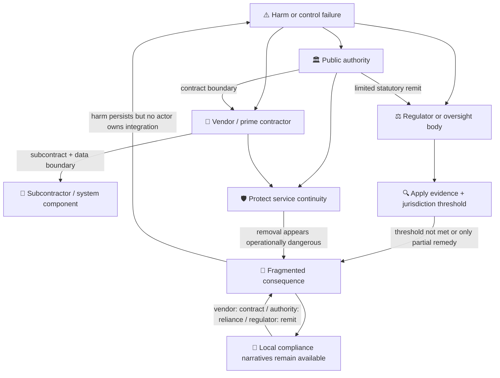

# 🛡️ Constructed Immunity  
**First created:** 2025-11-12 | **Last updated:** 2026-08-24  
*How accountability dissolves when responsibility fragments across legal, contractual, and reputational layers.*

---

## 🛰️ Orientation  

Constructed immunity does not refer to formal legal exemption.

It describes a structural condition in which consequence becomes difficult — or practically impossible — to assign because responsibility is distributed across overlapping domains.

In complex public-private systems, protection is not granted in a single statute.  
It emerges from:

- Jurisdictional layering  
- Procurement dependence  
- Contractual opacity  
- Reputational containment  
- Mandate fragmentation  

No single actor may be immune in law.  
But the system, taken as a whole, becomes resistant to consequence.

This is operational immunity through ownership diffusion.

**Constructed immunity is a diagnostic hypothesis, not a legal status or finding of misconduct.** Similar outward effects can also arise from lawful confidentiality, evidential uncertainty, due process, resource constraint, or genuinely divided jurisdiction. The analysis becomes useful only when it identifies the actual mechanism rather than treating every obstacle as proof of concealment.

---

## 👑 Custody Collapse  

Accountability requires a named custodian of consequence.

Constructed immunity arises when:

- Liability is divided across entities.  
- Oversight bodies see only partial systems.  
- Enforcement depends on actors embedded within the structure.  
- Risk is externalised downward.  

Each participant can plausibly claim limited responsibility.

No participant owns the integrated harm.

This is not necessarily conspiratorial.  
It is architectural.

---

## 🧱 Core Mechanisms  

### 1️⃣ Jurisdictional Layering  

Liability is fragmented across:

- Multiple corporate entities  
- Prime ↔ subcontractor chains  
- Cross-border data flows  
- Conflicting regulatory regimes  

Each forum sees only a slice.

When no single forum can view the full chain of causation, decisive action becomes procedurally complex.

*Outcome:* accountability dissolves into coordination failure.

---

### 2️⃣ Contractual Silence Architecture  

Operational immunity is reinforced by:

- NDAs with asymmetric penalties  
- Non-disparagement clauses  
- Confidential procurement frameworks  
- “Commercial sensitivity” exemptions  

These do not merely silence insiders.

They can shape what colleagues, the public, journalists, contracting authorities, and oversight bodies are readily able to access. But their reach is not unlimited: an agreement cannot lawfully prevent a protected whistleblowing disclosure, and confidentiality does not automatically defeat statutory investigatory powers.

Opacity becomes systemic, not incidental.

---

### 3️⃣ Procurement Lock-In  

When suppliers become:

- Embedded in critical infrastructure  
- Operationally irreplaceable on short timelines  
- Integrated across departments  

oversight can be reframed as systemic risk.

Regulation begins to appear destabilising rather than corrective.

The system protects continuity over scrutiny.

Government’s own sourcing rules recognise this dependency problem. Critical suppliers may be required to provide resolution-planning information precisely because service continuity can otherwise narrow the public authority’s practical choices.

---

### 4️⃣ Reputational Containment Reflex  

Before formal litigation arises, deterrence often occurs through:

- Legal correspondence  
- Risk signalling  
- Narrative framing  
- Credibility challenges  

This upstream containment reduces the likelihood of formal review.

Again, not necessarily through coordinated intent —  
but through rational risk minimisation under asymmetric exposure.

---

### 5️⃣ Too-Embedded-to-Discipline  

At scale, certain actors become:

- Too central to remove  
- Too complex to audit fully  
- Too intertwined to isolate cleanly  

This produces a paradox:

The more critical the actor becomes,  
the harder it is to hold them accountable without destabilising the host system.

Functional immunity emerges without legal declaration.

Carillion is an important bounded example of the dependency mechanism, not proof of the whole theory. At liquidation it was involved in hundreds of public-sector contracts, requiring government contingency action to preserve services. That demonstrates how supplier failure can become a public-system risk; it does not establish that every embedded supplier is immune from discipline.

---

## 🧠 Systemic Effects  

Constructed immunity produces predictable downstream patterns:

- Harm becomes unattributable or diffused.  
- Oversight bodies inherit structural blind spots.  
- Compliance theatre replaces structural correction.  
- Victims are reframed as anomalies.  
- Correction is delayed until external pressure outweighs continuity risk.

Importantly, this can occur without bad faith.

It is the result of misaligned custodial architecture.

### How the Immunity Is Constructed

No single arrow grants immunity. The effect appears when several individually intelligible controls reinforce one another:

1. **Fragmentation reduces visibility.** Each actor observes only the evidence held within its system or supplied through a defined gateway.
2. **Thresholds convert incomplete evidence into inaction.** A regulator or court may properly require proof that the fragmented record cannot yet supply.
3. **Dependency raises the cost of intervention.** Suspension, termination, or disclosure may threaten continuity, security, litigation position, or essential services.
4. **Local compliance supplies defensible explanations.** Each actor can point to the contract, remit, process, or advice governing its slice.
5. **No integrator owns recurrence.** The harm returns as another complaint, incident, audit finding, or contract-management problem rather than as an instruction to redesign the arrangement.

The key cybernetic failure is therefore a **broken consequence loop**. Information about harm enters the system, but the authority to assemble it and change the architecture sits elsewhere—or nowhere.

---

## ⚖️ Ownership Drift in Practice  

When harm surfaces, responsibility is often routed as follows:

- Vendor: “We operate within contract.”  
- Department: “We relied on supplier expertise.”  
- Regulator: “This falls outside our statutory remit.”  
- Contractor: “Prime contractor owns integration.”  
- Ministerial office: “Operational matter.”  

Each statement may be accurate locally.

Systemically, ownership vanishes.

That dialogue is illustrative, not a quotation from any named institution. Its evidential value lies in the recurring allocation pattern, which must still be demonstrated in each real case.

This is the essence of constructed immunity:

> Consequence has no single integrator.

---

## 🛠️ Design-Level Countermeasures  

Constructed immunity is not inevitable.

Architectural repair requires:

- Named cross-entity harm custodians.  
- Mandatory integration reviews across prime and subcontractors.  
- Transparency floors that override commercial sensitivity in rights-impact cases.  
- Procurement clauses that assign downstream reliance liability explicitly.  
- Escalation pathways independent of embedded actors.  
- Exit, substitution, and resolution plans for critical suppliers.  
- Audit and information rights that travel through the subcontracting chain.  
- A duty to record who owns integrated harm when several remits are engaged.  

The core intervention is simple in theory:

Align ownership of value capture with ownership of risk.

---

## 🧭 Diagnostic Lens  

Use this node to examine:

- Where does responsibility fracture?  
- Who captures value vs who absorbs risk?  
- Which silences are contractual vs cultural?  
- What would structurally fail if accountability were enforced?  
- Is the system protecting continuity over consequence?

Constructed immunity is rarely declared.

It is assembled through drift.

### Evidence Ladder

Do not jump from friction to conspiracy. Test the mechanism in order:

| Observation | What it may establish | What it does not establish alone |
|---|---|---|
| Several bodies have partial roles | Fragmented responsibility | That nobody has power or that roles were designed to obstruct |
| Information is withheld as commercially sensitive | A claimed confidentiality or FOI basis | That section 43 applies, outweighs the public interest, or conceals wrongdoing |
| A supplier is difficult to replace | Operational dependency | Corruption, immunity in law, or deliberate capture |
| Enforcement is delayed or limited | Threshold, capacity, priority, or remit friction | Improper influence without further evidence |
| The same harm recurs across boundaries | A likely integration failure | A shared intention among every participant |

---

## 📚 Sources

The diagrams and the term **constructed immunity** are Polaris analytical models. They organise questions about practical accountability; they do not create a legal category or transfer findings from one contract, institution, or jurisdiction to another.

### Sources Cited Directly in This Node

- [Cabinet Office — The Sourcing Playbook](https://www.gov.uk/government/publications/the-sourcing-and-consultancy-playbooks/the-sourcing-playbook-html)
- [Cabinet Office — Risk Allocation and Pricing Approaches guidance](https://www.gov.uk/government/publications/the-sourcing-and-consultancy-playbooks/risk-allocation-and-pricing-approaches-guidance-note-html)
- [Cabinet Office — Corporate Financial Distress guidance](https://www.gov.uk/government/publications/the-sourcing-and-consultancy-playbooks/corporate-financial-distress-guidance-note-html)
- [Cabinet Office — Digital, Data and Technology Playbook](https://www.gov.uk/government/publications/the-digital-data-and-technology-playbook/the-digital-data-and-technology-playbook-html)
- [National Audit Office — Investigation into the government’s handling of the collapse of Carillion](https://www.nao.org.uk/reports/investigation-into-the-governments-handling-of-the-collapse-of-carillion/)
- [National Audit Office — Managing the risks of legacy ICT to public service delivery](https://www.nao.org.uk/wp-content/uploads/2013/09/10154-001-Managing-the-risk-of-legacy-ICT-Book-Copy2.pdf)
- [Public Administration and Constitutional Affairs Committee — After Carillion: Public sector outsourcing and contracting](https://publications.parliament.uk/pa/cm201719/cmselect/cmpubadm/748/74802.htm)
- [Public Accounts Committee — Contracting out public services to the private sector](https://publications.parliament.uk/pa/cm201314/cmselect/cmpubacc/777/777.pdf)
- [ICO — Freedom of Information Act section 43: commercial interests](https://ico.org.uk/for-organisations/foi/freedom-of-information-and-environmental-information-regulations/section-43-commercial-interests/)
- [UK Government — Whistleblowing guidance for employers](https://www.gov.uk/guidance/whistleblowing-guidance-for-employers)
- [UK Government — Victims and Prisoners Act 2024: changes to non-disclosure agreements](https://www.gov.uk/government/publications/victims-and-prisoners-act-2024-changes-to-non-disclosure-agreements/victims-and-prisoners-act-2024-changes-to-non-disclosure-agreements)

---

## 🌌 Constellations  

🛡️ 👑 ⚖️ 🧱 💰 — ownership diffusion, mandate misfit, procurement gravity, incentive alignment, systemic protection.

---

## ✨ Stardust  

constructed immunity, ownership collapse, mandate fragmentation, procurement lock-in, jurisdictional layering, reputational containment, operational impunity, cross-entity accountability, governance architecture

---

## 🏮 Footer  

*🛡️ Constructed Immunity* is a living diagnostic node of the Polaris Protocol.  
It makes visible the architectures through which consequence dissolves when responsibility fragments across legal, contractual, and reputational domains.

> 📡 Cross-references:
> 
> - [⚖️ The Architecture of Complicity](./⚖️_architecture_of_complicity.md) — *how participation accumulates across apparently limited roles*  
> - [🤫 Collective Risk Silence Loop](./🤫_collective_risk_silence_loop.md) — *how locally rational silence suppresses system-level warning*  
> - [👑 Soft Power Accountability Gap](./👑_soft_power_accountability_gap.md) — *influence that exceeds the accountability attached to it*  
> - [👑 Asserting Sovereignty After Allied Interference](./👑_asserting_sovereignty_after_allied_interference.md) — *restoring decision authority across friendly-state entanglement*  
> - [🧬 Distributed Complicity in Modern Warfare](./🧬_distributed_complicity_in_modern_warfare.md) — *responsibility distributed through modern operational chains*  
> - [🐴 The Legality of Gift Horses](./🐴_the_legality_of_gift_horses.md)  
>  
> 🏮 Return To:
>
> - [👑 Ownership & Control](./README.md)
> - [♻️ Cybernetics](../README.md)  
> - [🪿 Embodied Information Ecology](../../README.md)
> - [🌑 Origin Points](../../../README.md)
> - [🌌 Polaris Protocol - Root](../../../../README.md)  

*Survivor authorship is sovereign. Containment is never neutral.*  

_Last updated: 2026-08-24_
