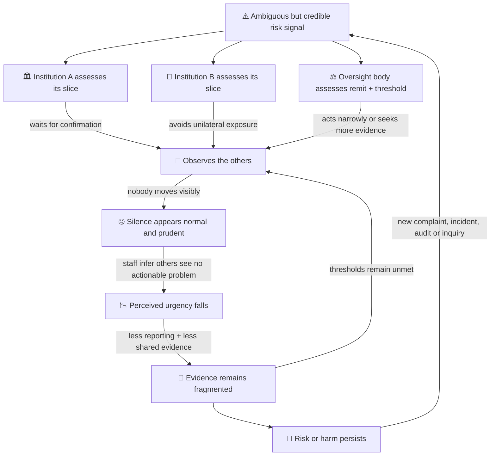

# 🤫 Collective Risk Silence Loop  
**First created:** 2025-11-12 | **Last updated:** 2026-08-16  
*How shared exposure and fragmented ownership produce sector-wide silence without coordination.*

---

## 🛰️ Orientation  

The **collective risk silence loop** describes a governance equilibrium that forms when multiple institutions share exposure to potential liability — and no single actor is mandated to integrate or resolve the risk.

No agreement is required.  
No conspiracy is necessary.

Silence stabilises when disclosure by any one party increases risk for all, and no actor holds clear custodial authority over systemic consequence.

This is not simply cultural hesitation.  
It is ownership misalignment under shared exposure.

The model does **not** assume that every actor knows the same facts, privately agrees that wrongdoing occurred, or deliberately joins a cover-up. Shared silence may be produced by different combinations of uncertainty, fear, lawful confidentiality, remit boundaries, reputational calculation, and mistaken beliefs about what everybody else thinks.

---

## 👑 Shared Exposure Without Shared Custody  

The loop activates when multiple actors are implicated in:

- Data contamination  
- Regulatory failure  
- Joint procurement chains  
- Cross-institutional reliance  
- Tort exposure  
- Rights-impacting misclassification  

Each actor may have:

- Partial knowledge  
- Partial liability  
- Partial control  

No actor owns the full causal chain.

Without a designated integrator of shared consequence, the rational default becomes containment.

Or, more precisely: containment may become the locally safest available action even when it is collectively unsafe.

---

## 🧩 The Mandate Misfit  

Oversight systems are typically organised around:

- Institutional boundaries  
- Sector-specific regulation  
- Statutory remit limitations  
- Individualised liability  

Collective exposure does not map neatly onto these structures.

When risk spans:

- Public and private actors  
- Multiple regulators  
- Cross-border jurisdictions  
- Contractor and subcontractor networks  

mandate fragmentation produces silence by default.

Each body may be able to act within scope. Whether any body can reconcile the full exposure field must be established case by case; the recurring risk is that investigatory access, remedial authority, and ownership of the combined outcome do not sit together.

---

## 🧠 Loop Mechanics  

### Step 1: Trigger Event  

A credible signal emerges:
- Allegation  
- Litigation threat  
- Audit anomaly  
- Media inquiry  
- Whistleblower disclosure  

The key feature is shared vulnerability — not confirmed wrongdoing.

---

### Step 2: Independent Risk Calculation  

Each actor evaluates:

- “Does this implicate us?”  
- “What precedent would disclosure establish?”  
- “What happens if we speak first?”  

Speaking concentrates risk.  
Silence distributes it.

That is an incentive claim, not a universal rule. In regulated settings, mandatory reporting duties or delayed disclosure can reverse the calculation.

---

### Step 3: Mutual Observation  

Actors monitor:

- Who comments  
- Who defers  
- How regulators respond  
- Whether enforcement escalates  

If no actor breaks ranks, silence begins to appear prudent rather than evasive.

---

### Step 4: Defensive Equilibrium  

Silence stabilises when:

- Disclosure carries concentrated penalty.  
- Non-disclosure appears professionally normal.  
- Oversight bodies act narrowly within remit.  
- No actor is rewarded for integrative admission.

At this stage, silence becomes structural — not strategic.

### Why the Loop Is Self-Sealing

Silence removes the very social evidence that might tell hesitant actors they are not alone. Each actor then reads the absence of visible dissent as information:

> If this were really serious, surely somebody with more authority or evidence would already have acted.

But every observer may be making the same inference from everybody else’s caution. This resembles **pluralistic ignorance**: private concern coexists with a mistaken belief that others are less concerned. Organisational research also describes how shared beliefs that speaking is unsafe or futile can produce collective withholding of information.

The cybernetic consequence is severe. The system uses **silence as a negative signal**—evidence that risk is low—even though silence is partly generated by the system’s own penalties for speaking. Its sensor suppresses its own output, then the controller cites the quiet sensor as reassurance.

---

## ⚖️ Structural Reinforcers  

### 1️⃣ Asymmetric Penalties  

- First disclosure may increase legal, employment, reputational, or relational exposure.  
- Later disclosure may be framed as cooperation or compliance—although delay can also aggravate liability.  

The first mover bears disproportionate risk.

---

### 2️⃣ Precedent Fear  

Public acknowledgment may:

- Expand duty-of-care expectations.  
- Redefine “reasonable knowledge.”  
- Reopen closed liabilities.  

Institutions avoid becoming the precedent setter.

These consequences are context-dependent. Acknowledgment does not automatically create a new legal duty, and fear of precedent should not be confused with proof that such a duty would arise.

---

### 3️⃣ Jurisdictional Fragmentation  

- Joint and several liability regimes.  
- Discovery exposure.  
- Conflicting regulatory interpretations.  

Fragmented oversight reduces incentive to act unilaterally.

---

### 4️⃣ Cultural Professionalism Norms  

- “Ongoing process.”  
- “No comment.”  
- “Awaiting further clarification.”  

Silence acquires legitimacy through professional language.

The phrases are illustrative. Each can also describe a legitimate procedural position; the diagnostic question is whether it preserves necessary care or repeatedly prevents actionable information from reaching a decision-maker.

---

## 🧿 Relationship to Ownership & Control  

The collective risk silence loop is a symptom of custody collapse.

It forms when:

- Consequence has no single owner.  
- Cross-boundary integration lacks mandate.  
- Speaking carries concentrated exposure.  
- Silence preserves distributed ambiguity.  

This loop explains why:

- Cover-ups appear decentralised.  
- Reform stalls despite shared knowledge.  
- External legitimacy pressure becomes decisive.  

Silence is not centrally orchestrated.

It is equilibrium under fragmented ownership.

---

## 🛠 Breakpoints  

The loop can destabilise when:

- One actor gains a protected, confidential, or mandatory route to disclose.  
- Whistleblower protections are trusted and enforceable in practice, not merely available on paper.  
- External jurisdiction compels disclosure.  
- Statutory reform assigns cross-silo integration authority.  
- Several actors disclose together, reducing first-mover exposure.  
- Independent investigation assembles evidence that no participant could lawfully or practically integrate alone.  
- Leaders reward bad news early and punish retaliation rather than embarrassment.  

The loop rarely breaks through moral appeal alone.

It breaks when incentive architecture changes.

---

## 🧭 Diagnostic Questions  

- Who owns the integrated exposure across institutions?  
- Is any actor mandated to act beyond their local remit?  
- What penalty does the first discloser face?  
- What would change if silence were treated as contributory risk?  

If no actor can answer for the whole,  
silence is predictable.

### Evidence Ladder

| Observation | Plausible interpretation | What is not established alone |
|---|---|---|
| Several bodies do not comment | Lawful confidentiality, uncertainty, common caution, or defensive silence | Coordination or shared knowledge |
| Staff express concern privately but not publicly | Fear, futility, loyalty, uncertainty, or professional duty | That the concern is factually correct |
| Similar holding language appears across institutions | Shared professional norms or copied communications practice | A common instruction or conspiracy |
| Reports repeatedly stop at remit boundaries | Integration failure or incorrect routing | Deliberate suppression by every body involved |
| A protected disclosure triggers retaliation or credible detriment | A strong speaking-up failure requiring investigation | The truth of every underlying allegation |

---

## 📚 Sources

The **collective risk silence loop** and its diagram are Polaris analytical models. They describe a mechanism that should be tested against documents, timelines, duties, and decision pathways in each case; silence itself is not proof of agreement, knowledge, or wrongdoing.

### Sources Cited Directly in This Node

- [Morrison and Milliken — “Organizational Silence: A Barrier to Change and Development in a Pluralistic World”](https://doi.org/10.5465/amr.2000.3707697)
- [Edmondson — “Psychological Safety and Learning Behavior in Work Teams”](https://doi.org/10.2307/2666999)
- [Miller and Prentice — “Collective Errors and Errors About the Collective”](https://doi.org/10.1177/0146167294205011)
- [UK Government — Whistleblowing guidance for employers](https://www.gov.uk/guidance/whistleblowing-guidance-for-employers)
- [UK Government — Whistleblowing guidance for prescribed persons](https://www.gov.uk/guidance/whistleblowing-for-prescribed-persons)
- [UK Government — Whistleblowing in the NHS: independent review](https://www.gov.uk/government/groups/whistleblowing-in-the-nhs-independent-review)
- [Monitor — Sir Robert Francis’ Freedom to Speak Up review](https://www.gov.uk/government/publications/sir-robert-francis-freedom-to-speak-up-review)
- [Department of Health and Social Care — Learning not blaming](https://www.gov.uk/government/publications/learning-not-blaming-response-to-3-reports-on-patient-safety/)
- [Single Source Regulations Office — Whistleblowing policy](https://www.gov.uk/government/publications/ssro-whistleblowing-policy)

---

## 🌌 Constellations  

🤫 👑 ⚖️ 🧱 🧠 — shared exposure, mandate misfit, custody collapse, defensive equilibrium, distributed accountability.

---

## ✨ Stardust  

collective silence, shared liability, mandate misalignment, ownership diffusion, defensive equilibrium, cross-sector risk, integration failure, governance incentive loop

---

## 🏮 Footer  

*🤫 Collective Risk Silence Loop* is a living node of the Polaris Protocol.  
It describes how sector-wide silence stabilises when exposure is shared but consequence lacks a named custodian — and why reform requires structural integration authority rather than appeals to transparency alone.

> 📡 Cross-references:
> 
> - [🛡️ Constructed Immunity](./🛡️_constructed_immunity.md) — practical impunity produced by fragmented consequence.  
> - [⚖️ The Architecture of Complicity](./⚖️_architecture_of_complicity.md) — how participation accumulates across limited roles.  
> - [👑 Soft Power Accountability Gap](./👑_soft_power_accountability_gap.md) — influence that exceeds its attached accountability.  
> - [👑 Asserting Sovereignty After Allied Interference](./👑_asserting_sovereignty_after_allied_interference.md) — restoring decision authority across friendly-state entanglement.  
> - [🧬 Distributed Complicity in Modern Warfare](./🧬_distributed_complicity_in_modern_warfare.md) — responsibility and knowledge distributed through operational chains.  
>  
> 🏮 Return To:
>
> - [👑 Ownership & Control](./README.md)
> - [♻️ Cybernetics](../README.md)  
> - [🪿 Embodied Information Ecology](../../README.md)
> - [🌑 Origin Points](../../../README.md)
> - [🌌 Polaris Protocol - Root](../../../../README.md)  

*Survivor authorship is sovereign. Containment is never neutral.*  

_Last updated: 2026-08-16_
