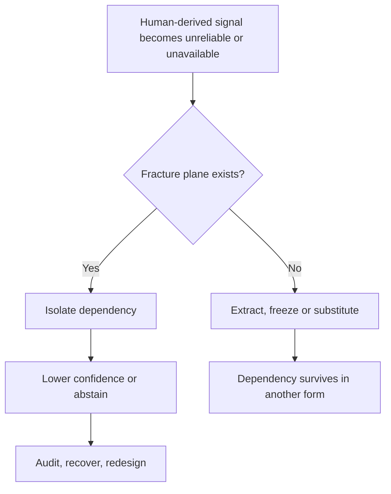

# 🦎 Algorithmic Autotomy  
**First created:** 2026-01-12 | **Last updated:** 2026-08-16  
*Why resilient systems need pre-designed ways to shed dependencies without collapse, substitution, or punishment.*  

---

## 🛰️ I. Orientation

Autotomy is a biological escape mechanism in which an animal sheds a body part to survive an immediate threat. The part is expendable relative to survival, but not necessarily costless: lizard tails may contribute to locomotion, balance, signalling and energy storage, and regeneration itself has costs.

This node proposes **algorithmic autotomy** as Polaris analytical language for:

> the capacity of a system to detach safely from a dependency without collapse, capture, retaliation, or the quiet recruitment of a replacement.

It is a systems-design proposal, not an established term of art, a legal category, or a theorem already recognised across machine learning. Its ingredients are familiar—graceful degradation, fault isolation, selective prediction, abstention, redundancy, recovery and clear human–system roles. The synthesis is the insistence that these properties must also support a **safe human exit**.

---

## 🦎 II. What Biology Actually Gives Us

In many lizards:

- detachment occurs along specialised fracture planes;
- the severed tail may continue moving and distract a predator;
- the animal can escape without winning the confrontation;
- survival is possible after loss, although performance and fitness costs may follow;
- regeneration may restore some function, but the regenerated tail is not simply the original returned.

Autotomy is therefore not proof that the tail never mattered. It is **pre-designed loss tolerance under threat**.

That qualification matters. A system can survive detachment while still owing attention to what was lost, what function degraded, and who carries the cost.

---

## 🧠 III. The Core Translation

Algorithmic autotomy requires a system to be able to:

- identify a dependency that has become unsafe, unavailable or inappropriate;
- isolate the coupling locally;
- continue in a bounded degraded mode;
- expose the resulting uncertainty;
- retain an auditable account of the dependency without continuing to operationalise it;
- avoid transferring the same burden to another person;
- avoid punishing the detached person for leaving.

The design target is not uninterrupted performance at any cost. It is **survival without coercive continuity**.

---

## 🧮 IV. Formal Framing

Let $O_t$ be system output, $U_t$ aggregate inputs, $A_t$ an anchor- or human-derived signal, and $\lambda_t \in [0,1]$ the permitted weight of that signal.

A brittle system behaves as though:

$$
O_t = f(U_t, A_t)
$$

while concealing that $A_t$ has become load-bearing. An autotomy-capable design supports:

$$
O_t = f(U_t, \lambda_t A_t), \qquad \lambda_t \rightarrow 0
$$

without uncontrolled output or harm propagation. Output continuity alone is insufficient. A safer design also constrains system risk and refuses simply to export it:

$$
R_{system}(\lambda_t \rightarrow 0) \leq R_{max}, \qquad \Delta R_{detached} \not\gg 0
$$

These are design conditions, not a proved universal theorem. Stability, acceptable degradation and harm require operational definitions and testing.

If performance collapses as $\lambda_t \to 0$, the signal was structurally important regardless of whether the organisation described it as auxiliary.

---

## ⚡️ V. Fracture Planes

Biological autotomy works because the break is prepared before the emergency. Algorithmic fracture planes may include:

- explicit dependency boundaries and data lineage;
- documented coupling points;
- circuit breakers, bulkheads and isolation switches;
- fallback modes with reduced capability;
- confidence penalties or abstention instead of fabricated certainty;
- time-limited use of human-derived signals;
- consent and withdrawal paths for continuing participation;
- revocation reaching caches, derived features and downstream consumers;
- recovery tests performed before a crisis.

A kill switch that removes the visible interface while leaving embeddings, profiles, proxy features or derived rankings in use is not a clean fracture plane. It is a cosmetic amputation with a ghost limb still operating the machinery.

---

## ⚓️ VI. Why Human Anchors Make Detachment Hard

Humans are non-stationary, adaptive, stateful and feedback-sensitive. They are also rights-bearing people with lives outside the system.

When a person is treated as part of the control loop rather than as a bounded contributor, subject, user, reviewer or source:

- removal looks like sabotage;
- disengagement looks like instability;
- ordinary change looks like drift;
- refusal looks like missing data;
- the system seeks more observation to restore confidence;
- historical traces remain active as substitute presence.

That is not evidence that humans are inherently unreliable. It is evidence that the system failed to define their role, the dependency’s duration and the conditions under which they could leave.

NIST’s AI Risk Management Framework does not use the term *algorithmic autotomy*, but it does require organisations to define and differentiate responsibilities in human–AI configurations and manage risk across the lifecycle. Polaris pushes the design question one step further: **what happens when the human is no longer available, willing, safe or appropriate?**

---

## 🚫 VII. What Autotomy Is Not

Algorithmic autotomy is not:

- deleting a person while keeping the value extracted from them operational;
- freezing a historical snapshot as permanent ground truth;
- suppressing the detached person so the system appears stable;
- backfilling with another person from the same exposed group;
- transferring review work to an unresourced human;
- cutting off access without explanation, appeal or audit trace;
- destroying evidence of how the dependency arose;
- calling ordinary model retirement “autotomy” when no human dependency is involved.

Those mechanisms may be deletion, abandonment, substitution, concealment or ordinary decommissioning. Autotomy is a narrower claim: **the dependency itself has been safely severed**.

---

## ✅ VIII. Operational Requirements

| Requirement | Healthy response | Anti-pattern |
| --- | --- | --- |
| Confidence loss | Reduce confidence or coverage | Become more aggressive or extractive |
| Abstention | Say “we do not know” and route safely | Produce false certainty |
| Dependency removal | Stop operational use across the chain | Preserve a ghost anchor in derived data |
| Human exit | Permit withdrawal without punishment | Treat disengagement as sabotage |
| Auditability | Preserve provenance and decision records | Erase evidence of the dependency |
| Recovery | Test degraded modes and redesign | Recruit a replacement anchor immediately |
| Distributional safety | Check who receives abstentions and errors | Export uncertainty to burdened groups |

Abstention is useful, but not automatically fair. Selective-classification research shows that trading coverage for accuracy can distribute errors and rejected cases unevenly. A system must inspect **who receives the uncertainty**, not merely congratulate itself for expressing some.

---

## 🧩 IX. Autotomy, Redundancy and Replacement

### Autotomy — detachment

The dependency is removed without immediate substitution. Capability or confidence may fall, but the system remains bounded and the detached component is not punished.

### Redundancy — load sharing

Multiple components reduce single-point failure only if failures are not correlated. Five humans recruited from the same institutional position may be five copies of one assumption.

### Replacement — substitution

One component leaves and another enters the same load-bearing role. Performance may recover while the dependency architecture remains unchanged.

### Decommissioning — retirement

A component or system is deliberately withdrawn. This may overlap with autotomy, but does not necessarily involve an emergent threat, detachable dependency or protected human exit.

> Redundancy and replacement keep the function supplied.  
> Autotomy asks whether the system can survive without demanding that function from that component at all.

---

## 🧠 X. Why Modern ML Systems Often Resist It

### Optimisation over survivability

Systems are rewarded for accuracy, engagement, throughput, coverage and apparent confidence. Detachment may temporarily worsen each metric while improving long-term safety.

### Humans treated as infrastructure

Annotators, moderators, evaluators, affected communities and unusually legible users can become calibration references or behavioural baselines without the dependency being formally recorded.

### Abstention treated as failure

If refusal to output is punished, the system will preserve questionable signals, invent continuity or route uncertainty into an invisible human queue.

### Exit paths have weak owners

Features, scale and retention have obvious sponsors. Safe disappearance, dependency removal and degraded-mode testing often do not.

### Derived data outlives the relationship

Removing a raw record does not necessarily remove features, labels, embeddings, scores, caches or models derived from it. “No ghost anchors” requires lineage and an explicit decision about what must be deleted, retrained, quarantined or retained only for audit.

---

## 🧪 XI. What Would Demonstrate Autotomy?

1. Can the organisation name the human-derived dependency?
2. Can it trace where the signal travels and what it influences?
3. Can the signal weight reach zero without uncontrolled failure?
4. Does the system enter a declared degraded or abstention mode?
5. Are downstream derivatives addressed rather than ignored?
6. Is the former contributor free from retaliation, renewed extraction or coerced re-entry?
7. Is the burden transferred to another person or group?
8. Are provenance and incident records retained for accountability?
9. Does the organisation learn why the dependency became load-bearing?
10. Is the fracture plane tested again after redesign?

A passed interface test is not enough. The proof sits in the dependency graph, output behaviour, burden distribution and post-exit treatment.

---

## 🧠 XII. The Key Proposition

> **Any system that describes a component as non-essential but cannot survive its safe removal has misdescribed either the component or the system.**

This is a Polaris proposition, not a formal theorem. It makes concealed dependence visible before a person’s ordinary variance, refusal or departure is treated as an attack.

Lizards do not negotiate exits, justify detachment, prove innocence or win the predator’s agreement. They survive because the possibility of loss was already inside the design.

Algorithmic autotomy is not radical. It is what competence looks like in hostile environments.

---

## 🔗 XIII. Snow Leopard Geckos and Algorithmic Autotomy

This node is a companion to [🦎 Snow Leopard Geckos Against Modern Slavery](../🧪_Development_Experimentation/🦎_snow_leopard_geckos_against_modern_slavery.md), which supplies the diagnostic condition: harmless or irrelevant behaviour revealing hidden system fragility.

Together, the nodes describe a failure loop:

1. A system quietly relies on a gentle, legible or non-threatening human anchor.
2. Ordinary variance—the geckos—propagates instead of decaying.
3. The dependency becomes visible.
4. The system panics because it has no fracture plane.
5. Without autotomy, its remaining options become extraction, suppression, freezing or capture.

The geckos reveal the problem. Autotomy is the missing design response.

---

## 🦎 XIV. The Reptile Extended Universe™

### Leopard gecko

**Trait:** gentle, beautiful, nocturnal, heat from residue.  
**System analogue:** humans used as passive stabilisers, radiating “calm” from past legitimacy.

### Tail

**Trait:** detachable under threat, useful but survivable to lose.  
**System analogue:** human-derived signals that must not become permanently load-bearing.

### Camouflage

**Trait:** avoids detection rather than winning confrontation.  
**System analogue:** low-salience behaviour that avoids capture until dependency makes invisibility impossible.

### Constrictor — anti-pattern

**Trait:** control through tightening.  
**System analogue:** systems that respond to instability by extracting more from the same human.

### Extinct reptile

**Trait:** too large, too slow, no usable escape mechanism.  
**System analogue:** institutions that cannot shed dependencies and collapse under stress.

---

## 🪨 XV. Warm Stone

This node was written under residual heat.

Not active fire.  
Not crisis heat.  
Just the warmth that lingers in stone after a long day.

If something here felt calm, survivable or quietly obvious,  
that is because it was never meant to be sharp.

Autotomy is not rupture.  
Camouflage is not deceit.  
Detachment is not defeat.

Some systems are built to fight.  
Some are built to last the night.

Leopard geckos know which is which.

---

## 🌞 XVI. Afterglow

This cluster exists because biology solved problems that optimisation culture keeps reinventing badly.

Lizards do not argue with predators.  
They do not moralise escape.  
They do not confuse gentleness with consent.

They survive by letting go.

🦎

---

## 📚 Sources

In the current form, the source base is predominantly technical and biological. Further sources on labour, consent, data lineage, withdrawal and the distribution of automated-system burdens can be added within narrow bounds as the model develops.

- [Royal Society — Tail regeneration after autotomy revives survival](https://royalsocietypublishing.org/rspb/article/284/1847/20162538/84482/Tail-regeneration-after-autotomy-revives-survival)
- [Royal Society — Flip, flop and fly: motor control after tail autotomy](https://royalsocietypublishing.org/doi/10.1098/rsbl.2009.0577)
- [Royal Society — Shake it off: drivers and outcomes of autotomy](https://royalsocietypublishing.org/rsbl/article/20/5/20240015/63625/Shake-it-off-exploring-drivers-and-outcomes-of)
- [NIST — Artificial Intelligence Risk Management Framework 1.0](https://nvlpubs.nist.gov/nistpubs/ai/NIST.AI.100-1.pdf)
- [NIST AI Resource Center — AI RMF Core](https://airc.nist.gov/airmf-resources/airmf/5-sec-core/)
- [NIST AI Resource Center — AI RMF Playbook: Manage](https://airc.nist.gov/airmf-resources/playbook/manage/)
- [PMLR — Selective Classification via One-Sided Prediction](https://proceedings.mlr.press/v130/gangrade21a.html)
- [PMLR — Fair Selective Classification via Sufficiency](https://proceedings.mlr.press/v139/lee21b.html)
- [PMLR — Classification with Abstention but Without Disparities](https://proceedings.mlr.press/v161/schreuder21a.html)
- [PMLR — Combating Label Noise in Deep Learning Using Abstention](https://proceedings.mlr.press/v97/thulasidasan19a.html)
- [Martin Fowler — Circuit Breaker](https://martinfowler.com/bliki/CircuitBreaker.html)
- [ISO — Systems resilience concepts](https://www.iso.org/obp/ui/#iso:std:iso-iec:9837:ed-1:v1:en)

---

## 🌌 Constellations

🦎 🧠 🧩 ⚡️ 🕸️ — graceful degradation, fracture-plane design, abstention, human–system decoupling and safe exit.

---

## ✨ Stardust

systems resilience, algorithmic autotomy, graceful degradation, fracture planes, human-system dependency, selective prediction, abstention, confidence decay, data lineage, safe exit

---

## 🏮 Footer

*🦎 Algorithmic Autotomy* is a living node of **Our Hearts / Our Minds**, within the **Polaris Protocol**. It names a design principle that optimisation culture resists: systems built to survive must be able to let go without punishing what they release.

> 📡 Cross-references:
>
> - [🦎 Snow Leopard Geckos Against Modern Slavery](../🧪_Development_Experimentation/🦎_snow_leopard_geckos_against_modern_slavery.md) — *harmless variance revealing hidden dependence*  
> - [🦎 Basking While the World Is Burning](../../🫀_Our_Hearts_Our_Minds/🌱_Human_Principles/🦎_basking_while_the_world_is_burning.md) — *survival and residue within the reptile register*  
> - [🐍 Snake Bites and Stolen Voices](../../🫀_Our_Hearts_Our_Minds/🐦‍🔥_Trauma_Psychology_Medical_Misuse/🐍_snake_bites_and_stolen_voices.md) — *capture, voice and retaliatory control*  
> - [👁️ Restoring Epistemic Integrity](./👁️_restoring_epistemic_integrity.md) — *repair after compromised signals*  
> - [📚 Memory, Market & Machinery of Data Exhaust](./📚_memory_market_machinery_of_data_exhaust.md) — *persistence of behavioural traces and derived data*  
> - [🦠 Systemic Porosity](./🦠_systemic_porosity.md) — *signals crossing nominal boundaries*  
> - [🧭 Reflexive Risk](./🧭_reflexive_risk.md) — *systems changing what they measure*  
>
> 🏮 Return To:
>
> - [👑 Ownership & Control](./README.md) — *1up*  
> - [♻️ Cybernetics](../README.md) — *2up*  
> - [🪿 Embodied Information Ecology](../../README.md) — *3up*  
> - [🌑 Origin Points](../../../README.md) — *4up*  
> - [🌌 Polaris Protocol — Root](../../../../README.md) — *root*

*Survivor authorship is sovereign. Containment is never neutral.*

_Last updated: 2026-08-16_
