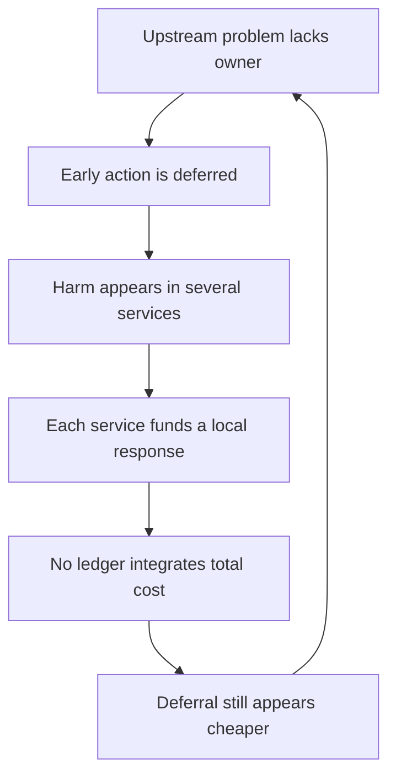

# 🧨 We Are Already Paying the Cost  
**First created:** 2025-12-20 | **Last updated:** 2026-08-16  
*Why non-ownership of harm is not frugality — it is systemic inefficiency.*

---

## 🛰️ I. Orientation

This node addresses the most persistent justification for non-action:

> **“We can’t afford this.”**

The framing is wrong.

The real situation is:

> **We are already paying — across multiple budgets, repeatedly, and inefficiently — because no one formally owns the problem.**

Avoidance is not savings.  
It is cost displacement without coordination.

That is a proposition to test, not an instruction to assume that every preventive programme pays for itself. Prevention may be ineffective, badly targeted, more expensive than alternatives or valuable without releasing cash. The necessary comparison is between credible options and a properly costed **business-as-usual baseline**—not between visible reform spending and an imaginary zero-cost status quo.

---

## 💸 II. The Illusion of Cost Avoidance

Institutions often frame accountability as:

- too expensive  
- too politically risky  
- too disruptive  
- too resource-intensive  

This assumes the alternative is neutral.

It is not.

When a problem has no clear owner:

- it migrates,
- it fragments,
- it reappears downstream,
- and it multiplies cost centres.

Non-ownership is not necessarily thrift. It can produce duplication, delayed intervention and costs transferred to people or organisations outside the deciding body's ledger.

---

## 👑 III. The Ownership Vacuum Effect

When no department has primary mandate over a systemic harm:

- Health services absorb trauma fallout.
- Social care absorbs family destabilisation.
- Justice systems absorb repeat offences.
- Housing absorbs displacement.
- Education absorbs behavioural impact.
- Treasury absorbs productivity loss.

Each system treats the issue as external.

Each allocates reactive budget.

No system eliminates root cause.

The same originating harm may therefore generate expenditure in several systems, unpaid labour in households, lost income, poorer health and reduced capacity elsewhere. “Paid for five times” is a deliberately compressed description of **multi-ledger consequence**, not a literal accounting rule.

### The cost-displacement loop

The loop closes locally—each service responds within remit—while the whole system fails to learn whether recurring demand could be reduced upstream.

---

## 🧮 IV. The Costs We May Already Be Incurring

### 🧠 Health & Mental Health
- Long-term trauma care  
- Complex PTSD treatment  
- Addiction services  
- Intergenerational psychological harm  

Potential long-duration spend where upstream causes were preventable or modifiable. Attribution must be demonstrated rather than assumed.

---

### 🏥 Social Care & Welfare
- Reduced workforce participation  
- Disability claims  
- Housing instability  
- Long-term dependency  

Some of this is necessary social protection, not waste. The analytical question is what proportion reflects avoidable deterioration, delayed access or a cost transferred from an earlier decision.

---

### ⚖️ Criminal Justice Churn
- Repeated investigations  
- Collapsed cases  
- Civil litigation  
- Incarceration without treatment  
- High reoffending rates  

Enforcement without systemic correction can create repeated demand, although treatment and prevention do not replace the need for lawful investigation, public protection or justice.

---

### 🏛️ Institutional Repair Cycles
- Public inquiries  
- External oversight reviews  
- Consultancy spend  
- Crisis communications  
- Policy rewrites  

These may be part of **the price of delay**, but inquiries and oversight also have independent constitutional and learning value. Their cost becomes pathological when institutions repeatedly purchase diagnosis without funding or owning implementation.

---

### 🧨 Governance & Security Risk
- Blackmail exposure  
- Corruption vulnerability  
- Foreign leverage  
- Extremist mobilisation  
- Democratic distrust  

Where evidenced, destabilisation can increase enforcement, security and compliance costs. These categories require particularly careful attribution: a general security risk should not be monetised as though every future event were caused by the policy under review.

### A usable cost ledger

| Cost type | Examples | Where it disappears |
|---|---|---|
| **Direct fiscal cost** | staff, treatment, temporary accommodation, enforcement, remediation | Recorded, but often in a different departmental budget. |
| **Displaced public cost** | demand shifted to councils, NHS bodies, courts, schools or regulators | No single owner consolidates it. |
| **Household and community cost** | unpaid care, lost earnings, travel, advocacy, disrupted education | Outside the public-spending ledger despite being socially real. |
| **Opportunity cost** | skilled time and capacity unavailable for other work | Rarely appears as a cash payment. |
| **Non-monetised human cost** | pain, reduced wellbeing, lost healthy life, fear, exclusion | Can be quantified or described without pretending every harm has a morally adequate price. |
| **Risk cost** | probability-weighted future harm and mitigation expense | Easily exaggerated unless assumptions and uncertainty are explicit. |

---

## 🔄 V. Delay and the Compounding Multiplier

For some harms, each year of non-ownership can:

- increase victim numbers  
- deepen trauma  
- entrench behaviour  
- raise future intervention cost  
- lower institutional trust  

Delay can behave like compound interest: an early problem alters the conditions under which the next response must operate.

The later the intervention, the higher the structural bill may become. This is common enough to test routinely, not universal enough to assume.

---

## 🏛️ VI. Budget Silos Create the False Economy

Why does avoidance feel cheaper?

Because:

- Costs are dispersed across departments.  
- No single ledger shows total spend.  
- Budgets are annual; harms are generational.  
- Responsibility is fragmented.  

Individual budget-holders see manageable line items. Society may absorb aggregate escalation.

HM Treasury's Green Book already requires appraisal from the perspective of UK society, across the proposal's lifetime, including significant effects on other public bodies, households, businesses and charities. The conceptual machinery therefore exists. The failure is often in scope, evidence, incentives, evaluation, implementation or the absence of an owner able to act across budgets.

---

## ⚖️ VII. Prevention Is Concentrated — Failure Is Distributed

Prevention spending appears:

- upfront  
- visible  
- politically accountable  

Failure spending appears:

- incremental  
- technical  
- bureaucratic  
- routine  

Annual and organisational budgets can reward dispersion because each later cost remains somebody else's business. Efficiency requires an integrated view, but not necessarily one giant central programme: pooled budgets, shared outcomes, referral redesign, data linkage, maintenance funding and clearly assigned outcome ownership may be more appropriate.

The UK's Shared Outcomes Fund and place-based pilots exist precisely because cross-cutting problems can sit awkwardly between departmental and local budgets. Their existence supports the diagnosis that ordinary funding structures need help; it does not prove that every cross-government intervention succeeds.

---

## 🧠 VIII. The Efficiency Argument

The real question is not:

> “Can we afford accountability?”

It is:

> “Can we afford to keep paying for the same harm across five departments indefinitely?”

Clear ownership can reduce duplication.

Mandated custody reduces churn.

Effective upstream intervention can reduce downstream demand.

This is not idealism.

It is operational efficiency.

But efficiency must be demonstrated through a theory of change, comparators, distributional analysis, sensitivity testing and evaluation. A small departmental saving is not a whole-system saving if costs move into another service or into unpaid family care. Equally, a socially valuable intervention should not be mis-sold as cash-releasing if its benefit is primarily longer life, dignity, safety or wellbeing.

---

## 🧨 IX. The Bottom Line

The choice is not between:

> *paying* or *not paying.*

The choice is between:

> **Paying earlier and deliberately, under clear ownership**  
> or  
> **Paying repeatedly, diffusely, and indefinitely.**

We are already funding the consequences of non-action.

We are simply funding them badly.

The correction is not “approve every prevention bid”. It is:

1. Cost business as usual honestly.
2. Map who currently bears each consequence.
3. Separate cash, non-cash, human and risk costs.
4. Compare plausible interventions over an appropriate time horizon.
5. State uncertainty and what would falsify the expected benefit.
6. Assign an owner for the cumulative outcome.
7. Fund evaluation, maintenance and course correction—not merely launch.

> **A cost does not cease to exist because it has been moved to a different ledger, a later year or somebody's exhausted family.**

---

## 📚 Sources

- [HM Treasury — The Green Book 2026](https://www.gov.uk/government/publications/the-green-book-appraisal-and-evaluation-in-central-government/the-green-book-2026)
- [HM Treasury — The Magenta Book: guidance for evaluation](https://www.gov.uk/government/publications/the-magenta-book)
- [HM Treasury — The Orange Book: management of risk](https://www.gov.uk/government/publications/orange-book)
- [National Audit Office — Lessons learned: cross-government working](https://www.nao.org.uk/insights/lessons-learned-cross-government-working/)
- [National Audit Office — Whole-government response essential to local authorities' financial sustainability](https://www.nao.org.uk/press-releases/whole-government-response-essential-to-local-authorities-financial-sustainability/)
- [National Audit Office — Support for vulnerable adolescents](https://www.nao.org.uk/reports/support-for-vulnerable-adolescents/)
- [UK Government — Partnerships for People and Place: learning and evaluation report](https://www.gov.uk/government/publications/partnerships-for-people-and-place-learning-and-evaluation-report)
- [Ministry of Justice — Early Legal Advice Pilot](https://www.gov.uk/guidance/early-legal-advice-pilot)
- [Ministry of Justice — Prison Leavers Project](https://www.gov.uk/guidance/prison-leavers-project-improving-outcomes-for-prison-leavers)
- [Department for Education — Evaluation of the Family Hubs Transformation Fund](https://www.gov.uk/government/publications/evaluation-of-shared-outcomes-fund-2-family-hubs-transformation-fund)

---

## 🌌 Constellations  

🧨 💸 👑 ⚖️ 🌀 — displaced costs; ownership vacuums; prevention economics; whole-system appraisal; feedback failure.

---

## ✨ Stardust  

non-ownership inefficiency, budget silo multiplication, cost displacement, prevention economics, custody gap spending, compound harm, governance duplication, accountability as efficiency

---

## 🏮 Footer  

*🧨 We Are Already Paying the Cost* is a living node of the **Polaris Protocol**.  

It reframes accountability not as moral luxury, but as fiscal discipline — showing how fragmented ownership multiplies spend across systems instead of resolving root causes.

> 📡 Cross-references:
> 
> - [👁️ Restoring Epistemic Integrity](./👁️_restoring_epistemic_integrity.md) — *conditions for trustworthy institutional knowledge*  
> - [📚 Memory, Market & Machinery of Data Exhaust](./📚_memory_market_machinery_of_data_exhaust.md) — *behavioural-data value and retained consequence*  
> - [🦎 Algorithmic Autotomy](./🦎_algorithmic_autotomy.md) — *safe detachment and the cost of unresolved dependency*  
> - [🦠 Systemic Porosity](./🦠_systemic_porosity.md) — *how cost and risk propagate across organisational boundaries*  
> - [🦠 AI UK Due Diligence & Autoimmunity Map](./🦠_ai_uk_due_diligence_and_autoimmunity_map.md) — *due-diligence gaps and defensive system response*
> - [🧭 Reflexive Risk](./🧭_reflexive_risk.md) — *why institutions may contain the warning instead of absorbing it*  
>   
> 🏮 Return To:
>
> - [👑 Ownership & Control](./README.md) — *1up*
> - [♻️ Cybernetics](../README.md) — *2up*
> - [🪿 Embodied Information Ecology](../../README.md) — *3up*
> - [🌑 Origin Points](../../../README.md) — *4up*
> - [🌌 Polaris Protocol — Root](../../../../README.md) — *root*

*Survivor authorship is sovereign. Containment is never neutral.*  

_Last updated: 2026-08-16_
