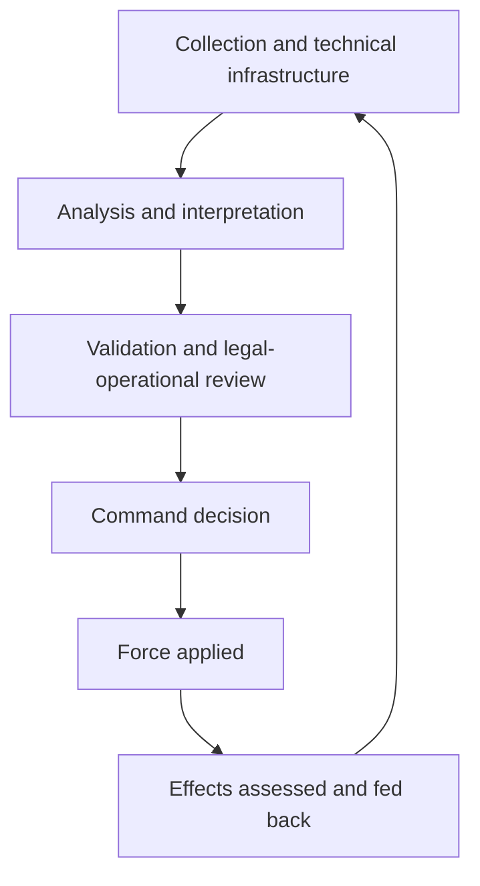

# 🧬 Distributed Complicity in Modern Warfare  
**First created:** 2025-12-20 | **Last updated:** 2026-08-24  
*How contemporary conflict fragments agency, redistributes responsibility, and creates custody gaps in ethical accountability.*

---

## 🛰️ I. Orientation  

Modern warfare does not eliminate responsibility.  
It redistributes it across systems.

This node explains how contemporary conflict can fragment agency across roles and institutions in ways that:

- obscure decisive authorship,
- preserve plausible deniability,
- distribute ethical burden unevenly across personnel,
- and concentrate harm downstream of decision chains.

This is a mechanism-focused analysis of how implication can emerge structurally in distributed operational environments. **Distributed complicity is Polaris analytical language, not a legal conclusion about every participant in a military system.** Legal responsibility remains actor-specific, fact-specific and threshold-dependent.

---

## 🧬 II. The Shift: From Trigger-Pullers to Systems  

In contemporary warfare:

- lethal force may be executed by a comparatively narrow group,
- many other people and organisations contribute to enabling conditions,
- and outcomes emerge from interlocking institutional systems.

Key characteristics may include:

- intelligence fusion and multi-source analysis,
- remote sensing and ISR systems,
- algorithmic or assisted targeting pipelines,
- logistics and sustainment networks,
- legal, diplomatic, and procedural buffering layers.

Responsibility becomes distributed across workflows rather than concentrated in individuals.

Distribution does not mean responsibility disappears or that it belongs equally to everybody. A commander, targeting analyst, intelligence liaison, cloud provider, component manufacturer, export authority and ordinary taxpayer can all be connected to the same war while occupying radically different positions of knowledge, control, causal proximity, legal duty and capacity to interrupt.

---

## 🩻 III. “Just Observing” Is Not Always Neutral  

ISR, intelligence analysis and surveillance may be framed as:

- passive,
- informational,
- defensive,
- operationally neutral.

In practice, these functions can influence outcomes by:

- shaping what is considered actionable,
- narrowing or expanding targeting confidence,
- reinforcing escalation pathways,
- and sustaining continuous visibility over contested environments.

Where information is integrated into a specific operation, the observer can become part of the causal machinery. Tactical targeting intelligence supplied for a concrete attack may also meet the ICRC's direct-participation test for a civilian. Strategic research, general intelligence, journalism and ordinary observation do not automatically do so.

Once harm becomes reasonably foreseeable, continued contribution may acquire ethical or governance significance even where no legal complicity threshold has been established.

Distributed proximity does not necessarily equal ethical distance.

---

## 🔗 IV. The Enabling Chain  

Distributed implication can emerge through linked operational stages:

1. Data collection (ISR, SIGINT, imagery)  
2. Analysis and pattern interpretation  
3. Intelligence validation or sharing  
4. Increased targeting confidence  
5. Operational acceleration  
6. Downstream harm amplification under certain conditions  

No single step is necessarily sufficient on its own. The cumulative chain can shape outcomes at scale.

This structure may make attribution more complex without reducing systemic impact.

The diagram is a governance model, not a claim that every military operation follows one identical pipeline. Its purpose is to reveal possible interruption points. If review occurs only at the command decision, upstream assumptions and downstream effects may remain somebody else's problem.

---

## ⚖️ V. Five Registers That Must Not Be Collapsed  

| Register | Core question | Important boundary |
|---|---|---|
| **Connection** | Is the actor linked to the institution, supply chain or conflict? | Connection alone establishes neither culpability nor meaningful causal contribution. |
| **Causal or operational contribution** | Did the actor's conduct make a particular capability, decision or harm materially easier? | Contribution may be remote, replaceable or lawful. It is evidence to analyse, not a complete liability test. |
| **Ethical implication** | What did the actor know or reasonably foresee, what control did they possess and what alternatives were available? | Ethical responsibility can be real without matching a criminal or State-responsibility threshold. |
| **State aid or assistance** | Did one State knowingly aid or assist another State's internationally wrongful act, under the applicable rules? | Article 16 of the ILC Articles contains specific conditions; ordinary alliance or support does not automatically establish responsibility. |
| **Individual criminal responsibility** | Did a person order, solicit, induce, facilitate, aid, abet or otherwise contribute to an international crime with the mental element required by the governing law? | Organisational membership, employment or technical contribution alone is insufficient. |

A sixth concept—**direct participation in hostilities**—belongs to targeting law. It concerns when a civilian loses protection from direct attack for the duration of qualifying conduct. It should not be used as a shortcut for criminal guilt or general moral blame.

Omission also requires care. Failure to stop harm does not create legal liability merely because intervention would have been desirable. Liability by omission ordinarily depends on an applicable duty and the relevant legal elements; command responsibility has its own requirements.

---

## 👑 VI. The Custody Paradox  

A recurring structural issue emerges:

- Operational personnel may experience ethical exposure.
- Strategic actors retain decision authority.
- Legal review is centralised in compliance structures.
- Moral burden is often decentralised across execution chains.

This can create a **custody gap**:

- individuals feel implicated without control,
- institutions may present accountability as distributed,
- escalation pathways may be limited or procedurally constrained.

Where no actor has clear mandate to interrupt the full chain, continuation can become the default outcome.

The design problem is not solved by declaring every contributor equally responsible. That merely creates fog in the opposite direction. Accountability should track at least:

> **contribution + knowledge or foreseeability + authority + available alternatives + duty + response after warning**

---

## 🧠 VII. Why Institutions Distribute Work  

Distributed systems persist for legitimate operational reasons. They can:

- distribute specialist expertise and operational load,
- reduce single points of failure,
- preserve institutional continuity,
- maintain alliance or coalition stability,
- and support scalable decision-making.

This can produce governance statements such as:

- “No single actor is solely responsible.”
- “This followed established procedure.”
- “Decisions were made collectively.”

Distribution is often structurally necessary and stabilising. It may also fragment visibility and accountability. The existence of that governance effect does not prove that the system was designed to manufacture deniability.

---

## 🔥 VIII. Moral Injury as a System Output  

Distributed complicity structures may contribute to:

- ethical tension among personnel,
- perceived mismatch between values and operational reality,
- psychological strain from indirect participation in harmful outcomes.

This can manifest as:

- moral injury,
- disengagement or withdrawal,
- internal conflict between role and ethics.

Moral injury is not itself a legal finding, diagnosis of institutional wrongdoing or synonym for PTSD. Foundational literature describes possible lasting harm after perpetrating, failing to prevent or witnessing acts that transgress deeply held moral beliefs. These effects are shaped by organisational leadership, acknowledgement and repair as well as individual exposure.

---

## 🧨 IX. Recruitment and Retention Risk  

Security, intelligence, and military institutions often depend on:

- analysts,
- linguists,
- legal advisers,
- engineers,
- and ethical oversight professionals.

Where systems:

- reduce clarity of responsibility,
- limit meaningful escalation pathways,
- or diffuse accountability across roles,

they may affect institutional trust over time.

Possible long-term effects can include:

- reduced retention of experienced personnel,
- increased reliance on contractors,
- loss of institutional memory,
- and weakened internal ethical coherence.

These outcomes are not inevitable but may arise under sustained structural strain.

---

## 🧯 X. Why Prevention Becomes Difficult Under Distribution  

Prevention frameworks often rely on:

- clear escalation pathways,
- timely intervention,
- and identifiable decision authority.

Distributed systems can introduce:

- procedural friction,
- fragmented awareness,
- delayed escalation,
- and unclear ownership of interruption decisions.

This may reduce the effectiveness of preventive action, particularly in fast-moving operational contexts.

The constraint is often structural rather than intentional.

### Design requirements

- Name the human decision-owner at each consequential stage.
- Preserve the provenance, confidence, caveats and permitted uses of shared intelligence.
- Give personnel a protected route to contest assumptions and escalate civilian-harm risk.
- Record when legal advice was sought and what question it answered, without pretending legal review owns the command decision.
- Carry observed effects back into collection, targeting and alliance-sharing rules.
- Identify who can pause the chain, under what trigger and with what protection from retaliation.
- Audit contractors and technical dependencies without treating civilian support as automatically targetable or criminal.

NATO's responsible-AI principles are useful here because they require clear human responsibility, traceability, reliability and governability, including the ability to disengage or deactivate systems showing unintended behaviour. Those principles do not resolve the whole warfare chain, but they express the correct architecture: complexity must not be allowed to become ownerlessness.

---

## 🪼 XI. Working Claim  

Modern warfare systems can distribute responsibility in ways that:

- fragment accountability,
- concentrate operational outcomes downstream,
- and place ethical pressure on personnel without equivalent decision authority.

This does not imply unlawful conduct, equal culpability or coordinated intent across actors. It describes a structural condition that can emerge in complex, networked systems.

Where responsibility is diffuse and authority is centralised or segmented, institutional clarity may degrade over time.

The point is neither **everyone is guilty** nor **nobody is responsible**. It is:

> **Map the contribution precisely enough that responsibility can reach the people and institutions capable of changing the outcome.**

---

## 📚 Sources

- [International Law Commission — Articles on Responsibility of States for Internationally Wrongful Acts](https://legal.un.org/avl/ha/rsiwa/rsiwa.html)
- [International Criminal Court — Rome Statute](https://www.icc-cpi.int/sites/default/files/Publications/Rome-Statute.pdf)
- [International Committee of the Red Cross — Direct participation in hostilities: questions and answers](https://www.icrc.org/en/article/direct-participation-hostilities-questions-answers)
- [International Committee of the Red Cross — Interpretive Guidance on Direct Participation in Hostilities](https://www.icrc.org/sites/default/files/external/doc/en/assets/files/other/icrc-002-0990.pdf)
- [UK Ministry of Defence — Joint Service Manual of the Law of Armed Conflict](https://www.gov.uk/government/publications/jsp-383-the-joint-service-manual-of-the-law-of-armed-conflict-2004-edition)
- [UK Ministry of Defence — Allied Joint Doctrine for Joint Targeting](https://www.gov.uk/government/publications/allied-joint-doctrine-for-joint-targeting-ajp-39a)
- [UK Ministry of Defence — Legal Support to Joint Operations](https://www.gov.uk/government/publications/jdp-3-46-legal-support-to-joint-operations-2nd-edition)
- [NATO — Summary of NATO's Artificial Intelligence Strategy](https://www.nato.int/en/about-us/official-texts-and-resources/official-texts/2021/10/22/summary-of-the-nato-artificial-intelligence-strategy/)
- [Arms Trade Treaty — Treaty text and participation status](https://thearmstradetreaty.org/treaty-status)
- [Litz and others — Moral injury and moral repair in war veterans](https://pubmed.ncbi.nlm.nih.gov/19683376/)

---

## 🌌 Constellations  

🧬 👑 ⚖️ 🧠 🕸️ — distributed responsibility; custody gaps; mandate misfit; moral injury; escalation-pathway fragmentation.

---

## ✨ Stardust  

distributed complicity, modern warfare systems, custody gap, intelligence workflows, escalation fragmentation, aiding and assisting frameworks, moral injury systems, institutional responsibility diffusion, mandate misalignment

---

## 🏮 Footer  

*🧬 Distributed Complicity in Modern Warfare* is a mechanism node within the **Polaris Protocol**.

It analyses how responsibility can fragment across modern conflict systems, creating gaps between ethical exposure and decision authority, and how this affects both legal clarity and institutional resilience.

> 📡 Cross-references:  
>  
> - [🛡️ Constructed Immunity](./🛡️_constructed_immunity.md) — *how fragmented safeguards can couple into practical impunity*  
> - [⚖️ The Architecture of Complicity](./⚖️_architecture_of_complicity.md) — *wider framework for mapping contribution and responsibility*  
> - [🤫 Collective Risk Silence Loop](./🤫_collective_risk_silence_loop.md) — *how distributed caution becomes self-confirming silence*  
> - [👑 Soft Power Accountability Gap](./👑_soft_power_accountability_gap.md) — *prestige influence and segmented accountability*  
> - [👑 Asserting Sovereignty After Allied Interference](./👑_asserting_sovereignty_after_allied_interference.md) — *governance response where allied activity crosses domestic boundaries*  
> - [✈️ Worker Positioning & Safety Culture](./✈️_worker_positioning_and_safety_culture.md) — *escalation and mandate design*
> - [🐴 The Legality of Gift Horses](./🐴_the_legality_of_gift_horses.md)  
>   
> 🏮 Return To:
>
> - [👑 Ownership & Control](./README.md) — *1up*
> - [♻️ Cybernetics](../README.md) — *2up*
> - [🪿 Embodied Information Ecology](../../README.md) — *3up*
> - [🌑 Origin Points](../../../README.md) — *4up*
> - [🌌 Polaris Protocol — Root](../../../../README.md) — *root*

*Survivor authorship is sovereign. Containment is never neutral.*  

_Last updated: 2026-08-24_
