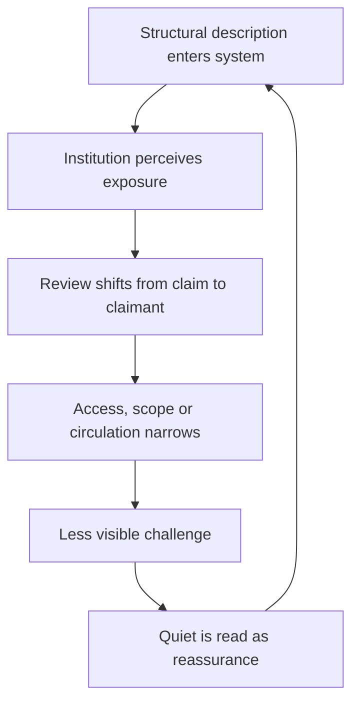

# 🧭 Reflexive Risk  
**First created:** 2025-10-20 | **Last updated:** 2026-08-16  
*When systems recognise consequential descriptions of themselves and treat introspection as destabilising.*

---

## 🩸 I. Definition — Feedback Becomes Threat  

**Reflexive risk is a Polaris synthesis** describing the point at which an informational or governance system recognises a consequential description of itself—and begins to treat the description, its circulation or its author as a risk object.

When a dataset, analyst, whistleblower, journalist, researcher, or model:

- maps hidden dependencies,
- exposes cross-sector linkages,
- reveals structural incentives,
- or articulates how institutional power operates,

the system may cease to interpret the analysis as neutral observation.

Instead, it may begin to interpret it as destabilisation.

Reflexive risk is not a synonym for paranoia, conspiracy, criticism, ordinary confidentiality or coordinated suppression.

It is the governance equivalent of an immune response: a continuity-preserving reflex triggered when information is perceived not merely as error-correction but as a threat to authority, legitimacy, liability, dependency or institutional survival.

Reflexive risk appears across governments, corporations, universities, media institutions, NGOs, and security environments alike. It is not unique to any ideology or sector.

---

## 🌀 II. Mechanism — Detection → Containment  

Reflexive risk often unfolds in recognisable stages:

1. **Connection**  
   A node bridges domains — defence, AI, procurement, academia, policy, media.

2. **Correlation**  
   It articulates linkages that expose distributed custody, incentive structures, or mandate misfit.

3. **Recognition**  
   The institution or network recognises aspects of itself in the description.

4. **Containment**  
   The articulation begins to be reframed as operational, reputational, legal, or governance risk.

5. **Substitution**  
   Attention shifts from the described condition toward the describer, the disclosure route, the tone, the publication process, or the risk of others learning it.

6. **Reassurance**  
   Reduced circulation or weakened challenge is then read as evidence that the original concern lacked substance.

The response rarely presents itself as censorship.

More commonly, it appears as:

- procedural delay,
- reputational review,
- ethics escalation,
- access restriction,
- scope narrowing,
- narrative reframing.

Containment is frequently coded as maintenance, risk management, or continuity protection.

### The reflexive-risk loop

The loop is dangerous because the system partially manufactures the quiet it later cites. It is not inevitable: review can instead verify the claim, protect the reporter, assign an outcome-owner and publish what changed.

---

## 👑 III. Ownership Paradox — Who Owns Self-Knowledge?  

Reflexive risk exposes a structural problem:

When no institution has primary custody of systemic integrity,  
introspection has no safe owner.

Legal teams manage liability.  
Communications teams manage reputational exposure.  
Executives manage continuity.  
Oversight bodies manage remit boundaries.

No single actor is clearly responsible for stewarding destabilising self-knowledge.

Under these conditions, institutional introspection can become operationally inconvenient.

In fragmented custody environments, reflexive insight may default toward procedural containment because every established owner is responsible for a risk created by disclosure, while nobody clearly owns the risk disclosed.

---

## 🧿 IV. Case Signatures and Competing Explanations  

Reflexive risk can produce observable institutional patterns, including:

- Repeated, evidenced technical failures concentrated around a specific dataset or actor.
- Reclassification of material as sensitive, pending review, or procedurally incomplete.
- Tone shifts from exploratory curiosity toward reputational concern.
- Escalation to ethics or governance panels with unclear remit boundaries.
- Formulaic empathy replacing substantive engagement.
- Funding pauses, audits, or procurement reviews whose stated basis changes after publication or structural correlation.

Each signal is minor in isolation.

Taken together, they may justify testing for institutional self-protection dynamics.

They also have ordinary competing explanations: genuine security concerns, privacy duties, incomplete evidence, legal privilege, quality assurance, budget change, personnel turnover, platform failure or unrelated operational pressure. A diagnosis becomes stronger when records show that scrutiny changed **because the institution recognised itself or its dependencies in the analysis**, and when the response targeted circulation or the analyst more readily than the underlying risk.

| Observation | Weak inference | Stronger evidence required |
|---|---|---|
| Review follows publication | “They recognised themselves.” | Terms of reference, correspondence or decision records connecting the content to perceived institutional exposure. |
| Access is narrowed | “The system is suppressing it.” | Changed access rules, inconsistent comparators, unexplained selectivity or evidence that narrower measures could have managed the stated risk. |
| Several organisations become cautious | “They coordinated.” | Communication, common instruction, shared controller or documented dependency—not merely similar incentives. |
| Reporter experiences detriment | “The disclosure caused retaliation.” | Timing plus decision evidence, comparator treatment, shifting reasons, procedural departure or admissions. |

**A self-sealing concept is not a diagnostic tool.** If every denial, delay and technical problem automatically proves reflexive risk, the model has stopped distinguishing mechanisms.

---

## 🕸️ V. Distribution Amplifies the Reflex  

In distributed systems:

- responsibility is fragmented,
- exposure is shared,
- escalation authority is unclear.

When reflexive insight appears,  
multiple actors may independently perceive institutional risk simultaneously.

Silence can stabilise quickly under these conditions without central instruction. Similar incentives may produce similar caution; shared infrastructure or advice may also couple responses. Those possibilities must be investigated rather than collapsed together.

Reflexive risk therefore interacts with:

- Collective Risk Silence Loops,
- Custodial Capture,
- Mandate Misfit,
- Reputational continuity incentives.

The more distributed the system,  
the harder coordinated correction may become.

---

## ⚖️ VI. The Escalation Vacuum  

Healthy systems route reflexive insight upward for correction.

Fragile systems may:

- route it sideways,
- route it downward,
- or proceduralise it until momentum dissipates.

This is not always malicious.

It is often continuity logic operating under institutional pressure:

> “We cannot destabilise the system while trying to correct the system.”

When escalation authority is unclear,  
continuity can begin to outrank correction.

Over time, unresolved insight accumulates as latent governance risk.

The corrective design is not “publish everything immediately”. It is a protected route in which somebody can:

- separate the substance of the warning from questions about the speaker;
- manage legitimate security, privacy and legal constraints proportionately;
- preserve an auditable record of why access or publication changed;
- assign authority for the cross-system outcome;
- and report back what was tested, rejected, accepted or repaired.

British whistleblowing law provides conditional protection for specified public-interest disclosures, but legal protection and organisational learning are different things. A person may have a route to an employment remedy after detriment while the underlying system still fails to absorb the information.

---

## 🧠 VII. Personnel Impact  

Reflexive risk creates predictable workforce pressures:

- Analysts surfacing cross-domain insight may become isolated.
- Ethical actors may be reframed as operationally disruptive.
- Whistleblowers may be routed through HR or compliance systems rather than structural reform pathways.
- Recruitment and promotion may gradually favour people perceived as lower-friction or less likely to surface cross-boundary problems. This is a hypothesis to test through workforce, progression and exit evidence—not something inferable from institutional blandness alone.

Over time:

- institutional introspective capacity declines,
- dissent becomes reputationally hazardous,
- adaptive self-correction weakens.

The system becomes less responsive to emerging risk.

---

## 🛰️ VIII. Diagnostic Use  

Reflexive risk can be mapped analytically.

Possible indicators include:

1. A stalled investigation or sudden narrative shift.
2. Cross-domain actors bridging previously separated institutional areas.
3. Procedural responses appearing immediately after structural correlation is articulated.
4. Reputational framing replacing substantive governance discussion.
5. Simultaneous tone shifts across institutions sharing exposure or dependency relationships.

Patterns of delay, absence, fragmentation, or procedural overload may themselves warrant analysis, particularly when they recur systematically across linked institutions.

Response timing can help identify a test window. It cannot by itself establish motive, shared knowledge or causation.

### Ten useful tests

1. What exactly changed after the institution received the description?
2. Was the underlying claim investigated with the same intensity as the reporter or disclosure route?
3. Were stated reasons recorded contemporaneously, or did they change later?
4. Were comparable datasets, speakers or publications treated differently?
5. Could a narrower measure have managed the legitimate risk?
6. Who had authority to close, narrow or delay the work?
7. Who had authority to correct the system-level condition?
8. Did several actors share advice, infrastructure, contractual dependency or only incentives?
9. What evidence would disconfirm the reflexive-risk hypothesis?
10. Did the organisation eventually publish learning, repair and reasons?

---

## 🧯 IX. Strategic Interpretation  

Reflexive risk marks the boundary of institutional tolerance for self-description.

Where introspection repeatedly triggers defensive response,  
structural sensitivity may exist.

A system unable to absorb reflexive insight struggles to reform under internal conditions alone.

A system capable of absorbing self-critique without procedural retaliation demonstrates greater adaptive maturity.

Reflexive risk is therefore both warning and compass:

It can indicate where continuity pressures have begun to override corrective capacity.

The mature opposite of reflexive risk is not institutional passivity. It is **disciplined receptivity**: the capacity to constrain genuinely dangerous disclosure while still preserving the signal, protecting good-faith challenge and correcting what the institution would rather not recognise.

---

## 📚 Sources

- [Morrison and Milliken — Organisational silence: a barrier to change and development](https://journals.aom.org/doi/10.5465/AMR.2000.3707697)
- [Edmondson — Psychological safety and learning behaviour in work teams](https://doi.org/10.2307/2666999)
- [Staw, Sandelands and Dutton — Threat-rigidity effects in organisational behaviour](https://doi.org/10.2307/2392337)
- [Argyris — Double-loop learning in organisations](https://hbr.org/1977/09/double-loop-learning-in-organizations)
- [UK Government — Whistleblowing guidance for employers](https://www.gov.uk/guidance/whistleblowing-guidance-for-employers)
- [UK Government — Whistleblowing guidance for prescribed persons](https://www.gov.uk/guidance/whistleblowing-for-prescribed-persons)
- [UK legislation — Employment Rights Act 1996, Part IVA](https://www.legislation.gov.uk/ukpga/1996/18/part/IVA)
- [National Guardian's Office — Freedom to Speak Up](https://nationalguardian.org.uk/)
- [Francis — *Freedom to Speak Up* review](https://webarchive.nationalarchives.gov.uk/ukgwa/20150218150953/http://freedomtospeakup.org.uk/the-report/)

---

## 🌌 Constellations  

🧿 👑 🧠 ⚖️ 🌀 — feedback containment; custody of self-knowledge; escalation vacuums; institutional autoimmunity; mandate misfit.

---

## ✨ Stardust  

reflexive risk, institutional self-defence, feedback suppression, escalation vacuum, governance fragility, continuity logic, organisational risk response, whistleblower containment, mandate misfit, introspection risk

---

## 🏮 Footer  

*🧭 Reflexive Risk* examines the moment when institutions recognise themselves in critique and begin responding defensively.

It maps the governance dynamics that can emerge when structural self-description collides with continuity pressures, reputational management, and fragmented accountability.

> 📡 Cross-references:
> 
> - [👁️ Restoring Epistemic Integrity](./👁️_restoring_epistemic_integrity.md) — *conditions for trustworthy institutional knowledge*  
> - [📚 Memory, Market & Machinery of Data Exhaust](./📚_memory_market_machinery_of_data_exhaust.md) — *practical ownership of retained behavioural information*  
> - [🦎 Algorithmic Autotomy](./🦎_algorithmic_autotomy.md) — *safe dependency detachment rather than deletion or suppression*  
> - [🦠 Systemic Porosity](./🦠_systemic_porosity.md) — *boundary permeability and cross-system propagation*  
> - [🦠 AI UK Due Diligence & Autoimmunity Map](./🦠_ai_uk_due_diligence_and_autoimmunity_map.md) — *AI assurance and defensive institutional response*
> - [🧨 We Are Already Paying the Cost](./🧨_we_are_already_paying_the_cost.md) — *cost displacement from delayed correction*
>   
> 🏮 Return To:
>
> - [👑 Ownership & Control](./README.md) — *1up*
> - [♻️ Cybernetics](../README.md) — *2up*
> - [🪿 Embodied Information Ecology](../../README.md) — *3up*
> - [🌑 Origin Points](../../../README.md) — *4up*
> - [🌌 Polaris Protocol — Root](../../../../README.md) — *root*

*Survivor authorship is sovereign. Containment is never neutral.*  

_Last updated: 2026-08-16_
