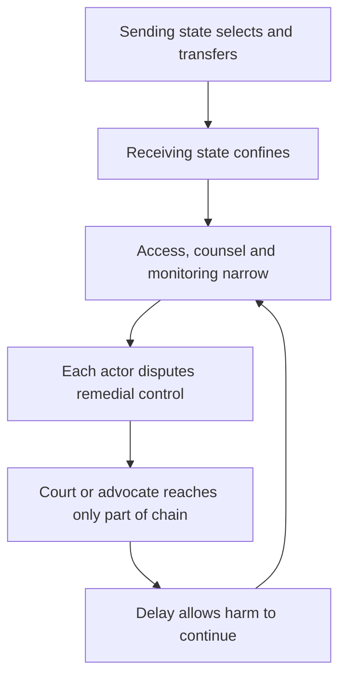

# 🪦 CECOT as a Rights-Void Facility  
**First created:** 2025-12-14 | **Last updated:** 2026-08-16  
*How offshored detention collapses safeguards while legality, custody, and remedy are contested across borders.*  

---

## 🛰️ I. Orientation

This node examines the **Terrorism Confinement Center (CECOT)** in El Salvador through the Polaris concept of a **rights-void facility**: a site where rights may exist in law or diplomatic statement but become exceptionally difficult to identify, invoke and enforce in practice.

CECOT is not analysed solely as a Salvadoran domestic matter. During 2025 it became a receiving node in a transnational custody chain when the United States transferred Venezuelan men there under an arrangement with El Salvador. The facility's conditions, opacity and governance structure made timely rights enforcement extraordinarily difficult. **Difficult is not identical to legally impossible:** litigation, diplomatic action, family advocacy, journalism and post-release investigation remained possible, but often operated late, indirectly or from outside the prison.

---

## 🪦 II. What “Rights-Void” Means

A rights-void facility is not necessarily one where law is absent on paper. It is one where the practical chain required to exercise a right repeatedly fails:

* the person cannot obtain confidential legal advice;
* detention has no accessible, timely route of challenge;
* family and representatives cannot reliably locate or contact them;
* monitoring access is absent, restricted or unable to generate protection;
* alleged abuse cannot be reported without retaliation or independently investigated;
* and each jurisdiction points to the other's legal or practical control.

In such environments, rights exist rhetorically but not operationally.

This is a **functional diagnostic**, not a formal legal classification. A facility may be highly rights-depriving without every one of these conditions being present, and the existence of one monitored visit does not prove that ordinary contestability has been restored.

---

## 🧊 III. What the Evidence Establishes

The evidential record is uneven because CECOT is not subject to ordinary public access. The strongest post-transfer evidence concerns the Venezuelan cohort held there from March to July 2025 and interviewed after release.

| Proposition | Evidence status |
|---|---|
| The United States transferred Venezuelan men to CECOT and paid El Salvador under a detention arrangement. | Documented by government statements, litigation records and subsequent investigations. |
| The 252 Venezuelan men were returned to Venezuela in July 2025 in a prisoner exchange. | Documented. They should not be described as still held at CECOT. |
| Former detainees described repeated beatings, humiliation, inadequate care and some sexual violence. | Multiple first-hand allegations; Human Rights Watch and Cristosal reported cross-corroboration, forensic review and open-source analysis. |
| Abuses against that cohort amounted in many cases to torture or cruel, inhuman or degrading treatment. | Legal assessment by Human Rights Watch and Cristosal; not a final judgment of an international court. |
| All current CECOT detainees experience identical treatment. | Not established. Restricted access prevents that inference. |
| The US government directly instructed Salvadoran guards to commit abuse. | Not established by the sources used here. |

---

## 🧱 IV. Structural Features of CECOT

### 1. Extreme Isolation

CECOT is procedurally isolated and physically secured:

* remote siting
* militarised perimeter
* restricted visitation
* highly controlled information flows

These features do not prove an intention to conceal abuse: maximum-security prisons are designed to restrict movement and information. They do, however, increase the importance of genuinely independent and confidential monitoring. Without that counterweight, security architecture also becomes oversight architecture.

### 2. Denial of Independent Access

Human-rights organisations, journalists and lawyers have reported restricted access, while authorised visits have generally been controlled. The International Committee of the Red Cross visited the Venezuelan cohort in 2025; former detainees later alleged that some prisoners were beaten after speaking with ICRC staff.

* no routine public access;
* curated or escorted media visits;
* severe limits on confidential contact with detainees;
* and uncertainty about whether monitoring can protect people who speak.

Without confidential access, monitoring cannot function.

### 3. Custody Without Contestability

The Venezuelan men transferred in 2025 reported:

* no effective Salvadoran process through which they could contest the basis for their detention;
* no Salvadoran charge or sentence explaining why they were imprisoned there;
* extremely limited contact with families and lawyers;
* and no accessible complaint mechanism capable of promptly changing their conditions.

The government of El Salvador publicly described the men as being in its custody under the bilateral arrangement. US officials disputed the extent of their control after transfer. The resulting contest over custody was itself part of the remedy failure.

### 4. Documented Abuse Allegations

Human Rights Watch and Cristosal documented allegations including:

* torture and severe ill-treatment
* sexual violence and forced nudity
* beatings and collective punishment

The significance is not only the alleged abuse itself, but how little protective machinery was available while it was occurring. Post-release investigation can build accountability; it cannot substitute for a remedy inside the facility.

---

## ⚖️ V. Responsibility Across the Custody Chain

A transfer does not create one simple rule under which every later act is automatically attributed to the sending state. Nor does it erase the sending state's responsibility for its own decision.

Potential responsibilities must be separated:

| Actor | Question |
|---|---|
| **Sending government** | Was removal lawful? Was meaningful notice and a chance to contest removal provided? Was there a known risk of torture, disappearance or arbitrary detention? What power remained to facilitate return or remedy an unlawful transfer? |
| **Receiving government** | On what legal basis was the person detained? Could they challenge custody, contact counsel and family, receive humane conditions and report abuse safely? |
| **Courts** | Which actor and remedy fall within the court's jurisdiction, and what can it order without purporting to command a foreign sovereign? |
| **Contracting and diplomatic chain** | Who paid, specified the cohort, supplied information, requested continued detention, authorised release or could renegotiate the arrangement? |

The US Supreme Court's April 2025 order in *Noem v Abrego Garcia* left in place a requirement that the US government **facilitate** Abrego Garcia's release and treat his case as it would have been handled absent the improper removal, while requiring clarification of the broader command to “effectuate” return. That is a precise example of retained remedial responsibility without pretending a US court directly governed CECOT.

Separate international-law rules—including non-refoulement and the prohibition on transferring a person to a real risk of torture—may attach to the transfer decision. Extraterritorial jurisdiction and attribution are fact-specific. Selection, payment and diplomatic influence are important evidence; they are not a magic phrase that resolves every control test.

### The custody-chain problem

The rights void is produced not by a literal absence of law but by **misalignment between where power is exercised, where evidence can be obtained and where a remedy can be ordered**.

---

## 🌀 VI. CECOT Within the Rule-of-Law Failure Cascade

CECOT represents the **terminal stage** of the failure cascade:

1. Custody established domestically
2. Due process narrowed or bypassed
3. Responsibility offshored
4. Contact and traceability narrowed
5. Courts reach only parts of the custody chain
6. Harm becomes verifiable mainly after release

At this point, the system can become structurally resistant to accountability.  

---

## 📡 VII. Media Publication as a Secondary Failure Point

The opacity surrounding CECOT is reinforced not only by custodial practices, but by **fragility in media transmission itself**.

In December 2025, an investigative segment examining the experiences of Venezuelan men formerly held at CECOT—produced for **60 Minutes** on **CBS**—was scheduled for broadcast and withdrawn shortly before US transmission. CBS said additional reporting was required. Correspondent Sharyn Alfonsi said the piece had passed legal and standards review and characterised the intervention differently. Those positions should be reported as a dispute, not resolved here by assertion.

An earlier version was then mistakenly made available through Canadian broadcaster Global's app and removed. CBS said its content-protection team issued routine takedown requests for unauthorised copies.

There is no public evidence used here that a government ordered the withdrawal. The episode nevertheless illustrates a structural vulnerability:

* even where abuse allegations are documented,
* even where journalists gain rare access,
* and even where reporting clears legal thresholds,

**publication itself can become the failure point**.

This does not require a censorship order. It is enough for publication to remain contingent on concentrated editorial, legal and corporate decisions, especially where the original evidence was already difficult to obtain. That is a vulnerability, not proof that any particular editorial decision was illegitimate.

In this way, interruption at publication can function as a **secondary containment layer**, limiting sustained public scrutiny at precisely the point where oversight might re-enter the system.

The significance of this episode lies not in the editorial decision itself, but in what it demonstrates:  
that rights-void facilities are stabilised not only through detention practices, but through **interruptions in the evidentiary chain** that prevent abuses from remaining continuously visible.

---

## 🔥 VIII. Why This Is Not a Foreign-Policy Side Issue

When democratic states transfer people into rights-void facilities:

* domestic legal safeguards are functionally voided
* courts may be forced to construct remedies across disputed jurisdictional and practical boundaries
* constitutional protections are hollowed out indirectly

This is a **domestic rule-of-law issue**, not merely a diplomatic one.

---

## 🧭 IX. Analytical Use

This node should be used to:

* assess transfer legality
* evaluate disappearance risk
* contextualise torture allegations
* support calls for access, inspection, and moratoria

CECOT functions as a warning architecture: once such facilities are normalised, they become reusable.

---

## 📚 Sources

- [Human Rights Watch and Cristosal — *You Have Arrived in Hell*: Torture and other abuses against Venezuelans in CECOT](https://www.hrw.org/report/2025/11/12/you-have-arrived-in-hell/torture-and-other-abuses-against-venezuelans-in-el)
- [Human Rights Watch — US/El Salvador: Torture of Venezuelan deportees](https://www.hrw.org/news/2025/11/12/us-el-salvador-torture-of-venezuelan-deportees)
- [US Supreme Court — Docket and order, *Noem v Abrego Garcia*, No. 24A949](https://www.supremecourt.gov/docket/docketfiles/html/public/24a949.html)
- [US Supreme Court — Docket, *A.A.R.P. v Trump*, No. 24A1007](https://www.supremecourt.gov/docket/docketfiles/html/public/24a1007.html)
- [Inter-American Commission on Human Rights — Human-rights violations and states of exception in El Salvador](https://www.oas.org/en/iachr/sessions/hearing.asp?Hearing=3656)
- [Inter-American Commission on Human Rights — Forced disappearances during El Salvador's state of emergency](https://www.oas.org/en/iachr/sessions/hearing.asp?Hearing=3682)
- [Amnesty International — El Salvador: A thousand days into the state of emergency](https://www.amnesty.org/en/latest/news/2024/12/el-salvador-a-thousand-days-into-the-state-of-emergency/)
- [Associated Press — Pulled *60 Minutes* CECOT segment appeared on Global's app](https://apnews.com/article/fb69fbf4c92d578300b174453428d2b4)
- [PBS NewsHour — *60 Minutes* segment mistakenly aired online](https://www.pbs.org/newshour/politics/60-minutes-segment-on-trump-immigration-policy-accidentally-airs-online)
- [The Guardian — CECOT episode appeared online after withdrawal](https://www.theguardian.com/media/2025/dec/23/60-minutes-cecot-appears-online)

---

## 🌌 Constellations

🪦 ⚖️ 🧿 🌀 🕸️ — death-adjacent risk, legal responsibility, governance outsourcing, traceability loss, systemic failure.

---

## ✨ Stardust

cecot, offshored detention, rights-void facility, effective control, torture risk, disappearance risk, accountability erosion, transnational custody, extraterritorial detention, custody outsourcing, due process erosion  

---

## 🏮 Footer

*🪦 CECOT as a Rights-Void Facility* is a living node of the **Polaris Protocol**.  
It documents how offshored detention can collapse enforceable rights while responsibility and remedial control are split across jurisdictions.

> 📡 Cross-references:
>
> - [🌀 Rule of Law Failure Cascade](../⚖️_Legal_State_Governance/🌀_rule_of_law_failure_cascade.md) — *structural sequence*  
> - [🧿 Custodial Opacity and Database Disappearance](../../../../Metadata_Sabotage_Network/🔥_Data_Risks/📿_Vulnerable_Data_Populations/🧿_custodial_opacity_and_database_disappearance.md) — *traceability loss*  
> - [🛰️ Satellite Imagery as Circumstantial Evidence](../../../../🦆_Digital_Disruption/🛰️_OSINT_Field_Operations/🛰️_satellite_imagery_as_circumstantial_evidence.md) — *corroborative OSINT*
> - [⚠️ Prelude Conditions to Atrocity](../../🐍_Ouroborotic_Violence/🩸_Genocide_Denialism/⚠️_prelude_conditions_to_atrocity.md) — *escalation analysis*
> - [🩸 Genocide Denialism](../../🐍_Ouroborotic_Violence/🩸_Genocide_Denialism/README.md) - *we never forget, because never again*
>  
> 🏮 Return To:
>
> - [👑 Ownership & Control](./README.md) — *1up*
> - [♻️ Cybernetics](../README.md) — *2up*
> - [🪿 Embodied Information Ecology](../../README.md) — *3up*
> - [🌑 Origin Points](../../../README.md) — *4up*
> - [🌌 Polaris Protocol — Root](../../../../README.md) — *root*

*Survivor authorship is sovereign. Containment is never neutral.*

_Last updated: 2026-08-16_
