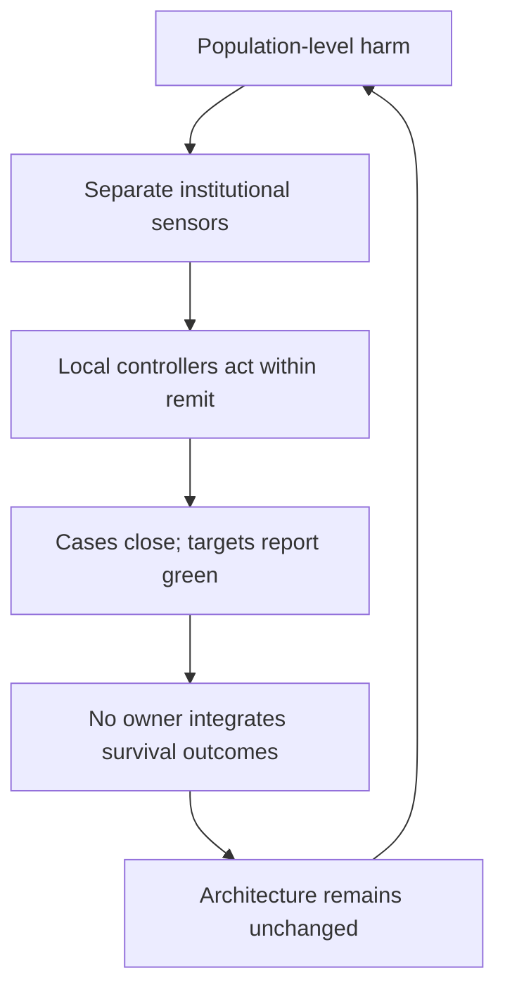

# 🫀 Genocide by Containment  
**First created:** 2025-09-03 | **Last updated:** 2026-08-16  
*Legacy administrative architecture, outcome orphaning, and the normalisation of preventable harm.*

---

> "...MS Windows will always be shit because it is built on top of the rickety structure of DOS."
>
> — Mark Fisher, quoted by Matt Colquhoun in the introduction to *Postcapitalist Desire*.  

---

## 🛰️ I. Orientation  

This node examines how legacy bureaucratic architectures — particularly administrative systems shaped by hierarchical civil-service traditions — can produce cumulative, preventable harm at population scale.

**“Genocide by containment” is Polaris analytical language, not a recognised legal category and not, by itself, an allegation that genocide has been committed.** It describes a structural condition in which preventable death and life-limiting harm become normalised through procedural indifference, optimisation drift, fragmented accountability, and outcome orphaning.

This is not framed solely as a hypothetical future risk.  
It is a governance condition that can emerge when systems lose sight of cumulative human outcomes.

The central question is not whether harm occurs.  
It is whether anyone owns the outcome.

---

## ⚖️ II. Three Different Questions  

Three questions must remain separate.

| Register | Question | What would be required? |
|---|---|---|
| **Genocide law** | Have prohibited acts been committed with intent to destroy, in whole or in part, a protected national, ethnical, racial or religious group? | Proof of the prohibited conduct and the required specific intent. Severe or discriminatory harm alone does not settle this question. |
| **Atrocity prevention** | Are institutions developing conditions that increase the risk of group-targeted mass harm? | Pattern evidence concerning discrimination, exclusion, institutional weakening, impunity, crisis acceleration and the capacity to prevent escalation. This is prospective risk analysis, not a criminal verdict. |
| **Polaris systems analysis** | Is a governance architecture repeatedly producing preventable mortality while no actor owns the cumulative outcome? | Evidence of recurrent harm, fragmented control, misaligned metrics, failed escalation and absent authority to redesign the whole loop. Intent may be relevant, but is not built into the concept. |

The title deliberately keeps the moral alarm audible. The body keeps the legal boundary intact.

The Genocide Convention is not a general synonym for mass suffering, bureaucratic cruelty or state failure. It defines a specific international crime. Equally, prevention cannot sensibly begin only after a court could already prove that crime. The space between **not legally established as genocide** and **safe, acceptable governance** is extremely large. This node examines that space.

---

## 🧱 III. Legacy Architecture and Rights Retrofitting  

Many contemporary bureaucracies were originally architected:

- Before universal suffrage  
- Before women’s political participation  
- Before modern civil-rights doctrine  
- Before disability-rights frameworks  
- Before recognition of children as independent rights-holders  

Their institutional lineages emerged within stratified political orders. In the British case, important administrative functions historically included:

- Population management  
- Revenue administration  
- Imperial logistics  
- Class stabilisation  
- Public order  

They were not originally designed around contemporary universal equality, disability rights, data protection or child-centred safeguarding. That does not mean every current institution simply reproduces its oldest purpose. It means institutional inheritance is a legitimate design question, not a complete causal explanation.

Over the last 50–70 years, rights frameworks have been layered onto these systems through:

- Equality legislation  
- Safeguarding mandates  
- Judicial review  
- Ombudsman mechanisms  
- Anti-discrimination enforcement  

But layering modern rights protections onto a legacy administrative chassis is not the same as redesigning the underlying architecture.

Compatibility patches preserve older structural assumptions.  
Complexity increases.  
Alignment with contemporary norms does not automatically follow.

When equality must be retrofitted onto hierarchy-oriented systems, institutional strain accumulates.

---

## 👑 IV. Outcome Orphaning  

A defining feature of genocide by containment is not overt declaration.  
It is **ownership collapse**.

In distributed administrative systems:

- Housing departments manage allocation.  
- Border units manage classification.  
- Contractors manage facilities.  
- Welfare teams manage eligibility.  
- Health services manage symptoms.  

Each actor owns a process step.  
No actor owns cumulative survival outcomes.

When preventable harm accumulates and no office is formally responsible for aggregate wellbeing, death and instability can become administrative residue.

The system continues to function.  
Forms are processed.  
Targets are met.  

But the question “Are people surviving and stabilising?” has no clear custodian.

This is outcome orphaning.

It can produce structural mortality without singular perpetrator intent.

### The cybernetic failure

The system is not missing feedback altogether. It contains many small feedback loops, each capable of reporting completion:

- the eligibility decision was made;
- the referral was sent;
- the contractor met the specification;
- the complaint was answered;
- the health service treated the presenting symptom;
- the inspector reviewed compliance within remit.

The missing loop sits above them. No controller is both required to integrate the cumulative mortality signal **and authorised to alter the allocation of roles, money, data and legal duties that reproduces it**.

This creates a dangerous substitution:

> **local process closure is treated as evidence of system success.**

The aggregate outcome can deteriorate while every component produces evidence that it performed its assigned function. Another dashboard or oversight body does not necessarily solve this. If it can observe but cannot compel cross-system redesign, it becomes another sensor feeding a controller that still does not exist.

---

## 🗂 V. Procedural Governance and Relational Correction  

Earlier administrative cultures — however flawed — often involved:

- Direct contact  
- Recognisable officials  
- Local reputational accountability  
- Community knowledge of harm  

Contemporary governance also operates through:

- Case IDs  
- Digital portals  
- Eligibility thresholds  
- Automated triage  
- Contractor chains  
- Performance dashboards  

For many people, the safety net is experienced primarily through procedure. Relational knowledge has not disappeared, but digitisation, centralisation and contracting can make it harder for that knowledge to correct an upstream rule.

Procedural systems can improve consistency and scale.  
They can also become structurally capable of missing cumulative human impact.

We often describe harm as people “slipping through the cracks,” implying rarity.

But when the same populations repeatedly experience preventable harm under the same structural conditions, those cracks are no longer accidental gaps. They are recurring system failures.

When harm becomes predictable, it is no longer anomaly.  
It is system property.

---

## 📊 VI. Metric Optimisation and Externalised Harm  

Modern governance increasingly relies on KPIs and performance dashboards. Management research has long recognised that when metrics dominate, behaviour optimises toward the metric itself — sometimes at the expense of safety or quality.

If throughput is measured but long-term wellbeing is not, throughput improves.  
If cost efficiency is measured but stability is not, budgets balance while harm migrates elsewhere.

Engineers and safety researchers have repeatedly observed that when safety is not an explicit performance indicator, it is deprioritised under pressure. Public systems are not immune to the same dynamic.

When dignity, survival, or cumulative wellbeing are not explicitly owned metrics, they become externalities.

This is not necessarily malicious.  
It is optimisation drift.

At scale, optimisation drift can produce measurable preventable harm.

---

## 🌍 VII. Exported Administrative Inheritance  

Administrative models influenced by British rule have shaped institutions across former colonies and the Commonwealth, but not uniformly. They were adapted, resisted and combined with local political and legal traditions. This section therefore identifies a research direction rather than asserting one transferable “British model”.

The institutional tendencies worth testing include:

- Remit separation  
- Compliance enforcement  
- Documentation discipline  
- Contractual outsourcing  
- Procedural continuity  

The corresponding weaknesses to test include:

- Cross-silo outcome ownership  
- Holistic survival accountability  
- Adaptive human-centred redesign  

Where those properties persist and are layered with automation, they may scale too. That proposition requires jurisdiction-specific historical and institutional evidence; connection to British administrative history is not proof of present dysfunction.

---

## ⚙️ VIII. Automation as Acceleration  

Automation does not create structural harm from nothing.  
It accelerates existing design assumptions.

When legacy systems are overlaid with:

- Algorithmic eligibility scoring  
- Predictive risk modelling  
- Automated triage  
- Cost-optimisation tools  

Detachment from relational correction can increase.  
Opacity can increase.  
Speed can increase.  
Responsibility diffusion can increase—although a well-designed system can also improve traceability, consistency and earlier detection. Automation is an amplifier of governance choices, not an independently malevolent actor.

If outcome ownership was already weak, automation can render it thinner still.

The resulting harm often appears mundane rather than dramatic:
- service pressure
- excess mortality
- deteriorating mental health
- housing churn
- chronic instability

Years later, inquiries ask what went wrong.

Rarely do they examine architectural logic itself.

---

## 🚨 IX. Structural Mortality Indicators  

The following conditions may indicate governance systems generating preventable harm at scale:

1. **Persistent excess mortality associated with policy environments**, with careful attention to confounding, attribution and uncertainty.  
2. **Recurrent harm affecting the same marginalised populations.**  
3. **Narrow inquiries focused on procedural compliance rather than structural design.**  
4. **Language drift from harm analysis toward risk-management framing alone.**  
5. **Multiplication of oversight bodies without measurable reduction in mortality or instability.**  
6. **No named custodian for cumulative survival or wellbeing metrics.**

Comparable mechanisms should be tested across austerity, detention, welfare conditionality and exclusion from essential services. The existence of excess mortality does not, without further evidence, identify one policy as its cause; equally, causal complexity is not permission to stop investigating.

When such patterns persist without architectural correction, preventable harm can become normalised.

This is the governance condition described here as genocide by containment.

---

## 🛠 X. Reform or Rebuild  

Addressing structural mortality does not require institutional collapse. It requires architectural honesty.

Two broad pathways exist:

### 1️⃣ Refactor  

- Assign explicit outcome ownership for survival and stability metrics.  
- Embed cross-silo accountability structures.  
- Redesign performance incentives to include human wellbeing.  
- Pair digital systems with relational oversight.  
- Audit for cumulative harm, not just procedural compliance.
- Give the outcome-owner access to linked, privacy-preserving cross-system data and the authority to escalate contradictory local incentives.
- Publish distributional impacts and uncertainty, including harms displaced into other services, households and communities.

This approach accepts the legacy chassis while adjusting internal load-bearing logic.

---

### 2️⃣ Rebuild  

In some domains, patching may be insufficient.

If structural assumptions remain fundamentally misaligned with contemporary human-rights commitments, staged redesign may be more effective than indefinite patch repair.

High-use systems already do this. Hospitals routinely reorganise wards, rotate departments, and rebuild wings while maintaining patient care. Complex structures can be reconstructed in coordinated phases without halting essential services.

Governance is not uniquely incapable of the same discipline.

Radical, in its original sense, means root-level.  
Rebuild does not necessarily mean rupture.  
It means examining whether the foundation remains fit for purpose.

---

## 🛑 XI. Historical Memory and Prevention Frameworks  

The Genocide Convention emerged directly from the Holocaust. It was drafted in response to the systematic destruction of European Jewry and other targeted groups through a modern administrative state.

The Holocaust involved classification, exclusion, legal redefinition, bureaucratic compliance and the incremental normalisation of group-based disposability before and alongside mass killing. Records created by state, police, religious and community bodies were used to locate Jews. Administrative capacity did not cause the Holocaust by itself; it was made operational by antisemitic ideology, state power, collaborators and an intentional programme of persecution and destruction.

Modern bureaucracies are not inherently genocidal. However, history demonstrates that administrative systems can become dangerous under conditions where:

- Group-based harm becomes normalised  
- Structural exclusion becomes routine  
- Dehumanising narratives circulate without correction  
- Responsibility diffuses across compliant institutions  
- Crisis conditions accelerate executive power  

The Genocide Convention establishes duties to prevent and punish genocide. The International Court of Justice has treated the duty to prevent as one of conduct, requiring States to use reasonably available means when they knew, or should normally have known, of a serious risk. The Court has also made clear that State responsibility for breach of the Convention's prevention duty depends on genocide actually occurring. Wider atrocity-prevention frameworks can—and should—watch risk factors earlier without relabelling every precursor as genocide.

Persistent, preventable harm toward marginalised populations does not automatically constitute genocide in the legal sense. The Convention requires specific intent to destroy a protected group, and that threshold is intentionally high.

However, governance systems that normalise preventable harm, diffuse responsibility, and weaken accountability may also weaken the protective logic that post-war prevention frameworks were designed to strengthen.

Financial crisis, emergency powers, and political instability can act as accelerants. Under stress, institutions often revert to core design assumptions. If those assumptions prioritise control, throughput, and institutional continuity over equal human flourishing, escalation risk increases.

Prevention is not retrospective outrage.  
Prevention is structural maintenance before crisis.

The responsibility, therefore, is architectural.

---

## 📚 Sources

In the current form, the sources are predominantly institutional and framework sources. Critical scholarship and sources from communities exposed to administrative harm can be added over time within narrow bounds, so that particular mechanisms and claims remain identifiable rather than collapsing into a single total account.

- [United Nations — Convention on the Prevention and Punishment of the Crime of Genocide](https://www.un.org/en/genocide-prevention/1948-convention)
- [United Nations Office on Genocide Prevention — Definitions of genocide and related crimes](https://www.un.org/en/genocide-prevention/definition)
- [International Court of Justice — Bosnia and Herzegovina v Serbia and Montenegro](https://www.icj-cij.org/case/91)
- [International Court of Justice — Croatia v Serbia](https://www.icj-cij.org/case/118)
- [United States Holocaust Memorial Museum — Locating the victims](https://encyclopedia.ushmm.org/content/en/article/locating-the-victims)
- [TANK — Extract from *Postcapitalist Desire*](https://magazine.tank.tv/tank/2021/01/postcapitalist-desire/)
- [United Nations — Framework of Analysis for Atrocity Crimes](https://www.un.org/en/genocide-prevention/documents/about-us/Doc.3_Framework%20of%20Analysis%20for%20Atrocity%20Crimes_EN.pdf)
- [UK legislation — Equality Act 2010, section 149](https://www.legislation.gov.uk/ukpga/2010/15/section/149)
- [HM Treasury — The Green Book 2026](https://www.gov.uk/government/publications/the-green-book-appraisal-and-evaluation-in-central-government/the-green-book-2026)
- [National Audit Office — Lessons learned: Cross-government working](https://www.nao.org.uk/insights/lessons-learned-cross-government-working/)
- [National Audit Office — Support for vulnerable adolescents](https://www.nao.org.uk/reports/support-for-vulnerable-adolescents/)
- [UK Government — Algorithmic Transparency Recording Standard guidance](https://www.gov.uk/government/publications/guidance-for-organisations-using-the-algorithmic-transparency-recording-standard/algorithmic-transparency-recording-standard-guidance-for-public-sector-bodies)
- [UK Government — Artificial Intelligence Playbook for the UK Government](https://www.gov.uk/government/publications/ai-playbook-for-the-uk-government/artificial-intelligence-playbook-for-the-uk-government-html)

---

## 🌌 Constellations  

🫀 👑 ⚖️ 🧱 🧿 — structural governance diagnostics; outcome ownership; institutional redesign thresholds; prevention-oriented systems analysis.

---

## ✨ Stardust  

structural mortality, outcome orphaning, administrative harm, containment governance, institutional design, optimisation drift, governance accountability, automation governance, human rights retrofit, prevention frameworks, bureaucratic violence, systemic risk

---

## 🏮 Footer  

*🫀 Genocide by Containment* is a living node of the Polaris Protocol.  
It examines how fragmented governance architectures can normalise preventable harm when cumulative human outcomes lack clear ownership, and explores reform and staged redesign as preventative governance maintenance.

> 📡 Cross-references:
> 
> - [⚖️ Architecture of Complicity](./⚖️_architecture_of_complicity.md) — *distributed responsibility and institutional design logic*  
> - [🛡️ Constructed Immunity](./🛡️_constructed_immunity.md) — *shielded authority and consequence insulation*  
> - [🧭 Reflexive Risk](./🧭_reflexive_risk.md) — *self-preserving systems under stress*  
> - [🕳️ The Pothole Problem](./🕳️_the_pothole_problem.md) — *liability gaps in infrastructure governance*
>  
> 🏮 Return To:
>
> - [👑 Ownership & Control](./README.md)
> - [🌀 Systems & Governance](../README.md)  
> - [🧠 Big Picture Protocols](../../README.md)
> - [🪄 Disruption Kit](../../../README.md)
> - [🌌 Polaris Protocol - Root](../../../../README.md)  

*Survivor authorship is sovereign. Containment is never neutral.*  

_Last updated: 2026-08-16_
