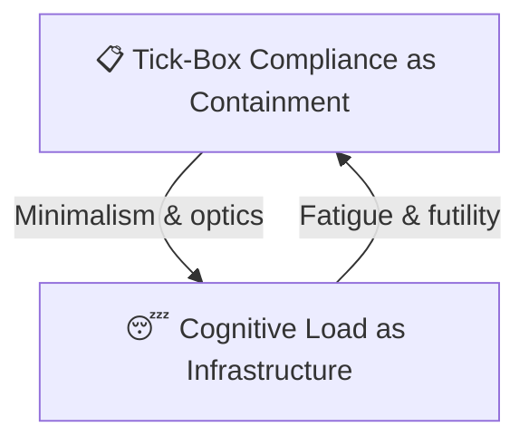

# 📋 Tickbox vs Cognitive Load  
**First created:** 2025-09-24 | **Last updated:** 2026-09-13  
*A feedback loop between institutional minimalism and survivor exhaustion.*

---

*Loop of containment: institutional minimalism breeds survivor exhaustion; exhaustion sustains institutional minimalism.*

---

## 🌌 Constellations  
📋 😴 🧠 🩹 — This node maps a recurring exhaustion loop that emerges from surface-level compliance structures.

---

## ✨ Stardust  
tickbox, exhaustion, compliance theatre, cognitive load, survivor fatigue, containment loop

---

## 🏮 Footer  

*Tickbox vs Cognitive Load* is a living node of the Polaris Protocol.  
It diagrams a self-reinforcing loop where institutional minimalism (tick-box culture) perpetuates survivor exhaustion, and that exhaustion enables further institutional withdrawal.

> 📡 Cross-references:
> 
> - [🧠 Psychological Containment](../../../../Metadata_Sabotage_Network/Narrative_And_Psych_Ops/🧠_Psychological_Containment/README.md) — *behavioural science repurposed as state containment*  
> - [📋 Tick-Box Compliance as Containment](./📋_tick_box_compliance_as_containment.md) — *institutional minimalism that simulates accountability while erasing systemic responsibility*  
>  
> 🏮 Return To:
>
> - [💫 Containment Logic](./README.md) — *1up*  
> - [♻️ Cybernetics](../README.md) — *2up*  
> - [🪿 Embodied Information Ecology](../../README.md) — *3up*  
> - [🌑 Origin Points](../../../README.md) — *4up*  
> - [🌌 Polaris Protocol — Root](../../../../README.md) — *root*  

*Survivor authorship is sovereign. Containment is never neutral.*  

_Last updated: 2026-09-13_
