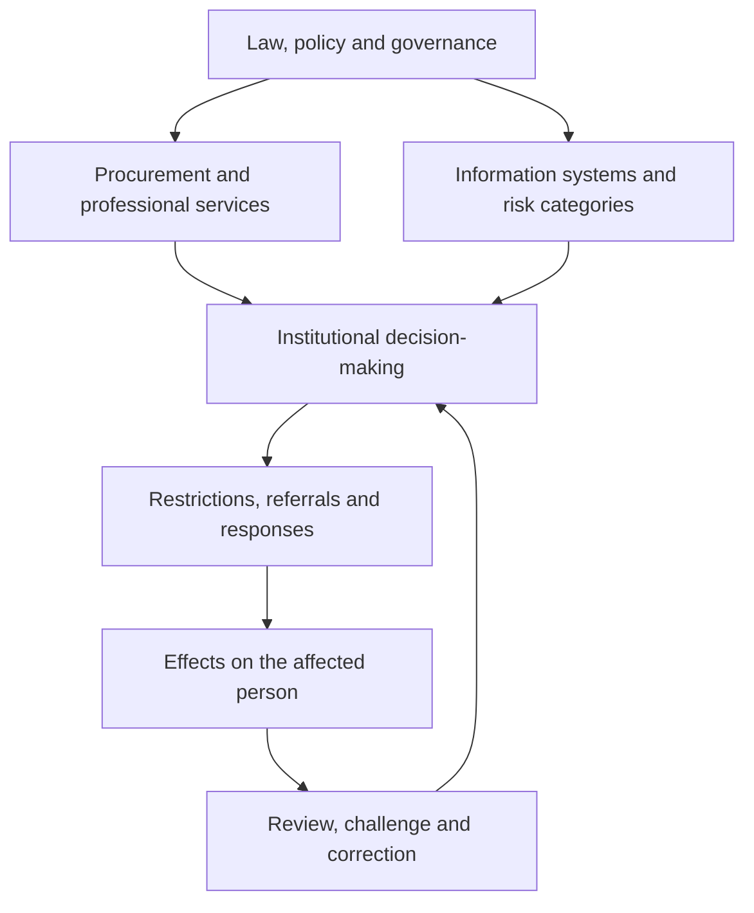

# 🕸️ Macro Containment Architecture  
**First created:** 2025-11-08 | **Last updated:** 2026-08-23  
*How containment emerges across connected institutions, information systems, procurement arrangements and governance processes without requiring a single central controller.*

---

## 🛰️ Orientation

Containment does not need a locked room.

It can be produced through interacting decisions about access, information, classification, escalation, responsibility and risk.

A person encounters one institution at a time: a university, a police force, a health service, a regulator, an employer or a complaints body.

Each institution may have its own formal duties, operational priorities and decision-making structure.

Yet their responses can converge.

They may use similar risk categories, share information, rely on comparable professional guidance, purchase related services or inherit assumptions from the same administrative environment.

The result can be a restrictive arrangement that no individual participant describes as containment, but which functions as containment when experienced across the whole system.

That distinction matters:

> **A distributed outcome does not, by itself, establish a centrally coordinated plan.**

It does, however, raise a legitimate governance question:

> **When several institutions contribute to the same restrictive effect, who is responsible for understanding, reviewing and correcting that effect?**

---

## ✨ Key Features

- Distinguishes containment as an observable structural effect from allegations about intention or coordination.
- Maps the relationship between policy, procurement, professional practice, information infrastructure and local decisions.
- Identifies how similar institutional responses can emerge across organisations without a single command chain.
- Separates protective, lawful and time-limited constraints from restrictions that become indefinite, disproportionate or unreviewable.
- Examines the transfer of risk, responsibility and practical consequences between institutions.
- Treats accessibility, challenge, correction and safe exit as essential parts of governance architecture.
- Preserves the distinction between protecting a person and managing that person as an institutional problem.

---

## 🧭 What Is Being Contained?

Before describing an architecture, it is necessary to identify the object of containment.

Different institutions may be trying to contain different things:

- A credible threat to someone’s safety.
- The spread of sensitive or inaccurate information.
- A safeguarding concern requiring investigation.
- A disruptive incident or operational emergency.
- Exposure to legal liability.
- Reputational damage.
- A complaint that cuts across organisational boundaries.
- Uncertainty about who has authority to act.
- A person’s access to services, information or decision-making processes.
- The administrative consequences of admitting that earlier decisions were wrong.

Those objects are not interchangeable.

Containing a credible threat is not the same as containing the person reporting it.

Restricting access to genuinely sensitive information is not the same as making an affected person unable to understand or challenge a decision.

Stabilising an emergency is not the same as preserving institutional comfort after the emergency has passed.

The first diagnostic question is therefore:

> **What is the system actually preventing from moving: harm, information, responsibility, reputational exposure, or the person who has become inconveniently attached to all four?**

---

## 🏗️ The Components of a Containment Architecture

A containment architecture is formed from several interacting layers.

### 1. Policy and Governance

Public bodies operate within legal duties, national policies, professional guidance and internal governance frameworks.

These frameworks can shape:

- What counts as risk.
- Which concerns require escalation.
- How information may be shared.
- Who can approve an intervention.
- Which records must be created.
- What review or oversight should occur.

Shared policy language can produce similar practices across institutions.

That similarity does not establish that every decision came from the same instruction or that every organisation is acting under a common operational plan.

It does mean that apparently separate decisions may rest on overlapping assumptions.

### 2. Procurement and Professional Services

Institutions may obtain related services through public procurement, consultancy arrangements, legal advisers, communications teams, risk-management systems or specialist contractors.

These arrangements can distribute:

- Standardised assessment tools.
- Risk-management templates.
- Information-handling practices.
- Communications strategies.
- Reporting software.
- Organisational training.
- Incident-response procedures.

A shared product or contractor can create consistency.

It can also reproduce the same weaknesses across multiple settings.

The relevant question is not whether procurement exists. Of course it does.

The question is whether purchased tools and professional advice support lawful, accurate and accountable decision-making, or quietly make defensive practice easier to reproduce.

### 3. Information Infrastructure

Decisions increasingly depend on records, databases, referrals, case-management systems and professional communications.

A classification entered in one setting can influence later decisions elsewhere if it is shared, repeated or treated as authoritative.

Relevant features include:

- Accuracy and provenance.
- Access controls.
- Retention periods.
- Distinction between allegation, assessment and established fact.
- Opportunities for correction.
- Visibility of uncertainty.
- Audit trails.
- Limits on onward disclosure.
- Whether affected people can understand the practical consequences of a record.

Information does not need to be universally accessible to have a distributed effect.

It only needs to travel far enough, through sufficiently trusted channels, to influence decisions that matter.

### 4. Local Institutional Decisions

Containment becomes tangible through individual decisions:

- A referral is made.
- A meeting is postponed.
- A complaint is redirected.
- A support arrangement is withdrawn.
- Access to information is restricted.
- A concern is reclassified.
- A professional declines to act without another organisation’s approval.
- A risk description is repeated without examining its source.

Any one decision might have an innocent, lawful or operationally understandable explanation.

The governance issue arises when their cumulative effects are not examined.

A collection of locally defensible decisions can still produce a globally indefensible outcome.

### 5. Feedback, Reinforcement and Review

Institutions learn from incidents, complaints, litigation, professional guidance and perceived reputational exposure.

Those feedback processes can improve protection.

They can also reinforce defensive habits:

- A complaint becomes evidence that the complainant is difficult.
- Distress caused by restriction becomes evidence supporting further restriction.
- Institutional disagreement becomes a reason for everyone to wait.
- The absence of resolution is interpreted as proof that the situation remains too risky to resolve.
- A decision survives because its consequences make reversal administratively embarrassing.

Where feedback only confirms the existing frame, containment becomes self-maintaining.

The issue is not simply that a loop exists.

The issue is whether the loop contains a functioning correction mechanism.

---

## 🕸️ How the Layers Interact

This diagram is a model of possible relationships.

It is not a claim that every public institution sits inside one operational hierarchy, that all contractors act on common instructions, or that a particular person is necessarily subject to coordinated monitoring.

Its purpose is to show how a system can generate connected effects even when formal responsibilities are distributed.

If the review-and-correction loop works, restrictive decisions can be reassessed.

If it does not, the architecture can continue producing restrictions long after anyone is able to explain their current purpose.

---

## ⚖️ Lawful Constraint Is Not the Same as Coercive Containment

Some restrictions are necessary.

Institutions may need to preserve evidence, protect confidential information, manage credible threats or prevent immediate harm.

The existence of a boundary does not establish wrongdoing.

The relevant questions concern the quality and limits of the boundary:

- What is the legal or operational basis?
- What specific risk is being addressed?
- Is the restriction necessary?
- Is it proportionate to that risk?
- Who authorised it?
- Who is responsible for reviewing it?
- What information can be provided to the affected person?
- How can errors be corrected?
- What support remains available?
- When should the restriction end?

A protective arrangement should become more intelligible and more reviewable as circumstances stabilise.

An arrangement that becomes less intelligible, less challengeable and more difficult to leave requires closer scrutiny.

Especially when the institution can explain the paperwork but nobody can explain the exit.

---

## 🧩 How Distributed Containment Can Emerge

A restrictive outcome can arise through several different mechanisms.

### Shared Assumptions

Different organisations may adopt similar interpretations because they rely on the same professional terminology, guidance or cultural assumptions.

### Repeated Classification

A risk label can acquire authority through repetition, even where its original evidential basis is weak, outdated or unclear.

### Responsibility Diffusion

Each organisation assumes that another body has the relevant authority, information or duty to intervene.

### Defensive Escalation

Staff pass a difficult issue upwards or sideways because acting directly appears professionally risky.

### Procurement Standardisation

Common tools, consultants or templates make particular responses easier to reproduce across otherwise separate institutions.

### Information Asymmetry

Institutions can see records or assessments that the affected person cannot meaningfully inspect, contextualise or challenge.

### Reputational Protection

Organisations may prioritise controlling exposure, communications or liability over examining the underlying harm.

### Feedback Without Correction

Institutional responses generate consequences that are then treated as justification for maintaining the original response.

None of these mechanisms requires every participant to understand the whole arrangement.

That is part of the problem.

A system can become difficult to challenge precisely because nobody sees enough of it to accept responsibility for its combined effects.

---

## 🧠 Intent, Coordination and Emergence

Different explanations must not be collapsed into one another.

A repeated institutional pattern could arise from:

1. Similar lawful duties.
2. Common training or professional norms.
3. Shared vendors or technical systems.
4. Organisational imitation.
5. Incomplete or inaccurate information.
6. Defensive decision-making.
7. A formally coordinated multi-agency process.
8. Deliberate misconduct.

Those possibilities require different kinds of evidence.

For example:

- Similar wording may show that organisations use common terminology.
- A shared contractor may show that institutions purchase related services.
- A referral record may establish that information passed between named bodies.
- A documented instruction may establish a specific direction or decision.
- A proven act of deception may support a more serious conclusion about misconduct.

One category does not automatically prove the next.

The analytical discipline is to describe the observed structure accurately while remaining precise about what is known, inferred or still unresolved.

A system does not need a supervillain to produce a harmful outcome.

It also does not become harmless merely because nobody has volunteered to be the villain.

---

## 🔬 What Makes an Architecture Unsafe?

A containment architecture becomes more concerning where several conditions accumulate:

- The person affected cannot identify the decision-maker.
- Institutions rely on classifications that cannot be meaningfully examined.
- Allegations are repeated as though they were established facts.
- Restrictions continue without a clear review point.
- Responsibility is fragmented between organisations.
- Necessary support is withdrawn or made conditional on compliance.
- Legitimate disagreement is treated as behavioural risk.
- The person cannot correct inaccurate records.
- Complaints disappear into the same structures being challenged.
- Staff cannot safely raise concerns about the prevailing approach.
- The practical consequences extend beyond the organisation that made the original decision.
- There is no realistic route to resolution, remedy or safe exit.

The presence of one feature does not settle the issue.

The accumulation of several features changes the level of concern.

A safeguarding architecture with no visible safeguards around its own operation is not reassuring simply because everyone involved has a policy.

---

## 🛠️ Practical Diagnostic Questions

To examine a possible containment architecture, ask:

1. **Object:** What is supposedly being contained?
2. **Authority:** Who has lawful or operational authority to make the relevant decisions?
3. **Boundary:** What restrictions exist in practice?
4. **Information:** What records, labels or assessments are influencing the outcome?
5. **Transmission:** How do those records or assumptions move between organisations?
6. **Evidence:** Which claims are documented, inferred or disputed?
7. **Purpose:** Is the stated purpose protective, administrative, reputational or unclear?
8. **Proportionality:** Are the restrictions appropriate to the identified risk?
9. **Support:** What practical protection and assistance remain available?
10. **Review:** Who can independently reassess the arrangement?
11. **Correction:** How can factual errors or misleading classifications be challenged?
12. **Exit:** What must happen for the restrictive conditions to end?

If those questions cannot be answered, that absence is itself relevant.

Not proof of a hidden master plan.

Proof that the governance picture is incomplete.

---

## 🧀 When the Holes Align

Distributed containment often becomes harmful through the same structural pattern explored in the safeguard-failure cluster.

No single failure has to explain the whole outcome.

Instead:

- One institution accepts a questionable classification.
- Another assumes that the first institution checked it.
- A third restricts support while waiting for clarification.
- A fourth declines to intervene because responsibility appears to lie elsewhere.
- The affected person encounters the combined consequences without access to the combined reasoning.

Each layer may believe it has performed its limited role.

The person still falls through all of them.

See [🧀 When Process Holes Align](./🧀_when_process_holes_align.md) for the wider analysis of cumulative safeguard failure.

---

## 🪼 Containment Must Have an End Condition

A legitimate containment arrangement cannot be defined only by its ability to hold a situation in place.

It must also explain:

- What stabilisation is intended to achieve.
- What evidence would justify changing the approach.
- Which decisions require independent review.
- How support and ordinary functioning will be restored.
- What happens when the original risk changes.
- Who is responsible for resolution.
- How the affected person can leave the arrangement safely.

A system that can contain indefinitely but cannot describe the conditions for repair has not completed the governance task.

It has merely found a way to postpone it.

---

## 🌌 Constellations

🕸️ ⚖️ 🌀 🧩 🧬 ❌ 🪼 🧀

Distributed governance, lawful authority, institutional risk management, information infrastructure, behavioural classification, cumulative safeguard failure, dependency, review and safe exit.

---

## ✨ Stardust

macro containment architecture, distributed governance, institutional containment, public sector procurement, information systems, risk classification, multi-agency decision-making, responsibility diffusion, procedural safeguards, reputational management, feedback loops, lawful authority, proportionality, independent review, record correction, structural dependency, safe exit conditions, survivor authorship, Polaris Protocol

---

## 🏮 Footer

*🕸️ Macro Containment Architecture* is a living node of the Polaris Protocol.

It examines how restrictive outcomes can emerge across connected institutions, governance systems and information infrastructures, and why lawful authority, independent review and safe exit must remain visible at every stage.

> 📡 Cross-references:
>
> - [⚖️ Autonomy vs Containment Dial](./⚖️_autonomy_vs_containment_dial.md) — autonomy, protection and the limits of legitimate constraint.
> - [🌀 Ambiguity as Containment](./🌀_ambiguity_as_containment.md) — unclear rules, responsibilities and thresholds as restrictive mechanisms.
> - [🌀 Behavioural Containment and Unfalsifiable Suspicion](./🌀_behavioural_containment_and_unfalsifiable_suspicion.md) — the conversion of governance concerns into behavioural suspicion.
> - [❌ Dependency, Identity and No Safe Exit](./❌_dependency_identity_and_no_safe_exit.md) — structural dependence, identity compression and inaccessible exit.
> - [🪼 Beyond Containment](./🪼_beyond_containment.md) — the transition from stabilisation to review, resolution and repair.
> - [🧀 When Process Holes Align](./🧀_when_process_holes_align.md) — cumulative safeguarding failures across connected institutional layers.
> - [🧭 Regulating the Regulators: Oversight of Oversight](./🧭_regulating_the_regulators_oversight_of_oversight.md) — independent scrutiny where accountability is distributed.

*Survivor authorship is sovereign. Containment is never neutral.*

_Last updated: 2026-08-23_
