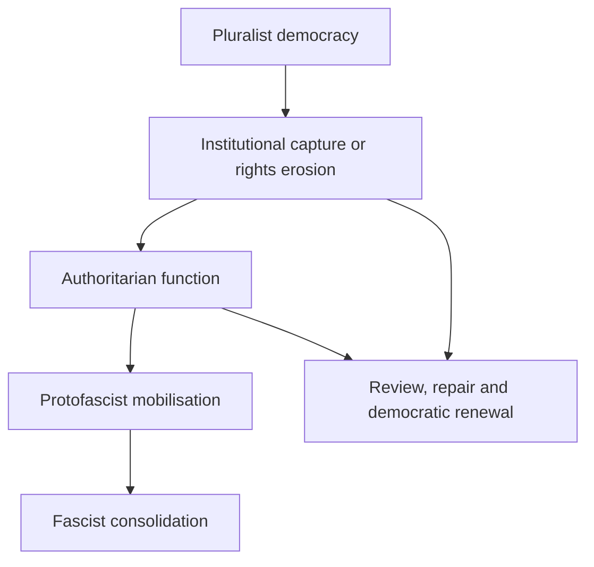

# 🧭 Are We Fascist Yet?
**First created:** 2025-11-09 | **Last updated:** 2026-09-13  
*A UK-specific diagnostic for recognising authoritarian and protofascist drift before democratic collapse.*

---

## 🛰️ Orientation

This node examines the civic moment when governance continues to perform democracy while some of its systems begin operating through containment.

Polaris treats “Are we fascist yet?” as a **forensic question**, not a slogan and not a binary quiz. The useful task is to distinguish:

- ordinary democratic failure;
- illiberal or authoritarian practice;
- democratic backsliding;
- protofascist mobilisation;
- and a consolidated fascist regime.

These conditions can overlap without being interchangeable. A state may commit grave rights violations without satisfying a defensible definition of fascism. Conversely, waiting for every historical feature to appear can make the diagnosis useless as an early-warning tool.

---

## ✨ Key Features

- **Security overreach** — exceptional powers and surveillance becoming ordinary governance.
- **Legal asymmetry** — law constraining dissent more reliably than concentrated power.
- **Civic chilling** — political participation recoded as extremism or disorder.
- **Performative parliamentarism** — formal debate surviving while scrutiny loses practical force.
- **Administrative containment** — welfare, health, data and complaint systems disciplining rather than supporting.
- **Regenerative nationalism** — national decline answered through myths of purification, restoration or rebirth.

---

## 🧿 The Diagnostic Problem

“Fascism” has a historical core but contested boundaries.

Umberto Eco’s *Ur-Fascism* identifies a family resemblance among recurring features, including tradition, fear of difference, conspiratorial thinking, contempt for weakness, permanent struggle and selective populism. Roger Griffin places greater definitional weight on **palingenetic ultranationalism**: a revolutionary myth that a degraded nation must be reborn.

Neither approach supports diagnosing a country from one policy, one abusive institution or one unpopular government. The relevant evidence is cumulative:

- ideology;
- mobilisation;
- political violence;
- treatment of out-groups;
- executive power;
- destruction of independent constraints;
- and the claimed route to national renewal.

---

## 📋 A UK Threshold Table

| Domain | Democratic failure or illiberal drift | Stronger protofascist signal | Consolidation threshold |
|---|---|---|---|
| **Elections** | Distorted access, funding or information environment. | Systematic delegitimation of adverse results and opponents as internal enemies. | Elections abolished, rendered non-competitive or stripped of meaningful transfer of power. |
| **Rule of law** | Selective enforcement, delay and practical inequality. | Political direction of enforcement and immunity for aligned actors. | Courts and law subordinated to executive or movement authority. |
| **Dissent** | Chilling protest, surveillance and expansive public-order powers. | Organised repression of opposition as anti-national contamination. | Opposition organisations suppressed, criminalised or physically eliminated. |
| **Public administration** | Defensive secrecy, capture and politicised appointments. | Loyalty replacing competence across the state. | Civil service, regulators and coercive institutions fused with the ruling movement. |
| **Media and knowledge** | Concentrated ownership, intimidation and information disorder. | Coordinated delegitimation of independent truth-producing institutions. | Independent media and scholarship disabled or placed under regime control. |
| **National story** | Nostalgia, exceptionalism and culture-war politics. | Myth of national rebirth through exclusion, purification or redemptive struggle. | The rebirth myth becomes the organising legitimacy of the state. |
| **Violence** | Unequal protection and tolerated intimidation. | Paramilitary or movement violence normalised against designated enemies. | Political violence integrated into state or ruling-party control. |

The table is not a checklist in which four ticks equal fascism. It prevents one dramatic feature from carrying the entire diagnosis while also making cumulative movement visible.

---

## 🗂️ The British Modality

British authoritarian drift is often imagined as paperwork rather than parade: delegated power, administrative delay, opaque procurement, data classification, legal asymmetry and polite institutional closure.

That is a useful national caution, not a claim that continental fascisms were merely theatrical or that Britain lacks histories of overt coercion and political violence. Empire, emergency government, policing and border administration provide abundant British precedents for coercion carried through both documents and force.

The question is therefore not whether authoritarianism looks sufficiently foreign. It is whether power is becoming harder to contest, correct, review and remove.

---

## 🪞 Mirror Modernisms

| Axis | Governing story | Possible expression |
|---|---|---|
| **Future-worship authoritarianism** | Progress is inevitable and scrutiny is obstruction. | Accelerationism, automated control, innovation insulated from democratic review. |
| **Nostalgic authoritarianism** | A purified national past must be recovered. | Imperial revivalism, heritage populism, exclusionary national restoration. |

The two can coexist. Technological futurism may be administered through institutions still organised around imperial hierarchy, while nostalgic politics may use the newest surveillance and communication systems available.

Neither axis is fascist by definition. The danger increases when technological inevitability or national restoration is joined to enemy construction, coercive mobilisation and destruction of pluralist constraint.

---

## 🧭 Containment Gradient

Movement is not necessarily linear or irreversible. Different institutions can occupy different positions simultaneously, and democratic repair may interrupt the sequence.

---

## 🔍 Questions That Keep the Threshold Visible

Ask:

1. Can executive power still be independently reviewed and practically constrained?
2. Can governments lose office through genuinely competitive elections?
3. Are political opponents treated as legitimate participants or contaminating enemies?
4. Are courts, regulators, universities, media and the civil service being subordinated to loyalty?
5. Is exceptional security logic becoming permanent ordinary administration?
6. Are minority groups losing equal protection, status or political membership?
7. Is state or movement violence becoming normal, deniable or celebrated?
8. Is national “rebirth” being offered through exclusion, purification or revenge?
9. Can citizens obtain records, correct data, challenge decisions and identify who owns an outcome?
10. Do oversight mechanisms alter conduct, or merely document it after the fact?

The final two questions are Polaris additions. They identify the administrative substrate through which overt political transformation may be enabled—or resisted.

---

## 🛰️ Public Oversight Hook

FOI, parliamentary questions, investigative journalism, litigation, audit, academic research and responsible OSINT help keep the threshold visible.

They are not automatically anti-fascist merely because they produce information. Their democratic value depends on whether disclosure is timely, evidence is contextualised, affected people can act on it, and institutions remain capable of correction.

> **Transparency without consequence becomes another performance. Transparency connected to remedy is democratic infrastructure.**

---

## ⚖️ Evidential Boundary

This node does not declare that the United Kingdom is presently a fascist state or assign it a settled “protofascist” status. It provides a structured method for examining drift.

Country-level democracy indices can reveal trends, but they measure different concepts and should not be silently converted into a fascism score. The diagnosis requires historical, ideological and institutional judgment alongside current evidence.

The sharpest warning is not any single abusive act. It is convergence: exclusionary rebirth politics, captured institutions, disabled opposition, unequal law and coercive mobilisation beginning to reinforce one another.

---

## 📚 Sources

- [The New York Review of Books: “Ur-Fascism” — Umberto Eco](https://www.nybooks.com/articles/1995/06/22/ur-fascism/) — *family-resemblance account of recurring fascist features*  
- [Roger Griffin: *The Nature of Fascism*](https://books.google.com/books/about/The_Nature_of_Fascism.html?id=544bouZiztIC) — *the palingenetic-ultranationalist account of fascism’s ideological core*  
- [V-Dem Institute: “Democracy Report 2026 — Unravelling the Democratic Era?”](https://www.v-dem.net/publications/democracy-reports/) — *comparative evidence on democratic institutions and global autocratisation*  
- [House of Lords Constitution Committee: “The rule of law”](https://committees.parliament.uk/work/8124/the-rule-of-law/) — *UK parliamentary scrutiny of rule-of-law principles and pressures*  
- [Council of Europe: “Rule of Law Checklist”](https://www.venice.coe.int/webforms/documents/?pdf=CDL-AD(2016)007-e) — *institutional framework for legality, legal certainty, abuse prevention, equality and access to justice*  

---

## 🌌 Constellations

🧭 ⚖️ 🧿 🛰️ 🐝 — authoritarian-drift diagnosis, rule of law, public oversight, institutional evidence and democratic repair.

---

## ✨ Stardust

fascism, protofascism, uk politics, democratic backsliding, state capture, bureaucratic authoritarianism, surveillance, rule of law, civic repair, palingenetic ultranationalism, containment literacy

---

## 🏮 Footer

*🧭 Are We Fascist Yet?* is a living node of **Containment Logic**, within the **Polaris Protocol**. It provides an early-warning framework for distinguishing democratic failure, authoritarian drift, protofascist mobilisation and fascist consolidation without collapsing them into a slogan.

> 📡 Cross-references:
>
> - [⚖️ Above the Law — Protofascism Threshold](./⚖️_above_the_law_protofascism_threshold.md) — *legal and economic immunity as an authoritarian threshold condition*  
> - [🧮 Optimisation and the Fascism of Efficiency](./🧮_optimisation_and_the_fascism_of_efficiency.md) — *efficiency logic displacing pluralism, friction and human judgment*  
> - [📈 Polished Authoritarianism](./📈_polished_authoritarianism.md) — *coercive function presented through professional and procedural legitimacy*  
> - [🕊️ Positive Drift](./🕊️_positive_drift.md) — *institutional movement towards pluralism, correction and democratic renewal*  
>
> 🏮 Return To:
>
> - [💫 Containment Logic](./README.md) — *1up*  
> - [♻️ Cybernetics](../README.md) — *2up*  
> - [🪿 Embodied Information Ecology](../../README.md) — *3up*  
> - [🌑 Origin Points](../../../README.md) — *4up*  
> - [🌌 Polaris Protocol — Root](../../../../README.md) — *root*

*Survivor authorship is sovereign. Containment is never neutral.*

_Last updated: 2026-09-13_
