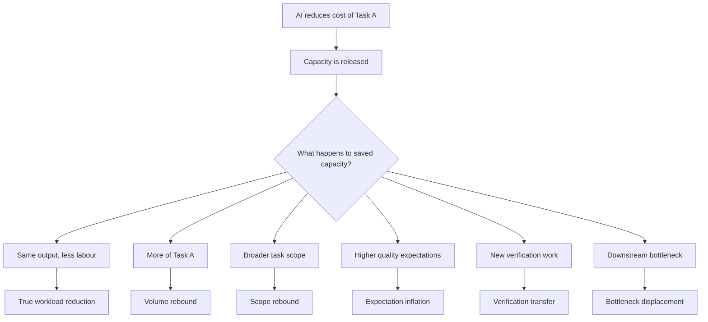
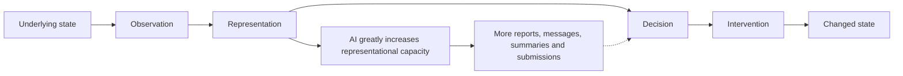

# 📥 AI vs Work
**First created:** 2026-08-25 | **Last updated:** 2026-08-25  
*Why reducing the cost of a task does not necessarily reduce the total amount of work performed by a system.*

---

## 🛰️ Orientation

AI saves labour.

That statement can be perfectly true.

A drafting task that once took thirty minutes may take five. A clinician may spend less time constructing a letter. A programmer may generate boilerplate in seconds. A civil servant may summarise a long submission without reading every paragraph from scratch.

The cybernetic question begins **after** the saving appears.

What happens to the released capacity?

Does the worker finish earlier?

Does the organisation produce more?

Do standards rise?

Does demand increase?

Does somebody downstream receive more work?

Does creation become verification?

Does a new bottleneck appear?

Does the system become better at resolving underlying problems, or merely faster at producing representations of them?

> **Task-level efficiency is not the same thing as system-level efficiency.**

AI can reduce work.

AI can also relocate it, multiply it, intensify it or make previously uneconomic work possible.

The outcome depends upon the feedback around the tool.

---

## ⏱️ Task-Level Efficiency Is Not System-Level Efficiency

At least three levels need to be separated.

### Unit Productivity

How long does one task take?

Examples:

- minutes per email;
- minutes per report;
- minutes per summary;
- minutes per referral;
- minutes per code function.

This is where many AI trials produce impressive results.

Those results can be real.

### Organisational Productivity

What does the organisation do with the saved capacity?

Possible outcomes include:

- same output with fewer labour hours;
- more output with the same workforce;
- broader task scope;
- higher expected quality;
- more personalised output;
- additional checking;
- increased coordination;
- increased demand from other teams.

### System Performance

Does the underlying state improve?

A government department may answer more letters.

A hospital may produce more documentation.

A court may process more documents.

A company may review more applications.

Those are activities.

The system-level question is whether they produce more:

- resolved cases;
- treated patients;
- corrected errors;
- successful placements;
- sound decisions;
- repaired services;
- useful interventions.

A thirty-minute task becoming a one-minute task demonstrates a task-level efficiency gain.

It does not tell us:

- how many tasks will now be produced;
- whether demand rises;
- whether checking increases;
- whether downstream teams become overloaded;
- whether expectations change;
- whether the underlying problem is resolved.

---

## 🌀 Where The Saved Work Goes



There is no requirement that every AI deployment follow the lower branches.

The point is that **capacity release is a branching point, not an outcome**.

---

## ♻️ Productivity Rebound

The simplest rebound occurs when lowering the cost of producing something increases the amount produced.

This resembles the family of effects often associated with Jevons-style rebound, but not every AI workload effect should be casually labelled a Jevons paradox.

The useful mechanism is simpler:

```text
lower task cost
→ increased feasible production
→ increased production
→ some or all of the original saving is consumed
```

Possible examples include:

- more job applications;
- more grant proposals;
- more correspondence;
- more reports;
- more code;
- more analyses;
- more personalised variants;
- more administrative interactions.

The unit cost can fall dramatically while total system expenditure remains stable or rises.

That is not a contradiction.

It is adaptation.

---

## 🔍 Verification Transfer

Generative AI frequently moves work from:

```text
creation
↓
checking
```

This can still be an excellent trade.

If a thirty-minute drafting task becomes:

```text
one minute generation
+
five minutes checking
```

the worker has saved twenty-four minutes.

But verification is not merely abbreviated creation.

It has different cognitive requirements:

- sustained attention;
- anomaly detection;
- factual checking;
- source verification;
- consistency checking;
- accountability for the final output;
- resistance to automation bias;
- recognition of plausible but incorrect material.

A workflow therefore needs to measure **verification cost**, not assume that generation cost equals total cost.

There are also settings in which editing and checking can consume much of the expected gain.

The appropriate question is empirical:

> **Is verification cheaper than the production process it replaces, at the accuracy and accountability level the task actually requires?**

---

## 🚧 Bottleneck Displacement

Systems are often constrained by a bottleneck.

Making one stage dramatically faster does not remove scarcity if the next stage remains constrained.

Examples:

```text
code generation
→ code review
```

```text
referral drafting
→ specialist triage
```

```text
job applications
→ candidate screening
```

```text
grant proposals
→ evaluator attention
```

```text
inspection reports
→ quality assurance
```

```text
legal drafting
→ judicial attention
```

AI may solve the original bottleneck so successfully that another bottleneck becomes visible.

The system is then faster at delivering work to the constraint.

This can feel like failure even when the original automation works exactly as intended.

The work has moved.

---

## 📈 Scope Rebound

Saved capacity does not have to become more of the same task.

It can expand the range of tasks attempted.

People may use AI to do work that previously required expertise, money or time they did not possess.

Examples include:

- non-programmers producing small pieces of code;
- citizens preparing formal appeals themselves;
- staff undertaking analyses previously considered too expensive;
- teams producing personalised versions of documents;
- workers exploring more scenarios before deciding;
- applicants tailoring every submission rather than reusing one generic version.

This can be socially valuable.

It can improve access and increase organisational capability.

It also means that “hours saved” may not appear as shorter working hours.

They may appear as **expanded ambition**.

---

## 🧠 Cognitive Rebound

If cognitive operations become cheaper, people can perform more of them.

AI can support:

- additional iterations;
- more alternatives;
- more drafts;
- more scenarios;
- more summaries;
- more comparisons;
- more parallel tasks.

The individual microtask becomes easier.

The total cognitive environment can become more intense.

Workers may move faster between tasks, supervise more simultaneous work or take responsibility for domains previously outside their role.

This is one reason subjective workload and task-level time saving can move in different directions.

---

## 🎯 Expectation Inflation

Capabilities can become norms.

If producing a polished document becomes much easier, a polished document may cease to be exceptional.

If personalised communication becomes cheap, personalised communication may become expected.

If five alternatives can be generated in seconds, one proposal may begin to look insufficient.

The productivity gain can therefore be absorbed by a rising standard of expected output.

Yesterday:

```text
one report
```

Tomorrow:

```text
one report
+ executive summary
+ five tailored versions
+ presentation
+ FAQ
+ scenario analysis
```

Nobody has necessarily ordered workers to become less efficient.

The definition of **normal output** has changed.

---

## 📣 Signal Dilution

Cheap production can change what an output signifies.

Before generative AI, a highly polished artefact might partially signal:

- time invested;
- expertise;
- writing ability;
- preparation;
- access to professional support;
- seriousness.

Those signals were never perfect.

They were also unequally distributed.

Generative AI weakens the relationship further.

A polished:

- CV;
- complaint;
- proposal;
- legal submission;
- essay;
- report

can now be produced with far less direct labour.

That can be democratising.

It can also make surface quality less informative to the receiver.

The receiver then needs new ways to distinguish:

- expertise from fluency;
- evidence from confidence;
- genuine tailoring from synthetic tailoring;
- useful signal from inexpensive polish.

Those new screening mechanisms create work.

---

## 🧱 Representation Versus State Change

One of the most important distinctions is between **automation of representation** and **automation of intervention**.

### Automation Of Representation

AI is particularly good at producing or transforming representations:

- reports;
- letters;
- summaries;
- notes;
- dashboards;
- explanations;
- submissions;
- classifications;
- chronologies.

These are not pointless.

Complex systems require representations in order to coordinate, remember, decide and account for what they have done.

### Automation Of Intervention

The underlying state changes when something happens in the world:

- treatment is delivered;
- infrastructure is repaired;
- a service is provided;
- a decision is made;
- money is transferred;
- a dispute is resolved;
- an error is corrected;
- a resource is allocated.

Increasing representational capacity does not automatically increase intervention capacity.

A system can therefore become extremely productive at **describing, recording and responding to its own unresolved state**.

---

## 🔄 Representation Can Outrun Resolution



If the pathway from representation through decision to intervention does not scale alongside representational capacity, information can accumulate faster than corrective action.

This produces a particularly dangerous productivity illusion.

The dashboard can show:

- more correspondence answered;
- more documents processed;
- faster response times;
- more cases touched;
- more reports completed.

The underlying error may remain.

---

## 📊 The Wrong Productivity Metrics

AI systems are often evaluated through measures that are easy to count.

Potentially misleading measures include:

- drafts per hour;
- messages answered;
- documents processed;
- reports produced;
- cases touched;
- summaries generated;
- average drafting time;
- queue throughput.

These can all be useful operational measures.

They become misleading when treated as proxies for the final outcome.

Better measures may include:

- cases resolved;
- first-contact resolution;
- repeat work avoided;
- downstream work generated;
- verification cost;
- exception rate;
- total labour per resolved outcome;
- intervention latency;
- error corrected;
- rework;
- user effort;
- staff effort;
- unresolved demand.

The question is not merely:

> **Did AI make the task faster?**

It is:

> **Did the total system require less effort to achieve the desired state?**

---

## 🧮 A Simple System Accounting Model

A useful conceptual model is:

```text
Net labour effect
=
task labour saved
− additional volume
− verification work
− coordination work
− downstream work
− rework
± scope expansion
```

This is not a universal quantitative equation.

It is an accounting prompt.

It forces analysis to look beyond the task where the saving first appeared.

Likewise:

```text
System productivity
≠
task speed
```

A more outcome-oriented comparison is:

```text
Useful gain
=
resolution gained
/
total system effort
```

Again, this is a conceptual diagnostic rather than a formal universal metric.

The point is to keep **resolution** visible.

---

## 🧬 When AI Actually Does Reduce Work

Rebound is not inevitable.

AI can produce genuine reductions in total workload.

Conditions favouring that outcome include:

- demand does not expand proportionally;
- output expectations remain stable;
- verification is substantially cheaper than original production;
- error rates remain acceptably low;
- downstream capacity can absorb increased throughput;
- the automated stage was the real system bottleneck;
- saved capacity is actually removed, protected or redirected;
- repeat work falls;
- the intervention layer scales alongside information processing.

Some healthcare imaging workflows, for example, provide evidence that appropriately designed AI assistance can reduce reading workload rather than simply moving it elsewhere.

The existence of rebound mechanisms is therefore not an argument against AI.

It is an argument against assuming the system-level result from the unit-level benchmark.

---

## 🪤 When AI Creates More Work

Conditions favouring workload expansion include:

- elastic demand;
- reciprocal adoption by interacting parties;
- very cheap submission;
- expensive verification;
- scarce downstream attention;
- high accountability requirements;
- easy iteration;
- easy escalation;
- metrics rewarding throughput;
- organisations reinvesting every saved minute into additional production;
- unclear stopping conditions;
- output whose surface plausibility exceeds its reliability.

Several of these can coexist.

The more that do, the less useful “minutes saved per task” becomes as a description of what the organisation is experiencing.

---

## 🧭 Diagnostic Questions

When evaluating an AI productivity claim, ask:

1. **What task is supposedly being made cheaper?**
2. **How much labour does the task actually save after verification?**
3. **What happens to demand when the task becomes cheaper?**
4. **Who receives the additional output?**
5. **What must a human still verify?**
6. **Where does the bottleneck move?**
7. **Does the scope of expected work expand?**
8. **Do output standards rise?**
9. **Does the intervention layer scale too?**
10. **Does repeat contact or rework fall?**
11. **Does total labour per resolved outcome fall?**
12. **Who captures the released capacity?**
13. **What is the stopping condition?**
14. **What would count as evidence that the deployment has increased total work?**

The last question matters.

A productivity claim that cannot specify its own failure condition is difficult to evaluate cybernetically.

---

## 🔗 From Work To Feedback Environment

An isolated worker can experience a genuine efficiency gain.

A system becomes more complicated when multiple participants acquire the same capability.

One person's output is another person's input.

A citizen's faster complaint becomes a council officer's additional correspondence.

A department's faster response becomes material the citizen can answer.

A candidate's faster application becomes a recruiter's screening task.

A recruiter's automated response changes applicant behaviour.

A researcher's cheaper proposal becomes an evaluator's workload.

An evaluator's automated screening changes the economics of accepting proposals.

Once those reciprocal effects matter, the unit of analysis is no longer the worker or the task.

It is the **feedback environment**.

See [📥 Chattering Chatbots](../♻️🕸️_The_Feedback_Environment/📥_chattering_chatbots.md) for the ecological case: what happens when information-production capacity rises on multiple sides of the same administrative relationship.

---

## 🌌 Constellations

📥 ♻️ 🧮 🕸️ 🧠 — productivity rebound; verification transfer; bottleneck displacement; resolution-aware system analysis.

---

## ✨ Stardust

artificial intelligence, productivity, rebound effects, verification, bottlenecks, workload, automation, administrative labour, system efficiency, resolution

---

## 🏮 Footer

*📥 AI vs Work* is a living node of the **Polaris Protocol**.  
It provides a cybernetic framework for distinguishing task-level AI efficiency from system-level workload, tracing where saved labour goes and whether increased information-processing capacity produces increased resolution.

> 📡 Cross-references:
>
> - [📥 Chattering Chatbots](../♻️🕸️_The_Feedback_Environment/📥_chattering_chatbots.md) — *reciprocal automation across administrative and information environments*  
> - [♻️🕸️ The Feedback Environment](../♻️🕸️_The_Feedback_Environment/) — *system-level interaction between signals, responses and adaptive participants*  
> - [♻️ Cybernetics](./) — *general feedback, control, adaptation and system-dynamics framework*  

*Survivor authorship is sovereign. Containment is never neutral.*

_Last updated: 2026-08-25_
