# 🧬 Start Here

**First created:** 2026-08-25 | **Last updated:** 2026-09-21  
*Friendly entry points into cybernetics, feedback, information, models, context and diagram literacy.*

---

## 🛰️ Orientation

Cybernetics can become intimidating unnecessarily quickly.

The vocabulary is technical. The diagrams multiply. Feedback, regulation, control, information, modelling, adaptation and observation begin interacting with one another before a new reader has had much opportunity to become comfortable with any of them.

This folder starts more gently.

The aim is not to remove the complexity.

It is to build enough intuition that the complexity becomes easier to follow.

That means beginning with familiar systems, ordinary language and simple diagrams before moving into denser theoretical material.

Sometimes the familiar system is Fitzwilliam Darcy.

This is pedagogically defensible.

Sometimes it is Anne Elliot quietly producing enough contradictory telemetry to break an eight-and-a-half-year-old model.

This is also pedagogically defensible.

---

## 🪭 Austen Cybernetics

Jane Austen is useful here because her novels repeatedly give us people:

- acting from internal models;
- observing one another;
- interpreting incomplete information;
- receiving feedback;
- discovering prediction errors;
- revising beliefs;
- changing behaviour;
- carrying historical state;
- modelling other observers;
- signalling under social constraints;
- mistaking proxies for underlying variables;
- encountering information that does not fit the current model;
- and affecting one another in return.

In other words, the novels contain excellent small-scale systems.

But the Austen Cybernetics nodes have developed into something slightly larger than a collection of literary examples.

They are an **interoperability layer between existing literacies**.

A reader trained in systems thinking may already have vocabulary for feedback, latent state, observability, perturbation, objective functions, adversarial signalling and embedded observers.

A reader trained by literature, social history, fandom, cultural analysis or simply years of paying very close attention to fictional people may already recognise many of the same problems without using those terms.

Neither vocabulary replaces the other.

The useful moment is:

> **WAIT, YOU HAVE A WORD FOR MY THING?**

Exchange dictionaries immediately.

These nodes do not translate literature *into* cybernetics, or cybernetics *into* literature.

They build enough interface between ways of knowing that each can make more of the information the other already carries.

---

## 🪭 100 Level — *Pride and Prejudice*

The 100-level nodes begin with relatively clean problems:

- feedback;
- observation;
- inference;
- signals;
- internal models;
- prediction error;
- and revision.

The question is initially quite simple:

> **What happens when information enters a system, and what happens when the system gets its interpretation wrong?**

### 🪭 101 — Feedback Changes What Happens Next

[`🪭_austen_cybernetics_101.md`](./🪭_austen_cybernetics_101.md)

Start here.

The first node uses Darcy's response to Elizabeth's rejection to introduce the simplest important idea:

> **Feedback is not merely information received. Its significance lies in whether information can return to a system and alter subsequent behaviour.**

The arc is:

```text
behaviour
    ↓
consequences
    ↓
feedback
    ↓
introspection
    ↓
model revision
    ↓
changed behaviour
```

It also introduces the relationship between feedback and agency.

Elizabeth does not merely exist inside Darcy's preferred outcome. She becomes an independent source of information capable of changing his model and his behaviour.

🪭 Fan the proto-ally.

---

### 📚 102 — The Data Did Not Say That

[`🪭_austen_cybernetics_102.md`](./🪭_austen_cybernetics_102.md)

Once the basic feedback loop is comfortable, make the information problem harder.

Darcy and Elizabeth both observe real things about one another.

They then assign different meanings to those observations.

This introduces:

- observation versus inference;
- signals and decoding;
- priors;
- hidden states;
- observer position;
- baseline information;
- asymmetric risk;
- incomplete information;
- model divergence;
- and falsification.

The running teaching case is BooksGate:

```text
OBSERVATION:
Elizabeth is thinking about Darcy instead of books.

DARCY'S INFERENCE:
😍😍😍

ACTUAL CONTEXT:
Elizabeth is trying to determine whether he is an awful person.
```

The core rule is:

> **The data did not say that. You said that about the data.**

---

## 🍓 200 Level — *Persuasion*

The 200-level nodes make the system substantially messier.

The problem is no longer merely that one observer has made a bad inference.

Now:

- everybody is modelling everybody else;
- those models alter behaviour;
- altered behaviour becomes new evidence;
- historical state persists;
- important internal states may be poorly observable;
- social rules constrain available signalling channels;
- crisis changes what can be seen;
- apparently trustworthy metadata can be gamed;
- accurate models can still be used towards harmful objectives;
- the observer is inside the system being observed;
- and later information can change the causal meaning of things that were already witnessed.

Welcome to *Persuasion*.

### 🍓 201 — The Eight-Year Incident Ticket

[`🍓_austen_cybernetics_201.md`](./🍓_austen_cybernetics_201.md)

Begin with **historical state, path dependence and unresolved feedback**.

Anne and Wentworth do not meet again as blank systems.

They arrive carrying eight years of memory, interpretation, injury, attachment and stale models.

The incident is old.

The state is still live.

---

### 🍓 202 — Wingman Anne

[`🍓_austen_cybernetics_202.md`](./🍓_austen_cybernetics_202.md)

Introduce **latent state, observability, observer effects and recursive feedback**.

Anne loves Wentworth.

Anne believes Wentworth loves Louisa.

Anne therefore tries not to interfere with Wentworth's presumed happiness.

Wentworth can then observe Anne's non-interference and misread it as evidence that Anne does not love him.

```text
hidden state
    ↓
changes behaviour
    ↓
behaviour is observed
    ↓
observer infers the hidden state is absent
    ↓
observer behaves accordingly
    ↓
system gets worse
```

> **Anne has become such an effective wingman that she is actively degrading observability of her own thirst.**

Both controllers are functioning.

The shared situational picture is fucked.

---

### 🍓 203 — Bro, Your Model Has One Fucking Feature

[`🍓_austen_cybernetics_203.md`](./🍓_austen_cybernetics_203.md)

Move into **proxy failure, low-dimensional models and requisite variety**.

Wentworth has compressed several different human properties into one preferred variable: firmness.

But firmness is not automatically:

- constancy;
- judgement;
- courage;
- adaptability;
- competence;
- or good character.

A model with too little variety cannot represent the system it is trying to describe.

> **BRO, YOUR MODEL HAS ONE FUCKING FEATURE.**

---

### 🍓 204 — When the Ship Is on the Line

[`🍓_austen_cybernetics_204.md`](./🍓_austen_cybernetics_204.md)

The Cobb introduces **perturbation, stress testing, latent capability and adaptive control**.

Anne does not suddenly become competent because Louisa falls.

The crisis changes the conditions under which Anne's existing competence can be observed.

> **Crisis does not create Anne's competence; it changes the conditions under which it can be observed.**

Sometimes the system already contained the capability.

Normal conditions simply hid it.

---

### 🍓 205 — Respectability Is Metadata

[`🍓_austen_cybernetics_205.md`](./🍓_austen_cybernetics_205.md)

Now move from accidental information failure into a more adversarial environment.

Mr Elliot is socially legible as:

- sensible;
- agreeable;
- gentlemanlike;
- calm;
- respectable;
- and apparently reliable.

Those signals are not meaningless.

They are also not sufficient.

Trust markers can be strategically reproduced.

Independent historical information matters.

> **Mrs Smith has the backend logs.**

---

### 🍓 206 — The User Has a Good Model of You

[`🍓_austen_cybernetics_206.md`](./🍓_austen_cybernetics_206.md)

The next problem is harder:

> **What if somebody understands the system accurately and still does not care about its welfare?**

Information is not the same thing as care.

Mr Elliot can understand:

- social incentives;
- reputational signals;
- family structures;
- other people's vulnerabilities;
- the value of Anne;
- and the behaviour required to move through those systems effectively.

The missing variable is not necessarily modelling accuracy.

It is the **objective function**.

A good model can support care.

A good model can also support exploitation.

---

### 🍓 207 — The Apparatus Observing Itself

[`🍓_austen_cybernetics_207.md`](./🍓_austen_cybernetics_207.md)

Introduce **second-order observation, embedded observers and immanent critique**.

Anne is not standing outside the social apparatus describing it from nowhere.

She is:

- shaped by it;
- constrained by it;
- maintaining parts of it;
- interpreting it;
- and still capable of recognising when its models fail.

> **I know why this machine exists. I am inside this machine. I can still see that this fucking gear is on backwards.**

Observation does not require imaginary distance from the system.

Sometimes the observer knows the apparatus because she has spent years keeping the bloody thing running.

---

### 🍓 208 — I Have Been Performing Martyrdom Under False Premises

[`🍓_austen_cybernetics_208.md`](./🍓_austen_cybernetics_208.md)

The capstone asks a larger question:

> **How much contextual knowledge do you actually need before you understand the information in front of you?**

This brings together:

- historical state;
- retrospective model revision;
- high-context signalling;
- embodied information;
- social constraint;
- private archives;
- observer position;
- consent and agency;
- multidisciplinary interpretation;
- and epistemic limits.

The same observation can carry different amounts of recoverable information depending on what the observer knows about:

- the system;
- its history;
- its constraints;
- its signalling conventions;
- its relationships;
- its missing data;
- and the position from which the observation is being made.

Context does not grant omniscience.

It can, however, change what information is reasonably recoverable from a signal.

And sometimes a system that appeared to contain no signal at all was simply being observed with the wrong decoder.

Captain Spreadsheet eventually discovers this.

Where is his fucking ink.

---

## 🧭 Suggested Route

```mermaid
flowchart LR
    A[🪭 101<br/>Feedback]
    --> B[🪭 102<br/>Observation and inference]
    --> C[🍓 201<br/>Historical state]
    --> D[🍓 202<br/>Latent state]
    --> E[🍓 203<br/>Models and proxies]
    --> F[🍓 204<br/>Perturbation]
    --> G[🍓 205<br/>Signals and metadata]
    --> H[🍓 206<br/>Objective functions]
    --> I[🍓 207<br/>Embedded observers]
    --> J[🍓 208<br/>Context]
    --> K[Wider cybernetics cluster]
```



The route becomes progressively less tidy on purpose.

At 101:

> **Can information change the system?**

At 102:

> **How did the system decide what the information meant?**

By the end of the 200 level:

> **What information is available, to whom, through which channels, under which constraints, interpreted through which model, carrying what historical state, towards whose objective function — and what are we still unable to know?**

Congratulations.

The diagram got bigger.

---

## 🔄 Two Literacies, One Interface

The point of the series is not that literary analysis secretly becomes legitimate once technical vocabulary is attached to it.

Nor is it that cybernetics can be replaced by knowing the plot of *Persuasion*.

The useful relationship is translation without flattening.

| Cybernetics vocabulary | Austen shorthand |
| --- | --- |
| feedback changes subsequent behaviour | Darcy after the rejection |
| inference exceeds observation | BooksGate |
| historical state persists | the eight-year incident ticket |
| latent state produces misleading observable behaviour | Wingman Anne |
| low-dimensional model / insufficient variety | **BRO, YOUR MODEL HAS ONE FUCKING FEATURE** |
| perturbation changes observability | the Cobb |
| prestigious metadata overwhelms better information | Sir Walter |
| trust markers can be strategically reproduced | Mr Elliot |
| independent longitudinal evidence | **Mrs Smith has the backend logs** |
| model accuracy does not determine objective function | Mr Elliot understands value perfectly well |
| embedded observer | Anne inside the apparatus |
| retrospective causal revision | **I HAVE BEEN PERFORMING MARTYRDOM UNDER FALSE PREMISES** |
| high-context signalling | Captain Spreadsheet finally finds his fucking ink |

The table works in both directions.

Someone can encounter a technical term and think:

> **Oh. Like Anne and Wentworth.**

Someone else can recognise an Austen problem and discover:

> **Oh. There is systems vocabulary for that.**

That is the interface.

---

## 🧩 Diagram Literacy

The Austen nodes also provide a low-stakes introduction to Mermaid diagrams.

At first, simply read:

```text
BOX → ARROW → BOX
```

as:

```text
this
affects what happens here
which affects what happens next
```

Later diagrams can represent:

- loops;
- branches;
- competing models;
- delays;
- hidden states;
- boundaries;
- feedback;
- recursive observation;
- and multiple interacting systems.

There is no need to understand every diagrammatic convention before beginning.

Follow the arrows.

Ask what information is moving.

Ask what can change.

Ask what cannot.

That is enough to start.

---

## 📡 Reading Information Without Inventing It

As the models become richer, one discipline becomes particularly important:

> **More context can support better inference. It does not abolish uncertainty.**

Keep distinguishing:

```text
observation
    ↓
context
    ↓
interpretation
    ↓
hypothesis
    ↓
testable prediction
```

Do not quietly turn the last four stages back into observation.

A specialist reader may recover information another observer misses because they possess:

- historical knowledge;
- cultural knowledge;
- technical vocabulary;
- longitudinal familiarity;
- embodied experience;
- domain-specific pattern recognition;
- or access to a different archive.

That does not make specialist interpretation magic.

Ask what supports the inference.

Ask what alternatives remain.

Ask what information is missing.

Ask what would make the model change.

Sometimes the correct conclusion is still:

> **We do not know.**

That is information too.

---

## 🔮 Questions To Carry Forward

As the cybernetics material becomes more complex, keep returning to a small set of questions:

1. What is the system doing?
2. What information can it observe?
3. What information cannot it observe?
4. What information can return as feedback?
5. Who or what interprets that information?
6. Which parts are observation and which are inference?
7. What assumptions already exist inside the model?
8. What historical state is the system carrying?
9. What proxies are being used for harder-to-observe variables?
10. Can contradictory information enter?
11. Can the model update when it does?
12. What changes under stress or perturbation?
13. Who has contextual information that another observer lacks?
14. What objective function is the observer or controller pursuing?
15. Who bears the consequences when the model is wrong?
16. What information remains unavailable?
17. What happens next?

If those questions remain visible, the technical language has something concrete to attach itself to.

And if you already know how to ask some of them in another vocabulary, excellent.

Bring that vocabulary with you.

---

## 🌌 Constellations

♻️ 🧬 🪭 🍓 📡 — cybernetics; introductory learning; literary interoperability; feedback; models; context; embodied information.

---

## ✨ Stardust

cybernetics, systems thinking, feedback, information, models, observability, context, jane austen, pride and prejudice, persuasion

---

## 🏮 Footer

*🧬 Start Here* is a living gateway within the **Polaris Protocol**.  
It provides accessible entry points into cybernetics while building interfaces between technical, literary, cultural and experiential ways of recognising information, models, feedback and system behaviour. The Austen Cybernetics sequence begins with simple feedback and inference problems before moving into historical state, observability, objective functions, embedded observers and contextual interpretation.

> 📡 Cross-references:
>
> - [♻️ Cybernetics](../) — *parent cluster for wider work on feedback, regulation, modelling, information and adaptive systems*
> - [🪭 Austen Cybernetics 101](./🪭_austen_cybernetics_101.md) — *first entry point: feedback, agency and behavioural change*
> - [🪭 Austen Cybernetics 102](./🪭_austen_cybernetics_102.md) — *observation, inference, priors and model divergence*
> - [🍓 Austen Cybernetics 201](./🍓_austen_cybernetics_201.md) — *entry into the Persuasion sequence: historical state and the eight-year incident ticket*
> - [🍓 Austen Cybernetics 208](./🍓_austen_cybernetics_208.md) — *capstone on context, embodied information, observer access and multidisciplinary interpretation*
>
> 🏮 Return To:
>
> - [♻️ Cybernetics](../README.md) — *1up*
> - [🪿 Embodied Information Ecology](../../README.md) — *2up*
> - [🌑 Origin Points](../../../README.md) — *3up*
> - [🌌 Polaris Protocol — Root](../../../../README.md) — *root*

*Survivor authorship is sovereign. Containment is never neutral.*

_Last updated: 2026-09-21_
