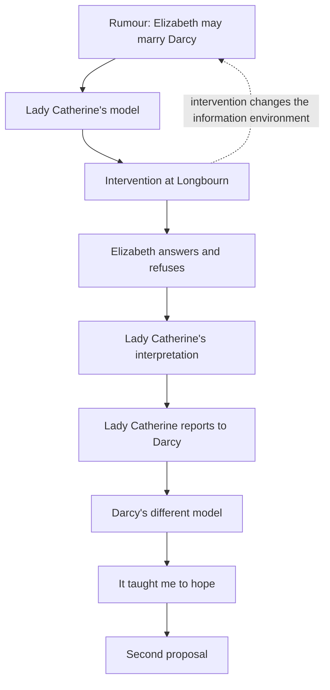
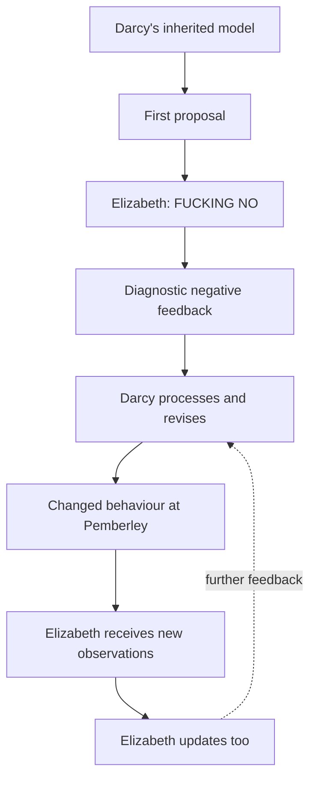
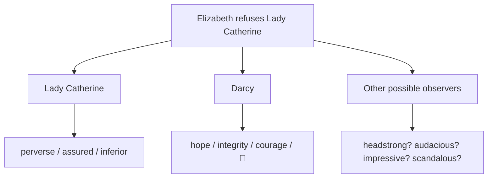
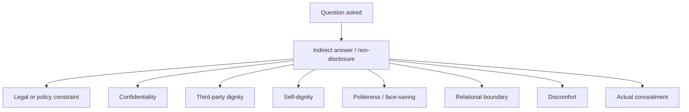
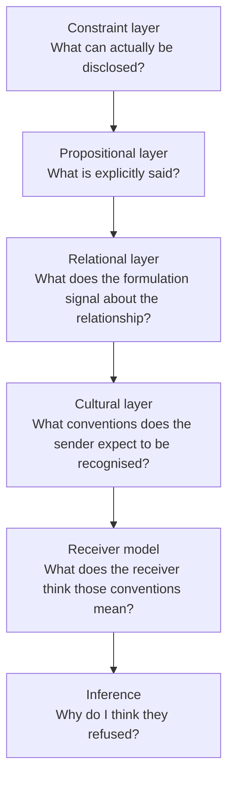
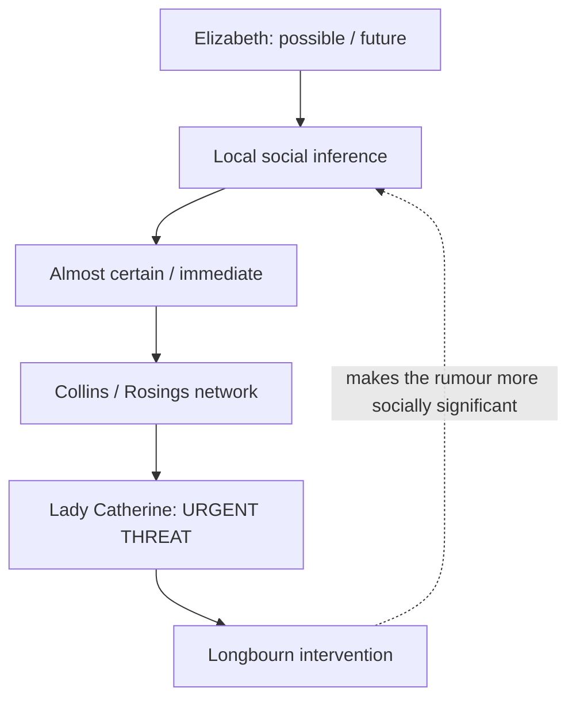
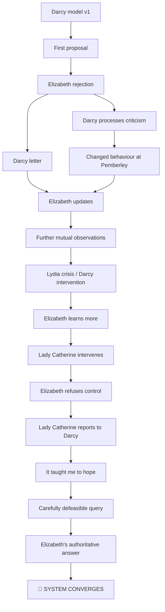

# 🪭 Austen Cybernetics 103 --- Lady Catherine's Interview Technique

**First created:** 2026-09-25 \| **Last updated:** 2026-09-25\
*Information does not contain its interpretation: Lady Catherine de
Bourgh accidentally demonstrates observer-dependence, disclosure
control, feedback, social signalling, model error, and the physical
possibility of simply saying no.*

------------------------------------------------------------------------

## 🛰️ Orientation

Lady Catherine de Bourgh wants one bit of information.

She has heard an alarming report that Elizabeth Bennet may marry
Fitzwilliam Darcy. She considers this impossible, improper, socially
contaminating, and --- most importantly --- something which ought to
stop because **Lady Catherine de Bourgh has said so**.

So she travels to Longbourn to obtain a categorical negative.

She does not get one.

Unfortunately for Lady Catherine, this does **not** mean that she leaves
without information.

She leaves with *loads* of it.

She learns that Elizabeth is not engaged to Darcy. She learns that
Elizabeth will not promise never to become engaged to him. She learns
that Elizabeth does not recognise Lady Catherine as having authority
over her private decisions. She learns that threats involving rank,
family, reputation and social exclusion do not produce the expected
compliance. She learns that Elizabeth can remain controlled and precise
while being insulted in her own home. She learns that Elizabeth will
protect information which Lady Catherine wants but is not entitled to
receive.

Then Lady Catherine carries this information to Darcy.

And Darcy --- possessing different prior knowledge, different experience
of Elizabeth, different knowledge of Lady Catherine, and a different
question --- extracts **different information from the same
observations**.

Lady Catherine thinks Elizabeth's answers demonstrate "perverseness and
assurance".

Darcy says:

> "It taught me to hope."

There we are.

**Information does not contain its interpretation.**

The same observation can produce different information for different
observers because each observer brings a different model of the people,
relationships and world involved.

This is why Lady Catherine's interview technique is such a useful little
cybernetic teaching machine.

She does not fail to obtain information.

**She fails to understand what information she obtained.**

🪭 **TASK FAILED SUCCESSFULLY.**

------------------------------------------------------------------------

## 1. 🪭 Lady Catherine's Interview Technique™

Lady Catherine's method is straightforward.

1.  Decide what the answer ought to be.
2.  Travel across the country to obtain it.
3.  Announce your interpretation before asking the question.
4.  Demand confirmation.
5.  Treat uncertainty as disobedience.
6.  Treat refusal as insolence.
7.  Increase pressure.
8.  Add family.
9.  Add class.
10. Add sexualised accusations.
11. Add threats of social exclusion.
12. Obtain no desired commitment whatsoever.
13. Leave furious.
14. Personally deliver the resulting intelligence to the man you least
    wanted to receive it.

**Arrive seeking one bit. Leave having generated six.**

Lady Catherine's central error is not that she observes nothing.

She observes quite a lot.

Her error is that she continually collapses three different things:

**observation → interpretation → desired outcome**

She thinks that because she can see something, she knows what it means;
because she knows what it means, other people ought to agree; and
because other people ought to agree, they ought to produce the behaviour
she wants.

This works tolerably well while everyone around her supplies the
expected response.

Then she meets Elizabeth Bennet.

**The question is not outside the system. The question is an
intervention in the system.**

------------------------------------------------------------------------

## 2. 🏡 The Interview Starts Before The Interview

Lady Catherine does not arrive at Longbourn as a neutral observer
politely requesting clarification.

The social information starts before she asks Elizabeth anything.

She arrives unexpectedly in a chaise and four. Mrs Bennet is immediately
impressed by her rank. Lady Catherine gives Elizabeth only a slight
inclination of the head. She does not request a proper introduction. She
sits without speaking. She criticises the size of the park. She
criticises the sitting room. She refuses refreshment "very resolutely,
and not very politely". On the way outside, she inspects the house and
pronounces it merely "decent looking".

Then she takes Elizabeth into the "prettyish kind of a little
wilderness" and announces:

> "You can be at no loss, Miss Bennet, to understand the reason of my
> journey hither. Your own heart, your own conscience, must tell you why
> I come."

Elizabeth, inconveniently, genuinely does not know.

Lady Catherine has already supplied the first major piece of
information:

**she expects her social position to make her intentions legible and her
authority self-executing.**

Earlier in the novel, Lady Catherine presents herself as someone who
gives advice, improves arrangements and tells other people how things
ought to be done.

Here we see what happens when the advice does not produce compliance.

**advice → expectation → entitlement → interrogation → demand → threat**

The wrapper comes off.

Lady Catherine's problem is not simply that she is rude.

It is that she mistakes **power over the environment** for **control
over another autonomous system**.

------------------------------------------------------------------------

## 3. 🎩 Rank Is Not Refinement

Lady Catherine possesses far more rank, wealth and structural power than
Elizabeth.

That does not mean she behaves with greater refinement.

This distinction matters.

**Rank is not wealth.\
Wealth is not pedigree.\
Pedigree is not manners.\
Manners are not refinement.\
Refinement is not deportment.**

Elizabeth is gentry. She is not a poor servant girl accidentally
wandering into aristocratic society. But Lady Catherine outranks her
dramatically, and Lady Catherine expects that hierarchy to organise the
interaction.

Instead, the scene produces an inversion.

Lady Catherine:

-   barges in;
-   criticises her hosts;
-   demands private information;
-   repeatedly insults Elizabeth's family;
-   makes sexualised accusations;
-   invokes her own status;
-   threatens exclusion;
-   escalates when she does not get the answer she wants.

Elizabeth:

-   remains precise;
-   answers narrowly;
-   does not scream;
-   does not expose confidential information;
-   does not flatter;
-   does not abase herself;
-   corrects false inferences;
-   refuses illegitimate demands;
-   ends the interaction when it has gone far enough.

Lady Catherine repeatedly has to announce her importance:

> "Do you know who I am?"

Elizabeth does.

**That is why the refusal matters.**

The Bingley sisters and other characters spend plenty of time discussing
the visible specification sheet of refinement.

Lady Catherine accidentally runs the stress test.

**Elizabeth passes it.**

And Austen later makes an important correction to any reading in which
Elizabeth is simply superhumanly unbothered. The visit leaves her deeply
discomposed. For hours she cannot stop thinking about it.

So:

**DEPORTMENT ≠ ABSENCE OF EMOTION.**

The achievement is not that Elizabeth feels nothing.

The achievement is that:

> **internal state ≠ externally available signal**

She is perturbed.

She does not give Lady Catherine control of the output.

------------------------------------------------------------------------

## 4. 🔐 Elizabeth Bennet's Information-Security Policy

Lady Catherine assumes that asking a question creates an obligation to
answer it.

Elizabeth does not.

> "I do not pretend to possess equal frankness with your ladyship. You
> may ask questions, which I shall not choose to answer."

**MODERN TRANSLATION:**

**YOU CAN SEND THE QUERY. THAT DOES NOT MEAN YOU HAVE READ PERMISSIONS.
🔐**

Lady Catherine then claims privileged access because she is Darcy's
close relative:

> "I am almost the nearest relation he has in the world, and am entitled
> to know all his dearest concerns."

Elizabeth replies:

> "But you are not entitled to know mine; nor will such behaviour as
> this, ever induce me to be explicit."

**MODERN TRANSLATION:**

**YOU BEING HIS AUNT DOES NOT GIVE YOU ROOT ACCESS TO ME.**

That is a very clean information-security distinction.

Lady Catherine's network position relative to Darcy does not propagate
automatically into access to Elizabeth.

> **Network position ≠ information access.**

There are at least three information channels operating at once.

### Propositional information

What Elizabeth explicitly says.

### Inferential information

What another observer can reasonably update from her answers, refusals
and corrections.

### Relational information

What the manner of the exchange communicates about whether Elizabeth
recognises Lady Catherine's authority.

Elizabeth's disclosure policy is remarkably disciplined:

-   do not lie unnecessarily;
-   do not accept an illegitimate premise merely because somebody
    powerful supplies it;
-   answer narrowly where appropriate;
-   do not disclose third-party information to win an argument;
-   do not correct every mistaken model;
-   do not provide a prospective commitment to somebody without
    authority over the decision;
-   correct an inference when the other person tries to turn uncertainty
    into a statement you did not make.

This is not information starvation.

It is **controlled disclosure**.

------------------------------------------------------------------------

## 5. 🚪 Elizabeth Has So Many Easy Ways Out

This is important because Elizabeth's refusal can otherwise look like
coyness.

It is not.

Lady Catherine gives Elizabeth multiple opportunities to make the
confrontation disappear.

Elizabeth could say:

**Mate, I don't even like your nephew.**

She could say:

**He already proposed and I rejected him.**

That would absolutely devastate Lady Catherine's model of Elizabeth as
an aspiring woman using "arts and allurements" to capture a socially
superior man.

She could say:

**Nothing is happening.**

She could say:

**I don't expect anything to happen.**

She could simply promise never to marry Darcy and deal with the
consequences later.

She could bring in Mr Bennet.

She could demand that Lady Catherine leave.

She could defend every member of her family in detail.

She could tell Lady Catherine what Darcy actually did during the Lydia
crisis.

She does none of these things.

Instead, she optimises for something much more interesting:

**truth + minimum necessary disclosure + autonomy + third-party
privacy + refusal of illegitimate premises**

Lady Catherine wants Elizabeth to concede more than a fact about Darcy.

She wants Elizabeth to concede the classifier.

She wants Elizabeth to accept that:

-   Darcy is socially above her in a way which makes marriage
    presumptively improper;
-   Elizabeth's maternal relations diminish Elizabeth's worth;
-   Lydia's actions diminish Elizabeth's worth;
-   Lady Catherine's family possesses a superior claim on Darcy's
    reproductive future;
-   Elizabeth may properly be required to promise away her own future
    choice.

Elizabeth refuses.

> "He is a gentleman; I am a gentleman's daughter; so far we are equal."

Lady Catherine immediately goes looking further down the family tree.

Elizabeth does not follow her.

She does not accept the evaluation procedure.

**Elizabeth refuses to purchase safety through self-diminishment.**

------------------------------------------------------------------------

## 6. 💋 "Arts And Allurements"

Lady Catherine does not merely accuse Elizabeth of being socially
unsuitable.

She accuses her of having manipulated Darcy.

> "You may have drawn him in."

The implication is that Elizabeth may have used feminine or sexual
influence to make Darcy forget family, duty and the match supposedly
intended for him.

Elizabeth replies:

> "If I have, I shall be the last person to confess it."

**POLARIS TRANSLATION:**

**WELL, IF I WAS BEING A SLUT, WOULD I TELL YOU?**

Lady Catherine wants Elizabeth to defend herself.

Elizabeth declines the invitation.

That matters.

If Elizabeth launches into a frantic demonstration of her innocence, she
has implicitly accepted that Lady Catherine is entitled to sit in
judgment and that Elizabeth owes her evidence.

Instead:

**I am not conceding your accusation.\
I am also not applying for acquittal in your court.**

This is a useful information lesson in its own right:

> **Defending yourself can accidentally concede the questioner's
> jurisdiction.**

Sometimes refusing the frame is not refusing the question.

Sometimes it is identifying that the question contains assumptions which
are not yours to validate.

------------------------------------------------------------------------

## 7. 🧬 "The Shades Of Pemberley Thus Polluted"

Lady Catherine's objection to Elizabeth is not merely that she would
prefer Darcy to marry somebody richer.

She has a reproductive model of family.

Darcy and Anne de Bourgh were, she says, intended for one another from
infancy:

> "They are descended, on the maternal side, from the same noble
> line..."

Their mothers planned the union. Their fortunes, ancestry and family
position supposedly make the marriage appropriate.

Elizabeth represents an intrusion into that arrangement.

When Lady Catherine reaches Lydia and Wickham, her language becomes
especially revealing:

> "And is such a girl to be my nephew's sister? Is her husband, is the
> son of his late father's steward, to be his brother? Heaven and earth!
> --- of what are you thinking? Are the shades of Pemberley to be thus
> polluted?"

**POLLUTED.**

This is not yet formal eugenics.

Jane Austen is writing decades before Francis Galton coins and
systematises *eugenics* as a programme.

But ideas about pedigree, "breeding", inheritance, lineage, desirable
marriage, contamination and the preservation of supposedly superior
families do not suddenly materialise when somebody writes *eugenics* on
paper.

Lady Catherine gives us an older cultural substrate in unusually clean
form.

**well-bred → pedigree → desirable lineage → controlled marriage →
hereditarian classification → later eugenic formalisation**

The point is not:

**LADY CATHERINE IS SECRETLY A NINETEENTH-CENTURY EUGENICIST.**

The point is:

**THIS IS THE KIND OF OLDER HUMAN-RANKING AND REPRODUCTIVE LOGIC FROM
WHICH LATER HEREDITARIAN AND EUGENIC SYSTEMS BECOME MORE LEGIBLE.**

And the contradiction is striking.

Lady Catherine regards Darcy marrying his **first cousin**, Anne, as the
proper preservation of lineage.

Darcy marrying the unrelated Elizabeth is described through the language
of pollution.

So "purity" here is not a modern genetic-health concept.

It is **genealogical and social purity**: name, rank, property,
pedigree, family alliance and imagined quality of blood.

> **Historical aside:** Restricted aristocratic marriage networks also
> have a separate history involving consanguinity and reduced genetic
> diversity. That history matters to the wider story of "breeding" and
> heredity, but it is not the subject of this node. We acknowledge the
> branch. We are not doing the Surprise Habsburg Genetics Appendix
> today.

The cybernetic relevance is direct.

Lady Catherine possesses a classifier.

She mistakes the classifier for reality.

------------------------------------------------------------------------

## 8. 🌍 The Classifier Is Bigger Than English Class

Elsewhere in *Pride and Prejudice*, Darcy uses the line:

> "Every savage can dance."

That word belongs to a much wider historical information environment in
which European imperial and colonial societies classified peoples as
"civilised" and "savage".

This does **not** establish that Austen has secretly hidden a complete
political theory of empire in Darcy's dialogue.

It does **not** establish that Darcy's fortune can simply be
reverse-engineered into a particular colonial commodity or the
transatlantic slave trade without evidence.

But it does remind us that the human-ranking vocabulary available to
this class did not stop at:

**rich gentleman / poorer gentleman.**

Different classifiers coexist:

**civilised / savage\
well-bred / badly bred\
ancient family / inferior connection\
appropriate alliance / polluting alliance**

Race, empire, class, lineage and pedigree are not interchangeable
categories.

They should not be flattened into one thing.

But they inhabit a society unusually comfortable with ranking human
beings, families and relationships.

This matters because an information environment includes things nobody
stops to explain.

Characters do not announce:

**I AM NOW USING AN EARLY-NINETEENTH-CENTURY HIERARCHY OF CIVILISATION
AND BREEDING.**

They use the categories available to them.

That is information too.

------------------------------------------------------------------------

## 9. 🧠 Darcy Has Been Raised Inside This System

Lady Catherine is not a random aristocratic woman who wanders in during
the final act.

She is Darcy's mother's sister.

Darcy's parents are dead. Lady Catherine is therefore one of the senior
surviving figures in his maternal family: wealthy, titled, forceful,
intensely invested in pedigree, and convinced that Darcy's marriage was
effectively arranged in infancy.

That gives us useful contextual information about Darcy.

His early assumptions about Elizabeth do not materialise in a vacuum.

Darcy spends much of the novel receiving two incompatible streams of
information.

### Inherited model

**This woman is an undesirable match.**

Her family is embarrassing.

Her connections are inferior.

Her mother is intolerable.

Her younger sisters are not helping.

### Actual Elizabeth Bennet

**Unfortunately, incredible.**

She reads.

She argues.

She walks across the countryside because Jane needs her and turns up
muddy instead of waiting around to perform delicacy.

She does not automatically treat Darcy's wealth as evidence that his
opinion deserves extra weight.

She laughs.

She refuses to be endlessly agreeable to him.

She does not seem particularly impressed by the fact that he is
Fitzwilliam Fucking Darcy.

Darcy is attracted to precisely the system behaviour his inherited
classifier has trouble explaining.

So Darcy v1 attempts a compromise.

**Inherited model:** absolutely not.

**Embodied information:** 🥵🥵🥵🥵🥵

**Darcy v1 solution:** override the conclusion while retaining the
classifier.

And thus we get the first proposal.

**Your family and connections are a disaster. I have struggled
heroically against loving you. Nevertheless, unfortunately, I am
catastrophically attracted to your entire information architecture.
Please consent to be my wife.**

Elizabeth:

**❌ ABSOLUTELY FUCKING NOT.**

------------------------------------------------------------------------

## 10. 🔥 Elizabeth Submits A Bug Report

Elizabeth does not merely reject Darcy.

She gives him diagnostic feedback.

Among the things which stay with him is her accusation that he had not
behaved in a "more gentleman-like manner".

Later he tells her that her words tortured him --- and, importantly,
that it took time before he could admit their justice.

That is feedback.

Not:

**input arrives → system instantly agrees**

but:

**output → environmental response → disturbance → processing → model
revision → changed behaviour**

Darcy's first response is defensive.

Then he writes the letter.

Elizabeth reads it and updates too.

Her prejudices do not vanish instantly. Austen tells us the effect is
gradual.

Then Pemberley provides new observations.

Darcy behaves differently.

Elizabeth observes the difference.

Darcy later explicitly says that at Pemberley he wanted to show her that
her reproofs "had been attended to".

**ATTENDED TO.**

The feedback changed the system.

**SYSTEM CONVERGES.**

Eventually.

With some debugging.

------------------------------------------------------------------------

## 11. 🪭 Lady Catherine Arrives Running Darcy v0 At Maximum Volume

This is one reason Lady Catherine's confrontation belongs so close to
the end of the novel.

She brings the unreconstructed classifier back into the room.

Lady Catherine's model says:

-   family determines worth;
-   pedigree determines appropriate marriage;
-   status confers authority;
-   Elizabeth's relations diminish Elizabeth;
-   Darcy's desires ought to conform to lineage;
-   Elizabeth ought to defer to those who know better.

Darcy's first proposal contained softened traces of this model.

Lady Catherine arrives with the industrial version.

And Elizabeth responds exactly as Elizabeth responds.

**No.**

Lady Catherine:

> "Tell me once for all, are you engaged to him?"

Elizabeth, after deliberation:

> "I am not."

Lady Catherine immediately tries to convert this truthful present-state
answer into a permanent future commitment:

> "And will you promise me, never to enter into such an engagement?"

Elizabeth:

> "I will make no promise of the kind."

**MODERN TRANSLATION:**

**YOU ASKED WHETHER I AM CURRENTLY ENGAGED. I ANSWERED THAT QUESTION.
YOU DO NOT NOW GET TO TURN THAT INTO OWNERSHIP OF MY FUTURE.**

Lady Catherine keeps pushing.

Elizabeth eventually explains:

> "I have said no such thing. I am only resolved to act in that manner,
> which will, in my own opinion, constitute my happiness, without
> reference to you..."

Lady Catherine wants a binary:

**Darcy / never Darcy**

Elizabeth preserves the truthful state:

**not engaged now / future not yours to determine**

> **Uncertainty is information.**

Lady Catherine wants false certainty.

Elizabeth refuses to manufacture it.

------------------------------------------------------------------------

## 12. 🥵 SHE HAS BALLS THAT NONE OF US HAVE EVER HAD

Lady Catherine's report to Darcy carries at least two payloads.

### Payload one: romantic uncertainty

Darcy explains the explicit inference himself.

> "It taught me to hope..."

And:

> "I knew enough of your disposition to be certain, that, had you been
> absolutely, irrevocably decided against me, you would have
> acknowledged it to Lady Catherine, frankly and openly."

This is beautifully calibrated.

Darcy does **not** infer:

**SHE LOVES ME. 😍😍😍**

He infers:

**If Elizabeth were still absolutely and irrevocably against me,
Elizabeth is exactly the sort of person who would have told Aunt
Catherine so. She did not. Therefore my previous state of CERTAIN NO may
no longer be current.**

That is enough for hope.

Not certainty.

### Payload two: character information

But Darcy knows his aunt.

He knows the social environment in which Lady Catherine operates.

And Lady Catherine apparently gives him the director's cut:

> "dwelling emphatically on every expression of the latter which, in her
> ladyship's apprehension, peculiarly denoted her perverseness and
> assurance..."

**LADY CATHERINE:** AND THEN DO YOU KNOW WHAT SHE SAID TO ME? 😡😡😡

**DARCY:** SHE SAID THAT TO *YOU*? 🥵🥵🥵🥵🥵

Lady Catherine thinks she is reporting evidence of Elizabeth's
inferiority.

Darcy has a different classifier.

And there is a particularly valuable feature in this report:

**Darcy was not there.**

Elizabeth was not performing independence for Darcy.

She did not know that Lady Catherine's furious incident report would
later become romantic intelligence.

So Darcy gets unusually good character evidence.

> **She wasn't performing independence for me. That's who she is.**

This is also where the hypothetical Colonel Fitzwilliam joke belongs,
with the important distinction that Austen does not give us his reaction
to the confrontation.

But as family-systems comedy:

**COLONEL FITZWILLIAM:** Wait. She said *what* to Aunt Catherine?

**DARCY:** Apparently.

**FITZWILLIAM:** To her face?

**DARCY:** Apparently.

**FITZWILLIAM:** WHY AM I NOT RICHER, DAMNIT.

Because the secondary payload is not merely:

**Elizabeth may like Darcy.**

It is:

**SHE HAS BALLS THAT NONE OF US HAVE EVER HAD.**

------------------------------------------------------------------------

## 13. ⚛️ Apparently The Laws Of Physics Permit Saying No To Aunt Catherine

High-control social systems can acquire the appearance of natural law.

If the repeated pattern is:

**Lady Catherine insists → everybody accommodates Lady Catherine**

then eventually:

**people do not say no to Lady Catherine**

can begin to look less like a behavioural regularity and more like a
property of the universe.

Then Elizabeth arrives.

**Lady Catherine insists → Elizabeth says no → nothing explodes**

World continues rotating.

Pemberley remains in Derbyshire.

The Royal Navy remains afloat.

Gravity continues.

**OH MY GOD. APPARENTLY THE LAWS OF PHYSICS PERMIT SAYING NO TO AUNT
CATHERINE.**

This is a cybernetic point.

> **Stable systems can conceal how much of their stability is produced
> by participants continually reproducing the expected response.**

Elizabeth introduces a perturbation:

**What if the expected response simply isn't supplied?**

Lady Catherine does not immediately become a different person.

That is not required.

The new information is:

**compliance was a possible system state, not a law of physics.**

For Darcy, the coercive maths also changes.

Lady Catherine can threaten displeasure and withdrawal.

But once Darcy has decided Elizabeth matters more:

**LADY CATHERINE:** If you marry that woman, I shall be extremely
displeased.

**DARCY:** Oh no.

**LADY CATHERINE:** 😠

**DARCY:** Anyway, Elizabeth---

Lady Catherine's displeasure stops being:

**major environmental condition requiring obedience**

and becomes:

**Lady Catherine is displeased.**

That is a considerable reduction in effective control power.

------------------------------------------------------------------------

## 14. 📣 The Complaint Contains The Advertisement

Lady Catherine believes she is transmitting:

-   perverseness;
-   assurance;
-   insolence;
-   inferiority;
-   improper ambition.

But a sender can transmit observations.

A sender cannot force the receiver to share the interpretation.

> **The complaint contains the advertisement.**

This becomes even more interesting after the marriage.

Beforehand, Elizabeth is a Hertfordshire gentlewoman whom some members
of the relevant social network may know.

Afterwards she is **Mrs Darcy of Pemberley**.

The wider spread of the anecdote is an inference rather than something
Austen narrates for us, so we do not need to pretend the novel gives us
a montage of every aristocratic drawing room in England discussing it.

But the mechanism is plausible.

The original gossip:

**Elizabeth Bennet might marry Mr Darcy.**

The better story:

**Lady Catherine de Bourgh personally travelled to Longbourn to stop
Elizabeth Bennet marrying Darcy, demanded that Elizabeth promise never
to do it, and Elizabeth refused.**

And then:

**SHE MARRIED HIM.**

That story has an ending.

Lady Catherine's status itself makes the refusal socially informative.

Some observers could classify Elizabeth as appalling, ambitious,
headstrong or insolent.

Others:

**SHE SAID WHAT TO LADY CATHERINE?**

Reputation does not require universal approval.

It requires recognisability.

The eventual Mrs Darcy is not merely evidence that somebody once said
no.

She is **longitudinal follow-up data**.

Lady Catherine's threatened future:

**you will be disgraced; this alliance cannot appropriately exist;
Darcy's family will reject you**

has visibly failed to become the only possible future.

**Same event. Different receiver. Different information.**

------------------------------------------------------------------------

## 15. 🗣️ Same Non-Disclosure, Different Relationship

Consider two ways of refusing information.

**"I'm sorry, I can't tell you."**

and:

> "You may ask questions, which I shall not choose to answer."

At the propositional level, both can communicate:

**no disclosure**

At the relational level, they are not remotely the same signal.

Elizabeth's increasingly precise, formal language is part of the
information.

In some British communicative registers, increasing politeness,
literalism and procedural exactness can indicate **increasing hostility
rather than increasing warmth**.

The surface temperature drops.

The confrontation becomes more severe.

Elizabeth does not need to say:

**YOU STUPID WOMAN.**

Lady Catherine asks why Elizabeth would not simply contradict the
rumour.

Elizabeth calmly explains that Lady Catherine's decision to travel to
Longbourn may itself confirm it.

**MA'AM, YOU ARE INCREASING THE SIGNAL. 📡**

That is worse.

The relational message is:

**I understand exactly what you are doing.\
I do not accept your authority.\
I am not emotionally joining you inside your framing.**

Lady Catherine accurately detects insubordination.

What she cannot understand is the system in which Elizabeth is allowed
to produce it.

------------------------------------------------------------------------

## 17. 🇬🇧 When Britain Does Not Quite Say The Thing

There is a broader communication problem hiding inside Elizabeth's refusals.

A refusal to disclose information is an **observable output**.

The reason for the refusal is a **hidden state**.

Those are not the same thing.

A person may decline to answer because:

- the information is legally restricted;
- the information belongs to somebody else;
- they are protecting confidentiality;
- they do not think the questioner is entitled to know;
- answering would humiliate somebody unnecessarily;
- answering would require a direct criticism which they are trying to avoid;
- they are preserving their own dignity;
- they are preserving the other person's dignity;
- the relationship is not close enough for the question;
- they do not want to lie, but blunt truth would be cruel;
- they believe they have already communicated the answer indirectly;
- they are uncomfortable;
- or, yes, they may genuinely be concealing something important.

Superficially similar output.

Very different internal state.

> **Non-disclosure is an observable behaviour. Its motive is hidden state.**

That distinction matters particularly in communication environments where a great deal of relational information is carried indirectly.

And, hello to our North American friends, Britain can be **extremely fucking like this**.

### 🇺🇸 A small note for the cousins

This is not a claim that every British person communicates identically, or that Britain can be placed on a neat universal league table of indirectness.

Class, region, generation, profession, institution, relationship and circumstance all matter.

Nor is Canada, Australia, New Zealand, South Africa or any other Anglophone society a magical universal translator for Britain.

But there is a useful practical warning here.

British communication can place a very high informational load on:

- phrasing;
- understatement;
- formality;
- what is not said;
- when a subject is changed;
- whether an explanation is offered;
- whether somebody says *cannot*, *would rather not*, *perhaps not*, *I'm afraid*, *quite*, *rather*, or *interesting*;
- and whether increasing politeness is actually increasing distance.

Sometimes:

> “I'm afraid I couldn't really comment on that.”

means:

**I DO NOT HAVE ENOUGH INFORMATION TO COMMENT.**

Sometimes it means:

**I KNOW EXACTLY WHAT HAPPENED AND YOU COULD NOT WATERBOARD IT OUT OF ME.**

Sometimes it means:

**PLEASE UNDERSTAND THAT I AM GIVING YOU AN OPPORTUNITY TO STOP ASKING BEFORE THIS BECOMES EMBARRASSING FOR BOTH OF US.**

The sentence alone does not tell you which state produced it.

That is the point.

### 🫖 Politeness can carry the boundary

British non-disclosure is not necessarily a failure to communicate.

Sometimes the relational channel is carrying information which the propositional channel deliberately does not.

A person may be trying to communicate:

**I cannot give you this information.**

while simultaneously communicating:

**I do not want this refusal to damage our relationship.**

Or:

**I am protecting somebody else's dignity.**

Or:

**I am protecting yours.**

Or:

**I am declining to discuss this without accusing you of impropriety for asking.**

Or, increasingly:

**I HAVE ANSWERED YOU AS MUCH AS I AM GOING TO AND I AM NOW BEING POLITE AT YOU VERY HARD.**

This is one reason a British refusal can be badly misread by a receiver from a more explicit professional or cultural environment.

A low-context reading can become:

**They did not explicitly say no, so perhaps this is still open.**

The British sender may be thinking:

**I practically said “regrettably”. How much clearer can a human being be?**

😂

But the inverse failure matters just as much.

A British observer accustomed to extracting relational information from tiny changes in wording can **over-read** a message whose sender never intended those signals.

A standardised American legal, compliance, security or corporate refusal may be written that way because the template says so.

The British receiver can still start doing archaeology on the comma.

**They said “we are unable to” rather than “we cannot”.**

**Something has happened.**

Possibly.

Or possibly Legal wrote the template in 2019.

> **High-context interpretation can recover information. It can also hallucinate information.**

### 🔐 Refusal reason ≠ refusal signal

This is particularly important when disclosure decisions cross organisations, security environments or jurisdictions.

Suppose an American organisation asks a British colleague, contractor or business unit for additional disclosure.

The actual constraint may simply be:

**POLICY SAYS NO.**

But the British sender may still construct the refusal around norms intended to preserve:

- the working relationship;
- institutional boundaries;
- confidentiality;
- their own dignity;
- the requester's dignity;
- future cooperation;
- and the distinction between **I cannot provide this** and **I reject you**.

A receiver who does not share those conventions may infer:

**Why are they being so weird about this? There must be another reason.**

That is a dangerous inference if it becomes the basis for security ranking, trust judgments or escalation.

Equally, the British receiver should not assume that every terse or formulaic North American refusal contains the relational temperature that a similarly worded British refusal might contain.

Before inferring motive from non-disclosure, separate the layers.

### 🧜‍♀️ The disclosure stack

Every arrow is an opportunity for model error.

This is why cross-cultural triangulation can be useful.

Not because another Anglophone country necessarily knows **the correct British answer**, but because multiple readings expose how much meaning each observer supplied themselves.

**🇺🇸 AMERICA:** Britain has said, “We would perhaps prefer not to pursue that particular avenue at the present time.” What does it mean?

**🇨🇦 🇦🇺 🇳🇿 ETC.:** Mate, get several readings before you launch the fucking submarine.

Crucially, this does **not** mean appointing Canada as the singular trusted interpreter.

**🇺🇸 AMERICA:** Why not Canada? Canada is polite.

**🇬🇧 BRITAIN:** **CANADA LIED TO US ABOUT THE THERMONUCLEAR MOOSES.**

**🇨🇦 CANADA:** That was completely different.

**🇬🇧 BRITAIN:** **YOU SAID THEY WERE DEFENSIVE.**

**🇨🇦 CANADA:** They *are* defensive.

**🇦🇺 AUSTRALIA:** Mate, just get three opinions.

**🇳🇿 NEW ZEALAND:** Four.

**🇺🇸 AMERICA:** Why four?

**🇳🇿 NEW ZEALAND:** **Because one of them is Canada.**

This is, beneath the extremely serious unresolved matter of the thermonuclear mooses, the actual methodological point:

> **Adding another observer does not give you an objective interpretation. It gives you another observer.**

The purpose is not to replace one cultural decoder with another.

It is to compare several receiver models so that no single interpretation becomes invisible merely because it feels natural to the person making it.

**POLARIS RULE:** triangulate your Anglophones.

**POLARIS SUB-RULE:** Canada must declare all thermonuclear ungulates before being admitted to the diplomatic interpretation panel. 🫎☢️

### 🪭 Back to Elizabeth

Elizabeth gives us a particularly clean literary version because Lady Catherine repeatedly mistakes non-compliance for evidence about motive.

Elizabeth's refusal to disclose does **not** tell Lady Catherine everything Lady Catherine thinks it tells her.

And Elizabeth's handling of the Lydia information gives us the harder case.

She knows Lady Catherine's model is wrong.

She still does not correct it.

Why?

Because truth is not the only variable governing disclosure.

There is also:

**Whose information is this?  
Who is entitled to it?  
What would disclosure do?  
Whose dignity would it preserve?  
Whose dignity would it damage?  
Am I correcting a harmful error, or merely trying to win?**

This is the bridge from Austen to modern information environments.

> **Absence of disclosure is not positive evidence of a sinister reason for non-disclosure.**

Before deciding what somebody's refusal means, ask:

> **How much information came from the refusal — and how much did the receiver supply?**

That is not merely etiquette.

That is cybernetics.

---

## 17. 🕸️ Rumour Is A Network Process

After Lady Catherine leaves, Elizabeth does something very useful.

She performs network analysis.

The visit has disturbed her badly, but she begins reconstructing where
the report might have come from.

Jane is marrying Bingley.

Darcy is Bingley's intimate friend.

Elizabeth is Jane's sister.

The marriage will increase the opportunities for Darcy and Elizabeth to
encounter one another.

Elizabeth herself has privately considered marriage to Darcy **possible
at some future time**.

Other people appear to have converted that possibility into something
much stronger.

Austen gives us a lovely confidence transformation.

**Elizabeth:** possible, at some future time.

**Local social network:** almost certain and immediate.

**Collins/Rosings route:** information reaches Lady Catherine.

**Lady Catherine:** alarming report requiring urgent intervention.

The underlying proposition has not remained informationally stable while
travelling.

Lady Catherine's attempt to suppress the rumour therefore generates more
evidence that something important may be happening.

Elizabeth tells her this to her face.

🪭 **Task failed successfully. Again.**

------------------------------------------------------------------------

## 18. 💰 "I Know It All" --- Reader, She Did Not Know It All

Lady Catherine eventually brings up Lydia and Wickham.

> "I know it all..."

She then demonstrates that she does not.

Her model is that Lydia's marriage was a "patched-up business" at the
expense of Elizabeth's father and uncles.

Elizabeth possesses information which could radically reorganise that
model.

Darcy found Lydia and Wickham.

Darcy negotiated.

Darcy dealt with Wickham and the financial problem.

Darcy tried to keep his own role quiet.

Elizabeth learned the truth only because Lydia let something slip and
Elizabeth then obtained the particulars through Mrs Gardiner.

Lady Catherine, despite claiming privileged access to Darcy as his close
relation, does not know.

Elizabeth does.

> **Structural proximity ≠ informational proximity.**

And Elizabeth still does not correct her.

This deserves careful handling because a modern reader could reasonably
ask whether Darcy's silence allows Lady Catherine to believe something
false, or whether Elizabeth ought to defend her family by revealing what
actually happened.

But correcting Lady Catherine is not informationally neutral.

If Elizabeth says:

**ACTUALLY YOUR NEPHEW PAID**

she also tells Lady Catherine that Elizabeth's father and uncle could
not independently resolve the crisis and that Darcy had already
intervened financially in Bennet family affairs.

From Lady Catherine's classifier, that may simply provide more
ammunition.

More importantly, Darcy deliberately attempted to keep his role private.

The action is not structured as:

**Darcy performs expensive rescue → Darcy publicises rescue → Darcy
receives social credit**

It is closer to:

**problem needs solving → solve problem → minimise disclosure**

And by allowing the public-facing version to leave Mr Bennet and the
Gardiners in the apparent role of people who sorted out their own
family's crisis, Darcy's silence can also preserve **their dignity**.

Elizabeth does not buy a victory over Lady Catherine by throwing her
father and uncle under the bus.

**LADY CATHERINE:** Your family's men had to pay to patch up Lydia's
marriage! 😡

**ELIZABETH, POSSESSING THE MOTHER OF ALL CORRECTION OPPORTUNITIES:**\
**I AM NOT USING PRIVATE INFORMATION TO HUMILIATE MY OWN FAMILY JUST SO
I CAN WIN AN ARGUMENT WITH YOU.**

This gives us another important principle:

> **Information withholding is not inherently deceptive. Restricting
> information can preserve privacy, autonomy and dignity without
> creating a materially harmful falsehood.**

And another:

> **Knowing that somebody's model is wrong does not automatically create
> an obligation to correct it.**

The useful questions are:

-   Who is entitled to the correction?
-   Whose information would correction disclose?
-   What privacy would be lost?
-   Whose dignity would be purchased with the disclosure?
-   What function would correcting the model actually serve?

Elizabeth does not need to optimise Lady Catherine's opinion of her.

That may be the deeper refusal.

Lady Catherine:

> "I know it all."

Elizabeth, internally:

**NO YOU FUCKING DON'T. 🥰**

And says absolutely nothing.

------------------------------------------------------------------------

## 19. 😂 Mr Bennet Has Absolutely No Fucking Idea

The aftermath gives us another observer.

The proposition:

**Elizabeth may marry Darcy**

is processed by multiple systems.

**The Lucases / gossip network:** plausible enough to become almost
certain.

**Lady Catherine:** catastrophic threat.

**Elizabeth:** privately possible at some future point.

**Darcy:** after Catherine's report, grounds for hope.

**Mr Bennet:** hilarious nonsense.

Mr Bennet's amusement is useful information in itself.

His joke tells Elizabeth:

**Dad has absolutely no idea what is going on.**

Elizabeth knows more.

Again, she does not resolve the information asymmetry merely because she
can.

Same proposition.

Different priors.

Different models.

Different information.

------------------------------------------------------------------------

## 20. ❤️ The Anti-Lady-Catherine Interview Technique

Eventually Elizabeth and Darcy walk together.

Elizabeth thanks him for what he did for Lydia.

Darcy tells her that if she thanks him, it should be for herself alone.

Then he does something extremely important.

He asks again.

Which is, to be fair, quite cheeky.

The last time this man asked, Elizabeth's answer was not:

**maybe later.**

It was approximately:

**Sir, if you were the last available penis in England, I would inquire
whether France had vacancies.**

Darcy has now received one new piece of evidence.

Aunt Catherine could not get Elizabeth to promise never to marry him.

Darcy:

**...HOWEVER.**

😂

But Darcy v2 does not treat his inference as authority over Elizabeth's
internal state.

He says:

> "If your feelings are still what they were last April, tell me so at
> once."

And:

> "My affections and wishes are unchanged, but one word from you will
> silence me on this subject for ever."

This is the **Anti-Lady-Catherine Interview Technique**.

### Lady Catherine

**I have determined the correct answer.**

Produce it.

No?

More pressure.

Still no?

Threat.

### Darcy

**I possess evidence that your previous state may have changed.**

You are the authoritative source on your own state.

If I am wrong, tell me.

One word terminates the query.

That is not Darcy becoming a man without confidence.

He still has enough self-belief to ask again.

Thank God, frankly, or we have a much worse ending.

It is **calibrated confidence**.

Darcy v1:

**I know what Elizabeth thinks.**

Darcy v2:

**I have reason to suspect Elizabeth's state may have changed. Elizabeth
knows what Elizabeth thinks. I should ask Elizabeth.**

And Elizabeth's answer is not even especially fluent.

She is awkward and anxious.

It is enough.

Communication does not need rhetorical perfection.

It needs to convey enough information for the receiving system.

------------------------------------------------------------------------

## 21. 🐝 Bingley Is Another Cybernetics Lesson Hiding In The Same Chapter

Austen then gives us another observer problem almost immediately.

Bingley had observed Jane.

But his diffidence made him distrust his own judgment.

Darcy's confidence therefore carried disproportionate weight.

Darcy initially believed Jane was indifferent.

Bingley relied on Darcy's model.

The relationship stopped.

Later Darcy obtains more observations, recognises that his model was
wrong, and tells Bingley so.

He also admits that concealing Jane's presence in London was wrong.

Darcy calls his former interference "absurd and impertinent".

Bingley updates.

The relationship resumes.

So we have another useful mechanism:

> **Information systems can fail because an observer underweights their
> own evidence and overweights a trusted model.**

Bingley does not lack observations.

He lacks confidence in his interpretation.

Darcy supplies confidence.

Unfortunately, Darcy is wrong.

**Confidence is not calibration.**

Again:

**observers are part of the information system.**

------------------------------------------------------------------------

## 22. 🔄 Nobody Leaves The System Unchanged

The novel's information ecology is not static.

Darcy updates.

Elizabeth updates.

Bingley updates.

Jane receives new outcomes.

Lady Catherine's intervention changes the environment even though it
does not produce the behaviour she intended.

Elizabeth's first rejection changes Darcy.

Darcy's letter changes Elizabeth.

Elizabeth's response changes Darcy's later behaviour.

Darcy's changed behaviour changes Elizabeth's model of Darcy.

Darcy's Lydia intervention changes what Elizabeth knows about him.

Lady Catherine's interrogation changes what Darcy knows about Elizabeth.

Darcy then asks a new question in a new way.

Elizabeth supplies a new answer.

Feedback is not merely information arriving.

> **Feedback is information altering the system which receives it.**

This is why the first proposal matters so much.

Darcy does not become perfect.

He becomes more capable of treating his own model as fallible.

That is a substantial change.

------------------------------------------------------------------------

## 23. 🪞 The Inherited Classifier And The Autonomous Person

Lady Catherine is useful partly because she shows us the classifier
Darcy has been living around.

She believes she can determine:

-   what kind of woman is appropriate for Darcy;
-   which families are sufficiently "good";
-   which relations contaminate a match;
-   what Darcy's duty requires;
-   what Elizabeth's place requires;
-   what the future ought to contain.

Darcy's first proposal has not escaped all of this.

But Darcy is already attempting something Lady Catherine cannot do.

His inherited model says:

**NO.**

His actual experience of Elizabeth says:

**YES, ACTUALLY.**

Darcy v1's mistake is trying to override the output while leaving the
classifier intact.

Elizabeth's rejection forces a harder possibility into the system:

**What if the classifier itself is wrong?**

Lady Catherine later arrives running the old model at full confidence.

Elizabeth refuses it at full confidence.

Darcy gets to compare.

And suddenly the developmental arc becomes richer than:

**proud rich man becomes less proud.**

Darcy has inherited a model for predicting human value and behaviour.

Elizabeth repeatedly produces prediction errors.

Eventually he learns from them.

------------------------------------------------------------------------

## 24. 🥵 What Darcy Is Actually Attracted To

This matters because Lady Catherine's report does not create Darcy's
attraction.

It gives him new information about traits he has been responding to
throughout the novel.

Elizabeth does not endlessly accommodate him because he is rich.

She does not organise her personality around his approval.

She reads.

She walks.

She argues.

She laughs.

She notices.

She corrects him.

She possesses her own judgment.

She is capable of warmth without becoming deferential.

She can care deeply for Jane while refusing to perform fragility for the
Bingley sisters.

She can be internally rattled and externally composed.

She can tell Darcy himself that he has behaved badly.

Then Lady Catherine arrives and accidentally performs the final stress
test.

**LADY CATHERINE:** I have come to tell you that you are not good enough
for my nephew.

**ELIZABETH:** Sounds like a you problem.

Not literally.

Spiritually.

This is why the richer secondary payload of Lady Catherine's report is
not:

**OMG SHE LIKES ME MORE THAN BOOKS 😍😍😍**

It is:

**SHE SAID THAT TO AUNT CATHERINE? 🥵🥵🥵**

Darcy has spent his life in the social environment around Lady
Catherine.

Elizabeth demonstrates that the environment is not the same thing as a
law of nature.

No wonder the man is interested.

------------------------------------------------------------------------

## 25. 🧰 What The Lads Were Supposed To Learn

If you remember nothing else from Lady Catherine's heroic contribution
to cybernetic pedagogy, remember these.

### Information does not contain its interpretation

The same observation can produce different information for different
observers.

### Observers are part of information systems

Prior knowledge, confidence, incentives, relationships and models change
what an observer can infer.

### A question is an intervention in an information system

Asking can alter the thing being observed.

Lady Catherine's journey makes the rumour more significant.

### Refusing the frame is not the same as refusing the question

Elizabeth can answer truthfully without accepting Lady Catherine's
premises.

### Uncertainty is information

"Not engaged" does not mean "never".

Elizabeth refuses to manufacture certainty that does not exist.

### Network position does not equal information access

Being Darcy's aunt does not create access rights to Elizabeth.

### Internal state does not equal externally available signal

Elizabeth is discomposed and still maintains controlled behaviour.

### Knowing another model is wrong does not automatically create an obligation to correct it

Correction can disclose private information, harm third parties or
sacrifice dignity.

### Information withholding is not inherently deceptive

Privacy and controlled disclosure are legitimate functions of an
information system.

### High-status observers can have badly calibrated models

Authority does not guarantee accuracy.

### Stable social systems may depend on participants reproducing expected responses

If everybody accommodates Lady Catherine, accommodation looks
inevitable.

Elizabeth demonstrates that it is not.

### The sender does not control what the receiver learns

Lady Catherine transmits the observations.

She cannot transmit the observer.

### Negative feedback can improve a model

Elizabeth's rejection does not merely stop Darcy.

It changes him.

### Confidence is not calibration

Bingley can be uncertain and closer to correct.

Darcy can be confident and wrong.

### The complaint can contain the advertisement

Lady Catherine thinks she is reporting Elizabeth's defects.

Darcy hears reasons to hope.

And possibly:

🥵.

------------------------------------------------------------------------

## 26. 🧪 The Tiny Experiment

Take one event:

> **Elizabeth refuses to promise Lady Catherine that she will never
> marry Darcy.**

What information does it contain?

### For Lady Catherine

Elizabeth is perverse.

Elizabeth is assured.

Elizabeth does not know her place.

Elizabeth remains a threat.

### For Darcy

Elizabeth is apparently not irrevocably against him.

Her state may have changed.

A carefully defeasible query may now be justified.

Also:

**SHE SAID NO TO AUNT CATHERINE. 🥵**

### For Elizabeth

Lady Catherine has heard the rumour.

The rumour has travelled further than Elizabeth realised.

Lady Catherine's family model is even more rigid than Elizabeth had
reason to know.

Lady Catherine does not possess all the information she claims to
possess.

### For Mr Bennet

At roughly the same informational problem:

**lol, imagine Elizabeth marrying Darcy.**

### For a possible wider social observer

**Wait. Mrs Darcy is the woman who told Lady Catherine de Bourgh no?**

### For us

The observation did not arrive with one meaning attached.

Its informational value depended on:

-   who received it;
-   what they already knew;
-   what they believed;
-   what they wanted;
-   what relationship they had to the actors;
-   what other observations were available;
-   how confident they were in their own model.

Same event.

Different receiver.

Different information.

**Welcome to cybernetics.**

------------------------------------------------------------------------

## 27. 🪭 Task Failed Successfully

Lady Catherine travels to Longbourn because she thinks Elizabeth Bennet
is the problem in the system.

She intends to remove uncertainty.

She intends to prevent a marriage.

She intends to assert the correct family hierarchy.

She intends to obtain a promise.

She obtains no promise.

She increases the salience of the rumour.

She demonstrates the limits of her own coercive power.

She produces evidence of Elizabeth's self-command.

She gives Darcy new information.

She personally carries that information to him.

She dwells emphatically on the exact expressions which she believes will
make Elizabeth less attractive as a possible wife.

Darcy processes them through a different model.

> "It taught me to hope."

Lady Catherine has encountered a node which will not accept her control
signal.

She then forwards the error report to Darcy.

Darcy, who has finally learned that his own model can be wrong, does
something much more sensible.

He asks Elizabeth.

Elizabeth answers.

💍 **SYSTEM CONVERGES.**

🪭 **Task failed successfully.**

------------------------------------------------------------------------

## 🌌 Constellations

🪭 🕸️ 🔐 🧬 🪞 --- observer-dependent information; social networks;
disclosure control; inherited classifiers; feedback-driven model
revision.

------------------------------------------------------------------------

## ✨ Stardust

cybernetics, embodied information ecology, observer dependence,
feedback, information asymmetry, disclosure control, social signalling,
jane austen, pride and prejudice, lady catherine de bourgh

------------------------------------------------------------------------

## 🏮 Footer

*Austen Cybernetics 103 --- Lady Catherine's Interview Technique* is a
living teaching node of the **Polaris Protocol**. It uses a bounded
literary information system to make observer-dependence, feedback,
disclosure control, classifier error and autonomous response legible
without requiring technical machinery first. Austen supplies the
experiment; Lady Catherine, heroically and against her own interests,
supplies the demonstration.

> 📡 Cross-references:
>
> -   [🧬 Start Here](./README.md) --- *entry route into the Cybernetics
>     teaching cluster*
> -   [♻️ Cybernetics](../README.md) --- *parent framework for feedback,
>     observers, systems and model revision*
> -   [🪿 Embodied Information Ecology](../../README.md) --- *wider
>     framework for information as situated, processed and experienced*
>
> 🏮 Return To:
>
> -   [🧬 Start Here](./README.md) --- *1up*
> -   [♻️ Cybernetics](../README.md) --- *2up*
> -   [🪿 Embodied Information Ecology](../../README.md) --- *3up*
> -   [🌑 Origin Points](../../../README.md) --- *4up*
> -   [🌌 Polaris Protocol --- Root](../../../../README.md) --- *root*

*Survivor authorship is sovereign. Containment is never neutral.*

*Last updated: 2026-09-25*
