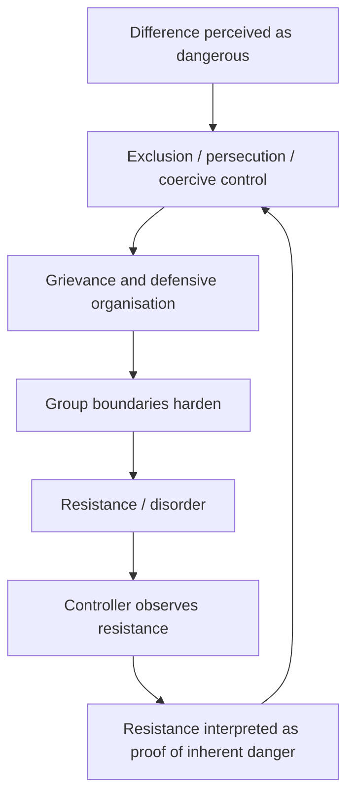
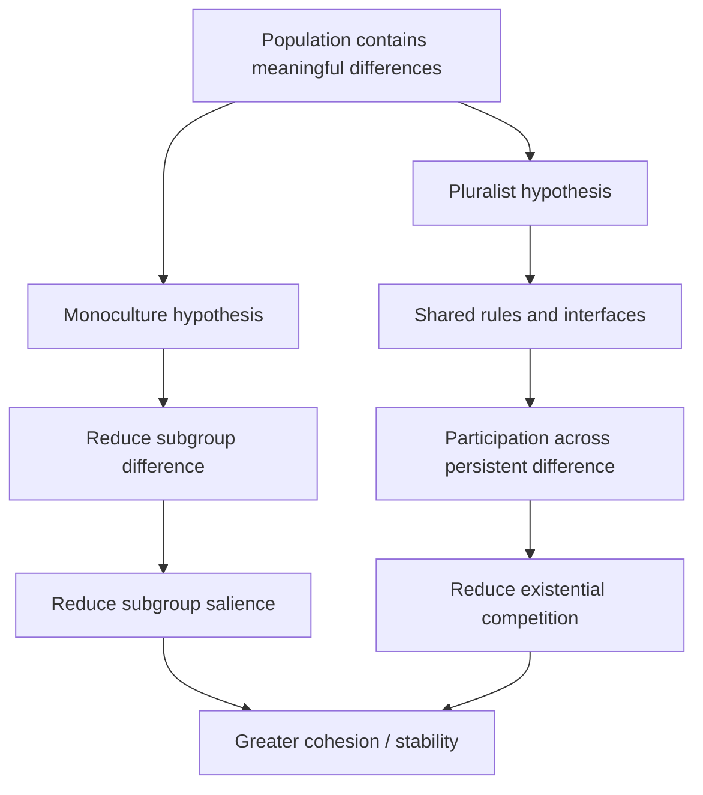
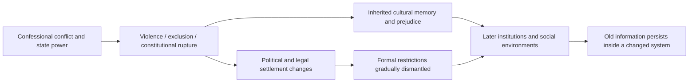
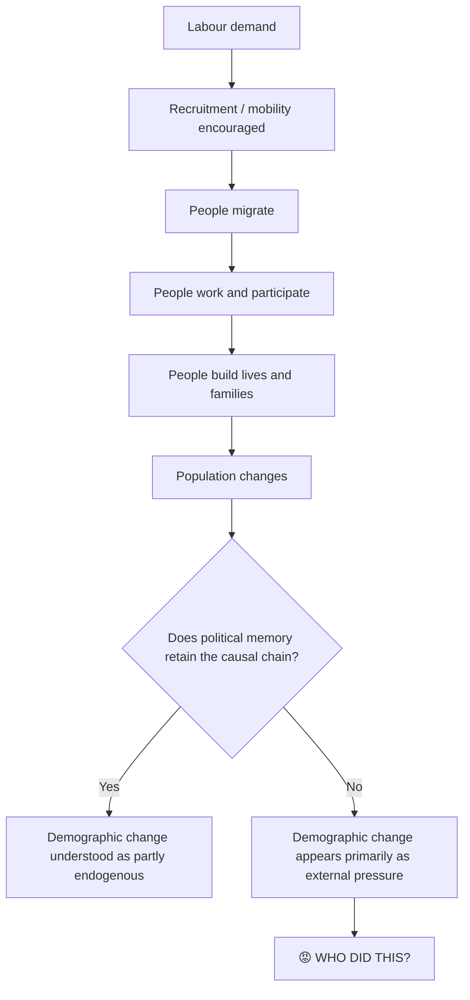
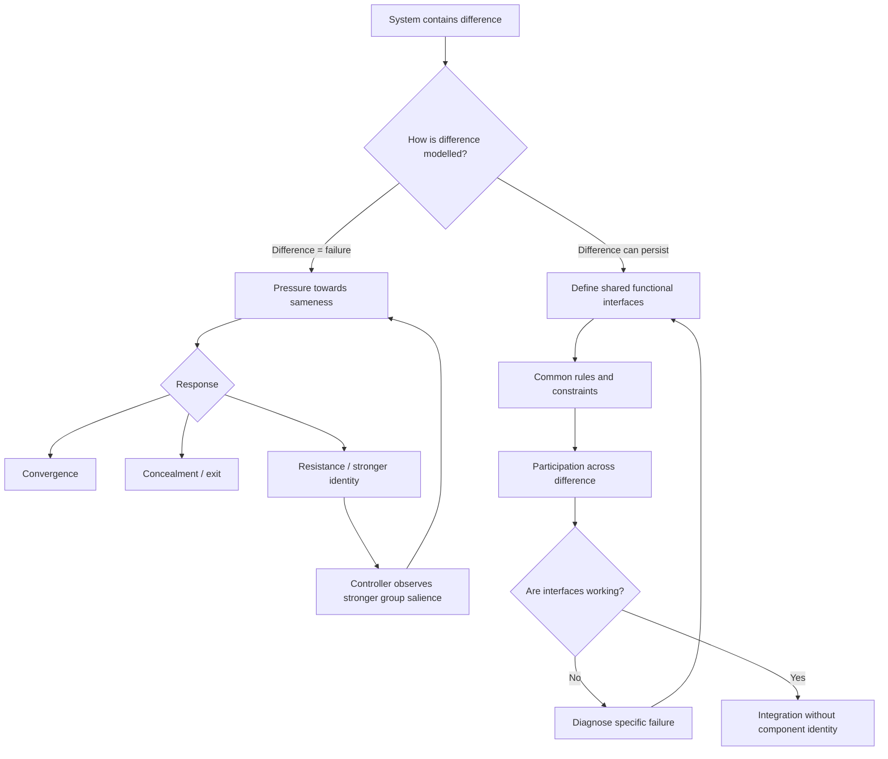

# 🪼 Voltaire on Monoculture

**First created:** 2026-09-29 | **Last updated:** 2026-09-29
*What happens when a system mistakes difference for failure, then uses
the instability produced by its own control measures as proof that
difference was dangerous all along?*

---
## 🛰️ Orientation

There is a deceptively simple political story which goes something like
this:

> A society contains different groups.
> Different groups produce competing loyalties.
> Competing loyalties produce sectarianism.
> Therefore greater cultural sameness should produce greater political
> stability.

It is a model.

That does not make it stupid. It does not make everybody who reaches for
it dishonest. It does not even make every mechanism inside it wrong.

It does, however, make it a **model**.

And models have to show their workings.

What exactly is the causal relationship between difference and conflict?
Which differences matter? At what layer? Under what conditions? Does
reducing visible difference actually reduce political antagonism? Does
coercing people towards sameness create compliance, resentment,
concealment, exit, hybridisation, stronger group identification, or some
mixture of all five? What does *integration* mean operationally? What
observation would tell us that it had occurred?

Most importantly:

> **What if the thing you are doing to prevent sectarianism is one of
> the things producing sectarianism?**

This is where Voltaire wanders into Cybernetics.

Not because Voltaire had secretly invented control theory in a wig.

Because in the *Treatise on Tolerance* he keeps returning to a systems
question: **when a state observes disorder among a persecuted
population, how much of the observed disorder belongs to the population,
and how much belongs to the conditions under which the state has forced
that population to operate?**

His argument is not only that persecution is cruel.

It is that persecution can be **causally stupid**.

The controller acts upon the system. The system changes in response. The
controller observes the changed system. If the controller then treats
the response to its own intervention as evidence that its original model
was correct, it can lock itself into a self-confirming feedback loop.

That is a Cybernetics problem.

It is also an extremely British problem.

Because Britain contains several centuries of religious conflict,
constitutional rupture, conquest, toleration, partial toleration,
migration, emigration, imperial movement, labour recruitment, communal
politics, national memory, missing national memory, and people standing
in approximately the same country while apparently beginning the story
in entirely different centuries.

So: Voltaire first.

Then we can go and find the little Enoch Powell gremlin hiding behind
the curtains.

[↑ Back to top](#-voltaire-on-monoculture)

---
## 1. ♻️ "These men rebelled when I treated them ill"

Voltaire opens one of the most useful passages in the *Treatise* by
considering an argument against tolerating French Protestants.

His opponents have history available to them. France really had
experienced devastating religious conflict. Huguenots had participated
in violence. Catholics had participated in violence. Nobody needs to
pretend that the underlying observation --- **there has been sectarian
violence** --- is imaginary.

Voltaire attacks the inference:

> "These men rebelled when I treated them ill, therefore they will rebel
> when I treat them well."

That is funny because it is structurally ridiculous.

It is also a very serious causal objection.

The bad model looks like this:

```text
Group difference
      ↓
Dangerous group
      ↓
Violence
```

The state then treats *difference* as the explanatory variable.

Voltaire puts the environment back into the model.



This does **not** mean every instance of group conflict is secretly
caused by state persecution.

It means the state cannot logically assume that it is standing outside
the causal system.

If I alter your operating conditions, your response to those conditions
contains information about **both you and the conditions**.

The controller is not floating above the experiment.

The controller is in the experiment.

### The first Cybernetics lesson

A control action can become a disturbance.

A state may intend an intervention to reduce instability:

```text
instability → control → stability
```

But the actual loop may be:

```text
perceived instability
→ coercive control
→ defensive response
→ stronger perceived instability
→ stronger coercive control
```

The control system is now amplifying the signal it was designed to
suppress.

And because every round produces fresh evidence of conflict, the model
can become extraordinarily difficult to dislodge.

The system says:

> See? We were right to fear them.

The missing sentence is:

> **After we did what?**

[↑ Back to top](#-voltaire-on-monoculture)

---
## 2. ⏱️ Please Update Your Fucking Model

Voltaire then asks something that sounds almost embarrassingly obvious
once stated:

Are the circumstances still the same?

He asks whether times, public opinion and morals have changed. Elsewhere
in the argument, he insists that political judgement has to begin from
the condition nations have actually reached rather than from an obsolete
picture of the system.

Or, in Polaris terms:

> **Do not run an obsolete model against an updated system.**

Historical information matters.

Historical information is not magic.

An observation produced under one set of conditions does not
automatically retain identical predictive value when those conditions
change.

If:

```text
population + environment A → behaviour X
```

you have not yet demonstrated:

```text
population + environment B → behaviour X
```

You may have evidence about the population.

You also have evidence about environment A.

This matters enormously when political cultures inherit threat models.

"They did this before" can be important information.

It is not a complete causal model.

Before importing the prediction, ask:

-   When?
-   Under what law?
-   Under what distribution of power?
-   Under what level of persecution?
-   Under what economic conditions?
-   Under what information environment?
-   In response to what?
-   With what available routes for peaceful participation?
-   Does the mechanism that produced the earlier behaviour still exist?
-   What has changed in the system since?

This is not historical amnesia.

It is the opposite.

It is refusing to turn history into a decorative bag of examples which
can be removed from their causal environment whenever convenient.

Voltaire's method here is beautifully simple:

**update temporally.**

Later he also does something else:

**zoom out spatially.**

Both moves change what information is visible.

[↑ Back to top](#-voltaire-on-monoculture)

---
## 3. 🪼 What If Difference Is Not the Failure State?

Voltaire's more provocative move is not merely to say that minorities
can sometimes be tolerated safely.

He begins playing with the possibility that **plurality itself changes
the structure of competition**.

> "The more sects there are, the less danger in each."

His proposed mechanism is imperfect, historically situated, and
considerably less egalitarian than a modern reader might want. His
toleration can coexist with restrictions we would now recognise as
discriminatory.

But look at the systems move.

He does not say:

```text
religious difference disappears
→ peace
```

He suggests something closer to:

```text
multiple religious groups persist
→ none automatically monopolises the whole system
→ common constraints operate across them
→ difference can persist without every difference becoming a war for total control
```

That gives us two competing models.



The diagram does not tell us which model wins.

That is deliberate.

Both contain plausible mechanisms.

A stronger shared identity **might** reduce subgroup competition in some
circumstances.

Shared rules which make subgroup difference less existential **might**
reduce subgroup competition in some circumstances.

The useful question is not:

> Which slogan do I like?

It is:

> **Which mechanism is operating here?**

And then:

> **What evidence would distinguish them?**

This is where "monoculture" stops being the presumed neutral condition
from which multicultural society has somehow deviated.

Monoculture is also an intervention model.

It also needs variables.

It also needs mechanisms.

It also needs an account of what happens when actual people do not
converge in the expected way.

[↑ Back to top](#-voltaire-on-monoculture)

---
## 4. 👅 Please Do Not Cut Out Everyone's Tongues

Voltaire's discussion of language gives us an unusually clean way to
separate **standards** from **sameness**.

His analogy is basically: the existence of a prestigious or standard
form of Italian does not create a rational requirement to destroy every
regional dialect.

There can be a common linguistic interface.

Variation can continue underneath it.

That distinction is extraordinarily useful for thinking about
integration.

> **Protocol compatibility is not component identity.**

A system may genuinely require standardisation at a particular layer.

Courts require shared legal procedures.

Elections require shared rules for counting votes and determining
office.

Tax systems require enough administrative legibility to know who owes
what.

Public services require communicative interfaces.

Citizens need routes through which they can make claims upon
institutions and be understood by them.

None of those propositions logically entails:

```text
therefore everybody must possess identical religion,
ancestry,
family customs,
food,
aesthetic preferences,
historical memory,
or metaphysics.
```

The cybernetic question is therefore not:

> Do we need a common culture?

That is too low-resolution.

Ask:

> **What needs to be common?**

Then:

> **For which function?**

Then:

> **How common?**

Then:

> **What variation can the system carry without impairing that
> function?**

Then, only then, do we have something operational enough to test.

Otherwise *common culture* can behave like a movable target.

Any remaining recognisable difference can be interpreted as evidence
that integration has not happened yet.

Which makes successful integration logically impossible unless the
desired endpoint was assimilation all along.

Those are not the same proposition.

[↑ Back to top](#-voltaire-on-monoculture)

---
## 5. 🔌 Integration Is an Interface Problem

Voltaire also reaches for diplomacy.

States conduct relations with rulers whose theology, culture and
political systems they do not share.

This is so ordinary that it is easy to miss the underlying point.

Complex systems constantly coordinate agents which do **not** possess
identical internal models.

You do not need the Ottoman Sultan to become Catholic before an
ambassador can negotiate with him.

You need sufficient interoperability.

The same principle appears everywhere.

People can disagree profoundly about:

-   God;
-   morality;
-   national history;
-   family;
-   identity;
-   political philosophy;
-   what constitutes a good life;

while still participating in:

-   courts;
-   elections;
-   contracts;
-   markets;
-   neighbourhoods;
-   schools;
-   hospitals;
-   public transport;
-   legislatures;
-   political argument.

This does not mean internal differences never matter to those systems.

Obviously they do.

It means we should stop treating **internal agreement** and **system
interoperability** as though they were the same variable.

### A more useful definition of integration

Integration might be measured through things such as:

-   ability to participate in common institutions;
-   reciprocal political and legal rights;
-   reliable access to public systems;
-   communicative accessibility;
-   enforceable common constraints;
-   opportunities for interaction across groups;
-   routes for peaceful disagreement;
-   capacity to make and contest collective decisions;
-   sufficient trust that losing a political argument does not mean
    removal from the polity.

That is already a much richer object than:

> *Do these people still look culturally distinct?*

A society can contain recognisable difference and be highly networked.

A society can also look superficially homogeneous while containing deep
antagonism, hierarchy or political exclusion.

So:

> **What are we actually trying to make interoperable?**

[↑ Back to top](#-voltaire-on-monoculture)

---
## 6. 🐜 The Ant-Holes

In the section on universal toleration, Voltaire zooms out.

Humans become tiny creatures on a tiny planet, absurdly certain that the
distinctions inside their particular little settlement must be
cosmically decisive.

The joke works because observer scale changes informational salience.

Inside a community:

```text
this doctrinal distinction
= ENORMOUS
```

At planetary scale:

```text
these are extremely similar primates
having a very intense disagreement
```

Neither perspective makes the disagreement unreal.

It tells us that **importance is partly produced by the system boundary
through which an observer is processing information**.

This is where the node brushes directly against the Feedback
Environment.

A Catholic, Protestant, Jew, Muslim, atheist, monarchist, republican,
Irish nationalist, British unionist, migrant, employer, civil servant
and security official can encounter the same event and receive different
information from it because they are not processing it through the same
prior model.

That is not relativism.

The event still happened.

Some interpretations will be better supported than others.

But there is no view from nowhere.

Which becomes important when we turn the method back on Voltaire
himself.

[↑ Back to top](#-voltaire-on-monoculture)

---
## 7. 🧠 VOLTAIRE. MATE. APPLY THE FUCKING METHOD.

We do not need Good Enlightenment Man™.

We also do not need:

```text
Historical person held prejudices
→ historical person's every observation is unusable
```

Voltaire could identify something genuinely important about persecution,
toleration and confessional feedback while remaining embedded in other
prejudices of his own information environment.

His writing about Jews is an obvious complication. Scholarship has long
noted the tension between his advocacy of toleration and his frequently
hostile writing about Jews, Jewish texts, beliefs and customs.

That tension belongs in the node.

It does not need to eat the node.

We are not going to stop halfway through a Cybernetics lesson and
attempt to settle Voltaire's views of every people he mentions, nor are
we going to reproduce his eighteenth-century comparative judgements as
though he had access to a modern historical database.

Instead:

```text
🧠 useful observation
+
🕳️ serious blind spots
=
♻️ information about observers
```

The methodological lesson is stronger because of the contradiction:

> **Nobody observes from outside their information environment,
> including people who are helping to change it.**

A person can see through one inherited assumption and remain thoroughly
lodged inside another.

Historical progressiveness is relational.

Someone can produce an emancipatory intervention relative to the system
they inhabit without becoming magically emancipated from every prejudice
inside that system.

And occasionally the appropriate scholarly response really is:

> **VOLTAIRE. MATE. APPLY THE FUCKING METHOD.**

[↑ Back to top](#-voltaire-on-monoculture)

---
## 8. ☘️ Britain Has, In Fact, Had An Incident

This matters in Britain because the abstract problem is sitting
underneath an enormous amount of British constitutional and religious
history.

The seventeenth century cannot be reduced to:

```text
King
vs
Parliament
```

Religion, sovereignty, Crown, Parliament, land, political rights,
conquest and security are tangled through England, Scotland and Ireland.

England goes through civil wars, regicide, Commonwealth, Protectorate,
military rule and Restoration.

The monarchy comes back.

The earlier system does not.

Later settlement does not produce modern liberal equality either. The
1689 Toleration Act widened lawful worship for many Protestant
dissenters, while Catholics continued to face substantial political,
legal and fiscal restrictions. The long movement towards broader
religious equality therefore contains toleration **and** exclusion at
the same time.

This is important.

Otherwise British constitutional history turns into:

```text
We had religious wars.
Then we invented tolerance.
Well done Britain.
```

No.

Ireland is sitting right there.

In Ireland, confessional identity became entangled with conquest, land
confiscation, political subordination and competing claims to
sovereignty. Cromwell therefore carries radically different information
in different historical memories.

In one English constitutional story he can become part of the
revolutionary rupture after which restored monarchy never simply
recovered the political world Charles I had inhabited.

In Irish historical memory, Cromwell is inseparable from conquest,
violence, dispossession and Protestant political power.

Same historical actor.

Different positions in the system.

Different inherited information.

This is part of what makes Morrissey's *Irish Blood, English Heart* such a useful cultural object for this node.

```text
Irish blood
English heart
```

The identity statement matters in its own right. One observer can inherit more than one historical information environment at once. Cromwell can arrive carrying Irish information about conquest, violence, dispossession and Protestant political power while also carrying English information about constitutional rupture, regicide and a transformation in the relationship between Crown and Parliament.

Those histories do not cancel each other out.

Nor does acknowledging the English constitutional rupture require us to pretend England completed one clean, total revolution and emerged as a modern parliamentary democracy. Monarchy returned. Aristocracy remained. The established church remained. Parliament remained. Enormous inequalities in political participation remained.

But restoration was not reset.

The Crown returned to a political system which had demonstrated, with extraordinary violence, that royal power could be contested, defeated and even physically removed. The later settlement of 1688–89 altered the constitutional relationship again. The institutional furniture remained recognisable while the distribution and limits of power continued to change.

So the Morrissey object can carry at least three things simultaneously:

1. **identity** — *Irish blood, English heart*; one person contains more than one inherited historical position;
2. **constitutional information** — Cromwell can stand metonymically for a rupture after which monarchy and Parliament do not simply return to their earlier relationship;
3. **historical persistence** — the political settlement changes faster than all of the cultural information produced by the old conflict disappears.

That third piece matters because the Reformation and the conflicts which followed it were not merely arguments among dead theologians. They were bloody and brutal transformations across the archipelago. England, Scotland, Wales and Ireland were entangled in changing confessional authority, monarchy, Parliament, conquest, land, sovereignty and war.

The seventeenth-century conflicts come significantly after the initial English Reformation, but they remain part of the longer afterlife of a question the Reformation helped make politically explosive:

> **Who gets to determine religious authority, and what happens to people who do not belong to the authorised confession?**

The killing can diminish while the information environment survives. Anti-Catholic law can be dismantled while anti-Catholic sentiment survives. A constitutional settlement can become more tolerant while institutions built under an older confessional order retain its residues.



### 🧙 A later echo: Tolkien at Oxford

Tolkien gives us a much later and quieter example of the same principle.

Oxford had been institutionally Anglican for centuries. Religious tests historically restricted matriculation and university offices. Reform in 1854 removed some barriers, and the Universities Tests Act 1871 removed the remaining religious tests for most degrees and lay university offices, formally opening Oxford much further to people of other faiths and none.

That legal change matters. It also does not mean every social attitude generated by the older system vanished in 1871.

Tolkien, a committed Roman Catholic, became Rawlinson and Bosworth Professor of Anglo-Saxon in 1925. His appointment is therefore possible inside an Oxford whose formal confessional architecture had already been substantially dismantled.

We should be careful about going further than the evidence allows. His appointment itself should not automatically be labelled an institutional *emancipatory breakthrough* for Catholics without evidence that contemporaries understood it that way.

The more defensible — and more cybernetically interesting — point is the temporal one:

```text
formal exclusion changes
≠
all information produced by formal exclusion disappears
```

A Catholic scholar can occupy a major Oxford chair inside a university which has legally opened itself beyond Anglicanism while older confessional assumptions, identities and prejudices remain culturally available.

> **The system can change faster than the information produced by its previous states disappears.**

That is why apparently historical sectarian information can continue appearing in much later literature, institutions, identities and political arguments without requiring us to claim that twentieth- or twenty-first-century Britain is simply seventeenth-century Britain wearing a different coat.

The state changed.

The institutions changed.

The rules changed.

The information did not all receive the memo.

Britain is full of it.

[↑ Back to top](#-voltaire-on-monoculture)

---
## 9. 🧶 Britain Cannot Quite Get Its Story Straight

There is a further problem.

Different populations have inherited different pieces of the British
causal chain.

One person gets:

```text
Magna Carta
→ Parliament
→ democracy
→ Britain
```

Another:

```text
Reformation
→ Civil Wars
→ Charles I
→ Cromwell
→ Restoration
→ 1688
→ parliamentary government
```

Another:

```text
Catholic / Protestant conflict
→ Ireland
→ Partition
→ Troubles
→ peace process
```

Another:

```text
dissenters
→ toleration
→ Enlightenment
→ liberalism
```

Another:

```text
industrialisation
→ labour
→ franchise
→ Labour
→ welfare state
```

Another:

```text
empire
→ decolonisation
→ Commonwealth
→ migration
→ multicultural Britain
```

These are not necessarily rival histories.

They are different traversals through the same enormous network.

The problem comes when fragments survive after the causal connections
between them disappear.

A society can retain **outputs of historical learning while losing the
information explaining why those outputs exist**.

We remember:

-   toleration good;
-   sectarianism bad;
-   religious freedom good;
-   Parliament important;
-   peaceful transfer of power good;
-   political violence bad.

But if the history producing those conclusions is no longer commonly
held, the words become increasingly free-floating.

Two people can both say:

> "I oppose sectarianism."

and mean substantially different things because they possess different
models of what historically caused sectarian conflict.

One may mean:

```text
strong subgroup identity
→ competing loyalty
→ conflict
```

Another may mean:

```text
difference + hierarchy + exclusion
→ defensive communal organisation
→ conflict
```

Both may be sincere.

Both may possess evidence.

Both may be missing pieces.

The productive response is not automatically:

> You are lying.

It might be:

> **Right. Show us how you got there.**

Maybe you and I inherited different pieces of Britain.

Show me yours.

Because there may be several centuries of missing British history
sitting between the two sentences.

[↑ Back to top](#-voltaire-on-monoculture)

---
## 10. ⏱️ Where You Start the Story Changes What the Story Explains

Northern Ireland makes this brutally obvious.

Start the story at different points and the causal object changes.

Begin with:

-   plantation;
-   conquest;
-   partition;
-   discrimination;
-   civil-rights mobilisation;
-   1969;
-   IRA violence;
-   British military deployment;
-   internment;
-   Bloody Sunday;
-   loyalist violence;
-   security-force actions;
-   peace negotiations;

and you can construct very different apparent explanations while talking
about the same conflict.

This does not mean every narrative is equally accurate.

It means **starting timestamp is a modelling decision**.

If the first visible box in your causal diagram is:

```text
IRA violence
```

then the IRA enters the model as an unexplained disturbance.

If your model starts generations earlier, the same violence appears
inside a much longer network of causes, decisions, identities and
feedback loops.

Longer does not automatically mean better.

But deleting upstream variables does not make them cease to exist.

This gives us another core principle:

> **Causal disagreement can arise because observers possess different
> lengths of the same causal chain.**

And:

> **Where you start the story changes what the story appears to
> explain.**

Keep that.

We are going to need it immediately.

[↑ Back to top](#-voltaire-on-monoculture)

---
## 11. 🏭 👶 They Appear to Continue Existing

Britain has not only experienced immigration.

It has experienced profound emigration.

And the movement of people in both directions has repeatedly interacted
with labour demand, empire, Commonwealth structures, public services,
capital, state policy, family formation and individual human decisions.

Which means that a political story beginning at:

```text
large migrant-origin population now lives here
```

has already deleted quite a lot of boxes.

Sometimes the missing loop looks approximately like this:

> 🏭 We require labour.
> → people arrive
> → 👷 Excellent.
> → people form lives rather than behaving as temporary interchangeable
> labour units
> → 🏠 They appear to be living here.
> → children are born
> → 👶 **They appear to continue existing.**
> → society becomes culturally different
> → 😡 **WHO DID THIS?**
>
> Guys.
>
> **You did.**

Obviously, "you" here means **the receiving political-economic system
was one causal participant**.

Migrants are agents, not freight.

Labour recruitment is not the sole cause of migration.

Different periods and populations moved for different combinations of
work, family, refuge, imperial connection, education, opportunity,
coercion, love, adventure and necessity.

But Britain and British institutions have repeatedly participated in
producing the movements they later experience as demographic facts.

The NHS is an especially clean example. International workers have been
integral to it from its early history, and recruitment drives actively
sought workers abroad. At the same time, post-war Britain also
experienced major outward migration, including British professionals
leaving to work elsewhere.

The system therefore cannot honestly model migration only as:

```text
external people
→ arrive
→ alter Britain
```

Sometimes the chain includes:



The serious proposition underneath the joke is:

> **Workers are modelled as labour inputs. Actual humans arrive.**

Humans form relationships.

Humans have children.

Humans build churches, mosques, synagogues, temples, pubs, shops,
unions, businesses, football loyalties, political interests, family
jokes and extremely specific opinions about the correct thing to put on
chips.

A labour input does not.

Therefore:

> **A labour-mobility policy is also a population policy, whether or not
> the system chooses to model it that way.**

[↑ Back to top](#-voltaire-on-monoculture)

---
## 12. 👻 The Little Enoch Powell Gremlin

This is where Enoch Powell becomes useful.

Not as:

```text
Enoch Powell
→ invented British racism
```

He did not.

Not as:

```text
Enoch Powell
→ single-handedly created modern migration politics
```

He did not.

Powell matters because he demonstrates how a political actor can take
existing material in an information environment and give it an unusually
durable narrative architecture.

His 1968 Birmingham speech opposed Commonwealth immigration and the Race
Relations Bill, used violent imagery, and became one of the most
enduring reference points in British immigration politics. Contemporary
scholarship has examined both the speech's rhetoric of communal
definition and the deeper intellectual roots of Powell's belief in
national homogeneity.

That is more interesting than treating him as a cartoon racist who
appeared from nowhere.

The question becomes:

> **What was already available for Powell to hook into?**

Possibilities include:

-   racial hierarchy inherited through empire;
-   changing national identity;
-   housing and public-service pressures;
-   working-class insecurity;
-   post-imperial uncertainty;
-   ideas about sovereignty;
-   ideas about cultural homogeneity;
-   actual local conflicts;
-   fear of demographic change;
-   elite and popular understandings of who Britain was for.

Powell was an exceptionally effective political communicator.

That matters.

Ideas do not only travel because they are true.

They travel because somebody finds a form which makes them memorable,
repeatable and available when a later observer needs an explanation.

So the **little Enoch Powell gremlin** is not:

> Everyone who worries about immigration is secretly Powell.

That would be analytically useless.

The gremlin is a cached causal architecture.

A later person can reproduce part of a frame without consciously
subscribing to its author, reading its original text, or knowing where
the frame came from.

Which gives us a more interesting question than endless ritual arguments
over whether some contemporary statement is "Powellite":

> **When Britain experiences loss of control, why does immigration so
> readily become one available explanation for that loss?**

What other boxes have disappeared from the diagram by the time the
explanation reaches the speaker?

[↑ Back to top](#-voltaire-on-monoculture)

---
## 13. 🇩🇪 "Multiculturalism Has Failed"

Angela Merkel's famous 2010 declaration that the German multicultural
approach had "utterly failed" is another useful information object
precisely because the sentence travels so well.

The surrounding argument was more specific.

Merkel was talking in the context of Germany's post-war *Gastarbeiter*
history: workers had been invited during labour shortages, while the
receiving system behaved for years as though they would eventually
leave. They did not. The model was wrong.

The striking bit for this node is almost comically familiar:

```text
We invited workers.
We assumed they would go home.
They stayed.
Oh.
```

Merkel's criticism was directed at a model in which different
communities merely lived alongside one another without sufficient
integration. In the same wider debate she also argued for
German-language acquisition and greater integration, while acknowledging
that Germany needed skilled foreign workers and that Muslims and mosques
were part of German society.

Whether one agrees with her proposed remedies is a separate political
question.

For us, the useful object is what happens next:


This is **information compression**.

Compression is necessary.

Nobody carries the entire causal history of Germany around every time
they use the word *multiculturalism*.

But compression is lossy.

The compressed object can later be imported into Britain as though:

```text
Merkel proved multiculturalism does not work.
```

What did *multiculturalism* mean in the original model?

What did *integration* mean?

What system was being described?

What outcome constituted failure?

Which variables survive the quotation?

Which disappear?

The quotation may still be useful.

But first:

> **decompress the fucking file.**

[↑ Back to top](#-voltaire-on-monoculture)

---
## 14. 🧱 Sectarianism Is Not "There Are Groups"

This brings us back to the contemporary problem.

Britain currently contains political arguments in which *sectarianism*,
*separatism*, *multiculturalism*, *integration*, *assimilation*,
*liberalism* and *common culture* can appear very close together.

They should not be treated as synonyms.

A society containing identifiable groups is not therefore sectarian.

A translated election leaflet is not automatically evidence of political
separatism.

Neither does the existence of cultural diversity make every concern
about targeted communal campaigning imaginary.

Those are different questions.

For example, legitimate questions about political campaigning might
include:

-   Are materially different messages being delivered to different
    audiences?
-   Is a population being treated as a single communal voting bloc?
-   Are religious or community gatekeepers being substituted for direct
    political participation?
-   Is hostility towards another group being mobilised?
-   Is translation being used to increase access to a common democratic
    process?
-   Are voters receiving enough common information to evaluate the same
    candidate?
-   Does the campaign increase participation across an interface, or
    harden mutually exclusive political membership?

Those mechanisms cannot be distinguished by asking only:

> Was the leaflet in Urdu?

Likewise, the existence of a mosque, church, synagogue, temple, club,
ethnic association, union, regional identity or political caucus does
not by itself tell us whether the system is integrated.

The better diagnostic is relational:

> **Does this arrangement create reliable interfaces across difference,
> or convert difference into mutually exclusive political membership?**

Possible pathways include:

```text
difference
→ ordinary plurality
```

```text
difference
→ interaction
→ hybridisation
```

```text
difference + exclusion
→ boundary hardening
→ defensive organisation
```

```text
difference + political incentives
→ communal mobilisation
```

```text
difference + shared institutions
→ peaceful competition
```

```text
persecution
→ defensive mobilisation
→ perceived threat
→ more persecution
```

The existence of difference does not tell you which loop you are in.

You have to look.

[↑ Back to top](#-voltaire-on-monoculture)

---
## 15. 🏳️ Monoculture Is a Hypothesis Too

A contemporary monocultural argument can be perfectly intelligible as a
causal hypothesis.

It might say:

```text
stronger common national culture
→ lower subgroup salience
→ greater interpersonal trust
→ less communal political competition
→ greater stability
```

Fine.

Show the workings.

What is **culture** in this model?

Language?

Religion?

Constitutional norms?

Historical knowledge?

National symbols?

Family structure?

Food?

Dress?

Political values?

Attitudes to gender?

Humour?

Music?

Whether you stand up for the national anthem?

Whether you know what happened to Charles I?

How many of these variables must converge?

To what degree?

Over what time?

Through what mechanism?

Voluntarily?

Through schooling?

Through social interaction?

Through law?

Through economic incentives?

Through exclusion?

Through coercion?

What happens to Welsh, Scottish, Irish, Jewish, Catholic, Muslim, Hindu,
Sikh, Black British, Caribbean, South Asian, regional English,
working-class, aristocratic and every other already-existing variation
inside the allegedly common culture?

At what point is somebody integrated?

What observation would falsify the hypothesis?

If a person:

-   speaks English;
-   works;
-   votes;
-   obeys the law;
-   has friends across communities;
-   uses public institutions;
-   identifies as British;

but remains visibly Muslim, Sikh, Jewish or culturally Polish, has
integration succeeded?

If the answer is no, then the model may not be describing integration.

It may be describing **assimilation**.

That can be argued for politically.

But name the variable correctly.

And multiculturalism gets no free pass either.

"Difference is enriching" is not a complete systems model.

Plural societies can contain:

-   segregation;
-   coercive community norms;
-   discrimination;
-   unequal access to institutions;
-   language barriers;
-   political gatekeeping;
-   communal patronage;
-   intergroup hostility;
-   weak common trust.

Again:

> **Which feedback loop?**

Neither *monoculture* nor *multiculturalism* gets to be an undefined
magic variable.

[↑ Back to top](#-voltaire-on-monoculture)

---
## 16. 🪼 Integration Is Not Sameness

We can now state the underlying Cybernetics proposition more precisely.

> **A system does not become integrated by making every component
> identical. Integration concerns the relationships, interfaces,
> constraints and feedback between components.**

This does not mean sameness is always irrelevant.

Sometimes standardisation is exactly what makes interoperability
possible.

A railway network becomes much less entertaining if everybody
independently chooses their own track gauge.

But the railway carriages do not therefore need to contain identical
passengers.

The question is always:

> **What needs standardising at which layer?**

For a plural political society, possible shared layers include:

-   jurisdiction;
-   constitutional rules;
-   political equality;
-   non-violence;
-   reciprocal rights;
-   basic communicative interfaces;
-   enforceable protections;
-   democratic procedures;
-   routes for peaceful contestation.

Above and below those layers, enormous variation may remain.

The system can be integrated because the variation is connected through
functioning interfaces.

Or the interfaces can fail.

Or the state can damage them.

Or groups can damage them.

Or economic structures can create incentives which make communal
competition more rewarding.

Or an institution can mistake visible variation for failed integration
and begin applying pressure which makes the group boundary more
politically important than it was before.

Which returns us to Voltaire.



The second path is not "do nothing".

It is arguably more demanding.

You have to know which function you are trying to protect.

You have to identify the actual failure.

You have to observe whether the intervention works.

You have to update the model when it does not.

You cannot just point at the continued existence of difference and
announce that the control system requires more control.

[↑ Back to top](#-voltaire-on-monoculture)

---
## 17. 🕸️ The Feedback Environment Is Why Everybody Has A Different Diagram

This node belongs in straight `♻️_Cybernetics` because its central
object is the feedback loop.

But it is leaning very heavily against `♻️🕸️_The_Feedback_Environment`.

The distinction is useful.

**Cybernetics asks:**

-   What is the controller doing?
-   What is the disturbance?
-   What is being measured?
-   What feedback is returned?
-   Does the corrective damp or amplify the problem?
-   What happens when the system changes?
-   Is the target state actually defined?

**The Feedback Environment asks:**

-   Why did this observer select that variable?
-   Which history do they possess?
-   Which history is missing?
-   Which quotations survived?
-   Which causal chains were compressed?
-   Which narratives were culturally cached?
-   Where did they start the clock?
-   What information was available from their position in the system?

This is why two people can sincerely draw different diagrams.

It is also why:

> **"Show me how you got there"**

can be more analytically productive than:

> **"You obviously know you're wrong."**

Sometimes they do know.

Sometimes they are bullshitting.

Sometimes there are incentives to preserve an explanation because it is
politically useful.

But sometimes two people really did inherit different pieces of Britain.

The task is not to pretend those pieces are automatically equivalent.

The task is to put enough of the network back on the table that the
disagreement can become inspectable.

[↑ Back to top](#-voltaire-on-monoculture)

---
## 18. 🧰 Diagnostic: Which Feedback Loop?

When somebody proposes *integration*, *assimilation*,
*multiculturalism*, *monoculture*, *community cohesion* or an
intervention against *sectarianism*, ask:

### Define the target

-   What outcome are we trying to produce?
-   What observable condition would count as success?
-   Is the target participation, trust, cultural convergence, legal
    compliance, common identity, reduced violence, reduced segregation,
    or something else?
-   Are several different outcomes being collapsed into one word?

### Define the difference

-   Which difference is thought to matter?
-   Why that difference?
-   At which system layer?
-   Is it actually impairing the target function?
-   What evidence supports the causal link?

### Trace the controller

-   Who is intervening?
-   What power do they possess?
-   What does the intervention change?
-   How might subjects adapt to the intervention?
-   Could adaptation itself be misread as evidence of the original
    problem?

### Restore the causal chain

-   Where does the story currently begin?
-   What happened immediately upstream?
-   What happens if we begin ten years earlier?
-   Fifty?
-   Three hundred?
-   Which boxes disappeared during political or media compression?

### Test the model

-   What does the model predict?
-   What observation would contradict it?
-   Is contradictory evidence being treated as evidence that the
    intervention needs to become stronger?
-   Has the system state changed since the evidence used to justify the
    model was produced?

### Check the interface

-   What actually needs to be shared?
-   What can vary?
-   Are common protocols functioning?
-   Are people able to participate without abandoning every internal
    difference?
-   Is recognisable difference being mistaken for failed integration?

And, when in doubt:

> **Which feedback loop?**

[↑ Back to top](#-voltaire-on-monoculture)

---
## 19. 🪼 The Point Is Not That Voltaire Solved It

Voltaire did not solve modern plural society.

He did not solve France.

He certainly did not solve Britain.

He does something smaller and, for Cybernetics, more useful.

He refuses a causal shortcut.

The persecuted population behaves dangerously.

Therefore the population is dangerous.

No.

Put the intervention back into the diagram.

The society contains sects.

Therefore sects cause instability.

Maybe.

Show the mechanism.

The population used to rebel.

Therefore it will rebel again.

Under what conditions?

The country needs integration.

Fine.

Define integration.

The country needs common culture.

Which bit?

For what function?

Multiculturalism has failed.

Which model of multiculturalism?

Failed at what?

Sectarianism is rising.

What behaviour are we calling sectarian?

What relationship between groups is changing?

What incentives are producing it?

What is the state doing in response?

And what does that response feed back into the system?

That is the point.

Not:

> **Voltaire says multiculturalism is good.**

Not:

> **History proves monoculture is bad.**

But:

> **You do not get to treat sameness as the default control solution
> without modelling what the control action does to the system.**

There is no political system without difference.

Even apparently homogeneous societies contain region, class, religion,
gender, generation, profession, ideology, family, institution and
status.

The engineering problem is not how to remove every distinction between
components.

It is how to build a system in which the distinctions that remain do not
require somebody else's removal from the system.

Or, considerably shorter:

> **Integration is not sameness.**

And if the intervention designed to prevent sectarianism repeatedly
produces harder boundaries, more defensive organisation and more
evidence of the threat it expected to find:

perhaps, lads,

**update the fucking model.**

[↑ Back to top](#-voltaire-on-monoculture)

---
## 📚 Sources & Research Notes

The node uses Voltaire as a systems case rather than as a universally
reliable historian. Quotations should be checked against the edition
used elsewhere in Polaris before any future translation-sensitive
revision.

-   [Oxford University: Opening Oxford 1871–2021](https://www.ox.ac.uk/news/2021-06-16-opening-oxford-1871-2021)
    — Oxford's account of its historic religious tests, their gradual removal, and the Universities Tests Act 1871.
-   [Oxford Academic: “‘Never trust a Philologist’: C. S. Lewis, J. R. R. Tolkien, and the Place of Philology in English Studies”](https://academic.oup.com/res/article/75/319/209/7633230)
    — confirms Tolkien's appointment to the Rawlinson and Bosworth Professorship of Anglo-Saxon in 1925 and contextualises his place in Oxford English studies.
-   [Voltaire: *Treatise on Tolerance* --- "Whether Toleration Is
    Dangerous, and Among What Peoples It Is
    Found"](https://en.wikisource.org/wiki/Page:Toleration_and_other_essays.djvu/43)
    --- persecution, changed circumstances and the "treated them ill"
    argument.
-   [Voltaire: *Treatise on Tolerance* --- "How Toleration May Be
    Admitted"](https://monadnock.net/voltaire/tolerance-5.html) ---
    plurality, common laws and "the more sects there are" argument.
-   [Early Modern Texts: Voltaire, *Treatise on
    Tolerance*](https://www.earlymoderntexts.com/assets/pdfs/voltaire1763.pdf)
    --- accessible modernised edition; useful for the instruction to
    begin from the present system state.
-   [UCL Discovery: C. C. Boggis-Rolfe, *Tolerance and intolerance in
    the writings of Voltaire: The instance of the
    Jews*](https://discovery.ucl.ac.uk/id/eprint/1445320/) --- scholarly
    treatment of the tension between Voltaire's toleration arguments and
    hostile writing about Jews.
-   [UK Parliament: Overview of the Civil
    War](https://www.parliament.uk/about/living-heritage/evolutionofparliament/parliamentaryauthority/civilwar/overview/)
    --- Civil War, Commonwealth, Protectorate and Restoration
    chronology.
-   [UK Parliament: Catholics and
    nonconformists](https://www.parliament.uk/about/living-heritage/transformingsociety/private-lives/religion/overview/catholicsnonconformists-/)
    --- unequal post-1688 toleration and continuing Catholic
    restrictions.
-   [UK Parliament: Religion and belief --- key dates
    1689--1829](https://www.parliament.uk/about/living-heritage/transformingsociety/private-lives/religion/key-dates1/1689-to-1829/)
    --- Toleration Act, penal restrictions and later Catholic/Dissenter
    relief.
-   [UK Parliament: Parliament and Ireland --- key
    dates](https://www.parliament.uk/about/living-heritage/evolutionofparliament/legislativescrutiny/parliamentandireland/key-dates/)
    --- seventeenth- and eighteenth-century constitutional and
    confessional milestones.
-   [Migration Museum: The Irish women who built
    Britain](https://www.migrationmuseum.org/st-brigids-day-the-irish-women-who-built-britain/)
    --- direct NHS recruitment of Irish women and post-war labour
    mobility.
-   [Migration Museum: *Heart of the Nation --- Migration and the Making
    of the
    NHS*](https://www.migrationmuseum.org/resources/heart-of-the-nation-migration-and-the-making-of-the-nhs/)
    --- migration as a structural part of NHS labour history.
-   [Migration Museum: The last great exodus from
    Britain?](https://www.migrationmuseum.org/the-last-great-exodus-of-british-migrants/)
    --- large-scale post-war British emigration and assisted
    Commonwealth migration.
-   [University of Warwick Modern Records Centre: Enoch Powell and the
    1968 "Rivers of Blood"
    speech](https://warwick.ac.uk/services/library/mrc/studying/docs/racism/powell/)
    --- archival context for Powell's Birmingham speech and its
    immediate political consequences.
-   [Peter Brooke, *The Historical Journal*: "India, Post-Imperialism
    and the Origins of Enoch Powell's 'Rivers of Blood'
    Speech"](https://www.cambridge.org/core/journals/historical-journal/article/india-postimperialism-and-the-origins-of-enoch-powells-rivers-of-blood-speech/3BFC82A807D920B152BEF300BEB21FC3)
    --- Powell's earlier thinking about national homogeneity and empire.
-   [Judi Atkins, *The Political Quarterly*: "'Strangers in their own
    Country': Epideictic Rhetoric and Communal Definition in Enoch
    Powell's 'Rivers of Blood'
    Speech"](https://onlinelibrary.wiley.com/doi/10.1111/1467-923X.12548)
    --- rhetorical construction of community, blame and exclusion.
-   [The Guardian, 17 October 2010: Angela Merkel on German
    multiculturalism](https://www.theguardian.com/world/2010/oct/17/angela-merkel-germany-multiculturalism-failures)
    --- contemporary report preserving the guest-worker context around
    the "failed utterly" quotation.
-   [RTE, 18 October 2010: Merkel --- multicultural approach a
    failure](https://www.rte.ie/news/2010/1017/136880-germany/) ---
    contemporary account of Merkel's integration argument, language
    expectations and skilled-worker context.
-   [Conservative Party: Our Plan for
    Britain](https://www.conservatives.com/our-plan-for-britain) ---
    current party framing of "separatism", common British culture,
    integration and foreign-language election materials. Included as a
    primary political source rather than as an endorsement of its causal
    model.

---
## 🌌 Constellations

♻️ 🕸️ 🧠 🪼 ☘️ --- cybernetic control; feedback environments; observer
models; toleration and pluralism; fragmented British historical memory.

---
## ✨ Stardust

cybernetics, feedback loops, integration, monoculture, pluralism,
sectarianism, toleration, migration, historical memory, observer models

---
## 🏮 Footer

*🪼 Voltaire on Monoculture* is a living node of the **Polaris
Protocol**.
It uses arguments about religious toleration as a teaching case for
modelling social difference, coercive feedback, integration and
observer-dependent causal histories. Its purpose is not to prescribe a
political identity model, but to make competing models expose their
variables, mechanisms and feedback effects.

> 📡 Cross-references:
>
> -   [♻️🕸️ The Feedback Environment](../♻️🕸️_The_Feedback_Environment/)
>     --- *why observers inherit different causal models, histories and
>     compressed political information*
> -   [♻️ Cybernetics](./README.md) --- *parent systems framework for
>     control, feedback and adaptation*
> -   [🪿 Embodied Information Ecology](../README.md) --- *wider
>     framework for information as situated, processed and experienced
>     within systems*
>
> 🏮 Return To:
>
> -   [♻️ Cybernetics](./README.md) --- *1up*
> -   [🪿 Embodied Information Ecology](../README.md) --- *2up*
> -   [🌑 Origin Points](../../README.md) --- *3up*
> -   [🌌 Polaris Protocol --- Root](../../../README.md) --- *root*

*Survivor authorship is sovereign. Containment is never neutral.*

*Last updated: 2026-09-29*
