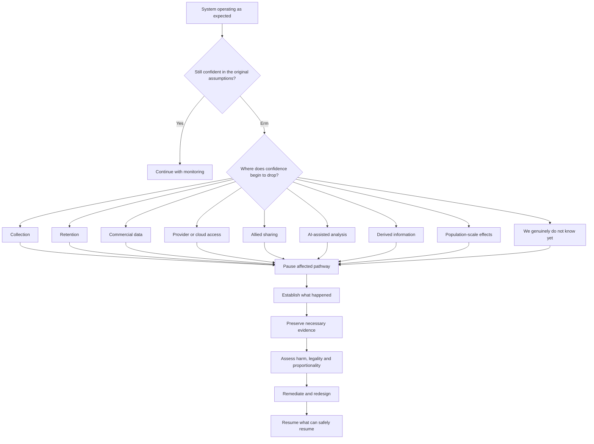

# ☔️ I Still Dream of Orgonon
**First created:** 2026-09-30 | **Last updated:** 2026-09-30  
*Why, despite the horrific potential for data misuse, I am holding out an umbrella for the cousins.*

---

> “I still dream of Orgonon.  
> I wake up crying –  
> You're making rain,  
> And you're just in reach,  
> When you and sleep escape me.”
> 
> *Kate Bush, “Cloudbusting”, 1985.*

## 🛰️ Orientation

This is not a prosecution.

It is an invitation to check the fucking machine.

Kate Bush’s *Cloudbusting* arrives here sideways: through Peter Reich remembering his father Wilhelm, through Orgonon, through a machine on a hill, through the arrival of institutional power, and through a child’s insistence that memory survives the official account.

This node does **not** require Wilhelm Reich to have been right about orgone energy. It does not require every action taken against him to have been wrong. It does not conscript Peter Reich’s grief into a modern argument about intelligence agencies, and it does not use a pop song as evidence for anything the United States, Britain, an intelligence service, an AI company or a cloud provider has done.

It uses the story as a cultural frame for a much more ordinary and much more difficult problem:

> **What happens when human beings build an extraordinary machine, become extremely good at using it, and only later discover that the surrounding safety system was calibrated for an earlier version of what the machine could do?**

That is not a uniquely American problem.

It is, however, an extremely American-shaped story.

An émigré intellectual. A strange invention. Enormous certainty. Engineering optimism. Sexual politics. Federal regulation. Courts. Cold War America. A child looking at the adults. Then, decades later, a British musician takes the whole thing home and turns it into one of the most beautiful songs in the English language.

America, we fucking love your machines.

This is partly the problem.

The question here is not whether powerful technology should exist.

The question is whether the systems around powerful technology can **notice, stop, learn and adapt** when the technology changes what the old rules mean in practice.

And if, hypothetically, one of our cousins has built a very clever information machine which has done something considerably stranger than anybody originally meant it to do, there is a second question:

> **Can we make it easier to say “erm” early enough that the rest of us can still help fix it?**

---

## 1. 🪀 What Made It Special Made It Dangerous

> “You're like my yo-yo,  
> That glowed in the dark –  
> What made it special,  
> Made it dangerous…  
> So I bury it –  
> And forget.”  

The first thing my brain does with a glowing old-fashioned yo-yo is, unfortunately:

**Oh, so it has got something radioactive in it, innit?**

To be absolutely clear, that is an association, not a claim about Peter Reich’s actual yo-yo.

But it is a useful association because humans really did spend part of the twentieth century discovering radioactive materials and then putting them in an astonishing range of things.

One of the least frivolous examples was also one of the most ordinary: luminous clock and watch dials.

Radium paint solved a real problem. The dial could be read in darkness. The desirable property was immediate and visible. The hazard was considerably less intuitive.

That distinction matters.

The glowing object tells the human nervous system:

**✨ LOOK WHAT IT CAN DO ✨**

Ionising radiation does not arrive with an equivalent sensory announcement.

The problem therefore cannot be solved by intuition alone. Once the hazard is understood, humans have to build an information environment around it: instruments, exposure limits, protective equipment, procedures, monitoring, labels, containment, training and regulation.

We effectively say:

> **Your senses are inadequate for this technology. Use the instrumentation and the procedure.**

That is not technophobia.

It is what technological maturity looks like.

### 👩‍🏭 The Radium Girls

The Radium Girls remain an industrial teaching example because the distribution of benefit and the distribution of risk were radically different.

A customer acquired a useful luminous dial.

Workers manufacturing those dials could experience repeated occupational exposure.

That gives us our first systems lesson:

> **The apparent safety of a product from the consumer’s position tells us very little about the risk experienced elsewhere in its production system.**

The system has more than one observer.

It has more than one exposure pathway.

It has more than one body.

### ⏰ And then the clock gets old

Radium-226 has a half-life of roughly 1,600 years.

The luminous phosphor in an old dial can deteriorate long before most of the radium has decayed. An object can therefore stop performing the function for which the radioactive material was useful while the radioactive material remains.

That gives us another principle:

> **Useful lifetime ≠ hazardous lifetime.**

Later radioluminescent technologies used materials including promethium-147 and tritium, and contemporary timepieces have other ways to solve the underlying problem.

We did not decide that knowing the time in the dark was morally corrupt.

We learned more about the mechanism.

We changed the system.

---

## 2. ☢️ The Point Is Not That Humans Were Stupid

It would be easy to tell the radiation story as:

**Old people were idiots. We know better now.**

That is comforting and mostly useless.

The more interesting history is that human risk calibration moved dramatically.

At different points, human beings have:

- treated radioactive properties as exciting, useful and marketable;
- catastrophically underestimated occupational exposure;
- developed radiation medicine;
- built nuclear weapons;
- developed sophisticated radiation monitoring;
- engineered containment systems;
- established exposure standards;
- constructed national and international regulatory architectures;
- and seriously considered how to communicate the location of dangerous nuclear waste to people living thousands of years after us.

That is an extraordinary range.

The lesson is neither:

**☢️ POWERFUL TECHNOLOGY BAD**

nor:

**✨ HUMAN INGENUITY WILL SORT IT OUT ✨**

It is:

> **Human beings can learn extremely sophisticated ways of governing a hazard, but the delay between acquiring a capability and understanding how to live safely with it can be brutally expensive.**

So the interesting design question is:

> **Can we shorten the dangerous part of the learning curve?**

---

## 3. 🐈 Future Person, Please Observe the Cat

This is where the Raycats turn up.

The proposed Raycat solution belongs to the wonderfully strange field of nuclear semiotics: how do you communicate danger across timescales on which you cannot safely assume that your present language, institutions, technical standards or cultural references will survive?

The speculative answer was essentially:

**What if cats changed visibly around radiation, and we taught the culture that changing cats mean danger?**

The genetically engineered warning cat did not become the standard nuclear-waste system.

The problem underneath it remains serious.

How do you say:

> **DO NOT FUCKING DIG HERE**

to somebody whose entire information environment may be different from yours?

That is a deep-time provenance problem.

And it gives us a useful way to think about data.

Imagine the people who authorised an extraordinary data collection programme have retired.

The emergency has ended.

The company has been acquired.

The model has changed.

The original analysts are dead.

The database is still there.

The derived information is still there.

The query still works.

What survives alongside it to explain:

- why the data was collected;
- under what authority;
- for what purpose;
- under what emergency or exceptional conditions;
- what confidence attached to its inferences;
- which restrictions followed the data;
- when it should have been reviewed or deleted;
- which derived datasets inherited those restrictions;
- whether later analysts are permitted to use it at all?

The Future Analyst Raycat therefore has a simple message:

> 🐈 **This thing may still work. That does not mean you are supposed to fucking use it.**

The hazard and the information describing the hazard need compatible lifetimes.

---

## 4. ♻️ Robustness Is Not Rigidity

The system we want is not one that prevents anything unusual from ever happening.

That system would be useless.

Nor do we want a system so committed to efficiency that every constraint is treated as friction waiting to be removed.

That system eventually drives itself into a wall.

There are at least three useful properties to separate.

### Efficiency

The system performs ordinary work without wasting unnecessary time, energy or resources.

### Robustness

The system can absorb expected disturbances without collapsing.

### Adaptability

The system can recognise that the environment has changed enough that its existing assumptions no longer hold, and can alter its behaviour accordingly.

The interesting system is therefore:

> **efficient in normal operation + robust under expected stress + capable of changing state when meaningful feedback says the world has changed.**

Robustness is not rigidity.

Adaptability is not chaos.

And a safety mechanism which can never itself be revised eventually becomes another source of brittleness.

---

## 5. 🎯 The Optimisation Trap

A subsystem can become exceptionally good at its stated objective while making the larger human system worse.

That is not paradoxical.

It is what happens when the feedback loop is measuring the wrong amount of the world.

Consider the structure:

```text
identify objective
        ↓
measure performance
        ↓
optimise
        ↓
measure again
        ↓
optimise harder
```

This works beautifully if the metric contains enough information about what actually matters.

It becomes dangerous when important variables sit outside the loop.

For example:

```text
find national-security threats
        ↓
collect useful information
        ↓
improve correlation
        ↓
make analysis cheaper
        ↓
find more relationships
        ↓
retrieve more context
```

None of those steps is inherently absurd.

But what happens if the feedback environment inadequately represents:

- privacy;
- proportionality;
- false positives;
- cultural misunderstanding;
- contextual misunderstanding;
- human dignity;
- downstream reuse;
- institutional legitimacy;
- reversibility;
- the difference between being represented in a graph and being suspected of wrongdoing;
- whether the original objective still makes sense at the new scale?

Then the optimising subsystem is not optimising the whole human system.

It is optimising what it can see.

---

## 6. 🛝 Some Friction Was Secretly Doing A Job

Technological progress removes friction.

This is usually why we like it.

A task that required three hundred people and six months becomes possible in minutes.

A search that once required knowing the right archive becomes semantic retrieval.

Separate records become linkable.

Unstructured text becomes queryable.

Relationships become graphable.

Patterns become detectable.

The old limitation disappears.

Excellent.

Except sometimes the old limitation was accidentally performing a protective function.

It was expensive to look at everybody.

It was difficult to join everything.

Analysts had finite attention.

Context took time to reconstruct.

Cross-referencing required effort.

The friction was not designed as a privacy safeguard.

But removing it can nevertheless change the practical meaning of an authority written while that friction existed.

This gives us one of the central propositions of this node:

> **The law does not necessarily have to expand for practical state capacity to expand.**

The written rule may remain identical.

The machine operating beneath it may not.

That is exactly why mature governance needs feedback.

---

## 7. 🩺 Before Amputating Anything, Check The Fucking Leg

Medicine has stop points.

Identity checks.

Procedure checks.

Site checks.

Second opinions.

Multidisciplinary review.

Escalation thresholds.

Pauses before consequential interventions.

These do not exist because doctors are uniquely incompetent.

They exist because **competent humans still make errors**.

Experts make errors.

Teams make errors.

Organisations make errors.

People become overconfident.

Information gets lost during handover.

Unusual cases do not fit ordinary models.

Pressure changes judgement.

A catastrophic error does not become impossible merely because everybody involved was conscientious.

So before doing the extremely clever irreversible thing:

**stop and confirm that this is the correct fucking leg.**

The same safety culture should increasingly accompany AI systems used in national security, intelligence, defence, health, critical infrastructure and consequential government decisions.

The stop point is not an insult to the machine.

It is not an insult to the engineer.

It is not an insult to the analyst.

It is an acknowledgement that **expertise does not abolish error**.

---

## 8. 🕸️ And Now Unfortunately We Have To Talk About The Cousins

Here the node changes register.

Everything above is systems analysis and cultural framing.

What follows needs a factual spine.

### 🇺🇸 Section 702

Section 702 of the US Foreign Intelligence Surveillance Act permits targeting of non-US persons reasonably believed to be outside the United States for foreign-intelligence purposes under the statutory framework.

It does **not** mean that every British person using an American service is an intelligence target.

It does **not** mean that political disagreement with the United States is sufficient to make somebody a target.

It does **not** turn every American software product into an intelligence collection device.

But target population and represented population are not the same thing.

The US Privacy and Civil Liberties Oversight Board explains that when Section 702 collection acquires a communication between a target and a non-target, the non-target communication is incidentally collected. Importantly, PCLOB says “incidental” does not mean accidental or inadvertent: it is an anticipated collateral result of monitoring the target. PCLOB also warns that the term should not be read as meaning such collection is necessarily infrequent or inconsequential.

That distinction matters enormously.

> **Target population ≠ represented population.**

### 🇬🇧 Britain has its own enormous machines

Britain does not get to stand on the other side of the Atlantic clutching its pearls.

The Investigatory Powers Act architecture includes bulk personal datasets.

The 2024 amendments created Part 7A for bulk personal datasets where the individuals concerned have no or only a low reasonable expectation of privacy, subject to the statutory framework.

They also created Part 7B for third-party bulk personal datasets.

The explanatory material is particularly useful here because it makes the population distinction explicit: a third-party bulk personal dataset can contain personal data relating to many individuals where the **majority are not, and are unlikely to become, of interest to the intelligence services**.

Under the Part 7B architecture, an intelligence service can in specified circumstances have electronic access to a dataset held by a third party and examine it *in situ*, rather than necessarily acquiring and retaining its own copy, subject to the warrant and statutory regime.

Government departments and commercial entities are expressly contemplated as possible third parties.

Again:

> **Being represented in a dataset is not the same thing as being suspected of anything.**

Britain knows this because Britain has had to legislate for it too.

---

## 9. ☁️ Where The Cloud Actually Matters

American technology introduces another jurisdictional question which is easy to flatten into nonsense.

A piece of software having been written in America does not mean the US government can automatically read everything done with it.

A locally running application is not the same thing as a US-controlled cloud service.

A company being subject to US jurisdiction is not the same thing as the government possessing a permanent live feed into all company data.

But the US CLOUD Act did make explicit that a company subject to US jurisdiction can be required, through valid legal process, to produce responsive data within its possession, custody or control regardless of where the company chooses to store that data.

So the useful questions are not:

**IS IT AMERICAN?**

They are:

- Who possesses the data?
- Who controls it?
- Where is the provider legally established?
- What jurisdiction reaches the provider?
- What legal process is required?
- What purpose permits access?
- What restrictions apply?
- What happens when jurisdictions overlap?

Cloud architecture matters.

But jurisdiction is a mechanism, not magic.

---

## 10. 🤖 The Computable Population

Now we reach the interesting technological change.

Historically:

> **possessing a large quantity of information did not necessarily mean cheaply understanding everything inside it.**

Information had labour costs.

Search had labour costs.

Cross-referencing had labour costs.

Translation had labour costs.

Entity resolution had labour costs.

Graph construction had labour costs.

Context had labour costs.

Artificial intelligence can change those economics.

Depending on the system and the material, computational tools can assist with:

- semantic retrieval;
- summarisation;
- entity resolution;
- cross-dataset matching;
- relationship mapping;
- graph construction;
- anomaly detection;
- pattern identification;
- triage.

This does **not** establish that intelligence holdings have been transferred into commercial foundation-model training.

Those are different claims.

A model being deployed inside a controlled environment to analyse an existing holding is conceptually different from giving that holding to a commercial model developer as training data.

Do not collapse them.

The systems question is simpler:

> **What happens when information that was already collectable becomes dramatically cheaper to interrogate?**

Then:

> **represented population ≠ target population ≠ computable population.**

A person may be computationally visible because the system can derive relationships involving them without anybody ever having selected that person as an original intelligence target.

That is a governance problem worth understanding even if every original collection decision was individually defensible.

---

## 11. 🧠 When Britain Looks Weird To The Machine

This section is a hypothesis about model risk.

It is **not evidence that an American intelligence system has behaved this way**.

Suppose an analytical system has a poor baseline for the population it is interpreting.

Different country.

Different class structures.

Different institutions.

Different professional conventions.

Different dialect.

Different humour.

Different political history.

Different assumptions about what ordinary relationships look like.

Now suppose uncertainty prompts context-seeking.

A possible feedback loop emerges:

```text
cultural / domain mismatch
        ↓
greater uncertainty
        ↓
retrieve more context
        ↓
denser representation
        ↓
more apparent anomalies and relationships
        ↓
greater uncertainty
        ↓
retrieve more context
```

Nothing in that loop requires malice.

That is precisely why it is interesting.

> **A context-seeking system can accidentally turn uncertainty into justification for ever-greater observability.**

Embodied Information Ecology matters here because information does not have a fixed meaning independent of the system processing it.

The same observation can carry radically different informational value for observers with different:

- prior knowledge;
- models;
- questions;
- social positions;
- incentives;
- historical context;
- access to previous interactions.

A machine that cannot adequately represent those differences can be very clever and still be wrong.

---

> “On top of the world,
> Looking over the edge:  
> You could see them coming.  
> You looked too small,  
> In their big black car,  
> To be a threat to the men in power.”  

## 12. 🚘 You Looked Too Small

Turn the camera around.

So far we have looked down from the system:

```text
authority
↓
collection
↓
dataset
↓
analysis
↓
decision
```

Now stand underneath it.

From the institution’s perspective:

```text
case
↓
rule
↓
process
↓
completion
```

From the human perspective:

```text
something enormous has entered my life
```

Those descriptions can concern the same event.

The second does not automatically prove that the first was illegitimate.

The first does not erase the second.

And if the institutional feedback system records only whether its procedure was completed successfully, it may have no variable representing what successful completion actually did to the human being downstream.

This is one reason lived experience is information.

Not infallible information.

Not the only information.

Information.

The system needs to be capable of hearing it.

---

## 13. 🇺🇸 Cousin, You Appear To Be Having A Time

Now we enter the explicit hypothetical.

We do **not** know from the public evidence assembled here that the United States has accidentally constructed the particular population-scale visibility problem this node is about to describe.

The hypothetical is:

> Suppose closely allied democracies discover that individually governed intelligence, commercial-data, security, cloud and technological systems have composed into substantially greater analytical visibility over another country’s population than the participants originally anticipated or now consider proportionate.

Perhaps no individual component was designed to produce the emergent whole.

Perhaps several components were.

Perhaps some processing was perfectly ordinary.

Perhaps some was not.

Perhaps the problem is collection.

Perhaps the problem is retention.

Perhaps the problem is not the amount collected at all, but what new analytical systems can now infer from it.

Perhaps everybody has been following yesterday’s rules while operating tomorrow’s machine.

What should happen next?

The answer should not begin:

**CONFESS YOUR CRIMES BEFORE THE INTERNATIONAL COMMUNITY.**

It can begin much more simply.

America.

Look.

We get it.

You seem to have been having **a time**.

There are now some problems.

We need to talk about how to move forward, yeah?

---

## 14. 📊 Please Point To Where The “Erm” Begins

This is a Mermaid chart.

An actual Mermaid chart.

There is no diplomatic sea-woman.



**It is okay to point to more than one box.**

“We genuinely do not know yet” is also a valid incident state.

The purpose of this chart is not to establish culpability before diagnosis.

It is to lower the institutional cost of saying:

> **Our confidence in this part of the system has dropped below the level at which ordinary operation should continue without review.**

That is useful information.

---

## 15. 🤫 You Do Not Need To Tell Everybody Everything

There is an obvious objection.

Intelligence systems are secret for reasons which are not all sinister.

Public disclosure can expose:

- collection methods;
- active investigations;
- vulnerabilities;
- innocent people;
- intelligence partners;
- technical capabilities;
- legitimate national-security activity.

Fine.

The alternative to complete public disclosure is not complete concealment.

A responsible incident architecture could look something like:

```text
classified technical audit
        ↓
independent legal and proportionality review
        ↓
identify harms and affected systems
        ↓
preserve evidence needed for investigation or redress
        ↓
stop / constrain / delete / correct inappropriate processing
        ↓
bounded allied disclosure where another sovereign needs to act
        ↓
appropriate domestic investigation or validation
        ↓
oversight and remedy
        ↓
public explanation at a level compatible with legitimate security needs
```

That is a proposed governance model.

It is not a claim that a single existing US-UK process already works exactly this way.

The principle is:

> **Disclosure should be sufficient for the recipient to protect its legitimate interests and act on the problem, not maximal for its own sake.**

There are secure rooms.

There are classification systems.

There are cleared people.

There are oversight bodies.

There are ways to begin a conversation without putting the intelligence architecture on fucking TikTok.

Use them.

---

## 16. ⚖️ Do Not Delete The Crime Scene

Suppose the review discovers information which should never have been processed in the way it was.

**Delete everything immediately** sounds satisfyingly clean.

It may also destroy evidence required to establish what happened.

At the other extreme:

**Keep everything because it might be useful** turns usefulness into retroactive permission.

Also unacceptable.

The information may need separating conceptually into different classes:

- improperly or disproportionately acquired personal information;
- lawfully acquired information which is no longer necessary;
- material required to establish privacy or institutional harms;
- information indicating serious crime;
- information indicating a population-level phenomenon which can be independently tested;
- material whose disclosure would reveal legitimate intelligence sources or methods.

Then ask two separate questions.

### Question one

**Was acquiring, retaining or processing this information lawful and proportionate?**

### Question two

**Given that the information now exists, what lawful and ethical obligations arise from what it reveals?**

The answer to question two cannot retroactively legalise question one.

The answer to question one does not automatically mean that evidence of trafficking, corruption, exploitation, cybercrime or another serious harm should be fed into a shredder.

We need more than one button.

---

## 17. 🇬🇧 The Americans Do Not Get To Prosecute British People By Vibes

A foreign intelligence lead is not the same thing as admissible evidence in a British criminal court.

Nor should an opaque computational inference simply become a British finding of fact because a clever allied machine produced it.

The conceptual route is more like:

```text
foreign intelligence or analytical lead
        ↓
appropriate and lawful UK referral
        ↓
UK investigative decision
        ↓
lawfully and independently obtained evidence
        ↓
evidence tested under British procedure
        ↓
British judicial process
```

Likewise, a population-level pattern identified through an intrusive or unusual analytical system may be treated as a **hypothesis requiring independent validation**.

The machine may have noticed something real.

That does not mean every route by which it noticed the thing should become normal.

This distinction protects sovereignty **and** preserves potentially valuable information.

---

## 18. 🧯 Make “Oh Fuck” An Operational State

The binary is killing us.

Either:

**EVERYTHING IS WORKING AS INTENDED**

or:

**CATASTROPHIC INSTITUTIONAL FAILURE**

Those cannot be the only available states.

A mature high-consequence system needs something like:

```text
NORMAL
  ↓
MONITOR
  ↓
HANG ON
  ↓
INCIDENT
  ↓
REMEDIATE
  ↓
RESUME
```

**HANG ON** is doing serious work here.

It means:

- something materially unexpected has occurred;
- confidence in an assumption has dropped;
- the affected pathway may need pausing;
- evidence should be preserved;
- the cause is not yet established;
- culpability is not yet established;
- ordinary optimisation should not simply continue through the anomaly.

The crucial institutional-design question is:

> **Who is allowed to trigger HANG ON?**

If only the people rewarded for continued operation can stop the machine, the stop button is decorative.

If reporting an anomaly automatically destroys careers, organisations learn not to report anomalies.

If raising uncertainty is treated as disloyalty, the feedback loop has been corrupted.

So:

> **Make early disclosure cheaper than continued concealment.**

Not consequence-free.

Cheaper.

---

## 19. 🏛️ Regulation Is Memory Encoded Into Institutions

Regulation is often narrated as:

**government prevents exciting people from doing exciting things.**

Sometimes government does, in fact, behave like an arse.

But at its best, regulation performs a much more interesting informational function.

It remembers.

A worker is injured.

A patient dies.

An aircraft crashes.

A reactor fails.

A product poisons people.

A database is abused.

A system produces a catastrophic false positive.

The investigation should not end with:

**Well, that was awful.**

The information has to travel forward.

```text
harm
↓
investigation
↓
learning
↓
standard / procedure / regulation / design change
↓
different future behaviour
```

That is feedback.

The rule is memory with institutional force.

A checklist is memory.

A monitoring requirement is memory.

A provenance field is memory.

A circuit breaker is memory.

A requirement to ask whether a new technological capability has changed the practical effect of an old authorisation is memory.

The aim is not to make the system frightened of movement.

The aim is to stop it forgetting why the guardrail exists.

---

## 20. 🤖 The Faster Machine Needs The Faster Learner

AI can shorten cycles.

Analysis becomes faster.

Retrieval becomes faster.

Correlation becomes faster.

Development becomes faster.

Deployment becomes faster.

Decision support becomes faster.

If governance still learns primarily through:

```text
catastrophe
↓
press scandal
↓
inquiry
↓
three years of evidence
↓
report
↓
argument
↓
legislation
↓
implementation
```

then the feedback system is running at the wrong clock speed.

That does not mean replacing deliberation with panic.

It means creating shorter legitimate loops inside the larger constitutional loop:

```text
capability
↓
outcome
↓
feedback
↓
stop or adapt
↓
governance update
↓
capability
```

The system should be capable of learning **before** catastrophe is the only signal strong enough to reach it.

This is where AI risk management begins to resemble the safety cultures of medicine, aviation, nuclear engineering and other high-consequence fields.

Not because the hazards are identical.

Because **rapidly capable systems need explicit ways to detect when normal operation has stopped being normal**.

---

## 21. 🎩 Putting On Less Ritz

There is also a communication problem.

The language that helps create an extraordinary technology is not necessarily the language that should govern sovereign adoption of it.

Venture capital wants to know:

- How large could this become?
- How transformative is it?
- How quickly can it scale?
- What happens if it works spectacularly?

Those are legitimate questions.

A state also has to ask:

- What happens if it is wrong?
- What happens if it is right beyond expectations?
- What becomes irreversible?
- Who owns the resulting data?
- Who can compel the provider?
- What jurisdiction applies?
- Can the system be audited?
- Can the result be reproduced?
- What happens if the supplier is acquired?
- What happens if the supplier fails?
- What happens in war?
- What is the exit plan?
- What happens when the failure is population-scale?

An investor purchases possibility and upside.

A sovereign purchases capability, dependency and risk.

This does not make founders bad diplomats.

It means **founder and diplomat are different jobs**.

Engineer, assurance specialist, security professional, lawyer, procurement specialist, diplomat and minister all see different parts of the machine.

A mature information environment lets those perspectives meet before somebody discovers that the pitch deck has become critical national infrastructure.

---

## 22. ☢️ We Have Done This Before

The radiation history is useful precisely because it contains both recklessness and extraordinary seriousness.

Humans once put radioactive material into consumer objects with a degree of casualness that can look astonishing from the present.

Humans also built increasingly sophisticated systems for:

- measuring radiation;
- limiting exposure;
- protecting workers;
- controlling materials;
- containing waste;
- monitoring environments;
- planning for accidents;
- communicating hazards;
- preserving warnings across enormous spans of time.

The lesson is not that we were stupid then and clever now.

The lesson is that **risk culture changed as information changed**.

And it can change again.

Discovering that a technology requires more care than its early adopters appreciated does not prove that the technology has failed.

It means the information environment around the technology has to mature.

This is the adaptable system we actually want:

> **robust enough to operate confidently most of the time; dynamic enough to recognise when “most of the time” has stopped describing the present case.**

---

> “But every time it rains –  
> You're here in my head,  
> Like the sun coming out.  
> Ooh, I just know that something good is gonna happen!  
> I don't know when,  
> But just saying it could even make it happen.”  

## 23. 🌦️ Something Good Could Happen

This is why the hopeful passage belongs near the end.

Not because saying a thing makes it true.

Because saying a possibility aloud can alter the information environment.

Before articulation:

```text
possible failure
→ privately perceived
→ unshared
→ unactionable
```

After articulation:

```text
possible failure
→ represented
→ inspectable
→ discussable
→ testable
→ potentially actionable
```

That is not magic.

That is coordination.

If nothing like the hypothetical problem in this node has happened:

**excellent.**

We can still build safeguards against it.

If fragments of it have happened:

**excellent, in a different and considerably more awkward sense.**

We can identify them before they compose into something worse.

If something substantially like it has happened:

then we need the grown-up machinery.

Audit.

Evidence.

Oversight.

Allied communication.

Containment.

Independent validation.

Redress.

Regulatory learning.

And eventually, where safe:

resume.

---

## 24. ☔ Why I Am Holding Out The Umbrella

The umbrella is not absolution.

It is not:

**America would never.**

It is not:

**national security, therefore shut up.**

It is not:

**allied country, therefore special moral exemption.**

It is not:

**AI is shiny, therefore acceptable.**

It is not:

**we cannot know everything, therefore we should ask nothing.**

The umbrella means:

> **Accountability should be designed so that choosing it remains institutionally possible.**

If a close ally has fucked something up, we want it to tell us.

If it thinks it may have fucked something up, we want it to investigate.

If it does not know which subsystem produced the weird outcome, we want it to be able to say that too.

If the first conversation has to occur at an extremely high classification level, then have the extremely classified conversation.

If another sovereign needs enough information to protect its population, eventually that sovereign needs enough information to act.

If an affected person is entitled to remedy, classification cannot simply become a magic word which makes the underlying problem cease to exist.

And if the review discovers that nothing improper happened, that is also useful information.

The point is to find out which fucking problem we are solving.

---

## 25. 📊 Cousin, Please Point To The Flowchart

So this is the nicer node in the satire folder.

Cousin.

I see you are looking a little shifty.

Cousin.

I see you are shuffling and looking at your feet.

Nobody is asking you to explain the entire national-security state before tea.

Please point to the part of the Mermaid chart where you first started feeling awkward.

It is okay if you need to point to more than one bit.

It is okay if the answer is:

**“We do not know yet.”**

It is okay if the answer is:

**“The original collection looks defensible but we are considerably less comfortable with what became inferable later.”**

It is okay if the answer is:

**“Our providers cannot tell us as much as we expected.”**

It is okay if the answer is:

**“Our providers may know more than they can publicly say.”**

It is okay if the answer is:

**“Several individually governed systems appear to have composed into something none of the individual governance processes adequately represented.”**

Those are not final conclusions.

They are places to start.

There will be lawyers.

There will be diplomats.

There will be intelligence people.

There will be engineers.

There will be regulators.

There will be allied governments with a lot of shit to say.

There will be people who were affected who have a lot of shit to say.

Good.

That is what a feedback environment is for.

The aim is not to protect a powerful system from feedback.

The aim is to make sure the feedback reaches it **before the only remaining form of feedback is catastrophe**.

---

## 26. ☁️ The Machine Is Allowed To Be Extraordinary

I do not want less curiosity.

I do not want less ambition.

I do not want engineers to stop attempting strange things because one day a regulator might have questions.

I do not want America to stop being America in the particular sense that produces people who look at an impossible technical problem and say:

**Yeah, but what if we built it?**

That quality is useful.

It is exciting.

It has produced extraordinary things.

It is also precisely why the surrounding system needs people whose job is to ask:

**What happens if it works much better than you think?**

That is not the enemy of invention.

That is part of learning how to live with invention.

Build extraordinary machines.

Permit extraordinary ambition.

Retain the possibility that the model is wrong.

Remember the workers.

Remember the subjects.

Remember the people downstream.

Remember that a dataset can outlive the reason it was created.

Remember that the useful property can disappear before the dangerous property does.

Remember that a rule written around yesterday’s friction may behave differently when tomorrow’s machine removes it.

Remember that the person standing underneath the system is also an observer of the system.

Put a fucking stop button on the machine.

And if the clouds begin behaving strangely:

> **Cousin, come inside. Bring the flowchart.**
>
> **I have an umbrella.**

---

## 📚 Sources

- [Privacy and Civil Liberties Oversight Board: “Report on the Surveillance Program Operated Pursuant to Section 702 of the Foreign Intelligence Surveillance Act”](https://documents.pclob.gov/prod/Documents/OversightReport/e9e72454-4156-49b9-961a-855706216063/2023%20PCLOB%20702%20Report%20%28002%29.pdf)
- [UK Legislation: “Investigatory Powers (Amendment) Act 2024 — Explanatory Notes: Part 1, Bulk Personal Datasets”](https://www.legislation.gov.uk/ukpga/2024/9/notes/division/7/index.htm)
- [GOV.UK: “Bulk personal datasets — low or no reasonable expectation of privacy: code of practice”](https://www.gov.uk/government/publications/bulk-personal-datasets-low-or-no-reasonable-expectation-of-privacy-code-of-practice)
- [GOV.UK: “Intelligence services’ use of third party bulk personal datasets: code of practice”](https://www.gov.uk/government/publications/third-party-bulk-personal-datasets-code-of-practice/intelligence-services-use-of-third-party-bulk-personal-datasets-code-of-practice-accessible)
- [US Department of Justice: “Justice Department Announces Publication of White Paper on the CLOUD Act”](https://www.justice.gov/archives/opa/pr/justice-department-announces-publication-white-paper-cloud-act)
- [US Department of Justice: “Executive Order 14086”](https://www.justice.gov/opcl/executive-order-14086)
- [NIST: “AI Risk Management Framework”](https://www.nist.gov/itl/ai-risk-management-framework)
- [NIST AI Resource Center: “Framing Risk”](https://airc.nist.gov/airmf-resources/airmf/1-sec-risk/)

### 📝 Evidence note

The legal and institutional sources above establish specific authorities, safeguards and publicly described architectures. They do **not** establish that the hypothetical US-UK population-scale data outcome explored in this node has occurred.

The intelligence/data incident in this node is therefore a **systems stress-test**: a way to ask what competent governance should do if individually governed components produce an emergent outcome outside the envelope their designers, operators, overseers or allied partners expected.

The Cloudbusting, radium and Raycat material provides cultural and systems framing. These examples are not presented as equivalent hazards.

---

## 🌌 Constellations

☔️ 🪀 ☢️ 🕸️ ♻️ — technological wonder; invisible risk; information inheritance; feedback; adaptive governance.

---

## ✨ Stardust

embodied information ecology, feedback environments, cybernetics, adaptive governance, artificial intelligence, intelligence oversight, data provenance, bulk personal datasets, technological risk, allied incident response

---

## 🏮 Footer

*I Still Dream of Orgonon* is a living node of the **Polaris Protocol**.  
It uses technological risk, cultural memory and a hypothetical allied data incident to examine how high-capability systems can remain robust without becoming rigid: detecting anomalies, preserving evidence, communicating uncertainty, repairing harm and changing when their original assumptions no longer describe what the machine can do.

> 📡 Cross-references:
>
> - [♻️🕸️ The Feedback Environment](../README.md) — *parent framework for feedback, interpretation and system adaptation*
> - [🎩 Putting On Less Ritz](./README.md) — *cluster examining capability, persuasion, governance and the difference between selling a machine and governing one*
> - [🪿 Embodied Information Ecology](../../README.md) — *parent framework for information as situated, experienced and system-dependent*
>
> 🏮 Return To:
>
> - [🎩 Putting On Less Ritz](./README.md) — *1up*
> - [♻️🕸️ The Feedback Environment](../README.md) — *2up*
> - [🪿 Embodied Information Ecology](../../README.md) — *3up*
> - [🌑 Origin Points](../../../README.md) — *4up*
> - [🌌 Polaris Protocol — Root](../../../../README.md) — *root*

*Survivor authorship is sovereign. Containment is never neutral.*

_Last updated: 2026-09-30_
