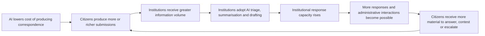
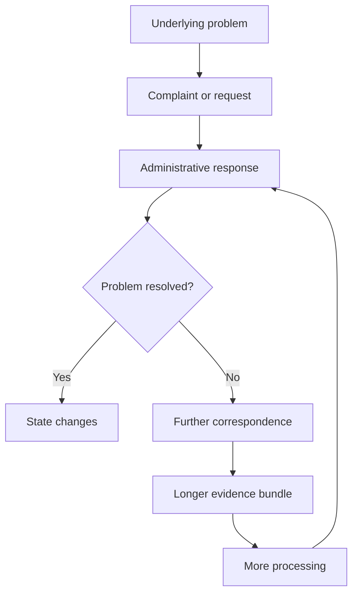

# 📥 Chattering Chatbots
**First created:** 2026-08-25 | **Last updated:** 2026-08-25  
*What happens when every participant in an administrative feedback environment acquires cheaper information-production capacity at once.*

---

## 🛰️ Orientation

Twenty-seven pages about bins is funny.

It is also not, by itself, an explanation.

A long AI-assisted complaint might be one missed collection inflated into pages of unnecessary prose. It might instead contain years of unresolved correspondence, multiple affected households, tables, photographs, previous complaint numbers, extracts from council policy and appendices. Without seeing the document, the page count is an output signal. It does not tell us what produced it.

That uncertainty opens a larger question.

Generative AI is being introduced into government, healthcare, justice, recruitment, research and other administrative systems partly because producing, reading, sorting and responding to language takes time. The same technology is also available to the people communicating with those systems.

The result is not simply automation on one side.

It is a change to the **feedback environment**.

When citizens can produce more correspondence, institutions receive more correspondence. When institutions can answer more correspondence, citizens receive more material that can be questioned, compared, rebutted or escalated. When applicants can submit more applications, reviewers need more screening capacity. When clinicians can produce more documentation, downstream services have more documentation to process.

Each participant's increased output becomes somebody else's increased input.

The central question is therefore not merely whether AI makes an individual task faster.

It is:

> **What happens when everyone in the feedback environment can produce, process and answer information more cheaply at the same time?**

---

## 🇬🇧 The British Administrative Setting

The British council complaint provides a particularly legible entry point because access to public administration has long involved access to a particular kind of language.

Functional English is not necessarily enough to feel confident writing to a council, NHS trust, government department, ombudsman, regulator or court.

Institutional correspondence has a register.

It asks people to know how to:

- state events chronologically;
- distinguish complaint from request;
- identify the remedy being sought;
- refer to policy without sounding threatening;
- disagree while remaining administratively legible;
- use the expected degree of formality;
- compress emotion into language an institution recognises as reasonable;
- escalate without accidentally undermining their own case.

British English adds its own pragmatic machinery. Modal verbs, hedges, qualifiers, understatement and small politeness devices can encode large amounts of social information.

“Could you possibly clarify…”

“I am not entirely satisfied…”

“I wonder whether…”

“I am afraid this does not appear to…”

These are not merely decorative niceties. They can signal distance, disagreement, deference, seriousness, uncertainty and the degree of imposition being made.

A person may therefore be perfectly intelligent and literate while still thinking:

> **I don't know how to write a council letter.**

That confidence is not distributed equally.

Education, professional experience, money, time, social networks and familiarity with institutions all affect a person's ability to produce administratively legible correspondence or delegate the work to somebody else. Stress, poverty, illness, caring responsibilities and insecure work can consume exactly the time and cognitive capacity required to persist through a complaints process.

Institutions can then adapt rationally to the feedback they receive. An area whose residents reliably complain, contact councillors and escalate service failures may receive more anticipatory attention because preventing those failures reduces future workload.

No individual decision needs to be malicious for the resulting pattern to become unequal.

Service responsiveness can begin to track **complaint capacity** as well as need.

Generative AI changes that environment because it can partially commoditise administrative fluency.

It does not merely give people more words.

> **It can give people access to the register in which the institution expects to be addressed.**

---

## 📥 When Everyone Can Produce More

On the citizen side, generative AI can make it easier to:

- draft correspondence;
- summarise policy;
- organise chronology;
- compare previous statements;
- create tables;
- structure evidence;
- translate informal descriptions into administrative language;
- identify possible escalation routes;
- produce follow-up correspondence;
- turn a complicated history into a coherent submission.

On the institutional side, AI can make it easier to:

- triage incoming correspondence;
- classify requests;
- extract information from free text;
- summarise large submissions;
- draft responses;
- convert conversations into structured records;
- produce reports;
- handle larger queues.

Both can be genuine improvements.

The difficulty appears when they are treated independently.

If citizens increase their production capacity, institutional workload changes.

If institutions increase their response capacity, the amount of material citizens receive changes.

If both happen together, the system can settle at a new equilibrium containing much more administrative activity than before.

> **Each side's productivity becomes part of the other side's workload.**

---

## 🌀 The Chattering Loop



This loop does not require either side to behave irrationally.

A citizen may reasonably use a tool that helps them explain a problem.

A public body may reasonably use a tool that helps staff process the resulting correspondence.

The system-level effect emerges from the interaction.

---

## 🗑️ Feedback Is Supposed To Change Something

A complaint system is a feedback mechanism.

For a missed bin collection:

```text
expected state: bin collected
observed state: bin remains outside
error signal: missed collection report
desired correction: collect bin
```

The important question is what happens after the signal enters the system.



If the response changes the underlying state, the feedback loop can close.

If the response processes the complaint without resolving the underlying problem, the error signal remains.

The citizen may then amplify it.

The institution may acquire greater capacity to process that amplification.

Both sides can become extraordinarily productive while the original problem persists.

---

## 🏛️ Central Government

UK government provides unusually useful evidence because departments are already documenting generative-AI uses through algorithmic transparency records and trials.

Examples include:

- Department for Education AI-assisted correspondence drafting;
- Foreign, Commonwealth and Development Office correspondence triage;
- Cabinet Office generative-AI drafting and communications tools;
- Crown Prosecution Service correspondence drafting.

The Department for Education has described very large task-level drafting savings for its correspondence tool, while retaining human review and quality assurance.

That can be a genuine productivity gain.

It does not, by itself, tell us what happens when the people corresponding with the department acquire comparable drafting capacity.

The system-level questions are different:

- Does the backlog fall?
- Does repeat contact fall?
- Are underlying enquiries resolved more quickly?
- Does cheaper correspondence increase the amount of correspondence?
- Does faster response create more material to answer?
- Do expectations about response volume rise?
- Does verification become the new bottleneck?

The distinction matters:

**faster drafting is evidence of faster drafting.**

It is not automatically evidence of lower total administrative workload.

---

## 🏥 NHS And Healthcare

Healthcare contains several overlapping feedback loops.

### Patient messaging

Digital patient messaging provides a useful pre-generative-AI comparator.

Reducing the friction involved in contacting healthcare services can increase message volume. The resulting inbox burden has itself become a target for automation.

This is an important warning against assuming that making each interaction cheaper leaves the number of interactions unchanged.

### Clinical documentation

Ambient and generative systems can reduce the effort required to produce:

- consultation notes;
- clinic letters;
- referrals;
- summaries;
- patient communications.

That may release substantial clinical capacity.

But downstream capacity does not automatically expand at the same rate.

A referral that becomes easier to produce still enters a specialist service.

A longer clinical record still needs to be navigated.

A generated response may still require checking.

### Verification and downstream load

Research on AI-assisted patient messaging shows why the distinction matters. Drafting assistance can reduce perceived cognitive burden, while editing, factual checking and responsibility for the final message remain with clinicians.

In some settings, the checking burden can reduce or erase the expected advantage.

The useful system question is therefore:

> **If documentation capacity rises faster than treatment capacity, where does the pressure go?**

---

## ⚖️ Justice

Justice exposes the access-versus-volume tension particularly clearly.

Generative AI can help a litigant in person:

- understand unfamiliar procedure;
- structure a chronology;
- organise evidence;
- draft pleadings;
- prepare a witness statement;
- identify questions requiring legal advice;
- express a case in language a court can more readily process.

That may be genuinely democratising.

The same capability can also produce:

- unnecessarily long submissions;
- weak arguments presented with professional surface polish;
- more applications;
- more authorities requiring checking;
- hallucinated citations;
- additional evidential material;
- greater judicial verification costs.

Courts have finite attention.

> **The same capability can simultaneously lower an access barrier and raise the processing burden on the institution receiving the result.**

The relevant policy question is therefore not whether AI-assisted litigants are inherently desirable or undesirable.

It is how access gains can be preserved without allowing cheap production to consume scarce judicial attention.

---

## 💰 Grants And Public Funding

Grant applications provide one of the clearest candidate rebound loops.

Generative AI lowers some of the labour involved in:

- drafting;
- editing;
- tailoring;
- summarising;
- formatting proposals.

If submission becomes cheaper, proposal volume can rise.

Evaluator capacity may not.

European research-funding institutions have already reported increased proposal volumes alongside concern about evaluator workload and verification.

The next response is predictable: automate more of the screening and review process.

```text
AI-assisted applications
        ↓
more applications
        ↓
greater evaluator workload
        ↓
AI-assisted screening
        ↓
lower review cost
        ↓
capacity to process still more applications
```

This is not proof that every stage will continue expanding indefinitely.

It is a clear example of why **task-level efficiency and system-level workload must be measured separately**.

---

## 💼 Recruitment

Recruitment provides a mature non-government comparator.

Candidates can use AI to:

- tailor CVs;
- draft cover letters;
- answer application questions;
- identify keywords;
- apply to more roles.

Employers can use automation to:

- screen;
- rank;
- summarise;
- compare;
- flag;
- communicate with applicants.

Evidence from recruiters already suggests that generative AI is associated with increased application volume.

That can weaken older signals.

A highly polished application previously implied some combination of effort, writing ability, preparation and resources. Once polish becomes cheap, employers need other methods for distinguishing applicants.

The response may include:

- more screening;
- more interviews;
- identity checks;
- skills tests;
- additional verification;
- more AI.

The architecture resembles the correspondence problem:

> **cheap production → increased volume → signal dilution → increased screening → further automation**

---

## 🎓 Peer Review And Research

Academic publishing contains the same reciprocal pressures.

AI can assist with:

- drafting;
- editing;
- translation;
- literature handling;
- submission preparation;
- reviewer reports;
- manuscript screening.

The review system was already constrained by scarce expert attention.

If manuscript production becomes cheaper while expert review remains scarce, the bottleneck shifts toward evaluation.

AI-assisted peer review can then be introduced to relieve that pressure.

Once again:

**AI production creates demand for AI processing.**

The important distinction is between legitimate assistance that reduces unnecessary linguistic labour and volume expansion that consumes finite scholarly attention.

---

## 💻 Software As A Comparative Case

Software makes bottleneck displacement intuitive.

If AI makes producing code cheaper:

- programmers can produce more code;
- non-programmers can produce code;
- more prototypes become viable;
- more changes can be attempted.

But generated code still creates demands for:

- review;
- architecture;
- testing;
- security;
- integration;
- maintenance;
- technical-debt management.

The work has not necessarily disappeared.

It has moved.

That same movement is visible in administrative systems when drafting becomes cheap but verification, decision-making or intervention remains scarce.

---

## 🧮 Evidence Table

The table deliberately separates task-level evidence from system-level inference.

| Sector / setting | AI or digital use | Intended saving | Documented or reported effect | New / displaced workload | Evidence strength | Source |
|---|---|---|---|---|---|---|
| UK local government / public complaints | Citizen chatbot use | Easier drafting and articulation | Reports of very long AI-assisted complaints, including the “27 pages about bins” example | Reading, triage, verification and response burden | Reported case; context of individual document unclear | BBC reporting discussed in this node |
| Local government, Shanghai | Generative AI for street-level bureaucratic work | Reduce administrative burden | Six-month organisational ethnography found some burdens reduced while others were reinforced or newly created | Interpretive work, altered control and new forms of burden | Strong empirical qualitative evidence | Huang, Ma & Wu, *Governance* (2026) |
| Public officials | Generative AI response drafting | Faster citizen-enquiry responses | Quasi-experimental evidence of reduced drafting time | Broader organisational effects not established by task-level result | Strong task-level empirical evidence | Public-administration study, 2026 |
| UK Department for Education | Correspondence Drafter | Reduce drafting time | Official record reports large task-level time saving | Human review and QA remain; equilibrium effects unmeasured | Official operational evidence | UK Algorithmic Transparency Recording Standard |
| UK Crown Prosecution Service | Correspondence drafting tool | Faster first drafts | AI-assisted correspondence with human review and approval | Review, amendment and accountability remain human | Official operational evidence | UK Algorithmic Transparency Recording Standard |
| UK FCDO | AI correspondence triage | Faster sorting and routing | AI-assisted processing of incoming correspondence | Human oversight and downstream casework remain | Official operational evidence | UK Algorithmic Transparency Recording Standard |
| Ofsted social care | AI writing assistant | Reduce inspection-report drafting time | Saved time can support more evaluation or more reports | Official record notes additional comparison against inspection evidence during QA | Particularly strong operational illustration of verification transfer | UK Algorithmic Transparency Recording Standard |
| Newcastle adult social care | Magic Notes | Reduce manual note production | Conversation transcription and draft case notes | Practitioner must thoroughly review, amend and approve | Official operational evidence | UK Algorithmic Transparency Recording Standard |
| Healthcare patient messaging | Digital portals / messaging | Easier patient-clinician communication | Message volumes increased substantially after communication friction fell | Inbox workload and clinician burden | Strong pre-AI comparator literature | Systematic-review literature on patient messaging |
| Healthcare patient messaging | Generative-AI draft replies | Reduce clinician drafting burden | Some studies report reduced perceived cognitive burden | Editing, factual checking and automation-bias risk remain | Emerging empirical evidence | Digital-health studies, 2025–2026 |
| Primary care messaging | AI-generated response drafts | Reduce inbox workload | At least one pilot found clinicians did not support adoption | Reviewing and editing could itself increase cognitive burden | Small but direct empirical example | JMIR Formative Research pilot |
| Radiology | AI-assisted interpretation | Reduce reading workload | Some studies and meta-analyses report meaningful workload reductions | Verification and changed workflow remain relevant | Strong evidence that rebound is not inevitable | Medical-imaging literature |
| Civil justice | Generative AI for court documents | Lower drafting and access barriers | Courts and justice bodies are actively developing guidance | Judicial attention, checking, hallucinated authorities, document volume | Strong institutional evidence; system-volume effect still emerging | Civil Justice Council / judiciary guidance |
| Research grants | Generative-AI proposal assistance | Lower proposal-production effort | European institutions have reported increased proposal numbers partly associated with AI | Evaluator workload, verification, time-to-grant pressure | Strong institutional evidence with cautious attribution | European Commission reporting |
| Grant screening | AI-assisted review | Reduce screening labour | AI screening can materially reduce review time | Creates capacity to process larger application pools | Operational case evidence | MIT Solve |
| Recruitment | Generative-AI applications | Faster tailoring and application | Surveys report candidates applying to more jobs and employers receiving more applications | Screening, validation and signal-quality problems | Moderate-to-strong survey evidence | Hays and recruitment-sector research |
| NHS recruitment | Candidate generative-AI use | Easier application drafting | NHS Employers has issued specific guidance on AI-assisted applications | Additional assessment and authenticity questions | Official sector guidance | NHS Employers |
| Academic peer review | AI-assisted writing and reviewing | Reduce writing/review labour | Growing evidence of AI-assisted text entering review workflows | Verification, reviewer scarcity and possible volume pressure | Emerging evidence | Peer-review research, 2025–2026 |
| Technology work | Generative AI across knowledge work | Save task time | Workplace research reports expanded task scope, faster pace and more multitasking in some settings | Intensification, review and coordination | Emerging organisational evidence | UC Berkeley workplace research |
| Software engineering | AI code generation | Reduce coding labour | Strong evidence of faster production for many tasks | Code review, architecture, testing, security and integration become more salient | Strong task evidence; system effect context-dependent | Software-engineering literature |

---

## 🔎 What We Actually Know

The evidence should not be made to carry more than it can.

### Well supported

There is good evidence that:

- generative AI can substantially reduce task-level drafting time;
- AI-generated outputs frequently require human verification;
- lowering communication or submission friction can increase volume;
- some sectors are already reporting higher submission volumes associated with generative AI;
- labour can move downstream rather than disappear;
- AI can genuinely reduce total workload in appropriately designed workflows;
- surface productivity measures do not by themselves establish improved system outcomes.

### Plausible, But Not Yet Fully Established

There is a strong basis for investigating, but not yet universally asserting:

- self-reinforcing citizen-AI / government-AI correspondence loops;
- total administrative volume growing faster than resolution capacity;
- AI-induced escalation increasing the number of interactions per case;
- institutional productivity metrics concealing unresolved underlying demand;
- reciprocal automation producing a stable high-volume administrative equilibrium.

These are research questions.

They should remain labelled as such.

---

## 🧿 The Access Problem

The volume problem cannot be separated from access.

Some people will use generative AI to produce unnecessary material.

Some people would have produced unnecessary material anyway and have simply acquired a faster machine.

Others will use the same technology because they previously lacked:

- confidence in business English;
- professional networks;
- money for representation;
- time to master administrative conventions;
- confidence structuring a complex history;
- the ability to translate lived experience into institutional categories.

That means a blanket equation of **AI-generated correspondence = nuisance** risks reinstating an older inequality.

Before generative AI, administrative fluency was already a resource.

People with more of it could complain more effectively, appeal more effectively, apply more effectively and make themselves more legible to institutions.

AI can redistribute some of that capability.

The challenge is therefore not to preserve scarcity of administrative articulation.

It is to design systems in which articulation does not have to become enormous before it produces action.

---

## 🗑️ Twenty-Seven Pages About Bins

Return to the bin.

Before treating twenty-seven pages as evidence of absurdity, useful questions include:

- Was this one missed collection or many?
- Over what period?
- How many residents were affected?
- Was the submission primarily prose?
- Did it contain tables?
- Photographs?
- Previous correspondence?
- Council policy?
- Appendices?
- Had simpler reporting routes already failed?
- Was the resident asking for collection, explanation, compensation, policy change or escalation?
- Did the council already possess the relevant information?
- How many previous contacts preceded the long document?
- Did the twenty-seven pages cause the underlying problem to be resolved?

None of these questions prove that the document was reasonable.

They establish what the page count cannot.

The joke remains funny.

The system diagnosis requires the rest of the story.

---

## 🧭 What To Measure

If AI is introduced into a feedback environment, measuring only production speed is inadequate.

Useful measures include:

- problem-resolution rate;
- first-contact resolution;
- repeat-contact rate;
- number of interactions per resolved case;
- downstream workload generated;
- verification minutes per AI-generated artefact;
- total information volume per case;
- escalation frequency;
- citizen effort;
- staff effort;
- exception rate;
- rework;
- time from first signal to corrected state;
- unresolved demand;
- administrative activity per underlying intervention.

The crucial comparison is:

> **Does resolution capacity rise at least as quickly as information-processing capacity?**

Or, more simply:

```text
administrative activity : underlying resolution
```

If the numerator rises dramatically while the denominator barely moves, the system has become busier without becoming proportionately more effective.

---

## 🪞 The Chatter Is Not The Problem By Definition

An information-rich feedback environment is not necessarily dysfunctional.

More complaints can reveal previously hidden failures.

More applications can widen access.

More patient messages can identify unmet need.

More litigants able to articulate their case can improve access to justice.

More proposals can bring forward ideas that old barriers excluded.

The important question is not whether people are producing more information.

It is whether the system can:

1. distinguish useful signal from unnecessary volume;
2. preserve equitable access;
3. verify what requires verification;
4. route information to somewhere capable of acting;
5. correct the underlying state;
6. stop generating work once the loop has successfully closed.

A system that cannot do those things may experience AI not as labour saving, but as **feedback gain**.

---

## 🌌 Constellations

📥 ♻️ 🕸️ 🧮 🧿 — reciprocal automation; administrative feedback; access, volume and resolution across information environments.

---

## ✨ Stardust

artificial intelligence, feedback environments, administrative burden, citizen correspondence, public services, information volume, reciprocal automation, access, verification, resolution

---

## 🏮 Footer

*📥 Chattering Chatbots* is a living node of the **Polaris Protocol**.  
It tracks what happens when information-production capacity rises on multiple sides of the same administrative relationship, distinguishing genuine access gains from volume rebound, verification transfer and unresolved feedback.

> 📡 Cross-references:
>
> - [📥 AI vs Work](../♻️_Cybernetics/📥_ai_vs_work.md) — *cybernetic mechanisms underlying rebound, verification transfer and bottleneck displacement*  
> - [♻️ Cybernetics](../♻️_Cybernetics/) — *general feedback, control and system-adaptation framework*  
> - [♻️🕸️ The Feedback Environment](./) — *ecological analysis of interacting signals, responses and adaptive participants*  

*Survivor authorship is sovereign. Containment is never neutral.*

_Last updated: 2026-08-25_
