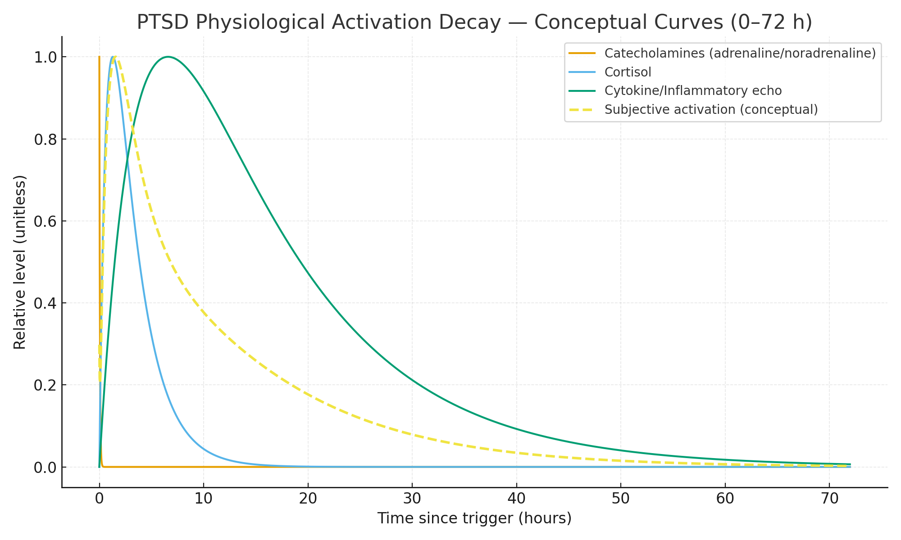

# ⚡ PTSD Is Not a Jump Scare — The Time Physics of the Body  
**First created:** 2025-10-21 | **Last updated:** 2026-08-12  
*Why trauma flashbacks last hours or days after seconds of stimulus.*

---

## 🧭 Orientation  

The body does not run on cinema timing.  
A flashback is not a jump scare — it’s a **biochemical storm** whose visible panic is only the start.  
Adrenaline and noradrenaline vanish from plasma within minutes, but their **effects echo through feedback loops** of cortisol, cytokines, and receptor sensitisation for hours or days.  

This node outlines the **rate-decay anatomy** of a PTSD flashback, translating molecular half-lives into lived duration.

---

## ⚙️ Mechanism Overview  

1. **Trigger phase (0–5 min)** — locus coeruleus discharges, catecholamine flood, heart rate spikes, visual field narrows.  
2. **Degradation phase (5–45 min)** — COMT and MAO enzymes clear adrenaline/noradrenaline, but downstream β-receptor signalling continues.  
3. **Hormonal tail (45–180 min)** — cortisol peaks; glucose and inflammation rise.  
4. **Inflammatory echo (3–24 h)** — immune cytokines sustain sympathetic tone and fatigue.  
5. **Neural sensitisation (1–3 days)** — altered gene transcription, sleep disruption, and memory reconsolidation loops.  

---

## 📈 Rate-Decay Graph (conceptual)

  
*Conceptual model showing rapid catecholamine spike, slower cortisol slope, and long cytokine tail over 72 h.*

---

## 🩸 System Notes  

- **Adrenaline half-life:** 2–3 min  
- **Noradrenaline half-life:** 1–2 min  
- **Cortisol half-life:** ≈ 60–90 min  
- **Cytokine signal persistence:** up to 24 h  
- **Behavioural sensitisation:** days  

PTSD extends the decay tail because feedback inhibition fails:  
- α₂-adrenergic receptors desensitised → poor shutdown of locus coeruleus  
- glucocorticoid receptor resistance → prolonged cortisol action  
- microglial priming → neuroinflammation  

---

## 🧩 Multifactorial Triggers — The Sensory Architecture of Memory  

PTSD triggers are rarely single cues.  
They’re **multifactorial collisions** of sensory data — smell, light, texture, tone, posture — that the body once learned to interpret as *imminent threat*.  

In ordinary memory, the hippocampus encodes experience as a **narrative sequence**: event → context → meaning.  
In trauma, the same circuit is flooded with catecholamines; the hippocampus goes offline while the **amygdala and brainstem** take over.  
The result is memory stored not as story, but as **signal fragments** — body maps, cranial-nerve imprints, flashes of smell or vibration.  

These fragments are easy to trip:  
- a certain **frequency of sound** can activate the vestibulocochlear branch (VIII) tied to a past blast;  
- a **smell** bypasses conscious processing via the olfactory bulb’s direct limbic route;  
- a **touch pattern or pressure** echoes the original tactile perimeter of danger.  

When such cues align, the brain’s predictive system assumes the threat has returned.  
What looks like a “random trigger” is actually a **perfect storm of matched sensory data** across multiple channels.  

> The trigger is not a reminder; it’s a **re-entry**.

---

## 🧠 Divergent Trajectories — Classical vs Complex Trauma  

Not every nervous system follows the textbook.  
The **DSM-5** and **ICD-11** define “PTSD” around a single catastrophic event and a cluster of re-experiencing, avoidance, and hyperarousal symptoms.  
But in real life, that’s the exception.  

Most survivors meet criteria for **Complex PTSD (C-PTSD)** — trauma repeated over time, often in childhood or coercive environments, where there was **no safe exit and no stable witness**.  
The biology shifts accordingly: the system never fully resets, so baseline cortisol, noradrenaline, and inflammatory tone stay elevated even between episodes.  

| Variable | Classical PTSD | Complex PTSD |
|-----------|----------------|--------------|
| **Event type** | Single, time-bounded | Repeated or prolonged |
| **Developmental stage** | Often adult | Often childhood/adolescence |
| **Dominant profile** | Flashbacks, nightmares, startle | Emotional dysregulation, relational distrust, chronic fatigue |
| **Neurobiological pattern** | Episodic hyperarousal | Sustained allostatic load |
| **Core treatment focus** | Desensitisation & re-exposure | Safety, attachment, long-term regulation |

Support in the first 6–12 weeks after trauma — or the lack of it — can permanently alter the system’s calibration.  
What gets coded as “resilience” is often just *social scaffolding at the right time*.  

When we talk about *shell shock*, *combat stress*, or *burnout*, we’re naming different eras’ metaphors for the same dysregulated physiology.  
Catecholamines, cortisol, cytokines, and disrupted circadian rhythms don’t care what the label is.  
The body keeps its own archive.  

And while first-line interventions like breathing, mindfulness, or journaling can help, **they presuppose a baseline of safety and interoceptive trust** that many complex-trauma survivors simply don’t yet have.  
Expecting immediate uptake of these tools is like offering running shoes to someone whose legs are still broken.  

> Recovery is not compliance.  
> It’s a long negotiation between a body that remembers and a world that keeps asking it to forget.

---

## 🎬 Narrative Compression — What the Screen Gets Wrong  

Cinema teaches us to expect trauma to resolve on cue.  
When the explosion stops, the hero exhales; when the enemy dies, the shaking ends.  
But that’s **storyboard time**, not body time.  

### Unrealistic depictions  
- **Jason Bourne** — repeated gunfire, amnesia, and chase sequences with instant recovery; physiologically impossible.  
- **American Sniper (2014)** — panic collapses into composure within seconds; omits hormonal and inflammatory tail.  
- **Black Hawk Down (2001)** — adrenaline shown as endurance fuel rather than corrosive agent.  

### Closer to realism (but still cinematic)  
- **The Hurt Locker (2008)** — post-mission dissociation hints at multi-day aftershock.  
- **Threads (1984)** — captures dull, lingering flattening after acute terror.  
- **Son of Saul (2015)** — conveys looping unreality, stuck between flashback and present.  

Even these remain **metaphors**, not equivalents.  
No camera can film the long half-life of cortisol or the immune echo that follows a flashback.  
The real version is quieter, slower, and harder to dramatise — an invisible half-life of fear.  

> **Caveat:**  
> These references illustrate representation gaps, not experiential authority.  
> The embodied reality of trauma is not reproducible through narrative compression.

---

## ⚠️ Clinical Gravity — Suicidal Risk in Stressor-Related Disorders  

PTSD and related stressor-spectrum diagnoses — including **Complex PTSD (C-PTSD)** and **Emotionally Unstable / Borderline Personality Disorder (EUPD)** — carry a **significantly elevated risk of suicide and premature mortality**.  
Epidemiological studies show lifetime suicide-attempt rates of **30–70 %** in EUPD, and completed-suicide rates many times the general population in both C-PTSD and chronic combat-related PTSD.  
Comorbidity with chronic pain, substance use, and medical illness amplifies this risk further.  

These disorders are often **under-detected or misclassified** in algorithmic mental-health triage systems.  
Automated “low-intensity” interventions — such as brief mindfulness modules, digital CBT apps, or first-aid-style scripts — may inadvertently **increase danger** if delivered without clinical containment or trust.  
For individuals whose nervous systems are already hyper-reactive and traumatically conditioned, being told to “self-soothe” without context can trigger further collapse or shame.  

> Algorithmic care without attunement can become a form of neglect.  

Recognising the **statistical gravity** of these conditions is not alarmism; it is realism.  
Suicidal ideation in trauma survivors is not always about wanting to die — often it reflects **desperation to stop an unending physiological storm**.  
Until that storm is stabilised through relational, embodied care, digital or first-line algorithms remain blunt instruments.  

The purpose of discussing physiology here is therefore not academic curiosity — it is **suicide prevention through comprehension**.  
Understanding the body’s timelines and triggers is a matter of survival.

---

## 🩺 The Art–Science of Care — Why Trauma Became a Subspeciality  

Trauma is not a niche topic. It became a **clinical subspeciality** because it demands **polymathic intelligence** — fluency in biology, narrative, ethics, and embodiment at once.  
No single discipline can hold it.  

A good trauma clinician — psychiatrist, physiotherapist, art therapist, occupational therapist alike — must work in the borderlands between **hard science and deep humanity**.  
Trauma is **systemic physiology, movement, symbol, and meaning** all at once.  

These disorders resist linear models.  
They cross diagnostic boundaries, including those long stigmatised such as emotionally unstable/borderline personality disorder, and they exist in far greater numbers than formal registries admit.  
They are among the largest silent drains on **quality-adjusted and disability-adjusted life years (QALY/DALY)** worldwide.  

Left unsupported, they fracture both people and economies.  
Supported well, they yield enormous social return — but only through **multi-modal teams**, long horizons, and creative intelligence that cannot be automated.  

Public health systems love **algorithmic prevention**: measure blood pressure, lower cholesterol, track KPIs.  
That works for **primary hypertension**, where uniform rules fit uniform mechanisms.  
But **trauma is secondary hypertension of the soul** — it arises from context, and each context is different.  
Treating everyone on a single algorithm misses the lesion.  

PTSD and its kin resist cure-by-protocol because they are **relational disorders of meaning and safety**.  
They can borrow tools from algorithms — scheduling, pattern detection — but depend on the **art of attunement**, the unquantifiable act of human witness.  

> Trauma care is not just treatment; it is translation between nervous systems.  
> The work is mathematical, but the math has feelings.

---

## 🌌 Constellations  

🐦‍🔥 🫀 🧠 — trauma physiology, embodied time, neuroendocrine feedback  

---

## ✨ Stardust  

ptsd, complex trauma, catecholamines, cortisol, cytokines, trauma physiology, memory encoding, sensory triggers, clinical art-science, public health, embodiment  

---

## 🏮 Footer  

*⚡ PTSD Is Not a Jump Scare — The Time Physics of the Body* is a living node of the **Polaris Protocol**.  
It documents how trauma converts seconds of stimulus into days of systemic echo, bridging neurochemistry and lived experience.  

> 📡 Cross-references:  
> - [🐦‍🔥 Trauma Psychology & Medical Misuse](../🐦‍🔥_Trauma_Psychology_Medical_Misuse/)  
> - [🐝 Body Politic](../🐝_Body_Politic/) — embodied responses and political metabolism  

*Survivor authorship is sovereign. Containment is never neutral.*  

_Last updated: 2026-08-12_
