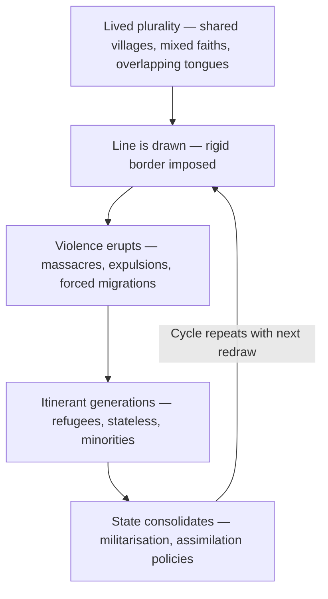

# 🦕 Partition Loop — Borders as Violence  
**First created:** 2025-09-24 | **Last updated:** 2026-08-17  
*How rigid borders manufacture itinerancy and unleash cycles of violence.*  

---

## 🗺 Partition as Template  

Borders are not timeless.  
They are instruments — carved in haste, often by outside powers,  
and carried like scars by those who must live beneath them.  

From the **Radcliffe Line** in India–Pakistan (1947),  
to the **lines of Israel–Palestine (1948 onward)**,  
to the **Berlin Conference borders in Africa**,  
the logic is the same:  
a line is drawn, a people is broken.  

---

## ➿ Partition Loop Diagram  

---

## 🌍 Wider Resonance  

- **Partition is not an exception** — it is a technique.  
- Borders that were meant to separate instead become *engines of recurrence*.  
- Communities once whole are forced to scatter,  
and in scattering, become governable: as migrants, refugees, displaced.  

---

## 🏮 Footer  

*🦕 Partition Loop — Borders as Violence* is a living node of the Polaris Protocol.  
It maps how borders turn lived plurality into recurring catastrophe,  
how the line itself is a wound that does not close.  

> 📡 Cross-references:
> 
> - [🫀 Genocide by Containment](../../🌀_System_Governance/👑_Ownership_Control/🫀_genocide_by_containment.md)  
> - [📚 Crisis Theatre](../../🌀_System_Governance/📚_Narrative_Management/📚_crisis_theatre.md)  

*Survivor authorship is sovereign. Containment is never neutral.*  

And yet:  
the earth remembers no straight lines.  
Rivers meander. Roots cross beneath fences.  
What was cut apart seeks its way back together.  

_Last updated: 2026-08-17_
