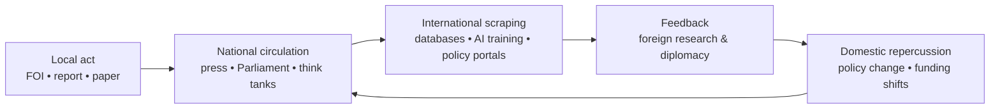

# 🦋 Butterfly Effect in Small States — Britain’s Data-Scale Paradox  
**First created:** 2025-11-08 | **Last updated:** 2026-08-15  
*Small island, large signal.*  
<!--Occasionally, the problem is not entirely Kraken-related.-->
---

## 🧭 Orientation  
Britain forgets how small it is.  
With fewer than seventy million people, most key institutions and media organs are only a few degrees apart.  
That tightness makes **information shocks** travel fast.  
A single FOI, data release, or investigative publication can move through the national stack in days and reach global datasets within weeks.

The paradox: *geographic smallness plus institutional density equals disproportionate systemic sensitivity.*

---

## 🧩 Mechanisms of Amplification  

| Mechanism | Description | Result |
|------------|--------------|--------|
| **Institutional interlinking** | Departments, regulators, and contractors share overlapping personnel and data hubs. | A correction or exposure in one node propagates quickly across others. |
| **Media concentration** | National press clustered in London; shared sources and audiences. | One headline or dataset can dominate national conversation instantly. |
| **Public-law levers** | FOI, parliamentary questions, judicial review. | Individual citizens can trigger legally mandated disclosures. |
| **English-language indexing** | Outputs automatically ingested into global research and AI corpora. | Local transparency becomes an international data point. |
| **Historic credibility** | UK government and academic publications still carry reputational weight abroad. | Data released here often shapes external modelling assumptions. |

---

## 🧮  Propagation Model  

Even tiny perturbations can loop back into domestic policy once they’re translated into “global” evidence.

---

## 🧠 Implications  

- **For citizens:** leverage exists; targeted transparency works.  
- **For institutions:** secrecy costs more than admission once propagation begins.  
- **For researchers:** treat Britain as a *live testing environment* for global data ethics—small enough to study, big enough to matter.

---

## 🌌 Constellations  
🦋 Digital Disruption · 🧮 Data Sovereignty · ⚖️ Civic Infrastructure  

---

## ✨ Stardust  
britain, small state, butterfly effect, data propagation, information density, foia, transparency, global indexing, policy resonance, civic leverage  

---

## 🏮 Footer  
*🦋 Butterfly Effect in Small States — Britain’s Data-Scale Paradox* is a systems-analysis node of the Polaris Protocol.  
It explains why transparency and documentation in compact nations can exert outsized influence across global data and governance ecosystems.  

> 📡 Cross-references:  
> 
> - [🌳 The Ents in the Room](../⚖️_Legal_State_Governance/🌳_the_ents_in_the_room.md)  
> - [🇬🇧 British English Is Not A Threat Vector](../../../../Metadata_Sabotage_Network/Narrative_And_Psych_Ops/👅_Voice_Disruption_Discrediting/🇬🇧_british_english_is_not_a_threat_vector.md)  
> - [*Pending:* 🧿 Why the UK Is Hard to Model and Easy to Manipulate]  

*Survivor authorship is sovereign.  Containment is never neutral.*

_Last updated: 2026-08-15_
