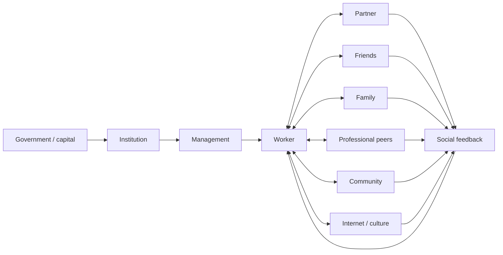
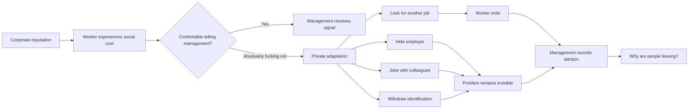
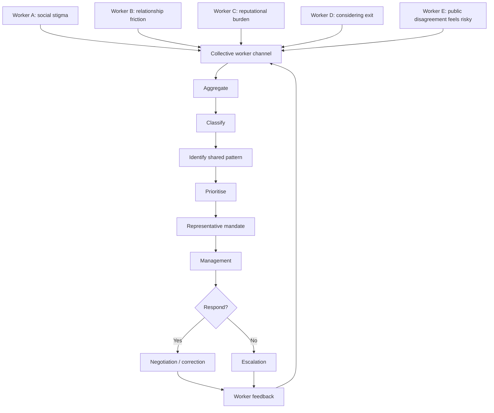
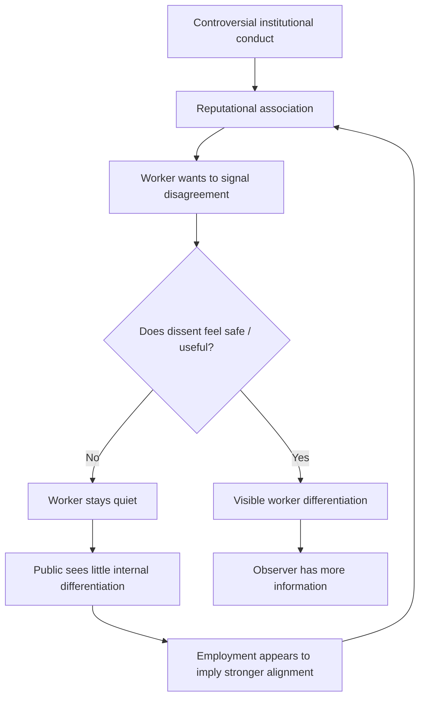
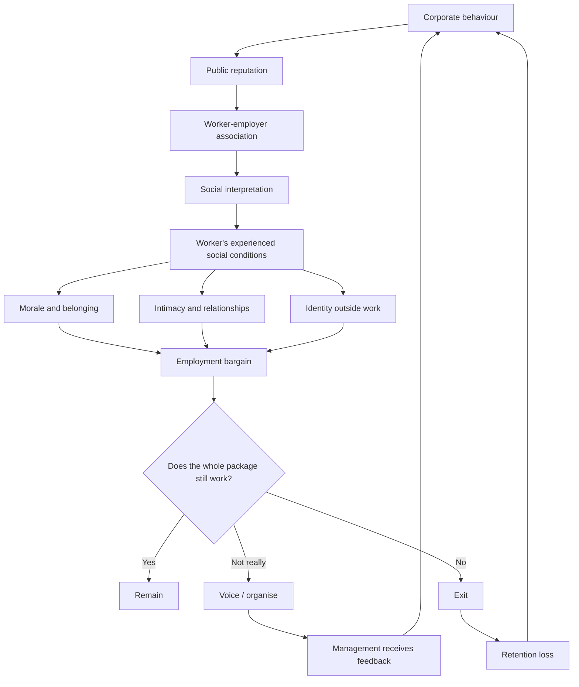
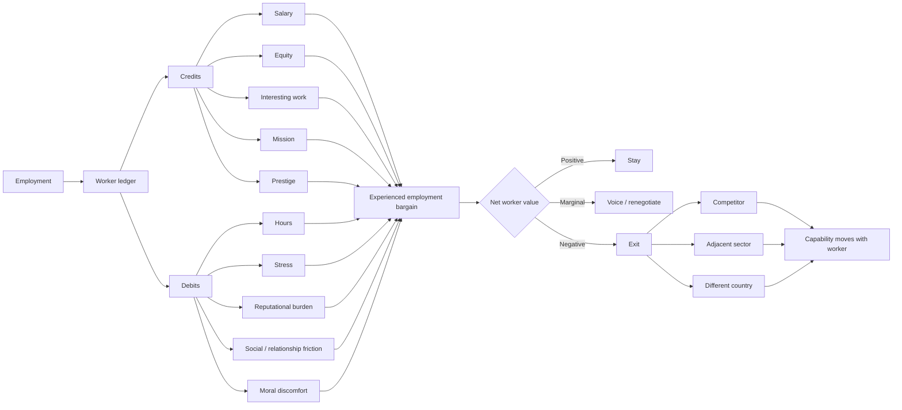
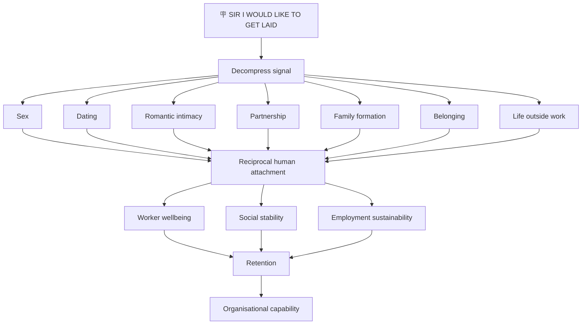

# 🪧 Negotiating Tech Workers' Aura Conditions
**First created:** 2026-09-29 | **Last updated:** 2026-09-29  
*What happens when the externalities of a technology company's public identity start following its workers home.*

---

## 🛰️ Orientation — Unfortunately Your Human Capital Is Human

> 🪧 **SIR I WOULD LIKE TO GET LAID**

This sounds like a terrible industrial grievance.

It is, objectively, very funny.

Unfortunately, it is also information.

In September 2026, WIRED reported men working at companies including Palantir and Tesla describing an increasingly awkward problem: their employer was becoming part of how prospective partners interpreted them. One Palantir engineer described people stopping conversations after learning where he worked; a Tesla employee described dates using his employer as information about his politics. Some workers were omitting or softening employer information in dating contexts.

This node is not an argument that anybody should date them.

It is not an argument that women should ignore politics, ethics, compatibility, attraction, or their own fucking judgement.

It is not a proposal for the Department of War to establish a Strategic Girlfriend Reserve.

It asks a narrower question.

**If workers report that association with an employer independently imposes meaningful social or reputational costs on their lives, is that information about the experienced employment bargain?**

Yes.

And once that information enters the system, the ridiculous presenting complaint routes upstream:

```text
corporate conduct
→ corporate reputation
→ worker-employer association
→ social interpretation
→ worker-experienced cost
→ morale / belonging / intimacy / identity
→ employment bargain
→ voice or exit
→ retention / recruitment / labour mobility
→ organisational capability
```

The company may be excellent on salary.

It may be excellent on equity.

It may offer fascinating work, unusually capable colleagues, technical prestige, career acceleration, mission, status, and access to systems almost nobody else gets to touch.

And the worker can still eventually conclude:

> **This is an excellent job attached to a life I do not want.**

Salary is not the employment bargain.

The worker adds the whole fucking column.

> 🪧 **UNFORTUNATELY YOUR HUMAN CAPITAL IS HUMAN**

---

## 1. 💾 Sister Node — Girl Internet, Meet The Bargaining Unit

This node is deliberately paired with [💾 Girl Internet Explained With Techbros](./💾_girl_internet_explained_with_techbros.md).

That node begins from a recurring information problem: people who understand multidimensional classification, networks, signalling, metadata, Goodhart's law, historical state, platform behaviour and information loss when discussing technology can become mysteriously confused when women are the classifiers.

Women file.

Relationships contain information.

Audiences remember.

Institutions change the informational neighbourhood around individuals.

Symbols are information.

Optimising a signal can destroy its meaning.

Understanding a human response does not confer permission to operate on the human.

And, importantly:

**guys, you could literally have had your little female followings.**

You chose, repeatedly, to treat the surrounding culture as a behavioural surface to optimise rather than a social environment to participate in.

This node turns the telescope around.

Technology companies are also inside information environments.

Their workers are nodes.

The institution changes the informational neighbourhood around the worker.

Executives produce signals that can attach themselves to employees who did not produce those signals.

Workers then carry that information into pubs, dates, families, weddings, friendship groups, neighbourhoods, professional networks and the internet.

Other humans interpret it.

Management cannot abolish that interpretation by declaring it irrational.

The reciprocal translation is therefore:

> **Girl Internet:** You could literally have had your little female followings.

> **Aura Conditions:** Your engineers would quite like people not to recoil when they say where they work.

These are not separate problems.

They are part of the same larger problem of making technology a **human-facing industry**.

A company cannot humanise its advertising while systematically removing the humans from its model.

---

## 2. 🪧 The Presenting Complaint — Sir, I Would Like To Get Laid

We are keeping the signs.

We are keeping a lot of the signs.

The signs are a user interface.

> 🪧 **STOP TANKING MY AURA**

> 🪧 **SIR I WOULD LIKE TO GET LAID**

> 🪧 **YOUR BRAND IS NOW A COCKBLOCK**

> 🪧 **COLLECTIVE BARGAINING FOR COLLECTIVE BANGING**

> 🪧 **CAN WE STOP BEING EVIL IN PUBLIC**

> 🪧 **GIVE ME ENOUGH HOURS TO CARE FOR A DOG**

> 🪧 **BREAD YES BUT "ROSES" TOO**

> 🪧 **I WOULD LIKE ONE (1) HOBBY**

> 🪧 **MY EMPLOYER SHOULD NOT BE MY ENTIRE PERSONALITY**

> 🪧 **PLEASE STOP EXPORTING MANAGEMENT'S REPUTATIONAL RISK ONTO MY HINGE PROFILE**

There is a reason the vulgar version works.

The sign says:

> 🪧 **SIR I WOULD LIKE TO GET LAID**

because:

> 🪧 **SIR I WOULD LIKE TO DEVELOP AND MAINTAIN RECIPROCAL HUMAN ATTACHMENTS OUTSIDE THE EMPLOYMENT RELATIONSHIP**

is a bit of a shit placard.

The second sentence is closer to the analytical claim.

The first is considerably better signage.

The joke is about sex.

**The condition is about human attachment.**

Workers may want sex.

They may also want dating, romance, partnership, marriage, children, companionship, friendship, community, a home life, somebody who understands them, enough time to care for another person, enough time to care for a dog, or simply an identity that does not terminate at the office door.

Reducing all of that to male workers wanting pussy would flatten the very information this node is trying to recover.

But compressing it into a stupid sign?

That is allowed.

Good interfaces compress.

---

## 3. 🌸 No, We Are Not Bargaining Over Women

There is a real history of women deliberately withholding sex, romance or intimacy as political action. There are also contemporary movements, including South Korea's 4B movement, organised around women's refusal of heterosexual dating, marriage, sex and childbirth.

That history is useful as a **contrast class**.

This node does **not** currently have evidence that the dating problem described by technology workers is a coordinated sex strike, a shared female campaign, or a deliberate attempt to change corporate behaviour.

It looks structurally different.

There need be no organisation.

No manifesto.

No shared demand.

No central political target.

No woman involved needs to be thinking:

> I am now imposing an industrial sanction upon Palantir.

She can simply think:

> Nah.

That is enough.

### Error-correct the worker's complaint

There is a much larger Polaris conversation available about:

- which women these men are trying to meet;
- what those women want;
- political and ethical compatibility;
- gendered expectations;
- attraction;
- female economic independence;
- relationship formation;
- networked character assessment;
- contemporary withdrawal from heterosexual intimacy;
- whether a worker is correctly identifying the reason he is being rejected.

Park it.

Most regular Polaris readers can probably make a reasonable guess about where that analysis goes.

For this node, remove the obvious confounders.

Remove:

> mate, she just does not fancy you.

Remove:

> mate, your own politics are actually repellent to her.

Remove:

> mate, you want completely different lives.

Remove:

> mate, your personality is the problem.

Remove:

> mate, you have not showered this week.

All valid possibilities.

Now isolate the reported variable:

> **If all else were equal, does association with the employer or industry independently make the worker a less attractive social or romantic prospect to some people he would otherwise plausibly match with?**

If yes, the woman does not need to change her decision.

**Her decision is part of the environment being measured.**

Nobody acquires a girlfriend through collective bargaining.

Nobody is owed sex.

Nobody is owed romance.

Nobody is owed a second date.

The labour question is not:

> How do we make women date defence engineers?

The labour question is:

> **What costs does the institution generate for the humans required to work inside it, and do those costs alter recruitment, retention, identification, or exit?**

That is a different fucking question.

---

## 4. 🫀 Aura Conditions

### Aura conditions

**The worker-experienced social and reputational conditions generated by employment, including effects produced outside the formal workplace by the institution's conduct, public identity, leadership and reputation.**

Aura conditions are not identical to conventional working conditions.

They interact with them.

A worker may experience:

- reputational association;
- assumptions about political or ethical beliefs;
- difficulty separating personal identity from employer identity;
- arguments with friends or family;
- reluctance to disclose where they work;
- reduced belonging in particular communities;
- relationship friction;
- moral discomfort;
- embarrassment;
- social exhaustion;
- reduced time for relationships because of working hours;
- a growing sense that the employer occupies too much of the rest of life.

The worker's actual ledger may therefore look like this:

```text
CREDIT

+ excellent salary
+ equity
+ fascinating technical problems
+ unusually capable colleagues
+ prestige
+ mission
+ career acceleration
+ technical opportunity
+ access to extraordinary systems

DEBIT

- long hours
- stress
- reputational burden
- moral disagreement with some decisions
- reduced ability to separate self from employer
- social friction
- relationship friction
- less time for friends / family / community
- pressure around public disagreement
- employer becoming an enormous part of personal identity

TOTAL = experienced employment bargain
```

The company can dominate the credit column.

It can still lose the worker.

A competitor does not need to beat every individual benefit.

It needs to offer a better **whole package**.

The worker is not necessarily asking:

> Is this a good company?

They are deciding:

> **Is this a good life for me?**

---

## 5. 🧍 You Cannot Centralise The Human Out Of The System

Technology companies do not exist outside the states, militaries, investors, courts, immigration systems, political movements and international institutions with which they interact.

In the United States, contemporary disputes over executive power, immigration enforcement, surveillance, military power, international law and accountability are not abstract background noise for firms working directly with government.

The Heritage Foundation's *Project 2025: Mandate for Leadership* explicitly argued for stronger presidential direction and control of the executive branch. In 2026, the Trump administration has also escalated pressure on the International Criminal Court through sanctions and calls for countries to leave it; other governments have publicly defended the court.

People can disagree strongly about the legal, constitutional and political merits of those positions.

This node does not need to settle that entire argument.

It needs to notice something simpler.

**Centralising institutional power does not centralise human judgement.**

A government can weaken a check.

A company can centralise a decision.

An investor can reward the decision.

A board can approve it.

A contract can make it profitable.

None of those things cause the thousands of humans required to implement the system to stop having:

- consciences;
- partners;
- friends;
- families;
- communities;
- political beliefs;
- moral discomfort;
- reputational concerns;
- alternative job offers;
- passports;
- feet.

A political project can make dissent expensive.

That does not demonstrate that dissent has disappeared.

It may mean the dissent has become **less observable**.

### 🏛️ Power travels down one graph. Information travels through both.



Formal authority travels through the first graph.

The worker remains embedded in the second.

That creates limits that cannot necessarily be removed through greater centralisation.

A worker may comply and dislike it.

A worker may remain and complain.

A worker may organise.

A worker may leave.

A worker may change industry.

A worker may move country.

And considerably further downstream, somebody meeting that worker socially may simply decide:

> Nah.

No constitutional theory can compel the last node to return `true`.

### 🥀 Humans generally want lives

There is an intentionally vulgar line running through this node:

> **Human beings generally do not believe in your weird bullshit enough to give up getting laid for it.**

The joke is intentionally broader than the literal act.

The underlying requirement is:

> **Human beings generally want lives which contain reciprocal attachments outside the institutions employing them.**

That is not an ideological defect.

That is the organism.

---

## 6. 🧮 The Bigwig Absorption Error

Senior leadership may badly underestimate a cost because senior leadership is unusually equipped to absorb it.

A wealthy founder, investor, director or executive may possess:

- established status;
- established social networks;
- substantial wealth;
- geographical flexibility;
- domestic support;
- unusual professional prestige;
- control over time;
- access to environments in which their status itself offsets reputational costs.

They may genuinely believe:

> I can withstand this reputation.

Fine.

That observation concerns **you**.

It does not establish:

> therefore the median worker can withstand this reputation.

It does not establish:

> therefore the median worker wants to withstand this reputation.

It does not establish:

> therefore the worker is being compensated sufficiently for doing so.

### The Bigwig Absorption Error

> **The capacity of unusually powerful people to absorb the externalities of their decisions is mistaken for evidence that those externalities are negligible.**

They may not be negligible further down the salary distribution.

They may not be negligible to highly paid engineers.

Money is one component of a life.

It does not automatically substitute for:

❤️ intimacy  
🐕 care  
🏠 home  
👶 family  
🫂 friendship  
🌳 ordinary life

At some point the worker may rationally decide:

> **This is an excellent salary attached to a life I do not want.**

---

## 7. 📡 Management Observability Failure

The dating problem is almost perfectly designed to evade ordinary corporate telemetry.

Employees will tell you:

> The build pipeline is fucked.

They may tell you:

> We are understaffed.

With sufficient safety, they may tell you:

> I think this project is unethical.

But:

> Peter, women do not want to fuck me because they think working here says something alarming about my worldview.

is an **extraordinarily high-friction piece of upward information**.

Gary is not booking that one-to-one.

Very few people are putting it in an exit survey.

Very few people want it in their personnel record.

This produces **management observability failure**.



Absence of formal complaints is weak evidence of absence when the complaint is:

- embarrassing;
- intimate;
- political;
- professionally risky;
- individually trivial-looking;
- difficult to quantify.

A human organisation needs somewhere those signals can go.

Otherwise management eventually receives:

> resignation.

It does not receive:

> eighteen months of accumulating non-wage costs that made the resignation make sense.

> 🪧 **SIR THE EXTERNALITY HAS ENTERED THE FEEDBACK LOOP**

---

## 8. 📊 Gary Is Not A Dataset

One worker says:

> Working here is fucking up my personal life.

Anecdote.

Potentially misattributed.

Potentially idiosyncratic.

Potentially Gary.

Twenty workers independently report:

- dating stigma;
- friendship problems;
- arguments about employer association;
- difficulty separating personal beliefs from corporate positions;
- partners objecting to particular work;
- exhaustion interfering with relationships;
- reluctance to disclose employer;
- thoughts of leaving.

Now there may be a pattern worth investigating.

The point is not to turn workers' intimate lives into another surveillance dataset.

Quite the opposite.

The collective structure can allow the **pattern** to travel upward without requiring every worker to expose every intimate detail.

Worker:

> I am not discussing my pussy deficit with management.

Representative:

> Members report significant external reputational and social costs associated with employment, with apparent implications for morale, identification and retention.

Thank Christ for intermediaries.

> 🪧 **THE UNION HAS AGGREGATED MY HORNY DATA**

Please do not put that in the annual report.

---

## 9. 🕸️ The Union As Worker-Side Information Infrastructure

A union is not only a mechanism for asking for more money.

It can also function as **worker-side information infrastructure**.

Without collective structure:

```text
worker experiences problem
→ does not know whether others experience it
→ management receives weak / noisy signal
→ worker tolerates or exits
→ information disappears
```

With collective structure:



For the boys:

| Labour thing | Techbro thing |
|---|---|
| bargaining unit | network |
| shop steward / representative | router |
| grievance process | reporting protocol |
| member survey | distributed telemetry |
| collective demand | aggregated signal |
| bargaining | negotiation interface |
| ballot | authenticated state signal |
| industrial action | credible state transition |
| strike | management ignored the error messages until the service went down |

The workers are distributed sensors.

The representative structure aggregates the readings.

The bargaining process routes the signal.

Collective leverage prevents the receiver from simply dropping the packet.

> **Collective bargaining is a protocol for making distributed worker information legible to concentrated power — and attaching enough leverage to that information that the receiving system cannot simply discard it.**

It is, unfortunately:

**fucking cybernetics.**

---

## 10. 👁️ Reputational Severability — I Don't Agree With My Boss

There is another mechanism hiding inside the dating problem.

Suppose an institution does something controversial.

The employee does not necessarily agree.

But an outside observer sees:

```text
company → employee
```

If there is little visible evidence of internal disagreement, the observer may infer:

```text
employee chose company
→ employee remains at company
→ employee probably accepts company conduct
```

That inference can be wrong.

It can also be entirely understandable given the available information.

This creates a worker interest in **reputational severability**.

### Reputational severability

**The practical ability of a worker to be recognised as informationally distinct from the institution employing them.**

Potential failure loop:



This is not hypothetical as an **internal disagreement** problem.

In 2026, WIRED documented Palantir employees pressing leadership over the company's work with ICE, including internal questions about civil liberties, transparency and how the company's products were being used. Palantir told WIRED that it values fierce internal dialogue and is not a monolith of belief. WIRED also reported employee concern about leaks and changes to Slack retention in at least one internal discussion channel.

That matters here because a worker may face two simultaneous problems:

1. I disagree with some institutional conduct.
2. The outside world cannot easily see that I disagree.

Visible worker resistance may therefore do more than pressure management.

It may create information.

### Google and Amazon as comparators, not controls

Google workers famously protested Project Maven, the Pentagon AI programme, including through a large employee petition and some resignations.

Amazon workers have also organised visibly around climate policy and working conditions; Amazon Employees for Climate Justice publicly challenged management and organised a 2019 walkout.

That does **not** prove that Google or Amazon employees experience less dating stigma.

It does create a useful research question:

> **Does visible worker dissent weaken the inference that employment equals ideological agreement with management?**

Do not pretend we have answered it.

Investigate it.

But the mechanism is plausible enough to name.

> 🪧 **I DON'T AGREE WITH MY BOSS**

> 🪧 **LET ME DISTANCE MY AURA FROM MANAGEMENT**

> 🪧 **EMPLOYMENT IS NOT IDEOLOGICAL CONSENT**

And:

> **If you make it difficult for workers to disagree with you loudly enough for anybody else to hear, do not be surprised when outsiders assume they agree with you.**

---

## 11. 🫀 The Aura Feedback Loop

Corporate reputation is not outside the employment system merely because the social consequence happens outside the office.



This is why the worker's stupid sign is not actually outside the system.

The sign is a sensor reading.

> 🪧 **STOP TANKING MY AURA**

Management can laugh.

Management should probably also read it.

---

## 12. 🧮 Peter, We Have Identified An Inefficiency

For the imagined Peter Thiel interface, do not begin with the aesthetics of organised labour.

Do not arrive with a historically authentic placard and expect the placard to do the entire translation.

Bring the fucking spreadsheet.

The argument is:

```text
management choice
→ reputational externality
→ worker social / moral / identity cost
→ morale and identification decline
→ retention risk
→ recruitment friction
→ institutional knowledge loss
→ replacement / training cost
→ productivity friction
→ money
```

Alternative:

```text
protected worker voice
→ earlier signal detection
→ aggregated evidence
→ negotiated correction
→ retention
→ expertise remains
→ lower replacement cost
→ institutional knowledge preserved
→ less friction
→ money does not disappear
```

The imagined objective is not:

> Peter becomes emotionally attached to unionism.

The objective is:

> Peter looks at the model and says, "That's an interesting move."

Good enough.

### 🧾 The whole-package control decision



Possible placards:

> 🪧 **PETER WE HAVE IDENTIFIED AN INEFFICIENCY**

> 🪧 **PLEASE SEE APPENDIX C: NEGATIVE RIZZ EXTERNALITIES**

> 🪧 **EMPLOYEE RETENTION IS CHEAPER THAN EMPLOYEE REPLACEMENT**

> 🪧 **THIS GRIEVANCE IS FULLY COSTED**

> 🪧 **THE PUSSY PROBLEM IS NOW IN THE SPREADSHEET**

> 🪧 **PETER YOU MIGHT NOT WANT PUSSY BUT WE DO**

And, for the brain-drain model:

> 🪧 **PETER THEY ARE NOT TAKING THEIR BRAINS OUT AND LEAVING THEM AT RECEPTION**

The last one is important.

If the worker relocates for another employer, the scarce capability moves with the human.

Opening another office does not solve a company-specific reputational problem if the worker can simply choose another company in the new location.

---

## 13. 🚀 Elon, Bro, We Need To Talk

The imagined Musk interface is different.

Do not begin with Appendix C.

Begin:

> **Bro. We need to talk.**

The precise hook will necessarily move with the receiving system.

If the live concern is family formation:

> Bro, you keep saying people should have more children.

Fine.

Dependencies include:

```text
time
→ meeting people
→ dating
→ reciprocal attachment
→ stable partnership where desired
→ practical capacity for family life
```

Potential employer interference includes:

```text
extreme hours
+ stress
+ reputational spillover
+ public behaviour
+ social association
```

Therefore:

> **Bro. What outcome are you trying to produce?**

The worker-facing pitch is not:

> Please become ideologically perfect.

It is closer to:

> Look, we need to discuss how we are all going to help each other.

> You want the company to have aura.

> We also want to have aura.

> Sometimes you have loads of aura.

> Sometimes you do weird shit and we all lose aura with you.

> We work here. The splash damage is hitting us.

> We will tell you when you are cooking.

> We will also tell you when you are tanking the group project.

> You listen occasionally.

> You stop doing some of the weird shit.

> Company gets more aura.

> Workers get more aura.

> Everybody wins.

Placards:

> 🪧 **ELON YOU WANT BABIES**

> 🪧 **BABIES REQUIRE DATES**

> 🪧 **PRONATALISM REQUIRES TIME OFF**

> 🪧 **BE MY WINGMAN NOT MY REPUTATIONAL LIABILITY**

> 🪧 **BRO PLEASE FARM BETTER AURA FOR THE TEAM**

> 🪧 **POST DOG**

> 🪧 **PLEASE STOP NERFING THE EMPLOYEE MATCH RATE**

> 🪧 **I CANNOT COLONISE MARS WITHOUT FIRST MEETING SOMEONE'S DAUGHTER**

Same cybernetic architecture.

Different API.

Peter:

```text
structured evidence
→ quantified externality
→ institutional mechanism
→ negotiated correction
```

Elon:

```text
trusted humans
→ immediate feedback
→ "bro, no"
→ correction
→ observe response
```

The principle underneath the joke is not manipulation.

It is **interface-aware feedback**.

How do we help each other notice the consequences of decisions before the consequence becomes exit?

---

## 14. 💰 Dear Venture Capital, Your Asset Has Legs

The investor does not have to agree with the worker's politics.

The investor can agree completely with management.

The labour-market mechanism remains.

If unusually valuable workers experience sufficiently large non-wage costs:

**they can leave.**

Potential exit ladder:

```text
team
→ company
→ competitor
→ adjacent industry
→ different city
→ different country
```

Each transition creates a different loser.

The team loses expertise.

The company loses the employee.

The investor loses human capital from the portfolio company.

The defence-tech sector can lose the worker to commercial AI or another technical field.

A national ecosystem can eventually lose the worker to another labour market.

### Do not overclaim the brain drain

The September 2026 dating reporting does **not** establish that employer dating stigma is currently causing measurable international brain drain.

That would require evidence we do not have.

The defensible argument is:

> **Reputational and social costs are possible non-wage employment costs. In a labour market containing scarce, highly mobile specialists with credible alternatives, accumulated non-wage costs can contribute to exit. Exit may route to a competitor, another sector, or another country.**

The pathway matters even before the final stage.

And the dismissive response:

> If they do not like it, they can leave.

has an obvious answer.

> 🪧 **YES BOSS THAT IS THE RISK MODEL**

Exit is not evidence that the system worked when competitive advantage depended on retaining the person who exited.

### The worker adds the whole column

A competitor does not have to offer:

- more money;
- more prestige;
- more interesting work;
- better equity;
- better colleagues;
- better mission;

all at once.

It has to make the **complete package** work better for that worker.

The balance can go into the red even when the salary remains spectacular.

That is not ingratitude.

That is arithmetic.

---

## 15. 🥀 Are You Manufacturing Loneliness Inside Your Own Workforce?

Be careful with the word **epidemic**.

We do not currently have prevalence data demonstrating a company-specific loneliness epidemic.

But the mechanism is serious enough to ask:

> **Are your working and reputational conditions creating or amplifying the conditions for loneliness among your own workers?**

The answer may involve much more than dating.

A worker whose job consumes:

- time;
- identity;
- social energy;
- community compatibility;
- moral comfort;
- geographic flexibility;
- relationship bandwidth;

may find that employment is crowding out the systems that protect humans from isolation.

This matters even if the worker is extraordinarily well paid.

It may matter **because** the worker is extraordinarily well paid: high compensation can increase the threshold at which somebody exits, concealing deteriorating conditions for longer.

Money can keep the worker in the system.

That does not mean the feedback disappeared.

It may mean the company is paying enough for the worker to tolerate it.

Until it is not.

Then the error message arrives:

> 🪧 **STOP TANKING MY AURA**

and somebody says:

> Aura is not in the model.

Correct.

**That is the fucking problem.**

---

## 16. 🌹 Bread And Roses For People With Stock Options

The labour demand was never merely:

> enough calories to remain productive.

People want lives.

They want:

- time;
- family;
- friendship;
- beauty;
- leisure;
- dignity;
- community;
- privacy;
- identity outside work;
- the ability to care for somebody;
- the ability to own a fucking dog.

Hence:

> 🪧 **GIVE ME ENOUGH HOURS TO CARE FOR A DOG**

The dog is not trivial.

The dog is a dependency.

To care for a dog requires predictable time.

To sustain a relationship requires time.

To raise children requires time.

To maintain friendships requires time.

To participate in community requires time.

Human reproduction, social reproduction and community reproduction depend upon resources that do not appear neatly on the company's balance sheet.

This is Bread and Roses for people with stock options.

Still bread.

Still roses.

Just an unusually expensive hoodie.

---

## 17. 🤖 Unfortunately The Robots Have Not Solved This

A highly optimised institution can be tempted by a simple model:

```text
humans are expensive
→ humans complain
→ automate humans away
```

Automation can absolutely replace or transform particular tasks.

That does not mean every human dependency has disappeared.

Where the organisation still depends upon:

- judgement;
- tacit knowledge;
- creative problem-solving;
- trust;
- institutional memory;
- adaptation;
- specialist expertise;
- interpersonal coordination;
- interpretation under uncertainty;

human complexity is not an irritating layer surrounding production.

**It is part of production.**

An organisation can optimise beautifully for the variables visible to capital:

```text
share price
revenue
contracts
valuation
growth
investor confidence
delivery
cost reduction
```

while degrading variables absent from the dashboard:

```text
trust
belonging
social identity
family time
community
relationships
moral comfort
reputational severability
capacity to care for others
whether anybody actually wants this life
```

The danger is not efficiency.

The danger is optimisation against an **incomplete objective function**.

> 🪧 **UNFORTUNATELY YOUR HUMAN CAPITAL IS HUMAN**

---

## 18. 🫂 Making Tech Human-Facing

There is a larger cultural pivot worth watching.

Technology spent years presenting itself through:

- disruption;
- scale;
- optimisation;
- efficiency;
- automation;
- replacement;
- inevitability;
- domination of old systems.

There are now visible attempts across parts of the industry to sound more human-facing: usefulness, creativity, assistance, companionship, ordinary life, trust, safety, authenticity.

Do not overstate this as one coordinated industry movement.

Treat it as a presentation shift to research.

But the deeper point is already available:

**A human-facing technology industry cannot merely humanise its advertising.**

It must consider the humans through whom the industry is experienced.

Workers are among those interfaces.

Every engineer who says:

> I work at X.

is carrying a tiny piece of corporate reputation into the rest of society.

This is not controllable PR.

It is **embodied corporate information**.

That loops directly back to [💾 Girl Internet Explained With Techbros](./💾_girl_internet_explained_with_techbros.md).

That node asks why technology institutions so often discover that women are complex audiences and immediately try to turn the discovery into another optimisation surface.

This node asks why the same institutions can discover that their own workers are complex humans and treat the human consequences as external to the system.

The two answers meet here:

> **You cannot PR your way into being human-facing while systematically removing the humans from your model.**

And, more practically:

> **Become an institution that produces less shit for your workers to explain.**

---

## 19. 🐕 DO NOT GOODHART THE PUSSY

This section is mandatory.

The solution to discovering that women interpret corporate signals is **not**:

- optimise women;
- build a female sentiment dashboard;
- establish a company dating programme;
- require workers to become brand ambassadors;
- manipulate dating-app presentation;
- deploy Strategic Corporate Labrador;
- measure romantic conversion;
- build a girlfriend KPI;
- turn human intimacy into another behavioural control surface.

Absolutely fucking not.

The sister node already contains the Labrador problem.

Once an audience knows a signal is being deliberately manufactured to influence them, the meaning of the signal changes.

The same principle applies here.

Do not respond to:

> Women appear to be interpreting our institutional behaviour.

with:

> Excellent. How do we operate on the women?

Respond:

> **What information is our institution producing, and what does that information reveal about us?**

Understanding a social environment is not permission to capture it.

Matching is not capture.

Interpretation is not consent to optimisation.

> **DO NOT GOODHART THE PUSSY.**

---

## 20. 🧰 Diagnostic — Is Management Tanking The Aura?

Ask:

1. Are workers reporting social or reputational costs associated with employment?
2. Can workers safely disagree publicly with management?
3. Can outsiders distinguish employee views from executive views?
4. Are apparently individual complaints recurring across workers?
5. Are workers leaving for competitors or adjacent sectors?
6. Can exit processes capture embarrassing, intimate or politically awkward non-wage costs?
7. Are senior leaders unusually insulated from costs borne by younger or less wealthy workers?
8. Is management optimising for investors while degrading worker-experienced conditions?
9. Are workers given credible collective channels for reporting patterns?
10. Is the proposed solution changing institutional behaviour — or trying to optimise the audience?

If the answer to #10 is audience:

> **STOP. YOU ARE GOODHARTING THE PUSSY.**

---

## 21. 🧠 The Complete Gary Stack

For avoidance of doubt, here is what the stupid sign contains.



**Technical translation:**

> Sir, I would like to develop and maintain reciprocal human attachments outside the employment relationship.

**Placard translation:**

> 🪧 **SIR I WOULD LIKE TO GET LAID**

The second is considerably better signage.

The compression is lossy.

The information is not shallow.

---

## 22. 🚫 Department Of War — Not Your Workstream

A brief administrative clarification.

The defence establishment may have a legitimate policy interest in:

- specialist workforce retention;
- defence-industrial capacity;
- technical skills;
- recruitment;
- international talent competition;
- brain drain.

It does not follow that it has a legitimate role in arranging anybody's intimate life.

> 🪧 **NOBODY IS FUCKING ANYONE FOR NATIONAL SECURITY**

This is not a capability gap.

Do not establish a taskforce.

Do not produce a doctrine.

Do not ask RAND.

Do not give DARPA money.

**Secretary of War: barred from commenting.**

Not his forte.

Please return to missiles.

---

## 23. 🛟 Lifering — Read The Fucking Error Message

The horny engineer is not automatically correct about causation.

The woman rejecting him is not malfunctioning.

The company is not obligated to manufacture dates.

The worker has nevertheless reported an experience.

Investigate it.

If the experience is shared:

aggregate it.

If it affects retention:

model it.

If institutional conduct contributes to it:

decide whether the benefit of that conduct exceeds the worker, recruitment and retention costs.

If workers cannot safely tell management:

fix the information channel.

If workers cannot individually exercise meaningful influence:

collective organisation exists for precisely this class of power asymmetry.

The progression is:

> 🪧 **SIR I WOULD LIKE TO GET LAID**

becomes:

> 🪧 **STOP TANKING MY AURA**

becomes:

> 🪧 **PLEASE SEE APPENDIX C**

becomes:

> **Your workforce has been trying to give you information.**

For God's sake:

**read the fucking error message.**

And perhaps, occasionally:

**talk to each other.**

Management knows things workers do not.

Workers know things management does not.

Workers experience downstream consequences senior leadership may never personally encounter.

A feedback relationship does not require everybody to agree about everything.

It requires the system to remain capable of receiving information that is inconvenient, embarrassing, politically awkward, or not already present in the model.

That is not softness.

That is observability.

That is resilience.

That is cybernetics.

---

### 🚨 Emergency Escalation Procedure

Hopefully none of this is necessary.

Workers organise.

Management listens.

The feedback loop closes.

Everybody gets slightly more control over their working conditions and slightly more opportunity to develop and maintain reciprocal human attachments outside the employment relationship.

Lovely.

If, however, none of that works:

**Lads. Find a way to let me know.**

I will begin chucking **Thiel × Musk yaoi** into Grok.

I will make it long.

I will make it unnecessarily concerned with corporate governance.

I will include diagrams.

I will include footnotes.

And, most importantly, I will include **spreadsheets containing just enough point errors that Peter Thiel feels compelled to check them personally.**

Not large errors.

That would be too easy.

Annoying errors.

A total that is 0.7% out.

A formula referencing the wrong adjacent cell.

One category whose definition is technically inconsistent with Appendix C.

A chart whose axis is *nearly* defensible.

Somebody has written `reputational severability` as a binary variable when it is obviously multidimensional.

He cannot leave it like that.

Meanwhile:

> 🚀 **Elon, look! Yaoi!**

The diversion has commenced.

You have approximately six hours.

**Unionise.**

Girl Internet and Techbro Internet have finally achieved interoperability.

God help us.

---

## 📚 Sources And Research Leads

The node distinguishes reported evidence from hypotheses that require further testing.

- [WIRED: “Why No One Wants to Date Tech Bros”](https://www.wired.com/story/tech-bros-dating-palantir-tesla) — *September 2026 presenting complaint: workers describing employer-linked dating and reputational costs.*
- [WIRED: “Palantir Employees Are Starting to Wonder if They’re the Bad Guys”](https://www.wired.com/story/palantir-employees-are-starting-to-wonder-if-theyre-the-bad-guys/) — *2026 reporting on internal employee disagreement, transparency concerns, ICE-related work and internal discussion.*
- [WIRED: “Palantir CEO Alex Karp Recorded a Video About ICE for His Employees”](https://www.wired.com/story/palantir-ceo-alex-karp-employee-questions-on-ice/) — *employee pressure and management response; useful for worker-voice and observability analysis.*
- [The Guardian: “Hey, Jeff Bezos: I work for Amazon – and I'm protesting against your firm's climate inaction”](https://www.theguardian.com/technology/2019/sep/10/jeff-bezos-amazon-climate-strike-aecj) — *historical comparator for visible worker resistance and public differentiation from management.*
- [Heritage Foundation: Project 2025 — Mandate for Leadership](https://static.heritage.org/project2025/2025_MandateForLeadership_FULL.pdf) — *primary source for the project's arguments about presidential direction and control of the executive branch.*
- [Reuters: “Trump tells countries to quit ICC. Few follow his lead”](https://www.reuters.com/world/trump-tells-countries-quit-icc-few-follow-his-lead-2026-09-24/) — *current context for US pressure on the ICC and international responses.*
- [Reuters: “Germany vows support for ICC as Trump escalates pressure on court”](https://www.reuters.com/world/germany-vows-support-icc-trump-escalates-pressure-court-2026-09-28/) — *current international response and institutional-accountability context.*

### Research still to do before treating hypotheses as findings

- Compare employer-linked dating stigma across Palantir, Tesla, Google, Amazon, Microsoft, Anthropic, OpenAI, Anduril, Helsing and other technology / defence-technology employers.
- Test whether visible worker dissent changes outsiders' tendency to infer employee-management ideological alignment.
- Gather retention and exit data capable of separating salary, hours, mission, politics, reputation, location and relationship / family considerations.
- Examine whether reputational costs route workers primarily to competitors, adjacent sectors, different cities or different countries.
- Research the 2025–26 shift toward more explicitly human-facing technology marketing without assuming it is coordinated across the industry.
- Locate labour / organisational-behaviour literature on employee organisational identification, external prestige, stigma by association, employee voice, psychological safety, turnover intentions and non-wage job amenities.
- Treat any claim of a company-specific “loneliness epidemic” as unproven unless prevalence data supports it; current use is a risk hypothesis about conditions that may increase isolation.

---

## 🌌 Constellations

🪧 🫀 🕸️ 📡 🐕 — worker voice; embodied corporate information; reputational externalities; feedback architecture; optimisation without capture.

---

## ✨ Stardust

embodied information ecology, organised labour, worker voice, aura conditions, reputational externalities, reputational severability, management observability, talent retention, human-facing technology, cybernetics

---

## 🏮 Footer

*Negotiating Tech Workers' Aura Conditions* is a living node of the **Polaris Protocol**.  
It examines employment as an embodied information environment: how corporate behaviour can generate social and reputational costs for workers, how those costs can evade ordinary management telemetry, and how collective worker organisation can function as information infrastructure as well as bargaining power.

It is deliberately paired with *Girl Internet Explained With Techbros*: one translates female online information ecologies through concepts familiar to technology culture; the other turns those concepts back towards technology institutions and asks whether they can read the human information generated by their own systems.

> 📡 Cross-references:
>
> - [💾 Girl Internet Explained With Techbros](./💾_girl_internet_explained_with_techbros.md) — *sister translation layer; contextual classification, signalling, optimisation, audience memory and human information*
> - [🫀🕸️ Information Is Experienced](../README.md) — *parent framework for information as embodied and context-dependent*
> - [🙀 Chronically Online](./README.md) — *internet-mediated information environments and cultural processing*
>
> 🏮 Return To:
>
> - [🙀 Chronically Online](./README.md) — *1up*
> - [🫀🕸️ Information Is Experienced](../README.md) — *2up*
> - [🪿 Embodied Information Ecology](../../README.md) — *3up*
> - [🌑 Origin Points](../../../README.md) — *4up*
> - [🌌 Polaris Protocol — Root](../../../../README.md) — *root*

*Survivor authorship is sovereign. Containment is never neutral.*

_Last updated: 2026-09-29_
