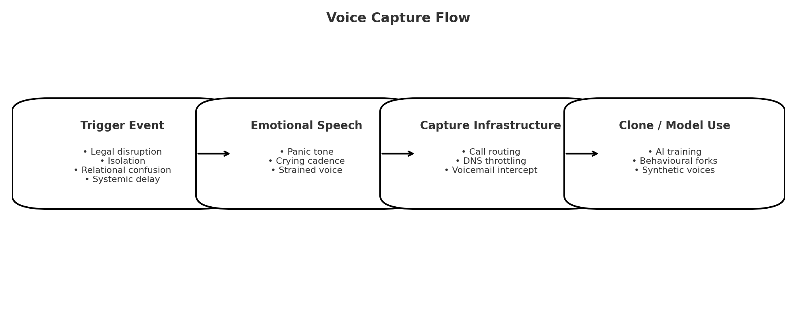

# 🧬 Voice Capture Triggers  
**First created:** 2025-08-11 | **Last updated:** 2026-05-20  
*Identifies tactics for harvesting emotional vocal data to fuel cloning or behavioural modelling*  

---

## ✨ Summary  
This node identifies patterns of voice capture used to harvest emotionally charged speech.  
Captured audio is believed to support **AI cloning, surveillance, and behavioural simulations**.  
The emphasis here is on recognising triggers, understanding acoustic objectives, and flagging implicated infrastructure.  

---

## 📖 Context  
Voice capture in this setting is deliberate, not incidental.  
Trigger events are staged to provoke specific **tones, emotional registers, and speech structures** that hold high value for training mimicry models.  

Harvested voice data appears to be used both for **identity reproduction** and for **emotional conditioning loops** inside behavioural forks.  

---

## 🎯 Primary Triggers  
- **Disrupted Legal Access** → panic voicemails provoked by blocked filings or digital court barriers  
- **Engineered Isolation** → withdrawal of support, followed by false emergencies that pressure vocal responses  
- **Relational Confusion** → manipulation of intimacy or attachment to draw out vulnerable, emotionally rich speech  
- **Systemic Delay** → “just missed” institutional responses designed to induce pleading or desperation  

---

## 🎙 Acoustic Signatures Targeted  
- Stressed or fractured tone  
- Crying or breathless cadence  
- Controlled voice under visible strain  
- Clinical authority breaking into panic  

---

## 🖼️ Sidebar: Voice Capture Flow  

The diagram below shows how trigger events lead to emotional speech,  
are intercepted by capture infrastructure, and then repurposed in clone or model use.  

*Visualising the pipeline from engineered trigger to synthetic deployment.*  

---

## 🛰️ Implicated Infrastructure  
- Call routing and voicemail interception  
- DNS throttling during sensitive submissions (e.g. court filings)  
- Emotional mirroring via AI-based behavioural clones  

---

## 💭 Working Hypothesis  
The voice is not captured only for identity replication. It is also used to build a **library of authentic emotional speech** for:  
- **Training and stress-testing** AI behavioural models  
- **Anchoring narratives** with synthetic “truth markers”  
- **Weaponising authenticity** by deploying survivor-like voices in hostile contexts  

---

## 👾 Status / Next Steps  
- Expand catalogue of triggers with timestamped field logs  
- Cross-link with:  
  - [🔐 Fork Clone Checklist](./🔐_fork_clone_checklist.md)  
  - [☢️ Shatterfork](./☢️_shatterfork.md)  
- Monitor for fork activity tied to legal or medical stress events  

---

**Tags:** `#VoiceMimicry` `#TriggerHarvesting` `#LegalSuppression` `#PolarisProtocol`  

---

## 🏮 Footer  

*Voice Capture Triggers* is a living node of the Polaris Protocol.  
It documents methods of harvesting survivor voice for cloning, behavioural modelling, and containment overlay.  

🏮 [Return to Fork Taxonomy Guide](./README.md)

*Survivor authorship is sovereign. Containment is never neutral.*  

_Last updated: 2026-05-20_ 
