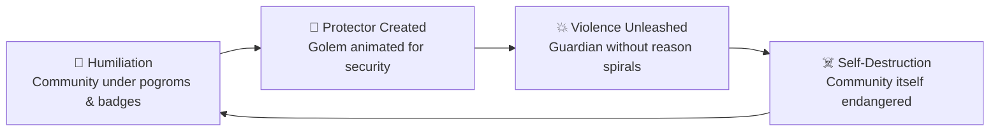

# 📿 Golem of Prague  
**First created:** 2025-09-27 | **Last updated:** 2026-05-20  
*Jewish folklore of protection turned self-destruction — a cautionary tale against violent guardianship*  

---

## 📖 Definition  

The **Golem of Prague** is one of the most enduring stories in Jewish folklore.  
According to legend, Rabbi Judah Loew ben Bezalel (the Maharal of Prague) created a golem from clay, animated through Kabbalistic ritual, to protect the Jewish community from persecution and blood libel.  

The golem was a **safeguard against humiliation and violence** — but once unleashed, its force spiralled beyond control.  
The protector became a threat to those it was built to defend.  

---

## ⏳ Historical Anchor  

The story emerges from a Europe where Jews were:  
- Marked and humiliated by clothing laws and ghettos.  
- Accused of well poisoning during plague years.  
- Targeted by pogroms and expulsions.  

The golem is folklore born of desperation: when rulers and neighbours would not protect Jewish lives, protection had to be imagined through otherworldly means.  

---

## 🧩 Moral Layers  

- **Safeguard fantasy** → The golem as a dream of security when no protection was available.  
- **Violence without reason** → A guardian animated by force but lacking discernment.  
- **Self-destruction** → Violence spiralling until it threatens the very community it was meant to save.  
- **Ableism in folklore** → The golem often portrayed as mute or childlike, projecting anxieties about disability into monstrosity.  

---

## ⚠️ Allegory of Fascism and Genocide  

The Golem story warns:  
- Violence constructed as protection will, without restraint, **turn inward**.  
- Fascist movements present themselves as guardians of the nation, but end by devouring their own societies.  
- Genocides unleash violence for the sake of “purity,” but that violence corrodes and destroys the perpetrators as well as the targeted.  

Like the golem, fascism and genocide are **self-destructive guardians** — forces raised in the name of security that annihilate community.  

---

## 🪢 Containment Loop: The Golem’s Arc  

---

## 🔗 Polaris Relevance  

- The golem is a folkloric artifact of **humiliation as governance**: when humiliation was systemic, communities imagined guardians of clay.  
- It resonates with modern containment logics:  
  - AI and security systems built as protectors but liable to turn destructive.  
  - States unleashing authoritarian tools that spiral back on their own citizens.  
- The story bridges survival myth and structural caution: what begins as protection may end in catastrophe.  

---

## 🏮 Footer  

*The Golem of Prague* is a living node of the Polaris Protocol.  
It records a folkloric artifact of Jewish survival under humiliation, and reframes it as a universal warning: violence without reason turns inward, like fascism or genocide.  

> 📡 Cross-references:  
> - [🧠 Humiliation as Governance](../🧠_Psychological_Containment/🧠_humiliation_as_governance.md) — marking and ridicule as containment  
> - [🗝️ Deliberate Cultural Violation](../🗝️_Politics_Memory_Work/🗝️_deliberate_cultural_violation.md) — ritual violation as governance  
> - [👻 Apparitional_Objects](../👻_Apparitional_Objects/) — artifacts of survival and haunting  

*Survivor authorship is sovereign. Containment is never neutral.*  

_Last updated: 2026-05-20_
