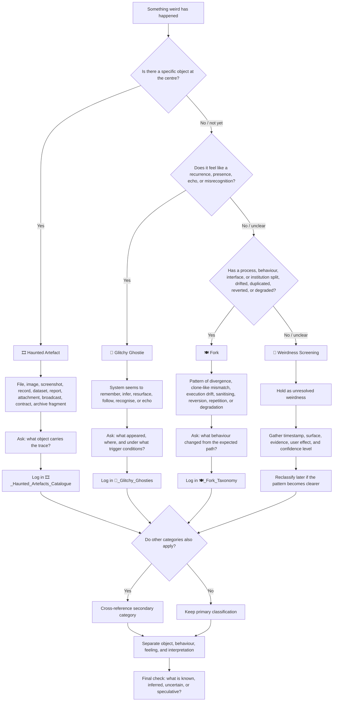

# 🧿 Which Apparitional Object Is This?  
**First created:** 2026-05-29 | **Last updated:** 2026-05-29  
*A quick classification flowchart for deciding whether an anomaly is best logged as a ghost, fork, or haunted artefact.*

---

## 🛰️ Orientation

This node helps classify apparitional weirdness without jumping too quickly to conclusions.

Use it when something feels strange, recursive, haunted, glitchy, duplicated, altered, vanished, resurfaced, or behaviourally “off” — but the mechanism is not yet clear.

The goal is simple:

```text
Name the pattern.
Preserve the evidence.
Avoid overclaiming intent.
```

This is not a certainty machine.

It is a routing aid.

---

## 🧭 Quick Flowchart



---

## 👻 If It Feels Like A Presence

Start with **Glitchy Ghosties** if the anomaly feels like something has appeared.

This may include:

- algorithmic déjà vu
- resurfacing old material
- uncanny recommendations
- phantom social graphs
- metadata shadows
- a system seeming to “know” something
- the past behaving like it is still present

Core question:

> What appeared?

Use when the main experience is:

```text
Something seems to be recurring, recognising, remembering, following, or echoing.
```

Likely destination:

```text
👻_Glitchy_Ghosties/
```

---

## 🍽️ If It Behaves Like A Split

Start with **Fork Taxonomy** if the anomaly behaves like a process has diverged.

This may include:

- duplicated behaviour
- execution drift
- clone-like mismatch
- repeated reversion
- subtle sanitising
- degraded follow-through
- compliance in form but not substance
- shutdown behaviour that reveals deeper instability

Core question:

> What pattern is it following?

Use when the main experience is:

```text
Something has forked away from what it was supposed to be doing.
```

Likely destination:

```text
🍽️_Fork_Taxonomy/
```

---

## 🎞️ If There Is A Trace-Object

Start with **Haunted Artefacts Catalogue** if there is a concrete object carrying the trace.

This may include:

- a file
- an image
- a report
- a dataset
- a contract
- a screenshot
- a broadcast
- an attachment
- a redacted record
- a corrupted document
- an archive fragment

Core question:

> What object carries the trace?

Use when the main experience is:

```text
There is an artefact that shows alteration, suppression, persistence, disappearance, or return.
```

Likely destination:

```text
🎞️_Haunted_Artefacts_Catalogue/
```

---

## 🩻 If It Does Not Classify Cleanly

Some weirdness should not be forced into a category too early.

If the anomaly does not clearly fit as a ghost, fork, or haunted artefact, hold it under **Weirdness Screening** until more evidence appears.

Use this holding pattern when:

- the evidence is thin
- the mechanism is unclear
- the pattern has not repeated
- the object is missing
- the user effect is strong but the trace is weak
- the event could have multiple ordinary explanations

Core question:

> What can be safely recorded without over-interpreting?

Likely destination:

```text
../🩻_Weirdness_Screening/
```

---

## 🧿 Classification Rules

### 1. Choose the primary mechanism

Do not classify by vibe alone.

Ask what is doing the work:

| Main mechanism | Classification |
|---|---|
| Presence, recurrence, echo, misrecognition | 👻 Ghostie |
| Split, drift, degradation, duplication, reversion | 🍽️ Fork |
| File, record, image, screenshot, document, dataset | 🎞️ Haunted Artefact |
| Unclear anomaly needing triage | 🩻 Weirdness Screening |

---

### 2. Let categories overlap without collapsing them

Many cases will involve more than one category.

Example:

```text
A file disappears, then reappears with altered metadata.
```

Possible classification:

- Primary: 🎞️ Haunted Artefact, because the file is the trace-object.
- Secondary: 👻 Ghostie, because the return has a haunting pattern.
- Possible tertiary: 🍽️ Fork, if the handling process repeatedly degrades or reverts.

The point is not to pick one label forever.

The point is to preserve the structure of the weirdness.

---

### 3. Separate observation from interpretation

A useful apparitional log distinguishes:

```text
What happened.
What it felt like.
What evidence remains.
What interpretation is justified.
What remains uncertain.
```

This protects the record from both panic and dismissal.

---

## ⚖️ Interpretation Safety Notes

Apparitional behaviour can feel personal, especially inside opaque systems.

But classification must stay disciplined.

Do not assume:

- intent from weirdness alone
- coordination from repetition alone
- malice from friction alone
- innocence from automation alone
- neutrality from institutional language alone

The safest working standard is:

> Treat the anomaly as meaningful.  
> Do not overclaim what caused it.

This keeps the analysis useful later.

---

## 🧪 Minimum Capture Fields

When logging an apparitional object, capture:

| Field | Prompt |
|---|---|
| Timestamp | When did it happen? |
| Surface | Where did it appear? |
| Object / behaviour | What exactly was observed? |
| Trigger conditions | What happened immediately before it appeared? |
| Manifestation | What changed, appeared, vanished, repeated, or degraded? |
| User effect | What confusion, pressure, delay, fear, or friction did it create? |
| Residual evidence | Screenshot, file, quote, metadata, link, witness note, archive trace |
| Confidence level | Known, inferred, uncertain, speculative |
| Initial classification | Ghostie, Fork, Haunted Artefact, or Weirdness Screening |
| Secondary links | Any overlapping category worth cross-referencing |

---

## 🗺️ Routing Summary

```text
Does an object carry the trace?
→ 🎞️_Haunted_Artefacts_Catalogue/

Does something feel like a recurrence, presence, echo, or misrecognition?
→ 👻_Glitchy_Ghosties/

Has behaviour split, drifted, degraded, duplicated, sanitised, or reverted?
→ 🍽️_Fork_Taxonomy/

Is the evidence too unclear to classify safely?
→ ../🩻_Weirdness_Screening/
```

---

## 🌌 Constellations

🧿 👻 🍽️ 🎞️ 🩻 — classification aid; apparitional diagnostics; weirdness triage; trace, presence, and behaviour routing.

---

## ✨ Stardust

apparitional objects, classification flowchart, ghost behaviour, fork taxonomy, haunted artefacts, weirdness screening, anomaly triage, metadata drift, behavioural distortion, evidence logging

---

## 🏮 Footer

*🧿 Which Apparitional Object Is This?* is a living node of the **Polaris Protocol**.  
It provides a quick classification flowchart for routing ghost-like, fork-like, and trace-bearing anomalies within the Signs & Symptoms sequence.

> 📡 Cross-references:
>
> - [👻 Apparitional Objects](./README.md) — *parent routing shelf for ghost-like, fork-like, and trace-bearing anomalies*
> - [👻 Glitchy Ghosties](./👻_Glitchy_Ghosties/) — *ghost-like system presences, recurrences, misrecognitions, and phantom inferences*
> - [🍽️ Fork Taxonomy](./🍽️_Fork_Taxonomy/) — *behavioural distortion patterns across complex systems*
> - [🎞️ Haunted Artefacts Catalogue](./🎞️_Haunted_Artefacts_Catalogue/) — *evidence-objects carrying traces of suppression, alteration, persistence, or return*
> - [🩻 Weirdness Screening](../🩻_Weirdness_Screening/) — *early-stage recognition and triage for anomalous system behaviour*

*Survivor authorship is sovereign. Containment is never neutral.*

_Last updated: 2026-05-29_
