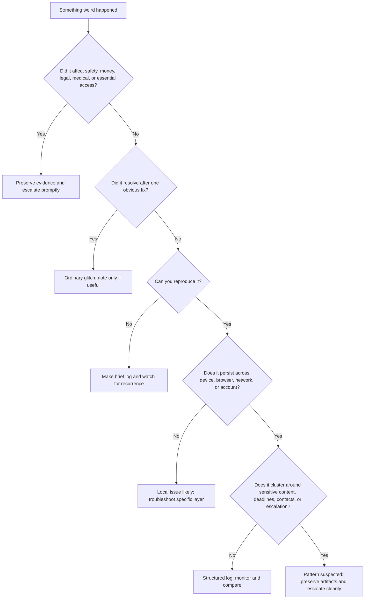
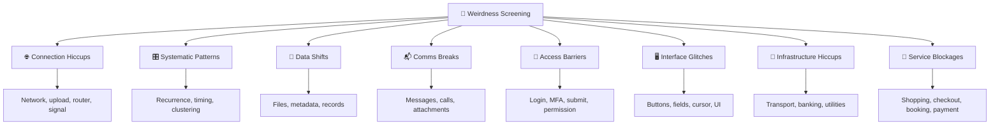

# 🩻 Weirdness Screening  
**First created:** 2025-09-12 | **Last updated:** 2026-05-30  
*First-notice tools for sorting ordinary glitches, persistent anomalies, patterned interference, and escalation-worthy digital weirdness.*

---

## 🌱 Purpose

This folder is for the first moment when something feels off.

A button will not click.
A message vanishes.
A login loops.
A file changes.
A payment fails.
The Wi-Fi collapses at exactly the wrong time.

Most weird digital events are not sabotage.

Some are boring bugs, exhausted devices, bad networks, cached scripts, stale sessions, app updates, overloaded servers, or human error.

But some weirdness repeats.

This cluster gives people a calm way to:

* try the obvious small fixes first,
* reduce unnecessary panic,
* preserve useful evidence,
* notice recurrence,
* compare across systems,
* and escalate cleanly when the pattern or impact deserves it.

The working principle is simple:

> Do not jump straight to conspiracy.
> Do not gaslight yourself either.
> Test, record, compare, then decide.

---

## 🧭 What This Folder Is For

Use this folder when the problem is still at the “is this just weird?” stage.

It is especially useful for:

* digital glitches that interrupt communication, access, uploads, records, payments, or services;
* problems that happen around sensitive material, legal deadlines, complaints, evidence, or public escalation;
* repeated failures across different devices, browsers, networks, or accounts;
* situations where someone needs a practical checklist before deciding whether to log or escalate.

This is not a place to declare certainty from one event.

It is a triage shelf: first aid for weird systems.

---

## 🧰 The Basic Screening Method

### 1. Name the symptom plainly

Start with what happened, not what you think caused it.

Good:

* “Submit button stayed grey after all required fields were completed.”
* “Attachment showed as sent but recipient did not receive it.”
* “Login accepted password, then returned to MFA three times.”
* “File modified date changed, but I did not edit it.”

Less useful:

* “They blocked me.”
* “The system attacked me.”
* “Someone rewrote everything.”

That may or may not be true.

The record needs the observable event first.

---

### 2. Try the obvious small fixes

Before logging something as suspicious, test the boring possibilities.

Common quick fixes:

* refresh the page;
* restart the app;
* try another browser;
* try private/incognito mode;
* disable extensions or ad blockers;
* clear cache for that site;
* switch Wi-Fi/mobile data;
* try a different device;
* check service-status pages;
* check whether other users are reporting the same issue;
* wait briefly, then retry once.

This is not surrender.

This is evidence discipline.

If the problem disappears after one obvious fix, note it if useful and move on.

If the problem repeats, clusters, or reappears at meaningful moments, start recording.

---

### 3. Record the minimum useful evidence

You do not need a laboratory to make a useful record.

Capture:

* date and time, including timezone;
* device, operating system, browser or app version;
* network used, such as Wi-Fi, mobile data, VPN, or public network;
* exact page, app, service, or route;
* what you were trying to do;
* what happened instead;
* exact error text or code;
* screenshots or screen recording;
* whether it happened again;
* whether it happened on another device, account, browser, or network;
* any relevant deadline, message, upload, filing, or escalation nearby.

The point is not to prove everything immediately.

The point is to stop the event evaporating.

---

### 4. Compare before escalating

One weird event is a dot.

Three similar events are a line.

A repeated failure across time, systems, accounts, or sensitive contexts may be a pattern.

Compare:

* Does it happen only with one app, or across multiple apps?
* Does it happen only when logged in?
* Does it happen only on one device?
* Does it happen only on one network?
* Does it happen around particular topics, contacts, files, deadlines, or locations?
* Does it resolve when using another route?
* Does it recur at similar times of day or week?
* Do other people see the same thing?

Escalation is strongest when it is based on recurrence, contrast, and clean records.

---

## 🚦 Triage Levels

### 🟢 Level 1 — Ordinary Glitch

Likely ordinary if:

* it happens once;
* there is a known outage;
* it resolves after refresh, restart, cache clear, or browser switch;
* the same problem affects many unrelated users;
* the error message is specific and consistent with normal failure.

Action:

* fix and move on;
* optionally make a brief note if it interrupted something important.

---

### 🟡 Level 2 — Worth Logging

Worth logging if:

* it interrupts a meaningful task;
* it repeats more than once;
* it affects evidence, forms, messages, uploads, payments, or access;
* it has no clear error explanation;
* it happens near a deadline or escalation point;
* it behaves differently across accounts, devices, networks, or people.

Action:

* save screenshots;
* record exact timestamps;
* test one alternate route;
* add it to the relevant folder.

---

### 🟠 Level 3 — Pattern Suspected

Treat as pattern-suspected if:

* the same failure repeats on a schedule;
* different systems fail in sequence;
* messages, files, access, and connection problems cluster together;
* the issue appears around sensitive content or contacts;
* the system works normally until a specific action is attempted;
* failures stop after public complaint, alternate routing, or external pressure.

Action:

* create a structured log;
* compare with other weirdness categories;
* preserve artifacts;
* avoid excessive retesting that could overwrite evidence;
* consider escalation to the platform, provider, institution, adviser, solicitor, union, regulator, or trusted technical reviewer.

---

### 🔴 Level 4 — Escalate Now

Escalate promptly if:

* you are locked out of essential services;
* records or evidence appear altered or missing;
* legal, medical, safeguarding, financial, or immigration deadlines are affected;
* money is lost or transactions are blocked without explanation;
* communications with advisers, courts, clinicians, journalists, or support networks are disrupted;
* multiple independent channels fail at once;
* someone’s safety or liberty may be affected.

Action:

* stop relying on the broken channel;
* use an alternate verified route;
* preserve evidence before changing settings;
* contact the relevant responsible body;
* seek human support if the incident is distressing or high-stakes.

---

## 🛑 Do Not Over-Test High-Stakes Systems

Testing is useful.

Over-testing can cause harm.

Do not repeatedly test legal, medical, banking, immigration, safeguarding, employment, or essential access systems if failure could create:

* lockouts;
* fraud flags;
* missed deadlines;
* duplicate submissions;
* overwritten records;
* altered timestamps;
* account freezes;
* escalation against you;
* or confusion about which version is authoritative.

For high-stakes failures:

1. preserve the failure state;
2. screenshot or record once if safe;
3. try one sensible alternate route;
4. document what happened;
5. escalate through a human or formal channel.

Do not keep banging on a door that is turning your evidence into mush.

---

## 📂 Folder Map

### [🌐 Connection Hiccups](./🌐_Connection_Hiccups/)

Use for network-level disruption.

Examples:

* Wi-Fi drops;
* mobile data failure;
* upload stalls;
* calls cut;
* router weirdness;
* packet loss;
* VPN or DNS oddities;
* time or sync drift linked to connection behaviour.

Good first tests:

* switch Wi-Fi/mobile data;
* run a speed test;
* try another network;
* restart router;
* compare with another device;
* check provider outage pages.

Record signal strength, network type, upload/download behaviour, and whether the problem follows the device, account, location, or content.

---

### [🎛 Systematic Patterns](./🎛_Systematic_Patterns/)

Use when the important feature is repetition.

Examples:

* the same problem every morning;
* glitches before or after specific posts;
* repeated upload failure at a particular percentage;
* recurring lockouts around deadlines;
* several systems failing in a recognisable sequence.

Good first tests:

* make a timeline;
* record exact recurrence;
* compare days and times;
* note public events, deadlines, posts, filings, or messages nearby.

This is the “is the weirdness behaving?” folder.

---

### [📂 Data Shifts](./📂_Data_Shifts/)

Use when records, files, metadata, or attachments change.

Examples:

* missing files;
* altered timestamps;
* vanished attachments;
* changed filenames;
* reverted drafts;
* duplicate records;
* version history oddities;
* exports missing content.

Good first tests:

* check version history;
* compare local and cloud copies;
* export a fresh copy;
* check trash/archive folders;
* compare file size and modified date;
* preserve screenshots before opening or resaving repeatedly.

This folder is for protecting memory against quiet drift.

---

### [📬 Comms Breaks](./📬_Comms_Breaks/)

Use when messages, calls, attachments, or conversations fail.

Examples:

* email not received;
* attachment stripped;
* message says delivered but is absent;
* call cuts mid-sentence;
* voice note disappears;
* replies arrive out of order;
* read receipts disagree between users.

Good first tests:

* confirm with sender/recipient;
* resend through another channel;
* check spam, filters, blocked contacts, storage limits;
* compare screenshots from both sides;
* preserve headers, bounce messages, or delivery reports.

This folder is for silence that arrives too neatly.

---

### [🔑 Access Barriers](./🔑_Access_Barriers/)

Use when legitimate access is blocked or looped.

Examples:

* login rejected;
* MFA loops;
* password reset fails;
* submit button fails after authentication;
* account works but functions are disabled;
* VPN/proxy access blocked;
* “security” prompts never resolve.

Good first tests:

* check credentials carefully;
* try another browser or device;
* disable password-manager autofill;
* clear site cookies;
* check time/date settings;
* try without VPN;
* record exact step where the loop begins.

This folder is for the point where security language becomes obstruction.

---

### [🖥 Interface Glitches](./🖥_Interface_Glitches/)

Use when the visible interface misbehaves.

Examples:

* buttons vanish;
* fields lock;
* cursor jumps;
* text deletes itself;
* menus flicker;
* invisible overlays block clicks;
* forms appear complete but cannot submit.

Good first tests:

* reset zoom;
* try an alternate browser;
* compare mobile versus desktop view;
* disable extensions;
* check whether the issue appears before or after typing specific content;
* screen-record the attempt if safe.

This folder is for the screen saying “yes” while the system says “no.”

---

### [🚉 Infrastructure Hiccups](./🚉_Infrastructure_Hiccups/)

Use when external public or service infrastructure fails.

Examples:

* trains delayed;
* ATMs down;
* payment terminals fail;
* utility interruptions;
* public gates, lifts, ticketing, or transport apps stop working;
* local services fail during important events.

Good first tests:

* check official service updates;
* compare with local reports;
* note start and end times;
* keep receipts, ticket references, photos, and route details.

This folder is for the world outside the device stuttering at meaningful moments.

---

### [🛒 Service Blockages](./🛒_Service_Blockages/)

Use when consumer services block access to goods, payments, bookings, or orders.

Examples:

* cart empties;
* item always “out of stock”;
* checkout fails;
* valid card rejected;
* booking disappears;
* delivery options vanish;
* account-specific price or availability changes.

Good first tests:

* try guest checkout;
* try another payment method;
* try another retailer;
* compare postcode, browser, account, or device;
* screenshot listing, cart, checkout, and error page.

This folder is for economic friction that may be ordinary logistics — or may not be.

---

## 🧾 Minimal Weirdness Log

Use this when you do not know where else to start.

```yaml
when: 2026-05-30T18:42:00+01:00
category: "unknown / connection / comms / access / data / interface / infrastructure / service"
service: ""
device: ""
network: ""
action_attempted: ""
symptom: ""
error_text: ""
first_seen: ""
repeat_count: ""
tested_fixes:
  - ""
cross_checks:
  other_browser: null
  other_device: null
  other_network: null
  other_account: null
artifacts:
  - ""
context: ""
impact: ""
next_step: ""
```

---

## 🧪 Quick Decision Tree



---

## 🧯 Grounding Rules

When dealing with weird digital shit, the nervous system can go loud.

Use these rules:

1. **Observable first.**
   Record what happened before naming why.

2. **One fix at a time.**
   Do not change ten variables and then lose the evidence trail.

3. **Screenshots before resets.**
   Preserve the failure state before clearing cache, reinstalling, or deleting anything.

4. **Do not over-retest high-stakes systems.**
   Repeated attempts can trigger real lockouts, fraud flags, or overwrite logs.

5. **Use alternate channels for urgent matters.**
   If the normal route fails, do not keep pleading with the broken door.

6. **Pattern beats vibe.**
   A feeling can be a signal, but a timeline travels further.

7. **Boring explanations are allowed.**
   A benign cause does not make the experience fake. It just means the fix is easier.

8. **Escalation should be clean, not frantic.**
   The stronger the record, the less you need to shout.

---

## 🧷 When To Escalate, And To Whom

Escalate based on the system affected.

| Problem area                     | First escalation route                                                       |
| -------------------------------- | ---------------------------------------------------------------------------- |
| Account lockout                  | Platform support, institution IT, account recovery                           |
| Missing or altered records       | Data controller, records office, SAR/DSAR route, formal complaint            |
| Legal or court deadline affected | Solicitor, court office, adviser, documented alternate submission            |
| Medical communication failure    | GP practice, NHS trust PALS/complaints, clinical team by alternate route     |
| Payment or banking failure       | Bank, payment processor, merchant support                                    |
| Utility or transport disruption  | Provider complaint route, regulator if repeated                              |
| Evidence interference suspected  | Preserve copies, hash files if possible, seek trusted technical/legal review |

The escalation packet should include:

* one-paragraph summary;
* timeline;
* screenshots;
* error text;
* device/network details;
* impact;
* what fixes were tried;
* what remedy is needed.

Keep it boring.

Boring travels.

---

## 🗺 Skeleton Diagram



---

## 🌌 Constellations

🩻 🧰 🧿 🎛 🛰️ — first-notice diagnostics; calm triage; evidence discipline; pattern recognition; practical escalation.

---

## ✨ Stardust

digital weirdness, glitch triage, anomaly logging, evidence preservation, access failure, comms disruption, data integrity, interface failure, service blockage, escalation tools

---

## 🏮 Footer

*🩻 Weirdness Screening* is a living node of the **Polaris Protocol**.
It holds the first diagnostic doorway for strange digital, infrastructural, and service behaviours: not proof by panic, not dismissal by default, but disciplined screening between ordinary failure and patterned obstruction.

> 📡 Cross-references:
>
> * [🌐 Connection Hiccups](./🌐_Connection_Hiccups/) — *network, upload, signal, and router-level anomalies*
> * [🎛 Systematic Patterns](./🎛_Systematic_Patterns/) — *recurrence mapping and timing analysis*
> * [📂 Data Shifts](./📂_Data_Shifts/) — *record integrity, metadata drift, and missing files*
> * [📬 Comms Breaks](./📬_Comms_Breaks/) — *message, call, and attachment disruption*
> * [🔑 Access Barriers](./🔑_Access_Barriers/) — *login, MFA, permission, and submission barriers*
> * [🖥 Interface Glitches](./🖥_Interface_Glitches/) — *visible UI refusal, cursor oddities, and broken forms*
> * [🚉 Infrastructure Hiccups](./🚉_Infrastructure_Hiccups/) — *public service, transport, payment, and utility disruptions*
> * [🛒 Service Blockages](./🛒_Service_Blockages/) — *checkout, booking, stock, and consumer access failures*

*Survivor authorship is sovereign. Containment is never neutral.*

*Last updated: 2026-05-30*
