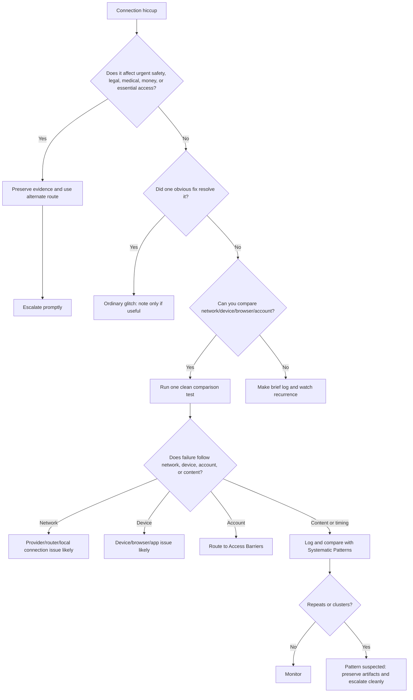

# 🌐 Connection Hiccups

**First created:** 2025-09-16 | **Last updated:** 2026-05-30
*Network, upload, router, signal, and data-flow triage for when connection failure becomes more than “bad Wi-Fi.”*

---

## 🌱 Purpose

This folder is for connection problems that interrupt ordinary digital life.

The Wi-Fi drops.
The mobile signal collapses.
The upload stalls at 99%.
The call cuts out.
The router behaves oddly.
The VPN will not connect.
The page loads for everyone else but not for you.

Most connection hiccups are ordinary.

Routers fail.
Apps hang.
Mobile networks wobble.
DNS gets weird.
Public Wi-Fi is often rubbish.
VPNs cause conflicts.
Uploads fail because files are large, sessions expire, or servers are overloaded.

But connection failures can also become meaningful when they repeat, cluster, or appear around sensitive actions.

This folder gives people a calm method for deciding whether a connection issue is:

* a normal service problem;
* a local device or router issue;
* an app or account-specific problem;
* a network-level routing issue;
* a recurring anomaly worth logging;
* or a high-impact access failure that needs escalation.

The aim is practical: fix the obvious thing first, then record cleanly if the hiccup keeps behaving.

---

## 🧭 What Belongs Here

Use this folder for problems involving movement of data between device, network, app, and service.

Examples include:

* Wi-Fi dropping repeatedly;
* mobile data working while Wi-Fi fails, or vice versa;
* uploads freezing, vanishing, or failing near completion;
* downloads corrupting or stopping;
* video calls cutting out;
* voice calls dropping mid-conversation;
* DNS or routing oddities;
* VPN or proxy connection failures;
* router instability;
* phantom devices or unfamiliar SSIDs;
* time sync problems linked to connection failure;
* one site or app unreachable while the rest of the internet works;
* connection problems that repeat around particular files, contacts, topics, places, or deadlines.

If the issue is mainly about login, MFA, or account permission, route to:

```text
../🔑_Access_Barriers/
```

If the issue is mainly about a missing message, stripped attachment, or broken conversation, route to:

```text
../📬_Comms_Breaks/
```

If the issue is mainly about a visible button, cursor, text box, or page element, route to:

```text
../🖥_Interface_Glitches/
```

If the issue is mainly about a repeating schedule, route to:

```text
../🎛_Systematic_Patterns/
```

Connection Hiccups is for the pipe.

Other folders may handle what happens at either end of the pipe.

---

## 🧰 Obvious Small Fixes First

Before treating a connection hiccup as suspicious, try the boring checks.

### Basic checks

* Toggle Wi-Fi off and on.
* Toggle mobile data off and on.
* Restart the app or browser.
* Refresh the page once.
* Restart the device.
* Restart the router if it is your own.
* Move closer to the router.
* Check whether the problem affects other websites or apps.
* Check whether other people on the same network are affected.
* Check the provider or platform status page.
* Try again without VPN or proxy.
* Try another browser.
* Try another device.
* Try another network.

### For uploads

* Check file size.
* Rename the file with a simple filename.
* Try a smaller test file.
* Try a different browser.
* Try wired connection if available.
* Keep the original file untouched.
* Do not repeatedly upload high-stakes evidence if failed attempts could create duplicate, corrupted, or confusing records.

### For calls

* Turn video off and continue audio-only.
* Switch Wi-Fi/mobile data.
* Try a different app.
* Ask the other person whether their connection also dropped.
* Record the time of the cut.
* Note whether the call dropped during a particular topic, phrase, or action.

### For router weirdness

* Photograph router lights.
* Note device count if visible.
* Check for unknown devices if you know how.
* Change admin password if needed.
* Update firmware if safe and routine.
* Avoid factory reset until you have recorded anything strange you may need later.

The goal is not to dismiss the problem.

The goal is to avoid mistaking a stale router, bad session, or overloaded app for a pattern before you have tested the obvious layer.

---

## 🧪 Quick Network Comparison Tests

Use comparison tests to locate the layer of failure.

| Test                            | What it helps distinguish                              |
| ------------------------------- | ------------------------------------------------------ |
| Same device, different network  | Local network problem vs device/app/account problem    |
| Different device, same network  | Device problem vs router/provider problem              |
| Same account, different browser | Browser/cache/extension issue vs account/service issue |
| Different account, same device  | Account-specific issue vs general service issue        |
| VPN on/off                      | Routing, geoblocking, or proxy-related failure         |
| Mobile data vs Wi-Fi            | ISP/router issue vs broader service issue              |
| Small upload vs original upload | File size/content/session issue                        |
| Public status check             | Known outage vs isolated failure                       |

Do not run every test every time.

Pick the smallest test that answers the next useful question.

One clean comparison is better than twelve frantic ones.

---

## 🧾 What To Record

For connection hiccups, record enough detail to compare later.

Useful details:

* date and time, including timezone;
* location, kept coarse unless precision is necessary;
* device and operating system;
* browser or app version;
* network type: Wi-Fi, mobile data, public Wi-Fi, VPN, proxy, wired;
* internet provider or mobile network if known;
* action attempted;
* service or app affected;
* exact failure point;
* error text or code;
* upload/download percentage if relevant;
* call duration before cut;
* whether other sites or apps worked;
* whether other people were affected;
* what fixes were tried;
* screenshots, screen recordings, logs, or photos of router lights;
* whether the issue repeated.

For sensitive material, record the context carefully but avoid exposing more content than needed.

You can say:

```text
sensitive evidence upload
legal deadline communication
medical form submission
support call
whistleblowing material
```

You do not need to paste the whole sensitive content into the log.

---

## 🧾 Minimal Connection Log

```yaml id="q4ki61"
when: 2026-05-30T19:20:00+01:00
category: "connection_hiccup"
service_or_app: ""
action_attempted: ""
device: ""
os_browser_app: ""
network_type: "wifi / mobile_data / public_wifi / vpn / proxy / wired"
provider_or_network: ""
symptom: ""
failure_point: ""
error_text: ""
duration: ""
upload_download_stage: ""
call_stage: ""
other_services_worked: null
other_people_affected: null
tested_fixes:
  - ""
comparison_tests:
  same_device_different_network: null
  different_device_same_network: null
  vpn_on_off: null
  different_browser: null
  different_account: null
artifacts:
  - ""
context: ""
impact: ""
next_step: ""
```

---

## 🚦 When To Ignore, Log, Or Escalate

### 🟢 Ignore or lightly note

Usually safe to ignore if:

* it happens once;
* there is a known outage;
* it resolves after reconnecting;
* the router or provider is clearly unstable;
* the same issue affects many unrelated users;
* it does not affect anything important.

Action:

* fix and move on;
* make a quick note only if it interrupted something meaningful.

---

### 🟡 Log it

Log the hiccup if:

* it interrupts a meaningful upload, call, form, file transfer, or conversation;
* it happens more than once;
* it appears on one account but not another;
* it affects one site while the rest of the internet works;
* it happens around sensitive material or a deadline;
* it behaves differently across device, browser, network, or VPN;
* the same failure point repeats.

Action:

* capture screenshots or recordings;
* record exact timestamps;
* run one comparison test;
* save the log in the relevant folder or field log.

---

### 🟠 Pattern suspected

Treat as pattern-suspected if:

* connection failure repeats at similar times;
* upload failure occurs at the same percentage or stage;
* calls cut around specific topics, people, or moments;
* DNS, VPN, router, and app failures cluster together;
* the issue follows a person/account rather than a location or device;
* different services fail in sequence during an escalation window;
* the problem resolves when using an alternate route or public pressure.

Action:

* preserve artifacts;
* build a timeline;
* compare with related folders;
* avoid excessive retesting;
* seek technical review if the record is strong enough.

---

### 🔴 Escalate now

Escalate promptly if the connection failure affects:

* emergency communication;
* legal deadlines;
* medical access;
* safeguarding or safety;
* banking or essential payments;
* immigration or housing processes;
* evidence preservation;
* live proceedings, interviews, hearings, or appointments;
* contact with solicitors, advisers, clinicians, journalists, or support workers.

Action:

* stop relying on the failing route;
* use a verified alternate channel;
* preserve the failure evidence;
* contact the provider, institution, adviser, solicitor, or relevant support route;
* document the practical impact, not just the technical symptom.

---

## 🚩 Connection Red Flags

One red flag alone is not proof.

Several together deserve attention.

Watch for:

* upload failure only for specific files;
* repeated failure at the same upload percentage;
* calls cutting during specific topics or names;
* one account affected while another works normally;
* a site unreachable only from one location or network;
* router or DNS oddities clustering around sensitive work;
* device clock/time sync changing during connection problems;
* connection returning immediately after switching channel;
* failures clustered around legal, medical, complaint, media, or evidence activity;
* repeated “poor connection” explanations when signal and bandwidth look normal;
* disappearing upload confirmations or inconsistent server responses.

The question is not “can this happen normally?”

Many of these can happen normally.

The question is whether the behaviour repeats, clusters, or follows meaningful context.

---

## 🗂 Planned / Existing Nodes

| Node                                    | Scope                                                                 | Status             |
| --------------------------------------- | --------------------------------------------------------------------- | ------------------ |
| `🌐_bad_wifi_or_something_weirder.md`   | First triage for ordinary connection failure vs record-worthy anomaly | Planned            |
| `📤_upload_failure_triage.md`           | Upload stalls, failed submissions, disappearing transfers             | Planned            |
| `📞_call_drop_triage.md`                | Voice/video calls cutting out or degrading                            | Planned            |
| `🛰️_signal_drop_log_template.md`       | Field template for signal, place, time, and network symptoms          | Planned            |
| `🔁_router_restart_and_retest_guide.md` | Safe router-level checks without destroying useful evidence           | Planned            |
| `🧪_network_comparison_tests.md`        | Device/network/browser/account comparison methods                     | Planned            |
| `🚩_connection_red_flags.md`            | Pattern indicators and escalation cues                                | Planned            |
| `🛰️_field_interference_patterns.md`    | Local signal collapse linked to place or proximity                    | Existing / planned |
| `📡_protocol_shadowing.md`              | Degradation of encrypted or peer-to-peer channels                     | Existing / planned |
| `🔁_handshake_loopbacks.md`             | Infinite reconnects, token expiry, or transport loops                 | Existing / planned |
| `📞_ghost_call_drops.md`                | Calls terminating at significant moments                              | Existing / planned |
| `📤_upload_evaporation.md`              | Uploads vanishing near completion                                     | Existing / planned |
| `⏱️_timebase_desyncs.md`                | Timestamp or clock drift linked to connection events                  | Existing / planned |
| `🔄_router_memory_ghosts.md`            | Phantom SSIDs, cloned devices, or strange local network memory        | Existing / planned |
| `🧩_connectivity_mosaic.md`             | Aggregated map of connection anomalies across subtypes                | Existing / planned |

---

## 🧪 Suggested First-Build Set

For the first practical build, prioritise:

```text
🌐_bad_wifi_or_something_weirder.md
📤_upload_failure_triage.md
📞_call_drop_triage.md
🧪_network_comparison_tests.md
🚩_connection_red_flags.md
```

These five give users immediate help before the deeper forensic nodes are needed.

---

## 🗺 Mini Routing Diagram



---

## 🌌 Constellations

🩻 🌐 🛰️ 🌊 🎛 — network flow diagnostics; upload failure; signal interruption; timing patterns; practical triage.

---

## ✨ Stardust

connection failure, bad wifi, upload stall, call drop, packet loss, dns issue, router anomaly, signal collapse, network triage, connectivity logging

---

## 🏮 Footer

*🌐 Connection Hiccups* is a living node of the **Polaris Protocol**.
It anchors the network and data-flow layer of Weirdness Screening: the place where ordinary disconnection is tested first, recorded if persistent, and escalated when recurrence or impact makes the failure meaningful.

> 📡 Cross-references:
>
> * [🩻 Weirdness Screening](../README.md) — *parent triage doorway for ordinary glitches, persistent anomalies, and escalation-worthy weirdness*
> * [🎛 Systematic Patterns](../🎛_Systematic_Patterns/) — *recurrence, timing, and clustering analysis*
> * [📬 Comms Breaks](../📬_Comms_Breaks/) — *message, call, and attachment disruption after connection leaves the pipe*
> * [🔑 Access Barriers](../🔑_Access_Barriers/) — *login, MFA, token, and permission failures*
> * [📂 Data Shifts](../📂_Data_Shifts/) — *record, file, timestamp, and metadata anomalies*

*Survivor authorship is sovereign. Containment is never neutral.*

*Last updated: 2026-05-30*
