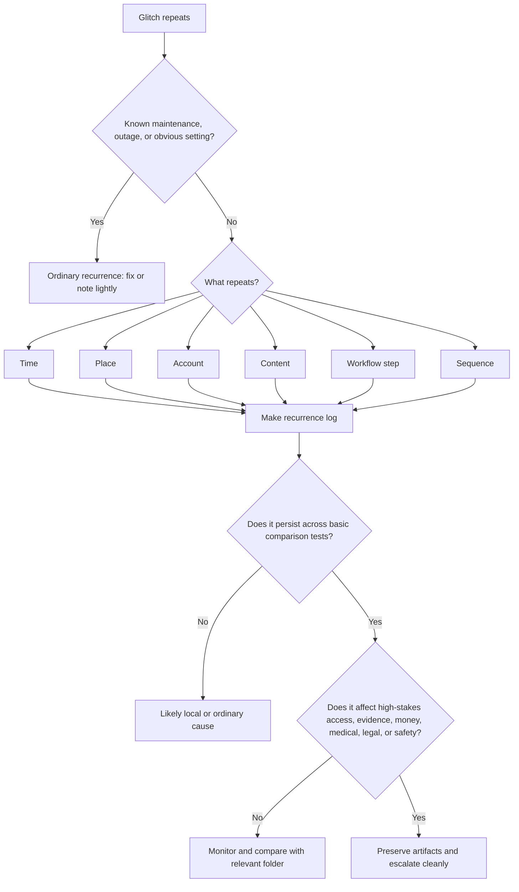

# 🎛 Systematic Patterns  
**First created:** 2025-09-16 | **Last updated:** 2026-06-03  
*Recurrence, timing, clustering, and comparison tools for when a glitch stops looking random.*  

---

## 🌱 Purpose

This folder is for weirdness that repeats.

One failed upload may be ordinary.
One dropped call may be bad signal.
One missing message may be app nonsense.
One locked account may be a stale token, password-manager conflict, or expired session.

But when the same kind of failure comes back — same time, same place, same account, same file type, same contact, same topic, same deadline — the recurrence itself becomes the thing to examine.

This folder helps people sort:

* ordinary repetition from meaningful recurrence;
* bad luck from pattern;
* local device problems from wider system behaviour;
* scattered anecdotes from usable timelines;
* “this keeps happening” from “this happens under these conditions.”

The aim is not to prove intention from repetition alone.

The aim is to make repetition legible.

---

## 🧭 What Belongs Here

Use this folder when the key feature is not the glitch itself, but the fact that it keeps happening.

Examples include:

* the same error at the same time of day;
* repeated upload failure at the same percentage;
* regular connection collapse before or after specific activity;
* recurring account lockouts near deadlines;
* messages failing only with certain contacts;
* records changing after particular submissions;
* forms failing only around complaint, legal, medical, safeguarding, or evidence workflows;
* several systems failing in a recognisable sequence;
* glitches that seem to follow a person, file, topic, device, location, or account;
* clusters of “small weird” that are too consistent to keep treating as isolated.

If the problem is mainly connection-level, route to:

```text
../🌐_Connection_Hiccups/
```

If it is mainly about missing messages, calls, or attachments, route to:

```text
../📬_Comms_Breaks/
```

If it is mainly about files, records, timestamps, or metadata, route to:

```text
../📂_Data_Shifts/
```

If it is mainly login, MFA, permission, or account access, route to:

```text
../🔑_Access_Barriers/
```

Systematic Patterns is for the rhythm.

Other folders handle the instrument.

---

## 🧰 Obvious Small Fixes First

Before treating recurrence as meaningful, check whether the repetition has a boring cause.

Common ordinary explanations include:

* scheduled platform maintenance;
* automatic backups;
* app updates;
* token expiry cycles;
* router lease renewal;
* VPN reconnect timing;
* device sleep settings;
* browser extensions;
* password-manager autofill loops;
* storage limits;
* rate limits;
* spam or security filters;
* server-side throttling during peak traffic;
* workplace, school, or institution IT policies.

Quick checks:

* check the service-status page;
* search whether other users report the same issue;
* check whether it happens outside peak hours;
* try another browser;
* try another device;
* try another network;
* try without VPN;
* try a different account if safe;
* check app update history;
* check whether scheduled backups, syncs, or automations are running.

A pattern can still matter even if it has a technical cause.

The question is whether the cause is ordinary, documented, and proportionate — or whether the behaviour remains oddly selective.

---

## 🧪 What Counts As A Pattern?

A pattern is not just “this happened more than once.”

A useful pattern has at least one repeatable feature.

### Time pattern

The issue occurs at a similar:

* time of day;
* day of week;
* point in the month;
* point before or after a known event;
* interval after posting, sending, uploading, or escalating.

Example:

```text
Upload failure occurs between 22:00 and 23:00 on three consecutive Sundays.
```

### Place pattern

The issue occurs in a similar:

* room;
* building;
* neighbourhood;
* workplace;
* public venue;
* transport route;
* Wi-Fi network;
* mobile coverage area.

Example:

```text
Signal collapses in the same venue during calls with support worker.
```

### Account pattern

The issue follows:

* one login;
* one email address;
* one phone number;
* one profile;
* one institutional account;
* one recovery method.

Example:

```text
Main account loops MFA, but secondary account logs in normally on the same device and network.
```

### Content pattern

The issue appears around:

* certain filenames;
* certain subjects;
* certain recipients;
* legal, medical, safeguarding, media, complaint, or evidence material;
* uploads containing particular document types;
* posts containing specific phrases or links.

Example:

```text
PDF uploads fail only when filename contains complaint reference.
```

### Sequence pattern

Several small failures happen in the same order.

Example:

```text
Wi-Fi drops, then upload fails, then login expires, then message does not send.
```

This is often the most useful kind of pattern because it shows choreography rather than isolated inconvenience.

---

## 🧾 What To Record

For systematic patterns, the record needs consistency more than drama.

Capture:

* date and time, including timezone;
* symptom;
* affected service or system;
* device, browser, app, and operating system;
* network type;
* account used;
* action attempted;
* exact error text or code;
* whether it repeated;
* what was similar to previous incidents;
* what was different;
* what fixes were tried;
* whether other people/accounts/devices were affected;
* nearby deadlines, posts, uploads, filings, calls, or public events;
* artifacts: screenshots, recordings, logs, exports, receipts, headers, photos.

The most important field is:

```text
what repeated?
```

Without that, a pattern log becomes a bucket of vibes.

With that, it becomes evidence architecture.

---

## 🧾 Minimal Recurrence Log

```yaml
when: 2026-05-30T19:45:00+01:00
category: "systematic_pattern"
pattern_name: ""
symptom: ""
service_or_system: ""
device: ""
network: ""
account: ""
action_attempted: ""
error_text: ""
repeat_number: 1
previous_occurrences:
  - ""
what_repeated:
  time: ""
  place: ""
  account: ""
  content: ""
  sequence: ""
  contact: ""
  deadline_or_context: ""
what_changed:
  - ""
tested_fixes:
  - ""
comparison_checks:
  other_device: null
  other_network: null
  other_account: null
  other_browser: null
artifacts:
  - ""
impact: ""
next_step: ""
```

---

## 🧮 Simple Pattern Counting

Do not start with complicated statistics.

Start with counting.

Useful starter questions:

* How many times has this happened?
* Over what time window?
* How many times did it not happen?
* What conditions were present when it happened?
* What conditions were absent when it did not happen?
* Does it happen more often around one system, topic, person, or deadline?
* Does the timing narrow or widen over time?
* Is the impact increasing?

A basic table is often enough.

| Date/time        | Symptom              | System | Context      | Fix tried        | Repeated feature      |
| ---------------- | -------------------- | ------ | ------------ | ---------------- | --------------------- |
| 2026-05-30 09:12 | Upload failed at 99% | Portal | Evidence PDF | Browser switch   | Same file type        |
| 2026-05-31 09:14 | Upload failed at 99% | Portal | Evidence PDF | Mobile data      | Same time + file type |
| 2026-06-01 09:10 | Upload failed at 99% | Portal | Evidence PDF | Different device | Same time + file type |

The pattern is not “the portal hates me.”

The pattern is:

```text
Upload failure repeats around 09:10–09:15, at 99%, with the same evidence PDF, across browser/network/device.
```

That travels further.

---

## 🚦 When To Ignore, Log, Or Escalate

### 🟢 Ordinary recurrence

Likely ordinary if:

* it matches known maintenance windows;
* many unrelated users report the same thing;
* it happens during peak traffic;
* it resolves after a routine update or setting change;
* it is explained by a clear device, router, app, or account setting;
* it has low impact.

Action:

* fix the underlying cause;
* note only if useful.

---

### 🟡 Worth logging

Log it if:

* it repeats more than twice;
* it affects important work;
* it happens under similar conditions;
* it is selective to one account, device, location, topic, or contact;
* it appears near deadlines or escalation points;
* it has no clear ordinary explanation;
* it creates practical harm or delay.

Action:

* use a recurrence log;
* collect comparable artifacts;
* test one variable at a time;
* avoid changing everything at once.

---

### 🟠 Pattern suspected

Treat as pattern-suspected if:

* the repetition survives basic fixes;
* it persists across device, network, browser, or account;
* multiple systems fail in sequence;
* failure timing aligns with sensitive activity;
* the same stage of a workflow repeatedly collapses;
* the issue resolves through alternate routes but returns in the original channel;
* others can reproduce or corroborate part of the pattern.

Action:

* build a timeline;
* preserve artifacts;
* compare with relevant child folders;
* seek technical or procedural review if impact warrants it.

---

### 🔴 Escalate now

Escalate promptly if the recurring failure affects:

* legal deadlines;
* medical care;
* safeguarding or safety;
* essential money or banking;
* housing, immigration, employment, or education access;
* evidence preservation;
* contact with advisers, solicitors, clinicians, journalists, or support workers;
* repeated denial of access to a required institutional process.

Action:

* stop relying solely on the failing route;
* use a verified alternate route;
* document the recurrence;
* state the practical impact;
* ask for a remedy, not just an explanation.

---

## 🛑 Do Not Over-Test Patterns

Pattern testing can become its own trap.

Do not keep hammering a high-stakes system just to prove it is broken.

Over-testing can create:

* account lockouts;
* fraud flags;
* duplicate records;
* corrupted uploads;
* altered timestamps;
* confusing audit trails;
* accusations of misuse;
* emotional escalation and exhaustion.

Good pattern testing is narrow.

Change one variable at a time:

```text
same device + different network
same network + different device
same device + different browser
same device + different account
same file renamed
same file smaller
same action at a different time
```

Then stop.

A clean comparison beats a panic spiral.

---

## 🚩 Systematic Pattern Red Flags

One red flag is not proof.

Several together deserve a proper record.

Watch for:

* same failure at the same workflow step;
* same failure at the same time or interval;
* same failure around specific people, topics, or files;
* failures that follow the account across devices and networks;
* failures that follow the file across accounts and networks;
* several systems failing in a consistent order;
* problems that appear during escalation and vanish afterward;
* vague error messages where specific ones should exist;
* official explanations that change between incidents;
* logs or records that disappear after the failure;
* failures that map onto deadlines, filings, evidence uploads, or public posts.

The key question:

```text
What is the repeated condition?
```

Not:

```text
Who do I think caused it?
```

Stay with the repeatable condition until the evidence can carry more.

---

## 🗂 Planned / Existing Nodes

| Node                                         | Scope                                                                 | Status             |
| -------------------------------------------- | --------------------------------------------------------------------- | ------------------ |
| `🎛_when_a_glitch_repeats.md`                | First guide to recognising recurrence without overclaiming            | Planned            |
| `🗓️_recurrence_log_template.md`             | Standard recurrence logging format                                    | Planned            |
| `🧮_simple_pattern_counting.md`              | Basic counting and comparison methods                                 | Planned            |
| `📊_timeline_overlay_template.md`            | Overlaying incidents with deadlines, posts, filings, or public events | Planned            |
| `🪞_same_time_same_place_same_failure.md`    | How to document repeated conditions                                   | Planned            |
| `🧪_testing_pattern_without_over_testing.md` | Safe comparison methods without spiralling                            | Planned            |
| `🚩_systematic_pattern_red_flags.md`         | Pattern indicators and escalation cues                                | Planned            |
| `🎚️_algorithmic_throttling_loops.md`        | Timed platform suppression or reach throttling patterns               | Existing / planned |
| `🛰️_signal_sync_glitchmap.md`               | Connection or GPS glitches aligned with field events                  | Existing / planned |
| `🧮_recurrence_rule_library.md`              | ICS/cron-style recurrence examples for logs                           | Existing / planned |
| `🪞_mirror_feedback_glitch.md`               | Repeated bounce-back effects from blocked or reposted content         | Existing / planned |
| `🗓️_scheduled_interference_casebook.md`     | Narrative and CSV records of scheduled anomaly windows                | Existing / planned |
| `💡_pattern_detection_tips.md`               | Practical guidance for noticing and coding recurrence                 | Existing / planned |
| `📊_pattern_visualisation_templates.md`      | Chart and markdown templates for anomaly cycles                       | Existing / planned |

---

## 🧪 Suggested First-Build Set

For the first practical build, prioritise:

```text
🎛_when_a_glitch_repeats.md
🗓️_recurrence_log_template.md
🧮_simple_pattern_counting.md
🧪_testing_pattern_without_over_testing.md
🚩_systematic_pattern_red_flags.md
```

These five give users the most immediate help: notice the repeat, log it consistently, count it simply, test safely, and decide whether it deserves escalation.

---

## 🗺 Mini Routing Diagram



---

## 🌌 Constellations

🩻 🎛 🧮 🗓️ 🛰️ — recurrence mapping; timing analysis; practical comparison; pattern discipline; escalation signals.

---

## ✨ Stardust

systematic anomalies, recurrence logging, pattern detection, repeated glitches, timing correlation, workflow failure, anomaly timeline, escalation evidence, comparison testing

---

## 🏮 Footer

*🎛 Systematic Patterns* is a living node of the **Polaris Protocol**.
It holds the recurrence layer of Weirdness Screening: the place where repeated failures are named carefully, counted plainly, compared safely, and escalated only when the pattern and impact justify it.

> 📡 Cross-references:  
>  
> - [🌐 Connection Hiccups](../🌐_Connection_Hiccups/README.md) — *network, upload, signal, and router-level anomalies*
> - [📂 Data Shifts](../📂_Data_Shifts/README.md) — *record integrity, metadata drift, and missing files*
> - [📬 Comms Breaks](../📬_Comms_Breaks/README.md) — *message, call, and attachment disruption*
> - [🔑 Access Barriers](../🔑_Access_Barriers/README.md) — *login, MFA, permission, and submission barriers*
> - [🖥 Interface Glitches](../🖥_Interface_Glitches/README.md) — *visible UI refusal, cursor oddities, and broken forms*
>  
> 🏮 Return To:  
>  
> - [🩻 Weirdness Screening](../README.md)  
> - [🌓 Signs & Symptoms](../../README.md)  
> - [🌌 Polaris Protocol - Root](../../../README.md)  

*Survivor authorship is sovereign. Containment is never neutral.*

_Last updated: 2026-06-03_
